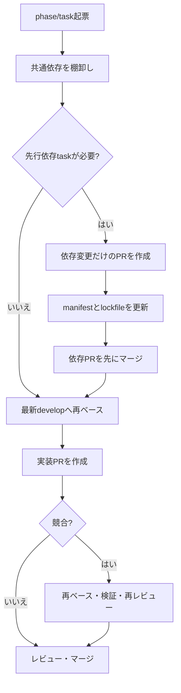

# 依存追加を伴う並行PRの運用ルール

この文書は、複数のPRで依存関係を同時に変更する場合の衝突を防ぐための運用ルールです。リポジトリ全体のレビュー手順は [レビュー方針](./review-policy.md)、作業全体の規約は [AGENTS.md](../AGENTS.md) を参照してください。

## 基本方針

- 依存パッケージの追加・更新は、原則として依存変更だけを扱う単独PRにする。
- `frontend/package.json` と `frontend/package-lock.json` のように、マニフェストとlockfileは同じPRで更新する。対象となる他のマニフェストでも同様とする。
- 実装PRは依存変更PRに依存することをPR本文に明記し、依存変更PRのマージ後に最新の`develop`から作業ブランチを更新して着手または再ベースする。
- phase/taskを起票するときは、並行して進むtaskが共通して必要とする依存を洗い出し、必要なら先行依存taskを作成する。依存taskを先にマージしてから、後続taskを開始する。
- 依存変更を含むPRが複数ある場合は、依存関係の順序に従ってマージする。後続PRは先行PRのマージ後に`develop`を取り込み、lockfileを含めて動作確認する。

## 適用手順

### 起票・着手前

- [ ] phase/taskの要件から、追加・更新が必要なパッケージを洗い出した。
- [ ] 同じ依存を必要とする並行taskを確認し、共通の依存変更を先行依存taskへ集約した。
- [ ] 作業開始前に`develop`の最新状態を取得し、作業ブランチへ取り込んだ。
- [ ] 実装PRが依存変更PRに依存する場合、PR本文に依存先とマージ順を記載した。

### 依存変更PR

- [ ] 依存変更以外の実装変更を混在させていない。
- [ ] package manifestと対応するlockfileを同じPRで更新した。
- [ ] 依存変更後のインストール、ビルド、テストを実行した。
- [ ] 後続PRの作業者が分かるよう、追加・更新理由と利用予定をPR本文に記載した。

### 依存変更PRのマージ後

- [ ] 後続PRのブランチを最新の`develop`へ再ベースまたは取り込みした。
- [ ] 再ベース後にlockfileの差分を確認し、必要な場合だけ依存コマンドを再実行した。
- [ ] コンフリクト解消後に依存インストール、ビルド、テストを再実行した。
- [ ] 解消内容が不明な場合は推測でマージせず、依存PRの作成者と確認してから修正した。

## 対象外

依存変更の競合をCIで自動検出する仕組みは今回の範囲外です。必要性、検出方法、導入コストは別途要検討とします。
