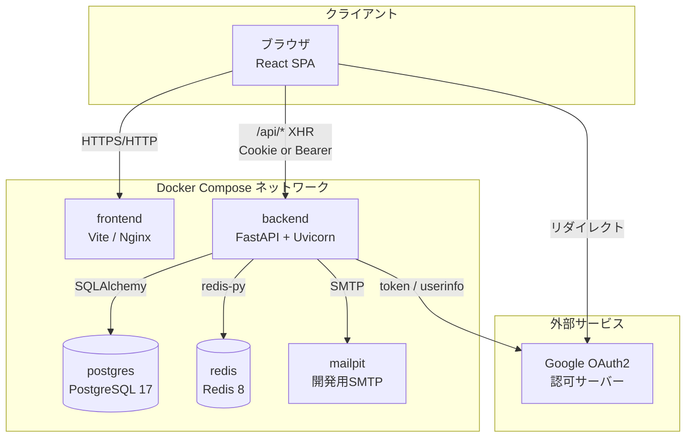
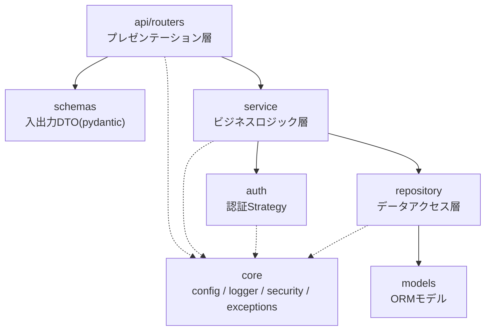
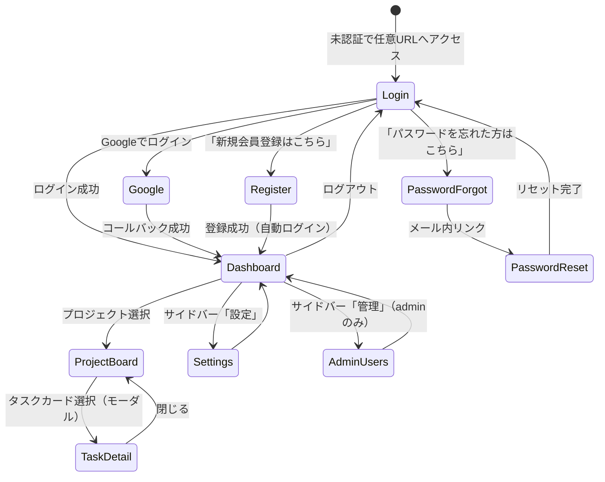
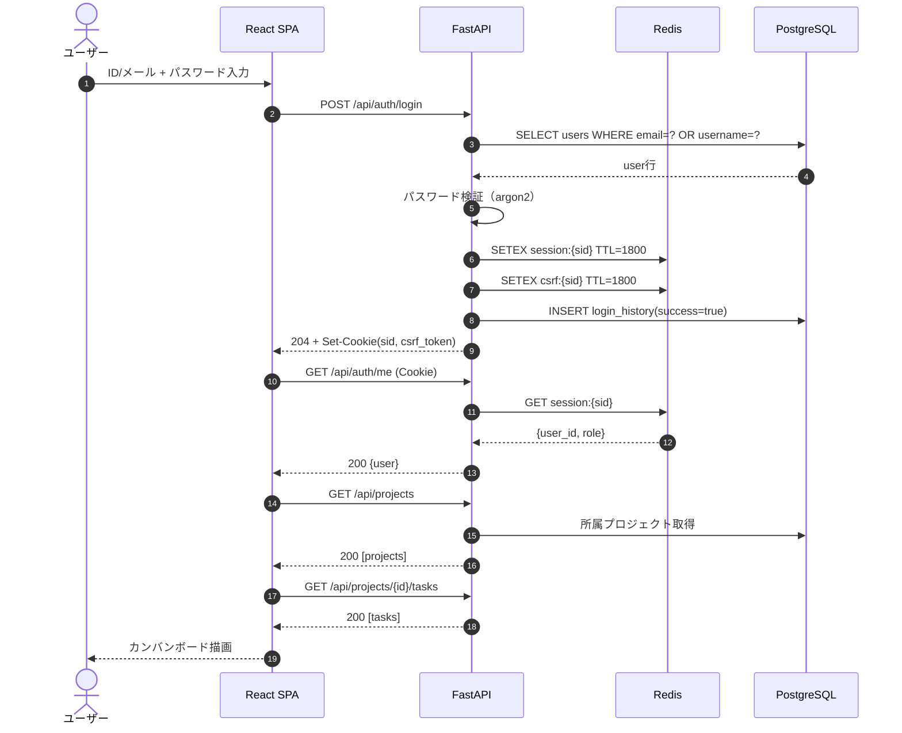
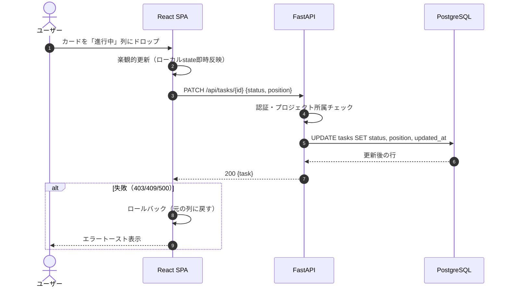
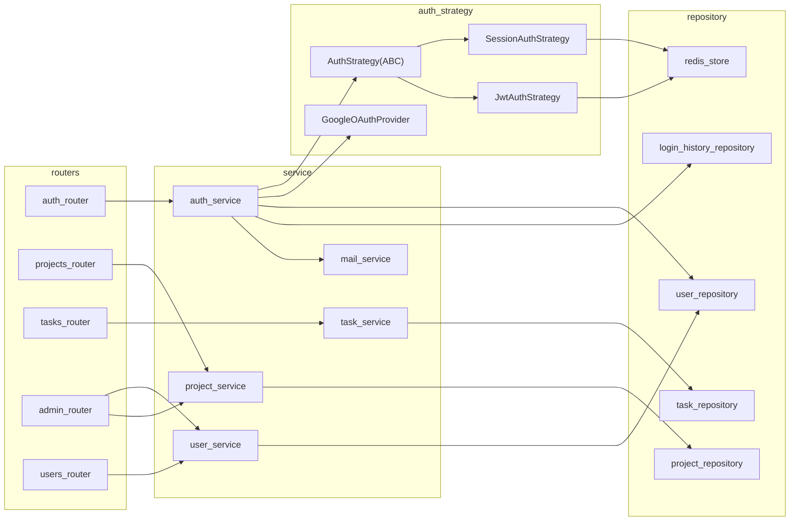
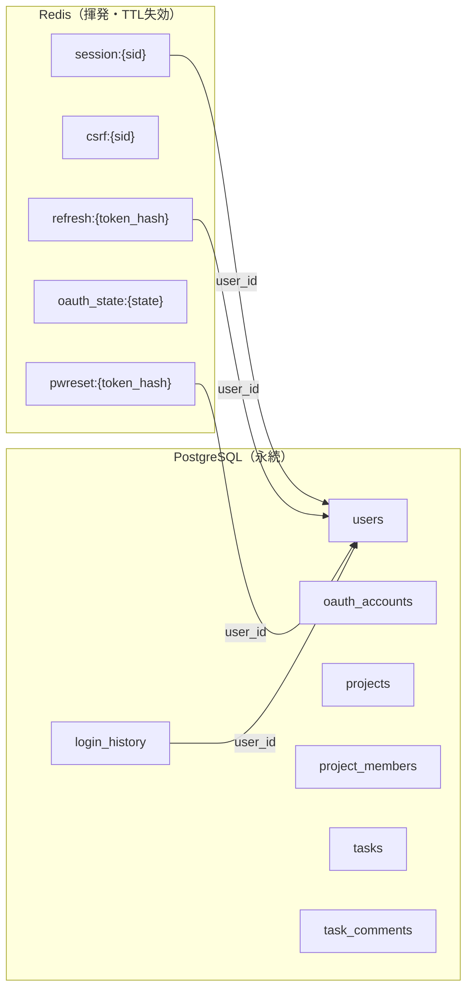

# 00 全体設計

## 1. システム概要

チームでプロジェクトを作成し、タスクをカンバン形式（未着手／進行中／完了）で管理するWebアプリケーション。
`AUTH_MODE` により session 方式 / JWT 方式を切り替え可能とし、加えて Google OAuth2 ログインを常時提供する。

| 項目 | 内容 |
|------|------|
| バックエンド | FastAPI（Python 3.14） |
| フロントエンド | React 19 + Vite + TypeScript（Node v26） |
| 永続データストア | PostgreSQL 17 |
| セッションストア | Redis 8（永続化なし） |
| ORM / マイグレーション | SQLAlchemy 2.x + Alembic |
| 認証方式 | session（Cookie + Redis） / JWT（Access + Refresh） / Google OAuth2 |
| CI/CD | GitHub Actions（CI: Lint・型チェック・テスト、CD: GHCR + self-hosted runner） |

## 2. 要件書からの設計判断一覧

要件定義書と画面イメージ（pptx）の間に差異があったため、以下のとおり合意して設計している。
（詳細は各設計書の該当章を参照）

| No | 論点 | 要件書 | pptx | 本設計での決定 | 影響 |
|----|------|--------|------|----------------|------|
| D-1 | パスワードリセット | メール送信は「スコープ外」 | slide3 にリセット画面あり | **メール送信まで含めて実装する**（SMTP連携） | [03_auth](./03_auth.md#6-パスワードリセット), [04_api](./04_api.md), [06](./06_infra_cicd.md) |
| D-2 | ユーザー属性 | users は id/email/password_hash/role/created_at のみ | 姓・名・フリガナ・生年月日を入力 | **pptx に合わせて users にカラム追加**。バリデーション（各30文字／メール50文字／パスワードポリシー）も設計に反映 | [01_database](./01_database.md#31-users), [05](./05_frontend.md) |
| D-3 | ログイン識別子 | email のみ | 「IDもしくはメールアドレス」 | **username カラムを追加し、email / username のどちらでもログイン可能にする** | [01_database](./01_database.md#31-users), [03_auth](./03_auth.md#41-パスワードログイン) |
| D-4 | 文字サイズ変更 | 記載なし | slide7 に設定項目あり | **フロントエンドの localStorage のみで保持**（DB・API変更なし） | [05_frontend](./05_frontend.md#8-アクセシビリティ設定文字サイズ) |
| D-5 | サイドバーナビゲーション | 記載なし | 全画面共通で `≡` / home / 管理 / 設定 / ログアウト | **共通レイアウトコンポーネントとして設計**。「管理」は `role = admin` のみ表示 | [05_frontend](./05_frontend.md#3-共通レイアウト) |

### 要検討事項

| No | 内容 | 状況 |
|----|------|------|
| T-1 | ディレクトリ構成が、要件書§9（`api/app/{auth,models,routers}`）とコーディング規約のレイヤ構成（`core/api/schemas/service/repository/models`）で食い違っている。本設計では**要件書のトップレベル構成（`api/`, `frontend/`, `db/`）を維持しつつ、`api/app/` 内部をレイヤ構成に合わせる**案を採用している | **要検討**（実装着手前に合意が必要） |
| T-2 | プロジェクトからのメンバー削除・脱退のAPIは要件書に記載がない。設計では追加している | 要検討 |
| T-3 | タスクの並び順（カンバン内のカード順序）の永続化方法。本設計では `tasks.position` を持たせる案とした | 要検討 |
| T-4 | パスワードリセットのメール送信基盤（本番SMTPを使うか、開発用のMailpit等に留めるか） | **要検討**。設計上は SMTP 設定を環境変数化し、開発環境は Mailpit を推奨 |
| T-5 | 生年月日の用途（年齢制限等）は不明。表示・保持のみとしている | **不明** |

## 3. システム構成



## 4. バックエンドのレイヤ構成

依存方向は `api → service → repository → models` の一方向とし、`core` は全層から参照可能とする。



### ディレクトリ構成（採用案・T-1）

```
project-root/
├── .github/workflows/{ci.yml, cd.yml}
├── api/
│   ├── alembic/{versions/, env.py, script.py.mako}
│   ├── alembic.ini
│   ├── app/
│   │   ├── main.py                # FastAPIアプリ生成・ミドルウェア登録
│   │   ├── core/
│   │   │   ├── config.py          # pydantic-settings による環境変数定義
│   │   │   ├── logger.py          # logging設定
│   │   │   ├── security.py        # パスワードハッシュ、トークン署名
│   │   │   ├── exceptions.py      # 業務例外とハンドラ
│   │   │   └── deps.py            # 共通DI（現在ユーザー、DBセッション等）
│   │   ├── api/routers/           # auth, projects, tasks, comments, users, admin
│   │   ├── schemas/               # リクエスト/レスポンスDTO
│   │   ├── service/               # auth_service, project_service, task_service...
│   │   ├── auth/                  # Strategy実装（session_auth/jwt_auth/oauth/base）
│   │   ├── repository/            # user_repo, project_repo, task_repo, redis_store...
│   │   ├── models/                # SQLAlchemy ORMモデル
│   │   ├── db.py                  # エンジン・セッションファクトリ
│   │   └── redis_client.py        # Redis接続プール
│   ├── tests/{unit/, integration/, conftest.py}
│   ├── Dockerfile
│   └── requirements.txt
├── frontend/  （詳細は 05_frontend.md）
├── db/{migrations/, functions/, procedures/}
├── docker-compose.yml
├── .env / .env.example
└── tmp/   （git管理外）
```

## 5. 画面遷移図



## 6. 全体シーケンス

### 6.1 ログイン〜カンバン表示（session モード）



### 6.2 タスクのドラッグ＆ドロップによるステータス変更



## 7. 主要コンポーネント相関図



## 8. データ全体像



「ログインが有効かどうか」の判定は Redis のみを参照し、「誰がいつログインしたか」の履歴は PostgreSQL の `login_history` に残す。この分離により、Redis 再起動でログイン状態は失われても監査ログは残る。

## 9. 非機能設計サマリ

| 項目 | 方針 |
|------|------|
| パスワード保存 | argon2id（`passlib[argon2]`）。コストパラメータは環境変数化 |
| CSRF | session モード時のみ、Double Submit Cookie 方式で検証（[03_auth](./03_auth.md#7-csrf対策)） |
| トークン失効 | session/refresh はいずれも Redis のキー削除で即時失効 |
| ログ | 構造化ログ（JSON）。リクエストIDを付与し、認証イベントは監査目的で INFO 出力 |
| テスト | バックエンド pytest（Redis/PostgreSQL は実コンテナ接続）、フロント Vitest |
| 秘匿情報 | `.env` および GitHub Secrets 管理。リポジトリへ直接コミットしない |
| Redis永続化 | RDB/AOF 無効。再起動時に全ログアウトとなることを許容 |
