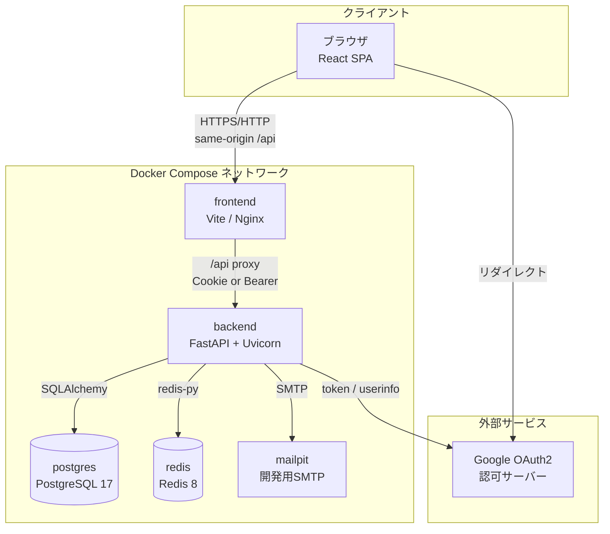
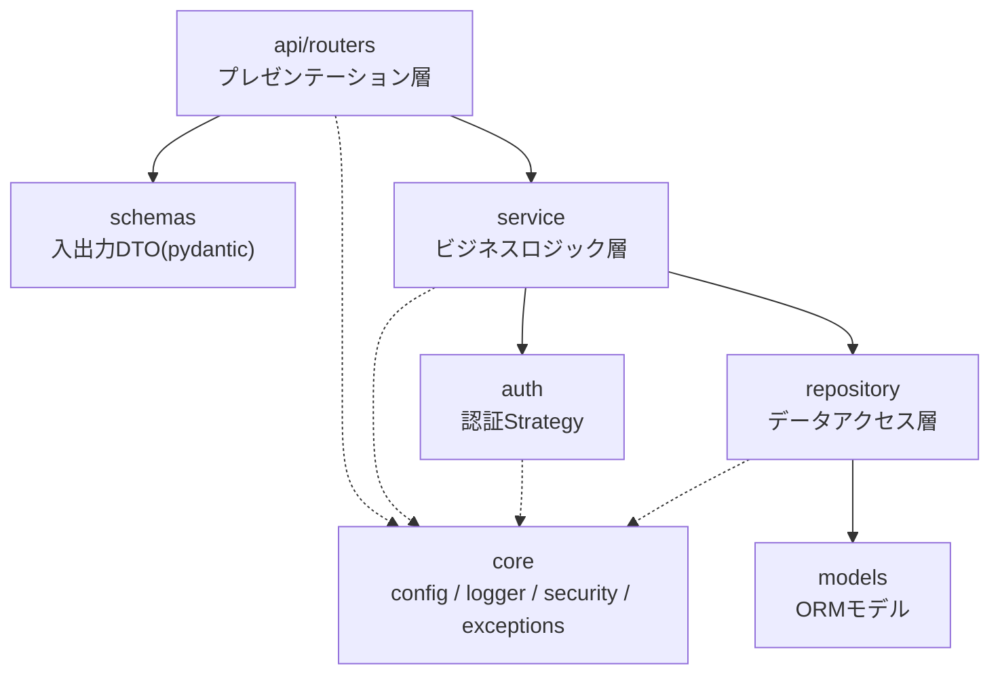
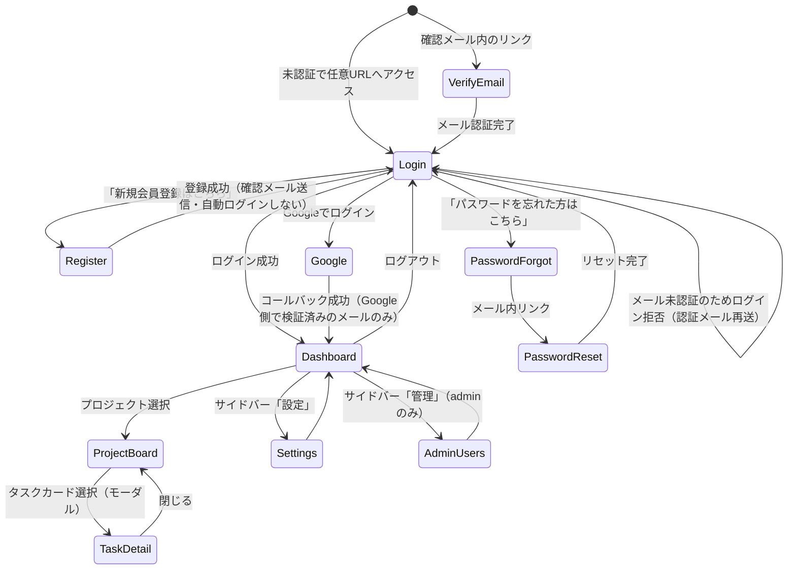
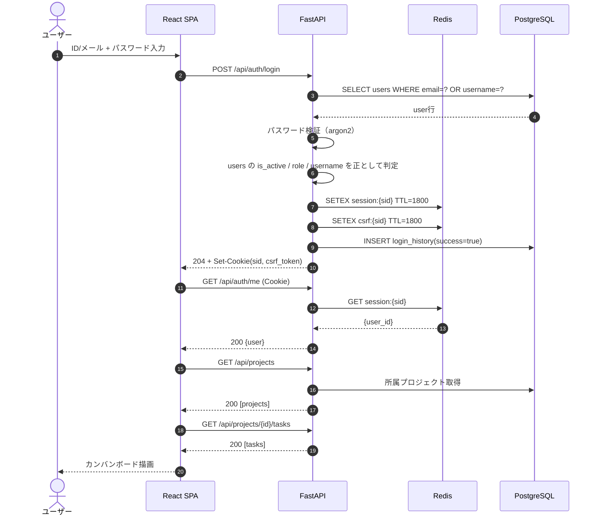
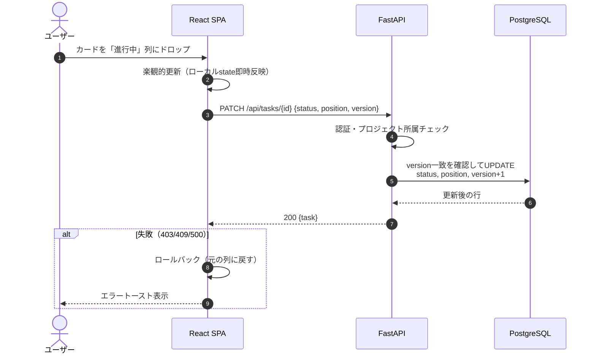
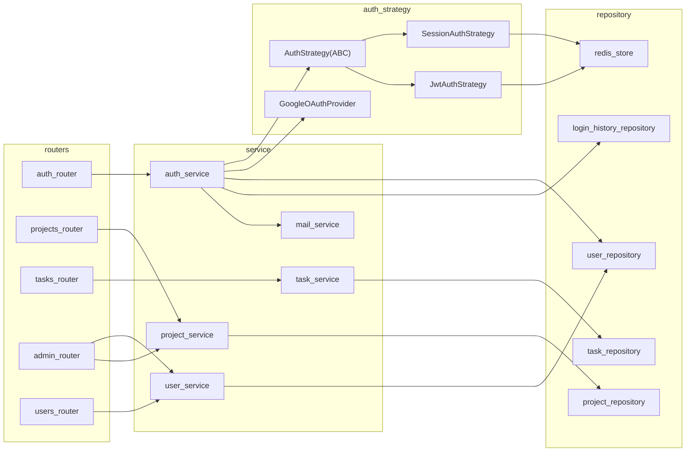
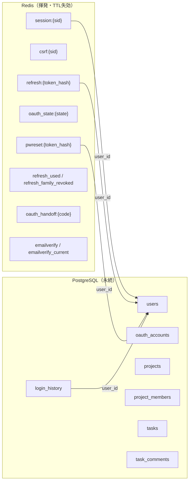

# 00 全体設計

## 1. システム概要

チームでプロジェクトを作成し、タスクをカンバン形式（未着手／進行中／完了）で管理するWebアプリケーション。
`AUTH_MODE` により session 方式 / JWT 方式を切り替え可能とし、加えて Google OAuth2 ログインを常時提供する。

| 項目 | 内容 |
|------|------|
| バックエンド | FastAPI（Python 3.14） |
| フロントエンド | React 19 + Vite + TypeScript（Node v26） |
| 永続データストア | PostgreSQL 17 |
| セッションストア | Redis 8（永続化なし） |
| ORM / マイグレーション | SQLAlchemy 2.x + Alembic |
| 認証方式 | session（Cookie + Redis） / JWT（Access + Refresh） / Google OAuth2 |
| CI/CD | GitHub Actions（CI: Lint・型チェック・テスト、CD: GHCR + self-hosted runner） |

## 2. システム構成

> drawio版：[diagrams/01_system_architecture.drawio](./diagrams/01_system_architecture.drawio)（公開ポート・CI/CD経路を含む詳細版）



## 3. バックエンドのレイヤ構成

> drawio版：[diagrams/02_backend_layers.drawio](./diagrams/02_backend_layers.drawio)（モジュール単位の詳細版）

依存方向は `api → service → repository → models` の一方向とし、`core` は全層から参照可能とする。



### ディレクトリ構成

```
project-root/
├── .github/workflows/{ci.yml, cd.yml}
├── api/
│   ├── alembic/{versions/, env.py, script.py.mako}
│   ├── alembic.ini
│   ├── app/
│   │   ├── main.py                # FastAPIアプリ生成・ミドルウェア登録
│   │   ├── core/
│   │   │   ├── config.py          # pydantic-settings による環境変数定義
│   │   │   ├── logger.py          # logging設定
│   │   │   ├── security.py        # パスワードハッシュ、トークン署名
│   │   │   ├── exceptions.py      # 業務例外とハンドラ
│   │   │   └── deps.py            # 共通DI（現在ユーザー、DBセッション等）
│   │   ├── api/routers/           # auth, projects, tasks, comments, users, admin
│   │   ├── schemas/               # リクエスト/レスポンスDTO
│   │   ├── service/               # auth_service, project_service, task_service...
│   │   ├── auth/                  # Strategy実装（session_auth/jwt_auth/oauth/base）
│   │   ├── repository/            # user_repo, project_repo, task_repo, redis_store...
│   │   ├── models/                # SQLAlchemy ORMモデル
│   │   ├── db.py                  # エンジン・セッションファクトリ
│   │   └── redis_client.py        # Redis接続プール
│   ├── tests/{unit/, integration/, conftest.py}
│   ├── Dockerfile
│   └── requirements.txt
├── frontend/  （詳細は 05_frontend.md）
├── db/{migrations/, functions/, procedures/}
├── docker-compose.yml
├── .env / .env.example
└── tmp/   （git管理外）
```

## 4. 画面遷移図

> drawio版：[diagrams/04_screen_flow.drawio](./diagrams/04_screen_flow.drawio)



## 5. 全体シーケンス

### 5.1 ログイン〜カンバン表示（session モード）



### 5.2 タスクのドラッグ＆ドロップによるステータス変更



## 6. 主要コンポーネント相関図



## 7. データ全体像



「ログインが有効かどうか」の判定は Redis のみを参照し、「誰がいつログインしたか」の履歴は設定した保持期間の範囲で PostgreSQL の `login_history` に残す。この分離により、Redis 再起動でログイン状態は失われても監査ログは独立して残る。

## 8. 非機能設計サマリ

| 項目 | 方針 |
|------|------|
| パスワード保存 | argon2id（`passlib[argon2]`）。コストパラメータは環境変数化 |
| CSRF | sessionの更新系とjwtのrefresh/logoutでDouble Submit Cookie + Origin検証（[03_auth](./03_auth.md#8-csrf対策)） |
| トークン失効 | session/refresh はいずれも Redis のキー削除で即時失効 |
| ログ | 構造化ログ（JSON）。リクエストIDを付与し、認証イベントは監査目的で INFO 出力 |
| テスト | バックエンド pytest（Redis/PostgreSQL は実コンテナ接続）、フロント Vitest |
| 秘匿情報 | `.env` および GitHub Secrets 管理。リポジトリへ直接コミットしない |
| Redis永続化 | RDB/AOF 無効。再起動時に全ログアウトとなることを許容 |
