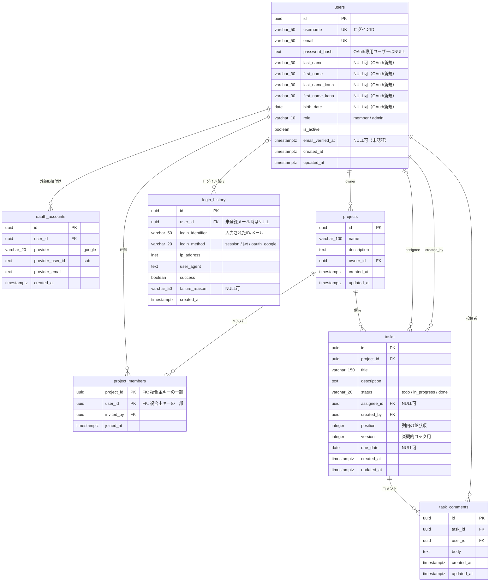
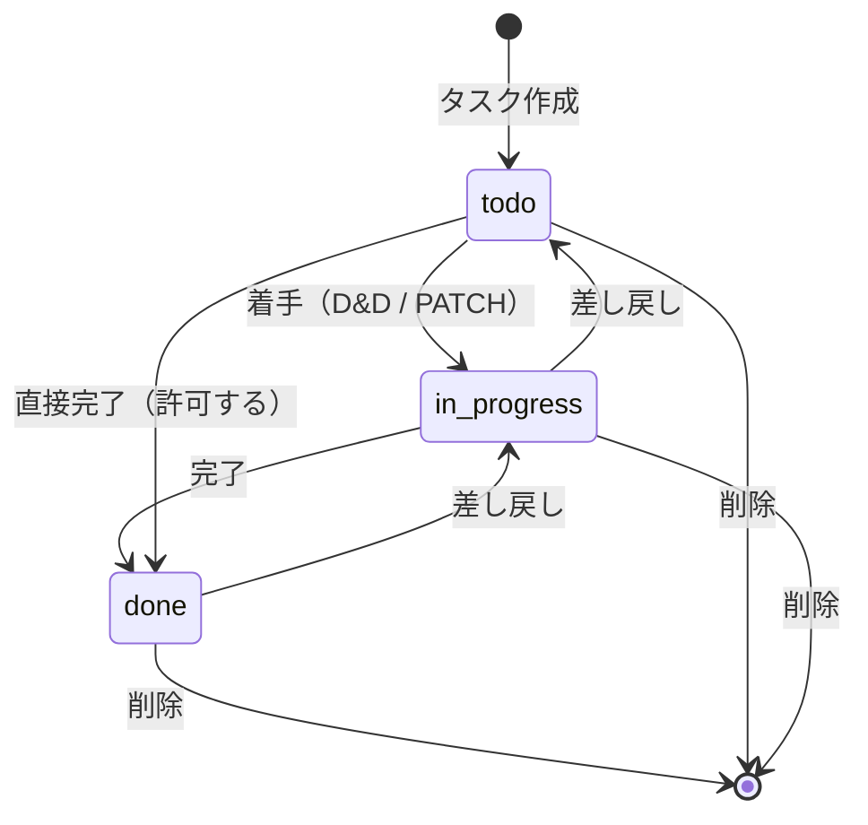
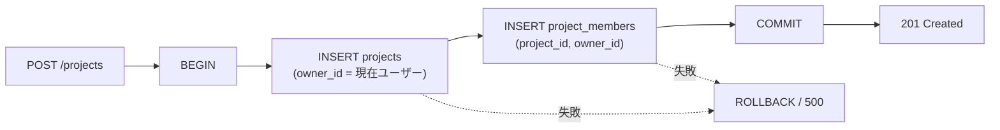
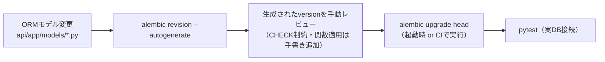

# 01 データベース設計（PostgreSQL）

## 1. 設計方針

| 項目 | 方針 |
|------|------|
| DBMS | PostgreSQL 17 |
| 保存対象 | 永続的に残す必要のあるデータのみ（ログイン有効性の判定は Redis 側で行う） |
| 主キー | `UUID`（`gen_random_uuid()` / pgcrypto）。URLに露出しても連番推測されないため |
| 文字列型 | `VARCHAR(n)` は入力上限がある項目、それ以外は `TEXT` |
| 日時型 | `TIMESTAMPTZ`（UTC保存）。アプリ側でタイムゾーン変換 |
| 列挙 | PostgreSQL の `ENUM` 型ではなく `VARCHAR + CHECK制約`（Alembic での値追加が容易なため） |
| 論理削除 | 行わない（学習用途のため物理削除）。ただし `users` のみ `is_active` で無効化を表現 |
| ORM | SQLAlchemy 2.x（`Mapped` / `mapped_column` の宣言的スタイル） |
| マイグレーション | Alembic。`db/migrations/` は SQL の手動DDL置き場、`api/alembic/versions/` が実行される正 |

## 2. ER図

> drawio版：[diagrams/03_er_diagram.drawio](./diagrams/03_er_diagram.drawio)（Redisキー・インデックス・DB関数の一覧を併記）

## 3. テーブル定義

### 3.1 users

| カラム | 型 | NULL | 既定値 | 制約・備考 |
|--------|----|------|--------|-----------|
| id | UUID | NO | `gen_random_uuid()` | PK |
| username | VARCHAR(50) | NO | - | UNIQUE。ログインID。半角英数字と `_` `-`（`CHECK`） |
| email | VARCHAR(50) | NO | - | UNIQUE。50文字上限。`CHECK` で簡易形式検証 |
| password_hash | TEXT | YES | - | argon2id ハッシュ。Google のみで登録したユーザーは NULL |
| last_name | VARCHAR(30) | YES | - | 姓。通常登録では必須、OAuth新規ユーザーはプロフィール補完まで NULL 可 |
| first_name | VARCHAR(30) | YES | - | 名。同上 |
| last_name_kana | VARCHAR(30) | YES | - | 姓フリガナ。同上。値がある場合は `CHECK` でひらがな/カタカナ/数字のみ |
| first_name_kana | VARCHAR(30) | YES | - | 名フリガナ。同上 |
| birth_date | DATE | YES | - | 年齢判定には使用せず、プロフィール情報として保持。OAuth新規ユーザーは NULL 可 |
| role | VARCHAR(10) | NO | `'member'` | `CHECK (role IN ('member','admin'))` |
| is_active | BOOLEAN | NO | `true` | 管理者による無効化用 |
| email_verified_at | TIMESTAMPTZ | YES | `NULL` | メール認証の完了日時。`NULL` は未認証を意味しログインを拒否する。真偽値ではなく日時で持ち、「いつ認証したか」を追跡可能にする |
| created_at | TIMESTAMPTZ | NO | `now()` | |
| updated_at | TIMESTAMPTZ | NO | `now()` | トリガで自動更新 |

**インデックス**

| 名称 | 定義 | 用途 |
|------|------|------|
| `uq_users_username` | UNIQUE (lower(username)) | 大文字小文字を区別しないログインID一意制約 |
| `uq_users_email` | UNIQUE (lower(email)) | 同上（メール） |
| `ix_users_role` | (role) | 管理者一覧・権限フィルタ |
| `ix_users_email_verified_at` | (email_verified_at) WHERE email_verified_at IS NULL | 未認証のまま放置されたユーザーの棚卸し |
| `ix_users_created_at` | (created_at DESC) | 管理者ユーザー一覧の作成日時順 |

**バリデーション（アプリ層 / pydantic）**

| 項目 | ルール |
|------|--------|
| 姓・名 | 1〜30文字 |
| フリガナ | ひらがな・カタカナ・数字のみ、1〜30文字 |
| 生年月日 | プルダウン選択（年/月/日）。未来日不可 |
| メールアドレス | 50文字以内、半角英数字と `@ - _ . +` を許容 |
| パスワード | 8文字以上、かつ「大文字英字／小文字英字／数字／記号」のうち2種類以上を含む |

**OAuth新規ユーザーの補足**：Googleから `username` は取得しないため、`google_` + `sha256(provider_user_id)` の先頭16文字を候補値として生成し、`users.username` の一意制約に当たった場合は連番を付けて再試行する。プロフィール4項目は NULL のまま作成でき、`GET /auth/me` の `profile_completed=false` でフロントへ通知する。通常の会員登録では4項目を引き続き必須とする。

### 3.2 oauth_accounts

| カラム | 型 | NULL | 備考 |
|--------|----|------|------|
| id | UUID | NO | PK |
| user_id | UUID | NO | FK → users.id `ON DELETE CASCADE` |
| provider | VARCHAR(20) | NO | `CHECK (provider IN ('google'))`。将来の拡張余地 |
| provider_user_id | TEXT | NO | Google の `sub` |
| provider_email | TEXT | YES | 参考情報（変更される可能性があるため識別子に使わない） |
| created_at | TIMESTAMPTZ | NO | |

**インデックス**：`uq_oauth_provider_user` UNIQUE (provider, provider_user_id)、`ix_oauth_user_id` (user_id)

### 3.3 projects

| カラム | 型 | NULL | 備考 |
|--------|----|------|------|
| id | UUID | NO | PK |
| name | VARCHAR(100) | NO | プロジェクト名 |
| description | TEXT | YES | |
| owner_id | UUID | NO | FK → users.id `ON DELETE RESTRICT`（オーナーが残る限りユーザー削除不可） |
| created_at | TIMESTAMPTZ | NO | |
| updated_at | TIMESTAMPTZ | NO | トリガで自動更新 |

**インデックス**：`ix_projects_owner_id` (owner_id)

### 3.4 project_members

| カラム | 型 | NULL | 備考 |
|--------|----|------|------|
| project_id | UUID | NO | PK(1) / FK → projects.id `ON DELETE CASCADE` |
| user_id | UUID | NO | PK(2) / FK → users.id `ON DELETE CASCADE` |
| invited_by | UUID | YES | FK → users.id `ON DELETE SET NULL` |
| joined_at | TIMESTAMPTZ | NO | |

- 複合主キー `(project_id, user_id)`
- プロジェクト作成時、オーナー自身も本テーブルへ登録する（所属判定を1箇所に集約するため）
- **インデックス**：`ix_project_members_user_id` (user_id)（ダッシュボードの所属一覧取得で使用）

### 3.5 tasks

| カラム | 型 | NULL | 既定値 | 備考 |
|--------|----|------|--------|------|
| id | UUID | NO | `gen_random_uuid()` | PK |
| project_id | UUID | NO | - | FK → projects.id `ON DELETE CASCADE` |
| title | VARCHAR(150) | NO | - | |
| description | TEXT | YES | - | |
| status | VARCHAR(20) | NO | `'todo'` | `CHECK (status IN ('todo','in_progress','done'))` |
| assignee_id | UUID | YES | - | FK → users.id `ON DELETE SET NULL` |
| created_by | UUID | NO | - | FK → users.id `ON DELETE RESTRICT` |
| position | INTEGER | NO | `0` | 同一 status 列内の並び順。`CHECK (position >= 0)`、`UNIQUE (project_id, status, position) DEFERRABLE INITIALLY DEFERRED` |
| version | INTEGER | NO | `1` | 楽観的排他制御用。更新成功時に1加算、`CHECK (version > 0)` |
| due_date | DATE | YES | - | |
| created_at | TIMESTAMPTZ | NO | `now()` | |
| updated_at | TIMESTAMPTZ | NO | `now()` | トリガで自動更新 |

**インデックス**

| 名称 | 定義 | 用途 |
|------|------|------|
| `uq_tasks_project_status_position` | UNIQUE (project_id, status, position) | 列内の重複防止とカンバン表示の主クエリを兼ねる |
| `ix_tasks_assignee_id` | (assignee_id) | 担当タスク絞り込み |

**同時更新制御**：`UNIQUE (project_id, status, position)` で列内の重複を防ぐ。タスクの作成・削除・status/position変更では、サービス層が同一トランザクション内でプロジェクト・statusごとの advisory lock を取得してから採番・再並べ替えを行う。再並べ替え中は移動対象を一時的な非負の退避値（現在の最大値 + 件数 + 1）へ置き、他の行を詰めた後に最終位置を設定する（制約は `DEFERRABLE INITIALLY DEFERRED`）。通常更新を含む `PATCH /tasks/{id}` は `version` が一致した場合だけ更新し、成功時に `version + 1` とする。削除時も同じ列の後続positionを詰める。

### 3.6 task_comments

| カラム | 型 | NULL | 備考 |
|--------|----|------|------|
| id | UUID | NO | PK |
| task_id | UUID | NO | FK → tasks.id `ON DELETE CASCADE` |
| user_id | UUID | NO | FK → users.id `ON DELETE RESTRICT` |
| body | TEXT | NO | 1〜2000文字（アプリ層で検証） |
| created_at | TIMESTAMPTZ | NO | |
| updated_at | TIMESTAMPTZ | NO | |

**インデックス**：`ix_task_comments_task_created` (task_id, created_at)

### 3.7 login_history

Redis の失効状況とは独立して、設定した保持期間（既定365日）保管する監査ログ。保持期間を超えた行は `sp_purge_login_history` で削除する。

| カラム | 型 | NULL | 備考 |
|--------|----|------|------|
| id | UUID | NO | PK |
| user_id | UUID | YES | FK → users.id `ON DELETE SET NULL`。存在しないID入力時は NULL |
| login_identifier | VARCHAR(50) | NO | 入力された username / email（原文。パスワードは記録しない） |
| login_method | VARCHAR(20) | NO | `CHECK (login_method IN ('session','jwt','oauth_google'))` |
| ip_address | INET | YES | `X-Forwarded-For` を考慮して取得 |
| user_agent | TEXT | YES | |
| success | BOOLEAN | NO | |
| failure_reason | VARCHAR(50) | YES | `invalid_credentials` / `user_inactive` / `oauth_denied` 等 |
| created_at | TIMESTAMPTZ | NO | |

**インデックス**：`ix_login_history_user_created` (user_id, created_at DESC)、`ix_login_history_created` (created_at DESC)

> パスワードリセットの実行履歴はこのテーブルに含めない（`login_method` の CHECK 制約を汚さないため）。本基本設計のスコープでは `security_events` テーブルも追加しない。

## 4. データ遷移図

### 4.1 タスクのステータス遷移

遷移制限は設けず、任意の status 間の変更を許可する（カンバンのD&Dを素直に反映するため）。

### 4.2 ユーザーの状態遷移

OAuthユーザーのパスワード設定はプロフィール完了とは独立した操作であり、`password_hash` が NULL の間だけ現在パスワードなしで許可する。
ユーザーの物理削除APIは本基本設計では提供せず、無効化（`is_active=false`）した行を保持する。これは `projects.owner_id` / `tasks.created_by` / `task_comments.user_id` の履歴を外部キーで保護するためである。

### 4.3 プロジェクト作成時のデータ生成

## 5. DB関数・プロシージャ

`db/functions/` および `db/procedures/` に `.sql` として配置し、Alembic のマイグレーションから読み込んで適用する。

### 5.1 `db/functions/trg_set_updated_at.sql`

| 項目 | 内容 |
|------|------|
| 種別 | トリガ関数 |
| 入出力 | 引数なし / `RETURNS TRIGGER` |
| 処理 | `NEW.updated_at := now()` を設定して `NEW` を返す |
| 適用対象 | `users` / `projects` / `tasks` / `task_comments` の `BEFORE UPDATE` トリガ |

### 5.2 `db/functions/fn_is_project_member.sql`

| 項目 | 内容 |
|------|------|
| 引数 | `p_project_id UUID`, `p_user_id UUID` |
| 戻り値 | `BOOLEAN` |
| 処理 | `users.is_active = true` のユーザーについて、`project_members` に該当行が存在するか、または `users.role = 'admin'` であれば `true` |
| 用途 | 認可チェックのDB側での再確認、およびSQLレベルの検証テスト |
| 備考 | アプリ層でも同等の判定を行う（二重防御）。正はアプリ層 |

### 5.3 `db/functions/fn_next_task_position.sql`

| 項目 | 内容 |
|------|------|
| 引数 | `p_project_id UUID`, `p_status VARCHAR` |
| 戻り値 | `INTEGER` |
| 処理 | 呼び出し側が同一トランザクションで `(project_id, status)` の advisory lock を取得した後、`SELECT COALESCE(MAX(position), -1) + 1` を取得 |
| 用途 | タスク新規作成時、および列間移動時の末尾追加 |

### 5.4 `db/procedures/sp_purge_login_history.sql`

| 項目 | 内容 |
|------|------|
| 引数 | `p_retention_days INTEGER` |
| 戻り値 | なし（`PROCEDURE`） |
| 処理 | `DELETE FROM login_history WHERE created_at < now() - (p_retention_days || ' days')::interval` |
| 用途 | 監査ログの保持期間管理。保持日数は環境変数 `LOGIN_HISTORY_RETENTION_DAYS` から渡す |
| 実行方法 | 運用者が月次で手動実行する。アプリ内cronは設けない（学習範囲外） |

## 6. マイグレーション方針

| 項目 | 方針 |
|------|------|
| 適用タイミング | ローカル/CD では backend コンテナ起動時のエントリポイントで `alembic upgrade head` |
| 初期リビジョン | 拡張有効化（`CREATE EXTENSION IF NOT EXISTS pgcrypto`）→ テーブル作成 → 関数・トリガ適用の順 |
| ダウングレード | 学習目的のため `downgrade()` も必ず記述する |
| 初期データ | 管理者アカウントを seed する（メール・初期パスワードは `.env` から取得。ハードコードしない） |
| テストDB | CI では GitHub Actions の `services` で PostgreSQL を起動し、テスト前に `alembic upgrade head` を実行 |

## 7. 主要クエリ

| No | 用途 | 概要 | 使用インデックス |
|----|------|------|-----------------|
| Q-1 | ログイン | `WHERE (lower(email)=:v OR lower(username)=:v) AND is_active`（取得後に `email_verified_at IS NULL` を判定） | `uq_users_email` / `uq_users_username` |
| Q-2 | ダッシュボード | `projects JOIN project_members ON ... WHERE pm.user_id = :me` | `ix_project_members_user_id` |
| Q-3 | カンバン取得 | `WHERE project_id=:pid`。`todo` → `in_progress` → `done` の順に列ごとに `position` 昇順でグルーピング | `uq_tasks_project_status_position` |
| Q-4 | タスク詳細 | tasks + assignee + comments（コメントは別クエリで取得しN+1を回避） | `ix_task_comments_task_created` |
| Q-5 | 管理者ユーザー一覧 | `ORDER BY created_at DESC LIMIT/OFFSET` | `ix_users_created_at` |
| Q-6 | ログイン履歴 | `WHERE user_id=:uid ORDER BY created_at DESC LIMIT 50` | `ix_login_history_user_created` |

> Q-2 / Q-3 では SQLAlchemy の `selectinload` を用い、N+1 クエリを避ける。
