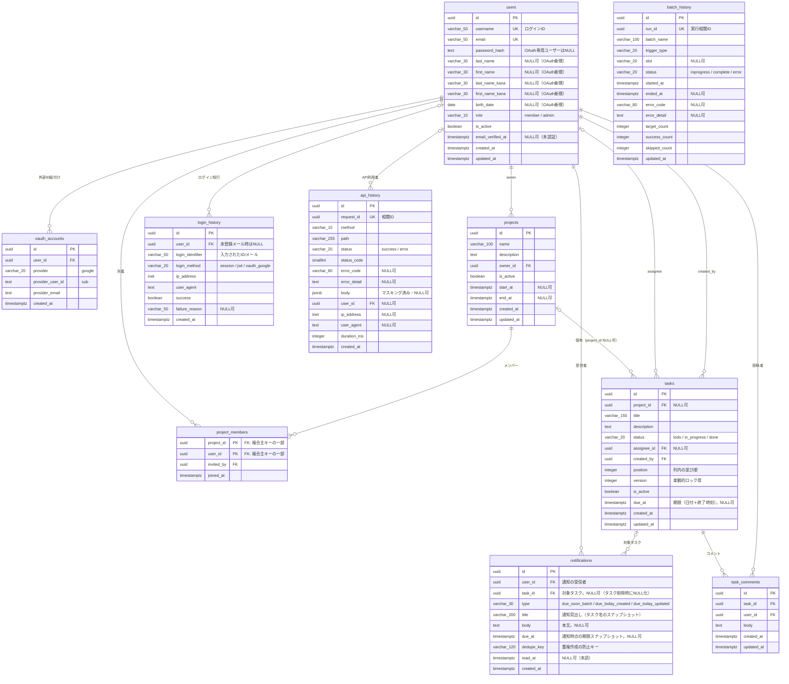
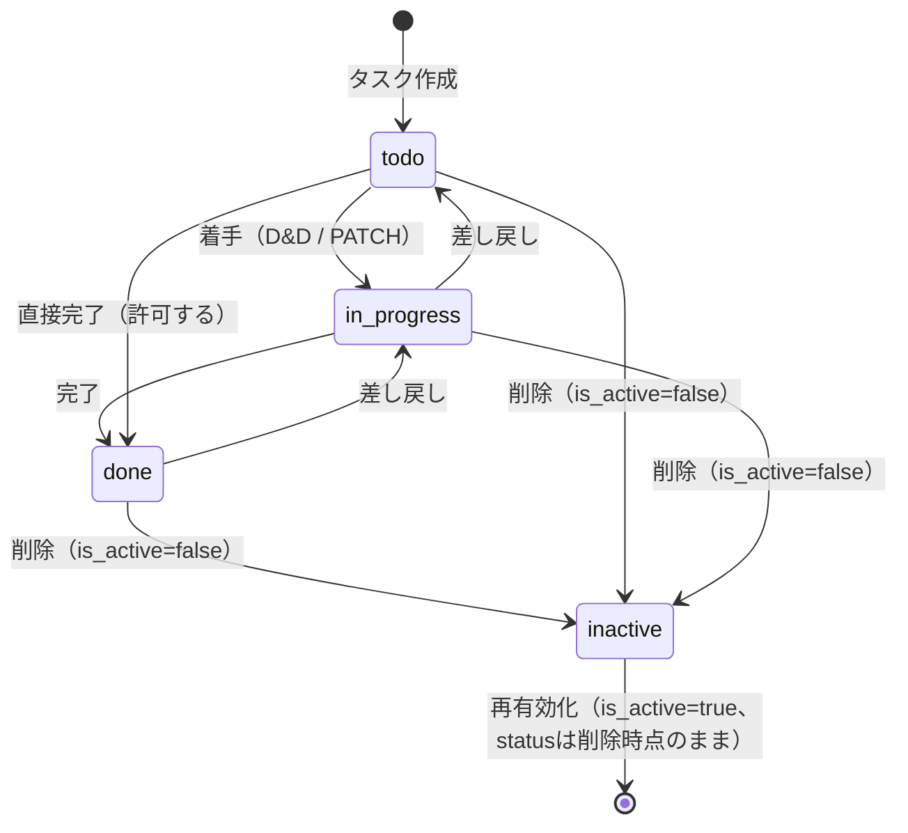
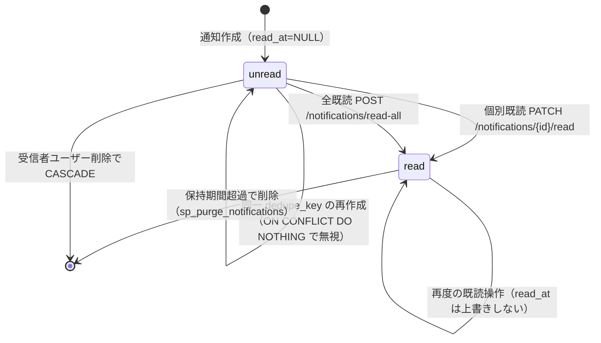
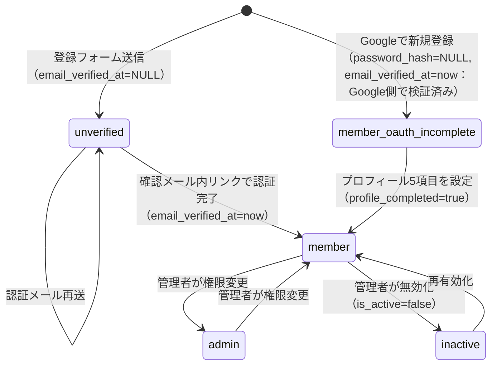
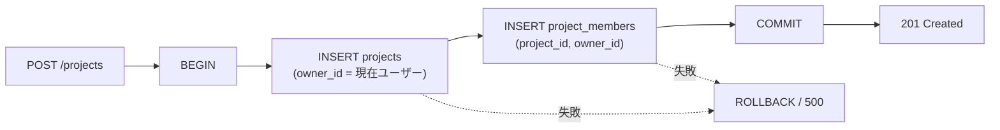
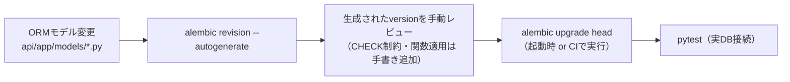

# 01 データベース設計（PostgreSQL）

## 1. 設計方針

| 項目 | 方針 |
|------|------|
| DBMS | PostgreSQL 17 |
| 保存対象 | 永続的に残す必要のあるデータのみ（ログイン有効性の判定は Redis 側で行う） |
| 主キー | `UUID`（`gen_random_uuid()` / pgcrypto）。URLに露出しても連番推測されないため |
| 文字列型 | `VARCHAR(n)` は入力上限がある項目、それ以外は `TEXT` |
| 日時型 | `TIMESTAMPTZ`（UTC保存）。アプリ側で `APP_TIMEZONE`（既定 `Asia/Tokyo`）へ変換する。「当日」「翌日10時」などの業務上の日次境界の判定もこのタイムゾーンで行う |
| 列挙 | PostgreSQL の `ENUM` 型ではなく `VARCHAR + CHECK制約`（Alembic での値追加が容易なため） |
| 論理削除 | 基本的には行わない（学習用途のため物理削除）。ただし `users` に加え `projects` / `tasks` も `is_active` で無効化（論理削除）を表現する |
| ORM | SQLAlchemy 2.x（`Mapped` / `mapped_column` の宣言的スタイル） |
| マイグレーション | Alembic。`db/migrations/` は SQL の手動DDL置き場、`api/alembic/versions/` が実行される正 |

### 1.1 業務ロジックを伴うDBアクセスの責務

参照系・更新系を問わず、業務ロジックを伴うDBアクセスの正はPostgreSQLのSP/FN層とする。APIのrepository層は `CALL sp_xxx(...)` / `SELECT fn_xxx(...)` の薄いラッパーとDTO写像だけを担い、テーブルへの直接CRUD、業務判定、複数テーブルの整合性制御を行わない。詳細な全シグネチャとSQLSTATE対応は[詳細設計08](../detailed_design/database/08_db_functions.md)を正とする。

例外は `GET /api/health` の `SELECT 1`、AlembicのDDL/seed、テストfixtureだけである。`sp_create_task` / `sp_update_task` はadvisory lock、position再採番、条件付き通知INSERTまでを1業務トランザクションで完結し、`is_due_today` の独立サービス関数は設けない。

## 2. ER図

> drawio版：[diagrams/03_er_diagram.drawio](./diagrams/03_er_diagram.drawio)（Redisキー・インデックス・DB関数の一覧を併記）

## 3. テーブル定義

### 3.1 users

| カラム | 型 | NULL | 既定値 | 制約・備考 |
|--------|----|------|--------|-----------|
| id | UUID | NO | `gen_random_uuid()` | PK |
| username | VARCHAR(50) | NO | - | UNIQUE。ログインID。半角英数字と `_` `-`（`CHECK`） |
| email | VARCHAR(50) | NO | - | UNIQUE。50文字上限。`CHECK` で簡易形式検証 |
| password_hash | TEXT | YES | - | argon2id ハッシュ。Google のみで登録したユーザーは NULL |
| last_name | VARCHAR(30) | YES | - | 姓。通常登録では必須、OAuth新規ユーザーはプロフィール補完まで NULL 可 |
| first_name | VARCHAR(30) | YES | - | 名。同上 |
| last_name_kana | VARCHAR(30) | YES | - | 姓フリガナ。同上。値がある場合は `CHECK` でひらがな/カタカナ/数字のみ |
| first_name_kana | VARCHAR(30) | YES | - | 名フリガナ。同上 |
| birth_date | DATE | YES | - | 年齢判定には使用せず、プロフィール情報として保持。OAuth新規ユーザーは NULL 可 |
| role | VARCHAR(10) | NO | `'member'` | `CHECK (role IN ('member','admin'))` |
| is_active | BOOLEAN | NO | `true` | 管理者による無効化用 |
| email_verified_at | TIMESTAMPTZ | YES | `NULL` | メール認証の完了日時。`NULL` は未認証を意味しログインを拒否する。真偽値ではなく日時で持ち、「いつ認証したか」を追跡可能にする |
| created_at | TIMESTAMPTZ | NO | `now()` | |
| updated_at | TIMESTAMPTZ | NO | `now()` | トリガで自動更新 |

**インデックス**

| 名称 | 定義 | 用途 |
|------|------|------|
| `uq_users_username` | UNIQUE (lower(username)) | 大文字小文字を区別しないログインID一意制約 |
| `uq_users_email` | UNIQUE (lower(email)) | 同上（メール） |
| `ix_users_role` | (role) | 管理者一覧・権限フィルタ |
| `ix_users_email_verified_at` | (email_verified_at) WHERE email_verified_at IS NULL | 未認証のまま放置されたユーザーの棚卸し |
| `ix_users_created_at` | (created_at DESC) | 管理者ユーザー一覧の作成日時順 |

**バリデーション（アプリ層 / pydantic）**

| 項目 | ルール |
|------|--------|
| 姓・名 | 1〜30文字 |
| フリガナ | ひらがな・カタカナ・数字のみ、1〜30文字 |
| 生年月日 | プルダウン選択（年/月/日）。未来日不可 |
| メールアドレス | 50文字以内、半角英数字と `@ - _ . +` を許容 |
| パスワード | 8文字以上、かつ「大文字英字／小文字英字／数字／記号」のうち2種類以上を含む |

**OAuth新規ユーザーの補足**：Googleから `username` は取得しないため、`google_` + `sha256(provider_user_id)` の先頭16文字を候補値として生成し、`users.username` の一意制約に当たった場合は連番を付けて再試行する。プロフィール5項目は NULL のまま作成でき、`GET /auth/me` の `profile_completed=false` でフロントへ通知する。通常の会員登録では5項目を引き続き必須とする。

### 3.2 oauth_accounts

| カラム | 型 | NULL | 備考 |
|--------|----|------|------|
| id | UUID | NO | PK |
| user_id | UUID | NO | FK → users.id `ON DELETE CASCADE` |
| provider | VARCHAR(20) | NO | `CHECK (provider IN ('google'))`。将来の拡張余地 |
| provider_user_id | TEXT | NO | Google の `sub` |
| provider_email | TEXT | YES | 参考情報（変更される可能性があるため識別子に使わない） |
| created_at | TIMESTAMPTZ | NO | |

**インデックス**：`uq_oauth_provider_user` UNIQUE (provider, provider_user_id)、`ix_oauth_user_id` (user_id)

### 3.3 projects

| カラム | 型 | NULL | 備考 |
|--------|----|------|------|
| id | UUID | NO | PK |
| name | VARCHAR(100) | NO | プロジェクト名 |
| description | TEXT | YES | |
| owner_id | UUID | NO | FK → users.id `ON DELETE RESTRICT`（オーナーが残る限りユーザー削除不可） |
| is_active | BOOLEAN | NO | 既定値 `true`。`DELETE /api/projects/{id}` による論理削除フラグ。オーナー/adminが再有効化可能 |
| start_at | TIMESTAMPTZ | YES | 既定値 `NULL`。プロジェクトの開始日時。UTC保存 |
| end_at | TIMESTAMPTZ | YES | 既定値 `NULL`。プロジェクトの終了日時。UTC保存 |
| created_at | TIMESTAMPTZ | NO | |
| updated_at | TIMESTAMPTZ | NO | トリガで自動更新 |

`CONSTRAINT ck_projects_period CHECK (start_at IS NULL OR end_at IS NULL OR end_at >= start_at)`：両方に値がある場合のみ `end_at >= start_at` を検証する（片方のみ設定した場合は制約対象外）。

**インデックス**：`ix_projects_owner_id` (owner_id)

> **不明点・要検討事項**：`UNIQUE (project_id, status, position)` は PostgreSQL の仕様上 NULL 同士を区別するため、`project_id IS NULL`（未所属タスク）の行同士では一意性が機能しない。対応方針は §3.5「同時更新制御」を参照。

### 3.4 project_members

| カラム | 型 | NULL | 備考 |
|--------|----|------|------|
| project_id | UUID | NO | PK(1) / FK → projects.id `ON DELETE CASCADE` |
| user_id | UUID | NO | PK(2) / FK → users.id `ON DELETE CASCADE` |
| invited_by | UUID | YES | FK → users.id `ON DELETE SET NULL` |
| joined_at | TIMESTAMPTZ | NO | |

- 複合主キー `(project_id, user_id)`
- プロジェクト作成時、オーナー自身も本テーブルへ登録する（所属判定を1箇所に集約するため）
- **インデックス**：`ix_project_members_user_id` (user_id)（ダッシュボードの所属一覧取得で使用）
- `project_id` の `ON DELETE CASCADE` は、`projects` の `DELETE` が論理削除（`is_active=false`）に変更されたため、通常運用では発火しない防御的制約という位置づけになる（`user_id` 側のCASCADEも同様に、ユーザーの物理削除APIが提供されていないための防御的制約）

### 3.5 tasks

| カラム | 型 | NULL | 既定値 | 備考 |
|--------|----|------|--------|------|
| id | UUID | NO | `gen_random_uuid()` | PK |
| project_id | UUID | YES | `NULL` | FK → projects.id `ON DELETE SET NULL`。NULL可（プロジェクト未所属タスクを許可）。`projects` の物理削除経路は本設計では提供しないため実運用では発火しないが、意味的な正しさのため `SET NULL` とする |
| title | VARCHAR(150) | NO | - | |
| description | TEXT | YES | - | |
| status | VARCHAR(20) | NO | `'todo'` | `CHECK (status IN ('todo','in_progress','done'))` |
| assignee_id | UUID | YES | - | FK → users.id `ON DELETE SET NULL` |
| created_by | UUID | NO | - | FK → users.id `ON DELETE RESTRICT` |
| position | INTEGER | NO | `0` | 同一 status 列内の並び順。`CHECK (position >= 0)`、`UNIQUE (project_id, status, position) DEFERRABLE INITIALLY DEFERRED` |
| version | INTEGER | NO | `1` | 楽観的排他制御用。更新成功時に1加算、`CHECK (version > 0)` |
| is_active | BOOLEAN | NO | `true` | `DELETE /api/tasks/{id}` による論理削除フラグ。作成者/プロジェクトオーナー/adminが再有効化可能。無効化時は後続positionの詰め（compaction）を行わない |
| due_at | TIMESTAMPTZ | YES | - | タスクの期限（日付＋終了時刻）。UTC保存し、表示・判定は `APP_TIMEZONE` に変換して行う。期限通知（§3.8）の抽出条件に使う |
| created_at | TIMESTAMPTZ | NO | `now()` | |
| updated_at | TIMESTAMPTZ | NO | `now()` | トリガで自動更新 |

**インデックス**

| 名称 | 定義 | 用途 |
|------|------|------|
| `uq_tasks_project_status_position` | UNIQUE (project_id, status, position) | 列内の重複防止とカンバン表示の主クエリを兼ねる |
| `ix_tasks_assignee_id` | (assignee_id) | 担当タスク絞り込み |
| `ix_tasks_due_at_open` | (due_at) WHERE status <> 'done' AND due_at IS NOT NULL AND assignee_id IS NOT NULL | 期限通知バッチの抽出（未完了・担当者ありの行だけを対象にする部分インデックス） |

**同時更新制御**：`UNIQUE (project_id, status, position)` で列内の重複を防ぐ。タスクの作成・削除・status/position変更では、サービス層が同一トランザクション内でプロジェクト・statusごとの advisory lock を取得してから採番・再並べ替えを行う。再並べ替え中は移動対象を一時的な非負の退避値（現在の最大値 + 件数 + 1）へ置き、他の行を詰めた後に最終位置を設定する（制約は `DEFERRABLE INITIALLY DEFERRED`）。通常更新を含む `PATCH /tasks/{id}` は `version` が一致した場合だけ更新し、成功時に `version + 1` とする。論理削除（`is_active=false`）時は物理削除と異なり、後続positionの詰め（compaction）は行わない（is_active=falseの行を一覧・カンバンから除外するのみで、position自体はギャップがあっても崩れない）。

**`project_id IS NULL`（未所属タスク）の一意性について**：PostgreSQLの仕様上NULLは互いに異なる値として扱われるため、`UNIQUE (project_id, status, position)` は `project_id IS NULL` の行同士では機能せず、複数の未所属タスクが同じstatus/positionを持ちうる。DB制約はそのまま維持しつつ、advisory lockのロックキー生成時に `project_id` がNULLの場合は固定のプレースホルダ値（例：`'00000000-0000-0000-0000-000000000000'`）を用いることで、未所属タスク全体を1つの仮想グループとしてアプリ層で直列化し、実質的な衝突を防ぐ。

### 3.6 task_comments

| カラム | 型 | NULL | 備考 |
|--------|----|------|------|
| id | UUID | NO | PK |
| task_id | UUID | NO | FK → tasks.id `ON DELETE CASCADE` |
| user_id | UUID | NO | FK → users.id `ON DELETE RESTRICT` |
| body | TEXT | NO | 1〜2000文字（アプリ層で検証） |
| created_at | TIMESTAMPTZ | NO | |
| updated_at | TIMESTAMPTZ | NO | |

**インデックス**：`ix_task_comments_task_created` (task_id, created_at)

`task_id` の `ON DELETE CASCADE` は、`tasks` の `DELETE` が論理削除（`is_active=false`）に変更されたため、通常運用では発火しない防御的制約という位置づけになる。

### 3.7 login_history

Redis の失効状況とは独立して、設定した保持期間（既定90日）保管する監査ログ。保持期間を超えた行は `sp_purge_login_history` で削除する。

| カラム | 型 | NULL | 備考 |
|--------|----|------|------|
| id | UUID | NO | PK |
| user_id | UUID | YES | FK → users.id `ON DELETE SET NULL`。存在しないID入力時は NULL |
| login_identifier | VARCHAR(50) | NO | 入力された username / email（原文。パスワードは記録しない） |
| login_method | VARCHAR(20) | NO | `CHECK (login_method IN ('session','jwt','oauth_google'))` |
| ip_address | INET | YES | `X-Forwarded-For` を考慮して取得 |
| user_agent | TEXT | YES | |
| success | BOOLEAN | NO | |
| failure_reason | VARCHAR(50) | YES | `invalid_credentials` / `user_inactive` / `oauth_denied` 等 |
| created_at | TIMESTAMPTZ | NO | |

**インデックス**：`ix_login_history_user_created` (user_id, created_at DESC)、`ix_login_history_created` (created_at DESC)

> パスワードリセットの実行履歴はこのテーブルに含めない（`login_method` の CHECK 制約を汚さないため）。本基本設計のスコープでは `security_events` テーブルも追加しない。

### 3.8 notifications

アプリ内通知（要件書§3.4）。ユーザー1人あたり1行＝1通知とし、既読状態は `read_at` の有無で表す。

| カラム | 型 | NULL | 既定値 | 備考 |
|--------|----|------|--------|------|
| id | UUID | NO | `gen_random_uuid()` | PK |
| user_id | UUID | NO | - | FK → users.id `ON DELETE CASCADE`。通知の受信者 |
| task_id | UUID | YES | - | FK → tasks.id `ON DELETE SET NULL`。対象タスク。`tasks` の `DELETE` は論理削除（`is_active=false`）に変わったため通常運用では発火しない防御的制約だが、意味的にはタスクが削除されても通知履歴を残すためのもの |
| type | VARCHAR(30) | NO | - | `CHECK (type IN ('due_soon_batch','due_today_created','due_today_updated'))` |
| title | VARCHAR(200) | NO | - | 通知見出し。作成時点のタスク名をスナップショットする（タスク削除後も内容が分かるようにするため） |
| body | TEXT | YES | - | 補足本文 |
| due_at | TIMESTAMPTZ | YES | - | 通知作成時点の `tasks.due_at` のスナップショット |
| dedupe_key | VARCHAR(120) | NO | - | 重複作成の防止キー。`UNIQUE (user_id, dedupe_key)` |
| read_at | TIMESTAMPTZ | YES | `NULL` | 既読日時。`NULL` は未読 |
| created_at | TIMESTAMPTZ | NO | `now()` | |

`updated_at` は持たない。通知は作成後に `read_at` 以外を書き換えないため。

**インデックス**

| 名称 | 定義 | 用途 |
|------|------|------|
| `uq_notifications_user_dedupe` | UNIQUE (user_id, dedupe_key) | 重複通知の防止。`INSERT ... ON CONFLICT DO NOTHING` の競合対象 |
| `ix_notifications_user_created` | (user_id, created_at DESC) | 通知一覧の取得 |
| `ix_notifications_user_unread` | (user_id) WHERE read_at IS NULL | 未読件数の取得（ポーリングで最も高頻度に叩かれる） |

**`dedupe_key` の採番規則**

| type | 発生契機 | `dedupe_key` | 意図 |
|------|----------|--------------|------|
| `due_soon_batch` | 毎日10時・17時のバッチ | `batch:{実行日 YYYY-MM-DD}:{slot}:{task_id}` | 同じ実行枠が再実行されても1タスク1通知に収め、10時と17時は別通知として扱う |
| `due_today_created` | タスク新規作成（期限が当日） | `created:{task_id}` | 作成は1タスク1回だけ |
| `due_today_updated` | 終了時刻の変更（変更後の期限が当日） | `updated:{task_id}:{変更後 due_at のISO8601(UTC)}` | 同じ日時へ設定し直した場合は増やさず、別の日時へ変えた場合は新たに通知する |

`INSERT` は必ず `ON CONFLICT (user_id, dedupe_key) DO NOTHING` とし、競合時は「作成0件」として正常終了させる。

**保持期間**：`NOTIFICATION_RETENTION_DAYS`（既定90）を超えた行は `sp_purge_notifications`（§5.5）で削除する。

### 3.9 api_history

APIリクエストの障害調査用履歴。`/api`配下の全リクエストを1リクエスト1行で保存し、HTTPステータスとアプリケーションエラーを対応付ける。リクエスト処理のトランザクションとは分離してINSERTするため、エラー応答も履歴に残る。保持期間は `API_HISTORY_RETENTION_DAYS`（既定30日）とする。

| カラム | 型 | NULL | 備考 |
|--------|----|------|------|
| `id` | UUID | NO | PK |
| `request_id` | UUID | NO | UNIQUE。サーバー発行の`X-Request-ID`と同一 |
| `method` / `path` | VARCHAR(10) / VARCHAR(255) | NO | HTTPメソッド、クエリを除くルートテンプレート |
| `status` | VARCHAR(20) | NO | `success` / `error`。status_codeから決定 |
| `status_code` | SMALLINT | NO | 100〜599。2xx/3xxはsuccess、4xx/5xxはerror |
| `error_code` / `error_detail` | VARCHAR(80) / TEXT | YES | エラー時のみ。秘密情報・stack traceは保存しない |
| `body` | JSONB | YES | JSON bodyのみ。パスワード・token等をマスキングし、サイズ超過時はNULL |
| `user_id` | UUID | YES | FK → users.id `ON DELETE SET NULL`。未認証はNULL |
| `ip_address` / `user_agent` | INET / TEXT | YES | クライアント情報。proxyの信頼範囲に従う |
| `duration_ms` | INTEGER | NO | 0以上の処理時間（ミリ秒） |
| `created_at` | TIMESTAMPTZ | NO | 受付時刻。UTC保存 |

**インデックス**：`ix_api_history_created` (created_at DESC)、`ix_api_history_path_created` (path, created_at DESC)、`ix_api_history_status_created` (status, created_at DESC)。bodyにCookie、Authorization、資格情報は保存しない。

### 3.10 batch_history

batchジョブの実行履歴。ジョブ開始時に `inprogress` で作成し、同じ `run_id` の行を完了時に `complete`、失敗時に `error` へ更新する。保持期間は `BATCH_HISTORY_RETENTION_DAYS`（既定30日）とする。

| カラム | 型 | NULL | 備考 |
|--------|----|------|------|
| `id` / `run_id` | UUID | NO | PK / UNIQUE。run_idは1実行1件 |
| `batch_name` | VARCHAR(100) | NO | `due_notification`等 |
| `trigger_type` | VARCHAR(20) | NO | `scheduled` / `manual` |
| `slot` | VARCHAR(20) | YES | 期限通知の`10`/`17`等。対象外はNULL |
| `status` | VARCHAR(20) | NO | `inprogress` / `complete` / `error` |
| `started_at` / `ended_at` | TIMESTAMPTZ | NO / YES | 起動時刻、完了・失敗時の終了時刻 |
| `error_code` / `error_detail` | VARCHAR(80) / TEXT | YES | `error`時の詳細。少なくとも一方を設定し、秘密情報は保存しない |
| `target_count` / `success_count` / `skipped_count` | INTEGER | NO | ジョブ結果の件数。0以上 |
| `updated_at` | TIMESTAMPTZ | NO | 状態・件数の更新時刻 |

`inprogress`でプロセスが停止した行は、プロセスクラッシュ等の可能性を示す。自動的に`error`へ補正せず、標準出力と照合する。`updated_at`には `trg_set_updated_at` を適用する。

## 4. データ遷移図

### 4.1 タスクのステータス遷移

遷移制限は設けず、任意の status 間の変更を許可する（カンバンのD&Dを素直に反映するため）。`DELETE /api/tasks/{id}` は論理削除（`is_active=false`）であり、`status` は変更しない。無効化中のタスクは一覧・カンバンから除外されるが、`position` の詰め（compaction）は行わない。作成者/プロジェクトオーナー/adminは `PATCH` で `is_active=true` に戻し再有効化できる。

### 4.1.1 通知の状態遷移

既読は不可逆とし、未読へ戻す操作は提供しない。全既読は `WHERE user_id = :me AND read_at IS NULL` に限定して更新するため、既に既読の通知の `read_at` は変化しない。

### 4.2 ユーザーの状態遷移

OAuthユーザーのパスワード設定はプロフィール完了とは独立した操作であり、`password_hash` が NULL の間だけ現在パスワードなしで許可する。
ユーザーの物理削除APIは本基本設計では提供せず、無効化（`is_active=false`）した行を保持する。これは `projects.owner_id` / `tasks.created_by` / `task_comments.user_id` の履歴を外部キーで保護するためである。

### 4.3 プロジェクト作成時のデータ生成

## 5. DB関数・プロシージャ

`db/functions/` および `db/procedures/` に `.sql` として配置し、Alembic のマイグレーションから読み込んで適用する。

### 5.1 `db/functions/trg_set_updated_at.sql`

| 項目 | 内容 |
|------|------|
| 種別 | トリガ関数 |
| 入出力 | 引数なし / `RETURNS TRIGGER` |
| 処理 | `NEW.updated_at := now()` を設定して `NEW` を返す |
| 適用対象 | `users` / `projects` / `tasks` / `task_comments` / `batch_history` の `BEFORE UPDATE` トリガ |

### 5.2 `db/functions/fn_is_project_member.sql`

| 項目 | 内容 |
|------|------|
| 引数 | `p_project_id UUID`, `p_user_id UUID` |
| 戻り値 | `BOOLEAN` |
| 処理 | `users.is_active = true` のユーザーについて、`project_members` に該当行が存在するか、または `users.role = 'admin'` であれば `true` |
| 用途 | 認可チェックのDB側での再確認、およびSQLレベルの検証テスト |
| 備考 | `require_project_member` 等の実運用RBACで呼び出す。所属の事実判定は本関数を正とし、404/403へのHTTP変換だけAPI層で行う |

### 5.3 `db/functions/fn_next_task_position.sql`

| 項目 | 内容 |
|------|------|
| 引数 | `p_project_id UUID`, `p_status VARCHAR` |
| 戻り値 | `INTEGER` |
| 処理 | 呼び出し側が同一トランザクションで `(project_id, status)` の advisory lock を取得した後、`SELECT COALESCE(MAX(position), -1) + 1` を取得 |
| 用途 | タスク新規作成時、および列間移動時の末尾追加 |

### 5.4 `db/procedures/sp_purge_login_history.sql`

| 項目 | 内容 |
|------|------|
| 引数 | `p_retention_days INTEGER` |
| 戻り値 | なし（`PROCEDURE`） |
| 処理 | `DELETE FROM login_history WHERE created_at < now() - (p_retention_days || ' days')::interval` |
| 用途 | 監査ログの保持期間管理。保持日数は環境変数 `LOGIN_HISTORY_RETENTION_DAYS`（既定90日）から渡す |
| 実行方法 | 運用者が月次で手動実行する。アプリ内cronは設けない（学習範囲外） |

### 5.5 `db/procedures/sp_purge_notifications.sql`

| 項目 | 内容 |
|------|------|
| 引数 | `p_retention_days INTEGER` |
| 戻り値 | なし（`PROCEDURE`） |
| 処理 | `DELETE FROM notifications WHERE created_at < now() - (p_retention_days \|\| ' days')::interval` |
| 用途 | 通知の保持期間管理。保持日数は環境変数 `NOTIFICATION_RETENTION_DAYS` から渡す |
| 実行方法 | `batch` コンテナの日次ジョブから期限通知ジョブの後に実行する（[06_infra_cicd.md §2](./06_infra_cicd.md#2-docker-compose-構成)） |

### 5.6 `db/procedures/sp_purge_api_history.sql`

| 項目 | 内容 |
|------|------|
| 引数 | `p_retention_days INTEGER` |
| 処理 | `DELETE FROM api_history WHERE created_at < now() - (p_retention_days || ' days')::interval` |
| 用途 | API履歴の保持期間管理。`API_HISTORY_RETENTION_DAYS`（既定30日）から渡す |
| 実行方法 | `batch`のジョブ終了処理で日次実行 |

### 5.7 `db/procedures/sp_purge_batch_history.sql`

| 項目 | 内容 |
|------|------|
| 引数 | `p_retention_days INTEGER` |
| 処理 | `DELETE FROM batch_history WHERE started_at < now() - (p_retention_days || ' days')::interval` |
| 用途 | batch履歴の保持期間管理。`BATCH_HISTORY_RETENTION_DAYS`（既定30日）から渡す |
| 実行方法 | `batch`のジョブ終了処理で日次実行 |

### 5.8 業務CRUD・参照系SP/FN

projects、project_members、tasks、task_comments、notifications、admin操作のDBアクセスは、[詳細設計08](../detailed_design/database/08_db_functions.md) §2のSP/FNへ統一する。repositoryからの直接 `SELECT` / `INSERT` / `UPDATE` / `DELETE` は作成しない。`sp_create_task` / `sp_update_task` 内の通知INSERTは独立した通知作成SPを経由せず、`(user_id, dedupe_key)` の一意制約と `ON CONFLICT DO NOTHING` で冪等性を確保する。

| DB責務 | 正となる呼び出し |
|--------|------------------|
| プロジェクト・所属 | `fn_get_project` / `fn_list_projects` / `fn_is_project_member` / `fn_search_member_candidates` / `fn_list_project_members`、`sp_create_project` / `sp_update_project` / `sp_deactivate_project` / `sp_add_project_member` / `sp_remove_project_member` |
| タスク・コメント | `fn_get_project_board` / `fn_get_task` / `fn_list_tasks` / `fn_list_task_comments` / `fn_get_comment_with_task`、`sp_create_task` / `sp_update_task` / `sp_deactivate_task` / `sp_add_task_comment` / `sp_update_task_comment` / `sp_delete_task_comment` |
| 通知 | `fn_list_notifications` / `fn_count_unread_notifications`、`sp_mark_notification_read` / `sp_mark_all_notifications_read` |
| admin | `fn_admin_list_users` / `fn_admin_list_projects` / `fn_admin_list_login_history`、`sp_admin_update_user_role` / `sp_admin_update_user_status` / `sp_admin_deactivate_project` |

## 6. マイグレーション方針

| 項目 | 方針 |
|------|------|
| 適用タイミング | ローカル/CD では backend コンテナ起動時のエントリポイントで `alembic upgrade head` |
| 初期リビジョン | 拡張有効化（`CREATE EXTENSION IF NOT EXISTS pgcrypto`）→ テーブル作成 → 関数・トリガ適用の順 |
| ダウングレード | 学習目的のため `downgrade()` も必ず記述する |
| 初期データ | 管理者アカウントを seed する（メール・初期パスワードは `.env` から取得。ハードコードしない） |
| テストDB | CI では GitHub Actions の `services` で PostgreSQL を起動し、テスト前に `alembic upgrade head` を実行 |

## 7. 主要クエリ

| No | 用途 | 概要 | 使用インデックス |
|----|------|------|-----------------|
| Q-1 | ログイン | `WHERE (lower(email)=:v OR lower(username)=:v) AND is_active`（取得後に `email_verified_at IS NULL` を判定） | `uq_users_email` / `uq_users_username` |
| Q-2 | ダッシュボード | `SELECT fn_list_projects(:me, false, :limit, :offset)` | `ix_project_members_user_id` |
| Q-3 | カンバン取得 | `SELECT fn_get_project_board(:pid, false)`。`todo` → `in_progress` → `done`、position昇順 | `uq_tasks_project_status_position` |
| Q-4 | タスク詳細 | `SELECT fn_get_task(:task_id)` + `SELECT fn_list_task_comments(:task_id)` | `ix_task_comments_task_created` |
| Q-5 | 管理者ユーザー一覧 | `SELECT fn_admin_list_users(...)` | `ix_users_created_at` |
| Q-6 | ログイン履歴 | `SELECT fn_admin_list_login_history(:uid, ..., 50, 0)` | `ix_login_history_user_created` |
| Q-7 | 期限通知バッチ | `SELECT fn_list_due_notification_tasks(:threshold)`（`:threshold` = 翌日10:00 JST をUTCへ変換した値） | `ix_tasks_due_at_open` |
| Q-8 | 未読通知件数 | `SELECT fn_count_unread_notifications(:me)` | `ix_notifications_user_unread` |
| Q-9 | 通知一覧 | `SELECT fn_list_notifications(:me, :unread_only, :limit, :offset)` | `ix_notifications_user_created` |

> Q-2 / Q-3 の結合・集約はFN内部で行い、repositoryはORMの `selectinload` を使わない。FNの戻り値を1回の結果セットとしてDTOへ写像し、N+1を避ける。
