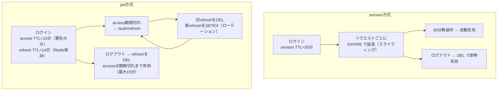
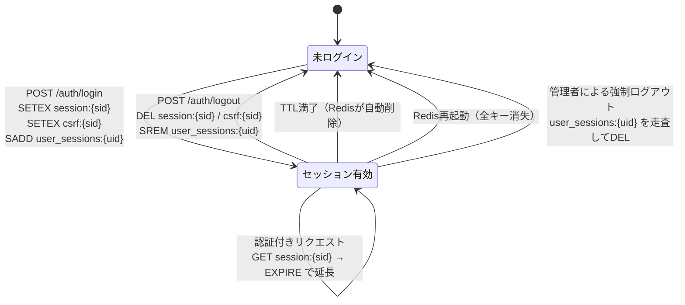
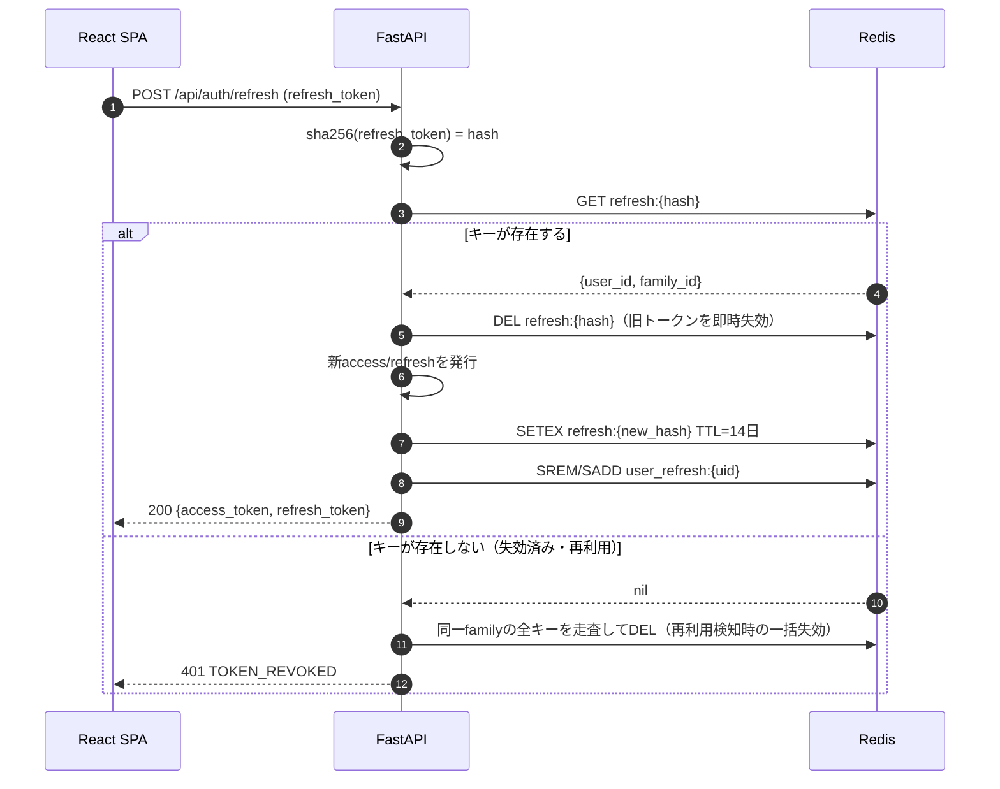
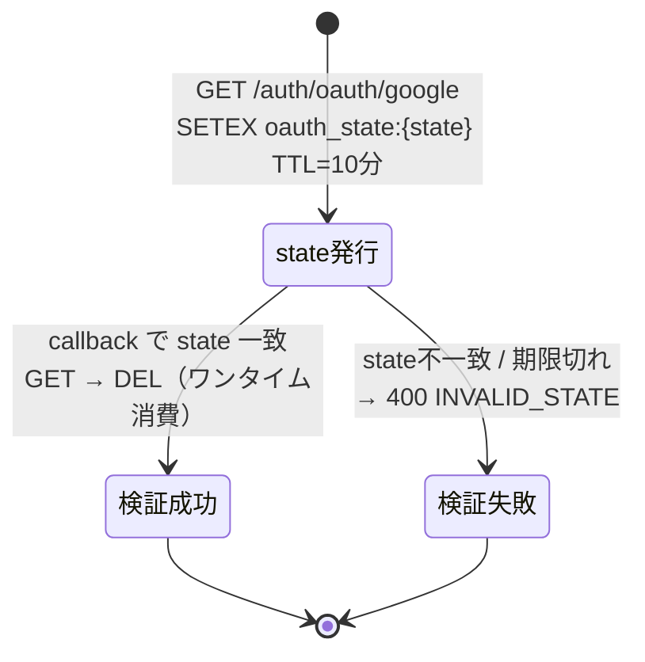
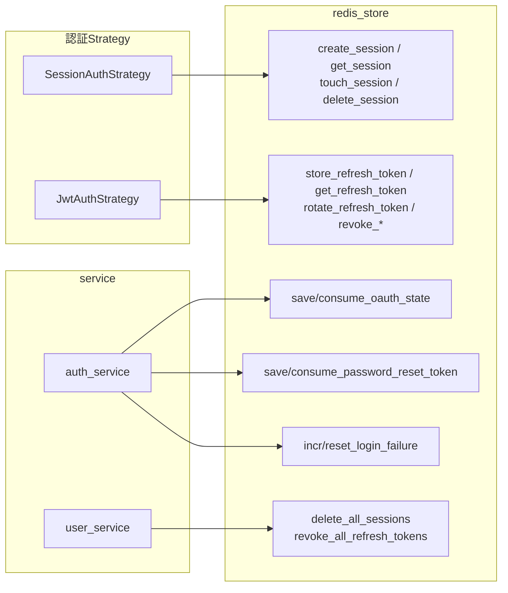

# 02 Redis設計

## 1. 設計方針

| 項目 | 方針 |
|------|------|
| バージョン | Redis 8（単一ノード） |
| 役割 | 「ログイン状態が有効か」を判定するための揮発ストア。永続データは持たない |
| 永続化 | RDB / AOF いずれも**無効**。再起動で全ログイン状態が失われることを許容（要件書§4） |
| 失効方式 | 全キーに TTL を設定し、期限切れで自動失効。ログアウト時は `DEL` で即時失効 |
| 値の形式 | JSON文字列（`SET` + TTL）。構造の把握が容易でCLIから確認しやすいため |
| DB番号 | `0` を本番/開発用、`1` をテスト用（`REDIS_DB` / `REDIS_TEST_DB` で切替） |
| キー名前空間 | `{用途}:{識別子}`。プレフィックスは環境変数 `REDIS_KEY_PREFIX`（既定は空）を前置可能 |
| クライアント | `redis-py`（asyncio版）。接続プールをアプリ起動時に生成し、`redis_client.py` で単一管理 |

## 2. キー一覧

| キー | 値（JSON） | TTL | 設定元 | 用途 |
|------|-----------|-----|--------|------|
| `session:{session_id}` | `{user_id, role, username, created_at, ip}` | `SESSION_TTL_SECONDS`（既定1800） | session方式のログイン | セッションの有効性判定 |
| `csrf:{session_id}` | `{token}` | セッションと同一 | session方式のログイン | CSRFトークンの照合 |
| `refresh:{token_hash}` | `{user_id, role, issued_at, family_id}` | `REFRESH_TTL_SECONDS`（既定1209600 = 14日） | jwt方式のログイン/リフレッシュ | リフレッシュトークンの有効性判定 |
| `user_sessions:{user_id}` | Set（session_id の集合） | `SESSION_TTL_SECONDS`（都度延長） | session方式のログイン | 全端末ログアウト・管理者による強制ログアウト |
| `user_refresh:{user_id}` | Set（token_hash の集合） | `REFRESH_TTL_SECONDS`（都度延長） | jwt方式のログイン | 同上（JWT方式） |
| `oauth_state:{state}` | `{redirect_to, code_verifier, created_at}` | `OAUTH_STATE_TTL_SECONDS`（既定600） | OAuth2認可開始 | CSRF対策のstate検証、PKCE検証値の保持 |
| `pwreset:{token_hash}` | `{user_id, requested_at}` | `PASSWORD_RESET_TTL_SECONDS`（既定1800） | パスワードリセット要求 | リセットトークンの有効性判定（設計判断 D-1） |
| `emailverify:{token_hash}` | `{user_id, requested_at}` | `EMAIL_VERIFY_TTL_SECONDS`（既定86400 = 24時間） | 会員登録・認証メール再送 | メール認証トークンの有効性判定（設計判断 D-6） |
| `emailverify_sent:{user_id}` | 直近の送信時刻（数値） | `EMAIL_VERIFY_RESEND_INTERVAL_SECONDS`（既定60） | 認証メール送信時に `SETEX` | 認証メール再送のレート制限（メール爆撃の防止） |
| `login_fail:{identifier}` | 連続失敗回数（数値） | `LOGIN_LOCK_WINDOW_SECONDS`（既定900） | ログイン失敗時に `INCR` | 総当たり対策のレート制限 |

**値に保存しない情報**：パスワード、パスワードハッシュ、アクセストークンそのもの、リフレッシュトークンの平文。

## 3. TTL設計

| キー | 延長（スライディング） | 理由 |
|------|----------------------|------|
| `session:{sid}` | **する** | 操作中にログアウトさせないため。上限は設けない（学習用途） |
| `refresh:{hash}` | **しない** | ローテーション時に新しいキーを発行するため、TTLは発行時点から固定 |
| `oauth_state`, `pwreset`, `emailverify` | しない | ワンタイム用途 |

> `session` のスライディング延長に上限（絶対有効期限）を設けるかは**要検討**。実務では絶対期限を併設するのが一般的。

## 4. データ遷移図

### 4.1 session方式のキー遷移

### 4.2 jwt方式のリフレッシュトークン・ローテーション

`family_id` は「1回のログインから派生するリフレッシュトークンの系列ID」。すでに削除済みのトークンが再提示された場合は盗用の可能性があるため、同一 family を全失効させる。

### 4.3 OAuth2 state の遷移

## 5. 操作関数詳細（`repository/redis_store.py`）

すべて async 関数。TTL値は `core/config.py` の設定から受け取り、関数内にハードコードしない。

### 5.1 セッション操作

| 関数 | 引数 | 戻り値 | 処理概要 |
|------|------|--------|----------|
| `create_session` | `user_id: UUID`, `role: str`, `username: str`, `ip: str \| None`, `ttl: int` | `tuple[str, str]`（session_id, csrf_token） | `secrets.token_urlsafe(32)` で session_id と csrf_token を生成 → `SETEX session:{sid}` / `SETEX csrf:{sid}` / `SADD user_sessions:{uid}` をパイプラインで実行 |
| `get_session` | `session_id: str` | `SessionData \| None` | `GET session:{sid}` → JSON復元。存在しなければ `None` |
| `touch_session` | `session_id: str`, `ttl: int` | `bool` | `EXPIRE session:{sid} ttl` と `EXPIRE csrf:{sid} ttl`。キーが無ければ `False` |
| `get_csrf_token` | `session_id: str` | `str \| None` | `GET csrf:{sid}` |
| `delete_session` | `session_id: str`, `user_id: UUID` | `None` | `DEL session:{sid}` / `DEL csrf:{sid}` / `SREM user_sessions:{uid}` |
| `delete_all_sessions` | `user_id: UUID` | `int`（削除件数） | `SMEMBERS user_sessions:{uid}` → 各 session/csrf を `DEL` → `DEL user_sessions:{uid}` |

### 5.2 リフレッシュトークン操作

| 関数 | 引数 | 戻り値 | 処理概要 |
|------|------|--------|----------|
| `store_refresh_token` | `token: str`, `user_id: UUID`, `role: str`, `family_id: str`, `ttl: int` | `None` | `sha256(token)` をキーに `SETEX refresh:{hash}` + `SADD user_refresh:{uid}` |
| `get_refresh_token` | `token: str` | `RefreshData \| None` | `GET refresh:{sha256(token)}` |
| `rotate_refresh_token` | `old_token: str`, `new_token: str`, `ttl: int` | `RefreshData` | 旧キーの取得と `DEL`、新キーの `SETEX` をトランザクション（`MULTI/EXEC`）で実行 |
| `revoke_refresh_token` | `token: str`, `user_id: UUID` | `None` | `DEL refresh:{hash}` + `SREM user_refresh:{uid}` |
| `revoke_token_family` | `user_id: UUID`, `family_id: str` | `int` | `SMEMBERS user_refresh:{uid}` を走査し、`family_id` 一致分を全削除（再利用検知時） |
| `revoke_all_refresh_tokens` | `user_id: UUID` | `int` | ユーザーの全リフレッシュトークンを削除 |

### 5.3 その他

| 関数 | 引数 | 戻り値 | 処理概要 |
|------|------|--------|----------|
| `save_oauth_state` | `state: str`, `redirect_to: str`, `code_verifier: str`, `ttl: int` | `None` | `SETEX oauth_state:{state}` |
| `consume_oauth_state` | `state: str` | `OAuthStateData \| None` | `GETDEL oauth_state:{state}`（ワンタイム消費） |
| `save_password_reset_token` | `token: str`, `user_id: UUID`, `ttl: int` | `None` | `SETEX pwreset:{sha256(token)}` |
| `consume_password_reset_token` | `token: str` | `UUID \| None` | `GETDEL pwreset:{hash}` → user_id を返す |
| `save_email_verify_token` | `token: str`, `user_id: UUID`, `ttl: int` | `None` | `SETEX emailverify:{sha256(token)}` |
| `consume_email_verify_token` | `token: str` | `UUID \| None` | `GETDEL emailverify:{hash}` → user_id を返す（ワンタイム消費） |
| `mark_email_verify_sent` | `user_id: UUID`, `interval: int` | `bool` | `SET emailverify_sent:{uid} NX EX interval`。`False` なら再送間隔内のため送信しない |
| `incr_login_failure` | `identifier: str`, `window: int` | `int`（現在の失敗回数） | `INCR login_fail:{identifier}` → 初回のみ `EXPIRE` |
| `reset_login_failure` | `identifier: str` | `None` | `DEL login_fail:{identifier}` |
| `ping` | なし | `bool` | ヘルスチェック（`/health` から使用） |

### 5.4 関数相関図

## 6. 障害・運用時の挙動

| ケース | 挙動 | 対応 |
|--------|------|------|
| Redis 再起動 | 全キー消失 → 全ユーザーがログアウト状態。API は 401 を返す | フロントは 401 を検知してログイン画面へ遷移。要件書で許容済み |
| Redis 接続不能 | 認証判定ができないため、認証必須APIは **503 SERVICE_UNAVAILABLE** を返す（fail-close） | `/health` に Redis 接続状態を含める |
| メモリ枯渇 | `maxmemory-policy` は **`noeviction`** とする | セッションが勝手に消えるのを防ぐため。LRU等でのeviction は採用しない |
| TTL満了直後のアクセス | `GET` が nil → 401 `SESSION_EXPIRED` / `TOKEN_EXPIRED` | フロントは再ログインへ誘導 |
| 同一ユーザーの多重ログイン | 許容（`user_sessions` に複数 session_id が並ぶ） | 端末ごとにログアウト可能 |

## 7. テスト方針

| 区分 | 方針 |
|------|------|
| 単体テスト | `fakeredis` を用い、TTL・失効ロジックを検証 |
| 結合テスト | 実 Redis コンテナ（CI では GitHub Actions の `services`）に接続し、`REDIS_TEST_DB` を使用 |
| TTL検証 | TTL秒を短く上書き（例：1秒）した設定でテストし、`asyncio.sleep` 後に失効を確認 |
| 後片付け | テストごとに `FLUSHDB`（テスト用DB番号に限定して実行） |
| 網羅できない範囲 | Redis 自身の障害（プロセスダウン中の挙動）は自動テストでは再現せず、手動確認とする |
