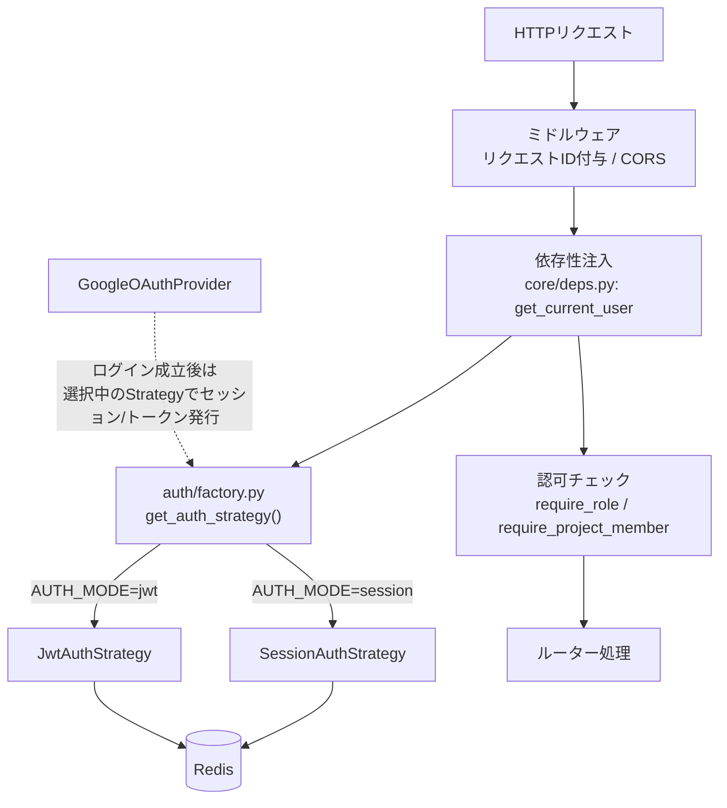
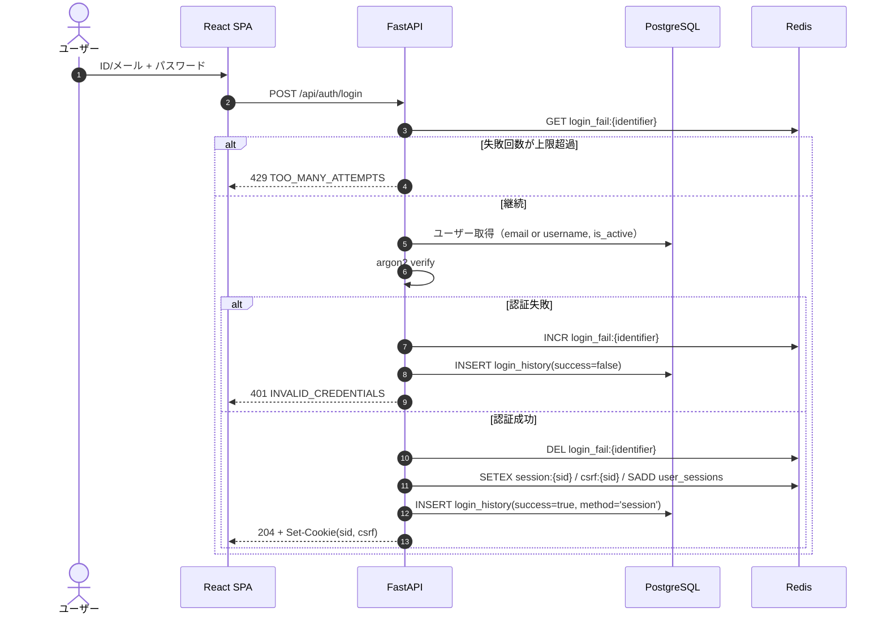
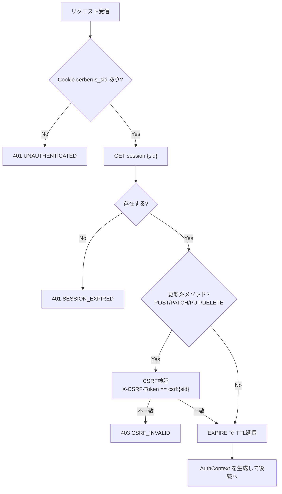
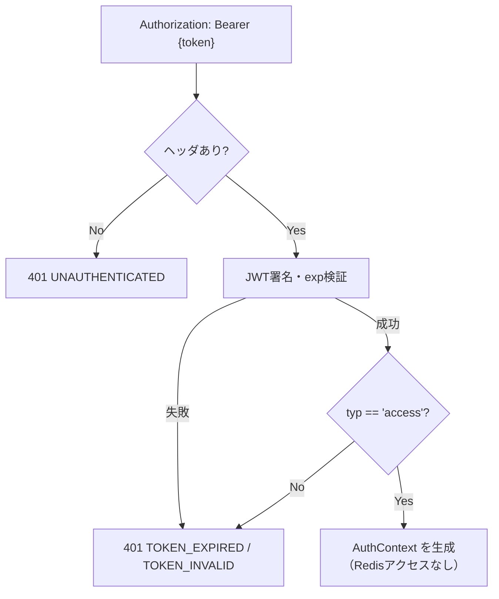
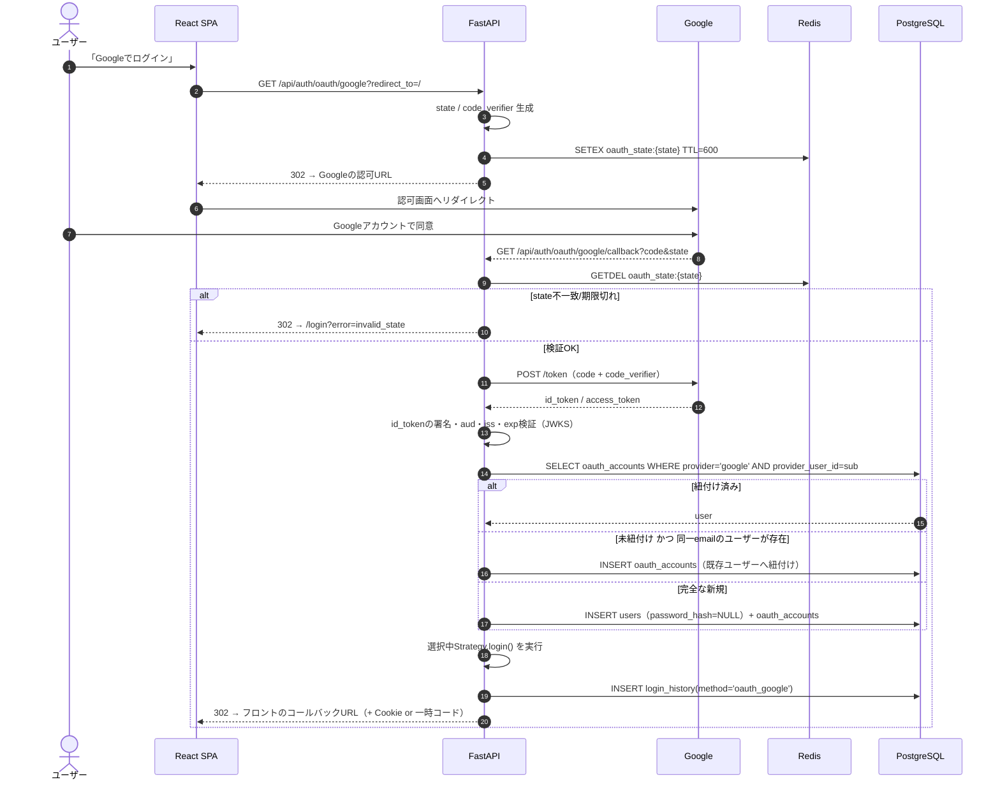
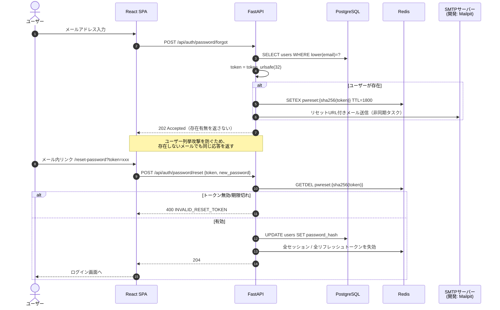
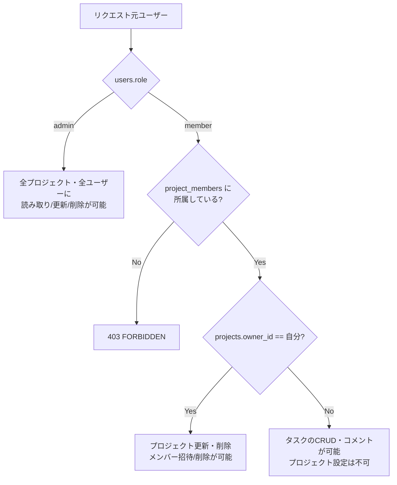

# 03 認証・認可設計

本システムの中心テーマ。`AUTH_MODE`（`session` / `jwt`）で認証方式を切り替え、加えて Google OAuth2 を常時併用できる構成とする。

## 1. 全体像

**要点**：OAuth2 は「本人確認の手段」であり、認証状態の保持方式は `AUTH_MODE` に従う。つまり Google ログイン後も、session モードなら Cookie セッション、jwt モードなら JWT が発行される。

## 2. Strategyパターン設計

### 2.1 抽象インターフェース（`auth/base.py`）

| メソッド | 引数 | 戻り値 | 責務 |
|----------|------|--------|------|
| `login` | `user: User`, `request: Request`, `response: Response` | `LoginResult` | 認証成立後の状態確立（Cookie設定 or トークン発行） |
| `authenticate` | `request: Request` | `AuthContext \| None` | リクエストからログイン状態を復元。無効なら `None` |
| `logout` | `request: Request`, `response: Response` | `None` | Redis上の状態を削除し、Cookieを破棄 |
| `refresh` | `request: Request`, `response: Response` | `LoginResult` | トークン再発行。session方式では `NotSupportedError`（405） |

### 2.2 ファクトリ（`auth/factory.py`）

| 関数 | 引数 | 戻り値 | 処理 |
|------|------|--------|------|
| `get_auth_strategy` | `settings: Settings`（DI） | `AuthStrategy` | `settings.auth_mode` に応じたインスタンスを返す。未知の値なら起動時に `ValueError` を送出（設定ミスを早期検出） |

`AUTH_MODE` は起動時に一度だけ評価し、リクエストごとの分岐コストを避ける（`@lru_cache`）。

## 3. session方式

### 3.1 Cookie仕様

| Cookie名 | 内容 | HttpOnly | Secure | SameSite | Path | 有効期限 |
|----------|------|----------|--------|----------|------|----------|
| `cerberus_sid` | session_id（`token_urlsafe(32)`） | **Yes** | 本番 Yes / ローカルHTTP時 No（`COOKIE_SECURE`） | `Lax` | `/` | セッションTTLと同一 |
| `cerberus_csrf` | CSRFトークン | **No**（JSが読む必要がある） | 同上 | `Lax` | `/` | 同上 |

Cookie名・`Secure` フラグ・`SameSite` はすべて環境変数化する（`COOKIE_NAME_SESSION` 等）。

### 3.2 シーケンス（ログイン）

### 3.3 認証（リクエストごと）

### 3.4 ログアウト

`DEL session:{sid}` / `DEL csrf:{sid}` / `SREM user_sessions:{uid}` を実行し、`Set-Cookie` で `Max-Age=0` を返す。**この時点で即時失効**する。

## 4. jwt方式

### 4.1 トークン仕様

| 種別 | 保存場所 | 有効期限 | Redis保持 | 内容 |
|------|----------|----------|-----------|------|
| アクセストークン | フロントのメモリ（Zustand。localStorage には置かない） | `ACCESS_TOKEN_TTL_SECONDS`（既定900） | **しない**（署名検証のみ） | `sub`(user_id), `role`, `username`, `iat`, `exp`, `jti`, `typ='access'` |
| リフレッシュトークン | HttpOnly Cookie `cerberus_rt`（推奨）| `REFRESH_TTL_SECONDS`（既定14日） | **する**（sha256ハッシュをキー） | ランダム文字列（`token_urlsafe(48)`）。JWTではない |

- 署名アルゴリズムは `HS256`、鍵は `JWT_SECRET_KEY`（`.env` / GitHub Secrets）
- リフレッシュトークンを JWT にしない理由：内容を持たせる必要がなく、ハッシュ化してRedisに保持するだけで失効管理が完結するため
- リフレッシュトークンを Cookie（HttpOnly）に置くことで、XSS でのトークン持ち出しリスクを下げる。**この場合は refresh エンドポイントにも CSRF 対策が必要**（4.4参照）

### 4.2 認証（リクエストごと）

アクセストークン検証時は Redis を参照しない（JWTの利点を体感するため）。したがって**ログアウト後もアクセストークンは最大15分間有効**であり、この点が session 方式との本質的な違いになる。

### 4.3 リフレッシュのシーケンス

[02_redis.md#42-jwt方式のリフレッシュトークンローテーション](./02_redis.md#42-jwt方式のリフレッシュトークンローテーション) を参照。

| ルール | 内容 |
|--------|------|
| ローテーション | `/auth/refresh` 成功時、旧リフレッシュトークンは必ず `DEL` する |
| 再利用検知 | 存在しないハッシュが提示された場合、同一 `family_id` の全トークンを失効させ 401 を返す |
| TTL | 新トークンのTTLは発行時点から14日（延長ではなく再設定） |

### 4.4 CSRF（jwt方式）

| 送信方式 | CSRFリスク | 対策 |
|----------|-----------|------|
| アクセストークンを `Authorization` ヘッダで送る | 低い（ブラウザが自動付与しないため） | 不要 |
| リフレッシュトークンを Cookie で送る | あり（`/auth/refresh` が自動的に叩ける） | `SameSite=Strict` + `/auth/refresh` のみ CSRF トークン検証を必須にする |

### 4.5 ログアウト

`DEL refresh:{hash}` を実行し、リフレッシュ Cookie を破棄。アクセストークンは失効させられないため、フロント側でメモリから破棄する。

> 即時失効を厳密に求める場合は「JWTのjtiをdenylistとしてRedisに残す」方式が必要。本設計では**採用しない**（session方式との差分を学習するのが目的）。

## 5. Google OAuth2

### 5.1 パラメータ

| 項目 | 値 |
|------|-----|
| フロー | Authorization Code Flow + PKCE（S256） |
| scope | `openid email profile` |
| クライアント情報 | `GOOGLE_CLIENT_ID` / `GOOGLE_CLIENT_SECRET`（`.env`・GitHub Secrets） |
| リダイレクトURI | `GOOGLE_REDIRECT_URI`（例：`http://localhost:8000/api/auth/oauth/google/callback`） |
| state | `token_urlsafe(32)`。Redis に10分TTLで保持しワンタイム消費 |
| 識別子 | `id_token` の `sub`（`oauth_accounts.provider_user_id`） |

### 5.2 シーケンス

### 5.3 アカウント紐付けルール

| ケース | 挙動 |
|--------|------|
| `provider_user_id` が既に登録済み | 該当ユーザーとしてログイン |
| 未登録だが `email` が既存ユーザーと一致 | 既存ユーザーに `oauth_accounts` を追加して紐付ける（Google側でメール検証済み `email_verified=true` の場合のみ） |
| `email_verified=false` | 紐付けを行わず 400 エラー（アカウント乗っ取り防止） |
| 完全な新規 | `users` を作成。氏名は Google の `given_name`/`family_name` から補完し、**フリガナ・生年月日は未入力となるため初回ログイン後に設定画面へ誘導する**（要検討：必須項目の扱い） |

> D-2 で氏名・フリガナ・生年月日を必須にしたため、OAuth新規登録時に必須項目が埋まらない矛盾が生じる。本設計では「OAuth作成ユーザーは `birth_date` / カナを NULL 許容にし、プロフィール未完了フラグで補完を促す」案を採る。**要検討**。

### 5.4 jwt モードでのトークン受け渡し

OAuth コールバックはブラウザのリダイレクトであるため、アクセストークンをURLに載せると履歴・Referer に残る。以下の方式とする。

1. コールバックで一時コード（`token_urlsafe(32)`、TTL60秒、Redisキー `oauth_handoff:{code}`）を発行し、`/oauth/callback?code=xxx` へリダイレクト
2. フロントが `POST /api/auth/oauth/exchange` でコードをトークンに交換

## 6. パスワードリセット

設計判断 D-1 により、メール送信を含めて実装する。

### 6.1 シーケンス

### 6.2 メール送信設計（`service/mail_service.py`）

| 項目 | 内容 |
|------|------|
| ライブラリ | `aiosmtplib` + `jinja2`（テンプレート） |
| 設定 | `SMTP_HOST` / `SMTP_PORT` / `SMTP_USER` / `SMTP_PASSWORD` / `SMTP_USE_TLS` / `MAIL_FROM` / `FRONTEND_BASE_URL` |
| 開発環境 | Mailpit コンテナ（`smtp:1025` / Web UI `:8025`）。実際のメールは外部送信しない |
| 送信方式 | `BackgroundTasks` による非同期送信。送信失敗はログに記録し、APIレスポンスは 202 のまま |
| テンプレート | `api/app/templates/mail/password_reset.html` / `.txt`。リセットURLは `FRONTEND_BASE_URL` から組み立てる |
| 本番SMTP | **要検討**（T-4）。学習範囲では Mailpit を既定とする |

| 関数 | 引数 | 戻り値 | 処理 |
|------|------|--------|------|
| `send_password_reset_mail` | `to: str`, `token: str`, `expires_minutes: int` | `None` | テンプレートをレンダリングし SMTP 送信。トークンは本文にのみ含め、ログには出力しない |

## 7. CSRF対策

| モード | 対策 | 検証対象 |
|--------|------|----------|
| session | Double Submit Cookie（`cerberus_csrf` Cookie と `X-CSRF-Token` ヘッダの一致 + Redis上の値との一致） | 更新系メソッド（POST / PUT / PATCH / DELETE）全て |
| jwt | Authorization ヘッダ方式のため原則不要 | ただし Cookie でリフレッシュトークンを送る `/auth/refresh` のみ検証 |

**共通の追加防御**

- `SameSite=Lax`（refresh Cookie は `Strict`）
- CORS は `CORS_ALLOW_ORIGINS`（環境変数）でフロントのオリジンのみ許可し、`allow_credentials=true`
- `Origin` / `Referer` ヘッダの検証をミドルウェアで実施（**要検討**：学習効果としては有用だが必須ではない）

## 8. 認可（RBAC）

### 8.1 権限モデル

### 8.2 依存性関数（`core/deps.py`）

| 関数 | 引数 | 戻り値 | 処理 | 失敗時 |
|------|------|--------|------|--------|
| `get_db` | なし | `AsyncSession` | DBセッションを払い出し、終了時にクローズ | - |
| `get_current_user` | `request`, `strategy`, `db` | `CurrentUser` | `strategy.authenticate()` → user_id から `users` を取得し `is_active` を確認 | 401 / 403(`USER_INACTIVE`) |
| `get_current_user_optional` | 同上 | `CurrentUser \| None` | 未認証でも例外を出さない（`/auth/me` 等で使用） | - |
| `require_admin` | `user: CurrentUser` | `CurrentUser` | `role == 'admin'` を確認 | 403 `FORBIDDEN` |
| `require_project_member` | `project_id`, `user`, `db` | `Project` | admin は無条件通過。それ以外は `project_members` の存在を確認 | 403 / 404 |
| `require_project_owner` | `project_id`, `user`, `db` | `Project` | admin または `owner_id == user.id` | 403 |
| `verify_csrf` | `request`, `strategy` | `None` | session モードかつ更新系メソッドの場合のみ CSRF 検証 | 403 `CSRF_INVALID` |

存在しないリソースと権限のないリソースの区別による情報漏洩を避けるため、**所属していないプロジェクトIDに対しては 404 を返す**方針とする（管理者のみ 403/404 を厳密に区別）。

## 9. パスワード・トークンのハッシュ

| 対象 | アルゴリズム | 備考 |
|------|-------------|------|
| パスワード | argon2id（`passlib[argon2]`） | `ARGON2_TIME_COST` / `ARGON2_MEMORY_COST` / `ARGON2_PARALLELISM` を環境変数化 |
| リフレッシュトークン | SHA-256 | 高エントロピーなランダム値のためストレッチ不要 |
| パスワードリセットトークン | SHA-256 | 同上 |
| CSRFトークン | ハッシュ化しない | 値の一致比較のみ。比較は `secrets.compare_digest` を使用 |

## 10. 3方式の比較（学習成果まとめ用）

| 観点 | session | jwt | OAuth2（Google） |
|------|---------|-----|------------------|
| 状態の保持場所 | サーバー（Redis） | クライアント（アクセストークン）＋サーバー（リフレッシュのみ） | 認可はGoogle、以後はsession/jwtに委譲 |
| ログアウトの即時性 | **即時**（キー削除） | アクセストークンは期限まで有効（最大15分） | 委譲先の方式に準ずる |
| サーバー台数を増やした場合 | Redisを共有すれば水平分割可能。Redisが単一障害点 | アクセストークン検証はストア不要でスケールしやすい。リフレッシュのみRedis依存 | 同左 |
| リクエストごとのストアアクセス | 毎回必要（`GET` + `EXPIRE`） | 不要（署名検証のみ） | - |
| CSRF対策 | **必須**（Cookie自動送信） | ヘッダ送信なら原則不要。Cookie利用箇所のみ必要 | コールバックの `state` 検証が必須 |
| XSSでの被害 | HttpOnly により Cookie は読めない | メモリ保持でも実行中スクリプトからは奪取され得る | - |
| 実装の複雑さ | 低い | ローテーション・再利用検知が必要で高い | 外部依存・リダイレクト処理があり高い |
| 失効の粒度 | セッション単位・ユーザー単位で容易 | family単位/ユーザー単位。個別アクセストークンは不可 | - |

## 11. テスト方針

| 区分 | 対象 | 内容 |
|------|------|------|
| 単体 | `core/security.py` | ハッシュ生成・検証、パスワードポリシー検証 |
| 単体 | 各 Strategy | `fakeredis` で login → authenticate → logout の状態遷移 |
| 結合 | `/auth/*` | `AUTH_MODE=session` / `AUTH_MODE=jwt` の両方でパラメータ化テストを実行 |
| 結合 | CSRF | sessionモードで `X-CSRF-Token` 欠落時に 403 となること |
| 結合 | リフレッシュ | ローテーション後に旧トークンが 401 となること、再利用検知でfamilyが全失効すること |
| 結合 | OAuth2 | Google の token / userinfo エンドポイントを `respx` でモックし、state検証・新規作成・既存紐付けを検証 |
| 結合 | パスワードリセット | SMTP は `aiosmtplib` をモック。存在しないメールでも202が返ること |
| 網羅できない範囲 | 実際の Google 認可画面での同意フロー | 外部サービスのUI操作は自動テスト対象外とし、手動確認とする |
