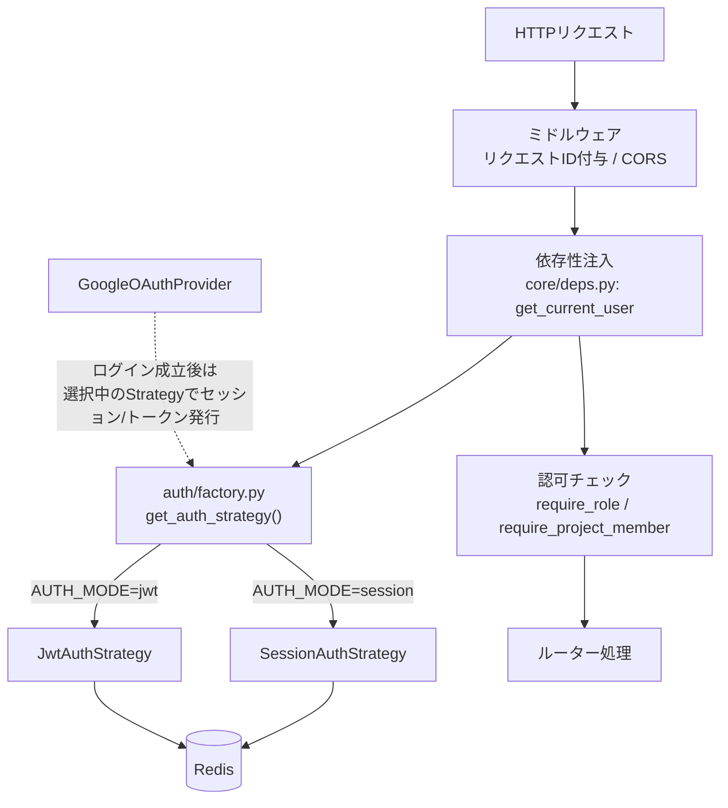
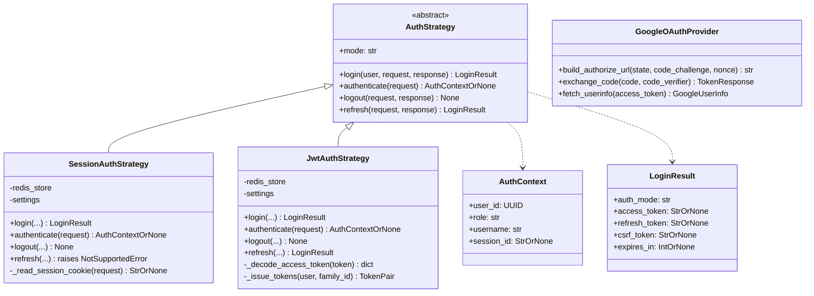
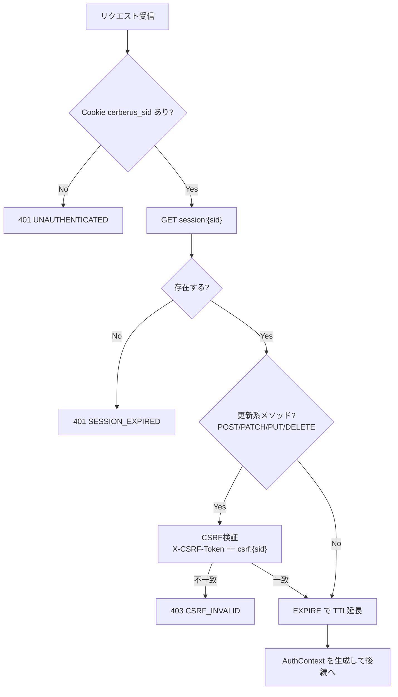
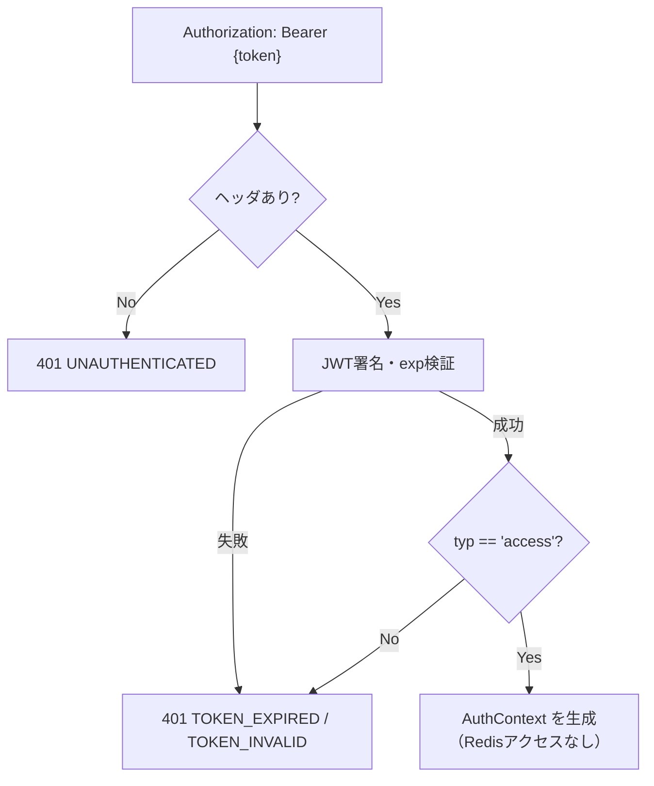
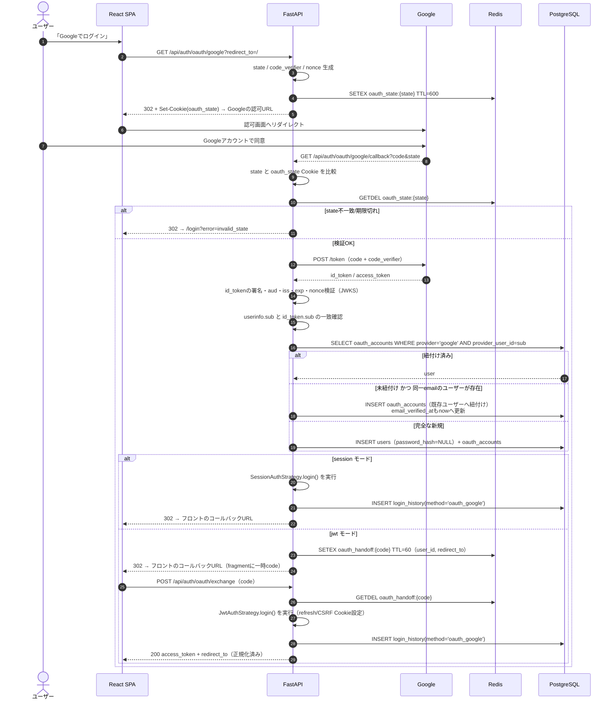
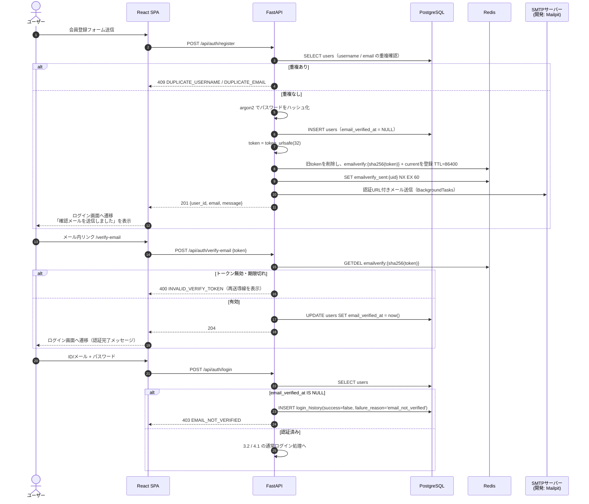
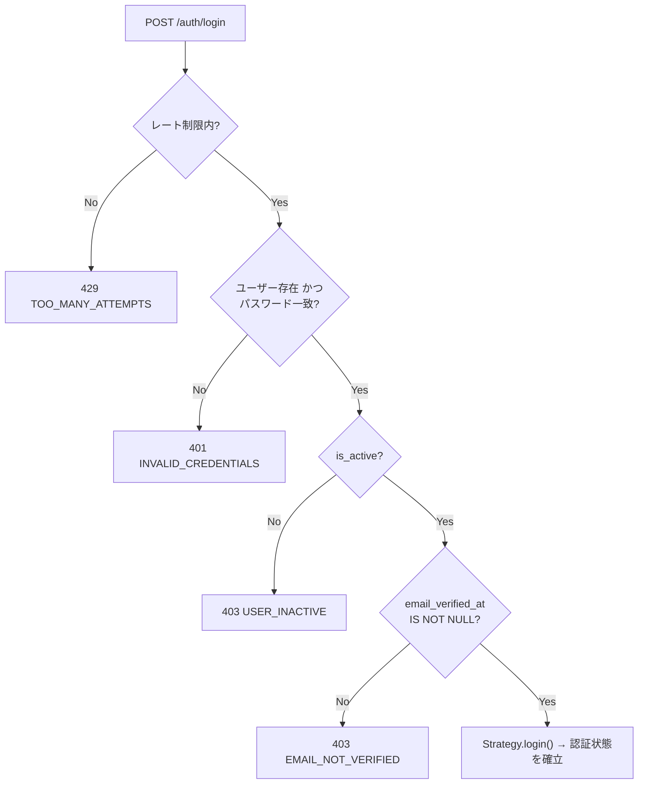
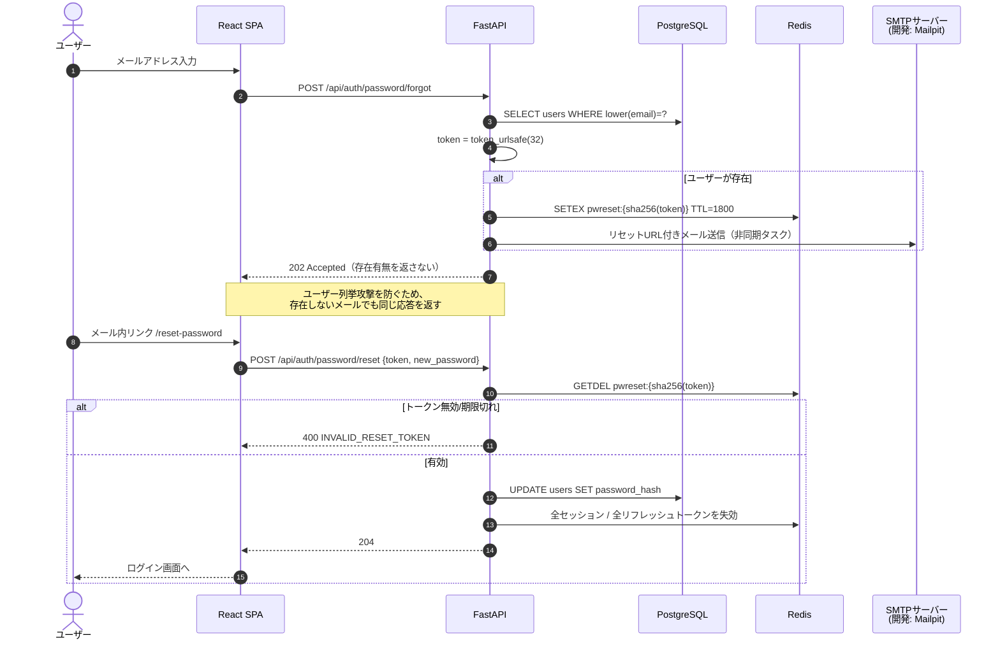
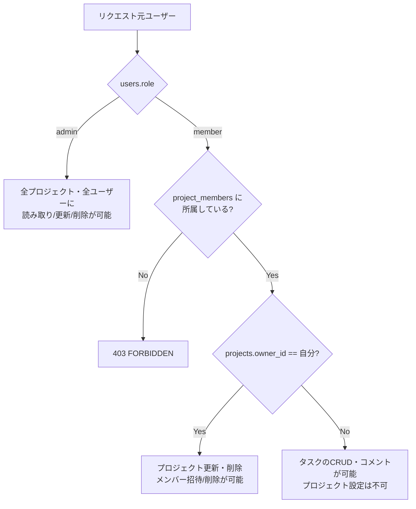

# 03 認証・認可設計

本システムの中心テーマ。`AUTH_MODE`（`session` / `jwt`）で認証方式を切り替え、加えて Google OAuth2 を常時併用できる構成とする。

## 1. 全体像

**要点**：OAuth2 は「本人確認の手段」であり、認証状態の保持方式は `AUTH_MODE` に従う。つまり Google ログイン後も、session モードなら Cookie セッション、jwt モードなら JWT が発行される。

## 2. Strategyパターン設計

### 2.1 抽象インターフェース（`auth/base.py`）

| メソッド | 引数 | 戻り値 | 責務 |
|----------|------|--------|------|
| `login` | `user: User`, `request: Request`, `response: Response` | `LoginResult` | 認証成立後の状態確立（Cookie設定 or トークン発行） |
| `authenticate` | `request: Request` | `AuthContext \| None` | リクエストからログイン状態を復元。無効なら `None` |
| `logout` | `request: Request`, `response: Response` | `None` | Redis上の状態を削除し、Cookieを破棄 |
| `refresh` | `request: Request`, `response: Response` | `LoginResult` | トークン再発行。session方式では `NotSupportedError`（405） |

### 2.2 ファクトリ（`auth/factory.py`）

| 関数 | 引数 | 戻り値 | 処理 |
|------|------|--------|------|
| `get_auth_strategy` | `settings: Settings`（DI） | `AuthStrategy` | `settings.auth_mode` に応じたインスタンスを返す。未知の値なら起動時に `ValueError` を送出（設定ミスを早期検出） |

`AUTH_MODE` は起動時に一度だけ評価し、リクエストごとの分岐コストを避ける（`@lru_cache`）。フロントは `GET /auth/config` の `auth_mode` を使用し、`VITE_AUTH_MODE` との二重管理は行わない。JWT/Redisから復元したrole・usernameは認可に使わず、常に `users` の現在値を使う。

## 3. session方式

### 3.1 Cookie仕様

| Cookie名 | 内容 | HttpOnly | Secure | SameSite | Path | 有効期限 |
|----------|------|----------|--------|----------|------|----------|
| `cerberus_sid` | session_id（`token_urlsafe(32)`） | **Yes** | 本番 Yes / ローカルHTTP時 No（`COOKIE_SECURE`） | `Lax` | `/` | `Max-Age` / `Expires` は設定しない（ブラウザ終了まで）。実際の有効期限はRedis TTLを正とする |
| `cerberus_csrf` | CSRFトークン | **No**（JSが読む必要がある） | 同上 | `Lax` | `/` | session Cookieと同じ。Redis TTLを正とする |
| `cerberus_oauth_state` | OAuth開始時のstate | **Yes** | 同上 | `Lax` | `/api/auth/oauth` | state TTLと同一。callback検証後に破棄 |

Cookie名・`Secure` フラグ・`SameSite` はすべて環境変数化する（`COOKIE_NAME_SESSION`、`COOKIE_NAME_CSRF`、`COOKIE_NAME_OAUTH_STATE` 等）。

### 3.2 シーケンス（ログイン）

### 3.3 認証（リクエストごと）

### 3.4 ログアウト

`DEL session:{sid}` / `DEL csrf:{sid}` / `SREM user_sessions:{uid}` を実行し、`Set-Cookie` で `Max-Age=0` を返す。**この時点で即時失効**する。

## 4. jwt方式

### 4.1 トークン仕様

| 種別 | 保存場所 | 有効期限 | Redis保持 | 内容 |
|------|----------|----------|-----------|------|
| アクセストークン | フロントのメモリ（Zustand。localStorage には置かない） | `ACCESS_TOKEN_TTL_SECONDS`（既定900） | **しない**（署名検証のみ） | `sub`(user_id), `iat`, `exp`, `jti`, `typ='access'`。role/usernameは含めずDBを正とする |
| リフレッシュトークン | HttpOnly Cookie `cerberus_rt` | `REFRESH_TTL_SECONDS`（既定14日） | **する**（sha256ハッシュをキー） | ランダム文字列（`token_urlsafe(48)`）。JWTではない。Cookie Pathは `/api/auth` |
| refresh用CSRFトークン | 非HttpOnly Cookie `cerberus_csrf` | refresh Cookieと同一 | **しない**（double-submit） | jwtログイン・OAuth交換時に発行し、`/auth/refresh` でCookie値とヘッダ値を比較 |

- 署名アルゴリズムは `HS256`、鍵は `JWT_SECRET_KEY`（`.env` / GitHub Secrets）
- jwtのrefresh Cookieは `HttpOnly`、`Secure=COOKIE_SECURE`、`SameSite=COOKIE_SAMESITE_REFRESH`（既定 `Strict`）、`Path=/api/auth`、`Max-Age=REFRESH_TTL_SECONDS` とする。ローテーション時は新しい値で再発行する
- jwtのCSRF Cookieは `HttpOnly` ではなく、`Secure=COOKIE_SECURE`、`SameSite=COOKIE_SAMESITE`、`Path=/`、`Max-Age=REFRESH_TTL_SECONDS` とする（SPAが `/settings` 等から読むため `Path=/` が必要）
- リフレッシュトークンを JWT にしない理由：内容を持たせる必要がなく、ハッシュ化してRedisに保持するだけで失効管理が完結するため
- リフレッシュトークンを Cookie（HttpOnly）に置くことで、XSS でのトークン持ち出しリスクを下げる。Cookieを自動送信する `/auth/refresh` には、CSRF検証とOrigin検証を必須とする（4.4参照）。

### 4.2 認証（リクエストごと）

アクセストークン検証時は Redis を参照しない（JWTの利点を体感するため）。したがって**ログアウト後もアクセストークンは最大15分間有効**であり、この点が session 方式との本質的な違いになる。

### 4.3 リフレッシュのシーケンス

[02_redis.md#42-jwt方式のリフレッシュトークンローテーション](./02_redis.md#42-jwt方式のリフレッシュトークンローテーション) を参照。

| ルール | 内容 |
|--------|------|
| ローテーション | `/auth/refresh` 成功時、Redis Luaで旧リフレッシュトークンを使用済み化し、新トークンを原子的に登録する |
| 再利用検知 | 使用済みtombstoneから `family_id` を特定し、`refresh_family_revoked` を設定して同一familyを失効させ 401 を返す |
| TTL | 新トークンのTTLは発行時点から14日（延長ではなく再設定） |

### 4.4 CSRF（jwt方式）

| 送信方式 | CSRFリスク | 対策 |
|----------|-----------|------|
| アクセストークンを `Authorization` ヘッダで送る | 低い（ブラウザが自動付与しないため） | 不要 |
| リフレッシュトークンを Cookie で送る | あり（`/auth/refresh` が自動的に叩ける） | jwtログイン時に `cerberus_csrf` を発行し、`/auth/refresh` で `X-CSRF-Token` とCookieの一致、および許可Originを検証。`SameSite=Strict` は追加防御 |

`/auth/refresh` はリクエストボディでrefresh tokenを受け取らず、HttpOnly Cookieだけを読む。フロントの起動時・401復帰時は `withCredentials=true` と `X-CSRF-Token` を付ける。CSRF値はjwt方式ではRedisに保存せず、session方式の `csrf:{session_id}` とは別のdouble-submitとして扱う。

### 4.5 ログアウト

sessionモードはsession Cookieを必要とし、`DEL session:{sid}` 等を実行する。jwtモードはアクセストークンが期限切れでもログアウトできるよう、refresh Cookie + CSRF header + Originを認証材料とし、refresh Cookieが存在する場合は `DEL refresh:{hash}` を実行する（アクセストークンは任意）。どちらもリクエスト成功時に認証Cookieを破棄する。jwtのlogoutはrefresh Cookieを自動送信するため、CSRF/Origin検証を必須とする。アクセストークンは失効させられないため、フロント側でメモリから破棄する。

> 即時失効を厳密に求める場合は「JWTのjtiをdenylistとしてRedisに残す」方式が必要。本設計では**採用しない**（session方式との差分を学習するのが目的）。

## 5. Google OAuth2

### 5.1 パラメータ

| 項目 | 値 |
|------|-----|
| フロー | Authorization Code Flow + PKCE（S256） |
| scope | `openid email profile` |
| クライアント情報 | `GOOGLE_CLIENT_ID` / `GOOGLE_CLIENT_SECRET`（`.env`・GitHub Secrets） |
| リダイレクトURI | `GOOGLE_REDIRECT_URI`（例：`http://localhost:5173/api/auth/oauth/google/callback`。frontendの `/api` proxy経由） |
| state | `token_urlsafe(32)`。Redis に10分TTLで保持しワンタイム消費。開始時に `cerberus_oauth_state` HttpOnly Cookieにも設定し、callbackでCookieとの一致を検証 |
| nonce | `token_urlsafe(32)`。stateと同じRedis値に保存し、id_tokenの `nonce` claim と一致検証 |
| 識別子 | `id_token` の `sub`（`oauth_accounts.provider_user_id`） |

`redirect_to` は state に保存する前に、`/` で始まり `//` で始まらない同一オリジンの相対パスへ正規化する。絶対URL・プロトコル相対URL・外部ドメインは受け付けず、違反時は既定値 `/` を使う。これによりOAuth完了後のopen redirectを防ぐ。

### 5.2 シーケンス

### 5.3 アカウント紐付けルール

| ケース | 挙動 |
|--------|------|
| `provider_user_id` が既に登録済み | 該当ユーザーとしてログイン |
| 未登録だが `email` が既存ユーザーと一致 | 既存ユーザーに `oauth_accounts` を追加して紐付け、`email_verified_at` がNULLなら `now()` に更新する（Google側でメール検証済み `email_verified=true` の場合のみ） |
| `email_verified=false` | 紐付けを行わず 400 エラー（アカウント乗っ取り防止） |
| 完全な新規 | `users` を作成（`email_verified_at = now()`：Google 側で検証済みのため確認メールは送らない）。`username` は `google_` + `sha256(sub)` 先頭16文字から生成する。氏名は Google の `given_name`/`family_name` から補完し、フリガナ・生年月日は NULL のまま作成して初回ログイン後に設定画面へ誘導する |

> 通常登録では氏名・フリガナ・生年月日を必須とするが、OAuth新規登録時はこれらが埋まらない。通常登録の入力要件は維持したまま、DBのプロフィール4項目は OAuth 新規ユーザーに限り NULL を許容し、`profile_completed`（4項目がすべて設定済みかをサーバーで算出）で補完を促す。OAuthユーザーの `username` はサーバーで必ず生成する。

### 5.4 jwt モードでのトークン受け渡し

OAuth コールバックはブラウザのリダイレクトであるため、アクセストークンをURLに載せると履歴・Referer に残る。以下の方式とする。

1. jwtモードのコールバックでは、ログイン処理を完了させずに一時コード（`token_urlsafe(32)`、TTL60秒、Redisキー `oauth_handoff:{code}`）を発行し、`/oauth/callback#code=xxx` へリダイレクトする。URLクエリには置かない
2. フロントがfragmentからコードを読み取り、`POST /api/auth/oauth/exchange` で一度だけ交換する。交換時に初めてJwtAuthStrategy.loginを実行し、refresh/CSRF Cookieとaccess token、およびstateに保存した正規化済み `redirect_to` を返す
3. sessionモードではコールバック中にSessionAuthStrategy.loginを実行し、正規化済み `redirect_to` をfragmentで付けた同じフロント経路へリダイレクトする

`LoginResult` の `refresh_token` / `csrf_token` はサーバー内部でCookieを設定するための一時値であり、JSONレスポンスやURLには含めない。`redirect_to` はstate保存時に検証済みの相対パスだけを返し、フロントは任意URLとして解釈しない。

## 6. 会員登録とメール認証

**登録処理では自動ログインを行わず**、確認メールの受信を通じてメールアドレスの所有を確認してからログインさせる。

| 論点 | 決定 | 理由 |
|------|------|------|
| 登録直後のログイン | **行わない**。`201` を返し、フロントは `/login` へ遷移させる | 認証状態の確立経路をログインの1本に集約でき、session / jwt いずれのモードでも登録APIが認証状態を持たずに済む |
| 未認証ユーザーのログイン | **拒否**（`403 EMAIL_NOT_VERIFIED`） | 到達しないメールアドレスでの登録を防ぎ、パスワードリセットが機能する前提を担保する |
| 認証状態の保持 | `users.email_verified_at`（`NULL` = 未認証） | 「いつ認証したか」を追跡できるようにするため（真偽値にしない） |
| トークン | `token_urlsafe(32)`。Redis `emailverify:{sha256(token)}` に24時間TTLでワンタイム保持。ユーザー単位の `emailverify_current:{uid}` で再送時に旧tokenを失効 | パスワードリセットと同じ方式に揃え、失効管理をRedisに集約する |
| Google OAuth 登録 | Google 側 `email_verified=true` を検証済みとみなし、`email_verified_at` を設定してそのままログイン | 確認メールの二重送信は冗長。`email_verified=false` は 5.3 のとおり 400 で拒否する |

### 6.1 シーケンス（登録 → 確認メール → ログイン）

> 既に認証済みのトークンを再度開いた場合、トークンは `GETDEL` で消費済みのため 400 となる。フロントは「既に認証済みの可能性があります」と案内し、ログイン画面への導線を出す。メール認証はワンタイム操作として扱い、冪等化は行わない。

### 6.2 ログイン時の判定順序

**パスワード検証を先に行う理由**：未認証であることを未検証のまま返すと、任意のメールアドレスに対して「登録済みか」を判定できてしまう（ユーザー列挙）。パスワードが正しい場合に限り `EMAIL_NOT_VERIFIED` を返す。

### 6.3 認証メールの再送

| 項目 | 内容 |
|------|------|
| エンドポイント | `POST /auth/verify-email/resend`（認証不要。`email` のみ受け取る） |
| レスポンス | 常に `202 Accepted`。存在しないメール・認証済みメールでも同じ応答（ユーザー列挙対策） |
| レート制限 | `emailverify_sent:{user_id}` が存在する間は送信しない（既定60秒。`EMAIL_VERIFY_RESEND_INTERVAL_SECONDS`） |
| 旧トークン | 再送時に `emailverify_current:{uid}` から旧token hashを逆引きして失効させる。常に有効な確認tokenはユーザーごとに1本 |

### 6.4 登録・認証の関数（`service/auth_service.py`）

| 関数 | 引数 | 戻り値 | 処理 |
|------|------|--------|------|
| `register` | `payload: RegisterRequest`, `background: BackgroundTasks` | `User` | 重複チェック → ハッシュ化 → `users` INSERT（`email_verified_at=NULL`）→ 認証トークン発行 → メール送信予約。**Strategy.login は呼ばない** |
| `verify_email` | `token: str` | `None` | `consume_email_verify_token` → `UPDATE users SET email_verified_at = now()`。無効なら `InvalidVerifyTokenError`（400） |
| `resend_verification` | `email: str`, `background: BackgroundTasks` | `None` | ユーザー検索 → 未認証かつ再送間隔外なら再送。該当なしでも例外は出さない |

## 7. パスワードリセット

メール送信を含めて実装する。

### 7.1 シーケンス

### 7.2 メール送信設計（`service/mail_service.py`）

| 項目 | 内容 |
|------|------|
| ライブラリ | `aiosmtplib` + `jinja2`（テンプレート） |
| 設定 | `SMTP_HOST` / `SMTP_PORT` / `SMTP_USER` / `SMTP_PASSWORD` / `SMTP_USE_TLS` / `MAIL_FROM` / `FRONTEND_BASE_URL`。パスワードリセットとメール認証で共用する |
| 開発環境 | Mailpit コンテナ（`smtp:1025` / Web UI `:8025`）。実際のメールは外部送信しない |
| 送信方式 | `BackgroundTasks` による非同期送信。送信失敗はログに記録し、APIレスポンスは 202 のまま |
| テンプレート | `api/app/templates/mail/password_reset.html` / `.txt`、`email_verification.html` / `.txt`。URLは `FRONTEND_BASE_URL` から組み立てる |
| 本番SMTP | 外部SMTPを使用。Mailpitはdevelopment Compose profileに限定し、productionでは起動しない |

| 関数 | 引数 | 戻り値 | 処理 |
|------|------|--------|------|
| `send_password_reset_mail` | `to: str`, `token: str`, `expires_minutes: int` | `None` | テンプレートをレンダリングし SMTP 送信。`{FRONTEND_BASE_URL}/password/reset#token=...` を本文に含める。トークンはログに出力しない |
| `send_email_verification_mail` | `to: str`, `token: str`, `expires_hours: int` | `None` | 会員登録・再送で使用。`{FRONTEND_BASE_URL}/verify-email#token=...` を本文に含める。トークンはログに出力しない |

メール内の認証・リセットURLは query string ではなく fragment（`#token=...`）を使う。fragmentはHTTPリクエストや通常のRefererに送られない。フロントは読み取り後に `history.replaceState` でURLから除去し、APIにはPOST本文でのみトークンを送る。

Google OAuthのみで登録したユーザーは `password_hash` が NULL のため、設定画面の `PUT /users/me/password` で `current_password` を省略してパスワードを設定できる。既にパスワードがあるユーザーでは `current_password` を必須とする。どちらの場合も成功後は全セッション・リフレッシュトークンを失効させる。JWTの既発行access tokenは最大15分残り得るため、即時失効は本設計の対象外とする。

## 8. CSRF対策

| モード | 対策 | 検証対象 |
|--------|------|----------|
| session | Double Submit Cookie（`cerberus_csrf` Cookie と `X-CSRF-Token` ヘッダの一致 + Redis上の値との一致） | 更新系メソッド（POST / PUT / PATCH / DELETE）全て |
| jwt | Authorization ヘッダ方式のため通常APIは不要 | Cookieでrefresh tokenを送る `/auth/refresh` と `/auth/logout` を検証。OAuth交換は一時code + Origin検証で保護 |

**共通の追加防御**

- `SameSite=Lax`（refresh Cookie は `Strict`）
- CORS は `CORS_ALLOW_ORIGINS`（環境変数）でフロントのオリジンのみ許可し、`allow_credentials=true`
- `Origin` を必須検証し、Originがない旧式クライアントではHTTPS環境に限り同一オリジンの `Referer` を検証する。許可Originは設定値と完全一致させる

## 9. 認可（RBAC）

### 9.1 権限モデル

### 9.2 依存性関数（`core/deps.py`）

| 関数 | 引数 | 戻り値 | 処理 | 失敗時 |
|------|------|--------|------|--------|
| `get_db` | なし | `AsyncSession` | DBセッションを払い出し、終了時にクローズ | - |
| `get_current_user` | `request`, `strategy`, `db` | `CurrentUser` | `strategy.authenticate()` → user_id から `users` を取得し `is_active` を確認。role / username / profileはPostgreSQLの現在値を使い、JWT/Redis内の値は認可に使わない | 401 / 403(`USER_INACTIVE`) |
| `get_current_user_optional` | 同上 | `CurrentUser \| None` | 条件付きで認証を利用する公開エンドポイントで使用。`/auth/me` は必須認証の `get_current_user` を使う | - |
| `require_admin` | `user: CurrentUser` | `CurrentUser` | `role == 'admin'` を確認 | 403 `FORBIDDEN` |
| `require_project_member` | `project_id`, `user`, `db` | `Project` | admin は無条件通過。それ以外は `project_members` の存在を確認 | 403 / 404 |
| `require_project_owner` | `project_id`, `user`, `db` | `Project` | admin または `owner_id == user.id` | 403 |
| `verify_origin` / `verify_csrf` | `request`, `strategy` | `None` | ログインを含むCookie発行・利用リクエストで許可Originを検証し、session モードの更新系、または jwt モードの `/auth/refresh`・`/auth/logout` ではCookie/headerのCSRFも検証 | 403 `CSRF_INVALID` |

存在しないリソースと権限のないリソースの区別による情報漏洩を避けるため、**所属していないプロジェクトIDに対しては 404 を返す**方針とする（管理者のみ 403/404 を厳密に区別）。

## 10. パスワード・トークンのハッシュ

| 対象 | アルゴリズム | 備考 |
|------|-------------|------|
| パスワード | argon2id（`passlib[argon2]`） | `ARGON2_TIME_COST` / `ARGON2_MEMORY_COST` / `ARGON2_PARALLELISM` を環境変数化 |
| リフレッシュトークン | SHA-256 | 高エントロピーなランダム値のためストレッチ不要 |
| パスワードリセットトークン | SHA-256 | 同上 |
| メール認証トークン | SHA-256 | 同上（Redis `emailverify:{hash}`） |
| CSRFトークン | ハッシュ化しない | 値の一致比較のみ。比較は `secrets.compare_digest` を使用 |

## 11. 3方式の比較（学習成果まとめ用）

| 観点 | session | jwt | OAuth2（Google） |
|------|---------|-----|------------------|
| 状態の保持場所 | サーバー（Redis） | クライアント（アクセストークン）＋サーバー（リフレッシュのみ） | 認可はGoogle、以後はsession/jwtに委譲 |
| ログアウトの即時性 | **即時**（キー削除） | アクセストークンは期限まで有効（最大15分） | 委譲先の方式に準ずる |
| サーバー台数を増やした場合 | Redisを共有すれば水平分割可能。Redisが単一障害点 | アクセストークン検証はストア不要でスケールしやすい。リフレッシュのみRedis依存 | 同左 |
| リクエストごとのストアアクセス | 毎回必要（`GET` + `EXPIRE`） | 不要（署名検証のみ） | - |
| CSRF対策 | **必須**（Cookie自動送信） | ヘッダ送信なら原則不要。Cookie利用箇所のみ必要 | コールバックの `state` 検証が必須 |
| XSSでの被害 | HttpOnly により Cookie は読めない | メモリ保持でも実行中スクリプトからは奪取され得る | - |
| 実装の複雑さ | 低い | ローテーション・再利用検知が必要で高い | 外部依存・リダイレクト処理があり高い |
| 失効の粒度 | セッション単位・ユーザー単位で容易 | family単位/ユーザー単位。個別アクセストークンは不可 | - |

## 12. テスト方針

| 区分 | 対象 | 内容 |
|------|------|------|
| 単体 | `core/security.py` | ハッシュ生成・検証、パスワードポリシー検証 |
| 単体 | 各 Strategy | `fakeredis` で login → authenticate → logout の状態遷移 |
| 結合 | `/auth/*` | `AUTH_MODE=session` / `AUTH_MODE=jwt` の両方でパラメータ化テストを実行 |
| 結合 | CSRF | sessionモードで `X-CSRF-Token` 欠落時に 403 となること |
| 結合 | リフレッシュ | ローテーション後に旧トークンが 401 となること、再利用検知でfamilyが全失効すること |
| 結合 | OAuth2 | Google の token / userinfo エンドポイントを `respx` でモックし、state検証・新規作成・既存紐付けを検証 |
| 結合 | OAuth2セキュリティ | state Cookie不一致、nonce不一致、外部 `redirect_to`、userinfo.sub不一致を拒否することを検証 |
| 結合 | パスワードリセット | SMTP は `aiosmtplib` をモック。存在しないメールでも202が返ること |
| 結合 | 会員登録 | 201 が返り、レスポンスに Cookie / トークンが**含まれない**こと（自動ログインしない）。`users.email_verified_at` が NULL であること |
| 結合 | メール認証 | 未認証ユーザーのログインが 403 `EMAIL_NOT_VERIFIED` となること。`/auth/verify-email` 成功後にログインできること。同一トークンの2回目が 400 となること |
| 結合 | 認証メール再送 | 再送間隔内の2回目は SMTP が呼ばれずに 202 が返ること |
| 結合 | OAuth新規ユーザー | username自動生成、プロフィールNULL、`profile_completed=false`、設定後のtrueを検証 |
| 網羅できない範囲 | 実際の Google 認可画面での同意フロー | 外部サービスのUI操作は自動テスト対象外とし、手動確認とする |
