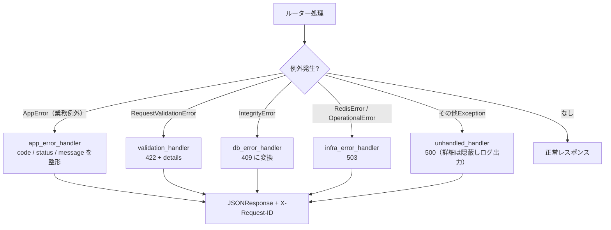
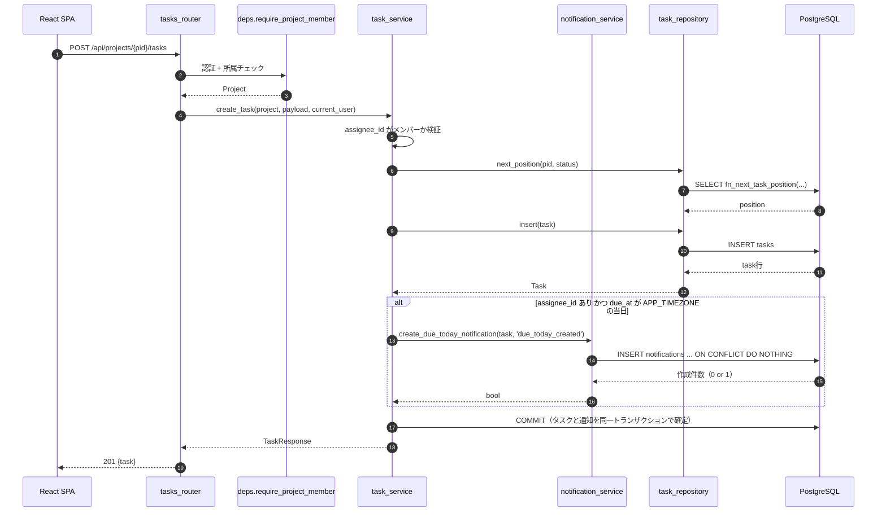
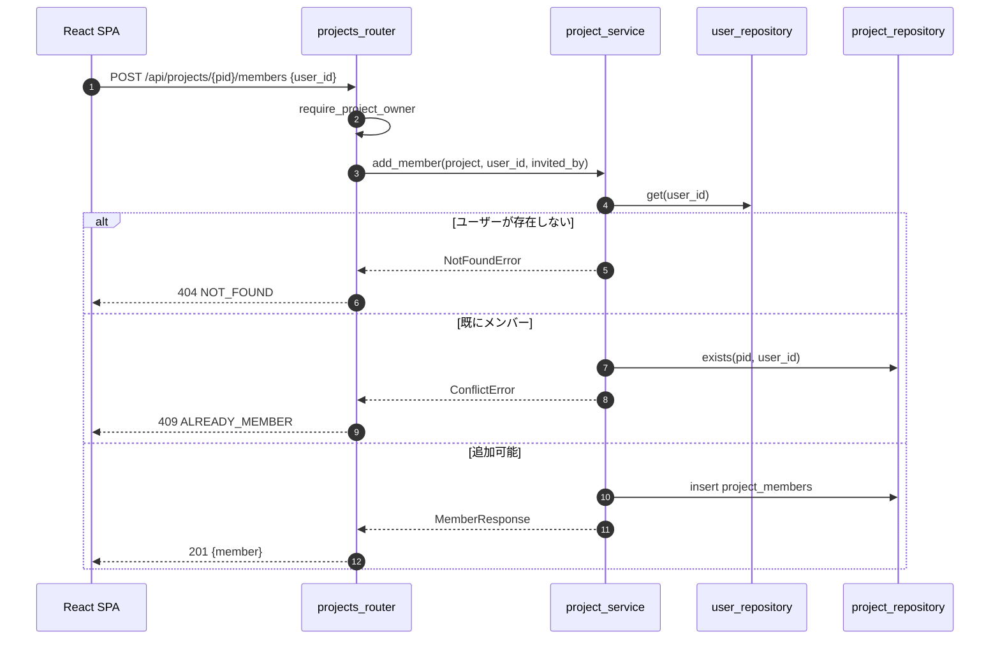
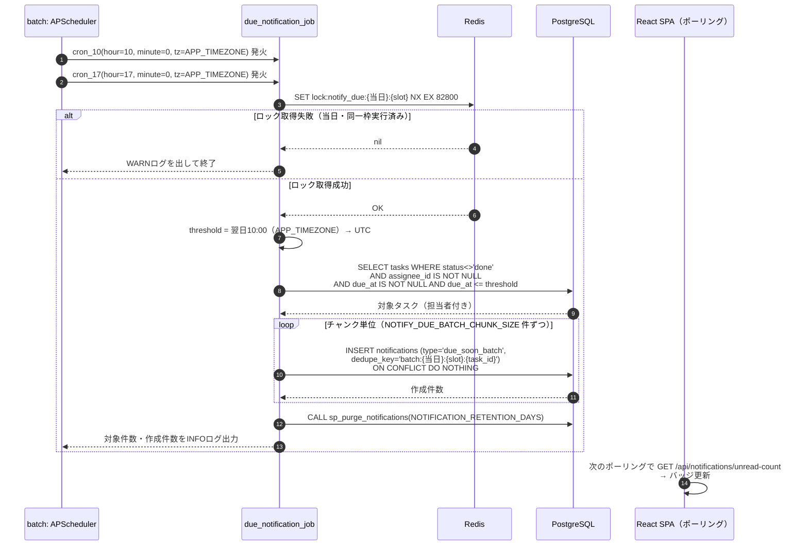

# 04 API設計

## 1. 共通仕様

| 項目 | 内容 |
|------|------|
| ベースURL | 同一オリジンの `/api`（開発時も `VITE_API_BASE_URL=/api` を基本とし、Vite/Nginxのproxyでbackendへ転送）。別オリジン構成は例外としてCORSを明示設定する |
| 形式 | JSON（`application/json`、UTF-8） |
| 日時形式 | ISO 8601 / UTC（例：`2026-09-03T04:05:06Z`）。リクエストでオフセット付きの日時（例：`2026-09-05T18:00:00+09:00`）を受け取った場合はUTCへ正規化して保存する。オフセットなしの日時は `APP_TIMEZONE`（既定 `Asia/Tokyo`）として解釈する |
| ID形式 | UUID v4 文字列 |
| 認証 | session モード：`cerberus_sid` Cookie ／ jwt モード：`Authorization: Bearer {access_token}` |
| CSRF | session モードの更新系リクエストは `X-CSRF-Token` ヘッダ必須 |
| APIドキュメント | FastAPI 自動生成（`/api/docs`、`/api/openapi.json`）。本番相当設定では無効化可能（`ENABLE_API_DOCS`） |
| バリデーション | pydantic v2。失敗時は 422 |
| ページング | 一覧系は原則 `?page=1&per_page=20`（既定20・最大100）とし、レスポンスに `meta` を含める。ただし、カンバン用タスク一覧・プロジェクトメンバー一覧・タスクコメント一覧はページングなし、自分のログイン履歴は直近50件固定とする |
| リクエストID | 全レスポンスに `X-Request-ID` を付与（ログ相関用） |
| API履歴 | `/api`配下の全リクエストを`api_history`へ1リクエスト1行で保存。2xx/3xxは`success`、4xx/5xxは`error`とし、エラーコード・処理時間・マスキング済みbodyを記録する。保持期間は既定30日 |
| 履歴保存失敗 | `api_history`への保存失敗はAPI本体の応答を変更せず、構造化標準出力へERRORを記録する |
| Origin検証 | Cookieを発行・利用する更新系API（ログイン、sessionの更新系、jwtの `/auth/refresh`・`/auth/logout`）とOAuth交換は許可Originを検証する。ログインはCSRF CookieがまだないためOriginのみ、その他は各方式のCSRF検証も行う。`allow_credentials=true` と `*` の併用は禁止 |

### 1.1 Rate Limit

`/auth/register`、メール認証・パスワード再設定、OAuth開始・callback・exchange、通知APIにRate Limitを適用する。上限・時間窓は [要件の確定表](../requirements/security_business_rules.md#21-ログイン以外のrate-limit) と `06_infra_cicd.md` §4.3を正とする。超過時は `429 TOO_MANY_ATTEMPTS` と `Retry-After` を返し、Rate Limit判定のRedis障害時は `503 SERVICE_UNAVAILABLE`（fail-close）とする。通常の参照系GETは対象外とする。

## 2. エンドポイント一覧

### 2.1 認証（`/api/auth`）

| メソッド | パス | 概要 | 認証 | 備考 |
|----------|------|------|------|------|
| POST | `/auth/register` | 会員登録（**自動ログインしない**。確認メールを送信し、フロントはログイン画面へ戻す） | 不要 | ユーザー名・氏名・フリガナ・生年月日・メール・パスワードを受け取る |
| POST | `/auth/login` | ログイン（`AUTH_MODE` に応じて分岐） | 不要 | `identifier` は email または username。メール未認証は 403 |
| GET | `/auth/config` | フロント起動用の公開設定（`auth_mode`、Google有効/無効、CSRF Cookie名） | 不要 | 認証情報・秘密情報は返さない。バックエンド設定を正とする |
| POST | `/auth/verify-email` | メール認証の実行 | 不要 | 確認メール内リンクのトークンを検証 |
| POST | `/auth/verify-email/resend` | 認証メールの再送 | 不要 | 常に 202。再送間隔の制限あり |
| POST | `/auth/logout` | ログアウト | session: session Cookie、jwt: refresh Cookie + CSRF（access tokenは任意） | 成功時に認証Cookieを破棄。jwtはaccess token期限切れでも実行可能 |
| POST | `/auth/refresh` | HttpOnly Cookieのリフレッシュトークンからアクセストークン再発行 | リフレッシュCookie + CSRF | **jwt モードのみ**。session モードは 405。bodyにrefresh tokenは受け取らない |
| GET | `/auth/me` | 現在のログインユーザー取得 | 必要 | フロントの起動時セッション復元に使用 |
| GET | `/auth/oauth/google` | Google OAuth2 認可開始 | 不要 | 302 リダイレクト |
| GET | `/auth/oauth/google/callback` | Google OAuth2 コールバック | 不要 | 302 リダイレクト（フロントへ） |
| POST | `/auth/oauth/exchange` | fragmentで受け取った一時コード → jwtトークン交換 | 一時コード | jwt モードのみ。Redisの `GETDEL` で一度だけ消費し、ここでrefresh/CSRF Cookieを発行 |
| POST | `/auth/password/forgot` | パスワードリセット要求（メール送信） | 不要 | 常に 202 |
| POST | `/auth/password/reset` | パスワードリセット実行 | 不要 | トークン検証 |

### 2.2 ユーザー（`/api/users`）

| メソッド | パス | 概要 | 認証 |
|----------|------|------|------|
| GET | `/users/me` | 自分のプロフィール取得 | 必要 |
| PATCH | `/users/me` | プロフィール更新（氏名・フリガナ・生年月日） | 必要 |
| PUT | `/users/me/password` | パスワード変更（現在のパスワード検証あり） | 必要 |
| GET | `/users/me/login-history` | 自分のログイン履歴（直近50件、ページングなし） | 必要 |

### 2.3 プロジェクト（`/api/projects`）

| メソッド | パス | 概要 | 認可 |
|----------|------|------|------|
| GET | `/projects` | 所属プロジェクト一覧（admin は全件） | member |
| POST | `/projects` | プロジェクト作成 | member |
| GET | `/projects/{project_id}` | プロジェクト詳細（メンバー一覧含む） | プロジェクトメンバー |
| PATCH | `/projects/{project_id}` | プロジェクト更新（名称・説明・開始/終了日時・`is_active`） | オーナー / admin |
| DELETE | `/projects/{project_id}` | プロジェクト論理削除（`is_active=false`。配下タスクは無変更で有効のまま） | オーナー / admin |
| GET | `/projects/{project_id}/members` | メンバー一覧 | プロジェクトメンバー |
| POST | `/projects/{project_id}/members` | メンバー招待（既存ユーザーを追加） | オーナー / admin |
| GET | `/projects/{project_id}/members/candidates?q=` | 招待候補検索（username / 表示名の前方一致。emailはレスポンスに含めない） | オーナー / admin |
| DELETE | `/projects/{project_id}/members/{user_id}` | メンバー削除 | オーナー / admin |

### 2.4 タスク・コメント

| メソッド | パス | 概要 | 認可 |
|----------|------|------|------|
| GET | `/projects/{project_id}/tasks` | タスク一覧（カンバン用。status別にソート済み） | プロジェクトメンバー |
| POST | `/projects/{project_id}/tasks` | タスク作成 | プロジェクトメンバー |
| GET | `/tasks` | タスク横断一覧（`project_id`で絞込可、`project_id=null`で未所属タスクのみ） | 本人が参照可能な範囲（所属プロジェクト全部＋自分の未所属タスク。adminは全件） |
| POST | `/tasks` | タスク作成（`project_id`任意。未指定・`null`ならプロジェクト未所属タスクとして作成） | member |
| GET | `/tasks/{task_id}` | タスク詳細 | プロジェクトメンバー（`project_id`がNULLの場合は作成者本人） |
| PATCH | `/tasks/{task_id}` | タスク更新（title/description/status/assignee/position/due_at/version/`is_active`） | プロジェクトメンバー（`project_id`がNULLの場合は作成者本人）。`is_active`の変更のみ作成者本人/プロジェクトオーナー/adminに限定 |
| DELETE | `/tasks/{task_id}` | タスク論理削除（`is_active=false`。position詰めは行わない） | プロジェクトメンバー（`project_id`がNULLの場合は作成者本人） |
| GET | `/tasks/{task_id}/comments` | コメント一覧 | プロジェクトメンバー |
| POST | `/tasks/{task_id}/comments` | コメント投稿 | プロジェクトメンバー |
| PATCH | `/comments/{comment_id}` | コメント編集 | 投稿者本人 / admin |
| DELETE | `/comments/{comment_id}` | コメント削除 | 投稿者本人 / admin |

コメント更新はLast Write Winsとし、`task_comments`にversion列を追加しない。同時更新は後からcommitされた本文を最終値とする。

`GET/POST /tasks`（issue #10で新設）はプロジェクトに紐づかない横断的なタスク操作用のフラットエンドポイントである。`GET/POST /projects/{project_id}/tasks` はプロジェクト配下専用として引き続き提供し、`project_id`はパス由来のみ（bodyには含めない）とする。詳細は [../detailed_design/api/tasks/](../detailed_design/api/tasks/) を参照。

### 2.5 管理者（`/api/admin`）

| メソッド | パス | 概要 | 認可 |
|----------|------|------|------|
| GET | `/admin/users` | 全ユーザー一覧（ページング・検索） | admin |
| PATCH | `/admin/users/{user_id}/role` | ロール変更（member ⇔ admin） | admin |
| PATCH | `/admin/users/{user_id}/status` | 有効化 / 無効化（`is_active`）。無効化時は全セッション・refreshを失効 | admin |
| POST | `/admin/users/{user_id}/force-logout` | 強制ログアウト（全セッション・全リフレッシュ失効） | admin |
| GET | `/admin/projects` | 全プロジェクト一覧 | admin |
| DELETE | `/admin/projects/{project_id}` | プロジェクト論理削除（`is_active=false`。所属・オーナーシップを問わず対象にできる） | admin |
| GET | `/admin/login-history` | 全ユーザーのログイン履歴（監査） | admin |

ロール変更・無効化では、自分自身の変更を拒否し、最後の有効adminを0人にする操作も拒否する（`409 SELF_MODIFICATION_NOT_ALLOWED` / `409 LAST_ADMIN_REQUIRED`）。無効化時はRedisの全セッション・refresh失効を先に完了してからDBを更新する。Redis失敗時はDBを更新せず `503 SERVICE_UNAVAILABLE` とし、部分失効は同じ処理を再実行する。JWTの既発行access tokenは、DBの `is_active` を毎回確認するため無効化直後から拒否される。強制ログアウトだけの場合はaccess tokenが最大 `ACCESS_TOKEN_TTL_SECONDS`（既定900秒）有効なままになり得る。

### 2.6 通知（`/api/notifications`）

| メソッド | パス | 概要 | 認可 |
|----------|------|------|------|
| GET | `/notifications` | 自分の通知一覧（`?page` `?per_page` `?unread_only`） | 本人のみ |
| GET | `/notifications/unread-count` | 未読件数のみを返す軽量エンドポイント（ポーリング用） | 本人のみ |
| PATCH | `/notifications/{notification_id}/read` | 通知を既読にする | 本人のみ |
| POST | `/notifications/read-all` | 自分の未読通知をすべて既読にする | 本人のみ |

いずれも「自分宛ての通知」だけを対象とし、他人の通知は admin であっても参照・更新できない（通知は監査対象ではなく個人の作業支援情報であるため）。他ユーザーの `notification_id` を指定した場合は存在を隠して `404 NOT_FOUND` を返す。

更新系（`PATCH /notifications/{id}/read`、`POST /notifications/read-all`）は session モードでCSRFトークンの検証対象となる。

### 2.7 その他

| メソッド | パス | 概要 | 認証 |
|----------|------|------|------|
| GET | `/api/health` | ヘルスチェック（DB / Redis の接続状態、`auth_mode`） | 不要 |

### 2.8 URL・転送・履歴記録の対応

本章の各API一覧で `/api` を省略しているパスも、外部公開URLとFastAPIルートでは `/api` を付ける。Nginxは `/api/` のプレフィックスを維持したままbackendへ転送する。

| 外部URL（ブラウザ） | Nginx | FastAPIルート | `api_history` |
|---------------------|-------|---------------|---------------|
| `/api/{resource}` | `location /api/` → `http://backend:8000/api/{resource}` | `/api/{resource}` | 記録する（成功・エラーを問わず） |
| `/api/health` | `location /api/` → `http://backend:8000/api/health` | `/api/health` | 記録する（ヘルスチェックも `/api` 配下） |
| `/`、`/{spa_route}` | Nginxの静的配信・SPA fallback | なし | 記録しない |

`api_history.path` にはクエリ文字列を含めず、FastAPIのルートテンプレート（例：`/api/tasks/{task_id}`）を保存する。Cookie、Authorizationヘッダ、bodyの秘匿情報は保存しない。詳細は [../detailed_design/log/00_history.md](../detailed_design/log/00_history.md) を参照する。

## 3. 主要スキーマ

### 3.1 認証

**`POST /auth/register`** リクエスト

| フィールド | 型 | 必須 | 制約 |
|-----------|----|------|------|
| username | string | ○ | 3〜50文字、`^[A-Za-z0-9_-]+$` |
| email | string | ○ | 50文字以内、メール形式 |
| password | string | ○ | 8文字以上、大文字英字/小文字英字/数字/記号のうち2種類以上 |
| password_confirm | string | ○ | `password` と一致 |
| last_name / first_name | string | ○ | 各30文字以内 |
| last_name_kana / first_name_kana | string | ○ | 各30文字以内、ひらがな・カタカナ・数字のみ |
| birth_date | string(date) | ○ | `YYYY-MM-DD`、未来日不可 |

レスポンス `201`（**認証情報は返さない**。Cookie もトークンも発行しない）

```json
{
  "id": "3f1c...",
  "email": "taro@example.com",
  "message": "確認メールを送信しました。メール内のリンクから認証を完了してください。"
}
```

**`POST /auth/verify-email`** リクエスト：`{ "token": "..." }`（確認メールのリンクに含まれるトークン）

レスポンス
- `204 No Content`：認証完了。フロントはログイン画面へ遷移する
- `400 INVALID_VERIFY_TOKEN`：トークンが無効・期限切れ・使用済み

**`POST /auth/verify-email/resend`** リクエスト：`{ "email": "..." }`

レスポンス `202 Accepted`（存在しないメール・認証済みメールでも同一応答。ユーザー列挙対策）

**`POST /auth/login`** リクエスト

| フィールド | 型 | 必須 | 説明 |
|-----------|----|------|------|
| identifier | string | ○ | username または email |
| password | string | ○ | |

レスポンス
- session モード：`204 No Content` + `Set-Cookie: cerberus_sid, cerberus_csrf`
- jwt モード：`200` `{ "access_token": "...", "token_type": "bearer", "expires_in": 900 }` + `Set-Cookie: cerberus_rt`（HttpOnly）/ `cerberus_csrf`（非HttpOnly）
- `403 EMAIL_NOT_VERIFIED`：ID/パスワードは正しいがメール未認証。フロントは再送導線を表示する

**`POST /auth/refresh`** はリクエストボディを持たず、HttpOnly `cerberus_rt` Cookieと `X-CSRF-Token` を受け取る。成功時は `200` `{ "access_token": "...", "token_type": "bearer", "expires_in": 900 }` と、新しい `cerberus_rt` / `cerberus_csrf` の `Set-Cookie` を返す。refresh tokenの平文はJSONに返さない。

**`POST /auth/logout`** はsessionモードでは `cerberus_sid` を使い、jwtモードではrefresh Cookieをハッシュ化して対象キーだけを失効させる。jwtでrefresh Cookieが無い場合もCookie破棄を行うだけの冪等な `204` とし、存在する場合はCSRF headerとOrigin検証を必須にする。

**`GET /auth/me`** レスポンス `200`

```json
{
  "id": "3f1c...",
  "username": "taro",
  "email": "taro@example.com",
  "last_name": "山田",
  "first_name": "太郎",
  "last_name_kana": "ヤマダ",
  "first_name_kana": "タロウ",
  "birth_date": "1995-04-01",
  "profile_completed": true,
  "role": "member",
  "has_password": true,
  "oauth_providers": ["google"],
  "auth_mode": "session"
}
```

**`GET /auth/config`** レスポンス `200`

```json
{
  "auth_mode": "jwt",
  "google_login_enabled": true,
  "csrf_cookie_name": "cerberus_csrf"
}
```

このエンドポイントは秘密情報を返さず、`Cache-Control: no-store` を付与する。フロントは起動時に取得した `auth_mode` でAuthAdapterを選択するため、frontendを再ビルドせずにbackendのモードを切り替えても認証方式が不一致にならない。

**`POST /auth/oauth/exchange`** レスポンス `200`

```json
{
  "access_token": "...",
  "token_type": "bearer",
  "expires_in": 900,
  "redirect_to": "/dashboard"
}
```

`redirect_to` はOAuth開始時にサーバーが検証・正規化した同一オリジン相対パスであり、refresh tokenはJSONに含めずCookieだけで返す。sessionモードのOAuth callbackも同じ `redirect_to` をfragmentでフロントへ渡す。

OAuthコールバックはブラウザの直接リダイレクトを受けるため、異常時もJSONの400応答ではなく `/login?error=...` への302リダイレクトを返す。§4.2のOAuth関連コードは内部判定およびフロント表示へのマッピングに使用する。

### 3.2 プロジェクト・タスク

**`POST /projects`** リクエスト：`{ "name": "...", "description": "...", "start_at": null, "end_at": null }`（name は1〜100文字。`start_at`/`end_at`は共にISO 8601の任意項目で、両方指定時は`end_at >= start_at`を422で検証）

**`POST /projects/{id}/tasks`** リクエスト

```json
{
  "title": "設計書をレビューする",
  "description": null,
  "status": "todo",
  "assignee_id": null,
  "due_at": null
}
```

`status` は省略時 `todo`、`assignee_id` は省略時 `null` とし、`position` は指定せず対象列の末尾へ採番する。指定された担当者は有効なプロジェクトメンバーでなければならない。レスポンスは `201 {task}` とする（`is_active`は常に`true`、`project_is_active`は所属プロジェクトの`is_active`をそのまま返す）。

**`GET /projects`** レスポンス `200`

```json
{
  "items": [
    {
      "id": "…",
      "name": "Cerberus開発",
      "description": "…",
      "owner": { "id": "…", "username": "taro", "display_name": "山田 太郎" },
      "member_count": 3,
      "task_counts": { "todo": 4, "in_progress": 2, "done": 7 },
      "is_owner": true,
      "is_active": true,
      "start_at": null,
      "end_at": null,
      "created_at": "2026-09-01T00:00:00Z"
    }
  ],
  "meta": { "page": 1, "per_page": 20, "total": 1, "total_pages": 1 }
}
```

デフォルトでは `is_active=true` のプロジェクトのみ返す。`?include_inactive=true` を指定すると無効化済みプロジェクトも含める（詳細な認可粒度は [../detailed_design/api/projects/01_get_projects.md](../detailed_design/api/projects/01_get_projects.md) を参照）。

OAuth新規ユーザーではプロフィール5項目が `null` になり得る。`profile_completed` は5項目がすべて設定済みの場合だけ `true` とし、フロントはOAuth直後に `/settings?complete_profile=1` へ誘導する。通常登録のリクエストでは5項目を必須とする。`display_name` は姓・名が両方そろった場合だけ「姓 名」とし、それ以外は `username` を返す。

**`GET /projects/{id}/tasks`** レスポンス `200`

```json
{
  "project_id": "…",
  "project_is_active": true,
  "columns": {
    "todo": [ { "id": "…", "title": "…", "assignee": null, "position": 0, "version": 1, "due_at": null, "comment_count": 0, "is_active": true, "project_is_active": true } ],
    "in_progress": [],
    "done": []
  }
}
```

status 別にグルーピングして返すことで、フロント側のカンバン描画をそのまま行える形にする。デフォルトでは`is_active=true`のタスクのみ返し、`?include_inactive=true`で無効分も含める。

**`GET /tasks`** レスポンス `200`（issue #10で新設。プロジェクトに紐づかない横断的なタスク一覧）

```json
{
  "items": [
    { "id": "…", "project_id": null, "project_is_active": null, "title": "買い出しリストを作る", "status": "todo", "is_active": true, "position": 0, "version": 1, "due_at": null }
  ],
  "meta": { "page": 1, "per_page": 20, "total": 1, "total_pages": 1 }
}
```

`?project_id={uuid}` で特定プロジェクトへ絞込、`?project_id=null` で未所属タスクのみに絞込。省略時は本人が参照可能な全タスク（所属プロジェクト全部＋自分が作成した未所属タスク。adminは全件）を返す。詳細は [../detailed_design/api/tasks/10_get_tasks.md](../detailed_design/api/tasks/10_get_tasks.md) を参照。

**`POST /tasks`** リクエスト（issue #10で新設）：`{ "project_id": null, "title": "...", "description": null, "status": "todo", "assignee_id": null, "due_at": null }`。`project_id`を指定した場合は`POST /projects/{id}/tasks`と同じ所属チェック・position採番を行い、未指定・`null`の場合はプロジェクト未所属タスクとして作成する（`assignee_id`は指定不可。詳細は [../detailed_design/api/tasks/11_post_tasks.md](../detailed_design/api/tasks/11_post_tasks.md) を参照）。レスポンスは `201 {task}`。

**`PATCH /tasks/{id}`** リクエスト（`version` を必須とし、それ以外は任意の部分更新）

| フィールド | 型 | 制約 |
|-----------|----|------|
| title | string | 1〜150文字 |
| description | string \| null | |
| status | string | `todo` / `in_progress` / `done` |
| assignee_id | string(uuid) \| null | 有効なプロジェクトメンバーであること |
| position | integer | 0以上。status変更時に省略した場合は移動先列の末尾。同じstatusの通常更新で省略した場合は現在位置を維持 |
| due_at | string(date-time) \| null | ISO 8601。オフセットなしは `APP_TIMEZONE` として解釈しUTCへ正規化。値が変化し、担当者があり、変更後が当日であれば通知を作成する |
| is_active | boolean | 作成者本人/プロジェクトオーナー/adminのみ変更可（再有効化を含む）。それ以外のユーザーが指定した場合は `403 FORBIDDEN` |
| version | integer | **必須**。取得時の値と一致した場合だけ更新し、成功時にサーバーが1加算 |

`version` が一致しない場合は `409 TASK_CONFLICT` を返す。status/position変更はDBトランザクション内で列の並べ替えと同時に行い、競合時はフロントがボードを再取得して再操作を促す。`project_id`の付け替え（プロジェクト間移動）は本APIのスコープ外。

**`PATCH /projects/{id}`** リクエストは `name`/`description` に加え `start_at`/`end_at`/`is_active` を任意フィールドとして受け付ける（`exclude_unset`方式）。`is_active`の変更はオーナー/adminのみ許可し、`true`に戻す再有効化も許容する。`start_at`/`end_at`は更新後の値で`end_at >= start_at`を検証する。

**`PUT /users/me/password`** リクエスト：`{ "current_password": "...", "new_password": "...", "password_confirm": "..." }`

`current_password` は既存パスワードがあるユーザーでは必須、OAuthのみで登録され `has_password=false` のユーザーでは省略可。成功時は全セッション・リフレッシュトークンを失効し、`204` を返す。

**`PATCH /users/me`** は、`last_name` / `first_name` / `last_name_kana` / `first_name_kana` / `birth_date` のうち指定された項目だけを更新する。各文字列は1〜30文字、フリガナはひらがな・カタカナ・数字のみ、生年月日は未来日不可とし、値の `null` への変更は許可しない。OAuth新規ユーザーは未設定項目をこのAPIで補完し、5項目がすべて設定された時点で `profile_completed=true` になる。

### 3.3 通知

**`GET /notifications`** レスポンス `200`

```json
{
  "items": [
    {
      "id": "…",
      "type": "due_soon_batch",
      "title": "設計書をレビューする",
      "body": "期限が近いタスクです",
      "task": { "id": "…", "project_id": "…", "title": "設計書をレビューする" },
      "due_at": "2026-09-05T09:00:00Z",
      "read_at": null,
      "created_at": "2026-09-04T01:00:00Z"
    }
  ],
  "meta": { "page": 1, "per_page": 20, "total": 1, "total_pages": 1 },
  "unread_count": 1
}
```

- `type` は `due_soon_batch`（毎日10時・17時の定期通知） / `due_today_created`（当日期限のタスクを作成） / `due_today_updated`（終了時刻を当日へ変更）の3種
- `task` は対象タスクが削除済みの場合 `null`。フロントは `null` のとき遷移リンクを描画しない
- `unread_count` を一覧にも含め、一覧を開いた直後のバッジ表示に追加リクエストを要さないようにする
- `?unread_only=true` を指定した場合は未読のみを返す（`meta.total` も未読件数になる）

**`GET /notifications/unread-count`** レスポンス `200`：`{ "unread_count": 3 }`

ポーリングで最も高頻度に呼ばれるため、`ix_notifications_user_unread` による件数取得のみを行い、通知本体は返さない。

**`PATCH /notifications/{id}/read`** レスポンス `200`：`{ "id": "…", "read_at": "2026-09-04T02:00:00Z", "unread_count": 2 }`

既読済みの通知に対しても `200` を返し、`read_at` は上書きしない（冪等）。

**`POST /notifications/read-all`** リクエストボディなし。レスポンス `200`：`{ "updated_count": 3, "unread_count": 0 }`

`WHERE user_id = :me AND read_at IS NULL` に限定して更新するため、未読が0件でも `200`（`updated_count: 0`）を返す。

**通知の自動作成契機**

| 契機 | 条件 | 作成される `type` |
|------|------|------------------|
| `POST /projects/{id}/tasks`、`POST /tasks`（`project_id`指定時） | `assignee_id` があり、`due_at` が `APP_TIMEZONE` における**当日**の範囲内 | `due_today_created` |
| `PATCH /tasks/{id}` | `due_at` が変更され、`assignee_id` があり、変更後の `due_at` が**当日**の範囲内 | `due_today_updated` |
| `batch` の日次ジョブ | 毎日10時・17時。未完了かつ担当者ありで `due_at <= 翌日10:00` | `due_soon_batch` |

通知の作成はタスク作成／更新と**同一トランザクション**で行う（通知だけが残る・通知だけが欠けるという不整合を避けるため）。`UNIQUE (user_id, dedupe_key)` に競合した場合は `DO NOTHING` とし、タスク側の処理は成功させる。担当者が操作者自身であっても通知を作成する（要件書§3.4 N-6 に例外規定がないため）。

## 4. エラー設計

### 4.1 レスポンス形式

```json
{
  "error": {
    "code": "PROJECT_FORBIDDEN",
    "message": "このプロジェクトへのアクセス権がありません",
    "details": null,
    "request_id": "550e8400-e29b-41d4-a716-446655440000"
  }
}
```

422（バリデーションエラー）のみ `details` にフィールド単位の情報を格納する。

```json
{
  "error": {
    "code": "VALIDATION_ERROR",
    "message": "入力内容に誤りがあります",
    "details": [
      { "field": "password", "message": "8文字以上で、2種類以上の文字種を含めてください" }
    ],
    "request_id": "550e8400-e29b-41d4-a716-446655440000"
  }
}
```

### 4.2 エラーコード一覧

| HTTP | code | 発生条件 |
|------|------|----------|
| 400相当 | `INVALID_STATE` | OAuth2 の state 不一致・期限切れ（callbackは302リダイレクト） |
| 400 | `INVALID_RESET_TOKEN` | パスワードリセットトークンが無効・期限切れ |
| 400 | `INVALID_VERIFY_TOKEN` | メール認証トークンが無効・期限切れ・使用済み |
| 400相当 | `OAUTH_EMAIL_UNVERIFIED` | Google 側でメール未検証のため紐付け不可（callbackは302リダイレクト） |
| 400 | `OAUTH_HANDOFF_INVALID` | OAuthの一時コードが無効・期限切れ・使用済み（exchangeはJSONの400） |
| 401 | `UNAUTHENTICATED` | 認証情報なし |
| 401 | `INVALID_CREDENTIALS` | ID/パスワード不一致 |
| 401 | `SESSION_EXPIRED` | セッションが Redis に存在しない |
| 401 | `TOKEN_EXPIRED` | アクセストークンの有効期限切れ |
| 401 | `TOKEN_INVALID` | 署名不正・トークン種別不正 |
| 401 | `TOKEN_REVOKED` | リフレッシュトークンが失効済み（再利用検知を含む） |
| 403 | `FORBIDDEN` | ロール不足（管理者専用APIへのアクセス等） |
| 403 | `CSRF_INVALID` | CSRFトークン不一致・欠落 |
| 403 | `USER_INACTIVE` | `is_active = false` |
| 403 | `EMAIL_NOT_VERIFIED` | メール認証が未完了（`email_verified_at IS NULL`）のままログインを試行 |
| 404 | `NOT_FOUND` | リソース不存在、または権限がなく存在を隠す場合 |
| 405 | `NOT_SUPPORTED_IN_MODE` | 現在の `AUTH_MODE` では利用不可（session時の `/auth/refresh`） |
| 409 | `DUPLICATE_USERNAME` / `DUPLICATE_EMAIL` | 一意制約違反 |
| 409 | `ALREADY_MEMBER` | 既に参加済みのユーザーを招待 |
| 409 | `OWNER_CANNOT_BE_REMOVED` | オーナーをメンバーから外そうとした |
| 409 | `TASK_CONFLICT` | task version不一致。別ユーザーが先に更新した |
| 409 | `SELF_MODIFICATION_NOT_ALLOWED` | 管理者が自分自身を降格・無効化しようとした |
| 409 | `LAST_ADMIN_REQUIRED` | 最後の有効adminを降格・無効化しようとした |
| 409 | `ASSIGNEE_INACTIVE` | 無効化されたユーザーを担当者に指定した |
| 422 | `VALIDATION_ERROR` | pydantic バリデーション失敗 |
| 429 | `TOO_MANY_ATTEMPTS` | ログインその他のRate Limit上限超過。`Retry-After`を付与 |
| 500 | `INTERNAL_ERROR` | 未捕捉例外（詳細はレスポンスに含めずログのみ） |
| 503 | `SERVICE_UNAVAILABLE` | Redis / DB 接続不能（fail-close） |

### 4.3 例外ハンドリングの流れ



## 5. 認可マトリクス

| API | 未認証 | member（非所属） | member（所属） | オーナー | admin |
|-----|--------|-----------------|---------------|----------|-------|
| `GET /auth/config`、`POST /auth/register` `/login` `/verify-email*` `/password/*` | ○ | ○ | ○ | ○ | ○ |
| `GET /auth/me` `/users/me` | × | ○ | ○ | ○ | ○ |
| `GET /projects` | × | ○（自分の分のみ） | ○ | ○ | ○（全件） |
| `POST /projects` | × | ○ | ○ | ○ | ○ |
| `GET /projects/{id}` `/tasks` | × | ×（404） | ○ | ○ | ○ |
| `POST /projects/{id}/tasks` `PATCH /tasks/{id}` | × | ×（404） | ○ | ○ | ○ |
| `GET /tasks` `POST /tasks` | × | ○（自分の未所属分＋所属分のみ） | ○ | ○ | ○（全件） |
| `PATCH /tasks/{id}` の `is_active` | × | ×（404） | ×（403、非作成者かつ非オーナー） | ○ | ○ |
| `PATCH /projects/{id}` `DELETE /projects/{id}` | × | ×（404） | ×（403） | ○ | ○ |
| `GET /projects/{id}/members/candidates`、`POST/DELETE /projects/{id}/members` | × | ×（404） | ×（403） | ○ | ○ |
| `PATCH /comments/{id}` `DELETE /comments/{id}` | × | ×（404） | 投稿者本人のみ○ | 投稿者本人のみ○ | ○ |
| `/notifications*` | × | ○（自分宛てのみ） | ○（自分宛てのみ） | ○（自分宛てのみ） | ○（自分宛てのみ。他人の通知は×） |
| `/admin/*` | × | ×（403） | ×（403） | ×（403） | ○ |

## 6. 主要処理のシーケンス

### 6.1 タスク作成



### 6.2 メンバー招待



### 6.3 毎日10時・17時の期限通知バッチ

`batch` コンテナはAPIを経由せず、DB / Redis へ直接アクセスする（詳細は [06_infra_cicd.md §2](./06_infra_cicd.md#2-docker-compose-構成)）。



抽出条件に**下限を設けない**ため、期限を過ぎた未完了タスクは10時・17時に各1回リマインドされる。`dedupe_key` に実行日と実行枠を含めるため、同じタスクでも枠が変われば再通知され、同じ枠の再実行では重複しない。両枠の対象期限は共通して翌日10時までとする。

## 7. サービス層の関数一覧

### 7.1 `service/auth_service.py`

| 関数 | 引数 | 戻り値 | 処理概要 |
|------|------|--------|----------|
| `register` | `payload: RegisterRequest`, `background: BackgroundTasks` | `User` | 重複チェック → パスワードハッシュ化 → `users` INSERT（`email_verified_at=NULL`）→ 認証トークン発行 → 確認メール送信予約。**Strategy.login は呼ばない** |
| `verify_email` | `token: str` | `None` | Redis のトークンをワンタイム消費 → `email_verified_at` を更新。無効なら 400 |
| `resend_verification` | `email: str`, `background: BackgroundTasks` | `None` | 未認証ユーザーかつ再送間隔外の場合のみ再送。該当しなくても例外を出さない |
| `login` | `identifier: str`, `password: str`, `request`, `response` | `LoginResult` | レート制限確認 → ユーザー取得 → パスワード検証 → `is_active` / `email_verified_at` 確認 → Strategy.login → `login_history` 記録 |
| `logout` | `request`, `response`, `user: CurrentUser \| None` | `None` | sessionはsession Cookie、jwtはrefresh Cookieを使ってStrategy.logout。jwtはaccess tokenなしでも実行可能 |
| `refresh` | `request`, `response` | `LoginResult` | Strategy.refresh（session モードでは `NotSupportedError`） |
| `oauth_start` | `redirect_to: str \| None` | `str`（認可URL） | state/PKCE 生成 → Redis保存 → 認可URL組み立て |
| `oauth_callback` | `code: str`, `state: str`, `request`, `response` | `OAuthCallbackResult` | state Cookie/Redis消費 → code交換 → id_token（nonce含む）検証 → ユーザー解決/作成。sessionはここでloginしてredirect_toを返し、jwtはhandoff codeだけ発行 |
| `oauth_exchange` | `code: str`, `request`, `response` | `OAuthExchangeResult` | jwtのみ。handoff codeをGETDELで消費 → user_idから現在の有効ユーザーを再取得 → JwtStrategy.login → 履歴記録。正規化済みredirect_toも返す |
| `request_password_reset` | `email: str` | `None` | ユーザー検索 → トークン生成 → Redis保存 → メール送信（存在しなくても例外を出さない） |
| `reset_password` | `token: str`, `new_password: str` | `None` | トークン消費 → パスワード更新 → 全セッション/トークン失効 |

### 7.2 `service/project_service.py` / `task_service.py`

| 関数 | 引数 | 戻り値 | 備考 |
|------|------|--------|------|
| `list_projects` | `user`, `page`, `per_page`, `include_inactive` | `Page[ProjectSummary]` | admin は全件、member は所属分のみ。既定は`is_active=true`のみ |
| `create_project` | `user`, `payload` | `Project` | projects と project_members を同一トランザクションで作成。`start_at`/`end_at`を任意で受け取る |
| `update_project` | `project`, `payload` | `Project` | オーナー or admin 前提（認可はdeps側）。`is_active`/`start_at`/`end_at`の部分更新も担う |
| `deactivate_project` | `project` | `None` | `is_active=false`へのUPDATEのみ。`project_members`/`tasks`/`task_comments`は変更しない（物理削除は行わない） |
| `add_member` / `remove_member` | `project`, `user_id`, `invited_by` | `Member` / `None` | オーナーは削除不可（409）。削除対象者が担当中のタスクは同一トランザクションで `assignee_id=NULL` にしてからmembershipを削除 |
| `get_board` | `project`, `include_inactive` | `BoardResponse` | status別にグルーピングして返す。各タスクに`project_is_active`を付与 |
| `list_tasks` | `user`, `project_id`, `page`, `per_page`, `include_inactive` | `Page[TaskSummary]` | `GET /tasks`用。`project_id`省略時は所属プロジェクト全部＋自分の未所属タスク、`project_id=null`指定時は未所属タスクのみ |
| `create_task` | `project \| None`, `payload`, `user` | `Task` | assignee のメンバー検証、position 採番。`project`が`None`の場合はプロジェクト未所属タスクとして作成し、advisory lockは固定プレースホルダキーで直列化 |
| `update_task` | `task`, `payload`, `user` | `Task` | `version`一致を確認してから更新。status変更時は移動先列の末尾へ、`position` 指定時は列をロックして間の行を再採番。`is_active`の変更は作成者本人/プロジェクトオーナー/adminのみ許可 |
| `deactivate_task` | `task` | `None` | `is_active=false`へのUPDATEのみ。position詰め（compaction）は行わない |
| `add_comment` / `update_comment` / `delete_comment` | `task` / `comment`, `payload`, `user` | `Comment` / `None` | 編集・削除は投稿者本人または admin |

### 7.3 `service/notification_service.py`

| 関数 | 引数 | 戻り値 | 備考 |
|------|------|--------|------|
| `list_notifications` | `user`, `page`, `per_page`, `unread_only` | `Page[NotificationItem]` | 自分宛てのみ。`unread_count` を併せて返す |
| `count_unread` | `user` | `int` | 未読件数のみ |
| `mark_read` | `user`, `notification_id` | `NotificationItem` | 他人の通知は `404`。既読済みは `read_at` を上書きしない |
| `mark_all_read` | `user` | `int`（更新件数） | `WHERE user_id AND read_at IS NULL` に限定 |
| `create_due_today_notification` | `task`, `type`, `session` | `bool`（作成したか） | タスク作成・更新の**呼び出し元トランザクションを引き継ぐ**。`ON CONFLICT DO NOTHING` により冪等 |
| `is_due_today` | `due_at` | `bool` | `APP_TIMEZONE` における当日 00:00〜翌日00:00 の範囲判定 |

## 8. テスト方針

| 区分 | 内容 |
|------|------|
| 単体 | サービス層をリポジトリのモックで検証（認可分岐・採番ロジック・エラー変換） |
| 結合 | `httpx.AsyncClient` + 実 PostgreSQL / Redis。主要エンドポイントを正常系・異常系（401/403/404/409/422）で検証 |
| パラメータ化 | 認証必須APIは `AUTH_MODE=session` / `jwt` の両方で実行するフィクスチャを用意 |
| 競合・認可 | task version不一致が409、非所属の候補検索が404、メンバー削除時に担当タスクがNULL化されること、最後のadmin保護を検証 |
| 論理削除 | `DELETE /projects/{id}`・`DELETE /tasks/{id}`が`is_active=false`のみを更新し関連行を消さないこと、`PATCH`による再有効化、無効化後もタスクが一覧に残り`project_is_active`が伝播すること、`GET /tasks`で`project_id=null`指定時に未所属タスクのみ返ることを検証 |
| 通知 | 当日期限のタスク作成・終了時刻変更で通知が1件だけ作成されること、同一 `dedupe_key` の再実行で増えないこと、他人の通知への既読操作が404になること、`APP_TIMEZONE` の日付境界（当日23:59 / 翌日00:00）で判定が切り替わることを検証 |
| カバレッジ | `pytest --cov=app`。`omit` には自動生成物（`alembic/versions`）のみを指定し、実装コードは除外しない |
| 網羅できない範囲 | 外部（Google）の実通信、実SMTP送信はモックで代替し、実通信は手動確認とする |
