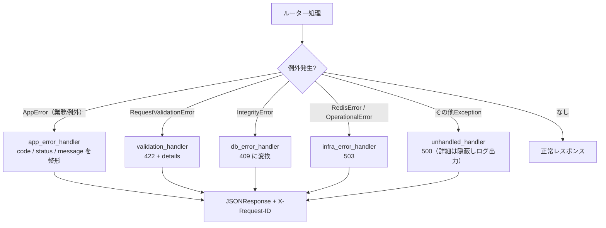
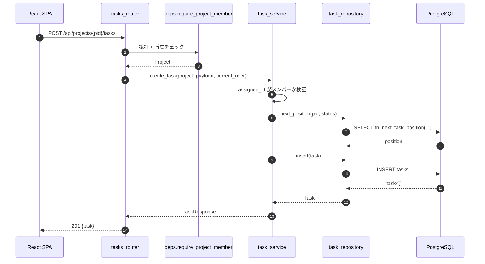
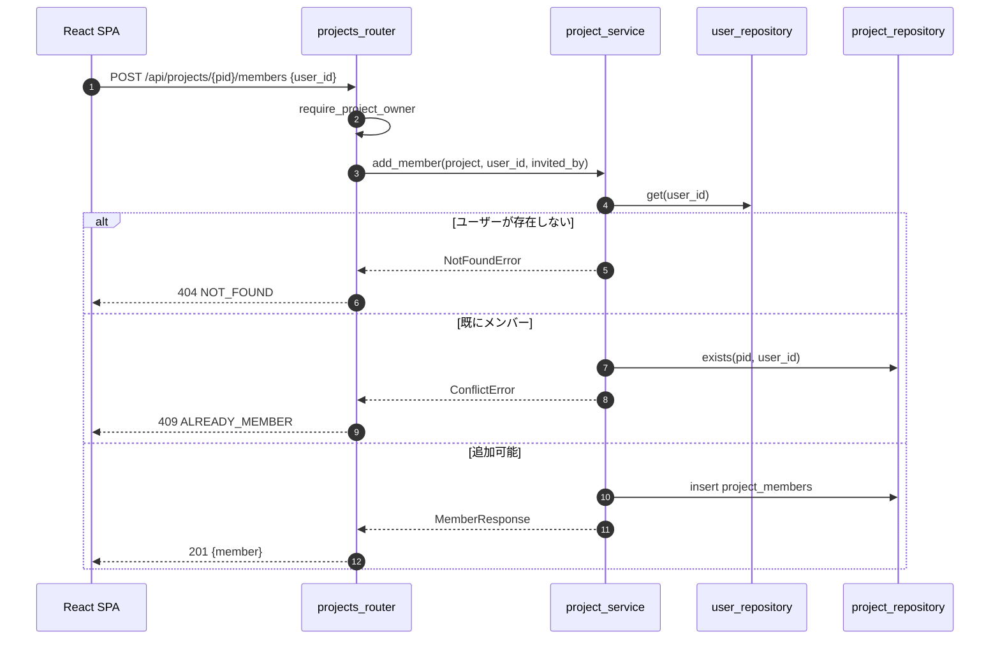

# 04 API設計

## 1. 共通仕様

| 項目 | 内容 |
|------|------|
| ベースURL | `{API_BASE_URL}/api`（例：`http://localhost:8000/api`）。要件書のパス（`/auth/login` 等）に `/api` プレフィックスを付与し、フロントの Nginx / Vite プロキシで振り分ける |
| 形式 | JSON（`application/json`、UTF-8） |
| 日時形式 | ISO 8601 / UTC（例：`2026-09-03T04:05:06Z`） |
| ID形式 | UUID v4 文字列 |
| 認証 | session モード：`cerberus_sid` Cookie ／ jwt モード：`Authorization: Bearer {access_token}` |
| CSRF | session モードの更新系リクエストは `X-CSRF-Token` ヘッダ必須 |
| APIドキュメント | FastAPI 自動生成（`/api/docs`、`/api/openapi.json`）。本番相当設定では無効化可能（`ENABLE_API_DOCS`） |
| バリデーション | pydantic v2。失敗時は 422 |
| ページング | `?page=1&per_page=20`（既定20・最大100）。レスポンスに `meta` を含める |
| リクエストID | 全レスポンスに `X-Request-ID` を付与（ログ相関用） |

## 2. エンドポイント一覧

### 2.1 認証（`/api/auth`）

| メソッド | パス | 概要 | 認証 | 備考 |
|----------|------|------|------|------|
| POST | `/auth/register` | 会員登録（**自動ログインしない**。確認メールを送信し、フロントはログイン画面へ戻す） | 不要 | D-2 の項目を受け取る（D-6） |
| POST | `/auth/login` | ログイン（`AUTH_MODE` に応じて分岐） | 不要 | `identifier` は email または username（D-3）。メール未認証は 403（D-6） |
| POST | `/auth/verify-email` | メール認証の実行 | 不要 | 確認メール内リンクのトークンを検証（D-6） |
| POST | `/auth/verify-email/resend` | 認証メールの再送 | 不要 | 常に 202。再送間隔の制限あり（D-6） |
| POST | `/auth/logout` | ログアウト | 必要 | |
| POST | `/auth/refresh` | アクセストークン再発行 | リフレッシュトークン | **jwt モードのみ**。session モードは 405 |
| GET | `/auth/me` | 現在のログインユーザー取得 | 必要 | フロントの起動時セッション復元に使用 |
| GET | `/auth/oauth/google` | Google OAuth2 認可開始 | 不要 | 302 リダイレクト |
| GET | `/auth/oauth/google/callback` | Google OAuth2 コールバック | 不要 | 302 リダイレクト（フロントへ） |
| POST | `/auth/oauth/exchange` | 一時コード → トークン交換 | 不要 | jwt モードのみ（[03_auth 5.4](./03_auth.md#54-jwt-モードでのトークン受け渡し)） |
| POST | `/auth/password/forgot` | パスワードリセット要求（メール送信） | 不要 | D-1。常に 202 |
| POST | `/auth/password/reset` | パスワードリセット実行 | 不要 | トークン検証 |

### 2.2 ユーザー（`/api/users`）

| メソッド | パス | 概要 | 認証 |
|----------|------|------|------|
| GET | `/users/me` | 自分のプロフィール取得 | 必要 |
| PATCH | `/users/me` | プロフィール更新（氏名・フリガナ・生年月日） | 必要 |
| PUT | `/users/me/password` | パスワード変更（現在のパスワード検証あり） | 必要 |
| GET | `/users/me/login-history` | 自分のログイン履歴（直近50件） | 必要 |
| GET | `/users/search?q=` | メンバー招待用のユーザー検索（username / email 前方一致） | 必要 |

### 2.3 プロジェクト（`/api/projects`）

| メソッド | パス | 概要 | 認可 |
|----------|------|------|------|
| GET | `/projects` | 所属プロジェクト一覧（admin は全件） | member |
| POST | `/projects` | プロジェクト作成 | member |
| GET | `/projects/{project_id}` | プロジェクト詳細（メンバー一覧含む） | プロジェクトメンバー |
| PATCH | `/projects/{project_id}` | プロジェクト更新（名称・説明） | オーナー / admin |
| DELETE | `/projects/{project_id}` | プロジェクト削除（タスク・コメントもCASCADE） | オーナー / admin |
| GET | `/projects/{project_id}/members` | メンバー一覧 | プロジェクトメンバー |
| POST | `/projects/{project_id}/members` | メンバー招待（既存ユーザーを追加） | オーナー / admin |
| DELETE | `/projects/{project_id}/members/{user_id}` | メンバー削除（T-2：要件書に記載なく追加） | オーナー / admin |

### 2.4 タスク・コメント

| メソッド | パス | 概要 | 認可 |
|----------|------|------|------|
| GET | `/projects/{project_id}/tasks` | タスク一覧（カンバン用。status別にソート済み） | プロジェクトメンバー |
| POST | `/projects/{project_id}/tasks` | タスク作成 | プロジェクトメンバー |
| GET | `/tasks/{task_id}` | タスク詳細 | プロジェクトメンバー |
| PATCH | `/tasks/{task_id}` | タスク更新（title/description/status/assignee/position/due_date） | プロジェクトメンバー |
| DELETE | `/tasks/{task_id}` | タスク削除 | プロジェクトメンバー |
| GET | `/tasks/{task_id}/comments` | コメント一覧 | プロジェクトメンバー |
| POST | `/tasks/{task_id}/comments` | コメント投稿 | プロジェクトメンバー |
| PATCH | `/comments/{comment_id}` | コメント編集 | 投稿者本人 / admin |
| DELETE | `/comments/{comment_id}` | コメント削除 | 投稿者本人 / admin |

### 2.5 管理者（`/api/admin`）

| メソッド | パス | 概要 | 認可 |
|----------|------|------|------|
| GET | `/admin/users` | 全ユーザー一覧（ページング・検索） | admin |
| PATCH | `/admin/users/{user_id}/role` | ロール変更（member ⇔ admin） | admin |
| PATCH | `/admin/users/{user_id}/status` | 有効化 / 無効化（`is_active`） | admin |
| POST | `/admin/users/{user_id}/force-logout` | 強制ログアウト（全セッション・全リフレッシュ失効） | admin |
| GET | `/admin/projects` | 全プロジェクト一覧 | admin |
| DELETE | `/admin/projects/{project_id}` | プロジェクト削除 | admin |
| GET | `/admin/login-history` | 全ユーザーのログイン履歴（監査） | admin |

### 2.6 その他

| メソッド | パス | 概要 | 認証 |
|----------|------|------|------|
| GET | `/health` | ヘルスチェック（DB / Redis の接続状態、`auth_mode`） | 不要 |

## 3. 主要スキーマ

### 3.1 認証

**`POST /auth/register`** リクエスト

| フィールド | 型 | 必須 | 制約 |
|-----------|----|------|------|
| username | string | ○ | 3〜50文字、`^[A-Za-z0-9_-]+$` |
| email | string | ○ | 50文字以内、メール形式 |
| password | string | ○ | 8文字以上、大文字英字/小文字英字/数字/記号のうち2種類以上 |
| password_confirm | string | ○ | `password` と一致 |
| last_name / first_name | string | ○ | 各30文字以内 |
| last_name_kana / first_name_kana | string | ○ | 各30文字以内、ひらがな・カタカナ・数字のみ |
| birth_date | string(date) | ○ | `YYYY-MM-DD`、未来日不可 |

レスポンス `201`（**認証情報は返さない**。Cookie もトークンも発行しない）

```json
{
  "id": "3f1c...",
  "email": "taro@example.com",
  "message": "確認メールを送信しました。メール内のリンクから認証を完了してください。"
}
```

**`POST /auth/verify-email`** リクエスト：`{ "token": "..." }`（確認メールのリンクに含まれるトークン）

レスポンス
- `204 No Content`：認証完了。フロントはログイン画面へ遷移する
- `400 INVALID_VERIFY_TOKEN`：トークンが無効・期限切れ・使用済み

**`POST /auth/verify-email/resend`** リクエスト：`{ "email": "..." }`

レスポンス `202 Accepted`（存在しないメール・認証済みメールでも同一応答。ユーザー列挙対策）

**`POST /auth/login`** リクエスト

| フィールド | 型 | 必須 | 説明 |
|-----------|----|------|------|
| identifier | string | ○ | username または email |
| password | string | ○ | |

レスポンス
- session モード：`204 No Content` + `Set-Cookie: cerberus_sid, cerberus_csrf`
- jwt モード：`200` `{ "access_token": "...", "token_type": "bearer", "expires_in": 900 }` + `Set-Cookie: cerberus_rt`
- `403 EMAIL_NOT_VERIFIED`：ID/パスワードは正しいがメール未認証（D-6）。フロントは再送導線を表示する

**`GET /auth/me`** レスポンス `200`

```json
{
  "id": "3f1c...",
  "username": "taro",
  "email": "taro@example.com",
  "last_name": "山田",
  "first_name": "太郎",
  "last_name_kana": "ヤマダ",
  "first_name_kana": "タロウ",
  "birth_date": "1995-04-01",
  "role": "member",
  "has_password": true,
  "oauth_providers": ["google"],
  "auth_mode": "session"
}
```

### 3.2 プロジェクト・タスク

**`POST /projects`** リクエスト：`{ "name": "...", "description": "..." }`（name は1〜100文字）

**`GET /projects`** レスポンス `200`

```json
{
  "items": [
    {
      "id": "…",
      "name": "Cerberus開発",
      "description": "…",
      "owner": { "id": "…", "username": "taro", "display_name": "山田 太郎" },
      "member_count": 3,
      "task_counts": { "todo": 4, "in_progress": 2, "done": 7 },
      "is_owner": true,
      "created_at": "2026-09-01T00:00:00Z"
    }
  ],
  "meta": { "page": 1, "per_page": 20, "total": 1, "total_pages": 1 }
}
```

**`GET /projects/{id}/tasks`** レスポンス `200`

```json
{
  "project_id": "…",
  "columns": {
    "todo": [ { "id": "…", "title": "…", "assignee": null, "position": 0, "due_date": null, "comment_count": 0 } ],
    "in_progress": [],
    "done": []
  }
}
```

status 別にグルーピングして返すことで、フロント側のカンバン描画をそのまま行える形にする。

**`PATCH /tasks/{id}`** リクエスト（すべて任意・部分更新）

| フィールド | 型 | 制約 |
|-----------|----|------|
| title | string | 1〜150文字 |
| description | string \| null | |
| status | string | `todo` / `in_progress` / `done` |
| assignee_id | string(uuid) \| null | プロジェクトメンバーであること |
| position | integer | 0以上。省略時は移動先列の末尾 |
| due_date | string(date) \| null | |

## 4. エラー設計

### 4.1 レスポンス形式

```json
{
  "error": {
    "code": "PROJECT_FORBIDDEN",
    "message": "このプロジェクトへのアクセス権がありません",
    "details": null,
    "request_id": "01J…"
  }
}
```

422（バリデーションエラー）のみ `details` にフィールド単位の情報を格納する。

```json
{
  "error": {
    "code": "VALIDATION_ERROR",
    "message": "入力内容に誤りがあります",
    "details": [
      { "field": "password", "message": "8文字以上で、2種類以上の文字種を含めてください" }
    ],
    "request_id": "01J…"
  }
}
```

### 4.2 エラーコード一覧

| HTTP | code | 発生条件 |
|------|------|----------|
| 400 | `INVALID_STATE` | OAuth2 の state 不一致・期限切れ |
| 400 | `INVALID_RESET_TOKEN` | パスワードリセットトークンが無効・期限切れ |
| 400 | `INVALID_VERIFY_TOKEN` | メール認証トークンが無効・期限切れ・使用済み |
| 400 | `OAUTH_EMAIL_UNVERIFIED` | Google 側でメール未検証のため紐付け不可 |
| 401 | `UNAUTHENTICATED` | 認証情報なし |
| 401 | `INVALID_CREDENTIALS` | ID/パスワード不一致 |
| 401 | `SESSION_EXPIRED` | セッションが Redis に存在しない |
| 401 | `TOKEN_EXPIRED` | アクセストークンの有効期限切れ |
| 401 | `TOKEN_INVALID` | 署名不正・トークン種別不正 |
| 401 | `TOKEN_REVOKED` | リフレッシュトークンが失効済み（再利用検知を含む） |
| 403 | `FORBIDDEN` | ロール不足（管理者専用APIへのアクセス等） |
| 403 | `CSRF_INVALID` | CSRFトークン不一致・欠落 |
| 403 | `USER_INACTIVE` | `is_active = false` |
| 403 | `EMAIL_NOT_VERIFIED` | メール認証が未完了（`email_verified_at IS NULL`）のままログインを試行 |
| 404 | `NOT_FOUND` | リソース不存在、または権限がなく存在を隠す場合 |
| 405 | `NOT_SUPPORTED_IN_MODE` | 現在の `AUTH_MODE` では利用不可（session時の `/auth/refresh`） |
| 409 | `DUPLICATE_USERNAME` / `DUPLICATE_EMAIL` | 一意制約違反 |
| 409 | `ALREADY_MEMBER` | 既に参加済みのユーザーを招待 |
| 409 | `OWNER_CANNOT_BE_REMOVED` | オーナーをメンバーから外そうとした |
| 422 | `VALIDATION_ERROR` | pydantic バリデーション失敗 |
| 429 | `TOO_MANY_ATTEMPTS` | ログイン失敗回数の上限超過 |
| 500 | `INTERNAL_ERROR` | 未捕捉例外（詳細はレスポンスに含めずログのみ） |
| 503 | `SERVICE_UNAVAILABLE` | Redis / DB 接続不能（fail-close） |

### 4.3 例外ハンドリングの流れ



## 5. 認可マトリクス

| API | 未認証 | member（非所属） | member（所属） | オーナー | admin |
|-----|--------|-----------------|---------------|----------|-------|
| `POST /auth/register` `/login` `/verify-email*` `/password/*` | ○ | ○ | ○ | ○ | ○ |
| `GET /auth/me` `/users/me` | × | ○ | ○ | ○ | ○ |
| `GET /projects` | × | ○（自分の分のみ） | ○ | ○ | ○（全件） |
| `POST /projects` | × | ○ | ○ | ○ | ○ |
| `GET /projects/{id}` `/tasks` | × | ×（404） | ○ | ○ | ○ |
| `POST /projects/{id}/tasks` `PATCH /tasks/{id}` | × | ×（404） | ○ | ○ | ○ |
| `PATCH /projects/{id}` `DELETE /projects/{id}` | × | ×（404） | ×（403） | ○ | ○ |
| `POST/DELETE /projects/{id}/members` | × | ×（404） | ×（403） | ○ | ○ |
| `PATCH /comments/{id}` `DELETE /comments/{id}` | × | ×（404） | 投稿者本人のみ○ | 投稿者本人のみ○ | ○ |
| `/admin/*` | × | ×（403） | ×（403） | ×（403） | ○ |

## 6. 主要処理のシーケンス

### 6.1 タスク作成



### 6.2 メンバー招待



## 7. サービス層の関数一覧

### 7.1 `service/auth_service.py`

| 関数 | 引数 | 戻り値 | 処理概要 |
|------|------|--------|----------|
| `register` | `payload: RegisterRequest`, `background: BackgroundTasks` | `User` | 重複チェック → パスワードハッシュ化 → `users` INSERT（`email_verified_at=NULL`）→ 認証トークン発行 → 確認メール送信予約。**Strategy.login は呼ばない**（D-6） |
| `verify_email` | `token: str` | `None` | Redis のトークンをワンタイム消費 → `email_verified_at` を更新。無効なら 400 |
| `resend_verification` | `email: str`, `background: BackgroundTasks` | `None` | 未認証ユーザーかつ再送間隔外の場合のみ再送。該当しなくても例外を出さない |
| `login` | `identifier: str`, `password: str`, `request`, `response` | `LoginResult` | レート制限確認 → ユーザー取得 → パスワード検証 → `is_active` / `email_verified_at` 確認 → Strategy.login → `login_history` 記録 |
| `logout` | `request`, `response`, `user` | `None` | Strategy.logout |
| `refresh` | `request`, `response` | `LoginResult` | Strategy.refresh（session モードでは `NotSupportedError`） |
| `oauth_start` | `redirect_to: str \| None` | `str`（認可URL） | state/PKCE 生成 → Redis保存 → 認可URL組み立て |
| `oauth_callback` | `code: str`, `state: str`, `request`, `response` | `tuple[User, LoginResult]` | state消費 → トークン交換 → id_token検証 → ユーザー解決/作成 → Strategy.login → 履歴記録 |
| `request_password_reset` | `email: str` | `None` | ユーザー検索 → トークン生成 → Redis保存 → メール送信（存在しなくても例外を出さない） |
| `reset_password` | `token: str`, `new_password: str` | `None` | トークン消費 → パスワード更新 → 全セッション/トークン失効 |

### 7.2 `service/project_service.py` / `task_service.py`

| 関数 | 引数 | 戻り値 | 備考 |
|------|------|--------|------|
| `list_projects` | `user`, `page`, `per_page` | `Page[ProjectSummary]` | admin は全件、member は所属分のみ |
| `create_project` | `user`, `payload` | `Project` | projects と project_members を同一トランザクションで作成 |
| `update_project` / `delete_project` | `project`, `payload` | `Project` / `None` | オーナー or admin 前提（認可はdeps側） |
| `add_member` / `remove_member` | `project`, `user_id`, `invited_by` | `Member` / `None` | オーナーは削除不可（409） |
| `get_board` | `project` | `BoardResponse` | status別にグルーピングして返す |
| `create_task` | `project`, `payload`, `user` | `Task` | assignee のメンバー検証、position 採番 |
| `update_task` | `task`, `payload`, `user` | `Task` | status変更時は移動先列の末尾へ、`position` 指定時は間の行を再採番 |
| `delete_task` | `task` | `None` | コメントは CASCADE |
| `add_comment` / `update_comment` / `delete_comment` | `task` / `comment`, `payload`, `user` | `Comment` / `None` | 編集・削除は投稿者本人または admin |

## 8. テスト方針

| 区分 | 内容 |
|------|------|
| 単体 | サービス層をリポジトリのモックで検証（認可分岐・採番ロジック・エラー変換） |
| 結合 | `httpx.AsyncClient` + 実 PostgreSQL / Redis。主要エンドポイントを正常系・異常系（401/403/404/409/422）で検証 |
| パラメータ化 | 認証必須APIは `AUTH_MODE=session` / `jwt` の両方で実行するフィクスチャを用意 |
| カバレッジ | `pytest --cov=app`。`omit` には自動生成物（`alembic/versions`）のみを指定し、実装コードは除外しない |
| 網羅できない範囲 | 外部（Google）の実通信、実SMTP送信はモックで代替し、実通信は手動確認とする |
