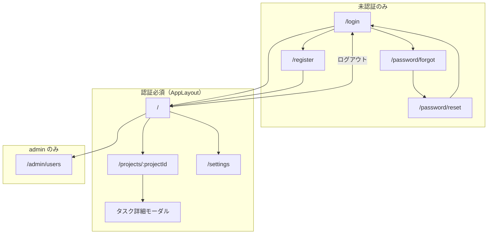
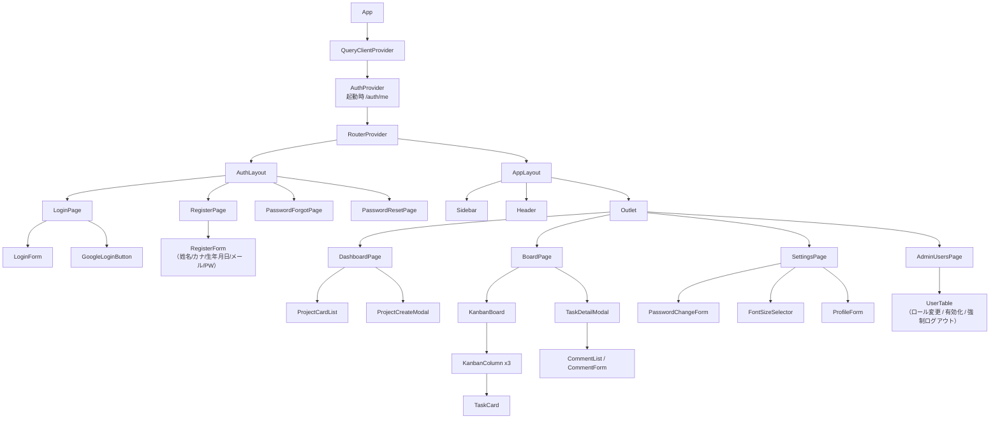
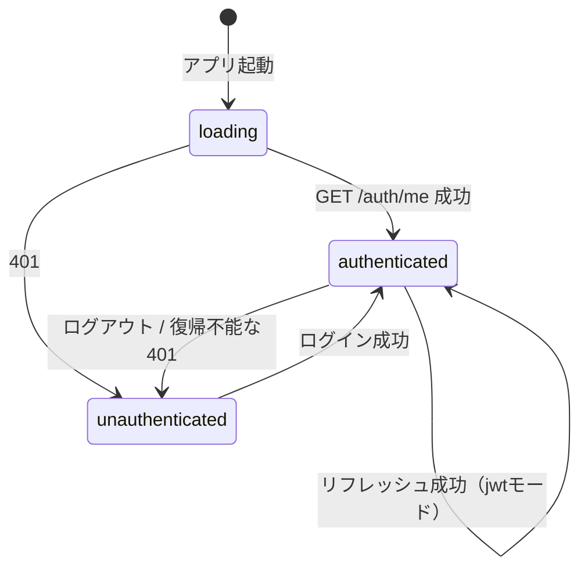
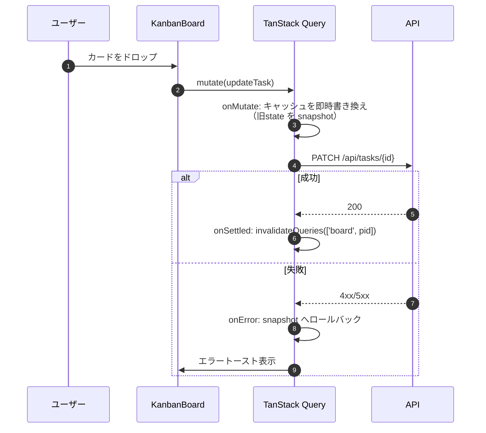
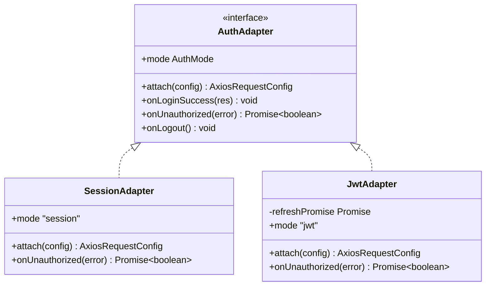
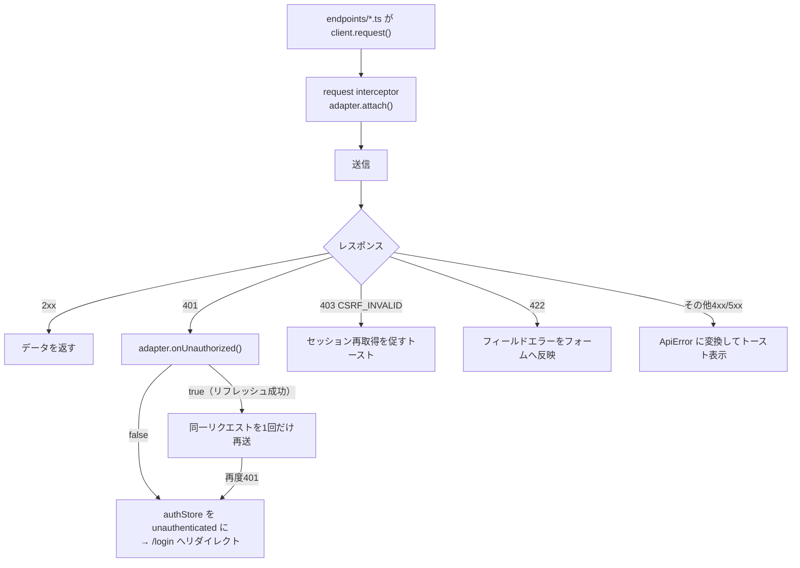
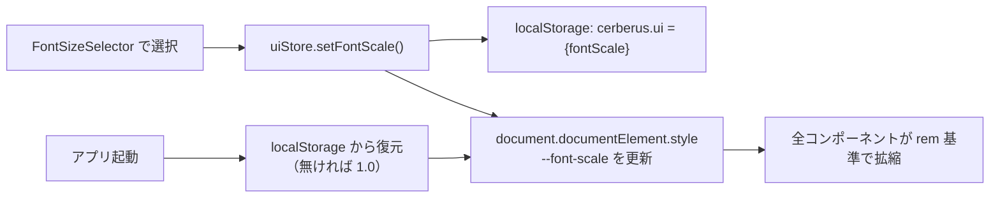

# 05 フロントエンド設計

## 1. 構成

| 項目 | 内容 |
|------|------|
| フレームワーク | React 19 + TypeScript（strict） |
| ビルド | Vite 7 |
| ルーティング | React Router v7（`createBrowserRouter`） |
| 状態管理 | Zustand（認証状態・UI設定）＋ TanStack Query（サーバー状態のキャッシュ） |
| HTTPクライアント | axios（インスタンス + interceptor） |
| ドラッグ＆ドロップ | `@dnd-kit/core`（カンバンのカード移動） |
| フォーム | React Hook Form + zod（バックエンドと同一のバリデーション規則を再現） |
| スタイル | CSS Modules + CSS変数（文字サイズ設定のため `rem` ベースで設計） |
| テスト | Vitest + React Testing Library + MSW（APIモック） |
| Lint / 型 | ESLint（flat config）+ `tsc --noEmit` |
| Node | v26（Dockerfile で固定） |

### ディレクトリ構成

```
frontend/
├── src/
│   ├── main.tsx
│   ├── router.tsx                  # ルート定義・認証ガード
│   ├── api/
│   │   ├── client.ts               # axiosインスタンス生成（認証方式を吸収）
│   │   ├── authAdapter/            # 認証方式ごとの差異を閉じ込める層
│   │   │   ├── types.ts            # AuthAdapter インターフェース
│   │   │   ├── sessionAdapter.ts
│   │   │   ├── jwtAdapter.ts
│   │   │   └── index.ts            # VITE_AUTH_MODE で選択
│   │   ├── endpoints/              # auth.ts / projects.ts / tasks.ts / admin.ts
│   │   └── errors.ts               # ApiError 型とエラーコード変換
│   ├── auth/
│   │   ├── authStore.ts            # Zustand（user / status）
│   │   ├── AuthProvider.tsx        # 起動時の /auth/me による復元
│   │   └── guards.tsx              # RequireAuth / RequireAdmin
│   ├── components/                 # 汎用UI（Button, Modal, Field, Toast, Avatar…）
│   ├── layouts/
│   │   ├── AppLayout.tsx           # サイドバー付き共通レイアウト
│   │   └── AuthLayout.tsx          # ログイン系画面のレイアウト
│   ├── features/
│   │   ├── auth/                   # ログイン・登録・パスワードリセット
│   │   ├── projects/               # ダッシュボード・プロジェクト
│   │   ├── board/                  # カンバン・タスク詳細
│   │   ├── settings/               # アカウント設定
│   │   └── admin/                  # ユーザー管理
│   ├── stores/uiStore.ts           # 文字サイズ・サイドバー開閉（localStorage永続）
│   └── types/                      # APIレスポンスの型定義
├── tests/
├── Dockerfile
└── vite.config.ts
```

## 2. 画面一覧とルーティング

| No | 画面 | パス | レイアウト | ガード | 出典 |
|----|------|------|-----------|--------|------|
| 1 | ログイン | `/login` | AuthLayout | 未認証のみ | 要件書§2-1 / pptx slide1 |
| 2 | 会員登録 | `/register` | AuthLayout | 未認証のみ | 要件書§2-2 / pptx slide2 |
| 3 | パスワード再設定要求 | `/password/forgot` | AuthLayout | 未認証のみ | pptx slide3（D-1） |
| 4 | パスワード再設定 | `/password/reset?token=` | AuthLayout | 未認証のみ | D-1 |
| 5 | ダッシュボード | `/` | AppLayout | 認証必須 | 要件書§2-3 / pptx slide4 |
| 6 | プロジェクト詳細（カンバン） | `/projects/:projectId` | AppLayout | 認証必須 | 要件書§2-4 / pptx slide4,5 |
| 7 | タスク詳細/編集 | `/projects/:projectId/tasks/:taskId`（モーダル） | AppLayout | 認証必須 | 要件書§2-5 / pptx slide5 |
| 8 | アカウント設定 | `/settings` | AppLayout | 認証必須 | 要件書§2-6 / pptx slide7 |
| 9 | 管理者ユーザー管理 | `/admin/users` | AppLayout | admin のみ | 要件書§2-7 / pptx slide6 |
| 10 | OAuthコールバック中継 | `/oauth/callback` | なし（ローディングのみ） | 不要 | [03_auth 5.4](./03_auth.md#54-jwt-モードでのトークン受け渡し) |

> **要検討**：pptx slide4 はサイドバー付きの1画面に「タスクリスト」と「新規プロジェクトの作成」が同居しており、要件書の「ダッシュボード（プロジェクト一覧）」と「プロジェクト詳細（カンバン）」の関係が判然としない。本設計では **`/` = プロジェクトカード一覧（＋新規作成ボタン）、`/projects/:id` = カンバン** の2画面に分離する解釈を採用した。



## 3. 共通レイアウト

pptx 全画面で共通の左サイドバー構成（設計判断 D-5）。

```
┌────────────────────────────────────────────────────────┐
│ ≡ │                    Cerberus                       │  ← ヘッダー
├───┴────────────────────────────────────────────────────┤
│ ┌──────────┐                                           │
│ │ home     │   ┌─── メインコンテンツ ─────────────┐    │
│ │ 管理 (*) │   │                                  │    │
│ │ 設定     │   │  （画面ごとの内容）              │    │
│ │          │   │                                  │    │
│ │ ログアウト│   └──────────────────────────────────┘    │
│ └──────────┘                                           │
└────────────────────────────────────────────────────────┘
  (*) 「管理」は role = admin のときのみ表示
```

| 要素 | 挙動 |
|------|------|
| `≡`（ハンバーガー） | サイドバーの開閉。状態は `uiStore` に保持し localStorage へ永続化 |
| home | `/` へ遷移 |
| 管理 | `/admin/users` へ遷移。`role !== 'admin'` の場合は**要素自体を描画しない**（pptx slide6 の注記に準拠） |
| 設定 | `/settings` へ遷移 |
| ログアウト | `POST /auth/logout` → authStore クリア → `/login` へ |

## 4. コンポーネント構成



## 5. 状態管理

| ストア | 保持内容 | 永続化 | 備考 |
|--------|----------|--------|------|
| `authStore`（Zustand） | `user`, `status`（`loading` / `authenticated` / `unauthenticated`）, `accessToken`（jwtモードのみ） | **しない**（メモリのみ） | アクセストークンを localStorage に置かない（XSS対策） |
| `uiStore`（Zustand + persist） | `fontScale`, `sidebarOpen` | localStorage | 設計判断 D-4 |
| TanStack Query | プロジェクト一覧・ボード・コメント・ユーザー一覧 | しない | `queryKey` は `['projects']` / `['board', projectId]` / `['comments', taskId]` |

### 5.1 認証状態の遷移



### 5.2 カンバン操作時の楽観的更新



## 6. APIクライアント層（認証方式の吸収）

**方針**：認証方式の差異は `AuthAdapter` に閉じ込め、画面・feature 層は `api/endpoints/*` の関数を呼ぶだけで方式に依存しない。



| 実装 | `attach` | `onLoginSuccess` | `onUnauthorized` | `onLogout` |
|------|----------|------------------|------------------|------------|
| `SessionAdapter` | `withCredentials = true`、更新系には `X-CSRF-Token`（Cookieから読む）を付与 | 何もしない（Cookieはブラウザが保持） | `false`（リトライしない） | CSRF Cookie を破棄 |
| `JwtAdapter` | `Authorization: Bearer {accessToken}` を付与 | authStore に accessToken を保存 | `/auth/refresh` を1回だけ試行し、成功なら `true` | accessToken をメモリから破棄 |

| メソッド | 引数 | 戻り値 | 責務 |
|----------|------|--------|------|
| `attach` | `AxiosRequestConfig` | `AxiosRequestConfig` | リクエスト直前の認証情報付与（Cookie送信設定 / CSRFヘッダ / Bearerヘッダ） |
| `onLoginSuccess` | `LoginResponse` | `void` | ログインレスポンスから必要な情報を保持 |
| `onUnauthorized` | `AxiosError` | `Promise<boolean>` | 401 時の復帰処理。`true` を返した場合のみ元リクエストを再送 |
| `onLogout` | なし | `void` | クライアント側の後片付け |

### 6.1 interceptor の流れ



| ルール | 内容 |
|--------|------|
| リフレッシュの多重実行防止 | `JwtAdapter` 内で進行中の `refreshPromise` を共有し、同時に発生した401をまとめて1回のリフレッシュで処理する |
| リトライ回数 | 1回のみ（`config._retried` フラグで管理） |
| リフレッシュ対象外 | `/auth/login`・`/auth/refresh`・`/auth/register` の401はリトライしない |
| session モード | 401 は即ログアウト扱い（リフレッシュの概念がない） |

### 6.2 環境変数（Vite）

| 変数 | 例 | 用途 |
|------|-----|------|
| `VITE_API_BASE_URL` | `http://localhost:8000/api` | APIのベースURL |
| `VITE_AUTH_MODE` | `session` / `jwt` | 使用する AuthAdapter の選択（バックエンドの `AUTH_MODE` と一致させる） |
| `VITE_GOOGLE_LOGIN_ENABLED` | `true` | Googleログインボタンの表示制御 |
| `VITE_CSRF_COOKIE_NAME` | `cerberus_csrf` | CSRFトークン読み取り元Cookie名 |

> `VITE_AUTH_MODE` と `AUTH_MODE` の二重管理を避けるため、`GET /health` または `GET /auth/me` のレスポンスに含まれる `auth_mode` を起動時に取得して上書きする方式も**要検討**（設定不整合の防止に有効）。

## 7. 画面別の主要仕様

### 7.1 ログイン（pptx slide1）

| 要素 | 仕様 |
|------|------|
| 「IDもしくはメールアドレス」入力 | `identifier` として送信（D-3） |
| パスワード入力 | 目のアイコンで表示/非表示をトグル（pptx の `👁️‍🗨️` に対応） |
| ログインボタン | Enter キーでも送信 |
| 「新規会員登録はこちら」 | `/register` |
| 「パスワードを忘れた方はこちら」 | `/password/forgot` |
| Googleログイン | `window.location.href = {API}/auth/oauth/google` へ遷移（XHRでは行わない） |
| エラー表示 | `INVALID_CREDENTIALS` は「IDまたはパスワードが正しくありません」と統一表示（どちらが誤りか示さない） |
| レート制限 | 429 の場合は待機時間を案内 |

### 7.2 会員登録（pptx slide2）

- 入力順は pptx に準拠（姓 → 名 → フリガナ → 生年月日 → メール → パスワード → パスワード再入力）
- 生年月日は年/月/日の3プルダウン
- パスワードは強度インジケータを表示し、zod で「8文字以上・2種類以上の文字種」を検証（バックエンドと同一規則）
- 「Googleで新規登録」はログイン画面と同じOAuth開始URLへ遷移（ログインと登録の入口を共通化）
- 409（重複）は該当フィールドにエラーを表示

### 7.3 ダッシュボード（pptx slide4）

- 所属プロジェクトをカード表示（プロジェクト名・メンバー数・タスク件数バッジ）
- 「新規プロジェクトの作成」ボタン → モーダル（pptx slide5 の「パネルがでてくる」に対応）
- プロジェクト0件時は空状態メッセージと作成導線を表示

### 7.4 カンバンボード（pptx slide4,5）

- 3列（未着手 / 進行中 / 完了）を横並び表示。列ヘッダーに件数
- `@dnd-kit` によるカード移動で `PATCH /tasks/{id}`（status + position）
- カードクリックでタスク詳細モーダル（URLも `/projects/:pid/tasks/:tid` に同期させ、リロード・共有可能にする）
- タスク詳細モーダル：タイトル・説明・担当者（プロジェクトメンバーから選択）・期限・ステータス・コメント一覧/投稿

### 7.5 アカウント設定（pptx slide7）

| 項目 | 仕様 |
|------|------|
| プロフィール編集 | 姓・名・フリガナ・生年月日を `PATCH /users/me` |
| パスワードの変更 | 現在のパスワード + 新パスワード + 確認 → `PUT /users/me/password`。成功後は再ログインを促す（全セッション失効のため） |
| 文字サイズの変更 | 小 / 標準 / 大 / 特大（`0.875` / `1` / `1.125` / `1.25`）。D-4 によりサーバー保存しない |
| ログイン履歴 | `GET /users/me/login-history` を表形式で表示（自衛的な監査） |

### 7.6 管理者ユーザー管理（pptx slide6）

- タブ「管理」自体を `role = admin` のみ表示。直接URLアクセス時も `RequireAdmin` で `/` にリダイレクト
- ユーザー一覧（検索・ページング）、ロール変更セレクト、有効/無効トグル、強制ログアウトボタン
- 自分自身の権限降格・無効化は UI 上で禁止（誤操作防止。サーバー側でも 409 とする）
- プロジェクト一覧タブ（`GET /admin/projects`）と削除操作

## 8. アクセシビリティ設定（文字サイズ）

設計判断 D-4：localStorage のみで保持する。



| 項目 | 内容 |
|------|------|
| 実装 | `html { font-size: calc(16px * var(--font-scale)); }` とし、各コンポーネントは `rem` 指定 |
| 端末間同期 | されない（localStorage のため）。DB保存が必要になった場合は `users` にカラム追加が必要 |
| 影響範囲 | レイアウト崩れを防ぐため、固定 `px` 幅のコンテナは使わず `min-width` / `flex` で組む |

## 9. テスト方針

| 区分 | 対象 | 内容 |
|------|------|------|
| 単体 | `authAdapter` | session / jwt それぞれで `attach` / `onUnauthorized` の挙動、リフレッシュの多重実行防止 |
| 単体 | zod スキーマ | パスワードポリシー・フリガナ・50文字制限などの境界値 |
| 単体 | `uiStore` | 文字サイズの永続化と復元、localStorage が空の場合の既定値 |
| コンポーネント | LoginForm / RegisterForm | 入力検証・エラー表示・送信内容 |
| コンポーネント | KanbanBoard | D&D後の楽観的更新とロールバック（MSWで失敗レスポンスを返す） |
| コンポーネント | Sidebar | `role` による「管理」タブの表示/非表示 |
| 結合 | ルーティングガード | 未認証で `/` にアクセス → `/login`、member で `/admin/users` → `/` |
| 網羅できない範囲 | 実ブラウザでのD&Dのピクセル単位挙動、Google認可画面 | `@dnd-kit` のイベントはユーティリティでシミュレートし、実操作は手動確認とする |
