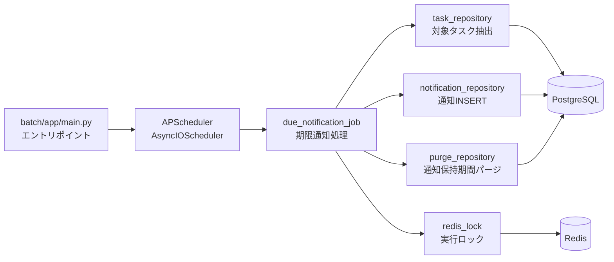
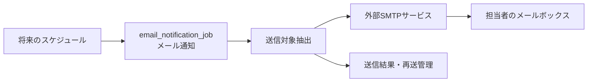
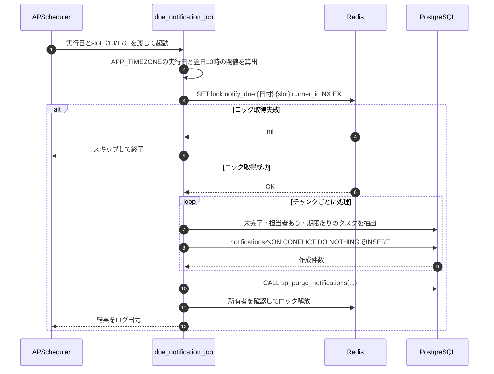
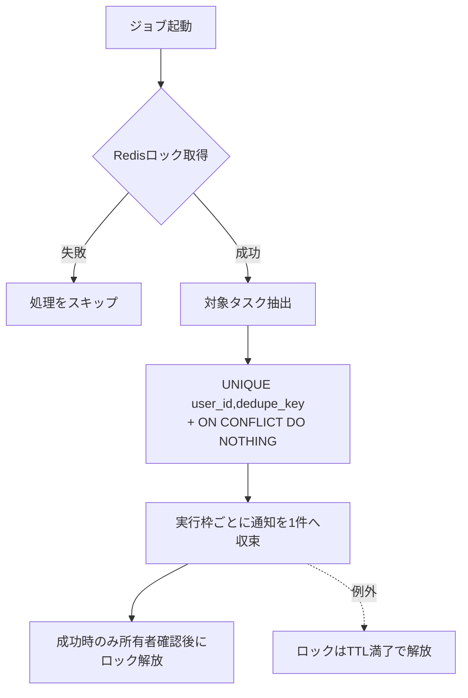
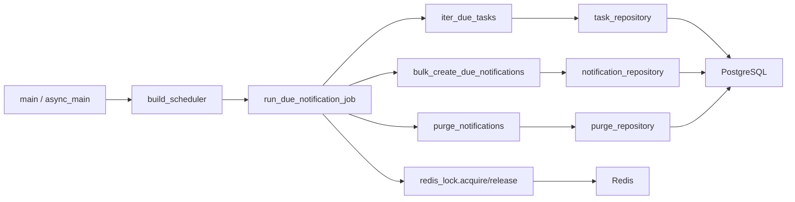
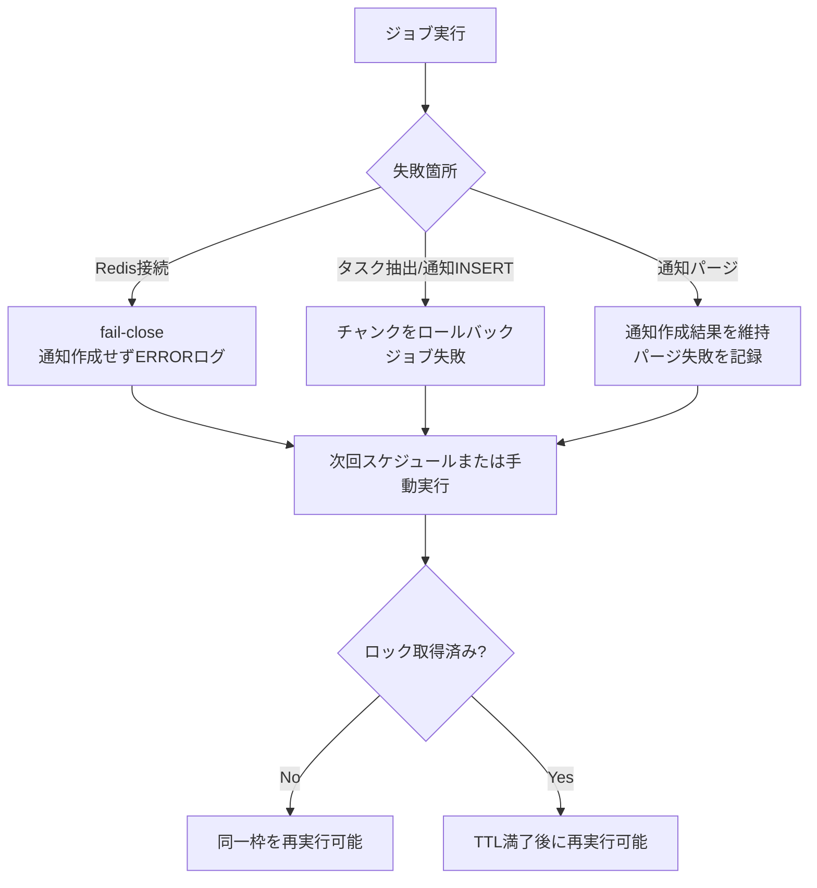

# 07 batch 基本設計

## 0. 関連ドキュメント

- 要件定義：[../requirements/task_management_requirements.md](../requirements/task_management_requirements.md) §3.4 N-1、§4、§9
- 基本設計：[00_overview.md](./00_overview.md) §1/§2/§3/§7、[01_database.md](./01_database.md) §3.5/§3.8/§3.10/§5.5、[02_redis.md](./02_redis.md) §4.4、[06_infra_cicd.md](./06_infra_cicd.md) §2/§2.1/§4.5/§5
- 詳細設計：[../detailed_design/batch/00_overview.md](../detailed_design/batch/00_overview.md)、[../detailed_design/batch/01_scheduler.md](../detailed_design/batch/01_scheduler.md)、[../detailed_design/batch/02_due_notification_job.md](../detailed_design/batch/02_due_notification_job.md)
- 履歴設計：[../detailed_design/log/00_history.md](../detailed_design/log/00_history.md)、[../detailed_design/database/12_table_batch_history.md](../detailed_design/database/12_table_batch_history.md)
- 関連インフラ詳細：[../detailed_design/infra/01_docker_compose.md](../detailed_design/infra/01_docker_compose.md)、[../detailed_design/infra/04_env_config.md](../detailed_design/infra/04_env_config.md)、[../detailed_design/infra/07_operation.md](../detailed_design/infra/07_operation.md)

> 構成図：[diagrams/05_batch_architecture.drawio](./diagrams/05_batch_architecture.drawio)（編集用） / [05_batch_architecture.svg](./diagrams/05_batch_architecture.svg)（表示用）

## 1. 設計方針

タスク期限のアプリ内通知（要件 N-1）を、バックエンドAPIとは独立した `batch` コンテナで定期実行する。`batch` はHTTP APIを経由せず、PostgreSQLから対象タスクを抽出し、PostgreSQLへ通知を登録する。Redisは同一実行枠の二重実行を防ぐロックに使用する。

`batch` は、将来のメール通知などの定期処理を追加できる共通実行基盤として構成する。ただし、今回実装するのはアプリ内通知だけであり、メール通知のジョブ・SMTP接続・メール送信は実装しない。

イベント通知（要件 N-6）はタスク更新処理と同一トランザクションで扱うバックエンドの責務とし、本書の対象外とする。

| 項目 | 方針 |
|------|------|
| 実行形態 | `batch` コンテナ内の常駐スケジューラ（APScheduler） |
| 定期処理 | `APP_TIMEZONE` 基準で毎日10時・17時に期限通知を実行 |
| 対象 | 未完了、担当者あり、期限あり、期限が翌日10時までのタスク |
| 通知先 | `tasks.assignee_id` の担当者のみ |
| 永続化 | `notifications` へ `due_soon_batch` 通知をINSERT |
| 重複防止 | Redisの実行ロックとDB一意制約の二重防御 |
| マイグレーション | `backend` のAlembicのみが実行し、`batch` は実行しない |
| 外部通知 | 今回はメール通知・ブラウザプッシュ通知を行わない。メール通知は将来拡張案として §2.3 に記載する |

## 2. 構成と責務

### 2.1 コンポーネント



| コンポーネント | 責務 |
|----------------|------|
| `main.py` | 設定を読み込み、DB/Redis接続を初期化し、常駐スケジューラまたは手動1回実行を起動する |
| スケジューラ | 実行時刻ごとに独立した期限通知ジョブを登録する |
| `due_notification_job` | 実行日・対象期限の計算、ロック取得、抽出・通知作成、パージを制御する |
| `repository` | PostgreSQL・Redisへのアクセスを担当する。業務上の処理順序は持たない |
| `models` | `batch` が参照・更新する `tasks`/`notifications` のORMモデルを定義する |

`batch` と `backend` は別イメージのため、`batch` から `api/app` をimportしない。共有が必要なORMモデルは `batch/app/models/` に定義し、スキーマ変更時はAPI側のAlembicと同時に追随させる。

### 2.2 ディレクトリ構成

```text
batch/
├── app/
│   ├── main.py
│   ├── core/{config.py, logger.py}
│   ├── jobs/due_notification_job.py
│   ├── repository/{task_repository.py, notification_repository.py, purge_repository.py, redis_lock.py}
│   ├── models/{task.py, notification.py}
│   ├── db.py
│   └── redis_client.py
├── tests/{unit/, integration/, conftest.py}
├── Dockerfile
└── requirements.txt
```

依存方向は `main/スケジューラ → jobs → repository → models` とする。`core` は各層から参照できるが、repositoryからjobを参照する逆方向の依存は禁止する。

### 2.3 将来のメール通知（今回の実装対象外）

要件 N-1 は画面内のアプリ内通知を対象としており、メール通知は今回の要件・実装範囲に含めない。一方、期限通知をメールでも届ける機能は、`batch` の定期処理として追加する候補とする。認証メールやパスワード再設定メールの送信は、ユーザー操作に応じてバックエンドが行う既存のメール送信であり、ここで検討する定期メール通知とは別の責務である。

将来追加する場合は、期限通知ジョブへ送信処理を直接混在させず、独立した `email_notification_job.py` として実装する。アプリ内通知の作成とメール送信を同時に行うか、作成済み通知を後続ジョブが取得して送信するかは、メール通知の要件確定時に選択する。



| 検討項目 | 将来の設計案 | 現在の扱い |
|----------|--------------|------------|
| 対象者 | タスク担当者。メールアドレスと通知設定を確認する | 未実装 |
| 起動 | 既存スケジューラへ独立ジョブを追加し、実行時刻を環境変数化する | 期限通知ジョブのみ登録 |
| 送信 | 外部SMTPサービスへ接続し、メールテンプレートを用いて送信する | `batch` からSMTPへ接続しない |
| 重複防止 | メール専用の送信キー、または送信状態テーブルで冪等性を確保する | `notifications` のアプリ内通知だけを登録 |
| 失敗時 | SMTPエラーを記録し、指数バックオフ等の再送を行う | 要件未定義 |
| 監査 | 送信日時、送信結果、失敗理由を保存する | 要件未定義 |

メール通知は、配信頻度・ユーザーごとの有効/無効設定、本文テンプレート、送信元、SMTP認証情報、再送回数・間隔、バウンス処理、個人情報の取り扱いを別途定義する必要がある。これらは本書では確定しない。

## 3. 全体の入出力

| 区分 | 内容 |
|------|------|
| 入力 | 環境変数、現在時刻、コマンドライン引数（手動実行時）、PostgreSQLのタスク、Redisの実行ロック状態 |
| 出力 | `notifications` の通知行、`batch_history`の開始・完了・失敗行、通知・履歴の保持期間超過行の削除、構造化ログ、ジョブ結果（対象件数・作成件数） |
| 副作用 | Redisロックの作成・解放、PostgreSQLへのチャンク単位のINSERT、`batch_history`の状態更新、各保持期間プロシージャの実行 |
| HTTP通信 | なし。認証・認可・APIの入出力DTOは使用しない |

## 4. スケジュールと対象抽出

### 4.1 実行枠

`NOTIFY_DUE_RUN_HOURS` の各値を独立したcronジョブとして登録する。既定値では10時用・17時用の2ジョブとなり、同じ対象タスクへ実行枠ごとに1件ずつ通知する。

| ジョブID | 実行時刻 | 実行枠（slot） | 通知種別 |
|----------|----------|----------------|----------|
| `due_notification_10` | 毎日 `10:NOTIFY_DUE_CRON_MINUTE` | `10` | `due_soon_batch` |
| `due_notification_17` | 毎日 `17:NOTIFY_DUE_CRON_MINUTE` | `17` | `due_soon_batch` |

いずれも `APP_TIMEZONE` 基準で実行する。`BATCH_ENABLED=false` の場合はジョブを登録せず、プロセスのみ常駐させる。設定値の詳細は [06_infra_cicd.md §4.5](./06_infra_cicd.md#45-通知--定期実行batch) に従う。

### 4.2 対象タスク

実行日の `APP_TIMEZONE` における翌日 `NOTIFY_DUE_TARGET_HOUR`（既定10時）を閾値とし、UTCへ変換してDB検索する。10時枠・17時枠の両方で同じ閾値を使用する。

```sql
status <> 'done'
AND assignee_id IS NOT NULL
AND due_at IS NOT NULL
AND due_at <= :threshold_utc
```

- `due_at <=` のため、翌日10時ちょうどの期限を含める。
- 下限は設けないため、期限切れの未完了タスクも対象とする。
- 担当者未設定のタスクは通知しない。
- DBの `TIMESTAMPTZ` はUTC保存とし、日付境界の計算だけ `APP_TIMEZONE` を使用する。

## 5. 処理シーケンス



処理途中で失敗した場合はエラーを記録し、スケジューラのプロセスは継続する。チャンク単位でトランザクションを完了させるため、完了済みチャンクの通知は維持する。ロックは失敗時に即時解放せず、TTL満了で解放する。

## 6. 通知データと冪等性

### 6.1 通知内容

| `notifications` 列 | 設定値 |
|--------------------|--------|
| `user_id` | `tasks.assignee_id` |
| `task_id` | `tasks.id` |
| `type` | `due_soon_batch` |
| `title` | タスク名のスナップショット |
| `body` | 期限通知の本文（表示文言は定数化する） |
| `due_at` | 通知作成時点の期限スナップショット |
| `dedupe_key` | `batch:{local_date}:{slot}:{task_id}` |
| `read_at` | `NULL`（未読） |

### 6.2 二重実行防止



Redisロックのキーは `lock:notify_due:{APP_TIMEZONEの実行日}:{slot}`、TTLは `NOTIFY_DUE_LOCK_TTL_SECONDS` とする。同一枠の再実行や複数コンテナ起動が発生しても、Redisロックと `UNIQUE (user_id, dedupe_key)` の二重防御で同じ通知を重複登録しない。10時枠と17時枠は `slot` が異なるため、同じタスクにそれぞれ1件ずつ登録できる。

ジョブ末尾で `sp_purge_notifications(NOTIFICATION_RETENTION_DAYS)` を呼び出し、保持期間を超過した通知を削除する。パージ失敗時も作成済み通知は維持し、ジョブを失敗扱いとして次回または手動実行で再試行する。

### 6.3 メール通知追加時のデータ拡張案

メール通知を実装する際は、現在の `notifications` テーブルだけでは送信済み・送信失敗・再送待ちを区別できないため、送信状態を管理する仕組みを追加する。候補は、`notifications` にメール送信状態を追加する方法と、通知と送信試行を分離した `notification_deliveries` テーブルを新設する方法である。データモデルと選択方式はメール通知の要件確定後に詳細設計する。

既存のアプリ内通知の未読状態（`read_at`）と、メールの送信状態は別管理とする。画面で既読にしたことをメール送信済みとはみなさず、メール送信失敗がアプリ内通知の表示を妨げない構成にする。

## 7. 関数・処理の相関



| 関数・処理 | 入力 | 出力・副作用 | 責務 |
|------------|------|--------------|------|
| `main` | CLI引数 | プロセス起動 | 引数を解析し、非同期処理を開始する |
| `async_main` | `Namespace`、環境変数 | 常駐または終了 | 接続プールの生成、手動実行/スケジューラ実行の分岐、終了処理 |
| `build_scheduler` | `Settings` | `AsyncIOScheduler` | `NOTIFY_DUE_RUN_HOURS` の各時刻にcronジョブを登録する |
| `run_due_notification_job` | 現在時刻、`Settings`、`slot` | `JobResult`、DB/Redis更新 | 期限通知処理全体を制御する |
| `iter_due_tasks` | UTC閾値、チャンクサイズ | 対象タスク列 | 対象タスクをチャンク単位で取得する |
| `bulk_create_due_notifications` | 対象タスク、実行日、`slot` | 作成件数 | `ON CONFLICT DO NOTHING` 付きで通知を登録する |
| `purge_notifications` | 保持日数 | 削除件数 | `sp_purge_notifications` を呼び出す |

## 8. 設定管理

`batch/app/core/config.py` に `pydantic-settings` の `Settings(BaseSettings)` を定義し、環境変数を型付きで受け取る。認証・Cookie・SMTPなど、batchが使用しない設定は渡さない。

| 変数 | 既定値 | 用途 |
|------|--------|------|
| `DATABASE_URL` | なし | PostgreSQL接続先。必須 |
| `REDIS_URL` | なし | Redis接続先。必須 |
| `APP_TIMEZONE` | `Asia/Tokyo` | 実行時刻と日次境界の基準 |
| `NOTIFY_DUE_RUN_HOURS` | `10,17` | cronジョブの実行時刻 |
| `NOTIFY_DUE_CRON_MINUTE` | `0` | cronジョブの実行分 |
| `NOTIFY_DUE_TARGET_HOUR` | `10` | 共通の翌日境界時刻 |
| `NOTIFY_DUE_LOCK_TTL_SECONDS` | `82800` | RedisロックTTL |
| `NOTIFY_DUE_BATCH_CHUNK_SIZE` | `500` | 1トランザクションの処理件数 |
| `NOTIFICATION_RETENTION_DAYS` | `90` | 通知パージの保持期間 |
| `API_HISTORY_RETENTION_DAYS` | `30` | API履歴パージの保持期間 |
| `BATCH_HISTORY_RETENTION_DAYS` | `30` | batch履歴パージの保持期間 |
| `BATCH_ENABLED` | `true` | 定期ジョブ登録の有効/無効 |
| `LOG_LEVEL` | `INFO` | 構造化ログの出力レベル |

値は `.env.example` と [06_infra_cicd.md §4.5](./06_infra_cicd.md#45-通知--定期実行batch) を正とし、業務ルールをソースコードへハードコードしない。

## 9. コンテナ運用と障害時挙動

| 項目 | 方針 |
|------|------|
| 起動 | `docker compose up -d batch`。PostgreSQL・Redisがhealthyになるまで起動を待つ |
| 常駐 | `python -m app.main` で起動し、HTTPポートは公開しない |
| 再起動 | `restart: unless-stopped`。予期しない終了後はスケジューラを再登録する |
| healthcheck | `python -c "import os; os.kill(1, 0)"` によるPID 1の生存確認。ジョブ成功までは判定しない |
| マイグレーション | 実行しない。スキーマ適用はbackend起動時のAlembicが担う |
| 手動実行 | `docker compose run --rm batch python -m app.main --run-once due_notification --slot 10`（17時枠は `--slot 17`） |

### 9.1 失敗時の扱い



Redis接続不能時は二重実行を避けるため通知を作成しない。ジョブ内の例外はERRORログへ記録してプロセスを継続する。ロック取得後・通知作成前後の失敗では、ロックをTTLで自然解放し、必要に応じて `--run-once` で復旧する。

## 10. テスト方針

実装時はTDDで、ジョブの判定ロジックを先に単体テストし、PostgreSQL・Redisを使用する結合テストで実際の制約とロックを確認する。

| 区分 | 対象 | 期待結果 |
|------|------|----------|
| 単体 | 10時・17時のcron登録 | `APP_TIMEZONE`、実行分、`slot` が設定値どおりになる |
| 単体 | `BATCH_ENABLED=false` | 定期ジョブを登録しない。`--run-once` は実行できる |
| 単体 | 閾値計算 | 両枠が同じ翌日10時境界を使い、境界値を含む |
| 結合 | 対象抽出 | 未完了・担当者あり・期限あり・閾値以前だけを抽出する |
| 結合 | 冪等性 | 同一slotを再実行しても通知が増えない |
| 結合 | 枠別通知 | 10時枠と17時枠で同じタスクへ各1件を作成する |
| 結合 | 障害 | Redisロック取得失敗時に通知を作成しない |
| 結合 | 保持期間 | `sp_purge_notifications` が期間超過行だけを削除する |
| 結合 | 実行履歴 | 開始時に`batch_history.inprogress`、正常時に`complete`、失敗時に`error`が保存される |
| 結合 | 履歴保持期間 | `sp_purge_api_history` / `sp_purge_batch_history` が各30日を超えた行だけを削除する |
| CI | `batch-test` | ruff、mypy、pytest、カバレッジを実行する。Docker buildでもbatchイメージを検証する |

実時刻に依存するcronの発火タイミングは、時計やコンテナ起動時刻に依存するため自動テストで網羅できない。時刻固定による単体テストと、実環境での手動確認を組み合わせる。将来の自動E2E化は要検討とする。

## 11. 不明点・要検討事項

| 区分 | 内容 | 影響 |
|------|------|------|
| 要検討 | misfire時の猶予時間の具体値は基本要件で定義されていない。詳細設計では例示値を提示しているが、実装時に確定する | `batch/app/main.py` のAPScheduler設定 |
| 要検討 | ロック取得後に失敗した実行枠を自動再試行する仕組みは未定義。本設計ではTTL解放後の次回実行または手動 `--run-once` を前提とする | 障害復旧時間、運用手順 |
| 要検討 | プロセス生存だけのhealthcheckで、ジョブ登録・直近成功まで監視するかは未確定 | Compose healthcheck、監視方式 |
| 要検討 | API側とbatch側のORMモデル定義差分をCIで自動検出するかは未確定 | `batch/app/models/`、CI |
| 不明 | Docker停止時のグレースピリオドがチャンク処理の完了に十分かは実測が必要 | `stop_grace_period` の設定要否 |
