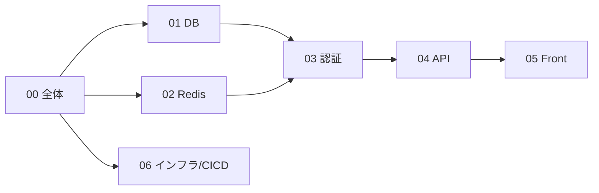

# Cerberus 基本設計書

`task_management_requirements.md`（要件定義書）および `Cerberus_front_image.pptx`（画面イメージ）を入力とした基本設計書。

## ドキュメント一覧

| No | ファイル | 対象領域 | 概要 |
|----|----------|----------|------|
| 00 | [00_overview.md](./00_overview.md) | 全体 | システム構成、レイヤ構成、画面遷移、全体シーケンス、要件書からの設計判断一覧 |
| 01 | [01_database.md](./01_database.md) | PostgreSQL | ER図、テーブル定義、インデックス、制約、マイグレーション方針、DB関数 |
| 02 | [02_redis.md](./02_redis.md) | Redis | キー設計、TTL設計、データ遷移図、操作関数詳細、障害時の挙動 |
| 03 | [03_auth.md](./03_auth.md) | 認証・認可 | Strategyパターン設計、session/jwt/OAuth2、パスワードリセット、CSRF、RBAC |
| 04 | [04_api.md](./04_api.md) | API | エンドポイント定義、リクエスト/レスポンススキーマ、エラー体系、認可マトリクス |
| 05 | [05_frontend.md](./05_frontend.md) | フロントエンド | 画面設計、コンポーネント構成、状態管理、APIクライアント層、ルーティング |
| 06 | [06_infra_cicd.md](./06_infra_cicd.md) | インフラ/CI・CD | Docker Compose構成、環境変数一覧、CI/CDワークフロー設計 |
| - | [diagrams/](./diagrams/README.md) | 構成図（drawio） | システム構成図・レイヤ構成図・ER図・画面遷移図（`.drawio` 形式・編集可能） |

## 読む順番の推奨

各設計書の図は本文中の mermaid 図と、[diagrams/](./diagrams/README.md) 配下の drawio ファイルの2系統で保持している。
mermaid はレビュー時にGitHub上でそのまま読めること、drawio はレイアウトを保って加筆・共有できることを目的としている。

## 用語

| 用語 | 意味 |
|------|------|
| Cerberus | 本システムのアプリ名。session / JWT / OAuth2 の3認証方式を実装することに由来 |
| AUTH_MODE | 認証方式を切り替える環境変数。`session` または `jwt` |
| メンバー | `users.role = 'member'`。所属プロジェクトのみ操作可能 |
| 管理者 | `users.role = 'admin'`。全ユーザー・全プロジェクトを操作可能 |
| オーナー | `projects.owner_id` に一致するユーザー。当該プロジェクトの管理権限を持つ |
