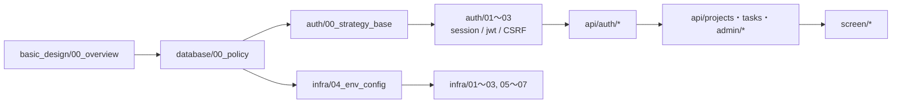

# Cerberus 詳細設計書

`requirements/task_management_requirements.md`（要件定義書）と [basic_design/](../basic_design/README.md)（基本設計書）を入力とし、実装に着手できる粒度まで具体化した詳細設計書。

- **APIは1エンドポイントにつき1ファイル**（全43エンドポイント）
- **画面は1画面につき1ファイル**（全11画面）
- DB・認証・インフラは対象単位（テーブル／認証方式／コンテナ・ワークフロー）で分割

全80ファイル。各ファイルは「関連ドキュメント／概要／全体の出入力／シーケンス図／処理フロー／関数詳細／関数相関図／データ遷移図／テスト設計／不明点・要検討事項」を共通の章立てで持つ。図はすべて Mermaid 記法。

## 読む順番

## 1. API（43エンドポイント）

### 1.1 認証 `api/auth/`
| ファイル | エンドポイント |
|----------|----------------|
| [01_post_auth_register.md](./api/auth/01_post_auth_register.md) | POST /api/auth/register |
| [02_post_auth_login.md](./api/auth/02_post_auth_login.md) | POST /api/auth/login |
| [03_post_auth_logout.md](./api/auth/03_post_auth_logout.md) | POST /api/auth/logout |
| [04_get_auth_me.md](./api/auth/04_get_auth_me.md) | GET /api/auth/me |
| [05_get_auth_config.md](./api/auth/05_get_auth_config.md) | GET /api/auth/config |
| [06_post_auth_refresh.md](./api/auth/06_post_auth_refresh.md) | POST /api/auth/refresh |
| [07_post_auth_verify_email.md](./api/auth/07_post_auth_verify_email.md) | POST /api/auth/verify-email |
| [08_post_auth_verify_email_resend.md](./api/auth/08_post_auth_verify_email_resend.md) | POST /api/auth/verify-email/resend |
| [09_post_auth_password_forgot.md](./api/auth/09_post_auth_password_forgot.md) | POST /api/auth/password/forgot |
| [10_post_auth_password_reset.md](./api/auth/10_post_auth_password_reset.md) | POST /api/auth/password/reset |
| [11_get_auth_oauth_google.md](./api/auth/11_get_auth_oauth_google.md) | GET /api/auth/oauth/google |
| [12_get_auth_oauth_google_callback.md](./api/auth/12_get_auth_oauth_google_callback.md) | GET /api/auth/oauth/google/callback |
| [13_post_auth_oauth_exchange.md](./api/auth/13_post_auth_oauth_exchange.md) | POST /api/auth/oauth/exchange |

### 1.2 ユーザー `api/users/` ／ その他 `api/system/`
| ファイル | エンドポイント |
|----------|----------------|
| [01_get_users_me.md](./api/users/01_get_users_me.md) | GET /api/users/me |
| [02_patch_users_me.md](./api/users/02_patch_users_me.md) | PATCH /api/users/me |
| [03_put_users_me_password.md](./api/users/03_put_users_me_password.md) | PUT /api/users/me/password |
| [04_get_users_me_login_history.md](./api/users/04_get_users_me_login_history.md) | GET /api/users/me/login-history |
| [01_get_health.md](./api/system/01_get_health.md) | GET /api/health |

### 1.3 プロジェクト `api/projects/`
| ファイル | エンドポイント |
|----------|----------------|
| [01_get_projects.md](./api/projects/01_get_projects.md) | GET /api/projects |
| [02_post_projects.md](./api/projects/02_post_projects.md) | POST /api/projects |
| [03_get_project.md](./api/projects/03_get_project.md) | GET /api/projects/{project_id} |
| [04_patch_project.md](./api/projects/04_patch_project.md) | PATCH /api/projects/{project_id} |
| [05_delete_project.md](./api/projects/05_delete_project.md) | DELETE /api/projects/{project_id} |
| [06_get_project_members.md](./api/projects/06_get_project_members.md) | GET /api/projects/{project_id}/members |
| [07_post_project_members.md](./api/projects/07_post_project_members.md) | POST /api/projects/{project_id}/members |
| [08_get_project_member_candidates.md](./api/projects/08_get_project_member_candidates.md) | GET /api/projects/{project_id}/members/candidates |
| [09_delete_project_member.md](./api/projects/09_delete_project_member.md) | DELETE /api/projects/{project_id}/members/{user_id} |

### 1.4 タスク・コメント `api/tasks/`
| ファイル | エンドポイント |
|----------|----------------|
| [01_get_project_tasks.md](./api/tasks/01_get_project_tasks.md) | GET /api/projects/{project_id}/tasks |
| [02_post_project_tasks.md](./api/tasks/02_post_project_tasks.md) | POST /api/projects/{project_id}/tasks |
| [03_get_task.md](./api/tasks/03_get_task.md) | GET /api/tasks/{task_id} |
| [04_patch_task.md](./api/tasks/04_patch_task.md) | PATCH /api/tasks/{task_id} |
| [05_delete_task.md](./api/tasks/05_delete_task.md) | DELETE /api/tasks/{task_id} |
| [06_get_task_comments.md](./api/tasks/06_get_task_comments.md) | GET /api/tasks/{task_id}/comments |
| [07_post_task_comments.md](./api/tasks/07_post_task_comments.md) | POST /api/tasks/{task_id}/comments |
| [08_patch_comment.md](./api/tasks/08_patch_comment.md) | PATCH /api/comments/{comment_id} |
| [09_delete_comment.md](./api/tasks/09_delete_comment.md) | DELETE /api/comments/{comment_id} |

### 1.5 管理者 `api/admin/`
| ファイル | エンドポイント |
|----------|----------------|
| [01_get_admin_users.md](./api/admin/01_get_admin_users.md) | GET /api/admin/users |
| [02_patch_admin_user_role.md](./api/admin/02_patch_admin_user_role.md) | PATCH /api/admin/users/{user_id}/role |
| [03_patch_admin_user_status.md](./api/admin/03_patch_admin_user_status.md) | PATCH /api/admin/users/{user_id}/status |
| [04_post_admin_user_force_logout.md](./api/admin/04_post_admin_user_force_logout.md) | POST /api/admin/users/{user_id}/force-logout |
| [05_get_admin_projects.md](./api/admin/05_get_admin_projects.md) | GET /api/admin/projects |
| [06_delete_admin_project.md](./api/admin/06_delete_admin_project.md) | DELETE /api/admin/projects/{project_id} |
| [07_get_admin_login_history.md](./api/admin/07_get_admin_login_history.md) | GET /api/admin/login-history |

## 2. 画面（11画面）`screen/`

| ファイル | 画面 / パス |
|----------|-------------|
| [01_login.md](./screen/01_login.md) | ログイン `/login` |
| [02_register.md](./screen/02_register.md) | 会員登録 `/register` |
| [03_password_forgot.md](./screen/03_password_forgot.md) | パスワード再設定要求 `/password/forgot` |
| [04_password_reset.md](./screen/04_password_reset.md) | パスワード再設定 `/password/reset` |
| [05_verify_email.md](./screen/05_verify_email.md) | メール認証 `/verify-email` |
| [06_dashboard.md](./screen/06_dashboard.md) | ダッシュボード `/dashboard` |
| [07_project_board.md](./screen/07_project_board.md) | カンバンボード `/projects/:projectId` |
| [08_task_detail_modal.md](./screen/08_task_detail_modal.md) | タスク詳細/編集モーダル |
| [09_settings.md](./screen/09_settings.md) | アカウント設定 `/settings` |
| [10_admin_users.md](./screen/10_admin_users.md) | 管理者ユーザー管理 `/admin/users` |
| [11_oauth_callback.md](./screen/11_oauth_callback.md) | OAuthコールバック中継 `/oauth/callback` |

## 3. データベース `database/`

| ファイル | 対象 |
|----------|------|
| [00_policy.md](./database/00_policy.md) | 設計方針・命名規約・共通カラム・全体ER図 |
| [01_table_users.md](./database/01_table_users.md) | users |
| [02_table_oauth_accounts.md](./database/02_table_oauth_accounts.md) | oauth_accounts |
| [03_table_login_history.md](./database/03_table_login_history.md) | login_history |
| [04_table_projects.md](./database/04_table_projects.md) | projects |
| [05_table_project_members.md](./database/05_table_project_members.md) | project_members |
| [06_table_tasks.md](./database/06_table_tasks.md) | tasks（position採番・version楽観ロック） |
| [07_table_task_comments.md](./database/07_table_task_comments.md) | task_comments |
| [08_db_functions.md](./database/08_db_functions.md) | DB関数・ストアドプロシージャ |
| [09_migration.md](./database/09_migration.md) | Alembicマイグレーション運用・シードデータ |

## 4. 認証・認可 `auth/`

| ファイル | 対象 |
|----------|------|
| [00_strategy_base.md](./auth/00_strategy_base.md) | AuthStrategy抽象・DI（deps）・現在ユーザー解決 |
| [01_session_auth.md](./auth/01_session_auth.md) | sessionモード（Cookie + Redis）／session vs jwt 比較表 |
| [02_jwt_auth.md](./auth/02_jwt_auth.md) | jwtモード（Access + Refresh・ローテーション・再利用検知） |
| [03_csrf.md](./auth/03_csrf.md) | CSRF対策（Double Submit Cookie + Origin検証） |
| [04_google_oauth.md](./auth/04_google_oauth.md) | Google OAuth2（state/PKCE/nonce/handoff） |
| [05_rbac.md](./auth/05_rbac.md) | RBAC・プロジェクト所属判定・404秘匿方針 |
| [06_token_mail.md](./auth/06_token_mail.md) | メール認証・パスワードリセットトークンとメール送信 |
| [07_password_security.md](./auth/07_password_security.md) | argon2idハッシュ・ログイン失敗レート制限 |
| [08_redis_store.md](./auth/08_redis_store.md) | Redisキー操作層とTTL設計（全キー網羅） |

## 5. インフラ・CI/CD `infra/`

| ファイル | 対象 |
|----------|------|
| [01_docker_compose.md](./infra/01_docker_compose.md) | Docker Compose構成（5サービス） |
| [02_dockerfile_api.md](./infra/02_dockerfile_api.md) | backend Dockerfile（Python 3.14） |
| [03_dockerfile_frontend.md](./infra/03_dockerfile_frontend.md) | frontend Dockerfile（Node v26 + Nginx） |
| [04_env_config.md](./infra/04_env_config.md) | **環境変数の全一覧**・config.py設計・Secrets管理 |
| [05_ci_workflow.md](./infra/05_ci_workflow.md) | ci.yml（Lint・型チェック・テスト・buildのみ） |
| [06_cd_workflow.md](./infra/06_cd_workflow.md) | cd.yml（GHCR push・self-hosted runner） |
| [07_operation.md](./infra/07_operation.md) | 運用（監視・ログ・バックアップ・障害切り分け） |

## 6. 基本設計へのフィードバック（実装着手前に確定が必要な事項）

各詳細設計書の「不明点・要検討事項」節から、**基本設計側の修正・追記が必要**なものを抜粋する。詳細は各リンク先を参照。

「解消済」は本詳細設計の作成過程で基本設計・詳細設計の双方を修正して整合させたもの、「未定義／仕様差／運用制約／選択」は実装着手前に方針決定が必要なもの。

| 区分 | 内容 | 該当 |
|------|------|------|
| 解消済 | `require_project_owner` の失敗時ステータス。基本設計 [03_auth.md](../basic_design/03_auth.md) §9.2 の表を「非所属→404 / 所属だが非オーナー→403」に修正し、04_api §5 認可マトリクスおよび詳細設計と整合させた | [api/projects/04](./api/projects/04_patch_project.md) |
| 解消済 | Origin検証失敗時のHTTPステータス。基本設計（04_api §4.2、03_auth §9.2）が定める **`403 CSRF_INVALID`** に全詳細設計を統一した（一部APIで400と記載していたものを修正） | [auth/03_csrf.md](./auth/03_csrf.md) |
| 解消済 | ルート `/` を `/login` へのリダイレクト専用パスとし、ダッシュボードを `/dashboard` へ移動した（追加要件 issue #1）。`OAUTH_DEFAULT_REDIRECT_TO` の既定値も `/dashboard` に変更し、[infra/04](./infra/04_env_config.md) へ変数を追記した | [screen/01](./screen/01_login.md), [screen/06](./screen/06_dashboard.md) |
| 未定義 | ログイン以外のレート制限（register / verify-email/resend / password/forgot / コメント投稿）が未定義。IP単位の制限を含め要検討 | [api/auth/01](./api/auth/01_post_auth_register.md), [08](./api/auth/08_post_auth_verify_email_resend.md) |
| 未定義 | `pwreset` に `emailverify_current` 相当の逆引きキーがなく、短時間の複数要求で複数トークンが同時に有効になり得る | [auth/06_token_mail.md](./auth/06_token_mail.md) |
| 未定義 | DB更新成功後にRedis失効が失敗した場合の補償処理（管理者による無効化・パスワード変更時） | [api/admin/03](./api/admin/03_patch_admin_user_status.md), [api/users/03](./api/users/03_put_users_me_password.md) |
| 未定義 | `display_name` のフォールバック規則（OAuth新規ユーザーで姓名未設定の場合。詳細設計では `username` 代替とした） | [api/projects/01](./api/projects/01_get_projects.md) |
| 未定義 | `X-Forwarded-For` の信頼範囲（`login_history` のIP記録とレート制限のキーに影響） | [auth/07](./auth/07_password_security.md), [infra/07](./infra/07_operation.md) |
| 未定義 | ページング設定値の環境変数（`PAGINATION_DEFAULT_PER_PAGE` / `PAGINATION_MAX_PER_PAGE`）は詳細設計での新規命名。上限超過時に422とするかクランプするかも未確定 | [infra/04](./infra/04_env_config.md) |
| 未定義 | `login_history` へのINSERT失敗時にログイン処理自体を失敗とするか | [database/03](./database/03_table_login_history.md) |
| 未定義 | `INITIAL_ADMIN_PASSWORD` 等が未設定の場合の起動挙動（詳細設計では起動失敗を既定とした） | [database/09](./database/09_migration.md) |
| 仕様差 | `task_comments` に楽観ロック用 `version` 列がなく、コメントの同時編集は後勝ちになる（`tasks` との仕様差） | [api/tasks/08](./api/tasks/08_patch_comment.md) |
| 運用制約 | jwtモードのaccess tokenは即時失効できず、強制ログアウト後も最大 `ACCESS_TOKEN_TTL_SECONDS`（15分）有効なまま残る。無効化（status変更）はDBの `is_active` 再確認により即時遮断される | [api/admin/04](./api/admin/04_post_admin_user_force_logout.md), [auth/02](./auth/02_jwt_auth.md) |
| 選択 | Lintツールを ruff / flake8 のどちらにするか（要件書§8.1が両論併記。詳細設計は ruff 前提で統一） | [infra/05](./infra/05_ci_workflow.md) |

## 7. 記述上の取り決め

| 項目 | 内容 |
|------|------|
| 図 | すべて Mermaid 記法（シーケンス図・フローチャート・ER図・状態遷移図・相関図） |
| 具体値 | TTL・上限値・ポート・URL等はハードコーディングせず、対応する環境変数名を併記する。全変数は [infra/04_env_config.md](./infra/04_env_config.md) に集約 |
| 不明点 | 基本設計に記載がなく詳細設計側で仮置きした事項は、各ファイル末尾に「不明」「要検討」として明示する |
| 相互参照 | 基本設計・関連詳細設計への相対リンクを各ファイル冒頭の「関連ドキュメント」に記載 |
