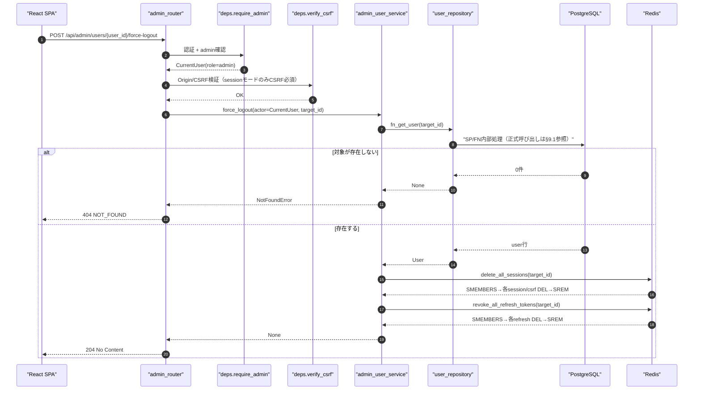
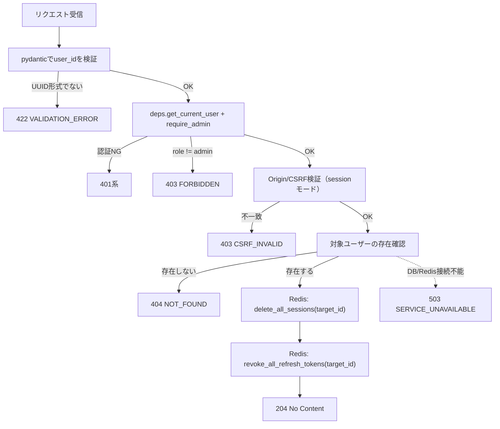
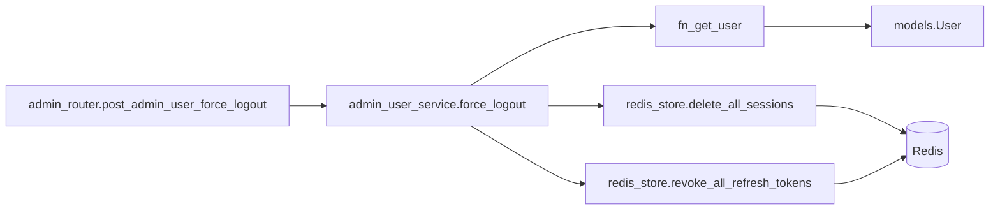
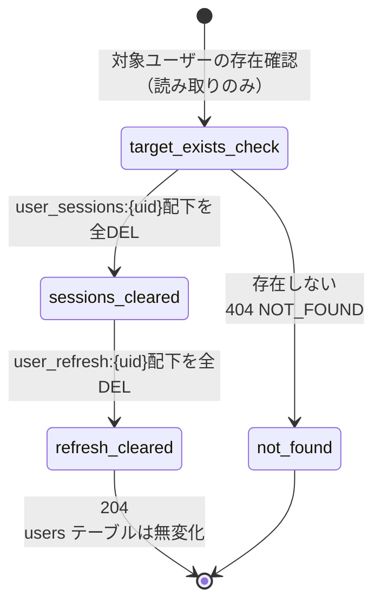

# POST /api/admin/users/{user_id}/force-logout（強制ログアウト）

## 0. 関連ドキュメント

| ドキュメント | 内容 |
|--------------|------|
| [../../../basic_design/04_api.md](../../../basic_design/04_api.md) | §2.5 管理者API一覧（強制ログアウト単体では access token が最大15分残る旨の記述）、§4.2 エラーコード体系 |
| [../../../basic_design/03_auth.md](../../../basic_design/03_auth.md) | §4.2 jwtアクセストークンはRedisを参照しない署名検証のみ、§11 3方式の比較（失効の即時性） |
| [../../../basic_design/02_redis.md](../../../basic_design/02_redis.md) | §2 キー一覧（`user_sessions:{uid}` / `user_refresh:{uid}`）、§5.1/5.2 `delete_all_sessions` / `revoke_all_refresh_tokens` |
| [./03_patch_admin_user_status.md](./03_patch_admin_user_status.md) | 同じRedis失効関数をDB更新（`is_active=false`）と併用するAPI（本APIはDB更新を伴わない点が異なる） |

## 1. 概要

| 項目 | 内容 |
|------|------|
| エンドポイント | `POST /api/admin/users/{user_id}/force-logout` |
| 目的 | 対象ユーザーの `is_active` や `role` を変更せずに、Redis上の全セッション・全リフレッシュトークンのみを失効させる（アカウント自体は有効なまま維持） |
| 認証 | 必要 |
| 認可 | admin のみ |
| CSRF検証 | 必要（session モードの更新系メソッド） |
| Origin検証 | 必要（Cookieを利用する更新系のため） |
| AUTH_MODE差異 | DB更新を伴わないため`users`テーブルへの影響はないが、対象ユーザーが現在どちらの方式でログインしていたかに関わらず両方のRedisキー群を失効させる（3章参照）。**jwtモードでは既発行のaccess tokenは失効させられず、最大`ACCESS_TOKEN_TTL_SECONDS`（既定900秒=15分）有効なまま残る**点が本APIの最大の制約である |
| 冪等性 | あり（対象に有効なセッション/リフレッシュトークンが無い状態で再実行しても204のまま） |
| レート制限 | 対象外 |
| トランザクション境界 | PostgreSQLの更新を伴わないため単一トランザクションの概念はない。Redisの `delete_all_sessions` / `revoke_all_refresh_tokens` を同一サービス関数内で順に実行する |

## 2. 入出力仕様

### 2.1 リクエスト

**パスパラメータ**

| 名前 | 型 | 必須 | 制約 | 説明 |
|------|----|------|------|------|
| user_id | string(uuid) | ○ | UUID形式 | 対象ユーザーID |

ボディ／クエリパラメータ／該当ヘッダ（認証・CSRF・Cookieを除く）：なし。

### 2.2 レスポンス

**`204 No Content`**（ボディなし）

`Set-Cookie` なし（対象ユーザーのCookieは実行者のブラウザには存在しないため、実行者自身のCookieには影響しない）。共通ヘッダ `X-Request-ID` を全レスポンスに付与する。

## 3. エラー仕様

| HTTP | code | 発生条件 | メッセージ | 備考 |
|------|------|----------|------------|------|
| 401 | `UNAUTHENTICATED` / `SESSION_EXPIRED` / `TOKEN_EXPIRED` / `TOKEN_INVALID` | 認証情報なし・失効・不正 | 認証情報が無効です | |
| 403 | `USER_INACTIVE` | 実行者自身が `is_active=false` | アカウントが無効化されています | |
| 403 | `FORBIDDEN` | 実行者の `role != admin` | 権限がありません | |
| 403 | `CSRF_INVALID` | sessionモードでCSRFヘッダ不一致・欠落 | CSRFトークンが不正です | |
| 404 | `NOT_FOUND` | `user_id` が存在しない | ユーザーが見つかりません | |
| 503 | `SERVICE_UNAVAILABLE` | Redis 接続不能（対象ユーザー存在確認のPostgreSQLも含む） | しばらくしてから再度お試しください | fail-close |

自分自身を対象にした強制ログアウトは、ロール変更・無効化と異なり業務上禁止する理由がないため `SELF_MODIFICATION_NOT_ALLOWED` の対象としない（13章「不明点」参照）。`basic_design/04_api.md` §4.2 のエラーコード体系から逸脱しない。

## 4. 処理シーケンス

## 5. 処理フロー・分岐

## 6. 関数詳細

### 6.1 `api/routers/admin_router.py :: post_admin_user_force_logout`

| 項目 | 内容 |
|------|------|
| シグネチャ | `async def post_admin_user_force_logout(user_id: UUID, actor: CurrentUser = Depends(require_admin), _: None = Depends(verify_csrf), db: AsyncSession = Depends(get_db)) -> Response` |
| 引数 | `user_id`: パス / `actor`: admin確認済みユーザー / `db`: DBセッション |
| 戻り値 | `Response`（204、ボディなし） |
| 送出例外 | なし（サービス層の例外をそのまま伝播） |
| 処理内容 | 1. `require_admin`・`verify_csrf` を通過 2. `admin_user_service.force_logout` を呼び出す 3. `204` を返す |
| 副作用 | なし |

### 6.2 `service/admin_user_service.py :: force_logout`

| 項目 | 内容 |
|------|------|
| シグネチャ | `async def force_logout(actor: CurrentUser, target_id: UUID, db: AsyncSession) -> None` |
| 引数 | `actor`: 実行者（admin） / `target_id`: 対象ユーザーID / `db`: DBセッション |
| 戻り値 | なし |
| 送出例外 | `NotFoundError`（404） |
| 処理内容 | 1. `fn_get_user(target_id)` で存在確認のみ行う（行ロックは不要。DB更新を行わないため） 2. 存在しなければ `NotFoundError` 3. `redis_store.delete_all_sessions(target_id)` を実行 4. 続けて `redis_store.revoke_all_refresh_tokens(target_id)` を実行 5. `users.role`/`is_active` は一切変更しない |
| 副作用 | Redisの `session:{sid}` / `csrf:{sid}` / `user_sessions:{uid}` / `refresh:{hash}` / `user_refresh:{uid}` を全削除。PostgreSQLへの書き込みなし |

### 6.3 `repository/redis_store.py :: delete_all_sessions` / `revoke_all_refresh_tokens`

[03_patch_admin_user_status.md §6.3 / §6.4](./03_patch_admin_user_status.md#63-repositoryredis_storepy--delete_all_sessions既存関数の再掲) と同一の既存関数を再利用する。本APIは呼び出し元（`force_logout`）が異なるのみで、Redis側の処理内容・キー操作は完全に同一である。

## 7. 関数相関図

## 8. データ遷移図

PostgreSQLの `users` 行は本APIの前後で一切変化しない（読み取りのみ）。

## 9. SP/FNデータアクセス一覧

### 9.1 正式なDBアクセス契約

本APIのrepositoryは、次のSP/FN呼び出しとDTO写像だけを行う。

| 種別 | 契約 | 説明 |
|------|------|------|
| fn_get_user | `fn_get_user(p_user_id)` | fn_get_userを呼び出し、結果をレスポンスへ写像する |

repositoryはDBテーブルへ直結せず、SP/FN契約だけを呼び出す。 直下の従来のテーブルI/O表はSP/FN内部SQLの補足であり、repositoryの発行契約ではない。更新系の整合性制御、version検証、advisory lock、通知、SQLSTATE P0xxxはSP/FN層の責務である。存在・所属の事実判定はFNの空集合/falseを受け、404/403への変換はAPI層が行う。

**PostgreSQL**

| テーブル | 操作 | 条件 | 備考 |
|----------|------|------|------|
| users | SELECT | `id=:target_id` | 存在確認のみ。ロック不要、更新なし |

**Redis**

| キー | 操作 | TTL | 備考 |
|------|------|-----|------|
| `user_sessions:{target_id}` | SMEMBERS → DEL | - | 有効session_id一覧取得後に集合ごと削除 |
| `session:{sid}`（各session_idごと） | DEL | - | 即時失効 |
| `csrf:{sid}`（各session_idごと） | DEL | - | 即時失効 |
| `user_refresh:{target_id}` | SMEMBERS → DEL | - | 有効token_hash一覧取得後に集合ごと削除 |
| `refresh:{hash}`（各token_hashごと） | DEL | - | 即時失効 |

## 10. バリデーション規則

| pydanticスキーマ | フィールド | 制約 | フロント（zod）との整合 |
|-------------------|-----------|------|--------------------------|
| パスパラメータ | user_id | UUID形式 | `zod.string().uuid()` |

リクエストボディは持たないためスキーマなし。

## 11. 非機能・セキュリティ考慮

| 観点 | 内容 |
|------|------|
| ログ出力 | 監査ログ対象。`actor.id`, `target_id`, 失効件数（session/refreshそれぞれ）, `X-Request-ID` をINFO出力 |
| ユーザー列挙対策 | admin専用APIのため対象外 |
| タイミング攻撃対策 | 該当なし |
| レート制限 | なし |
| fail-close方針 | Redis接続不能時は `503 SERVICE_UNAVAILABLE` |
| sessionモードへの効果 | `session:{sid}` の即時DELにより、実行直後のリクエストから対象ユーザーは `401 SESSION_EXPIRED` となる（[03_auth.md §3.4](../../../basic_design/03_auth.md#34-ログアウト)のログアウト処理と同一の失効メカニズム） |
| **jwtモードへの制約** | リフレッシュトークンは即時失効するため `/auth/refresh` は以降 `401 TOKEN_REVOKED` となるが、**既発行のaccess tokenは署名検証のみで認証されるため失効できない**。したがって強制ログアウト実行後も、対象ユーザーは最大 `ACCESS_TOKEN_TTL_SECONDS`（既定900秒=15分）の間、既存のaccess tokenで通常どおりAPIを利用できてしまう。これは[03_patch_admin_user_status.md](./03_patch_admin_user_status.md)（無効化API）との重要な違いであり、無効化APIは`is_active=false`を経由して`deps.get_current_user`のDB確認により実質即時遮断となるのに対し、本APIは`is_active`を変更しないためこの経路による遮断が働かない |
| 運用上の使い分け | 「即時かつ確実に遮断したい」場合は無効化API（[03](./03_patch_admin_user_status.md)）を使用し、「アカウントは有効なまま特定端末のログイン状態だけを切りたい」場合に本APIを使用する、という運用上の役割分担を管理者向けUIの説明文で明示することが望ましい（画面設計側で要検討） |

## 12. テスト設計

| No | 区分 | ケース | 前提 | 期待結果 | pytest関数名案 |
|----|------|--------|------|----------|-----------------|
| 1 | 結合（実DB・実SP） | 存在確認のみでDB更新を行わない | `fn_get_user`の実DB結果を使用 | `SELECT fn_get_user`後にDB更新SPを呼ばず、Redis失効だけ行う | `test_force_logout_does_not_update_db` |
| 2 | 単体 | Redis失効2関数が順に呼ばれる | redis_storeをモック | `delete_all_sessions`→`revoke_all_refresh_tokens`の順で呼び出し | `test_force_logout_calls_redis_revocation_functions` |
| 3 | 結合 | 対象ユーザーが存在しない場合は404 | 存在しないUUID | `404 NOT_FOUND` | `test_force_logout_target_not_found` |
| 4 | 結合(session) | 実行後にsession Cookieでのリクエストが401になる | 対象ユーザーでログイン中に実行 | `204`、以後`401 SESSION_EXPIRED` | `test_force_logout_session_invalidated` |
| 5 | 結合(jwt) | 実行後もaccess tokenは有効期限まで利用できる | 対象ユーザーでログイン中（jwtモード）に実行 | `204`、実行直後のaccess tokenでのリクエストは引き続き`200`（is_activeは変更されていないため） | `test_force_logout_jwt_access_token_still_valid_until_expiry` |
| 6 | 結合(jwt) | 実行後にrefreshが失効している | 実行前に発行済みのrefresh tokenで`/auth/refresh`を実行 | `401 TOKEN_REVOKED`相当（`refresh:{hash}`が存在しない） | `test_force_logout_jwt_refresh_revoked` |
| 7 | 結合 | 複数端末でログイン中のユーザーに実行すると全端末が失効する | 同一ユーザーでsession 2件を作成 | 両方の`session:{sid}`がDELされ、両端末とも401になる | `test_force_logout_invalidates_all_devices` |
| 8 | 結合 | 有効なセッション/トークンが無いユーザーに実行しても204 | 未ログイン状態のユーザーを対象に実行 | `204`（冪等） | `test_force_logout_idempotent_when_no_active_sessions` |
| 9 | 結合 | member（非admin）はアクセス不可 | `role=member` の実行者 | `403 FORBIDDEN` | `test_force_logout_forbidden_for_member` |
| 10 | 結合 | sessionモードでCSRFヘッダ欠落は403 | `AUTH_MODE=session` | `403 CSRF_INVALID` | `test_force_logout_csrf_required_in_session_mode` |

No.5は本APIの制約（jwtのaccess tokenが失効できない点）を明示的に検証する最重要ケースであり、`AUTH_MODE=jwt`固有のテストとして実施する。

## 13. 不明点・要検討事項

| 区分 | 内容 | 影響 |
|------|------|------|
| 要検討 | 自分自身に対する強制ログアウト（`user_id == actor.id`）を許可するか禁止するかは基本設計に明記がない。本書では「アカウントの権限自体は変更しない操作」であるため`SELF_MODIFICATION_NOT_ALLOWED`の対象外（許可）とする方針を採ったが、実行すると管理者自身も即座にログアウトされうるため、UI側での確認ダイアログ等の要否とあわせて要確認 |
| 採用 | jwtのAccess Tokenはforce-logout後も最大`ACCESS_TOKEN_TTL_SECONDS`（既定900秒）有効。即時遮断はstatus APIで無効化し、管理画面にこの使い分けを表示する |
