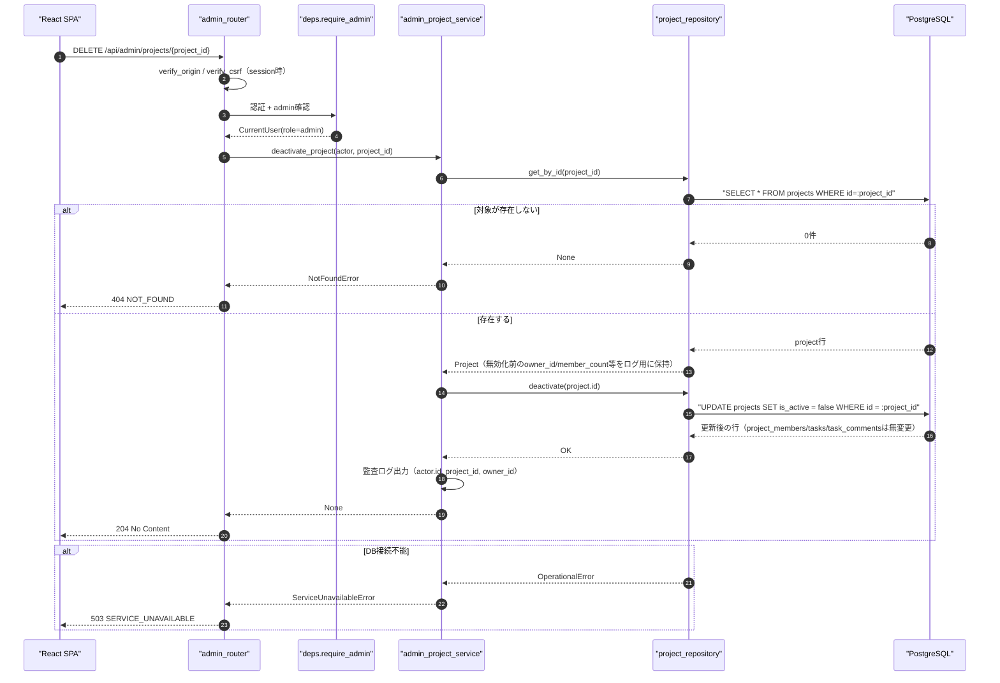
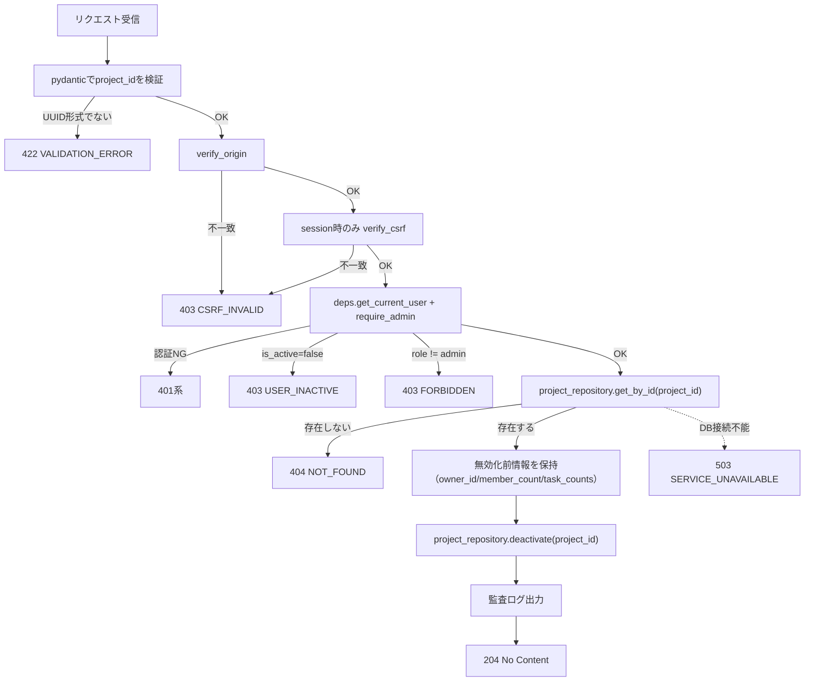
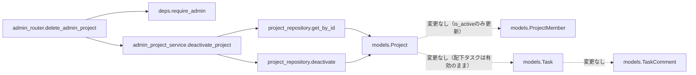
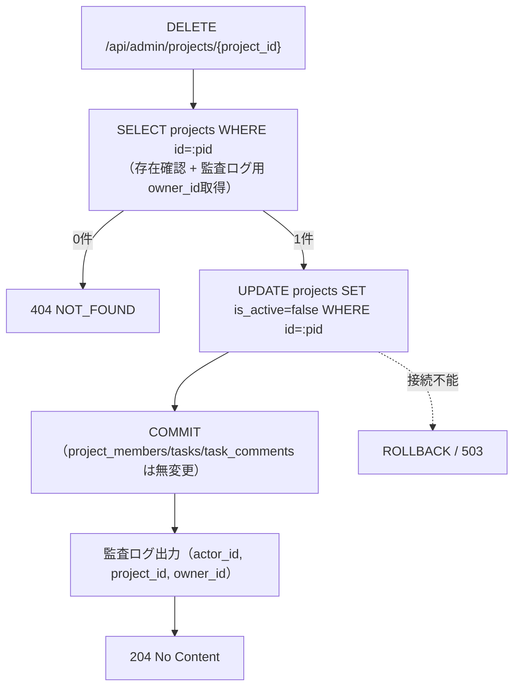

# DELETE /api/admin/projects/{project_id}（管理者によるプロジェクト削除）

## 0. 関連ドキュメント

| ドキュメント | 内容 |
|--------------|------|
| [../../../basic_design/04_api.md](../../../basic_design/04_api.md) | §2.3 `DELETE /projects/{id}`（オーナー/admin）、§2.5 管理者API一覧、§4.2 エラーコード体系、§5 認可マトリクス |
| [../../../basic_design/01_database.md](../../../basic_design/01_database.md) | §3.3 projects（`is_active`論理削除フラグ）、§3.5 tasks（`project_is_active`との関係） |
| [../../../basic_design/03_auth.md](../../../basic_design/03_auth.md) | §9.2 `core/deps.py`（`require_admin`） |
| [./05_get_admin_projects.md](./05_get_admin_projects.md) | 本APIの削除対象を一覧表示する管理者プロジェクト一覧API |
| [../projects/05_delete_project.md](../projects/05_delete_project.md) | 一般（オーナー/admin）向け削除API。本APIとの差異は1章参照 |
| [../../screen/10_admin_users.md](../../screen/10_admin_users.md) | 本APIを呼び出す画面（管理者ユーザー管理画面・プロジェクト一覧タブの削除操作） |

## 1. 概要

| 項目 | 内容 |
|------|------|
| エンドポイント | `DELETE /api/admin/projects/{project_id}` |
| 目的 | 管理者が任意のプロジェクト（自身がオーナー・所属メンバーであるかを問わない）を**論理削除**する（`UPDATE projects SET is_active = false`）。物理削除（`DELETE FROM projects`）は行わない |
| 認証 | 必要 |
| 認可 | admin固定 |
| CSRF検証 | 必要（session モードの更新系） |
| Origin検証 | 必要 |
| AUTH_MODE差異 | session: `X-CSRF-Token` 検証あり／jwt: ヘッダ方式のためCSRF検証なし |
| 冪等性 | あり（既に`is_active=false`の対象への再実行も`UPDATE`が0件更新になるだけで204として扱う。プロジェクト自体が存在しない場合のみ404） |
| レート制限 | 対象外 |
| トランザクション境界 | `UPDATE projects SET is_active = false WHERE id=:project_id` 一文。`project_members` / `tasks` / `task_comments` は**変更しない**（配下タスクは無効化されず有効なまま残る） |

**本APIの意味変更（issue #10）**：従来は物理削除（`DELETE FROM projects`、CASCADEで配下も削除）としていたが、`projects.is_active` 論理削除フラグの導入に伴い、本APIは論理削除（`is_active=false`への更新）に意味を変更する。物理DELETEを実行する経路はアプリケーションAPIとしては提供しない（DBの`ON DELETE CASCADE`はusersの物理削除APIが存在しない場合と同様、通常運用では発火しない防御的制約という位置づけになる）。

`DELETE /projects/{project_id}` との差異は以下のとおりである。

| 観点 | `DELETE /projects/{project_id}`（一般） | `DELETE /admin/projects/{project_id}`（本API） |
|------|------------------------------------------|--------------------------------------------------|
| 認可判定 | `deps.require_project_owner`：`role==admin` なら即許可、それ以外は所属確認 → オーナー確認の2段階 | `deps.require_admin`：role確認のみ。プロジェクトへの所属・オーナーシップは一切問わない |
| 非所属・不存在時の応答 | 非所属memberは存在有無を隠して404、対象自体が無ければ404 | admin視点では「所属」概念がないため、`project_id` が存在しなければ404、存在すれば常に無効化可 |
| 存在確認クエリ | `require_project_owner` が `project_repository.get_by_id` と `project_member_repository.exists` の2クエリを発行 | `project_repository.get_by_id` の1クエリのみ（所属確認クエリが不要） |
| 論理削除の効果範囲 | 同一（`projects.is_active`のみ更新。`project_members`/`tasks`/`task_comments`は無変更） | 同一（本APIも [05_delete_project.md §9](../projects/05_delete_project.md) と全く同じ範囲） |
| 呼び出し元画面 | プロジェクト詳細画面の削除ボタン（オーナー/admin向け） | 管理者ユーザー管理画面のプロジェクト一覧タブ（他人が所有するプロジェクトも一覧から直接無効化する運用を想定） |
| 監査ログの重み付け | 通常操作の一部として記録 | 「他者が所有するプロジェクトを第三者（管理者）が強制的に無効化する」操作であるため、`owner_id`（対象プロジェクトのオーナー）を必ずログへ含め、通常操作より重点的に扱う（11章参照） |
| 再有効化 | `04_patch_project.md` の `is_active:true` でオーナー/adminが可能 | 本APIには再有効化の専用エンドポイントはなく、`04_patch_project.md`（admin権限）を利用する |

## 2. 入出力仕様

### 2.1 リクエスト

**パスパラメータ**

| 名前 | 型 | 必須 | 制約 | 説明 |
|------|----|------|------|------|
| project_id | string(uuid) | ○ | UUID v4形式 | 削除対象プロジェクトID |

クエリパラメータ／ボディ：なし。ヘッダ：`X-CSRF-Token`（sessionモードの更新系で必須）。

### 2.2 レスポンス

**`204 No Content`**

ボディなし。`Set-Cookie` なし。共通ヘッダ `X-Request-ID` を付与する。

## 3. エラー仕様

| HTTP | code | 発生条件 | メッセージ | 備考 |
|------|------|----------|------------|------|
| 401 | `UNAUTHENTICATED` 系 | 認証情報なし・無効 | 認証情報が無効です | |
| 403 | `USER_INACTIVE` | `is_active=false` | アカウントが無効化されています | |
| 403 | `CSRF_INVALID` | sessionモードでCSRFヘッダ／Origin不一致 | CSRFトークンが不正です | |
| 403 | `FORBIDDEN` | `role != admin` | 権限がありません | 一般APIの `FORBIDDEN`（オーナー以外403）とは異なり、本APIはロール不足のみが原因となる |
| 404 | `NOT_FOUND` | `project_id` が存在しない | プロジェクトが見つかりません | admin視点では所属有無による隠蔽は発生しない |
| 422 | `VALIDATION_ERROR` | `project_id` がUUID形式でない | 入力内容に誤りがあります | |
| 503 | `SERVICE_UNAVAILABLE` | PostgreSQL 接続不能 | しばらくしてから再度お試しください | fail-close |

`basic_design/04_api.md` §4.2 のエラーコード体系から逸脱しない。

## 4. 処理シーケンス

## 5. 処理フロー・分岐

## 6. 関数詳細

### 6.1 `api/routers/admin_router.py :: delete_admin_project`

| 項目 | 内容 |
|------|------|
| シグネチャ | `async def delete_admin_project(project_id: UUID, actor: CurrentUser = Depends(require_admin), _: None = Depends(verify_csrf), db: AsyncSession = Depends(get_db)) -> Response` |
| 引数 | `project_id`: パス / `actor`: admin確認済みユーザー / `db`: DBセッション |
| 戻り値 | `Response(status_code=204)` |
| 送出例外 | なし（サービス層の例外を `AppError` としてそのまま伝播） |
| 処理内容 | 1. `require_admin`・`verify_csrf` を通過 2. `admin_project_service.deactivate_project(db, actor, project_id)` を呼び出す 3. `204 No Content` を返す |
| 副作用 | なし（副作用はservice層に委譲） |

### 6.2 `service/admin_project_service.py :: deactivate_project`

| 項目 | 内容 |
|------|------|
| シグネチャ | `async def deactivate_project(db: AsyncSession, actor: CurrentUser, project_id: UUID) -> None` |
| 引数 | `actor`: 実行者（admin） / `project_id`: 無効化対象 / `db`: DBセッション |
| 戻り値 | なし |
| 送出例外 | `NotFoundError`（404）、`ServiceUnavailableError`（DB接続不能）→503 |
| 処理内容 | 1. `project_repository.get_by_id(project_id)` で存在確認と、監査ログ用の `owner_id` を取得する（存在しなければ `NotFoundError`） 2. `project_repository.deactivate(project_id)` を呼び出す 3. `commit` する 4. `owner_id` を含めて監査ログを出力する（11章） |
| 副作用 | `projects.is_active` を `false` に更新するUPDATEのみ。`project_members` / `tasks` / `task_comments` へは一切のDML（DELETE/UPDATE）を発行しない（配下タスクは有効なまま維持される）。所属メンバー・元オーナーへの通知は行わない（基本設計に規定なし。13章参照） |

### 6.3 `repository/project_repository.py :: get_by_id` / `deactivate`

[../projects/05_delete_project.md §6.3](../projects/05_delete_project.md) で定義済みの `deactivate(db, project_id)` をそのまま再利用する。`get_by_id` も `04_patch_project.md` / `05_delete_project.md` で定義済みの既存関数を再利用し、本API専用の新規リポジトリ関数は追加しない（所属確認 `exists` は本APIでは呼び出さない点のみが差異）。

## 7. 関数相関図

## 8. データ遷移図

## 9. データアクセス一覧

**PostgreSQL**

| テーブル | 操作 | 条件 | 備考 |
|----------|------|------|------|
| projects | SELECT | `id=:project_id` | 存在確認 + 監査ログ用の `owner_id` 取得。`project_members` への所属確認クエリは発行しない（一般APIとの差異） |
| projects | UPDATE | `id=:project_id` | `is_active = false` に更新するのみ。`updated_at` はトリガ更新 |

変更範囲外（本APIでは一切のDML操作を行わない）：`project_members`（所属関係は維持）、`tasks`（`is_active`はそのまま、`project_id`もそのまま。物理削除ではなくなったため`ON DELETE CASCADE`は発火しない）、`task_comments`（同上）。`projects.owner_id`に対する`users`側のFK（`ON DELETE RESTRICT`）は本APIと無関係。CASCADE非発火の位置づけそのものは [../projects/05_delete_project.md §9](../projects/05_delete_project.md) と完全に同一である。

**Redis**

| キー | 操作 | TTL | 備考 |
|------|------|-----|------|
| `session:{sid}` / `csrf:{sid}`（sessionモードのみ） | GET | `SESSION_TTL_SECONDS` | 認証・CSRF確認のみ。本APIの削除処理そのものはRedisを更新しない |

## 10. バリデーション規則

| pydanticスキーマ | フィールド | 制約 | フロント（zod）との整合 |
|-------------------|-----------|------|--------------------------|
| `AdminProjectPathParams` | project_id | `UUID`（pydantic標準型） | `zod.string().uuid()` |

## 11. 非機能・セキュリティ考慮

| 観点 | 内容 |
|------|------|
| ログ出力 | 監査ログ対象（状態変更操作。かつ管理者による他者所有リソースへの強制操作のため通常操作より重点的に扱う）。`actor.id`（実行した管理者）, `project_id`, 対象プロジェクトの `owner_id`, 無効化時点の `member_count`/`task_counts`（無効化前に取得）, `X-Request-ID` を **WARN** で出力する（[../projects/05_delete_project.md](../projects/05_delete_project.md) はINFOとしているのに対し、本APIは管理者による強制操作であるため常にWARN以上とする） |
| ユーザー列挙対策 | admin専用APIのため対象外 |
| タイミング攻撃対策 | 該当なし |
| レート制限 | なし |
| 破壊的操作の確認 | フロント側で無効化確認ダイアログを表示し、対象プロジェクト名・オーナー名を明示する（論理削除のため`04_patch_project.md`の`is_active:true`更新でadminが取り消し＝再有効化できる。ただし本APIレスポンス自体にUndo手段は含まない） |
| 元オーナー・メンバーへの通知 | 本APIは無効化の事後通知（メール等）を行わない。管理者による強制無効化であることをメンバーへ周知する手段が必要かは基本設計に規定がなく、要検討（13章） |
| fail-close方針 | DB接続不能時は503。`UPDATE`はWHERE句で対象を1件に限定し、部分的な状態変化は発生しない |

## 12. テスト設計

| No | 区分 | ケース | 前提 | 期待結果 | pytest関数名案 |
|----|------|--------|------|----------|-----------------|
| 1 | 単体 | serviceがrepository.deactivateを1回呼び出す | repositoryをモック | `deactivate(project.id)` 呼び出しを検証、`project_member_repository.exists` は未呼び出し | `test_admin_delete_project_calls_repository_without_membership_check` |
| 2 | 結合 | adminは他人が所有するプロジェクトを204で無効化できる | 一般ユーザーが所有し、adminは非所属のプロジェクトを用意 | `204`、`projects.is_active=false`に更新、`project_members`/`tasks`/`task_comments`は行数・内容とも変化なし | `test_admin_delete_project_deactivates_without_deleting_related_rows_for_non_member_project` |
| 3 | 結合 | 存在しないproject_idは404 | 未使用のUUID | `404 NOT_FOUND` | `test_admin_delete_project_not_found` |
| 4 | 結合 | member（オーナー含む）はアクセス不可 | `role=member` の実行者（対象プロジェクトのオーナーであっても） | `403 FORBIDDEN` | `test_admin_delete_project_forbidden_for_non_admin` |
| 5 | 結合 | 無効化後の再実行も204（冪等） | 同一project_idへ2回目のDELETE | `204`（`is_active=false`のまま、エラーにしない） | `test_admin_delete_project_idempotent_second_call_returns_204` |
| 6 | 結合 | sessionモードでCSRFヘッダ欠落は403 | `X-CSRF-Token`なし | `403 CSRF_INVALID` | `test_admin_delete_project_missing_csrf_session_mode` |
| 7 | 結合 | 監査ログにowner_id（オーナー）が出力される | ログ出力をキャプチャして検証 | ログレコードに `actor_id`/`project_id`/`owner_id` が含まれる | `test_admin_delete_project_audit_log_contains_owner` |
| 8 | 結合 | 無効化後に`04_patch_project.md`のadmin権限で再有効化できる | adminが無効化後、`is_active:true`でPATCH | `200`、`is_active=true`に戻る | `test_admin_delete_project_reactivatable_via_patch` |

`AUTH_MODE=session` / `jwt` の両方で No.2・No.4を実施する。

## 13. 不明点・要検討事項

| 区分 | 内容 | 影響 |
|------|------|------|
| 要検討 | 管理者による強制無効化時、元オーナー・所属メンバーへの通知（メール等）を行うかは基本設計に規定がない。本書では「行わない」を前提としたが、運用上の要望次第では `auth_service` のメール送信基盤（[../../auth/06_token_mail.md](../../auth/06_token_mail.md)）を流用した通知機能の追加が要検討 |
| 要検討 | 無効化確認（誤操作防止）のUI仕様は `basic_design/05_frontend.md` および `screen/10_admin_users.md` 側の管轄であり、本APIの入出力には影響しないため詳細は割愛した |
