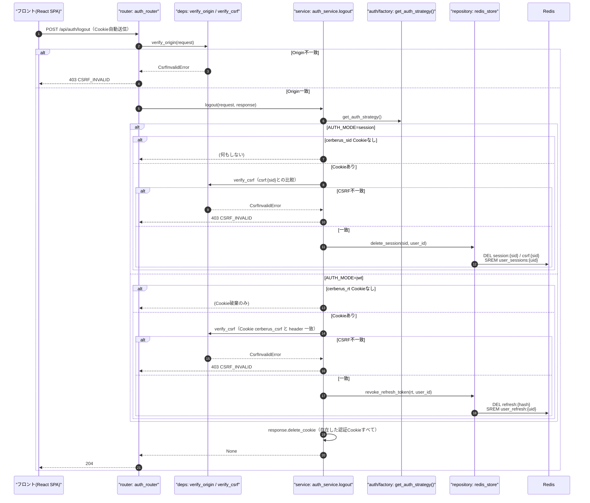
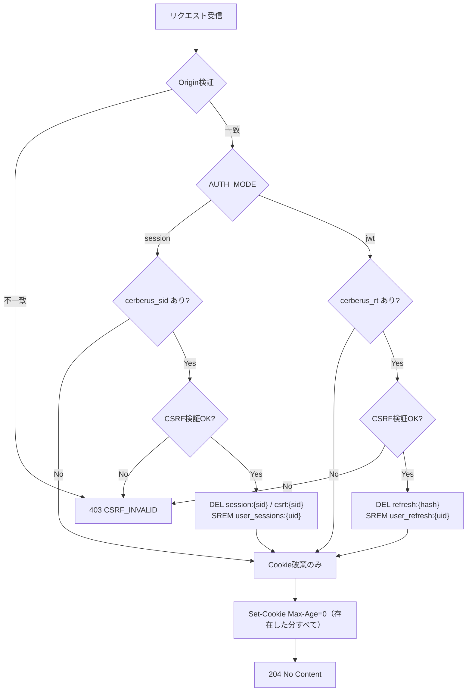
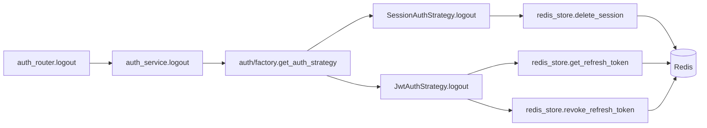
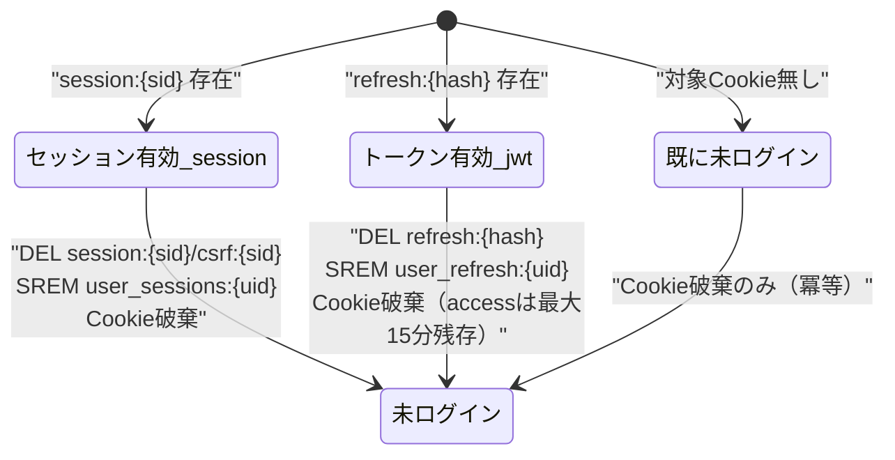

# POST /api/auth/logout（ログアウト）

## 0. 関連ドキュメント

| ドキュメント | パス |
|--------------|------|
| API基本設計 | `../../../basic_design/04_api.md` |
| 認証基本設計 | `../../../basic_design/03_auth.md`（§3.4 session、§4.5 jwt、§8 CSRF） |
| Redis基本設計 | `../../../basic_design/02_redis.md` |
| ログインAPI | `./02_post_auth_login.md` |
| リフレッシュAPI | `./06_post_auth_refresh.md` |
| 現在ユーザー取得API | `./04_get_auth_me.md` |

## 1. 概要

| 項目 | 内容 |
|------|------|
| エンドポイント | `POST /api/auth/logout` |
| 目的 | 現在の認証状態を即時失効させ、認証Cookieを破棄する |
| 認証 | session：`cerberus_sid` Cookie／jwt：`cerberus_rt` Cookie（access tokenは任意。無くても実行可能） |
| 認可 | 未認証可（Cookieが無い場合もCookie破棄のみ行い204で成功させる冪等設計） |
| CSRF検証 | **AUTH_MODE差異あり**。session：常に必須／jwt：`cerberus_rt` Cookieが存在する場合のみ必須（存在しなければCookie破棄のみで検証不要） |
| Origin検証 | 必要（Cookieを利用する更新系APIのため） |
| AUTH_MODE差異 | **あり**。詳細は§4・§9を参照 |
| 冪等性 | **あり**。既にログアウト済み（Cookie無し/Redisキー無し）でも204を返す |
| レート制限 | 対象外 |
| トランザクション境界 | DB更新なし（Redis操作のみ） |

## 2. 入出力仕様

### 2.1 リクエスト

パスパラメータ：なし　クエリパラメータ：なし　ボディ：なし

ヘッダ

| 名前 | 必須 | 説明 |
|------|------|------|
| `X-CSRF-Token` | AUTH_MODE差異あり | session：Cookie`cerberus_sid`がある場合は必須／jwt：Cookie`cerberus_rt`がある場合は必須 |
| `Authorization: Bearer {access_token}` | 任意（jwtのみ） | あれば`sub`のログ用参考情報として利用可。検証必須ではない |
| `Origin` | 必須（ミドルウェア検証） | |

Cookie

| 名前 | 必須 | 説明 |
|------|------|------|
| `cerberus_sid` | sessionモードで存在すれば使用 | 無ければ「未ログイン扱い」として204 |
| `cerberus_rt` | jwtモードで存在すれば使用 | 無ければCookie破棄のみで204 |
| `cerberus_csrf` | CSRF検証対象 | 上記いずれかのCookieが存在する場合に必須 |

### 2.2 レスポンス

**204 No Content**（Cookie有無・成否によらず、CSRF検証を通過すれば常に204）

Set-Cookie（破棄。`Max-Age=0`）

| Cookie名 | HttpOnly | Secure | SameSite | Path | Max-Age |
|----------|----------|--------|----------|------|---------|
| `cerberus_sid`（sessionモード時） | Yes | `COOKIE_SECURE` | `Lax` | `/` | `0` |
| `cerberus_csrf`（両モード共通） | No | `COOKIE_SECURE` | `Lax` | `/` | `0` |
| `cerberus_rt`（jwtモード時） | Yes | `COOKIE_SECURE` | `COOKIE_SAMESITE_REFRESH` | `/api/auth` | `0` |

いずれのCookieも「存在すれば破棄」を行う（他モードのCookieが残存していても破棄してよい。フロントの二重運用検証用）。

共通ヘッダ：`X-Request-ID`。

## 3. エラー仕様

| HTTP | code | 発生条件 | メッセージ | 備考 |
|------|------|----------|------------|------|
| 403 | `CSRF_INVALID` | Origin不一致 | 許可されていないOriginからのリクエストです | |
| 403 | `CSRF_INVALID` | 対象Cookieが存在するのに`X-CSRF-Token`が欠落・不一致 | CSRFトークンが正しくありません | session：`csrf:{sid}`との比較／jwt：Cookie`cerberus_csrf`値との比較 |
| 503 | `SERVICE_UNAVAILABLE` | Redis接続不能 | 現在サービスをご利用いただけません | fail-close。ただし対象Cookieが無い場合はRedisにアクセスしないため503は発生しない |
| 500 | `INTERNAL_ERROR` | 未捕捉例外 | サーバーエラーが発生しました | |

## 4. 処理シーケンス

## 5. 処理フロー・分岐

## 6. 関数詳細

### 6.1 `api/routers/auth_router.py :: logout`

| 項目 | 内容 |
|------|------|
| シグネチャ | `async def logout(request: Request, response: Response, _: None = Depends(verify_origin), strategy: AuthStrategy = Depends(get_auth_strategy)) -> None` |
| 引数 | `request`、`response`、`strategy` |
| 戻り値 | なし（204） |
| 送出例外 | `CsrfInvalidError`(400/403) |
| 処理内容 | 1. `verify_origin`でOrigin確認 2. `auth_service.logout(request, response, strategy)`を呼び出す |
| 副作用 | `response`へのCookie破棄 |

### 6.2 `service/auth_service.py :: logout`

| 項目 | 内容 |
|------|------|
| シグネチャ | `async def logout(request: Request, response: Response, strategy: AuthStrategy) -> None` |
| 引数 | `request`、`response`、`strategy` |
| 戻り値 | なし |
| 送出例外 | `CsrfInvalidError`(403) |
| 処理内容 | 1. `strategy.logout(request, response)`を呼び出す（モード別処理はStrategyに委譲） |
| 副作用 | Strategy内でRedis削除・Cookie破棄 |

### 6.3 `auth/session_auth.py :: SessionAuthStrategy.logout`

| 項目 | 内容 |
|------|------|
| シグネチャ | `async def logout(self, request: Request, response: Response) -> None` |
| 引数 | `request`、`response` |
| 戻り値 | なし |
| 送出例外 | `CsrfInvalidError`（Cookieが存在するのに検証失敗時） |
| 処理内容 | 1. `_read_session_cookie(request)`で`sid`取得。無ければ何もせず終了 2. あれば`verify_csrf`相当のチェック（`csrf:{sid}`とヘッダの一致）を行う 3. `redis_store.delete_session(sid, user_id)`を実行 4. `response.delete_cookie("cerberus_sid")` / `response.delete_cookie("cerberus_csrf")` |
| 副作用 | Redis: `session:{sid}` / `csrf:{sid}` DEL、`user_sessions:{uid}` SREM。Cookie破棄 |

### 6.4 `auth/jwt_auth.py :: JwtAuthStrategy.logout`

| 項目 | 内容 |
|------|------|
| シグネチャ | `async def logout(self, request: Request, response: Response) -> None` |
| 引数 | `request`、`response` |
| 戻り値 | なし |
| 送出例外 | `CsrfInvalidError`（Cookieが存在するのに検証失敗時） |
| 処理内容 | 1. Cookie`cerberus_rt`を取得。無ければ何もせず終了 2. あればCSRF Cookie＋`X-CSRF-Token`ヘッダの一致を検証 3. `sha256(rt)`から`redis_store.get_refresh_token`でuser_id特定 4. `redis_store.revoke_refresh_token(rt, user_id)`を実行 5. `response.delete_cookie("cerberus_rt")` / `response.delete_cookie("cerberus_csrf")`（access tokenはCookie化していないため対象外） |
| 副作用 | Redis: `refresh:{hash}` DEL、`user_refresh:{uid}` SREM。Cookie破棄 |

### 6.5 `repository/redis_store.py :: delete_session` / `revoke_refresh_token`

| 項目 | 内容 |
|------|------|
| シグネチャ | `async def delete_session(session_id: str, user_id: UUID) -> None` / `async def revoke_refresh_token(token: str, user_id: UUID) -> None` |
| 引数 | 上記のとおり |
| 戻り値 | なし |
| 送出例外 | `RedisError`（呼び出し元で503へ変換。ただし本APIはCookie存在時のみ到達するため、Cookie無し時は発生しない） |
| 処理内容 | `delete_session`：`DEL session:{sid}`、`DEL csrf:{sid}`、`SREM user_sessions:{uid}`／`revoke_refresh_token`：`DEL refresh:{hash}`、`SREM user_refresh:{uid}` |
| 副作用 | Redis: 該当キーの削除 |

## 7. 関数相関図

## 8. データ遷移図

## 9. データアクセス一覧

**PostgreSQL**：なし（本APIはDBを参照・更新しない）

**Redis**

| キー | 操作 | 条件・TTL | 備考 |
|------|------|-----------|------|
| `session:{sid}` | DEL | `cerberus_sid`存在時のみ | sessionモード |
| `csrf:{sid}` | DEL | 同上 | sessionモード |
| `user_sessions:{uid}` | SREM | 同上 | sessionモード |
| `refresh:{token_hash}` | GET → DEL | `cerberus_rt`存在時のみ | jwtモード |
| `user_refresh:{uid}` | SREM | 同上 | jwtモード |

## 10. バリデーション規則

本APIはリクエストボディを持たないため、pydanticスキーマは定義しない。`X-CSRF-Token`ヘッダは存在チェックとCookie値との`secrets.compare_digest`による一致確認のみを行う。

| 検証対象 | 規則 | フロント対応 |
|----------|------|--------------|
| `X-CSRF-Token`ヘッダ | 対象Cookie存在時は必須。空文字・欠落は不一致扱い | axiosインターセプタで`cerberus_csrf`Cookie値を全更新系リクエストへ自動付与 |

## 11. 非機能・セキュリティ考慮

| 項目 | 内容 |
|------|------|
| 監査ログ | 構造化ログに`event=logout`, `auth_mode`, `had_cookie`(bool), `request_id`をINFO出力。`login_history`への記録は行わない（ログイン試行ではないため。基本設計にログアウト履歴の記録指示なし） |
| 冪等性 | Cookie無し・Redisキー無しでも常に204を返す設計とし、二重ログアウトやタブの多重クリックでエラーにならないようにする |
| CSRF/Origin検証 | jwtモードでは通常APIはBearerヘッダのためCSRF不要だが、本APIはCookie（`cerberus_rt`）を自動送信するため必須（`03_auth.md` §4.4・§8） |
| アクセストークンの残存 | jwtモードのログアウトはrefresh tokenのみ失効させ、既発行のaccess tokenは最大`ACCESS_TOKEN_TTL_SECONDS`（既定900秒）有効なまま残る。即時失効はスコープ外（`03_auth.md` §4.5） |
| fail-close方針 | Redis接続不能時、対象Cookieが存在すれば503（削除できないため失効が確認できない）。対象Cookieが無ければRedisにアクセスしないため204のまま |
| ログ出力 | セッションID・リフレッシュトークンの値そのものはログに出力しない（ハッシュ済み識別情報のみ） |

## 12. テスト設計

| No | 区分 | ケース | 前提 | 期待結果 | pytest関数名案 |
|----|------|--------|------|----------|-----------------|
| 1 | 単体 | session：Cookieありcsrf一致 | Strategyモック | `delete_session`が呼ばれCookie破棄 | `test_logout_session_strategy_deletes_session` |
| 2 | 単体 | session：Cookie無し | Strategyモック | `delete_session`が呼ばれず204相当で正常終了 | `test_logout_session_strategy_noop_without_cookie` |
| 3 | 単体 | session：CSRF不一致 | Strategyモック | `CsrfInvalidError`送出 | `test_logout_session_strategy_csrf_mismatch` |
| 4 | 単体 | jwt：refresh Cookieありcsrf一致 | Strategyモック | `revoke_refresh_token`が呼ばれCookie破棄 | `test_logout_jwt_strategy_revokes_refresh` |
| 5 | 単体 | jwt：refresh Cookie無し | Strategyモック | Redis呼び出しなしでCookie破棄のみ | `test_logout_jwt_strategy_noop_without_cookie` |
| 6 | 結合 | session：正常系 | 実Redis、事前ログイン済み | `204`、`session:{sid}`が削除される、Set-Cookie Max-Age=0 | `test_logout_endpoint_session_success` |
| 7 | 結合 | jwt：正常系 | 実Redis、事前ログイン済み | `204`、`refresh:{hash}`が削除される | `test_logout_endpoint_jwt_success` |
| 8 | 結合 | 未ログイン状態での呼び出し | Cookie無し | `204`（冪等） | `test_logout_endpoint_idempotent_without_cookie` |
| 9 | 結合 | CSRFヘッダ欠落 | Cookieはあるがヘッダ無し | `403 CSRF_INVALID` | `test_logout_endpoint_missing_csrf_header` |
| 10 | 結合 | Origin不一致 | 許可外Origin | `403 CSRF_INVALID` | `test_logout_endpoint_invalid_origin` |
| 11 | 結合 | jwt：access token期限切れでもログアウト成功 | access tokenを期限切れに設定 | `204`（refresh Cookieのみで成立） | `test_logout_endpoint_jwt_success_without_valid_access_token` |

`AUTH_MODE=session`/`jwt`双方で6・7を実施。両モードのCookie無し冪等性は8で代表確認する。

## 13. 不明点・要検討事項

| 区分 | 内容 | 影響 |
|------|------|------|
| なし | | |
