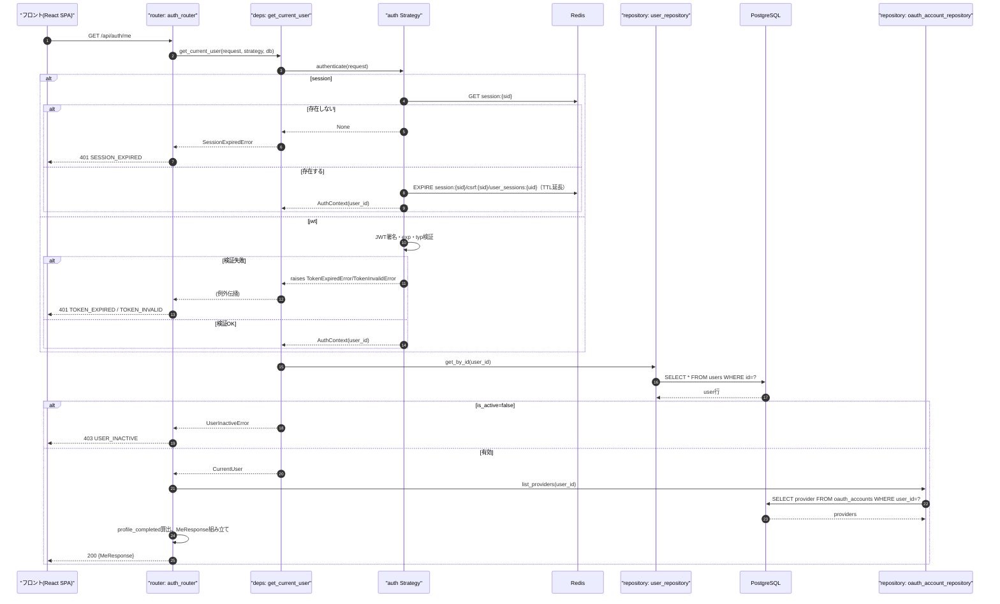
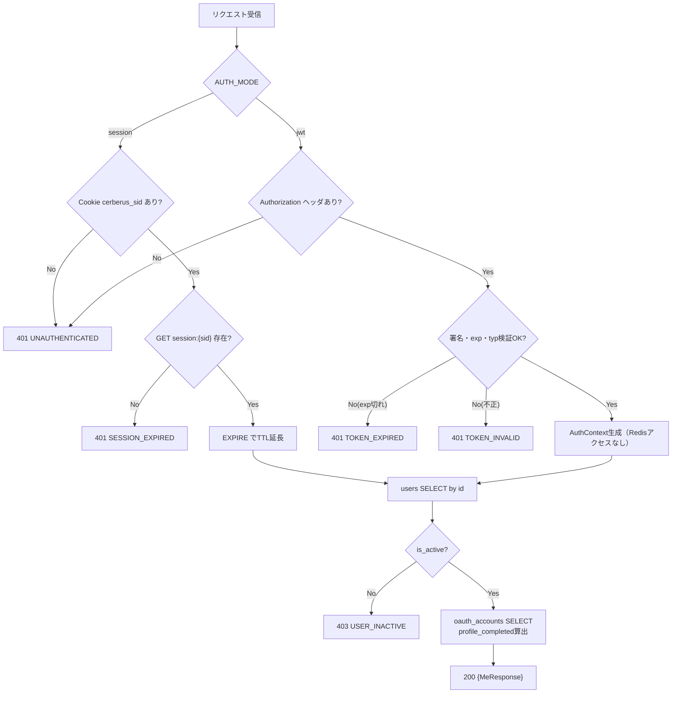
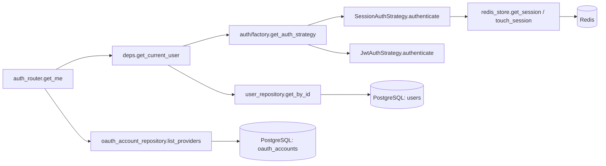
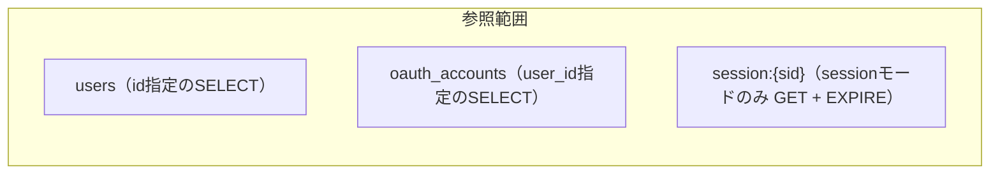

# GET /api/auth/me（現在のログインユーザー取得）

## 0. 関連ドキュメント

| ドキュメント | パス |
|--------------|------|
| API基本設計 | `../../../basic_design/04_api.md`（§3.1 レスポンス例） |
| 認証基本設計 | `../../../basic_design/03_auth.md`（§9.2 `core/deps.py`） |
| DB基本設計 | `../../../basic_design/01_database.md`（§3.1 users） |
| ログインAPI | `./02_post_auth_login.md` |
| 設定取得API | `./05_get_auth_config.md` |
| ユーザープロフィール取得API | `../users/01_get_users_me.md` |

## 1. 概要

| 項目 | 内容 |
|------|------|
| エンドポイント | `GET /api/auth/me` |
| 目的 | フロント起動時のセッション復元。現在ログイン中のユーザー情報と`auth_mode`を返す |
| 認証 | 必要（session：`cerberus_sid` Cookie／jwt：`Authorization: Bearer`） |
| 認可 | 未認証可（＝認証必須。ロール制限なし） |
| CSRF検証 | 不要（参照系メソッド`GET`のため） |
| Origin検証 | 不要（Cookieを新規発行/更新しない参照系のため。session方式でもTTL延長は行うがCookie自体は書き換えない） |
| AUTH_MODE差異 | 認証経路（Cookie/Bearer）のみ異なる。レスポンス項目・処理内容に差異なし |
| 冪等性 | あり（参照のみ） |
| レート制限 | 対象外 |
| トランザクション境界 | `users` SELECT 1件のみ（更新なし） |

## 2. 入出力仕様

### 2.1 リクエスト

パスパラメータ：なし　クエリパラメータ：なし　ボディ：なし

ヘッダ

| 名前 | 必須 | 説明 |
|------|------|------|
| `Authorization: Bearer {access_token}` | jwtモードのみ必須 | |

Cookie

| 名前 | 必須 | 説明 |
|------|------|------|
| `cerberus_sid` | sessionモードのみ必須 | |

### 2.2 レスポンス

**200 OK**（`MeResponse`）

```json
{
  "id": "3f1c...",
  "username": "taro",
  "email": "taro@example.com",
  "last_name": "山田",
  "first_name": "太郎",
  "last_name_kana": "ヤマダ",
  "first_name_kana": "タロウ",
  "birth_date": "1995-04-01",
  "profile_completed": true,
  "role": "member",
  "has_password": true,
  "oauth_providers": ["google"],
  "auth_mode": "session"
}
```

| フィールド | 型 | NULL可否 | 説明 |
|-----------|----|----------|------|
| id | string(uuid) | 不可 | |
| username | string | 不可 | |
| email | string | 不可 | |
| last_name / first_name | string | 可（OAuth新規未補完時） | |
| last_name_kana / first_name_kana | string | 可（同上） | |
| birth_date | string(date) | 可（同上） | |
| profile_completed | boolean | 不可 | 上記5項目がすべて設定済みかをサーバーで算出 |
| role | string | 不可 | `member` / `admin`。PostgreSQLの現在値（JWT/Redis内の値は使わない） |
| has_password | boolean | 不可 | `password_hash IS NOT NULL` |
| oauth_providers | string[] | 不可（空配列可） | `oauth_accounts.provider`の一覧 |
| auth_mode | string | 不可 | 現在の`AUTH_MODE`（`session`/`jwt`） |

Set-Cookieは発行しない。共通ヘッダ：`X-Request-ID`。

## 3. エラー仕様

| HTTP | code | 発生条件 | メッセージ | 備考 |
|------|------|----------|------------|------|
| 401 | `UNAUTHENTICATED` | Cookie/Bearerヘッダなし | ログインが必要です | |
| 401 | `SESSION_EXPIRED` | sessionモードでRedisに`session:{sid}`が存在しない | セッションの有効期限が切れました | |
| 401 | `TOKEN_EXPIRED` | jwtモードでaccess tokenの`exp`超過 | トークンの有効期限が切れました | フロントは`/auth/refresh`を試行 |
| 401 | `TOKEN_INVALID` | jwtモードで署名不正・`typ != 'access'` | トークンが不正です | |
| 403 | `USER_INACTIVE` | `users.is_active = false` | このアカウントは無効化されています | `get_current_user`が検出 |
| 503 | `SERVICE_UNAVAILABLE` | Redis（session時）/ PostgreSQL接続不能 | 現在サービスをご利用いただけません | fail-close |
| 500 | `INTERNAL_ERROR` | 未捕捉例外 | サーバーエラーが発生しました | |

## 4. 処理シーケンス



## 5. 処理フロー・分岐



## 6. 関数詳細

### 6.1 `api/routers/auth_router.py :: get_me`

| 項目 | 内容 |
|------|------|
| シグネチャ | `async def get_me(current_user: CurrentUser = Depends(get_current_user), db: AsyncSession = Depends(get_db), settings: Settings = Depends(get_settings)) -> MeResponse` |
| 引数 | `current_user`（DI経由で解決済み）、`db`、`settings` |
| 戻り値 | `MeResponse`（200） |
| 送出例外 | `get_current_user`から伝播する401/403系 |
| 処理内容 | 1. `current_user`をそのまま利用（既にDB取得済み） 2. `oauth_account_repository.list_providers`でproviders取得 3. `profile_completed`を5項目の非NULL判定で算出 4. `settings.auth_mode`を付与して`MeResponse`を返す |
| 副作用 | なし（参照のみ。sessionモードのTTL延長は`get_current_user`内のStrategy.authenticateで発生） |

### 6.2 `core/deps.py :: get_current_user`

| 項目 | 内容 |
|------|------|
| シグネチャ | `async def get_current_user(request: Request, strategy: AuthStrategy = Depends(get_auth_strategy), db: AsyncSession = Depends(get_db)) -> CurrentUser` |
| 引数 | `request`、`strategy`、`db` |
| 戻り値 | `CurrentUser`（`id`, `role`, `username`, `is_active`等をPostgreSQLの現在値で保持） |
| 送出例外 | `UnauthenticatedError`(401)、`SessionExpiredError`(401)、`TokenExpiredError`/`TokenInvalidError`(401)、`UserInactiveError`(403) |
| 処理内容 | 1. `strategy.authenticate(request)`を呼び`AuthContext | None`取得 2. `None`なら`UnauthenticatedError` 3. `AuthContext.user_id`から`user_repository.get_by_id`でDB行取得 4. 行が無ければ`UnauthenticatedError`（アカウント削除済み想定。本設計では物理削除APIなしのため通常発生しない） 5. `is_active=false`なら`UserInactiveError` 6. role/username/profileはDBの現在値を採用し`CurrentUser`を構築 |
| 副作用 | Strategy経由でsessionモードのみRedis `EXPIRE`（TTL延長） |

### 6.3 `auth/session_auth.py :: SessionAuthStrategy.authenticate`

| 項目 | 内容 |
|------|------|
| シグネチャ | `async def authenticate(self, request: Request) -> AuthContext | None` |
| 引数 | `request` |
| 戻り値 | `AuthContext(user_id, session_id=sid)` または `None` |
| 送出例外 | なし（Redis接続不能時は`RedisError`が伝播し503へ変換） |
| 処理内容 | 1. `_read_session_cookie(request)`でsid取得。無ければ`None` 2. `redis_store.get_session(sid)`で存在確認 3. 存在しなければ`None` 4. `redis_store.touch_session(sid, user_id, ttl=SESSION_TTL_SECONDS, absolute_expires_at)`でスライディングTTL延長（絶対期限`SESSION_ABSOLUTE_TTL_SECONDS`を超えない） 5. `AuthContext`を返す |
| 副作用 | Redis: `EXPIRE session:{sid}` / `csrf:{sid}` / `user_sessions:{uid}` |

### 6.4 `auth/jwt_auth.py :: JwtAuthStrategy.authenticate`

| 項目 | 内容 |
|------|------|
| シグネチャ | `async def authenticate(self, request: Request) -> AuthContext | None` |
| 引数 | `request` |
| 戻り値 | `AuthContext(user_id, session_id=None)` または `None` |
| 送出例外 | `TokenExpiredError` / `TokenInvalidError`（呼び出し元で401へ変換） |
| 処理内容 | 1. `Authorization`ヘッダから`Bearer `を除去してトークン取得。無ければ`None` 2. `_decode_access_token(token)`で署名・`exp`検証 3. `typ != 'access'`なら`TokenInvalidError` 4. `AuthContext(user_id=payload['sub'])`を返す（**Redisアクセスなし**） |
| 副作用 | なし |

### 6.5 `repository/oauth_account_repository.py :: list_providers`

| 項目 | 内容 |
|------|------|
| シグネチャ | `async def list_providers(db: AsyncSession, user_id: UUID) -> list[str]` |
| 引数 | `db`、`user_id` |
| 戻り値 | provider名の配列（例：`["google"]`） |
| 送出例外 | なし |
| 処理内容 | `SELECT provider FROM oauth_accounts WHERE user_id=?` |
| 副作用 | なし |

## 7. 関数相関図



## 8. データ遷移図

読み取りのみで状態遷移なし。ただしsessionモードでは`touch_session`により以下の副次的なTTL更新が発生する。



## 9. データアクセス一覧

**PostgreSQL**

| テーブル | 操作 | 条件・TTL | 備考 |
|----------|------|-----------|------|
| users | SELECT | `id = :user_id` | |
| oauth_accounts | SELECT | `user_id = :user_id` | providers一覧 |

**Redis**

| キー | 操作 | 条件・TTL | 備考 |
|------|------|-----------|------|
| `session:{sid}` | GET → EXPIRE | `SESSION_TTL_SECONDS`（絶対期限`SESSION_ABSOLUTE_TTL_SECONDS`超で延長せず） | sessionモードのみ |
| `csrf:{sid}` / `user_sessions:{uid}` | EXPIRE | 同上 | `touch_session`が同一処理で延長 |

jwtモードではRedisアクセスなし。

## 10. バリデーション規則

リクエストパラメータなし。`MeResponse`は出力専用スキーマのため入力バリデーションは無い。

| スキーマ | フィールド | 規則 |
|----------|-----------|------|
| `MeResponse` | profile_completed | `last_name`, `first_name`, `last_name_kana`, `first_name_kana`, `birth_date`のいずれも非NULLなら`true`（サーバー側で算出。フロントへの入力ではない） |

## 11. 非機能・セキュリティ考慮

| 項目 | 内容 |
|------|------|
| 監査ログ | 記録しない（頻繁に呼ばれる参照APIのため、成功時のログはDEBUGレベル以下に留める） |
| ユーザー列挙対策 | 認証済みユーザーの自己参照のみのため対象外 |
| キャッシュ | `Cache-Control: no-store`を付与（ログイン状態を含む個人情報のためブラウザ・プロキシキャッシュ禁止） |
| fail-close方針 | Redis（session時）/PostgreSQL接続不能時は503 |
| 権限情報の正 | `role`・`username`はJWTペイロードやRedisのsessionデータに含めず、常にPostgreSQLの現在値を返す（`03_auth.md` §2.2・§9.2の方針） |
| profile_completed | OAuth新規ユーザーのプロフィール未補完状態をフロントが検知するための唯一の判定材料。算出ロジックはサーバー側に一元化する |

## 12. テスト設計

| No | 区分 | ケース | 前提 | 期待結果 | pytest関数名案 |
|----|------|--------|------|----------|-----------------|
| 1 | 単体 | Cookie無し | request | `strategy.authenticate`が`None`を返す | `test_get_current_user_no_cookie_raises_unauthenticated` |
| 2 | 単体 | sessionキー無し | Redisモック | `SessionExpiredError` | `test_get_current_user_session_expired` |
| 3 | 単体 | jwt期限切れ | トークンモック | `TokenExpiredError` | `test_get_current_user_token_expired` |
| 4 | 単体 | is_active=false | user_repositoryモック | `UserInactiveError` | `test_get_current_user_inactive` |
| 5 | 単体 | profile_completed算出 | 5項目すべて非NULL | `true` | `test_me_response_profile_completed_true` |
| 6 | 単体 | profile_completed算出（未補完） | いずれかがNULL | `false` | `test_me_response_profile_completed_false` |
| 7 | 結合 | 正常系（session） | 実PostgreSQL/Redis、ログイン済み | `200`、`auth_mode=session`、TTLが延長される | `test_auth_me_endpoint_session_success` |
| 8 | 結合 | 正常系（jwt） | 実PostgreSQL、有効なaccess token | `200`、`auth_mode=jwt`、Redisアクセスが発生しないことをモニタリング | `test_auth_me_endpoint_jwt_success` |
| 9 | 結合 | 未認証 | Cookie/ヘッダなし | `401 UNAUTHENTICATED` | `test_auth_me_endpoint_unauthenticated` |
| 10 | 結合 | 無効化ユーザー | `is_active=false`のユーザーでログイン済みCookie | `403 USER_INACTIVE` | `test_auth_me_endpoint_inactive_user` |
| 11 | 結合 | OAuth新規ユーザー | プロフィール未補完 | `profile_completed=false`、`oauth_providers=["google"]` | `test_auth_me_endpoint_oauth_incomplete_profile` |

`AUTH_MODE=session`/`jwt`の両方で7・8を実施する。

## 13. 不明点・要検討事項

| 区分 | 内容 | 影響 |
|------|------|------|
| なし | | |
