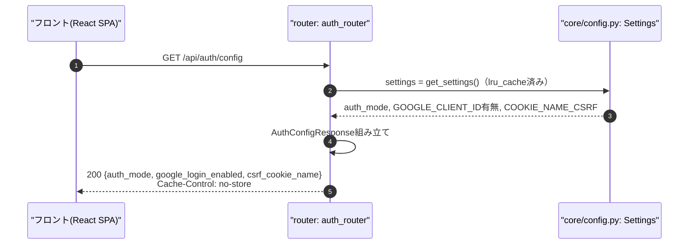
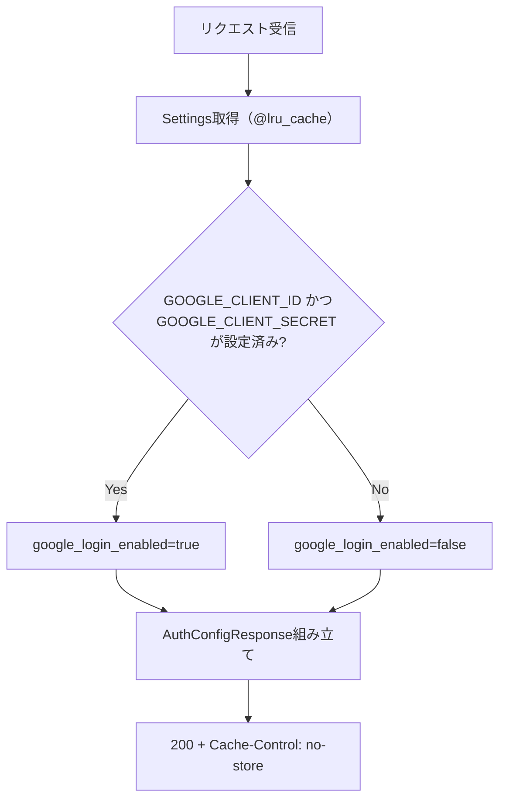
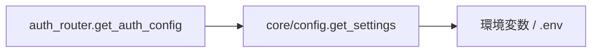

# GET /api/auth/config（フロント起動用の公開設定取得）

## 0. 関連ドキュメント

| ドキュメント | パス |
|--------------|------|
| API基本設計 | `../../../basic_design/04_api.md`（§2.1、§3.1） |
| 認証基本設計 | `../../../basic_design/03_auth.md`（§2.2 ファクトリ） |
| ログインAPI | `./02_post_auth_login.md` |
| ログイン画面 | `../../screen/01_login.md` |

## 1. 概要

| 項目 | 内容 |
|------|------|
| エンドポイント | `GET /api/auth/config` |
| 目的 | フロントが起動時に取得し、`AuthAdapter`（session用/jwt用のAPIクライアント層）を選択するための公開設定を提供する |
| 認証 | 不要 |
| 認可 | 未認証可 |
| CSRF検証 | 不要（参照系メソッド`GET`） |
| Origin検証 | 不要（Cookie・トークンを発行しない。秘密情報を含まないため任意オリジンからの参照を許容してよい） |
| AUTH_MODE差異 | `auth_mode`フィールドの値そのものが差異の表現。処理ロジックに分岐はない |
| 冪等性 | あり（副作用なし） |
| レート制限 | 対象外 |
| トランザクション境界 | なし（DB/Redisへのアクセスなし。`core/config.py`の起動時設定を返すのみ） |

## 2. 入出力仕様

### 2.1 リクエスト

パスパラメータ：なし　クエリパラメータ：なし　ヘッダ：なし　Cookie：なし（該当なし）

### 2.2 レスポンス

**200 OK**（`AuthConfigResponse`）

```json
{
  "auth_mode": "jwt",
  "google_login_enabled": true,
  "csrf_cookie_name": "cerberus_csrf"
}
```

| フィールド | 型 | NULL可否 | 説明 |
|-----------|----|----------|------|
| auth_mode | string | 不可 | `session` / `jwt`。`settings.auth_mode`（環境変数`AUTH_MODE`） |
| google_login_enabled | boolean | 不可 | `GOOGLE_CLIENT_ID`/`GOOGLE_CLIENT_SECRET`が設定されているかで判定 |
| csrf_cookie_name | string | 不可 | `COOKIE_NAME_CSRF`の値。フロントが`document.cookie`から読み取るCookie名を固定値でハードコードしないための提供 |

秘密情報（クライアントシークレット、JWT署名鍵等）は一切含めない。`Cache-Control: no-store`を付与する。

共通ヘッダ：`X-Request-ID`。

## 3. エラー仕様

| HTTP | code | 発生条件 | メッセージ | 備考 |
|------|------|----------|------------|------|
| 500 | `INTERNAL_ERROR` | 未捕捉例外（設定読み込み失敗等） | サーバーエラーが発生しました | 通常は起動時に`get_auth_strategy`が`ValueError`を送出し起動自体が失敗するため、稼働中に本APIが500を返すケースは想定しにくい |

外部ストア（Redis/PostgreSQL）に依存しないため、503（fail-close）の対象外。

## 4. 処理シーケンス



## 5. 処理フロー・分岐



## 6. 関数詳細

### 6.1 `api/routers/auth_router.py :: get_auth_config`

| 項目 | 内容 |
|------|------|
| シグネチャ | `async def get_auth_config(response: Response, settings: Settings = Depends(get_settings)) -> AuthConfigResponse` |
| 引数 | `response`（ヘッダ設定用）、`settings`（DI） |
| 戻り値 | `AuthConfigResponse`（200） |
| 送出例外 | なし（通常運用時） |
| 処理内容 | 1. `response.headers["Cache-Control"] = "no-store"`を設定 2. `settings.auth_mode`、`bool(settings.google_client_id and settings.google_client_secret)`、`settings.cookie_name_csrf`から`AuthConfigResponse`を組み立てて返す |
| 副作用 | なし（レスポンスヘッダ設定のみ） |

### 6.2 `core/config.py :: get_settings`

| 項目 | 内容 |
|------|------|
| シグネチャ | `@lru_cache def get_settings() -> Settings` |
| 引数 | なし |
| 戻り値 | `Settings`（pydantic-settingsによる環境変数バインディング済みインスタンス） |
| 送出例外 | `pydantic.ValidationError`（起動時、必須環境変数欠落時。アプリ起動自体が失敗する） |
| 処理内容 | 1. `.env`／環境変数から`AUTH_MODE`等を読み込み 2. `AUTH_MODE`が`session`/`jwt`以外なら起動時に`ValueError`（`03_auth.md` §2.2） 3. `lru_cache`により以後は同一インスタンスを返す |
| 副作用 | なし（読み取り専用の設定オブジェクト） |

## 7. 関数相関図



repository/service層は経由しない（設定値の参照のみで完結する唯一のAPI）。

## 8. データ遷移図

読み取りのみで状態遷移なし。PostgreSQL・Redisいずれも参照しない。参照範囲はプロセス内の`Settings`オブジェクト（環境変数由来）のみ。

## 9. データアクセス一覧

**PostgreSQL**：なし
**Redis**：なし

## 10. バリデーション規則

リクエストパラメータなし。`AuthConfigResponse`は出力専用スキーマのため入力バリデーションは無い。

| スキーマ | フィールド | 規則 |
|----------|-----------|------|
| `AuthConfigResponse` | auth_mode | `Literal["session", "jwt"]`（出力時点で`Settings`により保証済み） |

## 11. 非機能・セキュリティ考慮

| 項目 | 内容 |
|------|------|
| 監査ログ | 記録しない（頻繁に呼ばれる公開設定APIのため） |
| 秘密情報漏洩対策 | `google_login_enabled`は真偽値のみ返し、`GOOGLE_CLIENT_ID`等の値そのものは絶対に含めない。レスポンススキーマにフィールドを追加する際は必ずこの方針を維持する |
| キャッシュ | `Cache-Control: no-store`。`AUTH_MODE`切り替え運用時に古い設定がブラウザ・CDNにキャッシュされないようにする |
| フロントとの二重管理防止 | `basic_design/03_auth.md` §2.2の方針どおり、フロントは`VITE_AUTH_MODE`のようなビルド時定数を持たず、本APIの値のみを正とする。これによりバックエンドの`AUTH_MODE`変更時にフロントの再ビルドが不要になる |
| fail-close方針 | 外部ストアに依存しないため503は発生しない。設定読み込み自体の失敗は起動時に検出されるため、稼働中の異常系は基本的に発生しない設計 |

## 12. テスト設計

| No | 区分 | ケース | 前提 | 期待結果 | pytest関数名案 |
|----|------|--------|------|----------|-----------------|
| 1 | 単体 | Google設定ありの場合 | `settings.google_client_id`等をモック設定 | `google_login_enabled=true` | `test_auth_config_google_enabled_when_configured` |
| 2 | 単体 | Google設定なしの場合 | `settings.google_client_id=None` | `google_login_enabled=false` | `test_auth_config_google_disabled_when_missing` |
| 3 | 結合 | `AUTH_MODE=session`起動時 | 環境変数設定 | `200 {"auth_mode": "session", ...}` | `test_auth_config_endpoint_session_mode` |
| 4 | 結合 | `AUTH_MODE=jwt`起動時 | 環境変数設定 | `200 {"auth_mode": "jwt", ...}` | `test_auth_config_endpoint_jwt_mode` |
| 5 | 結合 | レスポンスヘッダ確認 | 任意モード | `Cache-Control: no-store`が付与される | `test_auth_config_endpoint_no_store_header` |
| 6 | 結合 | 秘密情報の非包含確認 | 任意モード | レスポンスボディに`GOOGLE_CLIENT_SECRET`等の文字列を含まない | `test_auth_config_endpoint_no_secret_leak` |

`AUTH_MODE`両モードでの起動を必要とするため、3・4はモードごとにアプリインスタンスを再生成するfixtureで実施する（`04_api.md` §8のパラメータ化方針に準拠）。

## 13. 不明点・要検討事項

| 区分 | 内容 | 影響 |
|------|------|------|
| なし | | |

## DBアクセス契約

本APIのDBアクセスは、下記のFN/SP呼び出しをrepositoryの薄いラッパーから実行する。テーブルへの直接CRUD、認証業務の判定、履歴のINSERTはrepositoryに実装しない。healthの `SELECT 1` だけは本契約の対象外である。

| 正式な呼び出し | 契約 |
|----------------|------|
| DBアクセスなし | `detailed_design/database/08_db_functions.md` のシグネチャに従う |

SQLSTATE P0xxxは同文書 §4 の対応表でAPIエラーへ変換し、Redis・メール・JWTの処理はAPI/service層に残す。