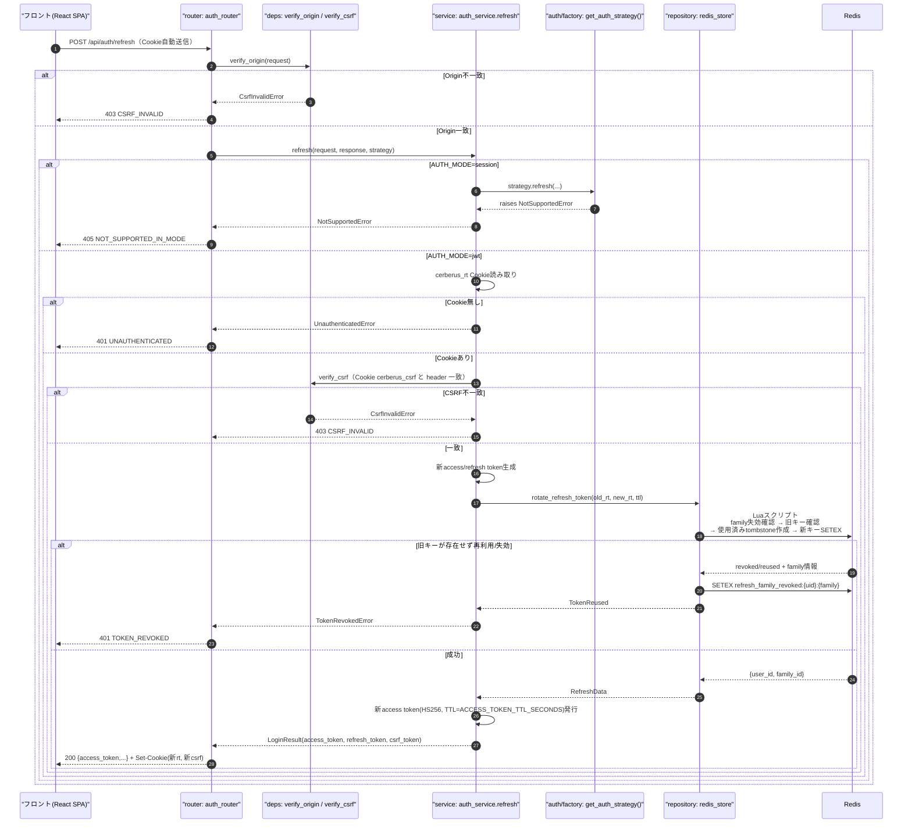
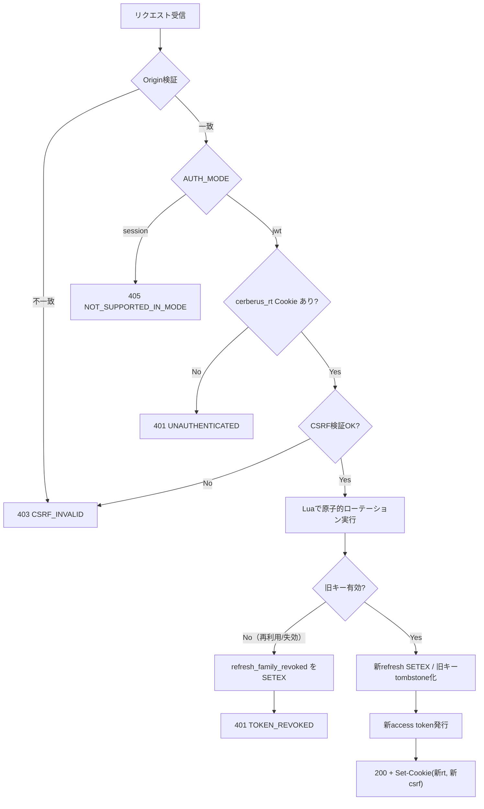
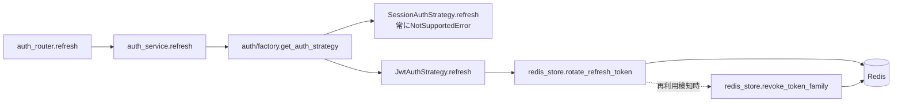
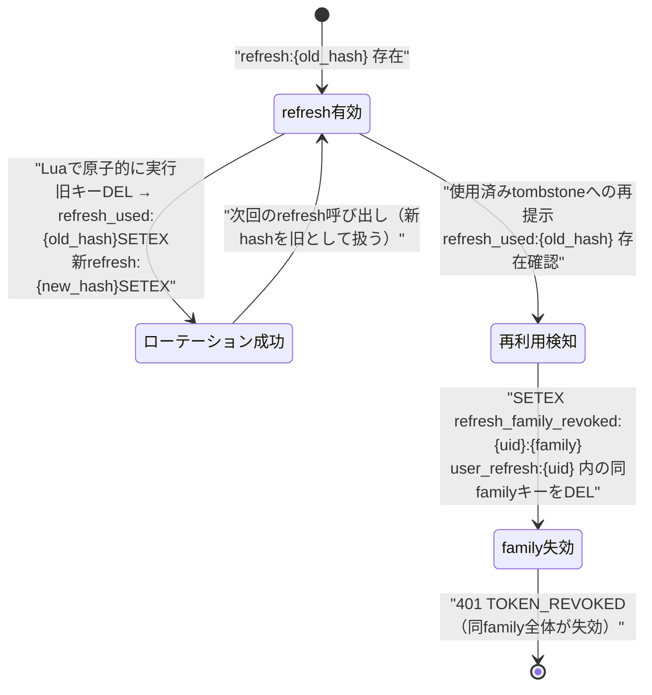

# POST /api/auth/refresh（アクセストークン再発行）

## 0. 関連ドキュメント

| ドキュメント | パス |
|--------------|------|
| API基本設計 | `../../../basic_design/04_api.md`（§2.1、§3.1、§4.2エラーコード） |
| 認証基本設計 | `../../../basic_design/03_auth.md`（§4.1〜§4.4） |
| Redis基本設計 | `../../../basic_design/02_redis.md`（§4.2 ローテーションシーケンス、§5.2 rotate_refresh_token） |
| ログインAPI | `./02_post_auth_login.md` |
| ログアウトAPI | `./03_post_auth_logout.md` |

## 1. 概要

| 項目 | 内容 |
|------|------|
| エンドポイント | `POST /api/auth/refresh` |
| 目的 | HttpOnly Cookieのリフレッシュトークンを検証し、アクセストークンとリフレッシュトークンをローテーション発行する |
| 認証 | リフレッシュCookie（`cerberus_rt`）＋CSRF（`X-CSRF-Token`とCookie`cerberus_csrf`の一致） |
| 認可 | 未認証可（リフレッシュトークン自体が認証材料） |
| CSRF検証 | 必要（`cerberus_rt`はCookieで自動送信されるため） |
| Origin検証 | 必要 |
| AUTH_MODE差異 | **jwtモードのみ提供**。sessionモードでは`405 NOT_SUPPORTED_IN_MODE`を返す |
| 冪等性 | なし（呼ぶたびに新しいリフレッシュトークンへローテーションされ、旧トークンは失効する） |
| レート制限 | 明示的な専用制限なし（要検討。§13参照） |
| トランザクション境界 | DB更新なし。Redis Luaスクリプトによる原子的ローテーションのみ |

## 2. 入出力仕様

### 2.1 リクエスト

パスパラメータ：なし　クエリパラメータ：なし　ボディ：なし（**リフレッシュトークンをボディで受け取らない**）

ヘッダ

| 名前 | 必須 | 説明 |
|------|------|------|
| `X-CSRF-Token` | ○ | Cookie`cerberus_csrf`の値と一致すること |
| `Origin` | ○（ミドルウェア検証） | |

Cookie

| 名前 | 必須 | 説明 |
|------|------|------|
| `cerberus_rt` | ○ | HttpOnly。Path=`/api/auth` |
| `cerberus_csrf` | ○ | 非HttpOnly。`X-CSRF-Token`との一致検証対象 |

### 2.2 レスポンス

**200 OK**（jwtモード成功時、`RefreshResponse`）

```json
{
  "access_token": "eyJhbGciOi...",
  "token_type": "bearer",
  "expires_in": 900
}
```

| フィールド | 型 | NULL可否 | 説明 |
|-----------|----|----------|------|
| access_token | string | 不可 | 新しいJWT |
| token_type | string | 不可 | 固定値`"bearer"` |
| expires_in | integer | 不可 | `ACCESS_TOKEN_TTL_SECONDS`（既定900） |

Set-Cookie（ローテーション後の新値）

| Cookie名 | HttpOnly | Secure | SameSite | Path | Max-Age（対応する設定項目名） |
|----------|----------|--------|----------|------|-------------------------------|
| `cerberus_rt`（`COOKIE_NAME_REFRESH`） | Yes | `COOKIE_SECURE` | `COOKIE_SAMESITE_REFRESH`（既定`Strict`） | `/api/auth` | `REFRESH_TTL_SECONDS`（既定1209600。延長ではなく再設定） |
| `cerberus_csrf`（`COOKIE_NAME_CSRF`） | No | `COOKIE_SECURE` | `COOKIE_SAMESITE`（既定`Lax`） | `/` | `REFRESH_TTL_SECONDS` |

refresh tokenの平文はJSONに含めない。共通ヘッダ：`X-Request-ID`。

**405（sessionモード）**：ボディは§3のエラー形式で`NOT_SUPPORTED_IN_MODE`を返す。

## 3. エラー仕様

| HTTP | code | 発生条件 | メッセージ | 備考 |
|------|------|----------|------------|------|
| 403 | `CSRF_INVALID` | Origin不一致 | 許可されていないOriginからのリクエストです | |
| 401 | `UNAUTHENTICATED` | `cerberus_rt` Cookieが存在しない | ログインが必要です | |
| 401 | `TOKEN_REVOKED` | 旧リフレッシュトークンが失効済み・再利用検知・family失効中 | セッションが無効になりました。再度ログインしてください | §4・§11参照 |
| 403 | `CSRF_INVALID` | `X-CSRF-Token`とCookie不一致・欠落 | CSRFトークンが正しくありません | |
| 405 | `NOT_SUPPORTED_IN_MODE` | `AUTH_MODE=session`でのアクセス | 現在の認証モードではこの操作は利用できません | `Strategy.refresh`が`NotSupportedError`を送出 |
| 503 | `SERVICE_UNAVAILABLE` | Redis接続不能 | 現在サービスをご利用いただけません | fail-close |
| 500 | `INTERNAL_ERROR` | 未捕捉例外 | サーバーエラーが発生しました | |

## 4. 処理シーケンス



## 5. 処理フロー・分岐



## 6. 関数詳細

### 6.1 `api/routers/auth_router.py :: refresh`

| 項目 | 内容 |
|------|------|
| シグネチャ | `async def refresh(request: Request, response: Response, _: None = Depends(verify_origin), strategy: AuthStrategy = Depends(get_auth_strategy)) -> RefreshResponse` |
| 引数 | `request`、`response`、`strategy` |
| 戻り値 | `RefreshResponse`（200） |
| 送出例外 | `CsrfInvalidError`(403)、`NotSupportedError`(405)、`UnauthenticatedError`(401)、`TokenRevokedError`(401) |
| 処理内容 | 1. `verify_origin`でOrigin確認 2. `auth_service.refresh(request, response, strategy)`を呼び出す 3. 結果を`RefreshResponse`として200で返す |
| 副作用 | `response`へのSet-Cookie設定 |

### 6.2 `service/auth_service.py :: refresh`

| 項目 | 内容 |
|------|------|
| シグネチャ | `async def refresh(request: Request, response: Response, strategy: AuthStrategy) -> LoginResult` |
| 引数 | `request`、`response`、`strategy` |
| 戻り値 | `LoginResult`（`access_token`等を保持） |
| 送出例外 | `strategy.refresh`からの伝播（`NotSupportedError`/`UnauthenticatedError`/`TokenRevokedError`） |
| 処理内容 | 1. `strategy.refresh(request, response)`を呼び出すのみ（モード分岐はStrategyに委譲。sessionモードのStrategyは`NotSupportedError`を送出） |
| 副作用 | Strategy内でRedis更新・Cookie設定 |

### 6.3 `auth/session_auth.py :: SessionAuthStrategy.refresh`

| 項目 | 内容 |
|------|------|
| シグネチャ | `async def refresh(self, request: Request, response: Response) -> LoginResult` |
| 引数 | `request`、`response`（未使用） |
| 戻り値 | なし（例外送出のみ） |
| 送出例外 | `NotSupportedError`（呼び出し元で405へ変換） |
| 処理内容 | 呼び出され次第即座に`NotSupportedError`を送出する（`03_auth.md` §2.1の抽象インターフェース定義どおり） |
| 副作用 | なし |

### 6.4 `auth/jwt_auth.py :: JwtAuthStrategy.refresh`

| 項目 | 内容 |
|------|------|
| シグネチャ | `async def refresh(self, request: Request, response: Response) -> LoginResult` |
| 引数 | `request`、`response` |
| 戻り値 | `LoginResult(auth_mode="jwt", access_token, refresh_token, csrf_token, expires_in)` |
| 送出例外 | `UnauthenticatedError`（Cookie無し）、`CsrfInvalidError`（CSRF不一致）、`TokenRevokedError`（再利用検知・失効済み） |
| 処理内容 | 1. Cookie`cerberus_rt`取得。無ければ`UnauthenticatedError` 2. CSRF Cookie/ヘッダ一致確認 3. `new_refresh = token_urlsafe(48)`を生成 4. `redis_store.rotate_refresh_token(old_rt, new_refresh, ttl=REFRESH_TTL_SECONDS)`を呼ぶ 5. 戻り値が`TokenReused`なら`redis_store.revoke_token_family`が内部で発火済みのため`TokenRevokedError`を送出 6. 成功なら`_issue_tokens`相当で新access tokenを発行（`family_id`は継続） 7. 新しい`csrf_token`を生成 8. `response.set_cookie`で`cerberus_rt`・`cerberus_csrf`を新値で再設定（延長ではなく再設定） |
| 副作用 | Redis: 旧`refresh:{hash}`の使用済み化、`refresh_used:{old_hash}`作成、新`refresh:{new_hash}`作成、`user_refresh:{uid}`更新。Cookie再発行 |

### 6.5 `repository/redis_store.py :: rotate_refresh_token`

| 項目 | 内容 |
|------|------|
| シグネチャ | `async def rotate_refresh_token(old_token: str, new_token: str, ttl: int) -> RefreshData | TokenReused` |
| 引数 | `old_token`（平文）、`new_token`（平文）、`ttl` |
| 戻り値 | 成功時`RefreshData(user_id, family_id)`、再利用検知時`TokenReused(user_id, family_id)` |
| 送出例外 | `RedisError`（503へ変換） |
| 処理内容 | Luaスクリプトで以下を原子的に実行：1. `refresh_family_revoked:{uid}:{family}`の存在確認（存在すれば即`TokenReused`相当を返す） 2. `refresh:{sha256(old_token)}`の存在確認 3. 存在すれば`DEL`し`refresh_used:{old_hash}`をtombstoneとして`SETEX`（TTL=`REFRESH_TTL_SECONDS`） 4. `refresh:{sha256(new_token)}`を`SETEX`、`user_refresh:{uid}`を`SADD`/`EXPIRE` 5. 旧キーが存在しない場合は`refresh_used:{old_hash}`を確認し、あれば`family_id`を特定して`TokenReused`を返す |
| 副作用 | Redis: 上記キー群の作成・削除 |

### 6.6 `repository/redis_store.py :: revoke_token_family`

| 項目 | 内容 |
|------|------|
| シグネチャ | `async def revoke_token_family(user_id: UUID, family_id: str) -> int` |
| 引数 | `user_id`、`family_id` |
| 戻り値 | 失効させた件数 |
| 送出例外 | `RedisError` |
| 処理内容 | 1. `SETEX refresh_family_revoked:{uid}:{family}`（TTL=`REFRESH_TTL_SECONDS`） 2. `SMEMBERS user_refresh:{uid}`を走査し、`family_id`一致かつ有効なキーを`DEL` |
| 副作用 | Redis: family失効マーカー作成、該当refreshキー削除 |

## 7. 関数相関図



## 8. データ遷移図



## 9. データアクセス一覧

**PostgreSQL**：なし（本APIはDBを参照・更新しない）

**Redis**

| キー | 操作 | 条件・TTL | 備考 |
|------|------|-----------|------|
| `refresh_family_revoked:{uid}:{family}` | GET（確認）/ SETEX（再利用検知時） | `REFRESH_TTL_SECONDS` | family全体の失効判定 |
| `refresh:{old_hash}` | 存在確認 → DEL | - | ローテーション対象 |
| `refresh_used:{old_hash}` | SETEX | `REFRESH_TTL_SECONDS` | 使用済みtombstone |
| `refresh:{new_hash}` | SETEX | `REFRESH_TTL_SECONDS`（発行時点から再設定） | 新トークン |
| `user_refresh:{uid}` | SADD / EXPIRE（成功時）、SMEMBERS走査 + DEL（family失効時） | `REFRESH_TTL_SECONDS` | 有効トークン集合の更新 |

## 10. バリデーション規則

リクエストボディを持たないため入力スキーマはない。Cookie/ヘッダの形式検証のみ行う。

| 検証対象 | 規則 |
|----------|------|
| `cerberus_rt` Cookie | 存在確認のみ（値自体はハッシュ化して照合するため形式検証は行わない） |
| `X-CSRF-Token`ヘッダ | Cookie`cerberus_csrf`値との`secrets.compare_digest`による一致確認 |

## 11. 非機能・セキュリティ考慮

| 項目 | 内容 |
|------|------|
| 監査ログ | 構造化ログに`event=token_refresh`, `result`(success/revoked), `family_id`, `request_id`をINFO出力。`login_history`への記録は行わない（基本設計にリフレッシュの監査ログ記録指示なし。要検討として§13に記載） |
| 再利用検知 | `rotate_refresh_token`をLuaスクリプトで原子的に実行することで、同時に2つのリクエストが同一旧トークンでローテーションを試みても片方のみ成功する（競合テストで検証。`02_redis.md` §7） |
| family失効の波及 | 再利用検知時は`family_id`単位で全リフレッシュトークンを失効させる。これにより攻撃者と正規ユーザーの双方が再ログインを強制される（学習上の意図的なトレードオフ） |
| CSRF/Origin検証 | `cerberus_rt`がCookieで自動送信されるため必須（`03_auth.md` §4.4） |
| fail-close方針 | Redis接続不能時は503（ローテーション可否を判定できないため） |
| access token即時失効不可 | 本APIで発行された新access tokenも、ログアウト・無効化時にRedis denylistで即時失効させる仕組みは採用しない（`03_auth.md` §4.5と同じ設計方針） |

## 12. テスト設計

| No | 区分 | ケース | 前提 | 期待結果 | pytest関数名案 |
|----|------|--------|------|----------|-----------------|
| 1 | 単体 | sessionモードでの呼び出し | Strategy=SessionAuthStrategy | `NotSupportedError`送出 | `test_refresh_session_strategy_not_supported` |
| 2 | 単体 | jwt：正常系 | redis_storeモックが`RefreshData`返却 | 新しい`access_token`/Cookieが設定される | `test_refresh_jwt_strategy_success` |
| 3 | 単体 | jwt：Cookie無し | request | `UnauthenticatedError` | `test_refresh_jwt_strategy_no_cookie` |
| 4 | 単体 | jwt：CSRF不一致 | ヘッダとCookieが異なる | `CsrfInvalidError` | `test_refresh_jwt_strategy_csrf_mismatch` |
| 5 | 単体 | jwt：再利用検知 | redis_storeモックが`TokenReused`返却 | `TokenRevokedError` | `test_refresh_jwt_strategy_token_reused` |
| 6 | 結合 | `AUTH_MODE=session`でのアクセス | 実アプリ（sessionモード起動） | `405 NOT_SUPPORTED_IN_MODE` | `test_refresh_endpoint_session_mode_returns_405` |
| 7 | 結合 | `AUTH_MODE=jwt`正常系 | 実Redis、ログイン済み | `200`、新`cerberus_rt`/`cerberus_csrf`Cookie、旧refreshキーが失効 | `test_refresh_endpoint_jwt_success_rotates_token` |
| 8 | 結合 | ローテーション後に旧トークンが401 | 7の後に旧Cookieで再度呼び出し | `401 TOKEN_REVOKED` | `test_refresh_endpoint_old_token_after_rotation_rejected` |
| 9 | 結合 | 再利用検知でfamily全失効 | 旧トークンを2回使用 | 2回目が`401 TOKEN_REVOKED`、同familyの他トークンも失効 | `test_refresh_endpoint_reuse_revokes_family` |
| 10 | 結合 | 競合：同時2リクエスト | 同一refresh tokenで`asyncio.gather`により同時実行 | 成功が1回だけ、2回目はfamily失効マーカーが設定される | `test_refresh_endpoint_concurrent_rotation_only_one_succeeds` |
| 11 | 結合 | CSRFヘッダ欠落 | Cookieはあるがヘッダ無し | `403 CSRF_INVALID` | `test_refresh_endpoint_missing_csrf_header` |
| 12 | 結合 | Origin不一致 | 許可外Origin | `403 CSRF_INVALID` | `test_refresh_endpoint_invalid_origin` |

sessionモードは6の405確認のみで足り、それ以外の異常系（CSRF・再利用検知等）はjwtモード固有の機能のためjwtモードのみで実施する（`AUTH_MODE`両モードでの網羅パラメータ化は本APIの性質上不要と判断）。

## 13. 不明点・要検討事項

| 区分 | 内容 | 影響 |
|------|------|------|
| 要検討 | `/auth/refresh`専用のレート制限（総当たり的な連続呼び出し対策）が基本設計に明記されていない | リフレッシュエンドポイントへの過剰リクエストに対する耐性が不明確 |
| 要検討 | リフレッシュ成功・再利用検知を`login_history`（または別テーブル）に記録するかが基本設計に未記載（`01_database.md` §3.7の注記では「security_eventsテーブルは追加しない」とあり、記録しない方針と解釈した） | 監査要件が生じた場合はテーブル追加を含む基本設計側の変更が必要 |

## DBアクセス契約

本APIのDBアクセスは、下記のFN/SP呼び出しをrepositoryの薄いラッパーから実行する。テーブルへの直接CRUD、認証業務の判定、履歴のINSERTはrepositoryに実装しない。healthの `SELECT 1` だけは本契約の対象外である。

| 正式な呼び出し | 契約 |
|----------------|------|
| DBアクセスなし（Redis/JWTのみ） | `detailed_design/database/08_db_functions.md` のシグネチャに従う |

SQLSTATE P0xxxは同文書 §4 の対応表でAPIエラーへ変換し、Redis・メール・JWTの処理はAPI/service層に残す。