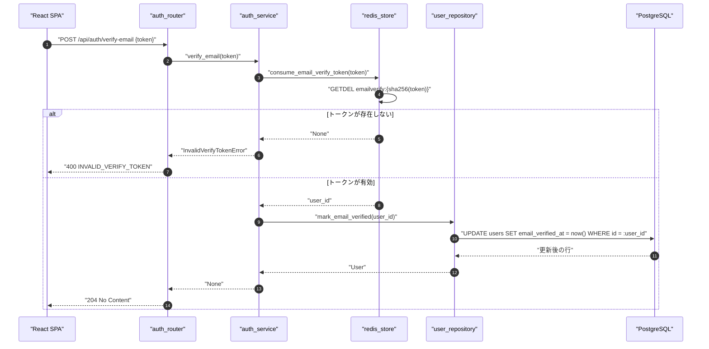
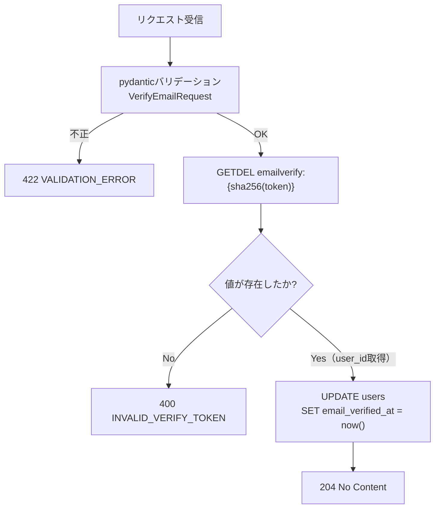
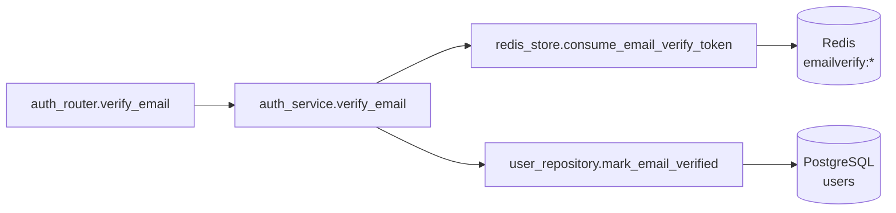
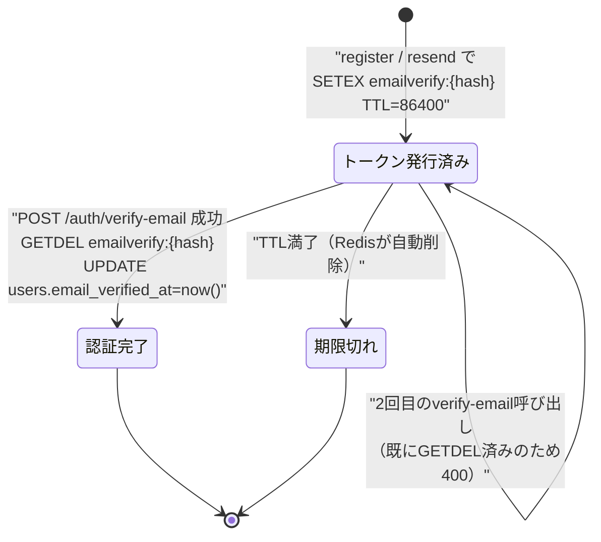

# POST /api/auth/verify-email（メール認証の実行）

## 0. 関連ドキュメント

| ドキュメント | 内容 |
|--------------|------|
| [../../../basic_design/04_api.md](../../../basic_design/04_api.md) | §2.1 エンドポイント一覧、§3.1 スキーマ、§4 エラー設計 |
| [../../../basic_design/03_auth.md](../../../basic_design/03_auth.md) | §6 会員登録とメール認証、§6.1 シーケンス |
| [../../../basic_design/02_redis.md](../../../basic_design/02_redis.md) | §2 キー一覧（`emailverify:*`）、§5.3 `consume_email_verify_token` |
| [../../auth/06_token_mail.md](../../auth/06_token_mail.md) | メール認証・パスワードリセットトークンとメール送信の詳細設計 |
| [../../auth/08_redis_store.md](../../auth/08_redis_store.md) | `redis_store.py` 関数詳細 |
| [../../database/01_table_users.md](../../database/01_table_users.md) | `users.email_verified_at` |
| [./01_post_auth_register.md](./01_post_auth_register.md) | 会員登録API（トークン発行元） |
| [./08_post_auth_verify_email_resend.md](./08_post_auth_verify_email_resend.md) | 認証メール再送API |
| [../../screen/05_verify_email.md](../../screen/05_verify_email.md) | メール認証画面 |

## 1. 概要

| 項目 | 内容 |
|------|------|
| エンドポイント | `POST /api/auth/verify-email` |
| 目的 | 会員登録時または再送時に発行されたメール認証トークンを検証し、`users.email_verified_at` を確定させる |
| 認証 | 不要 |
| 認可 | 未認証可（誰でも呼べるが、有効なトークンを知っている者のみ成功する） |
| CSRF検証 | 不要（Cookieセッションを前提としない、トークン自体が一度きりの認可情報のため） |
| Origin検証 | 不要（Cookieを発行・利用しないため対象外。`basic_design/04_api.md` §1のOrigin検証対象に含まれない） |
| AUTH_MODE差異 | 差異なし（session/jwtいずれのモードでも同一処理） |
| 冪等性 | **なし**。トークンは `GETDEL` によりワンタイム消費されるため、2回目のリクエストは同一トークンでも `400 INVALID_VERIFY_TOKEN` になる |
| レート制限 | `verify-email` はIP単位で10回/900秒。超過時は429 `TOO_MANY_ATTEMPTS`（`Retry-After`付き）、Redis障害時は503 `SERVICE_UNAVAILABLE` |
| トランザクション境界 | `UPDATE users SET email_verified_at = now()` の1文のみ。Redisのトークン消費とPostgreSQL更新はアプリケーションレベルで直列実行し、DBトランザクションでは1テーブルの単純更新のため明示的なトランザクション制御は不要 |

## 2. 入出力仕様（全体の出入力）

### 2.1 リクエスト

パスパラメータ／クエリパラメータ／ヘッダ／Cookie：なし

ボディ（`application/json`）

| 名前 | 型 | 必須 | 制約 | 説明 |
|------|----|------|------|------|
| token | string | ○ | 1文字以上（`token_urlsafe(32)` で生成された値を想定するが、サーバー側で長さ上限は設けず文字列として受け取る） | メール内リンクの `#token=...` から抽出した認証トークン |

### 2.2 レスポンス

**`204 No Content`**：認証完了。ボディなし。フロントはログイン画面へ遷移する。

**`400 INVALID_VERIFY_TOKEN`**

```json
{
  "error": {
    "code": "INVALID_VERIFY_TOKEN",
    "message": "認証リンクが無効か、有効期限が切れています",
    "details": null,
    "request_id": "01J..."
  }
}
```

| フィールド | 型 | NULL可否 | 説明 |
|-----------|----|----------|------|
| error.code | string | 不可 | `INVALID_VERIFY_TOKEN` 固定 |
| error.message | string | 不可 | ユーザー向けメッセージ |
| error.details | null | 可 | このAPIでは常に `null` |
| error.request_id | string | 不可 | リクエスト相関ID |

**`422 VALIDATION_ERROR`**：`token` が未指定・空文字の場合。`basic_design/04_api.md` §4.1 の共通形式に従う。

Set-Cookie：発行しない。

共通ヘッダ：全レスポンスに `X-Request-ID` を付与する（`basic_design/04_api.md` §1）。

## 3. エラー仕様

| HTTP | code | 発生条件 | メッセージ | 備考 |
|------|------|----------|------------|------|
| 400 | `INVALID_VERIFY_TOKEN` | Redis `emailverify:{sha256(token)}` が存在しない（未発行・期限切れ・使用済み） | 認証リンクが無効か、有効期限が切れています | 既に認証済みのトークンを再度開いた場合もここに該当する |
| 422 | `VALIDATION_ERROR` | `token` フィールド欠落・空文字 | 入力内容に誤りがあります | pydantic バリデーション |
| 503 | `SERVICE_UNAVAILABLE` | Redis / PostgreSQL 接続不能 | サービスが一時的に利用できません | fail-close（`basic_design/02_redis.md` §6） |

`basic_design/04_api.md` §4.2 のエラーコード体系から逸脱しない。

## 4. 処理シーケンス



## 5. 処理フロー・分岐



認証・認可の分岐は存在しない（未認証で呼び出し可能なエンドポイントのため）。

## 6. 関数詳細

### 6.1 `api/routers/auth_router.py :: verify_email`

| 項目 | 内容 |
|------|------|
| シグネチャ | `async def verify_email(payload: VerifyEmailRequest, service: AuthService = Depends(get_auth_service)) -> Response` |
| 引数 | `payload: VerifyEmailRequest`（リクエストボディ）、`service: AuthService`（DI） |
| 戻り値 | `Response`（`204 No Content`） |
| 送出例外 | なし（`service.verify_email` が送出した `InvalidVerifyTokenError` はグローバル例外ハンドラで400に変換） |
| 処理内容 | 1. `service.verify_email(payload.token)` を呼び出す 2. 成功時は `Response(status_code=204)` を返す |
| 副作用 | なし（副作用は service 層に委譲） |

### 6.2 `service/auth_service.py :: verify_email`

| 項目 | 内容 |
|------|------|
| シグネチャ | `async def verify_email(token: str) -> None` |
| 引数 | `token: str`（メールリンクのトークン） |
| 戻り値 | `None` |
| 送出例外 | `InvalidVerifyTokenError`（HTTP 400） |
| 処理内容 | 1. `redis_store.consume_email_verify_token(token)` を呼び user_id を取得 2. `None` の場合は `InvalidVerifyTokenError` を送出 3. `user_repository.mark_email_verified(user_id)` を呼ぶ |
| 副作用 | Redis：`emailverify:{hash}` の削除（`GETDEL` の副作用）。PostgreSQL：`users.email_verified_at` 更新 |

### 6.3 `repository/redis_store.py :: consume_email_verify_token`

| 項目 | 内容 |
|------|------|
| シグネチャ | `async def consume_email_verify_token(token: str) -> UUID \| None` |
| 引数 | `token: str`（平文トークン） |
| 戻り値 | `UUID`（該当ユーザーID）または `None`（無効・期限切れ） |
| 送出例外 | なし（Redis接続不能時は `RedisError` を送出し `infra_error_handler` が503に変換） |
| 処理内容 | 1. `hash = sha256(token).hexdigest()` を計算 2. `GETDEL emailverify:{hash}` を実行 3. 値が存在すれば JSON をデコードし `user_id` を返す |
| 副作用 | Redis：キー `emailverify:{hash}` を削除（ワンタイム消費）。`emailverify_current:{user_id}` はこの関数では削除しない（登録・再送時に上書きされるため、GETDELの成否と無関係に残存し得る＝要検討） |

### 6.4 `repository/user_repository.py :: mark_email_verified`

| 項目 | 内容 |
|------|------|
| シグネチャ | `async def mark_email_verified(user_id: UUID) -> User` |
| 引数 | `user_id: UUID` |
| 戻り値 | 更新後の `User` |
| 送出例外 | `NotFoundError`（対象ユーザーが存在しない場合。通常はトークン発行時に存在確認済みのため理論上発生しないが防御的に扱う） |
| 処理内容 | 1. `UPDATE users SET email_verified_at = now() WHERE id = :user_id RETURNING *` を実行 2. 行が取得できなければ `NotFoundError` |
| 副作用 | PostgreSQL：`users` テーブル1行の更新 |

## 7. 関数相関図



## 8. データ遷移図



`users` テーブルの状態遷移：`email_verified_at IS NULL`（未認証）→ `email_verified_at = now()`（認証済み）の一方向遷移であり、このAPIによって未認証へ戻ることはない。

## 9. データアクセス一覧

| ストア | テーブル／キー | 操作 | 条件・TTL | 備考 |
|--------|----------------|------|-----------|------|
| Redis | `emailverify:{sha256(token)}` | `GETDEL` | TTL `EMAIL_VERIFY_TTL_SECONDS`（既定86400） | ワンタイム消費。値は `{user_id, requested_at}` |
| PostgreSQL | `users` | `UPDATE` | `WHERE id = :user_id` | `email_verified_at = now()` のみを更新 |

`emailverify_current:{user_id}` はこのAPIでは読み書きしない（register/resend側の管理対象）。

## 10. バリデーション規則

| フィールド | pydanticスキーマ | 制約 | フロント（zod）との整合 |
|-----------|-------------------|------|--------------------------|
| token | `VerifyEmailRequest.token` | `str`、`min_length=1` | フロントは `#token=...` fragment から抽出した文字列をそのまま送信し、空文字ならAPI呼び出し自体を行わずエラー表示する（`z.string().min(1)`） |

## 11. 非機能・セキュリティ考慮

| 観点 | 内容 |
|------|------|
| 監査ログ | 認証成功時に `user_id` をINFOログに出力する。トークン平文はログに出力しない（`basic_design/03_auth.md` §7.2 と同方針をメール認証にも適用） |
| ユーザー列挙対策 | このAPIはメールアドレスを受け取らないため列挙リスクはない。エラー応答は「無効・期限切れ・使用済み」を区別せず一律 `INVALID_VERIFY_TOKEN` とする |
| タイミング攻撃対策 | `GETDEL` はキー存在確認と削除が単一Redisコマンドで完結するため、時間差による存在有無の推測余地は小さい。ハッシュ比較自体はRedis側のキー一致判定でありアプリ側でのタイミングセーフ比較は不要 |
| レート制限 | `verify-email` はIP単位で10回/900秒。トークンの高エントロピー性に加えて汎用IP制限を適用する |
| fail-close方針 | Redis/PostgreSQL接続不能時は `503 SERVICE_UNAVAILABLE` を返す（`basic_design/02_redis.md` §6） |
| 冪等性の非提供 | 2回目のリクエストは意図的に失敗させる（ワンタイム消費の設計要件）。フロントは400時に「既に認証済みの可能性があります」と案内する（`basic_design/03_auth.md` §6.1 末尾） |

## 12. テスト設計

| No | 区分 | ケース | 前提 | 期待結果 | pytest関数名案 |
|----|------|--------|------|----------|-----------------|
| 1 | 単体（モック） | 有効なトークンで認証成功 | `redis_store.consume_email_verify_token` が `user_id` を返すようモック | `user_repository.mark_email_verified` が呼ばれ204相当が返る | `test_verify_email_service_success` |
| 2 | 単体（モック） | 無効なトークン | `consume_email_verify_token` が `None` を返す | `InvalidVerifyTokenError` 送出 | `test_verify_email_service_invalid_token` |
| 3 | 結合（実Redis/PostgreSQL） | 会員登録直後のトークンで認証成功 | `register` 実行済み、`emailverify:*` キー存在 | `204`、`users.email_verified_at` が `NOT NULL` に更新 | `test_verify_email_endpoint_success` |
| 4 | 結合（実Redis/PostgreSQL） | 同一トークンを2回送信 | 1回目成功済み | 2回目は `400 INVALID_VERIFY_TOKEN` | `test_verify_email_endpoint_reuse_rejected` |
| 5 | 結合 | 存在しないトークン | ランダム文字列 | `400 INVALID_VERIFY_TOKEN` | `test_verify_email_endpoint_unknown_token` |
| 6 | 結合 | `token` 未指定 | ボディ空 | `422 VALIDATION_ERROR` | `test_verify_email_endpoint_missing_token` |
| 7 | 結合 | 認証後にログイン可能になること | 認証完了後に `POST /auth/login` | ログイン成功（`EMAIL_NOT_VERIFIED` が発生しない） | `test_verify_email_then_login_success` |

このAPIは `AUTH_MODE` に依存しないため、session/jwt両モードでの重複実施は不要（1系統のみ実施）。TTL満了ケース（24時間経過）は実時間待機が非現実的なため、Redisの短TTL上書き設定を用いた単体テスト（No.2相当のモック）で代替し、実TTLの実測は行わない。

## 13. 不明点・要検討事項

| 区分 | 内容 | 影響 |
|------|------|------|
| 要検討 | `emailverify_current:{user_id}` の後始末：`verify_email` 成功後もキーが残存する（TTL失効まで）。実害はないが、認証済みユーザーに対する不要な逆引きキーが残る点の要否 | 低（TTL失効で自然解消するため機能影響なし） |
| 確定 | トークン検証にもIP単位10回/900秒の汎用レート制限を適用する | 総当たり時は429、Redis障害時は503で安全側に停止する |
