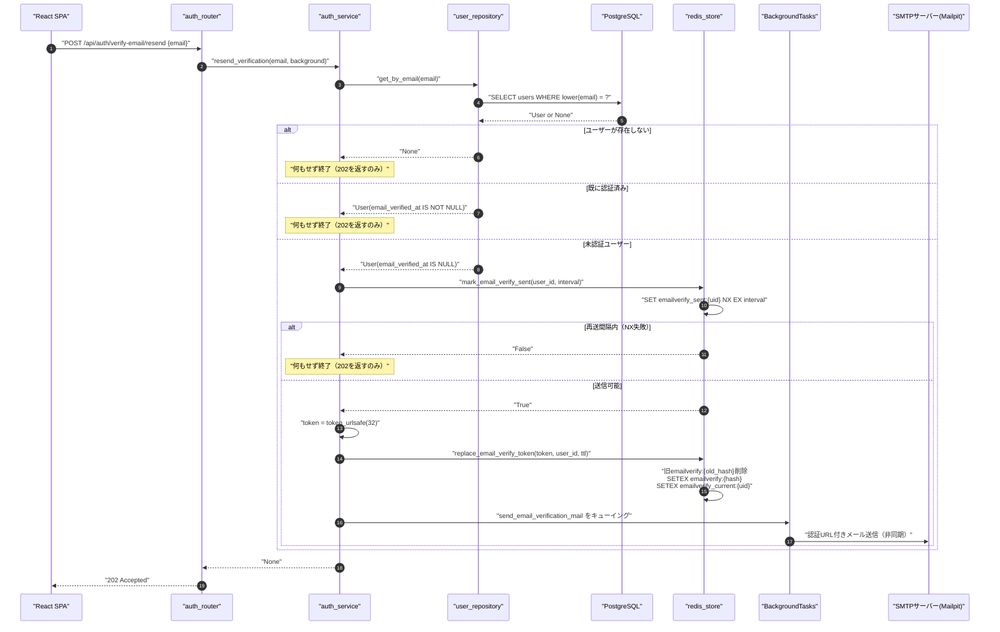
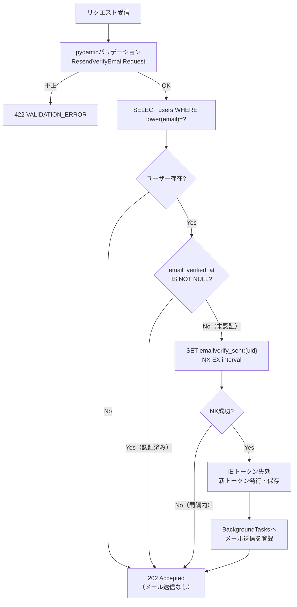
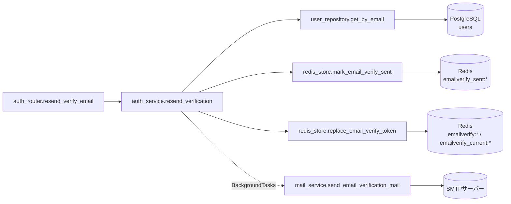
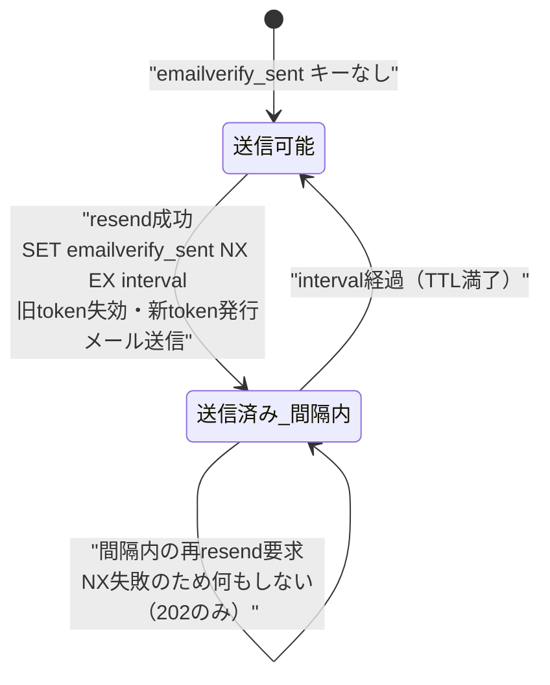

# POST /api/auth/verify-email/resend（認証メールの再送）

## 0. 関連ドキュメント

| ドキュメント | 内容 |
|--------------|------|
| [../../../basic_design/04_api.md](../../../basic_design/04_api.md) | §2.1 エンドポイント一覧、§3.1 スキーマ、§4 エラー設計 |
| [../../../basic_design/03_auth.md](../../../basic_design/03_auth.md) | §6.3 認証メールの再送、§6.4 登録・認証の関数 |
| [../../../basic_design/02_redis.md](../../../basic_design/02_redis.md) | §2 キー一覧（`emailverify:*` / `emailverify_current:*` / `emailverify_sent:*`） |
| [../../auth/06_token_mail.md](../../auth/06_token_mail.md) | メール認証・パスワードリセットトークンとメール送信の詳細設計 |
| [../../auth/08_redis_store.md](../../auth/08_redis_store.md) | `redis_store.py` 関数詳細（`replace_email_verify_token` / `mark_email_verify_sent`） |
| [../../database/01_table_users.md](../../database/01_table_users.md) | `users.email_verified_at` |
| [./01_post_auth_register.md](./01_post_auth_register.md) | 会員登録API（初回トークン発行元） |
| [./07_post_auth_verify_email.md](./07_post_auth_verify_email.md) | メール認証実行API |
| [../../screen/05_verify_email.md](../../screen/05_verify_email.md) | メール認証画面（再送導線） |

## 1. 概要

| 項目 | 内容 |
|------|------|
| エンドポイント | `POST /api/auth/verify-email/resend` |
| 目的 | 認証メールが届かない・期限切れになったユーザーに対し、確認メールを再送する |
| 認証 | 不要 |
| 認可 | 未認証可 |
| CSRF検証 | 不要（Cookieセッションを前提としないため） |
| Origin検証 | 不要（Cookieを発行・利用しないため`basic_design/04_api.md` §1の対象外） |
| AUTH_MODE差異 | 差異なし |
| 冪等性 | レスポンスは常に `202 Accepted` で冪等（存在有無・認証済み有無・再送間隔内であっても同一応答）。ただし**副作用**（メール送信）は冪等ではなく、再送間隔内は送信をスキップする |
| レート制限 | `emailverify_sent:{user_id}`による既定60秒間隔に加え、IP単位5回/900秒。超過時は429 `TOO_MANY_ATTEMPTS`（`Retry-After`付き）、Redis障害時は503 |
| トランザクション境界 | PostgreSQLの更新は行わない（参照のみ）。Redisのトークン差し替えは `replace_email_verify_token` 内で一連の操作として実行 |

## 2. 入出力仕様（全体の出入力）

### 2.1 リクエスト

パスパラメータ／クエリパラメータ／ヘッダ／Cookie：なし

ボディ（`application/json`）

| 名前 | 型 | 必須 | 制約 | 説明 |
|------|----|------|------|------|
| email | string | ○ | 50文字以内、メール形式 | 再送先メールアドレス（`basic_design/04_api.md` §3.1 register の email 制約と同一） |

### 2.2 レスポンス

**`202 Accepted`**

```json
{
  "message": "確認メールを送信しました。しばらくしても届かない場合は、入力内容や迷惑メールフォルダをご確認ください。"
}
```

| フィールド | 型 | NULL可否 | 説明 |
|-----------|----|----------|------|
| message | string | 不可 | ユーザー向け固定メッセージ。存在有無・認証済み有無を問わず同一文言 |

存在しないメールアドレス・既に認証済みのメールアドレス・再送間隔内のリクエストのいずれであっても、**同一のレスポンス**を返す（ユーザー列挙対策）。

**`422 VALIDATION_ERROR`**：`email` 形式不正・未指定の場合（`basic_design/04_api.md` §4.1 の共通形式）。

Set-Cookie：発行しない。

共通ヘッダ：全レスポンスに `X-Request-ID` を付与する。

## 3. エラー仕様

| HTTP | code | 発生条件 | メッセージ | 備考 |
|------|------|----------|------------|------|
| 422 | `VALIDATION_ERROR` | `email` 未指定・形式不正 | 入力内容に誤りがあります | pydantic バリデーション。フォーマット自体は検証するが、存在有無は判定材料にしない |
| 503 | `SERVICE_UNAVAILABLE` | Redis / PostgreSQL 接続不能 | サービスが一時的に利用できません | fail-close |

このAPIは仕様上 **401/403/404/409 系のエラーコードを一切返さない**（ユーザー列挙対策のため、内部で発生した「ユーザー不存在」「既に認証済み」「再送間隔内」は全て `202` に丸める）。`basic_design/04_api.md` §4.2 のエラーコード体系から逸脱しない。

## 4. 処理シーケンス



## 5. 処理フロー・分岐



分岐の結果に関わらず最終応答は常に `202`。認証・認可チェックは存在しない。

## 6. 関数詳細

### 6.1 `api/routers/auth_router.py :: resend_verify_email`

| 項目 | 内容 |
|------|------|
| シグネチャ | `async def resend_verify_email(payload: ResendVerifyEmailRequest, background: BackgroundTasks, service: AuthService = Depends(get_auth_service)) -> ResendVerifyEmailResponse` |
| 引数 | `payload: ResendVerifyEmailRequest`、`background: BackgroundTasks`（FastAPI標準DI）、`service: AuthService` |
| 戻り値 | `ResendVerifyEmailResponse`（`202`、固定メッセージ） |
| 送出例外 | なし（service層は例外を送出しない設計） |
| 処理内容 | 1. `service.resend_verification(payload.email, background)` を呼ぶ 2. 常に固定メッセージを含むレスポンスを返す |
| 副作用 | なし（副作用は service 層に委譲） |

### 6.2 `service/auth_service.py :: resend_verification`

| 項目 | 内容 |
|------|------|
| シグネチャ | `async def resend_verification(email: str, background: BackgroundTasks) -> None` |
| 引数 | `email: str`、`background: BackgroundTasks` |
| 戻り値 | `None`（例外を送出せず、常に正常終了） |
| 送出例外 | なし。ユーザー不存在・認証済み・再送間隔内はいずれも早期 `return` で処理を終える |
| 処理内容 | 1. `user_repository.get_by_email(email)` でユーザー取得。`None` なら終了 2. `user.email_verified_at IS NOT NULL` なら終了 3. `redis_store.mark_email_verify_sent(user.id, interval)` が `False`（間隔内）なら終了 4. `token = secrets.token_urlsafe(32)` を生成 5. `redis_store.replace_email_verify_token(token, user.id, ttl)` で旧token失効＋新token登録 6. `background.add_task(mail_service.send_email_verification_mail, user.email, token, expires_hours)` を登録 |
| 副作用 | Redis：`emailverify_sent:{uid}` 新規作成、`emailverify:{old_hash}` 削除、`emailverify:{new_hash}` 作成、`emailverify_current:{uid}` 更新。メール：`BackgroundTasks` 経由で非同期送信（失敗してもレスポンスには影響しない） |

### 6.3 `repository/user_repository.py :: get_by_email`

| 項目 | 内容 |
|------|------|
| シグネチャ | `async def get_by_email(email: str) -> User \| None` |
| 引数 | `email: str` |
| 戻り値 | `User` または `None` |
| 送出例外 | なし |
| 処理内容 | 1. `SELECT * FROM users WHERE lower(email) = lower(:email)` を実行 2. 行があれば `User` へマッピング、なければ `None` |
| 副作用 | なし（参照のみ） |

### 6.4 `repository/redis_store.py :: mark_email_verify_sent`

| 項目 | 内容 |
|------|------|
| シグネチャ | `async def mark_email_verify_sent(user_id: UUID, interval: int) -> bool` |
| 引数 | `user_id: UUID`、`interval: int`（`EMAIL_VERIFY_RESEND_INTERVAL_SECONDS`） |
| 戻り値 | `bool`（`True`＝送信可能・キー新規作成成功、`False`＝間隔内） |
| 送出例外 | なし（Redis接続不能時は `RedisError`） |
| 処理内容 | 1. `SET emailverify_sent:{user_id} <now> NX EX interval` を実行 2. コマンドの成否をそのまま返す |
| 副作用 | Redis：`emailverify_sent:{user_id}` を条件付きで作成 |

### 6.5 `repository/redis_store.py :: replace_email_verify_token`

| 項目 | 内容 |
|------|------|
| シグネチャ | `async def replace_email_verify_token(token: str, user_id: UUID, ttl: int) -> None` |
| 引数 | `token: str`（新トークン平文）、`user_id: UUID`、`ttl: int`（`EMAIL_VERIFY_TTL_SECONDS`） |
| 戻り値 | `None` |
| 送出例外 | なし（Redis接続不能時は `RedisError`） |
| 処理内容 | 1. `emailverify_current:{user_id}` から旧 `token_hash` を取得 2. 存在すれば `emailverify:{old_hash}` を削除 3. `new_hash = sha256(token)` を計算 4. `SETEX emailverify:{new_hash}` と `SETEX emailverify_current:{user_id}` を実行（Luaまたは同一パイプラインで原子的に実行し、同時再送リクエストによる不整合を避ける） |
| 副作用 | Redis：`emailverify:{old_hash}` 削除、`emailverify:{new_hash}` 作成、`emailverify_current:{user_id}` 更新 |

### 6.6 `service/mail_service.py :: send_email_verification_mail`

| 項目 | 内容 |
|------|------|
| シグネチャ | `async def send_email_verification_mail(to: str, token: str, expires_hours: int) -> None` |
| 引数 | `to: str`、`token: str`、`expires_hours: int`（`EMAIL_VERIFY_TTL_SECONDS // 3600`） |
| 戻り値 | `None` |
| 送出例外 | なし（内部で例外を捕捉しログに記録するのみ。`basic_design/03_auth.md` §7.2） |
| 処理内容 | 1. `email_verification.html` / `.txt` テンプレートをレンダリング（URLは `{FRONTEND_BASE_URL}/verify-email#token=...`） 2. `aiosmtplib` で SMTP 送信 3. 失敗時はログに記録するのみ |
| 副作用 | 外部：SMTPサーバーへのメール送信（開発環境はMailpit） |

## 7. 関数相関図



## 8. データ遷移図



`users.email_verified_at` はこのAPIでは更新しない（読み取りのみ）。`emailverify:*` トークンキーは「旧削除→新作成」の置換であり、常に有効なトークンはユーザーごとに1本のみ存在する。

## 9. データアクセス一覧

| ストア | テーブル／キー | 操作 | 条件・TTL | 備考 |
|--------|----------------|------|-----------|------|
| PostgreSQL | `users` | `SELECT` | `WHERE lower(email) = lower(:email)` | 参照のみ、更新なし |
| Redis | `emailverify_sent:{user_id}` | `SET NX EX` | TTL `EMAIL_VERIFY_RESEND_INTERVAL_SECONDS`（既定60） | 再送レート制限 |
| Redis | `emailverify_current:{user_id}` | `GET` → `SETEX` | TTL `EMAIL_VERIFY_TTL_SECONDS`（既定86400） | 旧token_hashの逆引き、新値へ更新 |
| Redis | `emailverify:{old_hash}` | `DEL` | - | 旧トークン失効 |
| Redis | `emailverify:{new_hash}` | `SETEX` | TTL `EMAIL_VERIFY_TTL_SECONDS` | 新トークン登録 |

## 10. バリデーション規則

| フィールド | pydanticスキーマ | 制約 | フロント（zod）との整合 |
|-----------|-------------------|------|--------------------------|
| email | `ResendVerifyEmailRequest.email` | `EmailStr`、50文字以内 | `z.string().email().max(50)`。`basic_design/04_api.md` §3.1 register の email 制約と統一 |

## 11. 非機能・セキュリティ考慮

| 観点 | 内容 |
|------|------|
| ユーザー列挙対策 | 存在有無・認証済み有無・再送間隔内のいずれも `202` に丸め、レスポンス文言・ステータスコード・応答時間差から情報を漏らさない設計とする。処理内部の分岐（DB検索有無、Redis書き込み有無）はレスポンスタイミングに軽微な差を生む可能性があるが、本設計ではタイミング攻撃対策として一律の遅延挿入は行わない（要検討） |
| レート制限（メール爆撃対策） | `emailverify_sent:{user_id}`により同一ユーザーへの連続送信を60秒間隔に制限し、IP単位5回/900秒も適用する。超過時は429 `TOO_MANY_ATTEMPTS`（`Retry-After`付き） |
| 監査ログ | 実際に送信を行った場合のみ `user_id` をINFOログに記録する。ユーザー不存在・認証済み・間隔内のケースはログレベルDEBUGで記録し、個人情報（メールアドレス平文）はログに出力しない |
| fail-close方針 | Redis/PostgreSQL接続不能時は `503 SERVICE_UNAVAILABLE` |
| メール送信失敗時の扱い | `BackgroundTasks` 内で例外を捕捉しログ記録のみ。APIレスポンスは既に `202` を返却済みのため影響しない |

## 12. テスト設計

| No | 区分 | ケース | 前提 | 期待結果 | pytest関数名案 |
|----|------|--------|------|----------|-----------------|
| 1 | 単体（モック） | 未認証ユーザーへの初回再送 | `get_by_email` がユーザーを返す、`mark_email_verify_sent` が `True` | `replace_email_verify_token` とメール送信タスクが呼ばれる | `test_resend_verification_service_success` |
| 2 | 単体（モック） | 存在しないメール | `get_by_email` が `None` | 以降の処理が呼ばれず正常終了 | `test_resend_verification_service_unknown_email` |
| 3 | 単体（モック） | 既に認証済み | `user.email_verified_at` が非NULL | 以降の処理が呼ばれず正常終了 | `test_resend_verification_service_already_verified` |
| 4 | 単体（モック） | 再送間隔内 | `mark_email_verify_sent` が `False` | メール送信タスクが呼ばれない | `test_resend_verification_service_rate_limited` |
| 5 | 結合（実Redis/PostgreSQL） | 未認証ユーザーへの再送でSMTPモックが呼ばれる | `register` 実行済み、SMTPは `aiosmtplib` をモック | `202`、SMTP送信関数が1回呼ばれる | `test_resend_verify_email_endpoint_success` |
| 6 | 結合 | 存在しないメールで再送要求 | ランダムなメールアドレス | `202`、SMTP送信関数が呼ばれない | `test_resend_verify_email_endpoint_unknown_returns_202` |
| 7 | 結合 | 60秒以内の連続再送 | 1回目送信済み直後に2回目 | 2回目も `202` だがSMTP送信関数は呼ばれない | `test_resend_verify_email_endpoint_interval_limit` |
| 8 | 結合 | 再送後、新トークンで旧トークンが無効化されること | 1回目のトークンを保持したまま2回目再送 | 旧トークンで `/auth/verify-email` を叩くと `400 INVALID_VERIFY_TOKEN`、新トークンでは成功 | `test_resend_verify_email_endpoint_old_token_invalidated` |
| 9 | 結合 | `email` 未指定・不正形式 | ボディ不正 | `422 VALIDATION_ERROR` | `test_resend_verify_email_endpoint_invalid_email` |

このAPIは `AUTH_MODE` に依存しないため両モードでの重複実施は不要。IP制限とユーザー単位間隔制限の両方をテストする。

## 13. 不明点・要検討事項

| 区分 | 内容 | 影響 |
|------|------|------|
| 確定 | IP単位5回/900秒の追加レート制限を適用する | 多数のメールアドレスへの一括送信を抑止し、超過時は429を返す |
| 要検討 | 内部分岐（存在しない/認証済み/間隔内/新規送信）による応答時間差を用いたユーザー列挙の可能性への追加対策（一律遅延の挿入等）の要否 | 低〜中（`basic_design/03_auth.md` はレスポンスコード・本文の統一のみを対策としており、タイミング差への言及なし） |
