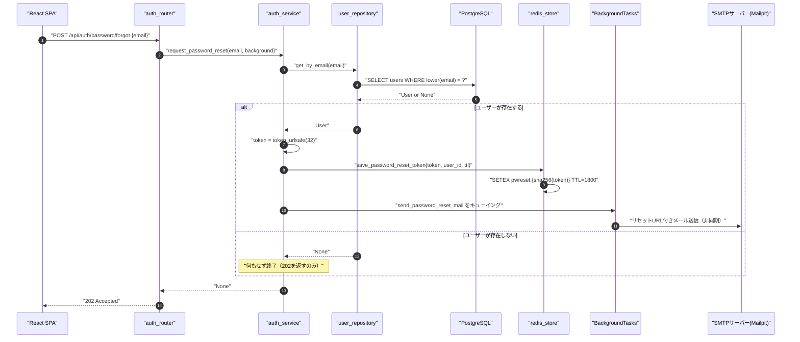
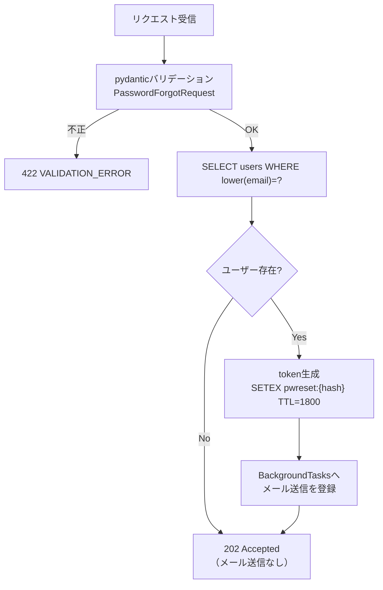
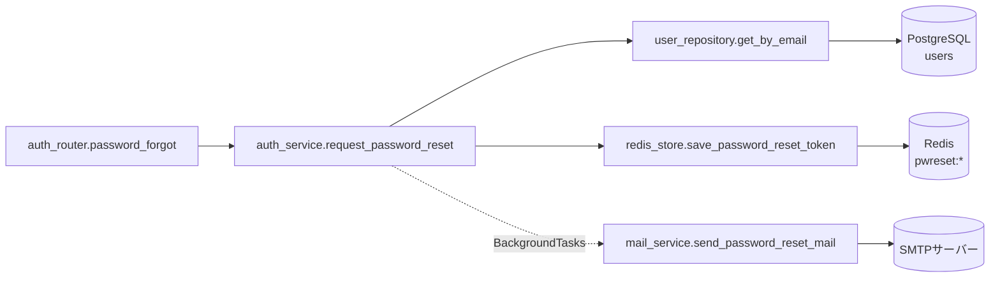
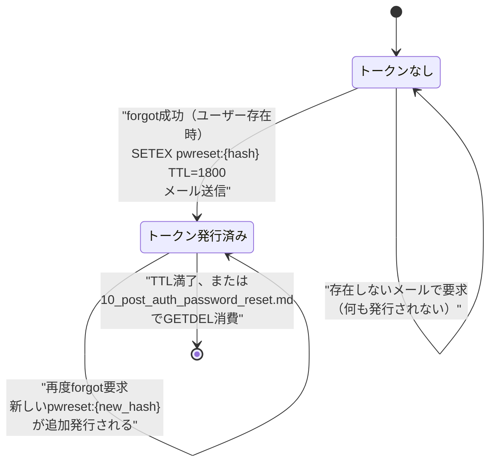

# POST /api/auth/password/forgot（パスワードリセット要求）

## 0. 関連ドキュメント

| ドキュメント | 内容 |
|--------------|------|
| [../../../basic_design/04_api.md](../../../basic_design/04_api.md) | §2.1 エンドポイント一覧、§4 エラー設計 |
| [../../../basic_design/03_auth.md](../../../basic_design/03_auth.md) | §7 パスワードリセット、§7.1 シーケンス、§7.2 メール送信設計 |
| [../../../basic_design/02_redis.md](../../../basic_design/02_redis.md) | §2 キー一覧（`pwreset:*` / `pwreset_current:*`） |
| [../../auth/06_token_mail.md](../../auth/06_token_mail.md) | メール認証・パスワードリセットトークンとメール送信の詳細設計 |
| [../../auth/08_redis_store.md](../../auth/08_redis_store.md) | `redis_store.py` 関数詳細（`save_password_reset_token`） |
| [../../database/01_table_users.md](../../database/01_table_users.md) | `users` テーブル定義 |
| [./10_post_auth_password_reset.md](./10_post_auth_password_reset.md) | パスワードリセット実行API |
| [../../screen/03_password_forgot.md](../../screen/03_password_forgot.md) | パスワード再設定要求画面 |

## 1. 概要

| 項目 | 内容 |
|------|------|
| エンドポイント | `POST /api/auth/password/forgot` |
| 目的 | 指定メールアドレス宛にパスワードリセットURLを送信する |
| 認証 | 不要 |
| 認可 | 未認証可 |
| CSRF検証 | 不要（Cookieセッションを前提としないため） |
| Origin検証 | 不要（Cookieを発行・利用しないため対象外） |
| AUTH_MODE差異 | 差異なし |
| 冪等性 | レスポンスは常に `202 Accepted` で冪等（存在有無を問わない）。副作用（メール送信・トークン発行）はユーザーが存在する場合のみ発生し、その意味では冪等ではない |
| レート制限 | IP単位で5回/900秒。超過時は `429 TOO_MANY_ATTEMPTS`（`Retry-After`付き）、Redis障害時は `503 SERVICE_UNAVAILABLE` |
| トランザクション境界 | PostgreSQLへの更新は行わない（参照のみ）。Redisへのトークン保存は旧token/current削除と新token/current登録をLuaで原子的に行う |

## 2. 入出力仕様（全体の出入力）

### 2.1 リクエスト

パスパラメータ／クエリパラメータ／ヘッダ／Cookie：なし

ボディ（`application/json`）

| 名前 | 型 | 必須 | 制約 | 説明 |
|------|----|------|------|------|
| email | string | ○ | 50文字以内、メール形式 | パスワードリセット対象のメールアドレス |

### 2.2 レスポンス

**`202 Accepted`**

```json
{
  "message": "ご入力のメールアドレスが登録されている場合、パスワード再設定用のメールを送信しました。"
}
```

| フィールド | 型 | NULL可否 | 説明 |
|-----------|----|----------|------|
| message | string | 不可 | ユーザー向け固定メッセージ。存在有無を問わず同一文言 |

`basic_design/03_auth.md` §7.1 の Note のとおり、ユーザー列挙攻撃を防ぐため存在しないメールアドレスでも同一応答を返す。

**`422 VALIDATION_ERROR`**：`email` 形式不正・未指定の場合。

Set-Cookie：発行しない。

共通ヘッダ：全レスポンスに `X-Request-ID` を付与する。

## 3. エラー仕様

| HTTP | code | 発生条件 | メッセージ | 備考 |
|------|------|----------|------------|------|
| 422 | `VALIDATION_ERROR` | `email` 未指定・形式不正 | 入力内容に誤りがあります | pydantic バリデーション |
| 503 | `SERVICE_UNAVAILABLE` | Redis / PostgreSQL 接続不能 | サービスが一時的に利用できません | fail-close |

このAPIは `401/403/404/409` を返さない（ユーザー列挙対策のため内部の「不存在」は `202` に丸める）。`basic_design/04_api.md` §4.2 のエラーコード体系から逸脱しない。

## 4. 処理シーケンス



## 5. 処理フロー・分岐



`is_active` や `email_verified_at` による分岐は行わない。無効化ユーザー・未認証ユーザーであってもリセットメールは送信する（`basic_design/03_auth.md` §7 に無効化ユーザーを除外する記載がないため。ログイン自体は別途 `is_active` / `email_verified_at` チェックで制御される＝要検討で明記）。

## 6. 関数詳細

### 6.1 `api/routers/auth_router.py :: password_forgot`

| 項目 | 内容 |
|------|------|
| シグネチャ | `async def password_forgot(payload: PasswordForgotRequest, background: BackgroundTasks, service: AuthService = Depends(get_auth_service)) -> PasswordForgotResponse` |
| 引数 | `payload: PasswordForgotRequest`、`background: BackgroundTasks`、`service: AuthService` |
| 戻り値 | `PasswordForgotResponse`（`202`、固定メッセージ） |
| 送出例外 | なし |
| 処理内容 | 1. `service.request_password_reset(payload.email, background)` を呼ぶ 2. 常に固定メッセージのレスポンスを返す |
| 副作用 | なし（副作用は service 層に委譲） |

### 6.2 `service/auth_service.py :: request_password_reset`

| 項目 | 内容 |
|------|------|
| シグネチャ | `async def request_password_reset(email: str, background: BackgroundTasks) -> None` |
| 引数 | `email: str`、`background: BackgroundTasks` |
| 戻り値 | `None`（常に正常終了、例外を送出しない） |
| 送出例外 | なし |
| 処理内容 | 1. `user_repository.get_by_email(email)` でユーザー取得。`None` なら終了 2. `token = secrets.token_urlsafe(32)` を生成 3. `redis_store.save_password_reset_token(token, user.id, ttl)` を呼ぶ 4. `background.add_task(mail_service.send_password_reset_mail, user.email, token, expires_minutes)` を登録 |
| 副作用 | Redis：`pwreset:{hash}` の新規作成。メール：`BackgroundTasks` 経由で非同期送信 |

### 6.3 `repository/user_repository.py :: get_by_email`

| 項目 | 内容 |
|------|------|
| シグネチャ | `async def get_by_email(email: str) -> User \| None` |
| 引数 | `email: str` |
| 戻り値 | `User` または `None` |
| 送出例外 | なし |
| 処理内容 | 1. `SELECT * FROM users WHERE lower(email) = lower(:email)` を実行 2. 行があれば `User`、なければ `None` |
| 副作用 | なし（参照のみ）。`07_post_auth_verify_email.md` / `08_post_auth_verify_email_resend.md` と共通の関数を再利用する |

### 6.4 `repository/redis_store.py :: save_password_reset_token`

| 項目 | 内容 |
|------|------|
| シグネチャ | `async def save_password_reset_token(token: str, user_id: UUID, ttl: int) -> None` |
| 引数 | `token: str`（平文）、`user_id: UUID`、`ttl: int`（`PASSWORD_RESET_TTL_SECONDS`、既定1800） |
| 戻り値 | `None` |
| 送出例外 | なし（Redis接続不能時は `RedisError`） |
| 処理内容 | 1. `hash = sha256(token).hexdigest()` を計算 2. `SETEX pwreset:{hash} ttl {"user_id": ..., "requested_at": ...}` を実行 |
| 副作用 | Redis：`pwreset:{hash}` を新規作成（既存の旧トークンがあっても明示的な削除は行わない。複数トークンが同時に有効になり得る点は §13参照） |

### 6.5 `service/mail_service.py :: send_password_reset_mail`

| 項目 | 内容 |
|------|------|
| シグネチャ | `async def send_password_reset_mail(to: str, token: str, expires_minutes: int) -> None` |
| 引数 | `to: str`、`token: str`、`expires_minutes: int`（`PASSWORD_RESET_TTL_SECONDS // 60`） |
| 戻り値 | `None` |
| 送出例外 | なし（内部で例外を捕捉しログに記録するのみ） |
| 処理内容 | 1. `password_reset.html` / `.txt` テンプレートをレンダリング（URLは `{FRONTEND_BASE_URL}/password/reset#token=...`） 2. `aiosmtplib` で SMTP 送信 3. 失敗時はログに記録するのみ |
| 副作用 | 外部：SMTPサーバーへのメール送信 |

## 7. 関数相関図



## 8. データ遷移図



`users` テーブルはこのAPIでは更新しない（読み取りのみ）。パスワード自体の更新は `POST /auth/password/reset` 側の責務。

## 9. データアクセス一覧

| ストア | テーブル／キー | 操作 | 条件・TTL | 備考 |
|--------|----------------|------|-----------|------|
| PostgreSQL | `users` | `SELECT` | `WHERE lower(email) = lower(:email)` | 参照のみ、更新なし |
| Redis | `pwreset:{sha256(token)}` | `SETEX` | TTL `PASSWORD_RESET_TTL_SECONDS`（既定1800） | 新規作成のみ。旧トークンの明示的な失効は行わない |

## 10. バリデーション規則

| フィールド | pydanticスキーマ | 制約 | フロント（zod）との整合 |
|-----------|-------------------|------|--------------------------|
| email | `PasswordForgotRequest.email` | `EmailStr`、50文字以内 | `z.string().email().max(50)`。`basic_design/04_api.md` §3.1 register の email 制約と統一 |

## 11. 非機能・セキュリティ考慮

| 観点 | 内容 |
|------|------|
| ユーザー列挙対策 | 存在有無を問わず `202` と同一文言を返す（`basic_design/03_auth.md` §7.1 Note）。応答時間差については§13で要検討として明記 |
| 監査ログ | ユーザーが存在しトークンを発行した場合のみ `user_id` をINFOログに記録する。メールアドレス平文はログに出力しない |
| fail-close方針 | Redis/PostgreSQL接続不能時は `503 SERVICE_UNAVAILABLE` |
| メール送信失敗時の扱い | `BackgroundTasks` 内で例外を捕捉しログ記録のみ。APIレスポンスへの影響なし |
| Google OAuthのみのユーザー | `password_hash IS NULL` のユーザーであってもこのAPIはリセットメールを送信する。リセット実行後は通常のパスワード認証ユーザーとして扱われる（`basic_design/03_auth.md` §7.2 末尾の記述と整合） |
| レート制限 | IP単位で5回/900秒。超過時は429 `TOO_MANY_ATTEMPTS`（`Retry-After`付き）、Redis障害時は503 `SERVICE_UNAVAILABLE` |

## 12. テスト設計

| No | 区分 | ケース | 前提 | 期待結果 | pytest関数名案 |
|----|------|--------|------|----------|-----------------|
| 1 | 単体（モック） | 存在するユーザーへのリセット要求 | `get_by_email` がユーザーを返す | `save_password_reset_token` とメール送信タスクが呼ばれる | `test_request_password_reset_service_success` |
| 2 | 単体（モック） | 存在しないメールでの要求 | `get_by_email` が `None` | 以降の処理が呼ばれず正常終了 | `test_request_password_reset_service_unknown_email` |
| 3 | 結合（実Redis/PostgreSQL） | 登録済みユーザーへのリセット要求でSMTPモックが呼ばれる | ユーザー登録済み、SMTPは `aiosmtplib` をモック | `202`、SMTP送信関数が1回呼ばれる、`pwreset:*` キーが作成される | `test_password_forgot_endpoint_success` |
| 4 | 結合 | 存在しないメールでの要求 | ランダムなメールアドレス | `202`、SMTP送信関数が呼ばれない | `test_password_forgot_endpoint_unknown_returns_202` |
| 5 | 結合 | `email` 未指定・不正形式 | ボディ不正 | `422 VALIDATION_ERROR` | `test_password_forgot_endpoint_invalid_email` |
| 6 | 結合 | Google OAuthのみのユーザー（`password_hash IS NULL`）への要求 | OAuth登録済みユーザー | `202`、メール送信が行われる | `test_password_forgot_endpoint_oauth_only_user` |
| 7 | 結合 | 無効化ユーザー（`is_active=false`）への要求 | 管理者に無効化されたユーザー | `202`、メール送信が行われる（基本設計に除外規定なしのため） | `test_password_forgot_endpoint_inactive_user` |

このAPIは `AUTH_MODE` に依存しないため両モードでの重複実施は不要。

## 13. 不明点・要検討事項

| 区分 | 内容 | 影響 |
|------|------|------|
| 採用 | `pwreset_current:{uid}`を発行時に置き換え、最新トークン以外を失効させる | 旧メールリンクの再利用防止 |
| 確定 | メール爆撃対策としてIP単位5回/900秒の`rate_limit:password_forgot:{key_hash}`を使用する。ユーザー不存在時も同じ制限・応答規則とする | 429 `TOO_MANY_ATTEMPTS`（`Retry-After`付き）、Redis障害時503 |
| 要検討 | 無効化ユーザー（`is_active=false`）に対してもリセットメールを送信すべきかは基本設計に明記がなく、本設計では「送信する」と解釈した | 低（ログイン自体は`is_active`チェックで別途拒否されるため悪用余地は限定的） |
