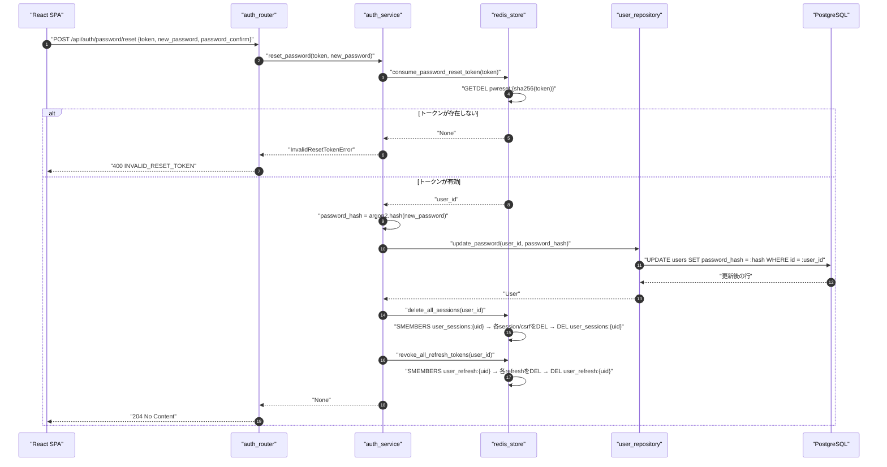
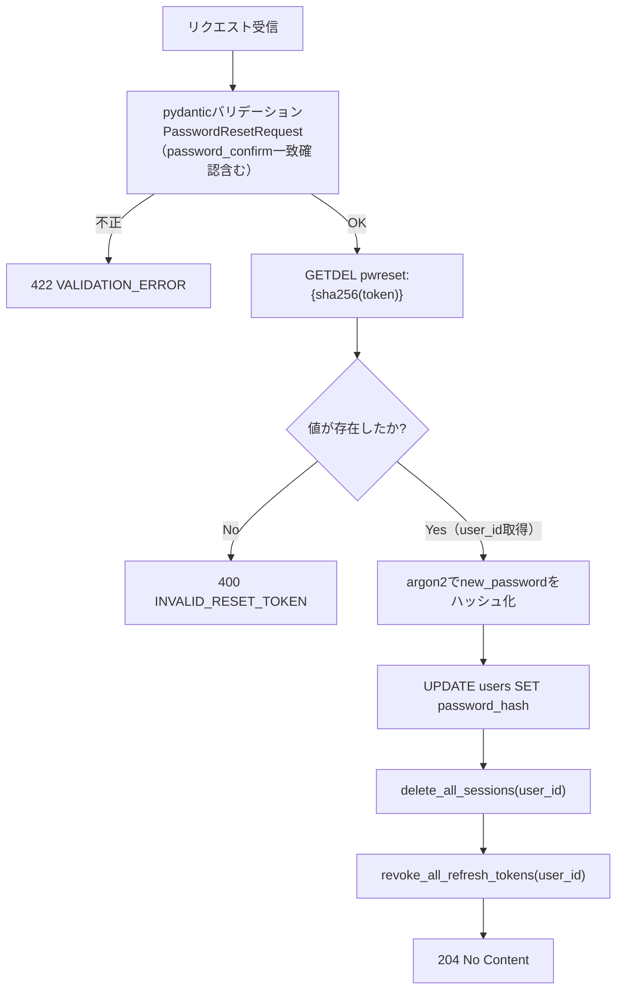
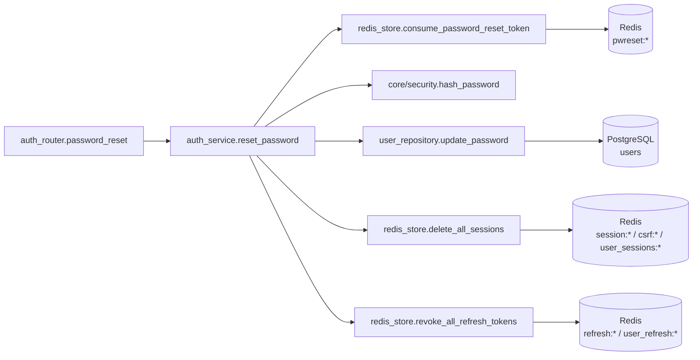
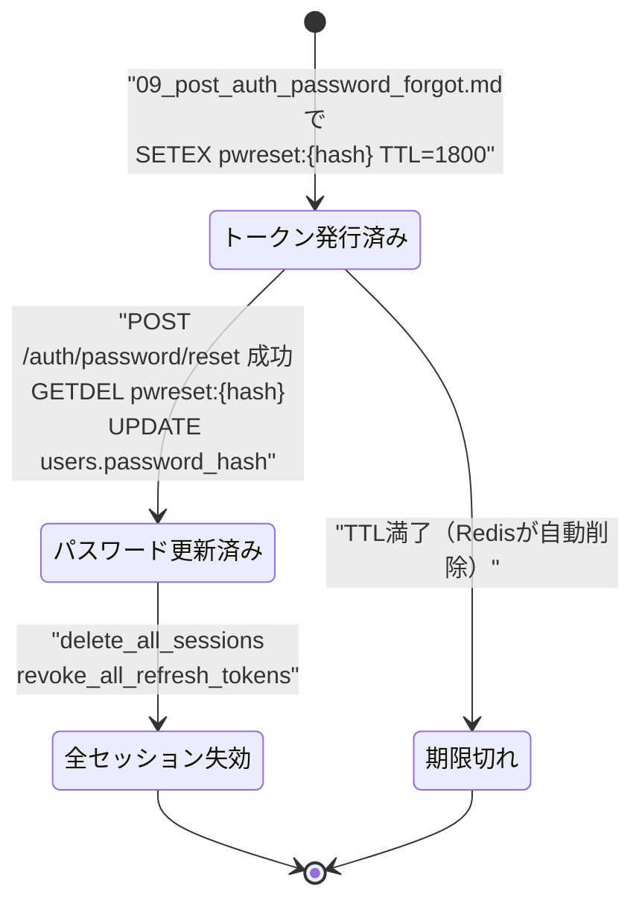

# POST /api/auth/password/reset（パスワードリセット実行）

## 0. 関連ドキュメント

| ドキュメント | 内容 |
|--------------|------|
| [../../../basic_design/04_api.md](../../../basic_design/04_api.md) | §2.1 エンドポイント一覧、§4 エラー設計 |
| [../../../basic_design/03_auth.md](../../../basic_design/03_auth.md) | §7 パスワードリセット、§7.1 シーケンス、§10 パスワード・トークンのハッシュ |
| [../../../basic_design/02_redis.md](../../../basic_design/02_redis.md) | §2 キー一覧（`pwreset:*` / `session:*` / `refresh:*`）、§5.1〜5.2 全失効関数 |
| [../../auth/06_token_mail.md](../../auth/06_token_mail.md) | メール認証・パスワードリセットトークンとメール送信の詳細設計 |
| [../../auth/07_password_security.md](../../auth/07_password_security.md) | パスワードハッシュ（argon2）・パスワードポリシー |
| [../../auth/08_redis_store.md](../../auth/08_redis_store.md) | `redis_store.py` 関数詳細（`consume_password_reset_token` / `delete_all_sessions` / `revoke_all_refresh_tokens`） |
| [../../database/01_table_users.md](../../database/01_table_users.md) | `users.password_hash` |
| [./09_post_auth_password_forgot.md](./09_post_auth_password_forgot.md) | パスワードリセット要求API（トークン発行元） |
| [../../screen/04_password_reset.md](../../screen/04_password_reset.md) | パスワード再設定画面 |

## 1. 概要

| 項目 | 内容 |
|------|------|
| エンドポイント | `POST /api/auth/password/reset` |
| 目的 | メールで受け取ったリセットトークンを検証し、新しいパスワードへ更新する。同時に全セッション・全リフレッシュトークンを失効させる |
| 認証 | 不要（トークン自体が本人確認の手段） |
| 認可 | 未認証可（有効なトークンを保持する者のみ成功） |
| CSRF検証 | 不要（Cookieセッションを前提としないため） |
| Origin検証 | 不要（Cookieを発行・利用しないため対象外） |
| AUTH_MODE差異 | 差異なし。ただし失効対象がsessionモードでは `session:*`、jwtモードでは `refresh:*` となる（実行時点でユーザーが保持し得る両方の種類を対象に、`AUTH_MODE`に関わらず両方を失効させる。§13で要検討として明記） |
| 冪等性 | **なし**。トークンは `GETDEL` によりワンタイム消費されるため、2回目のリクエストは `400 INVALID_RESET_TOKEN` になる |
| レート制限 | IP単位で10回/900秒。超過時は `429 TOO_MANY_ATTEMPTS`（`Retry-After`付き） |
| トランザクション境界 | Redisでトークン消費と全セッション/リフレッシュ失効を先に完了し、その後に `UPDATE users` をDBトランザクションでcommitする。Redis失敗時はDBを更新しない |

## 2. 入出力仕様（全体の出入力）

### 2.1 リクエスト

パスパラメータ／クエリパラメータ／ヘッダ／Cookie：なし

ボディ（`application/json`）

| 名前 | 型 | 必須 | 制約 | 説明 |
|------|----|------|------|------|
| token | string | ○ | 1文字以上 | メール内リンクの `#token=...` から抽出したリセットトークン |
| new_password | string | ○ | 8文字以上、大文字英字/小文字英字/数字/記号のうち2種類以上（`basic_design/04_api.md` §3.1 register の password 制約と同一） | 新しいパスワード |
| password_confirm | string | ○ | `new_password` と一致 | 確認用パスワード |

### 2.2 レスポンス

**`204 No Content`**：更新完了。ボディなし。フロントはログイン画面へ遷移する。

**`400 INVALID_RESET_TOKEN`**

```json
{
  "error": {
    "code": "INVALID_RESET_TOKEN",
    "message": "リセットリンクが無効か、有効期限が切れています",
    "details": null,
    "request_id": "550e8400-e29b-41d4-a716-446655440000"
  }
}
```

| フィールド | 型 | NULL可否 | 説明 |
|-----------|----|----------|------|
| error.code | string | 不可 | `INVALID_RESET_TOKEN` 固定 |
| error.message | string | 不可 | ユーザー向けメッセージ |
| error.details | null | 可 | このAPIでは常に `null` |
| error.request_id | string | 不可 | リクエスト相関ID |

**`422 VALIDATION_ERROR`**：`new_password` が要件を満たさない、`password_confirm` が不一致、`token` が空文字の場合。`details` にフィールド単位の情報を格納する（`basic_design/04_api.md` §4.1）。

Set-Cookie：発行しない（このAPIはCookieの発行・破棄を行わない。ログイン状態の確立は別途 `POST /auth/login` で行う）。

共通ヘッダ：全レスポンスに `X-Request-ID` を付与する。

## 3. エラー仕様

| HTTP | code | 発生条件 | メッセージ | 備考 |
|------|------|----------|------------|------|
| 400 | `INVALID_RESET_TOKEN` | Redis `pwreset:{sha256(token)}` が存在しない（未発行・期限切れ・使用済み） | リセットリンクが無効か、有効期限が切れています | |
| 422 | `VALIDATION_ERROR` | `new_password` がパスワードポリシー違反、`password_confirm` 不一致、`token` 空文字 | 入力内容に誤りがあります | pydantic バリデーション |
| 503 | `SERVICE_UNAVAILABLE` | Redis / PostgreSQL 接続不能 | サービスが一時的に利用できません | fail-close |

`basic_design/04_api.md` §4.2 のエラーコード体系から逸脱しない。

## 4. 処理シーケンス



## 5. 処理フロー・分岐



認証・認可の分岐は存在しない。`current_password` の検証は行わない（トークン自体が本人確認の代替であり、`PUT /users/me/password` とは異なる方式）。

## 6. 関数詳細

### 6.1 `api/routers/auth_router.py :: password_reset`

| 項目 | 内容 |
|------|------|
| シグネチャ | `async def password_reset(payload: PasswordResetRequest, service: AuthService = Depends(get_auth_service)) -> Response` |
| 引数 | `payload: PasswordResetRequest`、`service: AuthService` |
| 戻り値 | `Response`（`204 No Content`） |
| 送出例外 | なし（`service.reset_password` が送出した `InvalidResetTokenError` はグローバル例外ハンドラで400に変換） |
| 処理内容 | 1. `service.reset_password(payload.token, payload.new_password)` を呼び出す 2. 成功時は `Response(status_code=204)` を返す |
| 副作用 | なし（副作用は service 層に委譲） |

### 6.2 `service/auth_service.py :: reset_password`

| 項目 | 内容 |
|------|------|
| シグネチャ | `async def reset_password(token: str, new_password: str) -> None` |
| 引数 | `token: str`（メールリンクのトークン）、`new_password: str`（バリデーション済み平文） |
| 戻り値 | `None` |
| 送出例外 | `InvalidResetTokenError`（HTTP 400） |
| 処理内容 | 1. `redis_store.consume_password_reset_token(token)` を呼び user_id を取得 2. `None` の場合は `InvalidResetTokenError` を送出 3. `core/security.py` の `hash_password(new_password)` で argon2 ハッシュを生成 4. `user_repository.update_password(user_id, password_hash)` を呼ぶ 5. `redis_store.delete_all_sessions(user_id)` を呼ぶ 6. `redis_store.revoke_all_refresh_tokens(user_id)` を呼ぶ |
| 副作用 | Redis：`pwreset:{hash}` 削除、`session:*` / `csrf:*` / `user_sessions:{uid}` 全削除、`refresh:*` / `user_refresh:{uid}` 全削除。PostgreSQL：`users.password_hash` 更新 |

### 6.3 `repository/user_repository.py :: update_password`

| 項目 | 内容 |
|------|------|
| シグネチャ | `async def update_password(user_id: UUID, password_hash: str) -> User` |
| 引数 | `user_id: UUID`、`password_hash: str`（argon2ハッシュ済み） |
| 戻り値 | 更新後の `User` |
| 送出例外 | `NotFoundError`（対象ユーザーが存在しない場合。理論上はトークン発行時に存在確認済みのため発生しないが防御的に扱う） |
| 処理内容 | 1. `UPDATE users SET password_hash = :hash WHERE id = :user_id RETURNING *` を実行 2. 行が取得できなければ `NotFoundError` |
| 副作用 | PostgreSQL：`users` テーブル1行の更新 |

### 6.4 `repository/redis_store.py :: consume_password_reset_token`

| 項目 | 内容 |
|------|------|
| シグネチャ | `async def consume_password_reset_token(token: str) -> UUID \| None` |
| 引数 | `token: str`（平文） |
| 戻り値 | `UUID` または `None` |
| 送出例外 | なし（Redis接続不能時は `RedisError`） |
| 処理内容 | 1. `hash = sha256(token).hexdigest()` を計算 2. `GETDEL pwreset:{hash}` を実行 3. 値が存在すれば `user_id` を返す |
| 副作用 | Redis：`pwreset:{hash}` を削除（ワンタイム消費） |

### 6.5 `repository/redis_store.py :: delete_all_sessions`

| 項目 | 内容 |
|------|------|
| シグネチャ | `async def delete_all_sessions(user_id: UUID) -> int` |
| 引数 | `user_id: UUID` |
| 戻り値 | `int`（削除件数） |
| 送出例外 | なし |
| 処理内容 | 1. `SMEMBERS user_sessions:{uid}` で有効session_id一覧を取得 2. 各 `session:{sid}` / `csrf:{sid}` を `DEL` 3. `DEL user_sessions:{uid}` |
| 副作用 | Redis：sessionモードの全ログイン状態を削除 |

### 6.6 `repository/redis_store.py :: revoke_all_refresh_tokens`

| 項目 | 内容 |
|------|------|
| シグネチャ | `async def revoke_all_refresh_tokens(user_id: UUID) -> int` |
| 引数 | `user_id: UUID` |
| 戻り値 | `int`（削除件数） |
| 送出例外 | なし |
| 処理内容 | 1. `SMEMBERS user_refresh:{uid}` で有効token_hash一覧を取得 2. 各 `refresh:{hash}` を `DEL` 3. `DEL user_refresh:{uid}` |
| 副作用 | Redis：jwtモードの全リフレッシュトークンを削除。既発行のアクセストークンは署名検証のみのため最大 `ACCESS_TOKEN_TTL_SECONDS`（既定900秒）は有効なまま残り得る（`basic_design/03_auth.md` §7.2 末尾） |

### 6.7 `core/security.py :: hash_password`

| 項目 | 内容 |
|------|------|
| シグネチャ | `def hash_password(plain: str) -> str` |
| 引数 | `plain: str`（バリデーション済み平文パスワード） |
| 戻り値 | argon2id ハッシュ文字列 |
| 送出例外 | なし |
| 処理内容 | `passlib[argon2]` の `CryptContext` で `ARGON2_TIME_COST` / `ARGON2_MEMORY_COST` / `ARGON2_PARALLELISM` を用いてハッシュ化する |
| 副作用 | なし（純粋関数） |

## 7. 関数相関図



## 8. データ遷移図



`users.password_hash` は更新前の値から新しいargon2ハッシュへ一方向に遷移する。同時に `session:*` / `refresh:*` は「有効」→「削除済み（存在しない）」へ遷移し、以後の認証済みリクエストは401（`SESSION_EXPIRED` / アクセストークンは期限切れまで通過し得るが `refresh` は `TOKEN_REVOKED`）となる。

## 9. データアクセス一覧

| ストア | テーブル／キー | 操作 | 条件・TTL | 備考 |
|--------|----------------|------|-----------|------|
| Redis | `pwreset:{sha256(token)}` | `GETDEL` | TTL `PASSWORD_RESET_TTL_SECONDS`（既定1800） | ワンタイム消費 |
| PostgreSQL | `users` | `UPDATE` | `WHERE id = :user_id` | `password_hash` のみ更新 |
| Redis | `session:{sid}` / `csrf:{sid}` / `user_sessions:{uid}` | `SMEMBERS` → `DEL`（複数） | 該当ユーザーの全件 | sessionモードの全失効 |
| Redis | `refresh:{hash}` / `user_refresh:{uid}` | `SMEMBERS` → `DEL`（複数） | 該当ユーザーの全件 | jwtモードの全失効 |

## 10. バリデーション規則

| フィールド | pydanticスキーマ | 制約 | フロント（zod）との整合 |
|-----------|-------------------|------|--------------------------|
| token | `PasswordResetRequest.token` | `str`、`min_length=1` | `z.string().min(1)` |
| new_password | `PasswordResetRequest.new_password` | `str`、8文字以上、大文字英字/小文字英字/数字/記号のうち2種類以上 | `basic_design/04_api.md` §3.1 register の password 制約と同一の正規表現・検証関数をフロントで共用する |
| password_confirm | `PasswordResetRequest.password_confirm` | `new_password` と一致（`model_validator` で相互検証） | `z.object({...}).refine(...)` |

## 11. 非機能・セキュリティ考慮

| 観点 | 内容 |
|------|------|
| 監査ログ | 更新成功時に `user_id` をINFOログに出力する。パスワード平文・トークン平文はログに出力しない |
| ユーザー列挙対策 | このAPIはメールアドレスを受け取らないため列挙リスクはない。無効・期限切れ・使用済みを区別せず一律 `INVALID_RESET_TOKEN` を返す |
| 即時失効の範囲 | `session:*` と `refresh:*` は即時削除するが、jwtの既発行アクセストークンは署名検証のみで失効させられないため、最大 `ACCESS_TOKEN_TTL_SECONDS`（既定900秒）は有効なまま残り得る（denylist方式は不採用。`basic_design/03_auth.md` §4.5参照） |
| fail-close方針 | Redis/PostgreSQL接続不能時は `503 SERVICE_UNAVAILABLE` |
| パスワードハッシュ | argon2id（`ARGON2_TIME_COST` / `ARGON2_MEMORY_COST` / `ARGON2_PARALLELISM` を環境変数化） |
| 冪等性の非提供 | 2回目のリクエストは意図的に失敗させる（ワンタイム消費の設計要件） |

## 12. テスト設計

| No | 区分 | ケース | 前提 | 期待結果 | pytest関数名案 |
|----|------|--------|------|----------|-----------------|
| 1 | 単体（モック） | 有効なトークンで更新成功 | `consume_password_reset_token` が `user_id` を返す | `update_password` / `delete_all_sessions` / `revoke_all_refresh_tokens` が呼ばれる | `test_reset_password_service_success` |
| 2 | 単体（モック） | 無効なトークン | `consume_password_reset_token` が `None` | `InvalidResetTokenError` 送出、以降の処理が呼ばれない | `test_reset_password_service_invalid_token` |
| 3 | 結合（実Redis/PostgreSQL、`AUTH_MODE=session`） | パスワードリセット後にログイン中セッションが失効すること | ログイン済みsession Cookie保持、リセット要求済み | リセット成功後、旧session Cookieでのアクセスが `401 SESSION_EXPIRED` | `test_password_reset_endpoint_session_invalidated` |
| 4 | 結合（実Redis/PostgreSQL、`AUTH_MODE=jwt`） | パスワードリセット後にリフレッシュトークンが失効すること | ログイン済みrefresh Cookie保持 | リセット成功後、`/auth/refresh` が `401 TOKEN_REVOKED` | `test_password_reset_endpoint_refresh_revoked` |
| 5 | 結合 | 同一トークンを2回送信 | 1回目成功済み | 2回目は `400 INVALID_RESET_TOKEN` | `test_password_reset_endpoint_reuse_rejected` |
| 6 | 結合 | 存在しないトークン | ランダム文字列 | `400 INVALID_RESET_TOKEN` | `test_password_reset_endpoint_unknown_token` |
| 7 | 結合 | パスワードポリシー違反 | `new_password` が7文字 | `422 VALIDATION_ERROR` | `test_password_reset_endpoint_weak_password` |
| 8 | 結合 | `password_confirm` 不一致 | `new_password` と異なる値 | `422 VALIDATION_ERROR` | `test_password_reset_endpoint_confirm_mismatch` |
| 9 | 結合 | 更新後の新パスワードでログイン成功 | リセット完了後 | `POST /auth/login` が新パスワードで成功する | `test_password_reset_then_login_success` |

このAPIの本体処理は `AUTH_MODE` に依存しないが、失効対象がsession/jwtで異なるため、No.3/4はそれぞれのモードで個別に実施する。

## 13. 不明点・要検討事項

| 区分 | 内容 | 影響 |
|------|------|------|
| 要検討 | `AUTH_MODE` に関わらず `delete_all_sessions` と `revoke_all_refresh_tokens` の両方を常に呼ぶ設計としたが、基本設計書には「session/refresh」を包括して「全セッション/リフレッシュトークンを失効」と記載されるのみで、現在の `AUTH_MODE` 以外の方式のキーも含めて失効すべきかの明記がない。過去に `AUTH_MODE` を切り替えた運用がある場合に備え、両方を失効させる実装としたが、要件との整合を確認したい | 低（両方失効させても副作用はなく、安全側の実装であるため機能上の問題はない） |
| 採用 | current一致を確認したトークンだけを原子的に消費するため、旧トークンは `400 INVALID_RESET_TOKEN` となる | 最新メールのみ有効 |
