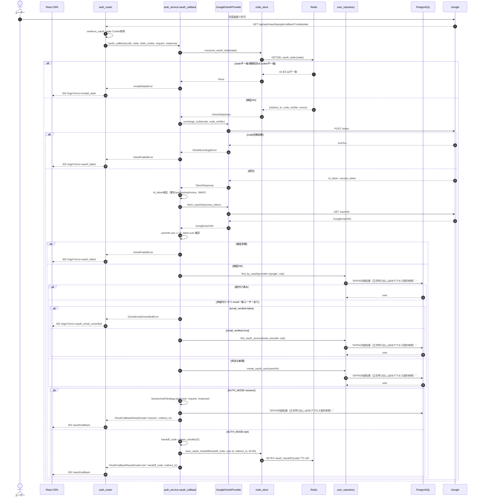
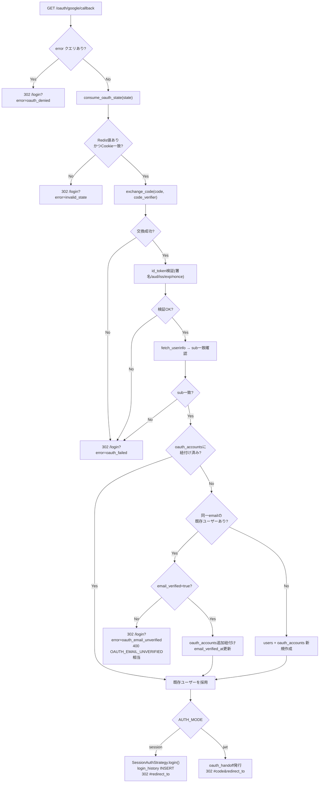
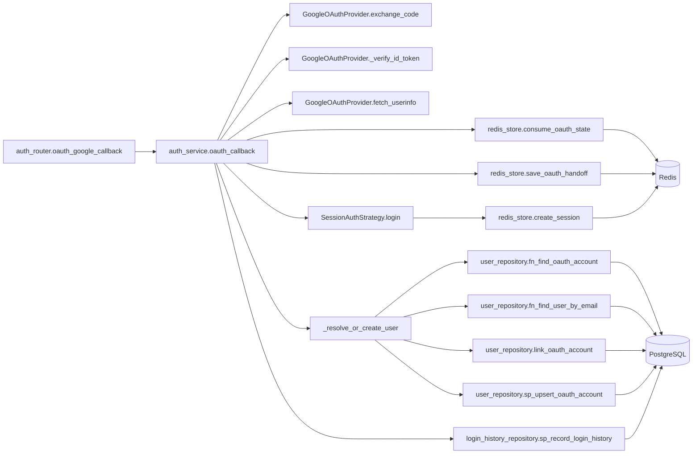
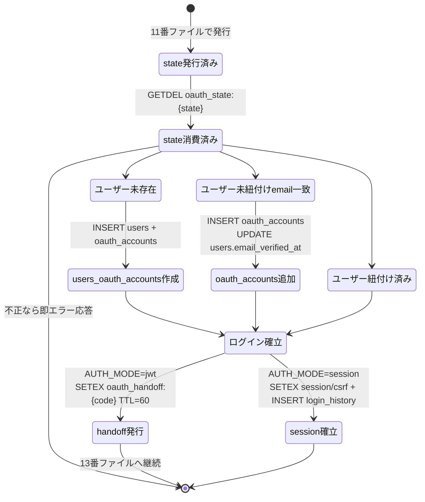

# GET /api/auth/oauth/google/callback（Google OAuth2 コールバック）

## 0. 関連ドキュメント

| ドキュメント | 内容 |
|--------------|------|
| [../../../basic_design/03_auth.md](../../../basic_design/03_auth.md) | §5 Google OAuth2 全体設計、§5.3 アカウント紐付けルール、§5.4 jwtモードのトークン受け渡し |
| [../../../basic_design/02_redis.md](../../../basic_design/02_redis.md) | §2 キー一覧（`oauth_state` / `oauth_handoff`）、§4.3 state遷移 |
| [../../../basic_design/01_database.md](../../../basic_design/01_database.md) | `users` / `oauth_accounts` テーブル定義 |
| [../../../basic_design/04_api.md](../../../basic_design/04_api.md) | §1 共通仕様、§4 エラー設計 |
| [./11_get_auth_oauth_google.md](./11_get_auth_oauth_google.md) | 認可開始（state発行元） |
| [./13_post_auth_oauth_exchange.md](./13_post_auth_oauth_exchange.md) | jwtモードのハンドオフ交換（本APIの後続） |
| [../../auth/04_google_oauth.md](../../auth/04_google_oauth.md) | GoogleOAuthProvider詳細（認証領域担当が作成） |
| [../../database/02_table_oauth_accounts.md](../../database/02_table_oauth_accounts.md) | `oauth_accounts` テーブル詳細（DB領域担当が作成） |
| [../../screen/11_oauth_callback.md](../../screen/11_oauth_callback.md) | フロント側コールバック中継画面 |

## 1. 概要

| 項目 | 内容 |
|------|------|
| エンドポイント | `GET /api/auth/oauth/google/callback` |
| 目的 | Googleからの認可コードを受け取り、state/PKCE/id_tokenを検証してユーザーを解決・作成し、`AUTH_MODE` に応じてログイン状態を確立する |
| 認証 | 不要（Googleからのリダイレクトを直接受ける） |
| 認可 | 未認証可 |
| CSRF検証 | 不要（GETかつstate/Cookie一致検証が同等の役割を果たす） |
| Origin検証 | 不要（Googleからのブラウザリダイレクトのため、通常Originヘッダは付与されない） |
| AUTH_MODE差異 | **あり**。sessionモードはここで`SessionAuthStrategy.login()`を完了させCookieを発行する。jwtモードはログインを完了させず、`oauth_handoff:{code}` を発行してフロントの`/oauth/exchange`呼び出しを待つ |
| 冪等性 | 冪等ではない（`state`はワンタイム消費。同一codeでの再実行はGoogle側で失敗する） |
| レート制限 | `oauth callback` はIP単位で10回/900秒。超過時は429相当のエラー表示へ遷移し、Redis障害時は503相当で認可を成立させない |
| トランザクション境界 | ユーザー解決/作成（`users` INSERT または `oauth_accounts` INSERT）は1トランザクション。session モードでは同トランザクション確定後に `login_history` を別途INSERTする |

## 2. 入出力仕様

### 2.1 リクエスト

パスパラメータ：なし

クエリパラメータ（Googleが付与）

| 名前 | 型 | 必須 | 制約 | 説明 |
|------|----|----|------|------|
| `code` | string | ○（同意時） | - | 認可コード |
| `state` | string | ○ | - | 認可開始時に発行した`state` |
| `error` | string | 任意 | 例：`access_denied` | ユーザーが同意画面で拒否した場合等にGoogleが付与 |

ヘッダ：なし（認証ヘッダ不要）

Cookie

| Cookie名 | 必須 | 説明 |
|----------|------|------|
| `cerberus_oauth_state`（`COOKIE_NAME_OAUTH_STATE`） | ○ | 認可開始時に発行したCookie。クエリの`state`と一致することを検証 |

ボディ：なし

### 2.2 レスポンス

本APIは常にリダイレクト（302）で応答し、JSONボディは返さない。

**正常系（session モード）**

| ヘッダ | 内容 |
|--------|------|
| `Location` | `{FRONTEND_BASE_URL}/oauth/callback#redirect_to=<正規化済みパス>` |
| `Set-Cookie` | `cerberus_sid` / `cerberus_csrf`（`SessionAuthStrategy.login()`が発行。`../../auth/01_session_auth.md`参照）、および`cerberus_oauth_state`の削除（`Max-Age=0`） |

**正常系（jwt モード）**

| ヘッダ | 内容 |
|--------|------|
| `Location` | `{FRONTEND_BASE_URL}/oauth/callback#code=<handoff_code>&redirect_to=<正規化済みパス>` |
| `Set-Cookie` | `cerberus_oauth_state`の削除（`Max-Age=0`）のみ。refresh/CSRF Cookieはこの時点では発行しない（13番ファイルで発行） |

`redirect_to`・`code`はいずれもURLフラグメント（`#`以降）に含め、クエリ文字列には含めない（アクセスログ・Refererへの残留を避けるため。`basic_design/03_auth.md` §5.4準拠）。

**異常系（state不一致・期限切れ・Google側エラー等）**

| ヘッダ | 内容 |
|--------|------|
| `Location` | `{FRONTEND_BASE_URL}/login?error=<エラー種別>` |

| エラー種別（クエリ値） | 発生条件 |
|------------------------|----------|
| `invalid_state` | state不一致・期限切れ・Cookie欠落 |
| `oauth_denied` | Googleからの`error`パラメータあり（ユーザーが同意拒否等） |
| `oauth_email_unverified` | Google側`email_verified=false` |
| `oauth_failed` | 上記以外の検証失敗（id_token署名不正、userinfo.sub不一致、code交換失敗等） |

本APIはブラウザの直接ナビゲーションを受けるため、エラー時もJSON形式のエラーボディではなく`/login`へのリダイレクトで通知する（`basic_design/04_api.md` §4のエラーコード体系は、フロントが表示する`error`クエリ値のマッピング元として使用する）。

## 3. エラー仕様

| HTTP | code（内部判定用。レスポンスはリダイレクト） | 発生条件 | フロント側`error`値 | 備考 |
|------|------|----------|------------------------|------|
| 302 | `INVALID_STATE` | state不一致・期限切れ・Cookie欠落 | `invalid_state` | `redis_store.consume_oauth_state`が`None`を返す、またはCookie値とクエリ値が不一致 |
| 302 | - | Googleが`error`クエリを付与（同意拒否等） | `oauth_denied` | `code`が存在しない |
| 302 | `OAUTH_EMAIL_UNVERIFIED` | `userinfo.email_verified=false`かつ新規/未紐付け | `oauth_email_unverified` | 既存ユーザーへの乗っ取り防止のため紐付けを行わない（`basic_design/03_auth.md` §5.3） |
| 302 | - | id_token署名・aud・iss・exp・nonce検証失敗 | `oauth_failed` | JWKS取得失敗を含む |
| 302 | - | `userinfo.sub`と`id_token.sub`の不一致 | `oauth_failed` | なりすまし対策 |
| 302 | - | Googleとのtoken交換（`POST /token`）失敗 | `oauth_failed` | ネットワークエラー・4xx/5xx |
| 302 | - | Redis接続不能（`consume_oauth_state`/`save_oauth_handoff`） | `oauth_failed` | fail-close。本来503が望ましいがブラウザ直接遷移のため302+`error`で代替（§13要検討） |
| 302 | - | 未捕捉例外 | `oauth_failed` | ログにのみ詳細を出力 |

`basic_design/04_api.md` §4.2のコード体系（`INVALID_STATE`/`OAUTH_EMAIL_UNVERIFIED`）はサーバー内部の例外クラス・ログ記録に用い、ブラウザへの応答は上表の`error`クエリ値に変換する。

## 4. 処理シーケンス

## 5. 処理フロー・分岐

## 6. 関数詳細

### 6.1 `api/routers/auth_router.py :: oauth_google_callback`

| 項目 | 内容 |
|------|------|
| シグネチャ | `async def oauth_google_callback(code: str | None = Query(default=None), state: str | None = Query(default=None), error: str | None = Query(default=None), request: Request, response: Response, service: AuthService = Depends(get_auth_service)) -> RedirectResponse` |
| 引数 | `code`/`state`/`error`：クエリパラメータ。`request`：Cookie読み取り用 |
| 戻り値 | `RedirectResponse`（302固定） |
| 送出例外 | 送出しない（`service.oauth_callback`内の例外を全てキャッチし、対応する`/login?error=...`へのリダイレクトに変換する。本エンドポイントはユーザー向けリダイレクトのため、通常のAppErrorハンドラを経由させない） |
| 処理内容 | 1. `error`クエリがあれば即座に`oauth_denied`へ 2. `cerberus_oauth_state`Cookie値を取得 3. `service.oauth_callback(code, state, state_cookie, request, response)`を呼ぶ 4. 例外の種別に応じ`error`クエリ値をマッピング 5. 成功時は`OAuthCallbackResult`の内容に応じてfragment付きURLを組み立てる |
| 副作用 | Cookie発行（sessionモード時）、Cookie削除（`cerberus_oauth_state`） |

### 6.2 `service/auth_service.py :: oauth_callback`

| 項目 | 内容 |
|------|------|
| シグネチャ | `async def oauth_callback(code: str | None, state: str | None, state_cookie: str | None, request: Request, response: Response) -> OAuthCallbackResult` |
| 引数 | `code`/`state`/`state_cookie`：表6.1参照。`request`/`response`：Strategy.loginへ引き渡す |
| 戻り値 | `OAuthCallbackResult`（`auth_mode`, `redirect_to`, `handoff_code: str | None`） |
| 送出例外 | `InvalidStateError`（400/302マッピングは`invalid_state`）、`OAuthFailedError`（`oauth_failed`）、`OAuthEmailUnverifiedError`（400/`oauth_email_unverified`）、`ServiceUnavailableError`（Redis接続不能） |
| 処理内容 | 1. `state is None or state_cookie is None or state != state_cookie` なら即`InvalidStateError` 2. `redis_store.consume_oauth_state(state)`を呼び`None`なら`InvalidStateError` 3. `oauth_provider.exchange_code(code, data.code_verifier)`を呼ぶ 4. id_tokenをJWKSで検証（署名・`aud==GOOGLE_CLIENT_ID`・`iss`・`exp`・`nonce==data.nonce`） 5. `oauth_provider.fetch_userinfo(access_token)`を呼ぶ 6. `userinfo.sub == id_token.sub`を確認 7. `_resolve_or_create_user(userinfo)`を呼ぶ 8. `AUTH_MODE`により分岐し、sessionなら`strategy.login()`＋`login_history`記録、jwtなら`handoff_code`発行 |
| 副作用 | PostgreSQL：`users`/`oauth_accounts`のINSERT/UPDATE、`login_history`INSERT（sessionモードのみ）。Redis：`oauth_state`削除（consume時点）、`oauth_handoff`新規作成（jwtモードのみ）。Cookie：sessionモードは`login()`内で発行 |

### 6.3 `service/auth_service.py :: _resolve_or_create_user`

| 項目 | 内容 |
|------|------|
| シグネチャ | `async def _resolve_or_create_user(userinfo: GoogleUserInfo) -> User` |
| 引数 | `userinfo`：`sub`, `email`, `email_verified`, `given_name`, `family_name`を含む |
| 戻り値 | `User`（解決または新規作成されたエンティティ） |
| 送出例外 | `OAuthEmailUnverifiedError`（未紐付けかつ`email_verified=false`） |
| 処理内容 | 1. `SELECT fn_find_oauth_account('google', userinfo.sub)`で紐付け済みか確認し、あれば返す 2. 無ければ`SELECT fn_find_user_by_email(userinfo.email)`で既存ユーザーを検索 3. 既存ユーザーがあり`userinfo.email_verified=false`なら`OAuthEmailUnverifiedError`を送出 4. `CALL sp_upsert_oauth_account(...)`で既存ユーザーの検証日時・OAuth紐付け、または新規ユーザー作成を同一トランザクションで実行する |
| 副作用 | PostgreSQL：`users`/`oauth_accounts`のINSERTまたはUPDATE（同一トランザクション） |

### 6.4 `auth/oauth.py :: GoogleOAuthProvider.exchange_code`

| 項目 | 内容 |
|------|------|
| シグネチャ | `async def exchange_code(self, code: str, code_verifier: str) -> TokenResponse` |
| 引数 | `code`：Googleからの認可コード。`code_verifier`：state発行時に保存したPKCE検証値 |
| 戻り値 | `TokenResponse`（`id_token`, `access_token`） |
| 送出例外 | `OAuthExchangeError`（HTTPエラー・タイムアウト） |
| 処理内容 | 1. Googleの`/token`エンドポイントへ`code`/`code_verifier`/`client_id`/`client_secret`/`redirect_uri`/`grant_type=authorization_code`をPOST 2. レスポンスをパースし返す |
| 副作用 | 外部HTTP通信 |

### 6.5 `auth/oauth.py :: GoogleOAuthProvider.fetch_userinfo` / `_verify_id_token`

| 項目 | 内容 |
|------|------|
| シグネチャ | `async def fetch_userinfo(self, access_token: str) -> GoogleUserInfo` / `def _verify_id_token(self, id_token: str, nonce: str) -> IdTokenClaims` |
| 引数 | `access_token`：交換で得たトークン。`id_token`/`nonce`：署名・nonce検証用 |
| 戻り値 | `GoogleUserInfo` / `IdTokenClaims` |
| 送出例外 | `OAuthFailedError`（署名不正・aud/iss不一致・exp切れ・nonce不一致・userinfo取得失敗） |
| 処理内容 | JWKS（Googleの公開鍵）をキャッシュ付きで取得し署名検証。`aud`/`iss`/`exp`/`nonce`を確認。`fetch_userinfo`はGoogleの`/userinfo`エンドポイントへGETしパースする |
| 副作用 | 外部HTTP通信（JWKS取得はキャッシュにより頻度を抑制。キャッシュTTLは`GOOGLE_JWKS_CACHE_TTL_SECONDS`） |

## 7. 関数相関図

## 8. データ遷移図

## 9. データアクセス一覧

| ストア | テーブル／キー | 操作 | 条件・TTL | 備考 |
|--------|----------------|------|-----------|------|
| Redis | `oauth_state:{state}` | `GETDEL`（ワンタイム消費） | - | 存在しなければ`InvalidStateError` |
| Redis | `session:{sid}` / `csrf:{sid}` / `user_sessions:{uid}` | `SETEX` / `SADD`（新規作成） | TTL=`SESSION_TTL_SECONDS` | sessionモードのみ（`SessionAuthStrategy.login`内） |
| Redis | `oauth_handoff:{code}` | `SETEX`（新規作成） | TTL=60秒固定 | jwtモードのみ |
| PostgreSQL | `oauth_accounts` | `SELECT`（`provider`+`provider_user_id`）／`INSERT`（新規紐付け時） | - | 紐付け確認・新規紐付け |
| PostgreSQL | `users` | `SELECT`（`email`）／`INSERT`／`UPDATE(email_verified_at)` | - | 新規作成・既存紐付け・メール検証更新 |
| PostgreSQL | `login_history` | `INSERT`（`method='oauth_google'`） | - | sessionモードはここで記録。jwtモードは13番ファイルで記録 |

## 10. バリデーション規則

| スキーマ／項目 | フィールド | 制約 | フロント（zod）との整合 |
|-----------------|-----------|------|--------------------------|
| クエリパラメータ | `code` | pydantic `str | None`。存在しなければ`oauth_denied`扱い | フロントは本APIを直接呼ばない（ブラウザ遷移のため） |
| クエリパラメータ | `state` | pydantic `str | None`。`state_cookie`との一致を必須とする | 同上 |
| id_token検証 | `aud` | `GOOGLE_CLIENT_ID`と完全一致 | - |
| id_token検証 | `iss` | `https://accounts.google.com` または `accounts.google.com` | - |
| id_token検証 | `nonce` | Redis保存値と完全一致（`secrets.compare_digest`） | - |
| userinfo | `sub` | id_tokenの`sub`と完全一致 | - |
| userinfo | `email_verified` | `true`でなければ未紐付けユーザーの紐付け・新規作成を行わない | - |

## 11. 非機能・セキュリティ考慮

| 観点 | 内容 |
|------|------|
| ログ出力 | INFO：OAuthログイン成功（`user_id`, `provider_user_id`のハッシュ化値, `method='oauth_google'`）。WARN：state不一致・id_token検証失敗・sub不一致・email未検証拒否。個人情報（生のemail・氏名）を平文でログへ出力しない方針とする（要検討：具体的なマスキング方式は`core/logger.py`側で規定） |
| ユーザー列挙対策 | 該当なし（本APIはGoogleとの検証結果に基づく処理であり、ユーザー入力に応じたエラー分岐をブラウザに露出しない） |
| タイミング攻撃対策 | `state`・`nonce`の比較は`secrets.compare_digest`を使用 |
| オープンリダイレクト対策 | `redirect_to`は11番ファイルで正規化済みの値をRedisから取得するのみで、本APIでは再検証しない（改ざん不可能なRedis保存値のため） |
| アカウント乗っ取り対策 | `email_verified=false`の場合は既存ユーザーへの紐付けを行わず400/`oauth_email_unverified`とする（`basic_design/03_auth.md` §5.3） |
| CSRF対策 | state + Cookie一致検証により、第三者が発行したcodeを被害者のブラウザに注入する攻撃を防ぐ |
| レート制限 | `oauth callback` はIP単位10回/900秒。Google認可コードの高エントロピー性に依存せず汎用IP制限を適用する |
| fail-close方針 | Redis接続不能時は`oauth_failed`として`/login`へリダイレクトする（503の代わりにブラウザ向けエラー表示。§13要検討） |

## 12. テスト設計

| No | 区分 | ケース | 前提 | 期待結果 | pytest関数名案 |
|----|------|--------|------|----------|-----------------|
| 1 | 単体 | `_resolve_or_create_user`：紐付け済み | モック repository | 既存ユーザーを返す | `test_resolve_user_already_linked` |
| 2 | 単体 | `_resolve_or_create_user`：未紐付け・email一致・verified | モック repository | `oauth_accounts`追加、`email_verified_at`更新 | `test_resolve_user_links_existing_by_email` |
| 3 | 単体 | `_resolve_or_create_user`：未紐付け・email一致・未verified | モック repository | `OAuthEmailUnverifiedError`送出 | `test_resolve_user_rejects_unverified_email_link` |
| 4 | 単体 | `_resolve_or_create_user`：完全新規 | モック repository | `users`/`oauth_accounts`作成、`username`が`google_`プレフィックス | `test_resolve_user_creates_new_oauth_user` |
| 5 | 結合 | 正常系・sessionモード | `respx`でGoogle token/userinfoモック、実PostgreSQL/Redis | 302 `#redirect_to`、Set-Cookie(sid, csrf)、`login_history`に`method='oauth_google'`が記録される | `test_oauth_callback_session_mode_success` |
| 6 | 結合 | 正常系・jwtモード | 同上 | 302 `#code=...&redirect_to=...`、`oauth_handoff:{code}`がRedisに存在、Set-Cookieは`cerberus_oauth_state`削除のみ | `test_oauth_callback_jwt_mode_issues_handoff` |
| 7 | 結合 | state Cookie不一致 / state期限切れ | クエリstateとCookie値を変える／Redisから事前削除 | いずれも302 `/login?error=invalid_state` | `test_oauth_callback_rejects_invalid_state` |
| 8 | 結合 | nonce不一致 / userinfo.sub不一致 | id_tokenのnonceを改ざん／userinfoモックのsubを変更 | いずれも302 `/login?error=oauth_failed` | `test_oauth_callback_rejects_token_tampering` |
| 9 | 結合 | 外部`redirect_to`の正規化確認 | 11番ファイルで`redirect_to=https://evil.com`を試行→保存値`/dashboard`を確認した上でcallback | fragmentの`redirect_to`が`/dashboard`になる | `test_oauth_callback_uses_normalized_redirect_to` |
| 10 | 結合 | Googleの`error=access_denied` | クエリに`error`を付与 | 302 `/login?error=oauth_denied` | `test_oauth_callback_handles_google_denied` |
| 11 | 結合 | email未検証の新規紐付け試行 | `userinfo.email_verified=false` | 302 `/login?error=oauth_email_unverified` | `test_oauth_callback_rejects_unverified_email` |
| 12 | 結合 | OAuth新規ユーザーのプロフィール状態 | 完全新規作成 | `profile_completed=false`、`last_name`/`first_name`がGoogle値、フリガナ・生年月日が`NULL` | `test_oauth_callback_new_user_profile_incomplete` |

網羅できない範囲：Google実サーバーとの実通信（JWKS取得含む）は`respx`でモックし、実際のGoogleアカウントでの手動確認を別途行う。

## 13. 不明点・要検討事項

| 区分 | 内容 | 影響 |
|------|------|------|
| 要検討 | Redis接続不能時、他APIは503を返す方針だが、本APIはブラウザ直接遷移のため`/login?error=oauth_failed`とした。ユーザーには「503」と「認証失敗」の区別がつかない | UXおよび障害切り分けに影響。フロント側で`error`値ごとのメッセージ出し分けを検討する必要がある |
| 要検討 | `GOOGLE_JWKS_CACHE_TTL_SECONDS`の既定値が基本設計に明記されていない | JWKSキャッシュの鮮度と外部通信頻度のトレードオフに影響。実装時に確定が必要 |
| 不明 | Googleの`family_name`/`given_name`が未提供（スコープ上取得できない場合）だった場合の`last_name`/`first_name`の扱いが基本設計に記載がない | 新規ユーザー作成時にNULL許容とするか空文字にするか要確認 |

## DBアクセス契約

本APIのDBアクセスは、下記のFN/SP呼び出しをrepositoryの薄いラッパーから実行する。テーブルへの直接CRUD、認証業務の判定、履歴のINSERTはrepositoryに実装しない。healthの `SELECT 1` だけは本契約の対象外である。

| 正式な呼び出し | 契約 |
|----------------|------|
| fn_find_oauth_account(p_provider, p_provider_user_id), fn_find_user_by_email(p_email), sp_upsert_oauth_account(p_user_id, p_provider, p_provider_user_id) | `detailed_design/database/08_db_functions.md` のシグネチャに従う |

SQLSTATE P0xxxは同文書 §4 の対応表でAPIエラーへ変換し、Redis・メール・JWTの処理はAPI/service層に残す。
