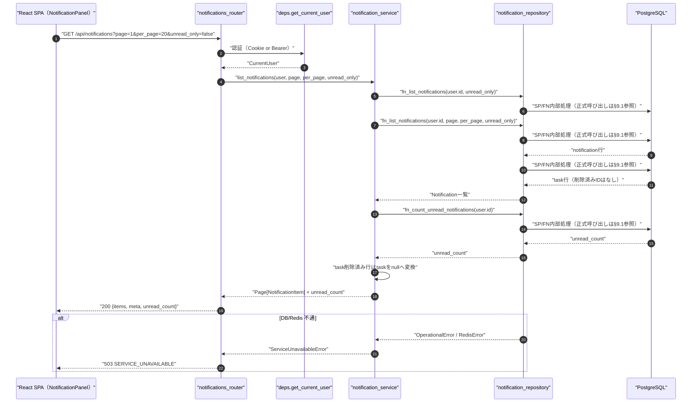
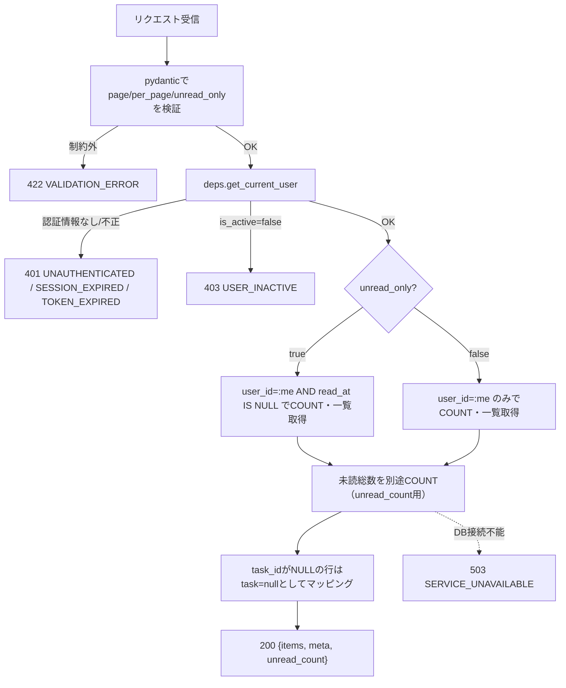
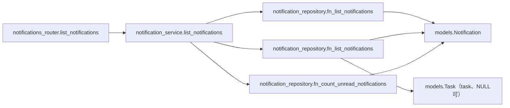
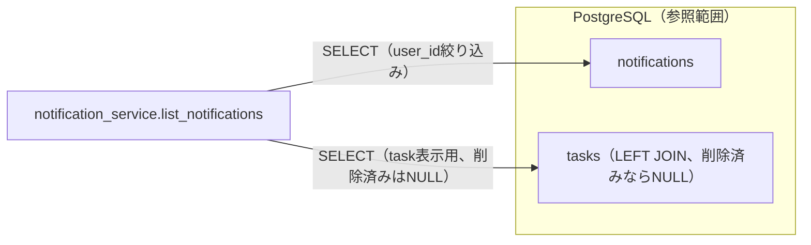

# GET /api/notifications（通知一覧取得）

## 0. 関連ドキュメント

| ドキュメント | 内容 |
|--------------|------|
| [../../../basic_design/04_api.md](../../../basic_design/04_api.md) | §2.6 通知エンドポイント一覧、§3.3 通知スキーマ、§4.2 エラーコード一覧、§5 認可マトリクス、§7.3 サービス層関数一覧 |
| [../../../basic_design/01_database.md](../../../basic_design/01_database.md) | §3.8 notifications、§4.1.1 通知の状態遷移 |
| [../../../basic_design/02_redis.md](../../../basic_design/02_redis.md) | §2 `session:{sid}`（認証確認のみ） |
| [../../../basic_design/05_frontend.md](../../../basic_design/05_frontend.md) | §3.1 通知ベルと通知パネル、§7.8 通知 |
| [../../auth/05_rbac.md](../../auth/05_rbac.md) | `get_current_user` の土台。本APIは project 系のRBACではなく「本人一致」で認可する |
| [../../database/10_table_notifications.md](../../database/10_table_notifications.md) | notifications テーブル詳細（`ix_notifications_user_created` 等） |
| [../../screen/06_dashboard.md](../../screen/06_dashboard.md) | 本APIを呼び出す通知パネル |
| [./02_get_notifications_unread_count.md](./02_get_notifications_unread_count.md) | 未読件数のみを返す軽量版（ポーリング用） |
| [./03_patch_notification_read.md](./03_patch_notification_read.md) | 個別既読化API（通知行クリックで呼ばれる） |
| [./04_post_notifications_read_all.md](./04_post_notifications_read_all.md) | 全既読化API |

## 1. 概要

| 項目 | 内容 |
|------|------|
| エンドポイント | `GET /api/notifications` |
| 目的 | ログインユーザー自身に宛てられた通知を新しい順に一覧取得する。通知パネル（[../../screen/06_dashboard.md](../../screen/06_dashboard.md) §3.1）を開いたときに呼ばれる |
| 認証 | 必要（session Cookie または `Authorization: Bearer`） |
| 認可 | 本人のみ（`user_id = current_user.id` に限定。project所属やロールは無関係）。admin であっても他人の通知は取得できない |
| CSRF検証 | 不要（参照系 GET） |
| Origin検証 | 不要（Cookie発行・更新系ではないため） |
| AUTH_MODE差異 | 差異なし（`deps.get_current_user` が方式差を吸収する） |
| 冪等性 | あり（GET） |
| レート制限 | user_id + 解決済みIP単位で120回/60秒。超過時は429 `TOO_MANY_ATTEMPTS`（`Retry-After`付き）、Redis障害時は503 |
| トランザクション境界 | 単一の読み取りトランザクション（更新なし） |

## 2. 入出力仕様

### 2.1 リクエスト

**クエリパラメータ**

| 名前 | 型 | 必須 | 制約 | 説明 |
|------|----|------|------|------|
| page | integer | 任意 | 1以上。既定 `1` | ページ番号 |
| per_page | integer | 任意 | 1〜100。既定 `20`（`core/config.py` の `PAGINATION_DEFAULT_PER_PAGE` / `PAGINATION_MAX_PER_PAGE`） | 1ページあたり件数 |
| unread_only | boolean | 任意 | 既定 `false` | `true` の場合未読のみに絞り込み、`meta.total` も未読件数になる |

パスパラメータ／ヘッダ（認証を除く）／ボディ：なし。

### 2.2 レスポンス

**`200 OK`**

```json
{
  "items": [
    {
      "id": "8f2a...",
      "type": "due_soon_batch",
      "title": "設計書をレビューする",
      "body": "期限が近いタスクです",
      "task": { "id": "b2e4...", "project_id": "3f1c...", "title": "設計書をレビューする" },
      "due_at": "2026-09-05T09:00:00Z",
      "read_at": null,
      "created_at": "2026-09-04T01:00:00Z"
    }
  ],
  "meta": { "page": 1, "per_page": 20, "total": 1, "total_pages": 1 },
  "unread_count": 1
}
```

| フィールド | 型 | NULL | 説明 |
|-----------|----|----|------|
| items[].id | string(uuid) | 不可 | 通知ID |
| items[].type | string | 不可 | `due_soon_batch` / `due_today_created` / `due_today_updated` のいずれか（`notifications.type` のCHECK制約に対応） |
| items[].title | string | 不可 | 通知見出し。作成時点のタスク名のスナップショット |
| items[].body | string | 可 | 補足本文 |
| items[].task | object | 可 | `{id, project_id, title}`。**対象タスクが削除済みの場合 `null`**。フロントは `null` のとき遷移リンクを描画しない（`task_id` が `notifications.task_id`、`ON DELETE SET NULL` で `NULL` 化された場合に相当） |
| items[].task.title | string | 不可（`task` が非null時） | タスクの**現在の**タイトル。`items[].title`（通知作成時点のスナップショット）とは一致しない場合がある（タスク改名後） |
| items[].due_at | string(datetime) | 可 | 通知作成時点の `tasks.due_at` のスナップショット。ISO 8601 UTC |
| items[].read_at | string(datetime) | 可 | 既読日時。`null` は未読 |
| items[].created_at | string(datetime) | 不可 | ISO 8601 UTC |
| meta.page / per_page / total / total_pages | integer | 不可 | ページング情報。`unread_only=true` 時は `total`/`total_pages` も未読分のみで算出 |
| unread_count | integer | 不可 | 現在の未読総数（`unread_only` の指定に関わらず全件を対象に算出）。一覧を開いた直後のバッジ表示に追加リクエストを要さないようにするため同梱する |

`Set-Cookie` なし。共通ヘッダ `X-Request-ID` を全レスポンスに付与する。

## 3. エラー仕様

| HTTP | code | 発生条件 | メッセージ | 備考 |
|------|------|----------|------------|------|
| 401 | `UNAUTHENTICATED` | Cookie／Bearerが無い、または無効 | 認証が必要です | `deps.get_current_user` |
| 401 | `SESSION_EXPIRED` | session方式でRedisにセッションが存在しない | セッションの有効期限が切れました | |
| 401 | `TOKEN_EXPIRED` / `TOKEN_INVALID` | jwt方式でアクセストークンが期限切れ／不正 | アクセストークンが無効です | |
| 403 | `USER_INACTIVE` | `users.is_active=false` | アカウントが無効化されています | |
| 422 | `VALIDATION_ERROR` | `page` / `per_page` が制約外、`unread_only` が boolean へ変換不可 | 入力内容に誤りがあります | `details` にフィールド情報 |
| 503 | `SERVICE_UNAVAILABLE` | PostgreSQL / Redis 接続不能 | しばらくしてから再度お試しください | fail-close |

`basic_design/04_api.md` §4.2 のエラーコード体系から逸脱しない。

## 4. 処理シーケンス



## 5. 処理フロー・分岐



## 6. 関数詳細

### 6.1 `api/routers/notifications_router.py :: list_notifications`

| 項目 | 内容 |
|------|------|
| シグネチャ | `async def list_notifications(page: int = 1, per_page: int = 20, unread_only: bool = False, user: CurrentUser = Depends(get_current_user), db: AsyncSession = Depends(get_db)) -> NotificationListResponse` |
| 引数 | `page`: クエリ、1以上 / `per_page`: クエリ、1〜100 / `unread_only`: クエリ、boolean / `user`: 認証済みユーザー / `db`: DBセッション |
| 戻り値 | `NotificationListResponse`（`items`, `meta`, `unread_count`） |
| 送出例外 | なし（サービス層の例外を `AppError` としてそのまま伝播、例外ハンドラが変換） |
| 処理内容 | 1. クエリパラメータを pydantic が検証 2. `notification_service.list_notifications` を呼び出す 3. 戻り値をそのままレスポンスとして返す |
| 副作用 | なし |

### 6.2 `service/notification_service.py :: list_notifications`

| 項目 | 内容 |
|------|------|
| シグネチャ | `async def list_notifications(user: CurrentUser, page: int, per_page: int, unread_only: bool, db: AsyncSession) -> tuple[Page[NotificationItem], int]` |
| 引数 | `user`: 現在ユーザー / `page`, `per_page`: ページング指定 / `unread_only`: 未読絞り込み / `db`: DBセッション |
| 戻り値 | `(Page[NotificationItem], unread_count)`。`Page` は `items: list[NotificationItem]`, `total: int` |
| 送出例外 | `ServiceUnavailableError`（PostgreSQL接続不能時）→503 |
| 処理内容 | 1. `SELECT fn_list_notifications(user.id, unread_only, limit, offset)` を1回呼び出す 2. `unread_only=false` の場合のみ `SELECT fn_count_unread_notifications(user.id)` を追加で呼び出す 3. FNの結果に含まれるtask情報を一括マッピングし、`task_id IS NULL` は `task=null` とする |
| 副作用 | なし（FN呼び出しのみ） |

### 6.3 `repository/notification_repository.py :: fn_list_notifications`

| 項目 | 内容 |
|------|------|
| シグネチャ | `async def fn_list_notifications(db: AsyncSession, user_id: UUID, page: int, per_page: int, unread_only: bool) -> list[Notification]` |
| 引数 | `user_id`: 対象ユーザー / `page`, `per_page`: ページング / `unread_only`: 未読絞り込み |
| 戻り値 | `fn_list_notifications` の結果を写像した `Notification` エンティティのリスト |
| 送出例外 | `OperationalError`（DB不通） |
| 処理内容 | `SELECT fn_list_notifications(:user_id, :unread_only, :limit, :offset)` のみを発行する。本人スコープ、未読条件、task結合、順序、ページングはFN内部で処理する |
| 副作用 | なし |

### 6.4 `repository/notification_repository.py :: fn_count_unread_notifications`

| 項目 | 内容 |
|------|------|
| シグネチャ | `async def fn_count_unread_notifications(db: AsyncSession, user_id: UUID) -> int` |
| 引数 | `user_id`: 対象ユーザー |
| 戻り値 | 未読件数 |
| 送出例外 | `OperationalError` |
| 処理内容 | `SELECT fn_count_unread_notifications(:user_id)` のみを発行する。未読条件とインデックス利用はFN内部で処理する（詳細は [./02_get_notifications_unread_count.md](./02_get_notifications_unread_count.md) §9） |
| 副作用 | なし |

## 7. 関数相関図



## 8. データ遷移図

読み取りのみで状態遷移なし。



## 9. SP/FNデータアクセス一覧

### 9.1 正式なDBアクセス契約

本APIのrepositoryは、次のSP/FN呼び出しとDTO写像だけを行う。

| 種別 | 契約 | 説明 |
|------|------|------|
| fn_list_notifications | `fn_list_notifications(p_user_id, p_unread_only, p_limit, p_offset)` | fn_list_notificationsを呼び出し、結果をレスポンスへ写像する |

repositoryはDBテーブルへ直結せず、SP/FN契約だけを呼び出す。 直下の従来のテーブルI/O表はSP/FN内部SQLの補足であり、repositoryの発行契約ではない。更新系の整合性制御、version検証、advisory lock、通知、SQLSTATE P0xxxはSP/FN層の責務である。存在・所属の事実判定はFNの空集合/falseを受け、404/403への変換はAPI層が行う。

**PostgreSQL**

| テーブル | 操作 | 条件 | 使用インデックス | 備考 |
|----------|------|------|-------------------|------|
| notifications | SELECT | `user_id = :me` [`AND read_at IS NULL`] | `ix_notifications_user_created (user_id, created_at DESC)` | 一覧取得。`ORDER BY created_at DESC LIMIT/OFFSET` |
| notifications | SELECT COUNT | 同上 | `ix_notifications_user_created`（`unread_only=false`）／`ix_notifications_user_unread`（`unread_only=true`） | `meta.total` 算出用 |
| notifications | SELECT COUNT | `user_id = :me AND read_at IS NULL` | `ix_notifications_user_unread (user_id) WHERE read_at IS NULL` | `unread_count` バッジ用 |
| tasks | SELECT | `notifications.task_id` に対する eager load | （PK） | タスク表示用、N+1回避。`task_id IS NULL` の行は結合されず `task=null` |

**Redis**

| キー | 操作 | TTL | 備考 |
|------|------|-----|------|
| `session:{sid}`（sessionモードのみ） | GET | `SESSION_TTL_SECONDS` | `deps.get_current_user` の認証確認のみで本APIの業務データではない |

## 10. バリデーション規則

| pydanticスキーマ | フィールド | 制約 | フロント（zod）との整合 |
|-------------------|-----------|------|--------------------------|
| `NotificationListQuery` | page | `int, ge=1`, 既定1 | `zod.number().int().min(1)` |
| `NotificationListQuery` | per_page | `int, ge=1, le=100`, 既定 `PAGINATION_DEFAULT_PER_PAGE`（20） | `zod.number().int().min(1).max(100)` |
| `NotificationListQuery` | unread_only | `bool`, 既定 `false` | `zod.boolean().optional()` |

## 11. 非機能・セキュリティ考慮

| 観点 | 内容 |
|------|------|
| ログ出力 | 監査ログ対象外（参照系）。アクセスログに `user_id`, `page`, `per_page`, `unread_only`, `X-Request-ID` を構造化出力 |
| ユーザー列挙対策 | 該当なし（`user_id = current_user.id` 固定で他人のデータへは到達しない設計。パスパラメータで他人のIDを渡す余地がないAPIのため404隠蔽は不要） |
| タイミング攻撃対策 | 該当なし |
| レート制限 | user_id + 解決済みIP単位で120回/60秒。フロントのポーリング間隔に依存せずサーバー側で制限する |
| fail-close方針 | PostgreSQL接続不能時は `503 SERVICE_UNAVAILABLE`。空配列を返して隠蔽しない |
| N+1対策・クエリ回数 | `fn_list_notifications` 1回 + 通知本体SELECT 1回 + taskの`FN結果の一括マッピング`追加SELECT 1回（taskを持つ通知行がある場合）。`unread_only=false` の場合は `fn_count_unread_notifications` 1回を加える。`unread_only=true` は `fn_list_notifications` の結果を再利用するため追加しない。関連取得は通知件数に比例して増えないが、同一ラウンドトリップではない |
| 個人情報の取り扱い | `title`/`body` はタスク作成者・担当者にのみ関わる業務情報であり、本人以外には返さない（本APIの認可自体がその境界を保証する） |

## 12. テスト設計

| No | 区分 | ケース | 前提 | 期待結果 | pytest関数名案 |
|----|------|--------|------|----------|-----------------|
| 1 | 結合（実DB・実SP） | 本人の通知のみ返す | 実DB・実SPで検証し `user_id=user.id` で呼ばれることを検証 | `fn_list_notifications(user.id, ...)` 呼び出し | `test_list_notifications_scoped_to_self` |
| 2 | 結合（実DB・実SP） | `unread_only=true` で未読のみ絞り込む | 実DB・実SPで検証 | `unread_only=True` が伝播、`fn_list_notifications` が未読件数のみ返す | `test_list_notifications_unread_only` |
| 3 | 単体 | task削除済み行は`task=null` | `task_id IS NULL` の行を含むモック | レスポンスの `task` が `null` | `test_list_notifications_task_deleted_returns_null` |
| 4 | 結合 | 空一覧時に0件で200を返す | 通知0件 | `items=[]`, `meta.total=0`, `unread_count=0` | `test_get_notifications_empty` |
| 5 | 結合 | ページングが正しく機能する | 通知25件を作成し `per_page=20` | 1ページ目20件・2ページ目5件、`total_pages=2` | `test_get_notifications_pagination` |
| 6 | 結合 | 他人の通知が混入しない | ユーザーA/Bそれぞれに通知を作成 | Aで取得した一覧にBの通知が含まれない | `test_get_notifications_isolated_by_user` |
| 7 | 結合 | 未認証は401 | Cookie/Bearerなし | `401 UNAUTHENTICATED` | `test_get_notifications_unauthenticated` |
| 8 | 結合 | per_page=101は422 | クエリ不正 | `422 VALIDATION_ERROR` | `test_get_notifications_invalid_per_page` |
| 9 | 結合 | unread_only=trueで既読通知が除外される | 既読1件・未読2件を作成 | `items` に未読2件のみ、`meta.total=2` | `test_get_notifications_unread_only_excludes_read` |

`AUTH_MODE=session` / `jwt` の両方で No.7（401判定経路の違い：`SESSION_EXPIRED` と `TOKEN_EXPIRED`）をパラメータ化して実施する。バッチ（[../../batch/02_due_notification_job.md](../../batch/02_due_notification_job.md)）による通知作成そのものはこのAPIのテスト範囲外とし、事前にDBへ直接INSERTしたフィクスチャで代替する。

## 13. 不明点・要検討事項

| 区分 | 内容 | 影響 |
|------|------|------|
| 要検討 | `items[].task.title`（現在のタスク名）と `items[].title`（通知作成時点のスナップショット）が異なる場合のフロント表示方針（どちらを主表示にするか）は基本設計に明記がないため本書での提案。フロント側（[../../screen/06_dashboard.md](../../screen/06_dashboard.md)）での明文化が望ましい |
| 不明 | `unread_only=true` かつ `page` が総ページ数を超えた場合に空配列 vs 422 のどちらを返すか。本書では他一覧APIに合わせ空配列（`items=[]`）を返す方針としたが、基本設計に明記がない |
