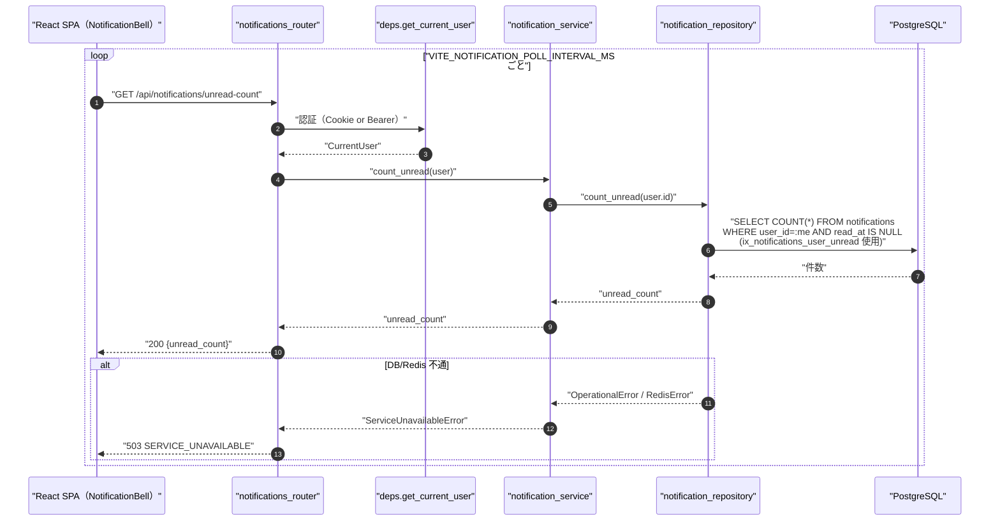
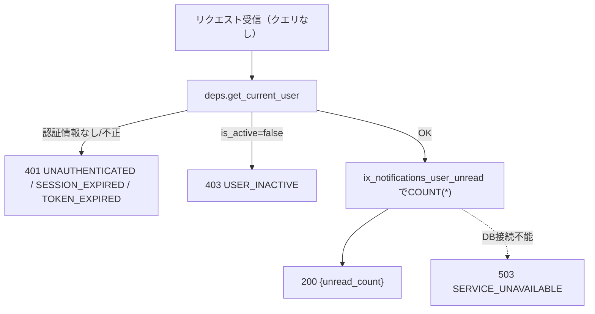
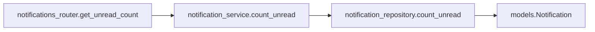
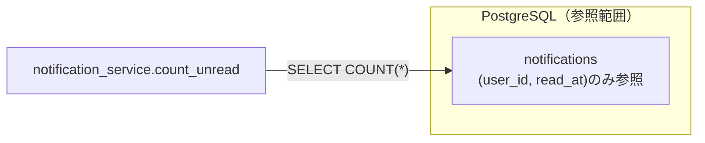

# GET /api/notifications/unread-count（未読件数取得・軽量版）

## 0. 関連ドキュメント

| ドキュメント | 内容 |
|--------------|------|
| [../../../basic_design/04_api.md](../../../basic_design/04_api.md) | §2.6 通知エンドポイント一覧、§3.3 通知スキーマ（`GET /notifications/unread-count`）、§4.2 エラーコード一覧、§5 認可マトリクス |
| [../../../basic_design/01_database.md](../../../basic_design/01_database.md) | §3.8 notifications（`ix_notifications_user_unread`） |
| [../../../basic_design/05_frontend.md](../../../basic_design/05_frontend.md) | §3.1 未読件数ポーリング、§7.8 通知、`VITE_NOTIFICATION_POLL_INTERVAL_MS` |
| [../../screen/06_dashboard.md](../../screen/06_dashboard.md) | 本APIを呼び出すNotificationBell（ヘッダー共通要素） |
| [./01_get_notifications.md](./01_get_notifications.md) | 通知一覧取得API（本APIと`unread_count`の算出ロジックを共有） |
| [./03_patch_notification_read.md](./03_patch_notification_read.md) | 個別既読化API（実行後にフロントが本APIの再取得もしくはキャッシュ更新を行う） |
| [./04_post_notifications_read_all.md](./04_post_notifications_read_all.md) | 全既読化API（同上） |

## 1. 概要

| 項目 | 内容 |
|------|------|
| エンドポイント | `GET /api/notifications/unread-count` |
| 目的 | 本人宛ての未読通知件数のみを返す最軽量エンドポイント。ヘッダーの `NotificationBell` からポーリングで最も高頻度に呼ばれる（[../../../basic_design/05_frontend.md](../../../basic_design/05_frontend.md) §3.1、間隔は `VITE_NOTIFICATION_POLL_INTERVAL_MS`、既定60000） |
| 認証 | 必要（session Cookie または `Authorization: Bearer`） |
| 認可 | 本人のみ（`user_id = current_user.id` に限定） |
| CSRF検証 | 不要（参照系 GET） |
| Origin検証 | 不要 |
| AUTH_MODE差異 | 差異なし |
| 冪等性 | あり（GET） |
| レート制限 | user_id + 解決済みIP単位で120回/60秒。超過時は429 `TOO_MANY_ATTEMPTS`（`Retry-After`付き）、Redis障害時は503 |
| トランザクション境界 | 単一の読み取り（`SELECT COUNT(*)` 1文のみ） |

## 2. 入出力仕様

### 2.1 リクエスト

クエリパラメータ／パスパラメータ／ヘッダ（認証を除く）／ボディ：なし。

### 2.2 レスポンス

**`200 OK`**

```json
{ "unread_count": 3 }
```

| フィールド | 型 | NULL | 説明 |
|-----------|----|----|------|
| unread_count | integer | 不可 | `user_id = current_user.id AND read_at IS NULL` の件数。0以上の整数 |

通知本体（`title`/`body`/`task` 等）は一切返さない。`Set-Cookie` なし。共通ヘッダ `X-Request-ID` を全レスポンスに付与する。

## 3. エラー仕様

| HTTP | code | 発生条件 | メッセージ | 備考 |
|------|------|----------|------------|------|
| 401 | `UNAUTHENTICATED` | Cookie／Bearerが無い、または無効 | 認証が必要です | `deps.get_current_user` |
| 401 | `SESSION_EXPIRED` | session方式でRedisにセッションが存在しない | セッションの有効期限が切れました | ポーリング中に発生した場合、フロントはポーリングを停止しログインへ誘導する（[../../../basic_design/05_frontend.md](../../../basic_design/05_frontend.md) §3.1 `enabled: false`） |
| 401 | `TOKEN_EXPIRED` / `TOKEN_INVALID` | jwt方式でアクセストークンが期限切れ／不正 | アクセストークンが無効です | jwtモードではフロントが `POST /auth/refresh` を試行してからリトライする（本APIの責務ではない） |
| 403 | `USER_INACTIVE` | `users.is_active=false` | アカウントが無効化されています | |
| 503 | `SERVICE_UNAVAILABLE` | PostgreSQL / Redis 接続不能 | しばらくしてから再度お試しください | fail-close。ポーリングは次回間隔で自動リトライされるため、本APIからの明示的なリトライ制御は行わない |

422系のクエリパラメータ検証は存在しない（クエリを受け取らないため）。`basic_design/04_api.md` §4.2 のエラーコード体系から逸脱しない。

## 4. 処理シーケンス



## 5. 処理フロー・分岐



## 6. 関数詳細

### 6.1 `api/routers/notifications_router.py :: get_unread_count`

| 項目 | 内容 |
|------|------|
| シグネチャ | `async def get_unread_count(user: CurrentUser = Depends(get_current_user), db: AsyncSession = Depends(get_db)) -> UnreadCountResponse` |
| 引数 | `user`: 認証済みユーザー / `db`: DBセッション |
| 戻り値 | `UnreadCountResponse`（`unread_count: int`） |
| 送出例外 | なし（サービス層の例外を `AppError` としてそのまま伝播） |
| 処理内容 | 1. `notification_service.count_unread(user, db)` を呼び出す 2. 戻り値をそのまま `{"unread_count": n}` として返す |
| 副作用 | なし |

### 6.2 `service/notification_service.py :: count_unread`

| 項目 | 内容 |
|------|------|
| シグネチャ | `async def count_unread(user: CurrentUser, db: AsyncSession) -> int` |
| 引数 | `user`: 現在ユーザー / `db`: DBセッション |
| 戻り値 | 未読件数（`int`） |
| 送出例外 | `ServiceUnavailableError`（PostgreSQL接続不能時）→503 |
| 処理内容 | `notification_repository.count_unread(db, user.id)` を呼び出してそのまま返す（サービス層での加工は行わない） |
| 副作用 | なし |

### 6.3 `repository/notification_repository.py :: count_unread`

[./01_get_notifications.md](./01_get_notifications.md) §6.4 と同一関数を共有する（一覧取得APIの `unread_count` 同梱ロジックと本APIは同じリポジトリ関数を呼ぶ）。

| 項目 | 内容 |
|------|------|
| シグネチャ | `async def count_unread(db: AsyncSession, user_id: UUID) -> int` |
| 引数 | `user_id`: 対象ユーザー |
| 戻り値 | 未読件数 |
| 送出例外 | `OperationalError` |
| 処理内容 | `SELECT COUNT(*) FROM notifications WHERE user_id = :user_id AND read_at IS NULL` を実行する |
| 副作用 | なし |

## 7. 関数相関図



## 8. データ遷移図

読み取りのみで状態遷移なし（本APIは `read_at` を含め一切の更新を行わない）。



## 9. データアクセス一覧

**PostgreSQL**

| テーブル | 操作 | 条件 | 使用インデックス | 備考 |
|----------|------|------|-------------------|------|
| notifications | SELECT COUNT | `user_id = :me AND read_at IS NULL` | `ix_notifications_user_unread (user_id) WHERE read_at IS NULL` | 部分インデックス。既読行を索引に含めないためインデックスサイズが未読件数に比例し小さく保たれる |

**Redis**

| キー | 操作 | TTL | 備考 |
|------|------|-----|------|
| `session:{sid}`（sessionモードのみ） | GET | `SESSION_TTL_SECONDS` | `deps.get_current_user` の認証確認のみ |

**性能・インデックス考慮（本APIの主眼）**

- 本APIはフロントの `NotificationBell` から `VITE_NOTIFICATION_POLL_INTERVAL_MS`（既定60000ms＝60秒）間隔で全ログインユーザーから継続的に呼ばれ続けるため、全通知系APIの中で最も呼び出し頻度が高い。そのため通知本体（`title`/`body`/`task`）を一切取得せず、`COUNT(*)` 1文のみで完結させる。
- `ix_notifications_user_unread` は `(user_id) WHERE read_at IS NULL` の**部分インデックス**であり、既読済み（`read_at IS NOT NULL`）の行は索引に含まれない。通知は既読化・保持期限切れ削除（`sp_purge_notifications`、`NOTIFICATION_RETENTION_DAYS`）により未読行が積み上がらない前提のため、このインデックスは常に小さく保たれ、`COUNT(*)` はインデックスオンリースキャンで完結する。
- `ix_notifications_user_created (user_id, created_at DESC)` は一覧取得（[./01_get_notifications.md](./01_get_notifications.md)）専用であり、本APIでは使用しない。
- 同時アクセス数（同時ログインユーザー数）に対するスケーラビリティは要検討（§13）。現状はPostgreSQLへの直接クエリのみで、Redisキャッシュ等の中間層は設けていない。

## 10. バリデーション規則

入力パラメータを受け取らないため、バリデーション対象はなし。

## 11. 非機能・セキュリティ考慮

| 観点 | 内容 |
|------|------|
| ログ出力 | 監査ログ対象外。ポーリング頻度が高いため、アクセスログへの出力は他APIより抑制する方針が望ましいが、抑制方式（サンプリング等）は基本設計に明記がなく要検討（§13） |
| ユーザー列挙対策 | 該当なし（`user_id = current_user.id` 固定） |
| タイミング攻撃対策 | 該当なし |
| レート制限 | user_id + 解決済みIP単位で120回/60秒。`VITE_NOTIFICATION_POLL_INTERVAL_MS`はUX制御であり、悪意あるクライアントにもサーバー側制限を適用する |
| fail-close方針 | PostgreSQL接続不能時は `503 SERVICE_UNAVAILABLE`。`unread_count: 0` を返してエラーを隠蔽しない |
| 負荷対策 | 単一 `COUNT(*)` かつ部分インデックス使用のため、行数の多いテーブルでも安定した応答時間を維持できる設計とした。将来的に同時ログインユーザー数が大きく増える場合、Redisへの短TTLキャッシュ導入は要検討（§13） |

## 12. テスト設計

| No | 区分 | ケース | 前提 | 期待結果 | pytest関数名案 |
|----|------|--------|------|----------|-----------------|
| 1 | 単体 | 未読件数をそのまま返す | repositoryをモックし `count_unread` が3を返す | レスポンス `{"unread_count": 3}` | `test_get_unread_count_returns_repository_value` |
| 2 | 単体 | 通知本体を取得するクエリを発行しない | repositoryをモック | `list_by_user` 等の一覧取得関数が呼ばれていないことを検証 | `test_get_unread_count_does_not_fetch_items` |
| 3 | 結合 | 未読0件で200を返す | 通知なし、または全件既読 | `{"unread_count": 0}` | `test_get_unread_count_zero` |
| 4 | 結合 | 既読化後にカウントが減る | 未読3件のうち1件を既読化 | `{"unread_count": 2}` | `test_get_unread_count_decreases_after_read` |
| 5 | 結合 | 他人の未読件数が混入しない | ユーザーA/Bにそれぞれ未読通知を作成 | Aの `unread_count` にBの件数を含まない | `test_get_unread_count_isolated_by_user` |
| 6 | 結合 | 未認証は401 | Cookie/Bearerなし | `401 UNAUTHENTICATED` | `test_get_unread_count_unauthenticated` |
| 7 | 結合 | 無効化ユーザーは403 | `is_active=false` | `403 USER_INACTIVE` | `test_get_unread_count_inactive_user` |
| 8 | 性能・回帰 | クエリ発行数が1回で完結する | SQLAlchemyのクエリカウンタで検証 | 発行SQLが `SELECT COUNT(*) ...` 1文のみ | `test_get_unread_count_single_query` |

`AUTH_MODE=session` / `jwt` の両方で No.6（401判定経路の違い：`SESSION_EXPIRED` と `TOKEN_EXPIRED`）をパラメータ化して実施する。実行計画が実際に `ix_notifications_user_unread` を使用しているか（`EXPLAIN` 確認）は自動テストでは網羅できない。理由：実行計画の選択はPostgreSQLのオプティマイザとテーブル統計情報に依存し、CI環境の小規模データでは異なる計画が選ばれ得るため、単体・結合テストでの厳密な検証対象からは外し、目視での `EXPLAIN ANALYZE` 確認を運用上の補完手段とする（要検討）。

## 13. 不明点・要検討事項

| 区分 | 内容 | 影響 |
|------|------|------|
| 要検討 | ポーリング高頻度化に伴うDB負荷が問題化した場合のキャッシュ戦略（Redisへの短TTLキャッシュ導入等）。基本設計（[../../../basic_design/02_redis.md](../../../basic_design/02_redis.md)）に本APIキャッシュ用のキー定義がないため本書では導入しない前提とした | 同時接続ユーザー数が多い場合のPostgreSQL負荷 |
| 要検討 | アクセスログのサンプリング方式（高頻度エンドポイントのログ量抑制） | ログストレージ容量・可観測性のトレードオフ |
| 不明 | クライアントがポーリング間隔を無視して高頻度リクエストした場合の挙動（現状は制限なし） | 悪意あるクライアントに対する耐性 |
