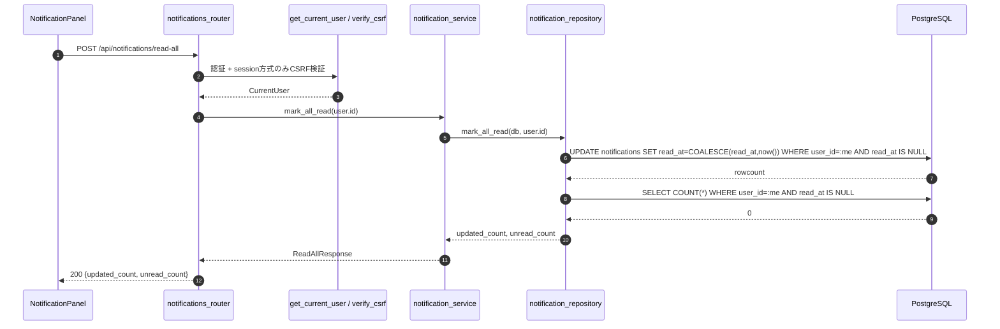

# POST /api/notifications/read-all（通知をすべて既読にする）

## 0. 関連ドキュメント

| ドキュメント | 内容 |
|--------------|------|
| [../../../basic_design/04_api.md](../../../basic_design/04_api.md) | §3.3 通知スキーマ、§4.2 エラーコード、§5 認可マトリクス |
| [../../../basic_design/01_database.md](../../../basic_design/01_database.md) | §3.8 notifications、§4.1.1 通知状態遷移 |
| [../../auth/03_csrf.md](../../auth/03_csrf.md) | session方式の更新系CSRF検証 |
| [../../database/10_table_notifications.md](../../database/10_table_notifications.md) | `mark_all_read` の更新条件と排他 |
| [../../../basic_design/05_frontend.md](../../../basic_design/05_frontend.md) | §3.1 「すべて既読にする」ボタン |

## 1. 概要

| 項目 | 内容 |
|------|------|
| エンドポイント | `POST /api/notifications/read-all` |
| 目的 | ログインユーザー自身の未読通知を一括で既読にする |
| 認証 | 必要（session Cookie または `Authorization: Bearer`） |
| 認可 | `notification.user_id = current_user.id` の本人一致のみ |
| CSRF検証 | 必要（session方式）。jwt方式は不要 |
| 冪等性 | あり。未読0件でも200を返す |
| レート制限 | user_id + 解決済みIP単位で60回/60秒。超過時は429 `TOO_MANY_ATTEMPTS`（`Retry-After`付き）、Redis障害時は503 |
| トランザクション境界 | `UPDATE` 1文と件数取得を1トランザクションで行う |

## 2. 入出力仕様

リクエストボディ、クエリ、パスパラメータはない。session方式では `X-CSRF-Token` と認証Cookieを受け取る。

**`200 OK`**

```json
{ "updated_count": 3, "unread_count": 0 }
```

`updated_count` は今回既読化した行数、`unread_count` は処理後の本人宛て未読総数である。`Set-Cookie` は発行せず、`X-Request-ID` を付与する。

## 3. エラー仕様

| HTTP | code | 発生条件 |
|------|------|----------|
| 401 | `UNAUTHENTICATED` / `SESSION_EXPIRED` / `TOKEN_EXPIRED` / `TOKEN_INVALID` | 認証情報がない、または無効 |
| 403 | `USER_INACTIVE` | current userが無効化済み |
| 403 | `CSRF_INVALID` | session方式でCSRFが欠落・不一致 |
| 503 | `SERVICE_UNAVAILABLE` | PostgreSQL / Redis接続不能 |

## 4. 処理シーケンス



## 5. 関数詳細

### 5.1 `api/routers/notifications_router.py :: mark_all_notifications_read`

| 項目 | 内容 |
|------|------|
| シグネチャ | `async def mark_all_notifications_read(user: CurrentUser = Depends(get_current_user), db: AsyncSession = Depends(get_db)) -> NotificationReadAllResponse` |
| 処理 | CSRF検証済みの本人IDをサービスへ渡し、結果をそのまま返す |
| 送出例外 | 認証・CSRF・DB接続系の共通例外 |
| 副作用 | 本人の未読通知の`read_at`更新 |

### 5.2 `service/notification_service.py :: mark_all_read`

`notification_repository.mark_all_read(db, user_id)`を呼び出す。ユーザーIDをリクエストから受け取らず、認証済みユーザーからのみ解決する。

### 5.3 `repository/notification_repository.py :: mark_all_read`

```sql
UPDATE notifications
   SET read_at = now()
 WHERE user_id = :user_id
   AND read_at IS NULL;
```

更新後に同じ `user_id AND read_at IS NULL` 条件でCOUNTし、レスポンスの`unread_count`を算出する。部分インデックス `ix_notifications_user_unread`を利用する。

## 6. 並行制御

個別既読化・ポーリング・全既読が同時に実行されても、`read_at IS NULL` 条件付きUPDATEが行ロック下で評価される。`updated_count`はそのトランザクションで実際に変更した行数であり、既読を二重計上しない。レスポンスの未読件数はフロントのキャッシュを上書きするが、次回ポーリングで再同期される。

## 7. テスト設計

| No | 区分 | ケース | 期待結果 | テスト名案 |
|----|------|--------|----------|------------|
| 1 | 結合 | 本人に未読3件 | 200、`updated_count=3`、`unread_count=0` | `test_mark_all_read_updates_own_unread_notifications` |
| 2 | 結合 | 未読0件で実行 | 200、`updated_count=0`、`unread_count=0` | `test_mark_all_read_empty_is_success` |
| 3 | 結合 | 他人の未読が存在 | 本人分だけ更新、他人分は未読のまま | `test_mark_all_read_never_updates_other_users` |
| 4 | 結合 | session方式でCSRF不正 | 403 `CSRF_INVALID`、DB更新なし | `test_mark_all_read_rejects_invalid_csrf` |
| 5 | 結合 | 個別既読と同時実行 | 件数が負にならず、最終的に本人の未読が0 | `test_mark_all_read_concurrent_mark_read_is_consistent` |
