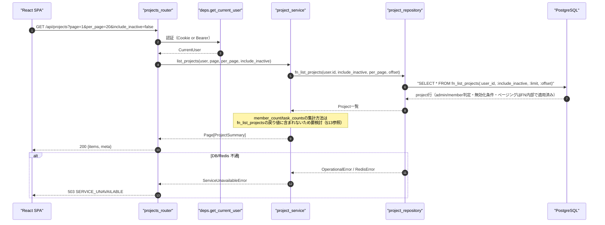
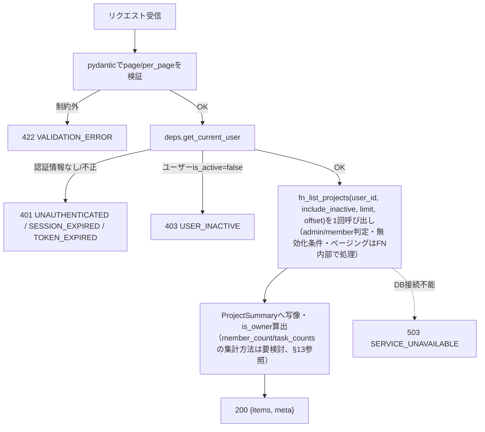
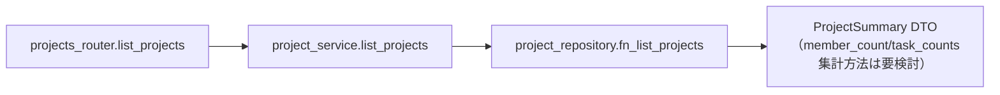
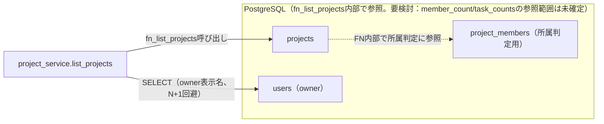

# GET /api/projects（所属プロジェクト一覧取得）

## 0. 関連ドキュメント

| ドキュメント | 内容 |
|--------------|------|
| [../../../basic_design/04_api.md](../../../basic_design/04_api.md) | §1 共通仕様、§2.3 プロジェクトAPI一覧、§3.2 スキーマ、§5 認可マトリクス、§7.2 サービス層関数一覧 |
| [../../../basic_design/01_database.md](../../../basic_design/01_database.md) | §3.3 projects、§3.4 project_members、§3.5 tasks、§7 主要クエリ（Q-2） |
| [../../../basic_design/03_auth.md](../../../basic_design/03_auth.md) | §9.2 `core/deps.py`（`get_current_user`） |
| [../screen/06_dashboard.md](../../screen/06_dashboard.md) | 本APIを呼び出す画面（ダッシュボード） |
| [./02_post_projects.md](./02_post_projects.md) | プロジェクト作成API（一覧に反映される） |

## 1. 概要

| 項目 | 内容 |
|------|------|
| エンドポイント | `GET /api/projects` |
| 目的 | ログインユーザーが所属するプロジェクトの一覧をページングして返す。ダッシュボード画面の初期表示に使用する |
| 認証 | 必要（session Cookie または `Authorization: Bearer`） |
| 認可 | member（自分の所属分のみ）／admin（全件）。無効化プロジェクト（`is_active=false`）の閲覧は、adminは無条件、memberは自分がオーナーのプロジェクトに限り可能（後述） |
| CSRF検証 | 不要（参照系 GET） |
| Origin検証 | 不要（Cookie発行・更新系ではないため） |
| AUTH_MODE差異 | 差異なし（`deps.get_current_user` が方式差を吸収する） |
| 冪等性 | あり（GET） |
| レート制限 | 対象外（一般APIのレート制限は未設定。ログイン失敗のみ `LOGIN_MAX_ATTEMPTS` 対象） |
| トランザクション境界 | 単一の読み取りトランザクション（`AsyncSession` の自動BEGIN、更新なし） |

## 2. 入出力仕様

### 2.1 リクエスト

**クエリパラメータ**

| 名前 | 型 | 必須 | 制約 | 説明 |
|------|----|------|------|------|
| page | integer | 任意 | 1以上。既定 `1` | ページ番号 |
| per_page | integer | 任意 | 1〜100。既定 `20`（`core/config.py` の `PAGINATION_DEFAULT_PER_PAGE` / `PAGINATION_MAX_PER_PAGE`） | 1ページあたり件数 |
| include_inactive | boolean | 任意 | 既定 `false` | `true` の場合、無効化（`is_active=false`）済みプロジェクトも一覧に含める。適用範囲は認可により異なる（下記参照） |

パスパラメータ／ヘッダ（認証ヘッダ・Cookieを除く）／ボディ：なし。

**`include_inactive` の適用範囲（確定方針）**

| ユーザー種別 | `include_inactive=false`（既定） | `include_inactive=true` |
|--------------|-----------------------------------|---------------------------|
| admin | `is_active=true` の全件 | 有効・無効を問わず全件 |
| member | 自分が所属する `is_active=true` のプロジェクトのみ | 上記に加えて、**自分がオーナーである** `is_active=false` のプロジェクトも含める。所属しているが非オーナーの無効化プロジェクトは対象外（他人が無効化した履歴を一覧から覗けないようにするため） |

無効化操作自体がオーナー/admin限定（`05_delete_project.md`参照）であることと対称になるよう、閲覧可能範囲も「無効化した本人＋admin」に限定する。

### 2.2 レスポンス

**`200 OK`**

```json
{
  "items": [
    {
      "id": "3f1c2a10-...",
      "name": "Cerberus開発",
      "description": "学習用タスク管理システムの開発",
      "owner": { "id": "1a2b...", "username": "taro", "display_name": "山田 太郎" },
      "member_count": 3,
      "task_counts": { "todo": 4, "in_progress": 2, "done": 7 },
      "is_owner": true,
      "is_active": true,
      "start_at": "2026-09-01T00:00:00Z",
      "end_at": null,
      "created_at": "2026-09-01T00:00:00Z"
    }
  ],
  "meta": { "page": 1, "per_page": 20, "total": 1, "total_pages": 1 }
}
```

| フィールド | 型 | NULL | 説明 |
|-----------|----|----|------|
| items[].id | string(uuid) | 不可 | プロジェクトID |
| items[].name | string | 不可 | プロジェクト名 |
| items[].description | string | 可 | 説明 |
| items[].owner.id / username | string | 不可 | オーナーの識別情報 |
| items[].owner.display_name | string | 不可 | `last_name + ' ' + first_name`（未設定項目があれば `username` を代替表示） |
| items[].member_count | integer | 不可 | `project_members` の件数 |
| items[].task_counts.todo / in_progress / done | integer | 不可 | status別タスク件数。0件のstatusも `0` を返す |
| items[].is_owner | boolean | 不可 | `owner_id == current_user.id` |
| items[].is_active | boolean | 不可 | 論理削除フラグ。`false` は無効化（論理削除）済みを示す |
| items[].start_at | string(datetime) | 可 | プロジェクト開始日時。ISO 8601 UTC |
| items[].end_at | string(datetime) | 可 | プロジェクト終了日時。ISO 8601 UTC |
| items[].created_at | string(datetime) | 不可 | ISO 8601 UTC |
| meta.page / per_page / total / total_pages | integer | 不可 | ページング情報 |

`Set-Cookie` なし。共通ヘッダ `X-Request-ID` を全レスポンスに付与する。

## 3. エラー仕様

| HTTP | code | 発生条件 | メッセージ | 備考 |
|------|------|----------|------------|------|
| 401 | `UNAUTHENTICATED` | Cookie／Bearerが無い、または無効 | 認証が必要です | `deps.get_current_user` |
| 401 | `SESSION_EXPIRED` | session方式でRedisにセッションが存在しない | セッションの有効期限が切れました | |
| 401 | `TOKEN_EXPIRED` / `TOKEN_INVALID` | jwt方式でアクセストークンが期限切れ／不正 | アクセストークンが無効です | |
| 403 | `USER_INACTIVE` | `users.is_active=false` | アカウントが無効化されています | |
| 422 | `VALIDATION_ERROR` | `page` / `per_page` が制約外 | 入力内容に誤りがあります | `details` にフィールド情報 |
| 503 | `SERVICE_UNAVAILABLE` | PostgreSQL / Redis 接続不能 | しばらくしてから再度お試しください | fail-close |

`basic_design/04_api.md` §4.2 のエラーコード体系から逸脱しない。

## 4. 処理シーケンス



## 5. 処理フロー・分岐



## 6. 関数詳細

### 6.1 `api/routers/projects_router.py :: list_projects`

| 項目 | 内容 |
|------|------|
| シグネチャ | `async def list_projects(page: int = 1, per_page: int = 20, include_inactive: bool = False, user: CurrentUser = Depends(get_current_user), db: AsyncSession = Depends(get_db)) -> ProjectListResponse` |
| 引数 | `page`: クエリ、1以上 / `per_page`: クエリ、1〜100 / `include_inactive`: クエリ、既定`False` / `user`: 認証済みユーザー / `db`: DBセッション |
| 戻り値 | `ProjectListResponse`（`items`, `meta`） |
| 送出例外 | なし（サービス層の例外を `AppError` としてそのまま伝播、例外ハンドラが変換） |
| 処理内容 | 1. `page`/`per_page`/`include_inactive` の範囲を pydantic が検証 2. `project_service.list_projects` を呼び出す 3. 戻り値をそのままレスポンスとして返す |
| 副作用 | なし |

### 6.2 `service/project_service.py :: list_projects`

| 項目 | 内容 |
|------|------|
| シグネチャ | `async def list_projects(user: CurrentUser, page: int, per_page: int, include_inactive: bool, db: AsyncSession) -> Page[ProjectSummary]` |
| 引数 | `user`: 現在ユーザー / `page`, `per_page`: ページング指定 / `include_inactive`: 無効化プロジェクトを含めるか / `db`: DBセッション |
| 戻り値 | `Page[ProjectSummary]`（`items: list[ProjectSummary]`, `total: int`） |
| 送出例外 | `ServiceUnavailableError`（PostgreSQL接続不能時）→503 |
| 処理内容 | `SELECT fn_list_projects(:user_id, :include_inactive, :limit, :offset)` を1回呼び出し、戻り値の`projects`行を`ProjectSummary`へ写像する。権限スコープ、無効化条件、ページングはFN内部で処理する。**要検討**：`08_db_functions.md`の`fn_list_projects`は`SETOF projects`のみを返し、`member_count`/`task_counts`の集計は含まれない。これらの集計をFN内部へ追加するか、別途SP/FNを新設するかは未確定であり、現時点の設計では確定していない |
| 副作用 | なし（読み取りのみ） |

### 6.3 `repository/project_repository.py :: fn_list_projects`

| 項目 | 内容 |
|------|------|
| シグネチャ | `async def fn_list_projects(db: AsyncSession, user_id: UUID, page: int, per_page: int, include_inactive: bool) -> list[ProjectSummaryRow]` |
| 引数 | `user_id`: 所属確認対象 / `page`, `per_page`: ページング / `include_inactive`: 自分がオーナーの無効化分を含めるか |
| 戻り値 | `fn_list_projects` の結果を写像した行のリスト |
| 送出例外 | `OperationalError`（DB不通） |
| 処理内容 | `SELECT fn_list_projects(:user_id, :include_inactive, :limit, :offset)` のみを発行する。所属/admin・無効化条件、並び順、ページングはFN内部で処理する |
| 副作用 | なし |

### 6.4 service層のDTO写像

| 項目 | 内容 |
|------|------|
| シグネチャ | `ProjectSummary`へのFN結果写像 |
| 引数 | `fn_list_projects`が返した`projects`行 |
| 戻り値 | `ProjectSummary`（`is_owner`は`owner_id == current_user.id`から算出） |
| 送出例外 | なし |
| 処理内容 | FNが返した`projects`行を`ProjectSummary`へ写像し、`is_owner`を算出する。**要検討**：`member_count`/`task_counts`は`fn_list_projects`の戻り値に含まれないため、本設計時点では集計方法・追加呼び出しの要否が未確定（§13参照） |
| 副作用 | なし |

## 7. 関数相関図



## 8. データ遷移図

読み取りのみで状態遷移なし。



## 9. SP/FNデータアクセス一覧

### 9.1 正式なDBアクセス契約

本APIのrepositoryは、次のSP/FN呼び出しとDTO写像だけを行う。

| 種別 | 契約 | 説明 |
|------|------|------|
| fn_list_projects | `fn_list_projects(p_user_id, p_include_inactive, p_limit, p_offset)` | fn_list_projectsを呼び出し、結果をレスポンスへ写像する |

repositoryはDBテーブルへ直結せず、SP/FN契約だけを呼び出す。 直下の従来のテーブルI/O表はSP/FN内部SQLの補足であり、repositoryの発行契約ではない。更新系の整合性制御、version検証、advisory lock、通知、SQLSTATE P0xxxはSP/FN層の責務である。存在・所属の事実判定はFNの空集合/falseを受け、404/403への変換はAPI層が行う。

**PostgreSQL**

| テーブル | 操作 | 条件 | 備考 |
|----------|------|------|------|
| projects | `fn_list_projects`内部でSELECT | admin: `include_inactive`次第で全件 or `is_active=true`のみ / member: `project_members`結合で所属分のみ、かつ`is_active=true OR (include_inactive AND owner_id=:me)` | `ORDER BY created_at DESC LIMIT/OFFSET`、`meta.total`算出用の件数もFN呼び出し結果から導出する |
| users | SELECT | `projects.owner_id` に対する eager load | owner表示用、N+1回避。`fn_list_projects`契約には含まれない補助SELECT |

**要検討**：`member_count`（`project_members`集計）・`task_counts`（`tasks`のstatus別集計）は`fn_list_projects`の戻り値（`SETOF projects`）に含まれない。`08_db_functions.md`にはこれらを賄うSP/FNが定義されておらず、repositoryが`project_members`/`tasks`へ直接SELECTすることは「repositoryはSP/FN呼び出しとDTO写像だけを行う」という方針（`08_db_functions.md` §1）に反する。FN拡張・別FN新設のいずれにするかは未確定であり、本設計時点では確定していない。

**Redis**

| キー | 操作 | TTL | 備考 |
|------|------|-----|------|
| `session:{sid}`（sessionモードのみ） | GET | `SESSION_TTL_SECONDS` | `deps.get_current_user` の認証確認のみで本APIの業務データではない |

## 10. バリデーション規則

| pydanticスキーマ | フィールド | 制約 | フロント（zod）との整合 |
|-------------------|-----------|------|--------------------------|
| `ProjectListQuery` | page | `int, ge=1`, 既定1 | `zod.number().int().min(1)` |
| `ProjectListQuery` | per_page | `int, ge=1, le=100`, 既定 `PAGINATION_DEFAULT_PER_PAGE`（20） | `zod.number().int().min(1).max(100)` |
| `ProjectListQuery` | include_inactive | `bool`, 既定 `False` | `zod.boolean().optional().default(false)` |

## 11. 非機能・セキュリティ考慮

| 観点 | 内容 |
|------|------|
| ログ出力 | 監査ログ対象外（参照系）。アクセスログに `user_id`, `role`, `page`, `per_page`, `X-Request-ID` を構造化出力 |
| ユーザー列挙対策 | 該当なし（自分の所属情報のみ返す） |
| タイミング攻撃対策 | 該当なし |
| レート制限 | なし（一般GETは対象外） |
| fail-close方針 | PostgreSQL接続不能時は `503 SERVICE_UNAVAILABLE`。空配列を返して隠蔽しない |
| N+1対策・クエリ回数 | `fn_list_projects`呼び出し1回 + ownerの一括eager load用SELECT 1回の計2回。owner取得は同一ラウンドトリップではないが、プロジェクト件数に比例しない。空ページではowner SELECTを発行せず1回のみ。**要検討**：member_count/task_counts集計を追加する場合のクエリ回数は集計方式の確定後に見直す |

## 12. テスト設計

| No | 区分 | ケース | 前提 | 期待結果 | pytest関数名案 |
|----|------|--------|------|----------|-----------------|
| 1 | 結合（実DB・実SP） | memberは自分の所属分のみ返す | 実DB・実SPで検証 | `fn_list_projects`が所属分のみ返す | `test_list_projects_member_scope` |
| 2 | 結合（実DB・実SP） | adminは全件を返す | 実DB・実SPで検証 | `fn_list_projects`が全件返す | `test_list_projects_admin_scope` |
| 3 | 単体 | task_countsの未発生statusは0補完（要検討：集計方法確定後に実装） | 集計辞書に一部statusのみ含む | 全status keyが存在し値0を含む | `test_list_projects_task_counts_zero_fill` |
| 4 | 結合 | 空一覧時に不要な追加SELECTを発行しない | 所属プロジェクト0件 | `items=[]`, `meta.total=0`、SQLログにowner取得クエリなし | `test_list_projects_empty` |
| 5 | 結合 | ページングが正しく機能する | プロジェクト25件を作成し `per_page=20` | 1ページ目20件・2ページ目5件、`total_pages=2` | `test_list_projects_pagination` |
| 6 | 結合 | 未認証は401 | Cookie/Bearerなし | `401 UNAUTHENTICATED` | `test_list_projects_unauthenticated` |
| 7 | 結合 | per_page=101は422 | クエリ不正 | `422 VALIDATION_ERROR` | `test_list_projects_invalid_per_page` |
| 8 | 結合 | N+1が発生しないことの確認 | プロジェクト10件、SQLAlchemyの実DBの呼び出し回数を検証 | 発行クエリ数が定数（プロジェクト件数に比例しない） | `test_list_projects_query_count_constant` |
| 9 | 結合 | 既定（include_inactive未指定）では無効化プロジェクトが一覧に含まれない | 所属プロジェクトのうち1件を`is_active=false`にしておく | `items`に含まれない、`meta.total`も減算される | `test_list_projects_excludes_inactive_by_default` |
| 10 | 結合 | memberがinclude_inactive=trueを指定しても非オーナーの無効化プロジェクトは見えない | 自分が非オーナーで所属する`is_active=false`プロジェクトを用意 | `items`に含まれない | `test_list_projects_member_cannot_see_others_inactive` |
| 11 | 結合 | memberがinclude_inactive=trueを指定すると自分がオーナーの無効化プロジェクトが見える | 自分がオーナーの`is_active=false`プロジェクトを用意 | `items`に含まれ`is_active=false`で返る | `test_list_projects_member_sees_own_inactive` |
| 12 | 結合 | adminがinclude_inactive=trueを指定すると全ユーザーの無効化プロジェクトが見える | 他人がオーナーの`is_active=false`プロジェクトを用意 | `items`に含まれる | `test_list_projects_admin_sees_all_inactive` |

`AUTH_MODE=session` / `jwt` の両方で No.6（401判定経路の違い：`SESSION_EXPIRED` と `TOKEN_EXPIRED`）をパラメータ化して実施する。Google連携そのものは対象外（認証確立後の一覧取得のみを検証するため）。

## 13. 不明点・要検討事項

| 区分 | 内容 | 影響 |
|------|------|------|
| 確定 | `owner.display_name` は`last_name`と`first_name`がともに空でない場合に結合し、それ以外は`username`へフォールバックする | OAuth新規ユーザーなど姓名未設定でも表示名を必ず返す |
| 確定 | `include_inactive` の可視範囲は「admin: 全件」「member: 自分がオーナーの無効化分のみ追加」とした（issue #10のブリーフで詳細判断を委譲されたため設計として確定） | 非オーナーメンバーは他人が無効化した履歴を一覧から閲覧できない |
| 要検討 | `08_db_functions.md`の`fn_list_projects`は`SETOF projects`のみを返し、レスポンスに必要な`member_count`（`project_members`集計）・`task_counts`（`tasks`のstatus別集計）を含まない。集計をFN内部へ追加するか、別途集計用SP/FNを新設するかは未確定 | 確定するまでrepositoryが`project_members`/`tasks`へ直接SELECTすることになり、「repositoryはSP/FN呼び出しのみ」という方針（`08_db_functions.md` §1）に反する状態が残る |
