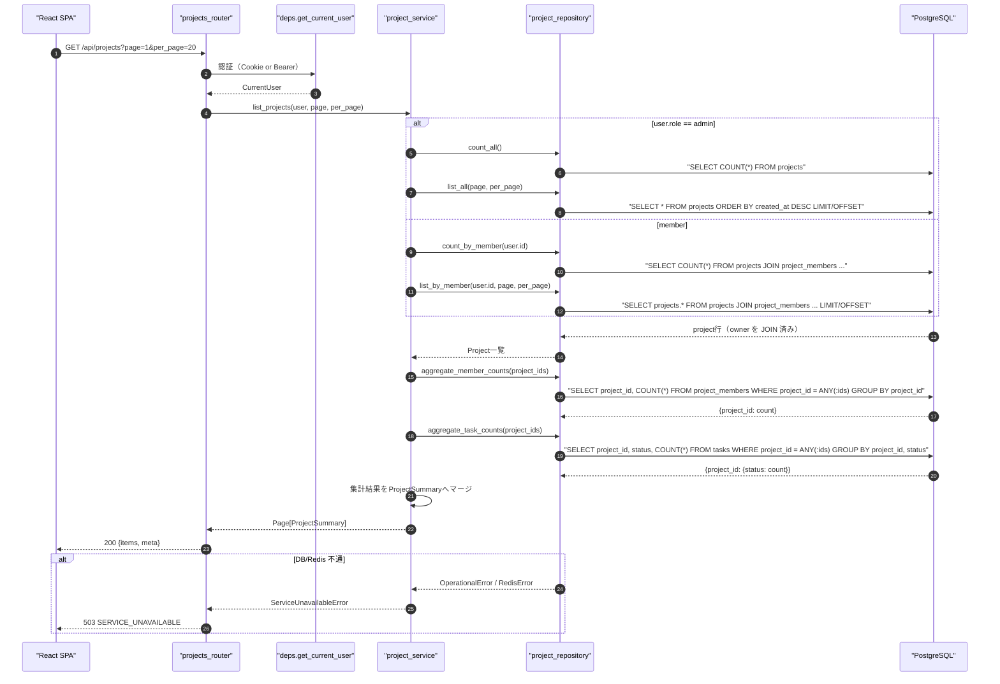
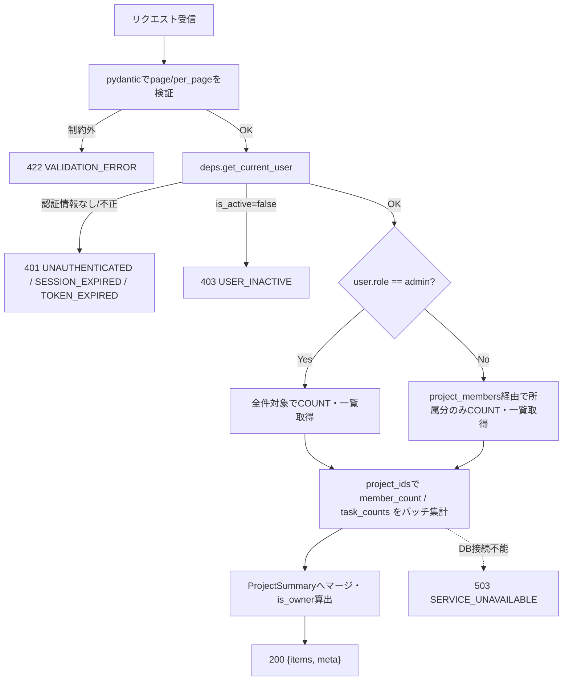
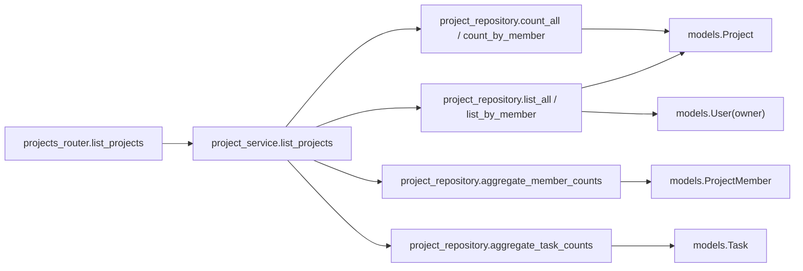
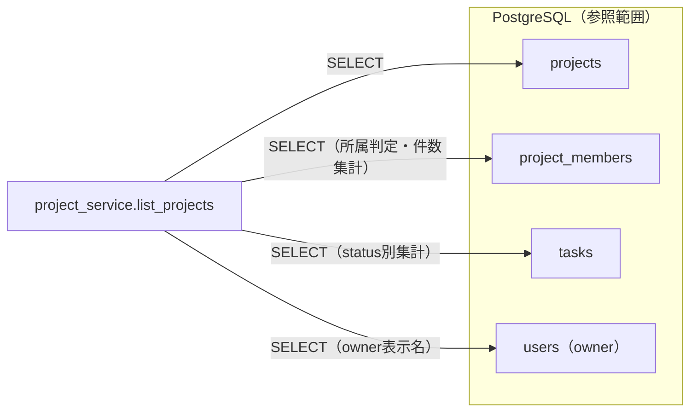

# GET /api/projects（所属プロジェクト一覧取得）

## 0. 関連ドキュメント

| ドキュメント | 内容 |
|--------------|------|
| [../../../basic_design/04_api.md](../../../basic_design/04_api.md) | §1 共通仕様、§2.3 プロジェクトAPI一覧、§3.2 スキーマ、§5 認可マトリクス、§7.2 サービス層関数一覧 |
| [../../../basic_design/01_database.md](../../../basic_design/01_database.md) | §3.3 projects、§3.4 project_members、§3.5 tasks、§7 主要クエリ（Q-2） |
| [../../../basic_design/03_auth.md](../../../basic_design/03_auth.md) | §9.2 `core/deps.py`（`get_current_user`） |
| [../screen/06_dashboard.md](../../screen/06_dashboard.md) | 本APIを呼び出す画面（ダッシュボード） |
| [./02_post_projects.md](./02_post_projects.md) | プロジェクト作成API（一覧に反映される） |

## 1. 概要

| 項目 | 内容 |
|------|------|
| エンドポイント | `GET /api/projects` |
| 目的 | ログインユーザーが所属するプロジェクトの一覧をページングして返す。ダッシュボード画面の初期表示に使用する |
| 認証 | 必要（session Cookie または `Authorization: Bearer`） |
| 認可 | member（自分の所属分のみ）／admin（全件） |
| CSRF検証 | 不要（参照系 GET） |
| Origin検証 | 不要（Cookie発行・更新系ではないため） |
| AUTH_MODE差異 | 差異なし（`deps.get_current_user` が方式差を吸収する） |
| 冪等性 | あり（GET） |
| レート制限 | 対象外（一般APIのレート制限は未設定。ログイン失敗のみ `LOGIN_MAX_ATTEMPTS` 対象） |
| トランザクション境界 | 単一の読み取りトランザクション（`AsyncSession` の自動BEGIN、更新なし） |

## 2. 入出力仕様

### 2.1 リクエスト

**クエリパラメータ**

| 名前 | 型 | 必須 | 制約 | 説明 |
|------|----|------|------|------|
| page | integer | 任意 | 1以上。既定 `1` | ページ番号 |
| per_page | integer | 任意 | 1〜100。既定 `20`（`core/config.py` の `PAGINATION_DEFAULT_PER_PAGE` / `PAGINATION_MAX_PER_PAGE`） | 1ページあたり件数 |

パスパラメータ／ヘッダ（認証ヘッダ・Cookieを除く）／ボディ：なし。

### 2.2 レスポンス

**`200 OK`**

```json
{
  "items": [
    {
      "id": "3f1c2a10-...",
      "name": "Cerberus開発",
      "description": "学習用タスク管理システムの開発",
      "owner": { "id": "1a2b...", "username": "taro", "display_name": "山田 太郎" },
      "member_count": 3,
      "task_counts": { "todo": 4, "in_progress": 2, "done": 7 },
      "is_owner": true,
      "created_at": "2026-09-01T00:00:00Z"
    }
  ],
  "meta": { "page": 1, "per_page": 20, "total": 1, "total_pages": 1 }
}
```

| フィールド | 型 | NULL | 説明 |
|-----------|----|----|------|
| items[].id | string(uuid) | 不可 | プロジェクトID |
| items[].name | string | 不可 | プロジェクト名 |
| items[].description | string | 可 | 説明 |
| items[].owner.id / username | string | 不可 | オーナーの識別情報 |
| items[].owner.display_name | string | 不可 | `last_name + ' ' + first_name`（未設定項目があれば `username` を代替表示） |
| items[].member_count | integer | 不可 | `project_members` の件数 |
| items[].task_counts.todo / in_progress / done | integer | 不可 | status別タスク件数。0件のstatusも `0` を返す |
| items[].is_owner | boolean | 不可 | `owner_id == current_user.id` |
| items[].created_at | string(datetime) | 不可 | ISO 8601 UTC |
| meta.page / per_page / total / total_pages | integer | 不可 | ページング情報 |

`Set-Cookie` なし。共通ヘッダ `X-Request-ID` を全レスポンスに付与する。

## 3. エラー仕様

| HTTP | code | 発生条件 | メッセージ | 備考 |
|------|------|----------|------------|------|
| 401 | `UNAUTHENTICATED` | Cookie／Bearerが無い、または無効 | 認証が必要です | `deps.get_current_user` |
| 401 | `SESSION_EXPIRED` | session方式でRedisにセッションが存在しない | セッションの有効期限が切れました | |
| 401 | `TOKEN_EXPIRED` / `TOKEN_INVALID` | jwt方式でアクセストークンが期限切れ／不正 | アクセストークンが無効です | |
| 403 | `USER_INACTIVE` | `users.is_active=false` | アカウントが無効化されています | |
| 422 | `VALIDATION_ERROR` | `page` / `per_page` が制約外 | 入力内容に誤りがあります | `details` にフィールド情報 |
| 503 | `SERVICE_UNAVAILABLE` | PostgreSQL / Redis 接続不能 | しばらくしてから再度お試しください | fail-close |

`basic_design/04_api.md` §4.2 のエラーコード体系から逸脱しない。

## 4. 処理シーケンス



## 5. 処理フロー・分岐



## 6. 関数詳細

### 6.1 `api/routers/projects_router.py :: list_projects`

| 項目 | 内容 |
|------|------|
| シグネチャ | `async def list_projects(page: int = 1, per_page: int = 20, user: CurrentUser = Depends(get_current_user), db: AsyncSession = Depends(get_db)) -> ProjectListResponse` |
| 引数 | `page`: クエリ、1以上 / `per_page`: クエリ、1〜100 / `user`: 認証済みユーザー / `db`: DBセッション |
| 戻り値 | `ProjectListResponse`（`items`, `meta`） |
| 送出例外 | なし（サービス層の例外を `AppError` としてそのまま伝播、例外ハンドラが変換） |
| 処理内容 | 1. `page`/`per_page` の範囲を pydantic が検証 2. `project_service.list_projects` を呼び出す 3. 戻り値をそのままレスポンスとして返す |
| 副作用 | なし |

### 6.2 `service/project_service.py :: list_projects`

| 項目 | 内容 |
|------|------|
| シグネチャ | `async def list_projects(user: CurrentUser, page: int, per_page: int, db: AsyncSession) -> Page[ProjectSummary]` |
| 引数 | `user`: 現在ユーザー / `page`, `per_page`: ページング指定 / `db`: DBセッション |
| 戻り値 | `Page[ProjectSummary]`（`items: list[ProjectSummary]`, `total: int`） |
| 送出例外 | `ServiceUnavailableError`（PostgreSQL接続不能時）→503 |
| 処理内容 | 1. `user.role` により `project_repository.count_all` / `count_by_member` と `list_all` / `list_by_member` を選択 2. 取得した `project_ids` を用いて `aggregate_member_counts` と `aggregate_task_counts` をそれぞれ1回ずつ呼び出す 3. Python側の辞書ルックアップで各プロジェクトへ `member_count` / `task_counts` をマージ（未集計statusは `0` 補完） 4. `is_owner = (project.owner_id == user.id)` を算出し `ProjectSummary` を組み立てる |
| 副作用 | なし（読み取りのみ） |

### 6.3 `repository/project_repository.py :: list_by_member`

| 項目 | 内容 |
|------|------|
| シグネチャ | `async def list_by_member(db: AsyncSession, user_id: UUID, page: int, per_page: int) -> list[Project]` |
| 引数 | `user_id`: 所属確認対象 / `page`, `per_page`: ページング |
| 戻り値 | `owner` を eager load 済みの `Project` エンティティのリスト |
| 送出例外 | `OperationalError`（DB不通） |
| 処理内容 | 1. `projects JOIN project_members ON projects.id = project_members.project_id WHERE project_members.user_id = :user_id` 2. `selectinload(Project.owner)` で owner を同一往復で解決（N+1回避） 3. `ORDER BY projects.created_at DESC` 4. `OFFSET (page-1)*per_page LIMIT per_page` |
| 副作用 | なし |

### 6.4 `repository/project_repository.py :: aggregate_member_counts` / `aggregate_task_counts`

| 項目 | 内容 |
|------|------|
| シグネチャ | `async def aggregate_member_counts(db: AsyncSession, project_ids: list[UUID]) -> dict[UUID, int]` ／ `async def aggregate_task_counts(db: AsyncSession, project_ids: list[UUID]) -> dict[UUID, dict[str, int]]` |
| 引数 | `project_ids`: 当該ページに含まれるプロジェクトIDの一覧（最大 `per_page` 件） |
| 戻り値 | `project_id` をキーとした集計結果の辞書 |
| 送出例外 | `OperationalError` |
| 処理内容 | 1. `project_ids` が空なら空辞書を返す（クエリを発行しない） 2. `member_count`: `SELECT project_id, COUNT(*) FROM project_members WHERE project_id = ANY(:ids) GROUP BY project_id` 3. `task_counts`: `SELECT project_id, status, COUNT(*) FROM tasks WHERE project_id = ANY(:ids) GROUP BY project_id, status` 4. ページ内のプロジェクト件数に依らずそれぞれ1クエリで完結させ、N+1を回避する |
| 副作用 | なし |

## 7. 関数相関図



## 8. データ遷移図

読み取りのみで状態遷移なし。



## 9. データアクセス一覧

**PostgreSQL**

| テーブル | 操作 | 条件 | 備考 |
|----------|------|------|------|
| projects | SELECT | admin: 全件 / member: `JOIN project_members WHERE user_id=:me` | `ORDER BY created_at DESC LIMIT/OFFSET` |
| projects | SELECT COUNT | 同上 | `meta.total` 算出用 |
| users | SELECT | `projects.owner_id` に対する eager load | owner表示用、N+1回避 |
| project_members | SELECT + GROUP BY | `project_id = ANY(:ids)` | `member_count` 集計 |
| tasks | SELECT + GROUP BY | `project_id = ANY(:ids)` | `task_counts` 集計 |

**Redis**

| キー | 操作 | TTL | 備考 |
|------|------|-----|------|
| `session:{sid}`（sessionモードのみ） | GET | `SESSION_TTL_SECONDS` | `deps.get_current_user` の認証確認のみで本APIの業務データではない |

## 10. バリデーション規則

| pydanticスキーマ | フィールド | 制約 | フロント（zod）との整合 |
|-------------------|-----------|------|--------------------------|
| `ProjectListQuery` | page | `int, ge=1`, 既定1 | `zod.number().int().min(1)` |
| `ProjectListQuery` | per_page | `int, ge=1, le=100`, 既定 `PAGINATION_DEFAULT_PER_PAGE`（20） | `zod.number().int().min(1).max(100)` |

## 11. 非機能・セキュリティ考慮

| 観点 | 内容 |
|------|------|
| ログ出力 | 監査ログ対象外（参照系）。アクセスログに `user_id`, `role`, `page`, `per_page`, `X-Request-ID` を構造化出力 |
| ユーザー列挙対策 | 該当なし（自分の所属情報のみ返す） |
| タイミング攻撃対策 | 該当なし |
| レート制限 | なし（一般GETは対象外） |
| fail-close方針 | PostgreSQL接続不能時は `503 SERVICE_UNAVAILABLE`。空配列を返して隠蔽しない |
| N+1対策 | owner は `selectinload` で1往復、`member_count`/`task_counts` はプロジェクト件数に依らず定数回のクエリ（バッチ集計）に抑える |

## 12. テスト設計

| No | 区分 | ケース | 前提 | 期待結果 | pytest関数名案 |
|----|------|--------|------|----------|-----------------|
| 1 | 単体 | memberは自分の所属分のみ返す | repositoryをモックし `list_by_member` が呼ばれることを検証 | `count_by_member`/`list_by_member` 呼び出し、`list_all`未呼び出し | `test_list_projects_member_scope` |
| 2 | 単体 | adminは全件を返す | repositoryをモック | `count_all`/`list_all` 呼び出し | `test_list_projects_admin_scope` |
| 3 | 単体 | task_countsの未発生statusは0補完 | 集計辞書に一部statusのみ含む | 全status keyが存在し値0を含む | `test_list_projects_task_counts_zero_fill` |
| 4 | 結合 | 空一覧時にaggregate系がクエリを発行しない | 所属プロジェクト0件 | `items=[]`, `meta.total=0`、SQLログにaggregateクエリなし | `test_list_projects_empty` |
| 5 | 結合 | ページングが正しく機能する | プロジェクト25件を作成し `per_page=20` | 1ページ目20件・2ページ目5件、`total_pages=2` | `test_list_projects_pagination` |
| 6 | 結合 | 未認証は401 | Cookie/Bearerなし | `401 UNAUTHENTICATED` | `test_list_projects_unauthenticated` |
| 7 | 結合 | per_page=101は422 | クエリ不正 | `422 VALIDATION_ERROR` | `test_list_projects_invalid_per_page` |
| 8 | 結合 | N+1が発生しないことの確認 | プロジェクト10件、SQLAlchemyのクエリカウンタで検証 | 発行クエリ数が定数（プロジェクト件数に比例しない） | `test_list_projects_query_count_constant` |

`AUTH_MODE=session` / `jwt` の両方で No.6（401判定経路の違い：`SESSION_EXPIRED` と `TOKEN_EXPIRED`）をパラメータ化して実施する。Google連携そのものは対象外（認証確立後の一覧取得のみを検証するため）。

## 13. 不明点・要検討事項

| 区分 | 内容 | 影響 |
|------|------|------|
| 要検討 | `owner.display_name` の算出規則（姓名未設定時に`username`へフォールバックする方針）は基本設計に明記がないため本書での提案。基本設計側での明文化が望ましい |
