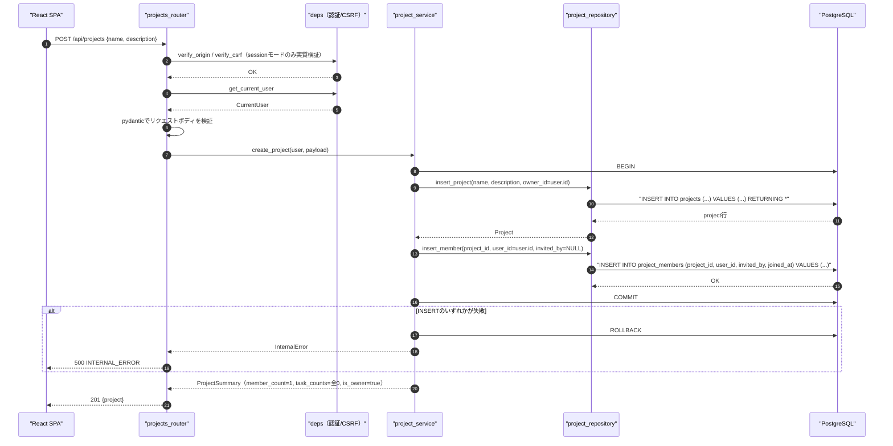
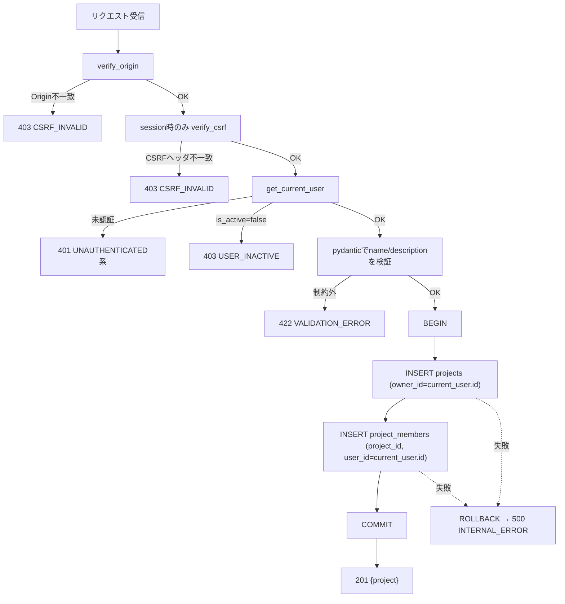
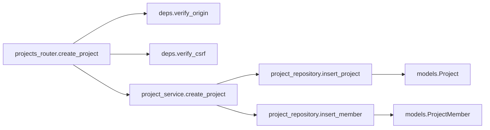
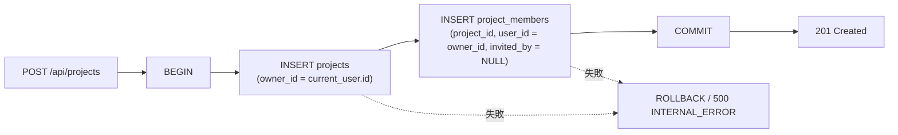

# POST /api/projects（プロジェクト作成）

## 0. 関連ドキュメント

| ドキュメント | 内容 |
|--------------|------|
| [../../../basic_design/04_api.md](../../../basic_design/04_api.md) | §2.3 プロジェクトAPI一覧、§3.2 スキーマ（`POST /projects`）、§7.2 サービス層関数一覧 |
| [../../../basic_design/01_database.md](../../../basic_design/01_database.md) | §3.3 projects、§3.4 project_members、§4.3 プロジェクト作成時のデータ生成 |
| [../../../basic_design/03_auth.md](../../../basic_design/03_auth.md) | §9.2 `core/deps.py`（`get_current_user`）、§8 CSRF対策 |
| [./01_get_projects.md](./01_get_projects.md) | 作成後に一覧へ反映されるAPI |
| [../screen/06_dashboard.md](../../screen/06_dashboard.md) | 本APIを呼び出す画面（新規作成モーダル） |

## 1. 概要

| 項目 | 内容 |
|------|------|
| エンドポイント | `POST /api/projects` |
| 目的 | 新規プロジェクトを作成し、作成者をオーナー兼メンバーとして登録する |
| 認証 | 必要（session Cookie または `Authorization: Bearer`） |
| 認可 | member（ログイン済みの全ユーザーが作成可能。admin可） |
| CSRF検証 | 必要（session モードの更新系）。jwtモードは `Authorization` ヘッダのため通常不要 |
| Origin検証 | 必要（Cookieを利用する更新系リクエストのため） |
| AUTH_MODE差異 | session: `X-CSRF-Token` 検証あり／jwt: ヘッダ方式のためCSRF検証なし。作成処理自体に差異なし |
| 冪等性 | なし（同名でも複数作成可能。冪等キーは提供しない） |
| レート制限 | 対象外 |
| トランザクション境界 | `projects` INSERT と `project_members` INSERT を **同一トランザクション** で実行し、いずれか失敗時は全体ロールバック |

## 2. 入出力仕様

### 2.1 リクエスト

**ボディ（`application/json`）**

| 名前 | 型 | 必須 | 制約 | 説明 |
|------|----|------|------|------|
| name | string | ○ | 1〜100文字 | プロジェクト名 |
| description | string \| null | 任意 | 上限なし（`TEXT`）。省略時 `null` | 説明 |

パスパラメータ／クエリパラメータ：なし。ヘッダ：`X-CSRF-Token`（sessionモードの更新系で必須）。

### 2.2 レスポンス

**`201 Created`**

```json
{
  "id": "3f1c2a10-...",
  "name": "Cerberus開発",
  "description": "学習用タスク管理システムの開発",
  "owner": { "id": "1a2b...", "username": "taro", "display_name": "山田 太郎" },
  "member_count": 1,
  "task_counts": { "todo": 0, "in_progress": 0, "done": 0 },
  "is_owner": true,
  "created_at": "2026-09-03T04:05:06Z"
}
```

| フィールド | 型 | NULL | 説明 |
|-----------|----|----|------|
| id | string(uuid) | 不可 | 作成されたプロジェクトID |
| name | string | 不可 | プロジェクト名 |
| description | string | 可 | 説明 |
| owner | object | 不可 | 作成者自身（`current_user`） |
| member_count | integer | 不可 | 常に `1`（作成直後はオーナーのみ） |
| task_counts | object | 不可 | 常に全status `0` |
| is_owner | boolean | 不可 | 常に `true` |
| created_at | string(datetime) | 不可 | ISO 8601 UTC |

`Set-Cookie` なし。共通ヘッダ `X-Request-ID` を全レスポンスに付与する。`Location` ヘッダは付与しない（本設計ではボディのみで完結させる）。

## 3. エラー仕様

| HTTP | code | 発生条件 | メッセージ | 備考 |
|------|------|----------|------------|------|
| 401 | `UNAUTHENTICATED` / `SESSION_EXPIRED` / `TOKEN_EXPIRED` / `TOKEN_INVALID` | 認証情報なし・無効 | 認証が必要です | `deps.get_current_user` |
| 403 | `USER_INACTIVE` | `is_active=false` | アカウントが無効化されています | |
| 403 | `CSRF_INVALID` | sessionモードでCSRFヘッダ／Origin不一致 | CSRFトークンが不正です | `deps.verify_origin` / `verify_csrf` |
| 422 | `VALIDATION_ERROR` | `name` 未指定・101文字以上等 | 入力内容に誤りがあります | `details` にフィールド情報 |
| 503 | `SERVICE_UNAVAILABLE` | PostgreSQL 接続不能 | しばらくしてから再度お試しください | fail-close |

`basic_design/04_api.md` §4.2 のエラーコード体系から逸脱しない。

## 4. 処理シーケンス



## 5. 処理フロー・分岐



## 6. 関数詳細

### 6.1 `api/routers/projects_router.py :: create_project`

| 項目 | 内容 |
|------|------|
| シグネチャ | `async def create_project(payload: ProjectCreateRequest, user: CurrentUser = Depends(get_current_user), db: AsyncSession = Depends(get_db), _: None = Depends(verify_csrf)) -> ProjectSummaryResponse` |
| 引数 | `payload`: リクエストボディ（pydantic検証済み） / `user`: 認証済みユーザー / `db`: DBセッション |
| 戻り値 | `ProjectSummaryResponse`（201） |
| 送出例外 | `CsrfInvalidError`（403）を `verify_csrf` 依存関係が送出 |
| 処理内容 | 1. `verify_origin` / `verify_csrf`（session時のみ実質検証）を依存関係として実行 2. `project_service.create_project` を呼び出す 3. 戻り値をそのまま201で返す |
| 副作用 | なし（副作用はservice層に委譲） |

### 6.2 `service/project_service.py :: create_project`

| 項目 | 内容 |
|------|------|
| シグネチャ | `async def create_project(user: CurrentUser, payload: ProjectCreateRequest, db: AsyncSession) -> ProjectSummary` |
| 引数 | `user`: 作成者 / `payload`: `name`, `description` / `db`: DBセッション |
| 戻り値 | `ProjectSummary`（`member_count=1`, `task_counts`全0, `is_owner=True` を固定値として組み立てる） |
| 送出例外 | `InternalError`（INSERT失敗）→500、`ServiceUnavailableError`（DB接続不能）→503 |
| 処理内容 | 1. `db.begin()` でトランザクションを開始（FastAPIのDIで払い出された `AsyncSession` のコンテキストを使用） 2. `project_repository.insert_project(db, name, description, owner_id=user.id)` を呼び出す 3. 返却された `project.id` を用いて `project_repository.insert_member(db, project_id, user_id=user.id, invited_by=None)` を呼び出す 4. 両方成功した場合のみ `commit`。いずれかで例外が発生した場合は `rollback` してから再送出する 5. `ProjectSummary` を構築して返す（集計クエリは発行せず固定値を使う） |
| 副作用 | `projects` へのINSERT、`project_members` へのINSERT（同一トランザクション） |

### 6.3 `repository/project_repository.py :: insert_project` / `insert_member`

| 項目 | 内容 |
|------|------|
| シグネチャ | `async def insert_project(db: AsyncSession, name: str, description: str \| None, owner_id: UUID) -> Project` ／ `async def insert_member(db: AsyncSession, project_id: UUID, user_id: UUID, invited_by: UUID \| None) -> None` |
| 引数 | 上記の通り |
| 戻り値 | `insert_project`: 作成された `Project` エンティティ／`insert_member`: なし |
| 送出例外 | `IntegrityError`（外部キー制約違反等。想定上は発生しない） |
| 処理内容 | `insert_project`: `INSERT INTO projects (name, description, owner_id) VALUES (...) RETURNING *`。`insert_member`: `INSERT INTO project_members (project_id, user_id, invited_by, joined_at) VALUES (:pid, :uid, :invited_by, now())` |
| 副作用 | DBへのINSERT（コミットは呼び出し元のservice層が制御） |

## 7. 関数相関図



## 8. データ遷移図



## 9. データアクセス一覧

**PostgreSQL**

| テーブル | 操作 | 条件・TTL | 備考 |
|----------|------|-----------|------|
| projects | INSERT | `owner_id = current_user.id` | トランザクション内 |
| project_members | INSERT | `project_id`, `user_id = owner_id`, `invited_by = NULL` | 同一トランザクション。所属判定を一箇所に集約するため作成時に自分自身も登録する |

**Redis**

| キー | 操作 | TTL | 備考 |
|------|------|-----|------|
| `session:{sid}`（sessionモードのみ） | GET | `SESSION_TTL_SECONDS` | `deps.get_current_user` の認証確認 |
| `csrf:{sid}`（sessionモードのみ） | GET | `SESSION_TTL_SECONDS` | `deps.verify_csrf` によるCSRFトークン照合 |

## 10. バリデーション規則

| pydanticスキーマ | フィールド | 制約 | フロント（zod）との整合 |
|-------------------|-----------|------|--------------------------|
| `ProjectCreateRequest` | name | `str, min_length=1, max_length=100` | `zod.string().min(1).max(100)` |
| `ProjectCreateRequest` | description | `str \| None`, 省略時 `None` | `zod.string().nullable().optional()` |

## 11. 非機能・セキュリティ考慮

| 観点 | 内容 |
|------|------|
| ログ出力 | 監査ログ対象（プロジェクト作成イベント）。`user_id`, `project_id`, `X-Request-ID` をINFOで構造化出力 |
| ユーザー列挙対策 | 該当なし |
| タイミング攻撃対策 | 該当なし |
| レート制限 | なし |
| CSRF/Origin | sessionモード：`verify_origin` + `verify_csrf` を必須依存関係とする。jwtモードはヘッダ認証のためCSRF検証対象外だが `verify_origin` は全モード共通で通す |
| fail-close方針 | INSERT失敗時は必ずロールバックし、部分的な作成（projectsのみ存在しproject_membersが無い状態）を発生させない |

## 12. テスト設計

| No | 区分 | ケース | 前提 | 期待結果 | pytest関数名案 |
|----|------|--------|------|----------|-----------------|
| 1 | 単体 | 正常作成でinsert_project→insert_memberの順に呼ばれる | repositoryをモック | 呼び出し順序とowner_id/user_idの整合を検証 | `test_create_project_calls_repository_in_order` |
| 2 | 単体 | insert_member失敗時にロールバックされる | `insert_member`がIntegrityErrorを送出するようモック | `rollback`が呼ばれ例外が再送出される | `test_create_project_rollback_on_member_insert_failure` |
| 3 | 結合 | 正常系でprojectsとproject_membersが同一トランザクションで作成される | 実PostgreSQL | 201、`project_members`に自分自身が1行存在 | `test_create_project_success` |
| 4 | 結合 | nameが101文字で422 | リクエストボディ不正 | `422 VALIDATION_ERROR` | `test_create_project_name_too_long` |
| 5 | 結合 | sessionモードでCSRFヘッダ欠落時403 | `X-CSRF-Token`を送らない | `403 CSRF_INVALID` | `test_create_project_missing_csrf_session_mode` |
| 6 | 結合 | 未認証は401 | Cookie/Bearerなし | `401 UNAUTHENTICATED` | `test_create_project_unauthenticated` |
| 7 | 結合 | is_active=falseは403 | 無効化ユーザーでログイン試行済みトークンを使用 | `403 USER_INACTIVE` | `test_create_project_inactive_user` |

`AUTH_MODE=session` / `jwt` の両方で No.3・No.6を実施する。No.5はsessionモード固有のためjwtモードでは対象外（jwtは`Authorization`ヘッダのみでCSRF検証を行わないため）とし、その理由を明記する。

## 13. 不明点・要検討事項

| 区分 | 内容 | 影響 |
|------|------|------|
| なし | | |
