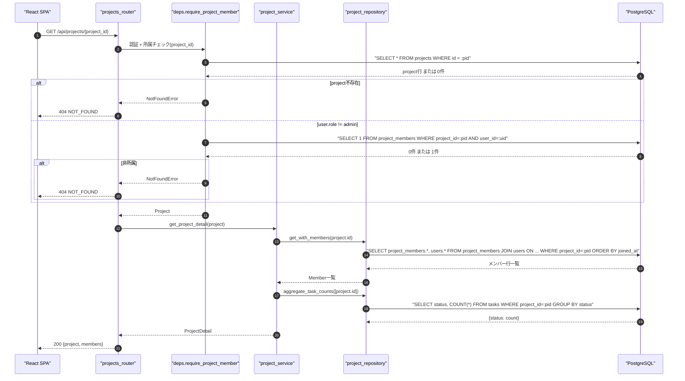
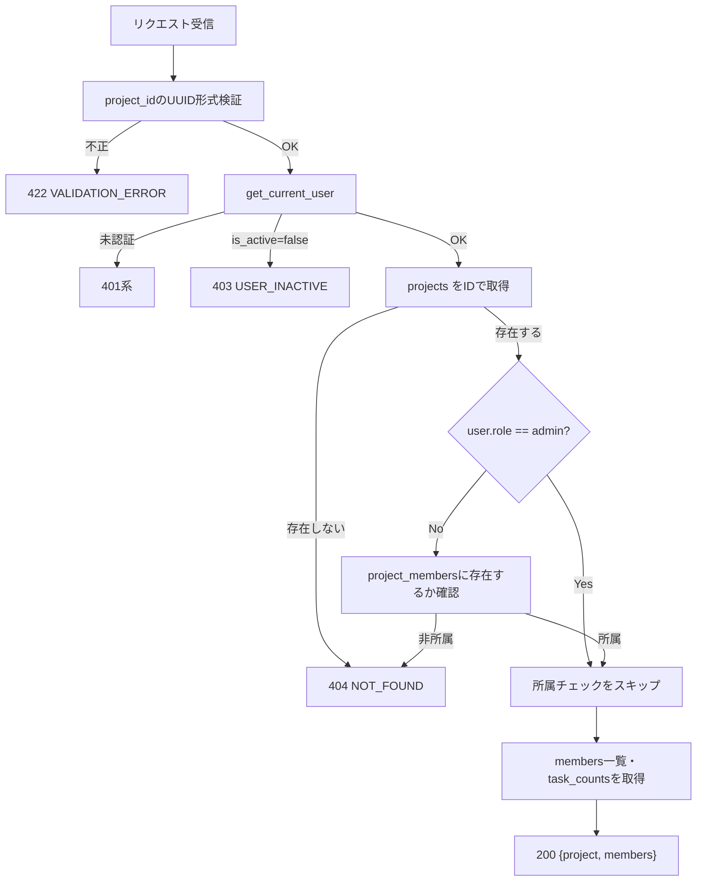
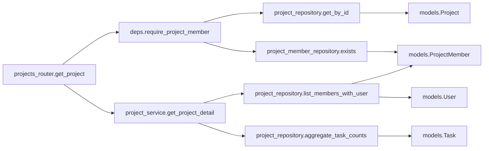
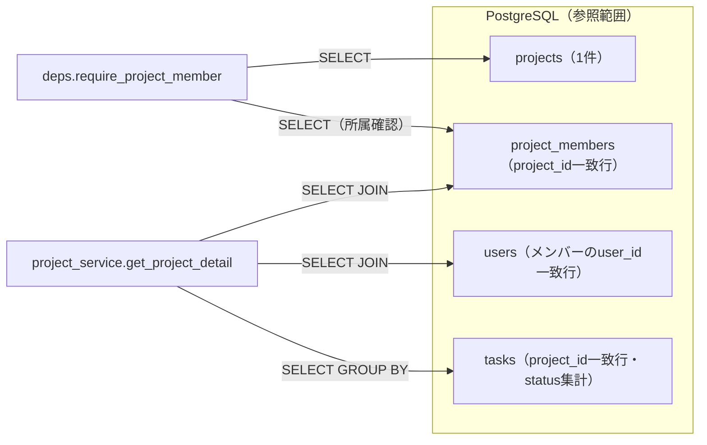

# GET /api/projects/{project_id}（プロジェクト詳細取得）

## 0. 関連ドキュメント

| ドキュメント | 内容 |
|--------------|------|
| [../../../basic_design/04_api.md](../../../basic_design/04_api.md) | §2.3 プロジェクトAPI一覧、§5 認可マトリクス、§7.2 サービス層関数一覧 |
| [../../../basic_design/01_database.md](../../../basic_design/01_database.md) | §3.3 projects、§3.4 project_members |
| [../../../basic_design/03_auth.md](../../../basic_design/03_auth.md) | §9.2 `core/deps.py`（`require_project_member`）、非所属は404とする方針 |
| [./01_get_projects.md](./01_get_projects.md) | 一覧APIとの `ProjectSummary` 相当フィールドの整合 |
| [../screen/07_project_board.md](../../screen/07_project_board.md) | 本APIを呼び出す画面（カンバンボード） |

## 1. 概要

| 項目 | 内容 |
|------|------|
| エンドポイント | `GET /api/projects/{project_id}` |
| 目的 | プロジェクトの詳細情報とメンバー一覧をまとめて取得する（カンバンボード画面の初期表示に使用） |
| 認証 | 必要 |
| 認可 | プロジェクトメンバー（admin は無条件で全プロジェクトにアクセス可） |
| CSRF検証 | 不要（参照系 GET） |
| Origin検証 | 不要 |
| AUTH_MODE差異 | 差異なし |
| 冪等性 | あり（GET） |
| レート制限 | 対象外 |
| トランザクション境界 | 単一の読み取りトランザクション |

## 2. 入出力仕様

### 2.1 リクエスト

**パスパラメータ**

| 名前 | 型 | 必須 | 制約 | 説明 |
|------|----|------|------|------|
| project_id | string(uuid) | ○ | UUID v4形式 | 対象プロジェクトID |

クエリパラメータ／ヘッダ／ボディ：なし。

### 2.2 レスポンス

**`200 OK`**

```json
{
  "id": "3f1c2a10-...",
  "name": "Cerberus開発",
  "description": "学習用タスク管理システムの開発",
  "owner": { "id": "1a2b...", "username": "taro", "display_name": "山田 太郎" },
  "is_owner": true,
  "member_count": 3,
  "task_counts": { "todo": 4, "in_progress": 2, "done": 7 },
  "is_active": true,
  "start_at": "2026-09-01T00:00:00Z",
  "end_at": null,
  "created_at": "2026-09-01T00:00:00Z",
  "updated_at": "2026-09-02T10:00:00Z",
  "members": [
    {
      "user_id": "1a2b...",
      "username": "taro",
      "display_name": "山田 太郎",
      "is_owner": true,
      "joined_at": "2026-09-01T00:00:00Z"
    },
    {
      "user_id": "2c3d...",
      "username": "hanako",
      "display_name": "鈴木 花子",
      "is_owner": false,
      "joined_at": "2026-09-01T09:00:00Z"
    }
  ]
}
```

| フィールド | 型 | NULL | 説明 |
|-----------|----|----|------|
| id / name / description | - | id・nameは不可、descriptionは可 | プロジェクト基本情報 |
| owner | object | 不可 | オーナー情報 |
| is_owner | boolean | 不可 | `owner_id == current_user.id`（`current_user`がadminで非所属の場合も算出可能なため常に返す） |
| member_count | integer | 不可 | `members` の件数と一致 |
| task_counts | object | 不可 | status別タスク件数 |
| is_active | boolean | 不可 | 論理削除フラグ。`false` は無効化（論理削除）済みを示す |
| start_at | string(datetime) | 可 | プロジェクト開始日時。ISO 8601 UTC |
| end_at | string(datetime) | 可 | プロジェクト終了日時。ISO 8601 UTC |
| created_at / updated_at | string(datetime) | 不可 | ISO 8601 UTC |
| members[].user_id / username / display_name | - | 不可 | メンバーのユーザー情報 |
| members[].is_owner | boolean | 不可 | 当該メンバーがオーナーか |
| members[].joined_at | string(datetime) | 不可 | `project_members.joined_at` |

`Set-Cookie` なし。共通ヘッダ `X-Request-ID` を付与する。

無効化（`is_active=false`）済みのプロジェクトであっても、既存の所属メンバー（admin含む）は詳細取得を継続でき、404にはしない（`01_get_projects.md`の一覧表示制御とは独立した挙動）。フロントは`is_active=false`を用いてバッジ等の表示制御を行う。

## 3. エラー仕様

| HTTP | code | 発生条件 | メッセージ | 備考 |
|------|------|----------|------------|------|
| 401 | `UNAUTHENTICATED` / `SESSION_EXPIRED` / `TOKEN_EXPIRED` / `TOKEN_INVALID` | 認証情報なし・無効 | 認証が必要です | |
| 403 | `USER_INACTIVE` | `is_active=false` | アカウントが無効化されています | |
| 404 | `NOT_FOUND` | `project_id` が存在しない、または存在するが自分が非所属（admin以外） | プロジェクトが見つかりません | 存在の有無を区別しないため常に404 |
| 422 | `VALIDATION_ERROR` | `project_id` がUUID形式でない | 入力内容に誤りがあります | |
| 503 | `SERVICE_UNAVAILABLE` | PostgreSQL 接続不能 | しばらくしてから再度お試しください | fail-close |

`basic_design/03_auth.md` §9.2 の方針に基づき、**非所属のプロジェクトIDに対しては（存在有無を問わず）404を返し、403は使用しない**（admin自身の判定のみ内部的に403/404を区別するが、レスポンスとしては非所属memberは常に404）。

## 4. 処理シーケンス



## 5. 処理フロー・分岐



## 6. 関数詳細

### 6.1 `core/deps.py :: require_project_member`

| 項目 | 内容 |
|------|------|
| シグネチャ | `async def require_project_member(project_id: UUID, user: CurrentUser = Depends(get_current_user), db: AsyncSession = Depends(get_db)) -> Project` |
| 引数 | `project_id`: パスパラメータ / `user`: 認証済みユーザー / `db`: DBセッション |
| 戻り値 | `Project`（存在・所属確認済み） |
| 送出例外 | `NotFoundError`（プロジェクト不存在、または非所属member）→404 |
| 処理内容 | 1. `project_repository.get_by_id(db, project_id)` を取得。存在しなければ `NotFoundError` 2. `user.role == 'admin'` なら無条件で `Project` を返す 3. それ以外は `project_member_repository.exists(db, project_id, user.id)` を確認し、`False` なら `NotFoundError` |
| 副作用 | なし |

### 6.2 `api/routers/projects_router.py :: get_project`

| 項目 | 内容 |
|------|------|
| シグネチャ | `async def get_project(project: Project = Depends(require_project_member), user: CurrentUser = Depends(get_current_user), db: AsyncSession = Depends(get_db)) -> ProjectDetailResponse` |
| 引数 | `project`: `require_project_member` が解決した対象 / `user`: 認証済みユーザー / `db`: DBセッション |
| 戻り値 | `ProjectDetailResponse` |
| 送出例外 | なし（`require_project_member` が例外を送出） |
| 処理内容 | 1. `project_service.get_project_detail(db, project, user)` を呼び出す 2. 結果をそのまま200で返す |
| 副作用 | なし |

### 6.3 `service/project_service.py :: get_project_detail`

| 項目 | 内容 |
|------|------|
| シグネチャ | `async def get_project_detail(db: AsyncSession, project: Project, user: CurrentUser) -> ProjectDetail` |
| 引数 | `project`: 対象プロジェクト / `user`: 現在ユーザー |
| 戻り値 | `ProjectDetail`（`members`一覧、`task_counts`、`is_owner`を含む） |
| 送出例外 | `ServiceUnavailableError`（DB接続不能）→503 |
| 処理内容 | 1. `project_repository.list_members_with_user(db, project.id)` でメンバー一覧をJOIN済みで取得（1クエリ） 2. `project_repository.aggregate_task_counts(db, [project.id])` でstatus別件数を取得（1クエリ） 3. `is_owner = project.owner_id == user.id` を算出 4. `ProjectDetail` を組み立てる |
| 副作用 | なし |

### 6.4 `repository/project_repository.py :: list_members_with_user`

| 項目 | 内容 |
|------|------|
| シグネチャ | `async def list_members_with_user(db: AsyncSession, project_id: UUID) -> list[MemberRow]` |
| 引数 | `project_id`: 対象プロジェクト |
| 戻り値 | `MemberRow`（`user_id`, `username`, `display_name`, `is_owner`, `joined_at`）のリスト |
| 送出例外 | `OperationalError` |
| 処理内容 | `SELECT project_members.user_id, users.username, users.last_name, users.first_name, project_members.joined_at, (project_members.user_id = projects.owner_id) AS is_owner FROM project_members JOIN users ON users.id = project_members.user_id JOIN projects ON projects.id = project_members.project_id WHERE project_members.project_id = :pid ORDER BY project_members.joined_at` を1クエリで実行しN+1を回避する |
| 副作用 | なし |

## 7. 関数相関図



## 8. データ遷移図

読み取りのみで状態遷移なし。



## 9. データアクセス一覧

**PostgreSQL**

| テーブル | 操作 | 条件 | 備考 |
|----------|------|------|------|
| projects | SELECT | `id = :project_id` | 存在確認 |
| project_members | SELECT (EXISTS) | `project_id=:pid AND user_id=:uid` | admin以外の所属確認 |
| project_members + users | SELECT JOIN | `project_id=:pid ORDER BY joined_at` | メンバー一覧を1クエリで取得 |
| tasks | SELECT + GROUP BY | `project_id=:pid GROUP BY status` | task_counts算出 |

**Redis**

| キー | 操作 | TTL | 備考 |
|------|------|-----|------|
| `session:{sid}`（sessionモードのみ） | GET | `SESSION_TTL_SECONDS` | 認証確認のみ |

## 10. バリデーション規則

| pydanticスキーマ | フィールド | 制約 | フロント（zod）との整合 |
|-------------------|-----------|------|--------------------------|
| `ProjectPathParams` | project_id | `UUID`（pydantic標準型） | `zod.string().uuid()` |

## 11. 非機能・セキュリティ考慮

| 観点 | 内容 |
|------|------|
| ログ出力 | 監査ログ対象外（参照系）。アクセスログに `project_id`, `user_id`, `X-Request-ID` を出力 |
| ユーザー列挙対策 | 非所属プロジェクトへのアクセスは存在有無を問わず404で統一し、プロジェクトIDの存在を推測させない |
| タイミング攻撃対策 | 該当なし |
| レート制限 | なし |
| fail-close方針 | DB接続不能時は503。メンバー一覧が空になることはない（オーナーが必ずproject_membersに存在するため） |
| N+1対策 | メンバー一覧はJOINによる1クエリ、task_countsもGROUP BYによる1クエリで取得する |

## 12. テスト設計

| No | 区分 | ケース | 前提 | 期待結果 | pytest関数名案 |
|----|------|--------|------|----------|-----------------|
| 1 | 単体 | 非adminかつ非所属はNotFoundErrorを送出 | `require_project_member`を単体で検証、`exists`をFalseにモック | `NotFoundError`送出 | `test_require_project_member_non_member_raises_not_found` |
| 2 | 単体 | adminは所属チェックをスキップする | `user.role=admin`でmock、`exists`は呼ばれない | `exists`未呼び出しでProjectを返す | `test_require_project_member_admin_bypasses_check` |
| 3 | 結合 | 所属memberが200で詳細+メンバー一覧を取得 | 実PostgreSQLに2名所属のプロジェクトを用意 | `members`が2件、`member_count`と一致 | `test_get_project_success_as_member` |
| 4 | 結合 | 非所属memberは404 | 対象プロジェクトに未所属のユーザーでアクセス | `404 NOT_FOUND` | `test_get_project_non_member_returns_404` |
| 5 | 結合 | 存在しないproject_idも404（列挙対策の確認） | ランダムなUUID | `404 NOT_FOUND`（非所属と同一メッセージ） | `test_get_project_not_exists_returns_404` |
| 6 | 結合 | adminは非所属でも200 | admin権限ユーザーで未所属プロジェクトへアクセス | `200` | `test_get_project_admin_can_access_any_project` |
| 7 | 結合 | メンバー一覧取得がN+1にならない | 5名所属のプロジェクトでSQLクエリ数を計測 | 発行クエリ数が定数（メンバー数に比例しない） | `test_get_project_members_query_count_constant` |

`AUTH_MODE=session` / `jwt` の両方で No.3・No.4を実施する。

## 13. 不明点・要検討事項

| 区分 | 内容 | 影響 |
|------|------|------|
| 確定 | `members[].display_name` は`last_name`と`first_name`がともに空でない場合に結合し、それ以外は`username`へフォールバックする | プロジェクトメンバー表示の規則をownerと統一する |
