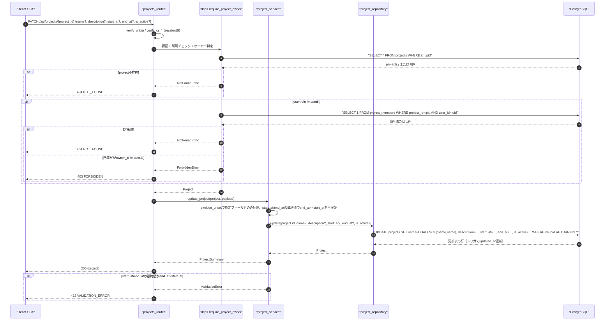
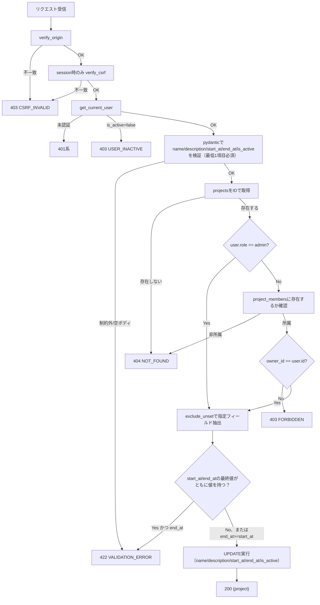
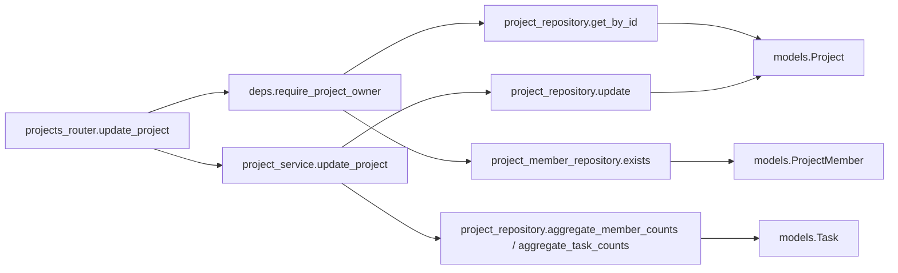
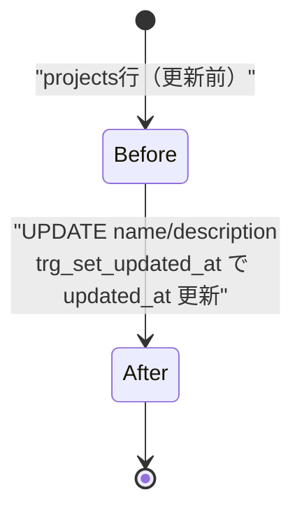

# PATCH /api/projects/{project_id}（プロジェクト更新）

## 0. 関連ドキュメント

| ドキュメント | 内容 |
|--------------|------|
| [../../../basic_design/04_api.md](../../../basic_design/04_api.md) | §2.3 プロジェクトAPI一覧、§5 認可マトリクス、§7.2 サービス層関数一覧 |
| [../../../basic_design/01_database.md](../../../basic_design/01_database.md) | §3.3 projects |
| [../../../basic_design/03_auth.md](../../../basic_design/03_auth.md) | §9.2 `core/deps.py`（`require_project_owner`）、非所属は404とする方針 |
| [./03_get_project.md](./03_get_project.md) | 更新対象の詳細取得API |
| [./05_delete_project.md](./05_delete_project.md) | 同じ認可要件を持つ削除API |

## 1. 概要

| 項目 | 内容 |
|------|------|
| エンドポイント | `PATCH /api/projects/{project_id}` |
| 目的 | プロジェクトの名称・説明・開始終了日時を更新する。`is_active` の再有効化（`false→true`）にも対応する |
| 認証 | 必要 |
| 認可 | オーナー／admin（所属memberであっても非オーナーは不可）。`is_active` フィールドの更新（無効化の取り消し＝再有効化を含む）も同じくオーナー／admin限定 |
| CSRF検証 | 必要（session モードの更新系） |
| Origin検証 | 必要 |
| AUTH_MODE差異 | session: `X-CSRF-Token` 検証あり／jwt: ヘッダ方式のためCSRF検証なし |
| 冪等性 | あり（同一内容の複数回PATCHは同じ結果になる部分更新） |
| レート制限 | 対象外 |
| トランザクション境界 | `projects` の単一UPDATE（`updated_at` はトリガ `trg_set_updated_at` が自動更新） |

## 2. 入出力仕様

### 2.1 リクエスト

**パスパラメータ**

| 名前 | 型 | 必須 | 制約 | 説明 |
|------|----|------|------|------|
| project_id | string(uuid) | ○ | UUID v4形式 | 対象プロジェクトID |

**ボディ（`application/json`、部分更新）**

| 名前 | 型 | 必須 | 制約 | 説明 |
|------|----|------|------|------|
| name | string | 任意 | 1〜100文字 | 指定時のみ更新 |
| description | string \| null | 任意 | 上限なし | 指定時のみ更新（`null`への変更も許可） |
| start_at | string(datetime) \| null | 任意 | ISO 8601（UTC） | 指定時のみ更新（`null`への変更も許可） |
| end_at | string(datetime) \| null | 任意 | ISO 8601（UTC） | 指定時のみ更新（`null`への変更も許可） |
| is_active | boolean | 任意 | `true` / `false` | 指定時のみ更新。**オーナー／adminのみ**変更可能（後述）。`false`への変更は`05_delete_project.md`の論理削除と同一の効果を持つ。`true`への変更（無効化済みプロジェクトの再有効化）も許可する |

少なくとも1フィールドの指定を必須とする（空ボディは422）。`start_at`/`end_at`は「このリクエストで指定された値、または未指定なら更新前の既存値」を最終的な値として扱い、両方が最終的に値を持つ場合のみ `end_at >= start_at` を検証する（片方のみ最終的に値を持つ、または両方 `null` の場合は検証対象外）。違反時は `422 VALIDATION_ERROR`。ヘッダ：`X-CSRF-Token`（sessionモードの更新系で必須）。

### 2.2 レスポンス

**`200 OK`**

`03_get_project.md` の `members` を除いた `ProjectSummary` 相当を返す。

```json
{
  "id": "3f1c2a10-...",
  "name": "Cerberus開発（改称）",
  "description": "説明を更新しました",
  "owner": { "id": "1a2b...", "username": "taro", "display_name": "山田 太郎" },
  "is_owner": true,
  "member_count": 3,
  "task_counts": { "todo": 4, "in_progress": 2, "done": 7 },
  "is_active": true,
  "start_at": "2026-09-01T00:00:00Z",
  "end_at": null,
  "created_at": "2026-09-01T00:00:00Z",
  "updated_at": "2026-09-03T04:10:00Z"
}
```

（レスポンスの`is_active`/`start_at`/`end_at`の意味は`03_get_project.md`と同一）

`Set-Cookie` なし。共通ヘッダ `X-Request-ID` を付与する。

## 3. エラー仕様

| HTTP | code | 発生条件 | メッセージ | 備考 |
|------|------|----------|------------|------|
| 401 | `UNAUTHENTICATED` 系 | 認証情報なし・無効 | 認証が必要です | |
| 403 | `USER_INACTIVE` | `is_active=false` | アカウントが無効化されています | |
| 403 | `CSRF_INVALID` | sessionモードでCSRFヘッダ／Origin不一致 | CSRFトークンが不正です | |
| 403 | `FORBIDDEN` | 所属memberだがオーナーではない | このプロジェクトを更新する権限がありません | 「所属している」ことは応答から判別可能なため404ではなく403とする |
| 404 | `NOT_FOUND` | `project_id` が存在しない、または非所属member | プロジェクトが見つかりません | 非所属は存在有無を問わず404 |
| 422 | `VALIDATION_ERROR` | ボディが空、`name` が制約外、または`start_at`/`end_at`が最終的に両方値を持ち`end_at < start_at`等 | 入力内容に誤りがあります | |
| 503 | `SERVICE_UNAVAILABLE` | PostgreSQL 接続不能 | しばらくしてから再度お試しください | fail-close |

## 4. 処理シーケンス



## 5. 処理フロー・分岐



## 6. 関数詳細

### 6.1 `core/deps.py :: require_project_owner`

| 項目 | 内容 |
|------|------|
| シグネチャ | `async def require_project_owner(project_id: UUID, user: CurrentUser = Depends(get_current_user), db: AsyncSession = Depends(get_db)) -> Project` |
| 引数 | `project_id`: パスパラメータ / `user`: 認証済みユーザー / `db`: DBセッション |
| 戻り値 | `Project`（存在・所属・オーナー確認済み） |
| 送出例外 | `NotFoundError`（プロジェクト不存在、または非所属member）→404／`ForbiddenError`（所属memberだが非オーナー）→403 |
| 処理内容 | 1. `project_repository.get_by_id(db, project_id)` を取得。存在しなければ `NotFoundError` 2. `user.role == 'admin'` なら無条件で `Project` を返す 3. `project_member_repository.exists(db, project_id, user.id)` が `False` なら `NotFoundError`（非所属は存在有無を問わず404とする §9.2の方針） 4. 所属している場合、`project.owner_id != user.id` なら `ForbiddenError` 5. いずれも満たせば `Project` を返す |
| 副作用 | なし |

### 6.2 `api/routers/projects_router.py :: update_project`

| 項目 | 内容 |
|------|------|
| シグネチャ | `async def update_project(payload: ProjectUpdateRequest, project: Project = Depends(require_project_owner), db: AsyncSession = Depends(get_db), _: None = Depends(verify_csrf)) -> ProjectSummaryResponse` |
| 引数 | `payload`: 部分更新ボディ / `project`: 認可確認済み対象 / `db`: DBセッション |
| 戻り値 | `ProjectSummaryResponse`（200） |
| 送出例外 | なし（依存関係が例外を送出） |
| 処理内容 | 1. `project_service.update_project(db, project, payload)` を呼び出す 2. 結果をそのまま200で返す |
| 副作用 | なし |

### 6.3 `service/project_service.py :: update_project`

| 項目 | 内容 |
|------|------|
| シグネチャ | `async def update_project(db: AsyncSession, project: Project, payload: ProjectUpdateRequest) -> ProjectSummary` |
| 引数 | `project`: 更新対象（`require_project_owner` 済み） / `payload`: `name`, `description`, `start_at`, `end_at`, `is_active` の部分更新値 |
| 戻り値 | `ProjectSummary` |
| 送出例外 | `ValidationError`（`start_at`/`end_at`の最終値が`end_at<start_at`）→422、`ServiceUnavailableError`（DB接続不能）→503 |
| 処理内容 | 1. `payload.model_dump(exclude_unset=True)` で指定されたフィールドのみ抽出 2. `start_at`/`end_at`それぞれについて「payloadに指定があればその値、なければ`project`の現行値」を最終値として算出し、両方が最終的に値を持つ場合のみ`end_at >= start_at`を検証（違反時`ValidationError`） 3. `project_repository.update(db, project.id, **fields)` を呼び出す（`is_active`は`require_project_owner`によりオーナー/adminのみ到達するため、`payload`に含まれる場合はそのまま渡してよい） 4. 更新後の `Project` を取得し、`member_count` / `task_counts` / `is_owner` を集計・付与して `ProjectSummary` を返す |
| 副作用 | `projects` のUPDATE（`updated_at` はDBトリガが自動更新） |

### 6.4 `repository/project_repository.py :: update`

| 項目 | 内容 |
|------|------|
| シグネチャ | `async def update(db: AsyncSession, project_id: UUID, **fields) -> Project` |
| 引数 | `project_id`: 対象 / `**fields`: `name` / `description` / `start_at` / `end_at` / `is_active` のうち指定されたもの |
| 戻り値 | 更新後の `Project` |
| 送出例外 | `OperationalError`、`IntegrityError`（`ck_projects_period` CHECK制約違反。サービス層で事前検証するため想定上は発生しない） |
| 処理内容 | `UPDATE projects SET <指定フィールドのみ> WHERE id = :project_id RETURNING *` を実行する。未指定フィールドはSQL文自体に含めず現状値を保持する |
| 副作用 | DBのUPDATE |

## 7. 関数相関図



## 8. データ遷移図



## 9. データアクセス一覧

**PostgreSQL**

| テーブル | 操作 | 条件 | 備考 |
|----------|------|------|------|
| projects | SELECT | `id=:project_id` | 存在確認・オーナー判定 |
| project_members | SELECT (EXISTS) | `project_id=:pid AND user_id=:uid` | admin以外の所属確認 |
| projects | UPDATE | `id=:project_id` | 指定フィールドのみ更新（`name`/`description`/`start_at`/`end_at`/`is_active`）、`updated_at` はトリガ更新。`ck_projects_period` CHECK制約あり |
| project_members / tasks | SELECT + GROUP BY | `project_id=:pid` | レスポンス用の集計（`01_get_projects.md` と同じ方式） |

**Redis**

| キー | 操作 | TTL | 備考 |
|------|------|-----|------|
| `session:{sid}` / `csrf:{sid}`（sessionモードのみ） | GET | `SESSION_TTL_SECONDS` | 認証・CSRF確認 |

## 10. バリデーション規則

| pydanticスキーマ | フィールド | 制約 | フロント（zod）との整合 |
|-------------------|-----------|------|--------------------------|
| `ProjectUpdateRequest` | name | `str, min_length=1, max_length=100`, 任意 | `zod.string().min(1).max(100).optional()` |
| `ProjectUpdateRequest` | description | `str \| None`, 任意 | `zod.string().nullable().optional()` |
| `ProjectUpdateRequest` | start_at | `datetime \| None`, 任意 | `zod.string().datetime().nullable().optional()` |
| `ProjectUpdateRequest` | end_at | `datetime \| None`, 任意 | `zod.string().datetime().nullable().optional()` |
| `ProjectUpdateRequest` | is_active | `bool`, 任意 | `zod.boolean().optional()` |
| `ProjectUpdateRequest` | （モデルバリデータ） | `name`・`description`・`start_at`・`end_at`・`is_active`のいずれも未指定なら422 | `zod.object({...}).refine(has at least one field)` |
| （サービス層バリデータ） | start_at/end_at | 指定値と更新前の既存値をマージした最終値が両方とも値を持つ場合、`end_at >= start_at`でなければ422（DBの`ck_projects_period`と同じ条件をアプリ層でも事前検証） | 同左をフロントでも事前チェック推奨 |

## 11. 非機能・セキュリティ考慮

| 観点 | 内容 |
|------|------|
| ログ出力 | 監査ログ対象。`project_id`, `user_id`, 変更前後の`name`差分の有無（値そのものは個人情報ではないため出力可）を出力 |
| ユーザー列挙対策 | 非所属は404で統一し存在有無を隠す。所属していることが判明した後の権限不足のみ403とする |
| タイミング攻撃対策 | 該当なし |
| レート制限 | なし |
| fail-close方針 | DB接続不能時は503。部分更新は必ずWHERE句で対象を1件に限定する |

## 12. テスト設計

| No | 区分 | ケース | 前提 | 期待結果 | pytest関数名案 |
|----|------|--------|------|----------|-----------------|
| 1 | 単体 | 非所属はNotFoundError | `exists`をFalseにモック | `NotFoundError` | `test_require_project_owner_non_member_raises_not_found` |
| 2 | 単体 | 所属だが非オーナーはForbiddenError | `exists`をTrue、`owner_id != user.id` | `ForbiddenError` | `test_require_project_owner_member_non_owner_raises_forbidden` |
| 3 | 単体 | adminは所属確認をスキップし常に許可 | `user.role=admin` | `exists`未呼び出しでProjectを返す | `test_require_project_owner_admin_bypasses_check` |
| 4 | 結合 | オーナーが200で更新できる | 実PostgreSQL | `200`、`name`が更新されている | `test_update_project_success_as_owner` |
| 5 | 結合 | 所属memberだが非オーナーは403 | 一般メンバーでPATCH | `403 FORBIDDEN` | `test_update_project_forbidden_as_non_owner_member` |
| 6 | 結合 | 非所属は404 | 未所属ユーザーでPATCH | `404 NOT_FOUND` | `test_update_project_not_found_as_non_member` |
| 7 | 結合 | adminは非オーナーでも200 | admin権限で他人のプロジェクトを更新 | `200` | `test_update_project_success_as_admin` |
| 8 | 結合 | 空ボディは422 | `{}` を送信 | `422 VALIDATION_ERROR` | `test_update_project_empty_body_returns_422` |
| 9 | 結合 | sessionモードでCSRFヘッダ欠落は403 | `X-CSRF-Token`なし | `403 CSRF_INVALID` | `test_update_project_missing_csrf_session_mode` |
| 10 | 結合 | オーナーがis_active=falseを指定すると論理削除される | オーナーでPATCH `{"is_active": false}` | `200`、`is_active=false`、`05_delete_project.md`同様プロジェクト自体は残る | `test_update_project_owner_can_deactivate` |
| 11 | 結合 | オーナーがis_active=trueを指定すると再有効化できる | `is_active=false`のプロジェクトに対しオーナーでPATCH `{"is_active": true}` | `200`、`is_active=true` | `test_update_project_owner_can_reactivate` |
| 12 | 結合 | 非オーナーmemberはis_activeを指定しても403 | 一般メンバーでPATCH `{"is_active": false}` | `403 FORBIDDEN` | `test_update_project_is_active_forbidden_as_non_owner_member` |
| 13 | 結合 | start_atのみ更新時、既存end_atとの順序が検証される | 既存`end_at`より後の`start_at`をPATCH | `422 VALIDATION_ERROR` | `test_update_project_start_at_conflicts_with_existing_end_at` |
| 14 | 結合 | start_at/end_atを両方指定して正常に更新できる | `end_at >= start_at`を満たす値をPATCH | `200`、レスポンスに反映 | `test_update_project_period_success` |

`AUTH_MODE=session` / `jwt` の両方で No.4・No.5・No.6・No.10を実施する。

## 13. 不明点・要検討事項

| 区分 | 内容 | 影響 |
|------|------|------|
| 基本設計との差異・要確認 | `basic_design/03_auth.md` §9.2 の `require_project_owner` の失敗欄には403のみが記載されているが、§4.2/§5の認可マトリクスでは非所属memberに対して404を要求している。本書では §9.2 冒頭の「非所属は404」という一般方針および §5 のマトリクスを優先し、`require_project_owner` を「非所属→404、所属だが非オーナー→403」の2段階判定として設計した。基本設計側の deps 一覧表への404追記を推奨する |
