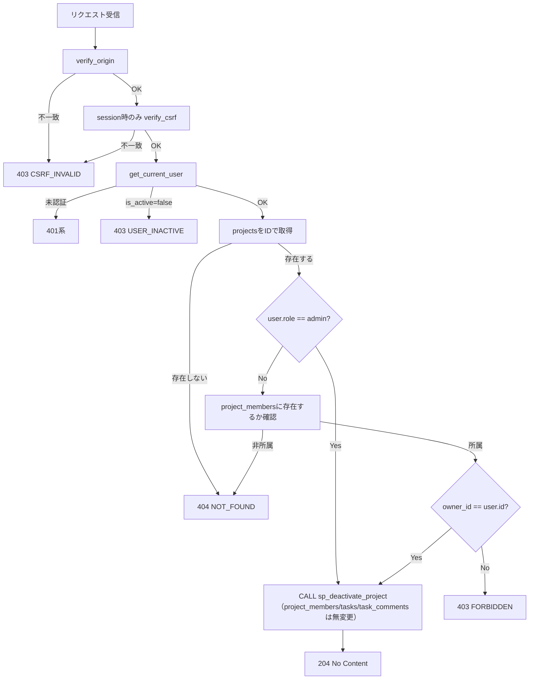
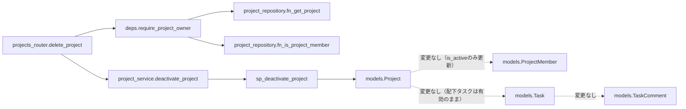
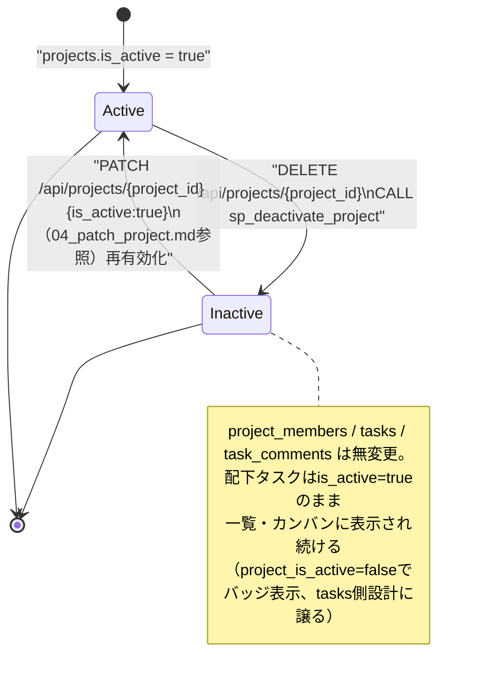

# DELETE /api/projects/{project_id}（プロジェクト削除）

## 0. 関連ドキュメント

| ドキュメント | 内容 |
|--------------|------|
| [../../../basic_design/04_api.md](../../../basic_design/04_api.md) | §2.3 プロジェクトAPI一覧、§5 認可マトリクス |
| [../../../basic_design/01_database.md](../../../basic_design/01_database.md) | §3.3 projects（`is_active`論理削除フラグ）、§3.5 tasks（`project_is_active`との関係） |
| [../../../basic_design/03_auth.md](../../../basic_design/03_auth.md) | §9.2 `core/deps.py`（`require_project_owner`） |
| [./04_patch_project.md](./04_patch_project.md) | 同じ認可要件（オーナー/admin）を持つ更新API |
| [../admin/06_delete_admin_project.md](../admin/06_delete_admin_project.md) | 管理者専用の削除エンドポイント（本APIとは別ルート。認可はadmin固定） |

## 1. 概要

| 項目 | 内容 |
|------|------|
| エンドポイント | `DELETE /api/projects/{project_id}` |
| 目的 | プロジェクトを**論理削除**する（`CALL sp_deactivate_project`）。物理削除は行わない |
| 認証 | 必要 |
| 認可 | オーナー／admin（所属memberであっても非オーナーは不可） |
| CSRF検証 | 必要（session モードの更新系） |
| Origin検証 | 必要 |
| AUTH_MODE差異 | session: `X-CSRF-Token` 検証あり／jwt: ヘッダ方式のためCSRF検証なし |
| 冪等性 | あり（既に`is_active=false`の対象への再実行も`UPDATE`が0件更新になるだけで200/204として扱い、副作用なく完了する。プロジェクト自体が存在しない場合のみ404） |
| レート制限 | 対象外 |
| トランザクション境界 | `CALL sp_deactivate_project(:project_id, false)` 1回。`project_members` / `tasks` / `task_comments` は変更しない |

**本APIの意味変更（issue #10）**：従来の物理削除仕様を、`projects.is_active` による論理削除へ変更した。物理削除を実行する経路はアプリケーションAPIとして提供しない。

## 2. 入出力仕様

### 2.1 リクエスト

**パスパラメータ**

| 名前 | 型 | 必須 | 制約 | 説明 |
|------|----|------|------|------|
| project_id | string(uuid) | ○ | UUID v4形式 | 削除対象プロジェクトID |

クエリパラメータ／ボディ：なし。ヘッダ：`X-CSRF-Token`（sessionモードの更新系で必須）。

### 2.2 レスポンス

**`204 No Content`**

ボディなし。`Set-Cookie` なし。共通ヘッダ `X-Request-ID` を付与する。論理削除後の`Project`表現が必要な場合はフロントは`GET /api/projects/{project_id}`（`03_get_project.md`、`is_active=false`が返る）を再取得すればよいため、本APIは従来どおり204で完結させる。

配下タスクへの影響：本APIはタスクを一切変更しない。プロジェクトが無効化された後もタスクは`is_active=true`のまま一覧・カンバンに表示され続ける。タスク側のレスポンスに含まれる`project_is_active`（`project_id`が`null`の場合は`null`）が`false`になることで、フロントは当該タスクにバッジ等を表示して「所属プロジェクトが無効化されている」ことを示せる。タスク側のスキーマ・実装詳細は`detailed_design/api/tasks/`側の設計に譲る。

## 3. エラー仕様

| HTTP | code | 発生条件 | メッセージ | 備考 |
|------|------|----------|------------|------|
| 401 | `UNAUTHENTICATED` 系 | 認証情報なし・無効 | 認証が必要です | |
| 403 | `USER_INACTIVE` | `is_active=false` | アカウントが無効化されています | |
| 403 | `CSRF_INVALID` | sessionモードでCSRFヘッダ／Origin不一致 | CSRFトークンが不正です | |
| 403 | `FORBIDDEN` | 所属memberだがオーナーではない | このプロジェクトを削除する権限がありません | `04_patch_project.md` と同一の切り分け |
| 404 | `NOT_FOUND` | `project_id` が存在しない、または非所属member | プロジェクトが見つかりません | 非所属は存在有無を問わず404 |
| 422 | `VALIDATION_ERROR` | `project_id` がUUID形式でない | 入力内容に誤りがあります | |
| 503 | `SERVICE_UNAVAILABLE` | PostgreSQL 接続不能 | しばらくしてから再度お試しください | fail-close |

## 4. 処理シーケンス

```mermaid
sequenceDiagram
    autonumber
    participant FE as "React SPA"
    participant R as "projects_router"
    participant D as "deps.require_project_owner"
    participant S as "project_service"
    participant RP as "project_repository"
    participant PG as "PostgreSQL"

    FE->>R: DELETE /api/projects/{project_id}
    R->>R: verify_origin / verify_csrf（session時）
    R->>D: 認証 + 所属チェック + オーナー判定（04_patch_project.mdと同一処理）
    D-->>R: Project（NotFoundError/ForbiddenErrorは404/403として応答）
    R->>S: deactivate_project(project)
    S->>RP: sp_deactivate_project(project.id, false)
    RP->>PG: "CALL sp_deactivate_project(:project_id, false);"
    PG-->>RP: 更新後の行（トリガでupdated_at更新。project_members/tasks/task_commentsは無変更）
    RP-->>S: OK
    S-->>R: None
    R-->>FE: 204 No Content
```

## 5. 処理フロー・分岐



## 6. 関数詳細

### 6.1 `api/routers/projects_router.py :: delete_project`

| 項目 | 内容 |
|------|------|
| シグネチャ | `async def delete_project(project: Project = Depends(require_project_owner), db: AsyncSession = Depends(get_db), _: None = Depends(verify_csrf)) -> Response` |
| 引数 | `project`: `04_patch_project.md` §6.1 と同一の `require_project_owner` が解決した対象 / `db`: DBセッション |
| 戻り値 | `Response(status_code=204)` |
| 送出例外 | なし（依存関係が例外を送出） |
| 処理内容 | 1. `project_service.deactivate_project(db, project)` を呼び出す 2. `204 No Content` を返す |
| 副作用 | なし（副作用はservice層に委譲） |

### 6.2 `service/project_service.py :: deactivate_project`

| 項目 | 内容 |
|------|------|
| シグネチャ | `async def deactivate_project(db: AsyncSession, project: Project) -> None` |
| 引数 | `project`: 論理削除対象（`require_project_owner` 済み） |
| 戻り値 | なし |
| 送出例外 | `ServiceUnavailableError`（DB接続不能）→503 |
| 処理内容 | 1. `sp_deactivate_project(db, project.id)` を呼び出す 2. `commit` する |
| 副作用 | `sp_deactivate_project` による `projects.is_active` 更新のみ。`project_members` / `tasks` / `task_comments` は変更しない（配下タスクは有効なまま維持される） |

### 6.3 `repository/project_repository.py :: sp_deactivate_project`

| 項目 | 内容 |
|------|------|
| シグネチャ | `async def deactivate(db: AsyncSession, project_id: UUID) -> None` |
| 引数 | `project_id`: 論理削除対象 |
| 戻り値 | なし |
| 送出例外 | `OperationalError` |
| 処理内容 | `CALL sp_deactivate_project(:project_id, false)` を実行する。SP内で `is_active=false` とトリガ更新を行い、既に無効でも冪等に完了する |
| 副作用 | `projects` のUPDATE（物理DELETEは行わない） |

## 7. 関数相関図



## 8. データ遷移図



## 9. SP/FNデータアクセス一覧

### 9.1 正式なDBアクセス契約

本APIのrepositoryは、次のSP/FN呼び出しとDTO写像だけを行う。

| 種別 | 契約 | 説明 |
|------|------|------|
| deactivate_project | `sp_deactivate_project(p_project_id, p_is_active=false)` | sp_deactivate_projectを呼び出し、結果をレスポンスへ写像する |

repositoryはDBテーブルへ直結せず、SP/FN契約だけを呼び出す。 直下の従来のテーブルI/O表はSP/FN内部SQLの補足であり、repositoryの発行契約ではない。更新系の整合性制御、version検証、advisory lock、通知、SQLSTATE P0xxxはSP/FN層の責務である。存在・所属の事実判定はFNの空集合/falseを受け、404/403への変換はAPI層が行う。

**PostgreSQL**

| テーブル | 操作 | 条件 | 備考 |
|----------|------|------|------|
| `fn_get_project` | FN | `p_project_id=:project_id` | `require_project_owner` 用の存在・所有者事実 |
| `fn_is_project_member` | FN | `p_project_id=:pid` / `p_user_id=:uid` | admin以外の所属事実 |
| `sp_deactivate_project` | SP | `p_project_id=:project_id` | `is_active=false` 更新のみ。`updated_at` はトリガ更新 |

変更範囲外（本APIでは一切のDML操作を行わない）：`project_members`（所属関係は維持）、`tasks`（`is_active`はそのまま、`project_id`もそのまま。物理削除ではなくなったため`ON DELETE CASCADE`は発火しない）、`task_comments`（同上）。`projects.owner_id`に対する`users`側のFK（`ON DELETE RESTRICT`）は本APIと無関係。

**Redis**

| キー | 操作 | TTL | 備考 |
|------|------|-----|------|
| `session:{sid}` / `csrf:{sid}`（sessionモードのみ） | GET | `SESSION_TTL_SECONDS` | 認証・CSRF確認のみ。本APIの削除処理そのものはRedisを更新しない |

## 10. バリデーション規則

| pydanticスキーマ | フィールド | 制約 | フロント（zod）との整合 |
|-------------------|-----------|------|--------------------------|
| `ProjectPathParams` | project_id | `UUID`（pydantic標準型） | `zod.string().uuid()` |

## 11. 非機能・セキュリティ考慮

| 観点 | 内容 |
|------|------|
| ログ出力 | 監査ログ対象（プロジェクトの状態を変更する操作）。`project_id`, `user_id`, `task_counts`/`member_count`（無効化時点の参考値）をINFOで出力（物理削除ではなくなったためWARN levelへの引き上げは不要と判断） |
| ユーザー列挙対策 | 非所属は404で統一し存在有無を隠す |
| タイミング攻撃対策 | 該当なし |
| レート制限 | なし |
| 破壊的操作の確認 | フロント側で無効化確認ダイアログを表示する（論理削除のため`04_patch_project.md`の`is_active:true`更新でオーナー/adminが取り消し＝再有効化できる。ただし本APIレスポンス自体にUndo手段は含まない） |
| fail-close方針 | DB接続不能時は503。`UPDATE`はWHERE句で対象を1件に限定し、部分的な状態変化は発生しない |

## 12. テスト設計

| No | 区分 | ケース | 前提 | 期待結果 | pytest関数名案 |
|----|------|--------|------|----------|-----------------|
| 1 | 結合（実DB・実SP） | serviceがrepository.deactivateを1回呼び出す | 実DB・実SPで検証 | `CALL sp_deactivate_project(:project_id, false);` 呼び出しを検証 | `test_deactivate_project_calls_repository` |
| 2 | 結合 | オーナーが204で無効化できる | 実PostgreSQLにタスク・コメントを含むプロジェクトを用意 | `204`、`projects.is_active=false`に更新、`project_members`/`tasks`/`task_comments`は行数・内容とも変化なし | `test_delete_project_deactivates_without_deleting_related_rows` |
| 3 | 結合 | 無効化後も配下タスクは有効なまま一覧に表示される | 無効化したプロジェクトの配下タスクをタスク一覧APIで取得 | タスクの`is_active=true`が維持され、`project_is_active=false`が返る | `test_delete_project_tasks_remain_active_with_project_is_active_false` |
| 4 | 結合 | 所属memberだが非オーナーは403 | 一般メンバーでDELETE | `403 FORBIDDEN`、`is_active`は変化しない | `test_delete_project_forbidden_as_non_owner_member` |
| 5 | 結合 | 非所属は404 | 未所属ユーザーでDELETE | `404 NOT_FOUND` | `test_delete_project_not_found_as_non_member` |
| 6 | 結合 | adminは非オーナーでも204 | admin権限で他人のプロジェクトを無効化 | `204` | `test_delete_project_success_as_admin` |
| 7 | 結合 | 無効化後の再実行も204（冪等） | 同一project_idへ2回目のDELETE | `204`（`is_active=false`のまま、エラーにしない） | `test_delete_project_idempotent_second_call_returns_204` |
| 8 | 結合 | 存在しないproject_idは404 | ランダムなUUIDへDELETE | `404 NOT_FOUND` | `test_delete_project_not_found_for_nonexistent_id` |
| 9 | 結合 | 無効化後にPATCHで再有効化できる | オーナーが無効化後、`04_patch_project.md`の`is_active:true`でPATCH | `200`、`is_active=true`に戻る | `test_delete_project_reactivatable_via_patch` |
| 10 | 結合 | sessionモードでCSRFヘッダ欠落は403 | `X-CSRF-Token`なし | `403 CSRF_INVALID` | `test_delete_project_missing_csrf_session_mode` |

`AUTH_MODE=session` / `jwt` の両方で No.2・No.4・No.5を実施する。Google連携そのものは対象外。

## 13. 不明点・要検討事項

| 区分 | 内容 | 影響 |
|------|------|------|
| 要検討 | 無効化確認（誤操作防止）のUI仕様は `basic_design/05_frontend.md` および `screen/07_project_board.md` 側の管轄であり、本APIの入出力には影響しないため詳細は割愛した |
| 対応済み | `../admin/06_delete_admin_project.md`（管理者用削除API）も本issueにあわせて論理削除へ改訂済み |
