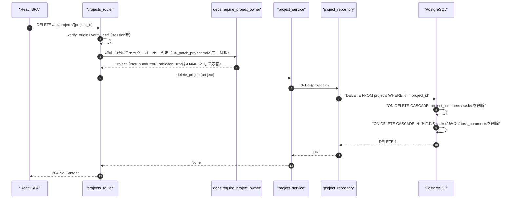
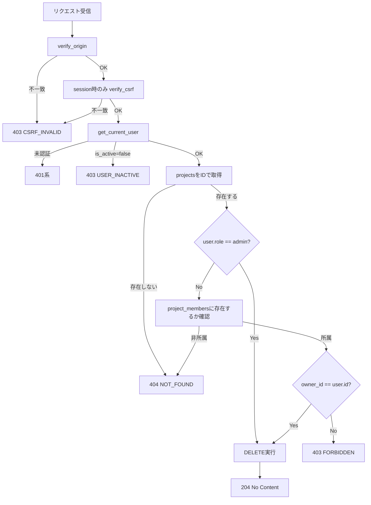
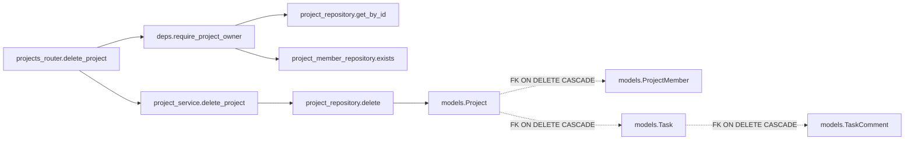
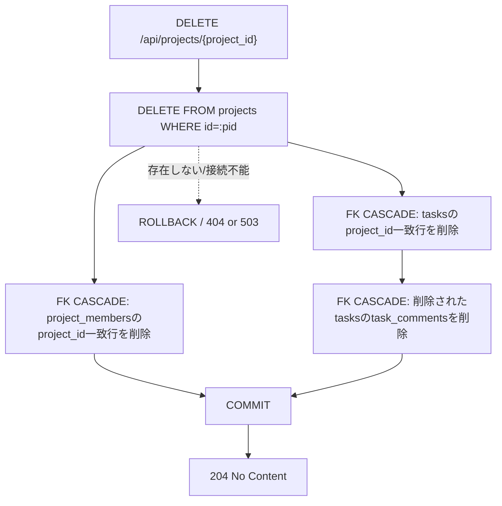

# DELETE /api/projects/{project_id}（プロジェクト削除）

## 0. 関連ドキュメント

| ドキュメント | 内容 |
|--------------|------|
| [../../../basic_design/04_api.md](../../../basic_design/04_api.md) | §2.3 プロジェクトAPI一覧（「タスク・コメントもCASCADE」）、§5 認可マトリクス |
| [../../../basic_design/01_database.md](../../../basic_design/01_database.md) | §3.3〜3.6 各テーブルのFK定義（`ON DELETE CASCADE` の範囲） |
| [../../../basic_design/03_auth.md](../../../basic_design/03_auth.md) | §9.2 `core/deps.py`（`require_project_owner`） |
| [./04_patch_project.md](./04_patch_project.md) | 同じ認可要件（オーナー/admin）を持つ更新API |
| [../admin/06_delete_admin_project.md](../admin/06_delete_admin_project.md) | 管理者専用の削除エンドポイント（本APIとは別ルート。認可はadmin固定） |

## 1. 概要

| 項目 | 内容 |
|------|------|
| エンドポイント | `DELETE /api/projects/{project_id}` |
| 目的 | プロジェクトを削除する。所属メンバー・タスク・タスクコメントもあわせて削除する |
| 認証 | 必要 |
| 認可 | オーナー／admin（所属memberであっても非オーナーは不可） |
| CSRF検証 | 必要（session モードの更新系） |
| Origin検証 | 必要 |
| AUTH_MODE差異 | session: `X-CSRF-Token` 検証あり／jwt: ヘッダ方式のためCSRF検証なし |
| 冪等性 | 実質的に冪等（削除済みIDへの再実行は404となり、リソースが存在しない状態は変わらない） |
| レート制限 | 対象外 |
| トランザクション境界 | `DELETE FROM projects WHERE id=:project_id` 一文。`project_members` / `tasks` / `task_comments` はPostgreSQLの外部キー `ON DELETE CASCADE` により同一トランザクション内でDBエンジンが自動削除する |

## 2. 入出力仕様

### 2.1 リクエスト

**パスパラメータ**

| 名前 | 型 | 必須 | 制約 | 説明 |
|------|----|------|------|------|
| project_id | string(uuid) | ○ | UUID v4形式 | 削除対象プロジェクトID |

クエリパラメータ／ボディ：なし。ヘッダ：`X-CSRF-Token`（sessionモードの更新系で必須）。

### 2.2 レスポンス

**`204 No Content`**

ボディなし。`Set-Cookie` なし。共通ヘッダ `X-Request-ID` を付与する。

## 3. エラー仕様

| HTTP | code | 発生条件 | メッセージ | 備考 |
|------|------|----------|------------|------|
| 401 | `UNAUTHENTICATED` 系 | 認証情報なし・無効 | 認証が必要です | |
| 403 | `USER_INACTIVE` | `is_active=false` | アカウントが無効化されています | |
| 403 | `CSRF_INVALID` | sessionモードでCSRFヘッダ／Origin不一致 | CSRFトークンが不正です | |
| 403 | `FORBIDDEN` | 所属memberだがオーナーではない | このプロジェクトを削除する権限がありません | `04_patch_project.md` と同一の切り分け |
| 404 | `NOT_FOUND` | `project_id` が存在しない、または非所属member | プロジェクトが見つかりません | 非所属は存在有無を問わず404 |
| 422 | `VALIDATION_ERROR` | `project_id` がUUID形式でない | 入力内容に誤りがあります | |
| 503 | `SERVICE_UNAVAILABLE` | PostgreSQL 接続不能 | しばらくしてから再度お試しください | fail-close |

## 4. 処理シーケンス

## 5. 処理フロー・分岐

## 6. 関数詳細

### 6.1 `api/routers/projects_router.py :: delete_project`

| 項目 | 内容 |
|------|------|
| シグネチャ | `async def delete_project(project: Project = Depends(require_project_owner), db: AsyncSession = Depends(get_db), _: None = Depends(verify_csrf)) -> Response` |
| 引数 | `project`: `04_patch_project.md` §6.1 と同一の `require_project_owner` が解決した対象 / `db`: DBセッション |
| 戻り値 | `Response(status_code=204)` |
| 送出例外 | なし（依存関係が例外を送出） |
| 処理内容 | 1. `project_service.delete_project(db, project)` を呼び出す 2. `204 No Content` を返す |
| 副作用 | なし（副作用はservice層に委譲） |

### 6.2 `service/project_service.py :: delete_project`

| 項目 | 内容 |
|------|------|
| シグネチャ | `async def delete_project(db: AsyncSession, project: Project) -> None` |
| 引数 | `project`: 削除対象（`require_project_owner` 済み） |
| 戻り値 | なし |
| 送出例外 | `ServiceUnavailableError`（DB接続不能）→503 |
| 処理内容 | 1. `project_repository.delete(db, project.id)` を呼び出す 2. `commit` する |
| 副作用 | `projects` のDELETE。DBの外部キー `ON DELETE CASCADE` により `project_members` / `tasks` / `task_comments` が連鎖削除される（アプリ層で個別にDELETE文を発行しない） |

### 6.3 `repository/project_repository.py :: delete`

| 項目 | 内容 |
|------|------|
| シグネチャ | `async def delete(db: AsyncSession, project_id: UUID) -> None` |
| 引数 | `project_id`: 削除対象 |
| 戻り値 | なし |
| 送出例外 | `OperationalError` |
| 処理内容 | `DELETE FROM projects WHERE id = :project_id` を実行する。存在確認は呼び出し前の `require_project_owner` で完了しているため再チェックしない |
| 副作用 | DBのDELETE（CASCADE範囲は下表参照） |

## 7. 関数相関図

## 8. データ遷移図

## 9. データアクセス一覧

**PostgreSQL**

| テーブル | 操作 | 条件 | 備考 |
|----------|------|------|------|
| projects | SELECT | `id=:project_id` | `require_project_owner` による存在・所属確認 |
| project_members | SELECT (EXISTS) | `project_id=:pid AND user_id=:uid` | admin以外の所属確認 |
| projects | DELETE | `id=:project_id` | 削除の起点 |
| project_members | DELETE（CASCADE, 自動） | `project_id=:pid` | FK `ON DELETE CASCADE`。アプリ層でDELETE文を発行しない |
| tasks | DELETE（CASCADE, 自動） | `project_id=:pid` | 同上 |
| task_comments | DELETE（CASCADE, 自動） | 削除された `tasks.id` に紐づく行 | `tasks`削除に伴う多段CASCADE（同上） |

削除範囲外（CASCADEされない）：`users`（`projects.owner_id` は `ON DELETE RESTRICT` だが、これはユーザー削除時の制約でありプロジェクト削除には無関係）、`login_history`（プロジェクトと無関係のテーブルのため対象外）。

**Redis**

| キー | 操作 | TTL | 備考 |
|------|------|-----|------|
| `session:{sid}` / `csrf:{sid}`（sessionモードのみ） | GET | `SESSION_TTL_SECONDS` | 認証・CSRF確認のみ。本APIの削除処理そのものはRedisを更新しない |

## 10. バリデーション規則

| pydanticスキーマ | フィールド | 制約 | フロント（zod）との整合 |
|-------------------|-----------|------|--------------------------|
| `ProjectPathParams` | project_id | `UUID`（pydantic標準型） | `zod.string().uuid()` |

## 11. 非機能・セキュリティ考慮

| 観点 | 内容 |
|------|------|
| ログ出力 | 監査ログ対象（破壊的操作）。`project_id`, `user_id`, 削除時点の `task_counts`/`member_count`（削除前に取得しログへ含める）をWARNまたはINFOで出力 |
| ユーザー列挙対策 | 非所属は404で統一し存在有無を隠す |
| タイミング攻撃対策 | 該当なし |
| レート制限 | なし |
| 破壊的操作の確認 | フロント側で削除確認ダイアログを表示する（本APIはバックエンド側の取り消し不可を前提とし、Undo機能は提供しない） |
| fail-close方針 | DB接続不能時は503。DELETE文はトランザクション内で完結し、CASCADE途中で失敗した場合は全体がロールバックされ部分削除は発生しない |

## 12. テスト設計

| No | 区分 | ケース | 前提 | 期待結果 | pytest関数名案 |
|----|------|--------|------|----------|-----------------|
| 1 | 単体 | serviceがrepository.deleteを1回呼び出す | repositoryをモック | `delete(project.id)` 呼び出しを検証 | `test_delete_project_calls_repository` |
| 2 | 結合 | オーナーが204で削除できる | 実PostgreSQLにタスク・コメントを含むプロジェクトを用意 | `204`、`projects`/`project_members`/`tasks`/`task_comments`が全て削除される | `test_delete_project_cascades_all_related_rows` |
| 3 | 結合 | 所属memberだが非オーナーは403 | 一般メンバーでDELETE | `403 FORBIDDEN`、データは削除されない | `test_delete_project_forbidden_as_non_owner_member` |
| 4 | 結合 | 非所属は404 | 未所属ユーザーでDELETE | `404 NOT_FOUND` | `test_delete_project_not_found_as_non_member` |
| 5 | 結合 | adminは非オーナーでも204 | admin権限で他人のプロジェクトを削除 | `204` | `test_delete_project_success_as_admin` |
| 6 | 結合 | 削除後の再削除は404 | 同一project_idへ2回目のDELETE | `404 NOT_FOUND` | `test_delete_project_idempotent_second_call_returns_404` |
| 7 | 結合 | sessionモードでCSRFヘッダ欠落は403 | `X-CSRF-Token`なし | `403 CSRF_INVALID` | `test_delete_project_missing_csrf_session_mode` |

`AUTH_MODE=session` / `jwt` の両方で No.2・No.3・No.4を実施する。Google連携そのものは対象外。

## 13. 不明点・要検討事項

| 区分 | 内容 | 影響 |
|------|------|------|
| 要検討 | 削除確認（誤操作防止）のUI仕様は `basic_design/05_frontend.md` および `screen/07_project_board.md` 側の管轄であり、本APIの入出力には影響しないため詳細は割愛した |
