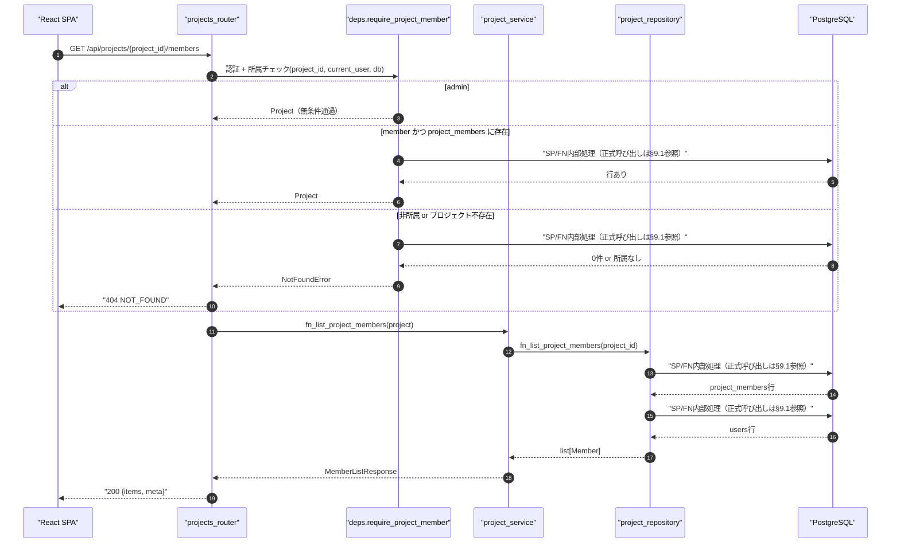
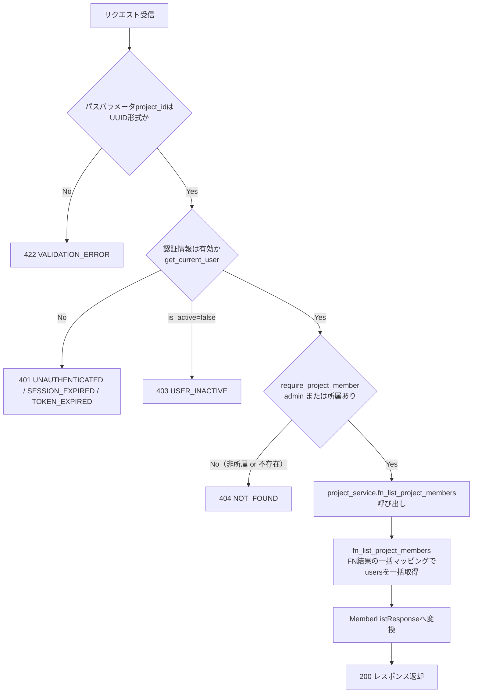
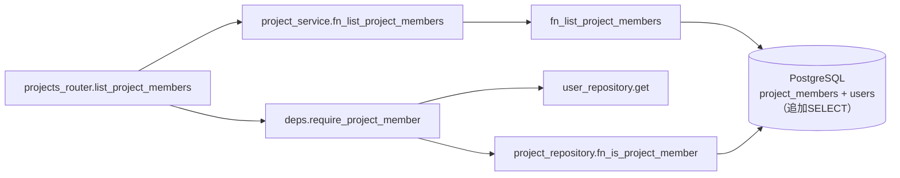
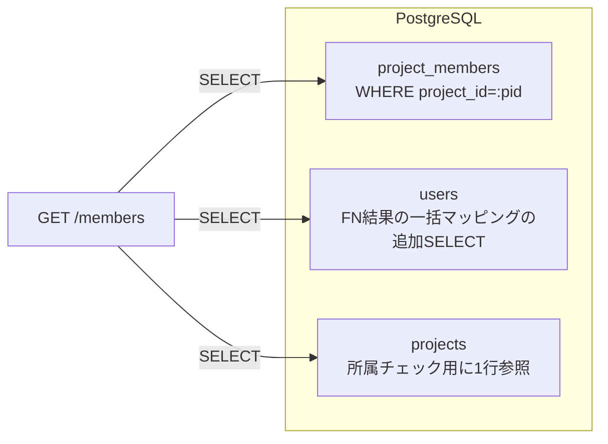

# GET /api/projects/{project_id}/members（プロジェクトメンバー一覧取得）

## 0. 関連ドキュメント

| ドキュメント | 内容 |
|--------------|------|
| [../../../basic_design/04_api.md](../../../basic_design/04_api.md) | §2.3 エンドポイント一覧、§4 エラー設計、§5 認可マトリクス |
| [../../../basic_design/01_database.md](../../../basic_design/01_database.md) | §3.4 `project_members`、§7 主要クエリ |
| [../../../basic_design/03_auth.md](../../../basic_design/03_auth.md) | §9.2 `require_project_member` |
| [03_get_project.md](./03_get_project.md) | プロジェクト詳細（メンバー一覧を内包する上位API） |
| [07_post_project_members.md](./07_post_project_members.md) | メンバー招待 |
| [09_delete_project_member.md](./09_delete_project_member.md) | メンバー削除 |

## 1. 概要

| 項目 | 内容 |
|------|------|
| エンドポイント | `GET /api/projects/{project_id}/members` |
| 目的 | プロジェクトに所属するメンバーの一覧を取得する（カンバンの担当者選択・メンバー管理画面に使用） |
| 認証 | session モード：`cerberus_sid` Cookie ／ jwt モード：`Authorization: Bearer {access_token}` |
| 認可 | プロジェクトメンバー（`require_project_member`。admin は無条件通過） |
| CSRF検証 | 不要（参照系のため） |
| Origin検証 | 不要（Cookie発行・更新系ではない） |
| AUTH_MODE差異 | 差異なし（`get_current_user` の解決方法のみが異なる） |
| 冪等性 | あり（GET） |
| レート制限 | 対象外 |
| トランザクション境界 | 参照のみのため明示的トランザクション不要（`AsyncSession` の暗黙トランザクションで完結） |

## 2. 入出力仕様（全体の出入力）

### 2.1 リクエスト

**パスパラメータ**

| 名前 | 型 | 必須 | 制約 | 説明 |
|------|----|------|------|------|
| project_id | string(uuid) | ○ | UUID v4形式 | 対象プロジェクトID |

**クエリパラメータ／ヘッダ／Cookie／ボディ**：なし（認証Cookie/Authorizationヘッダを除く）

### 2.2 レスポンス

**`200 OK`**

```json
{
  "items": [
    {
      "user_id": "3f1c2a10-...-abcdef",
      "username": "taro",
      "display_name": "山田 太郎",
      "role": "member",
      "is_owner": true,
      "is_active": true,
      "joined_at": "2026-09-01T00:00:00Z"
    }
  ],
  "meta": { "total": 1 }
}
```

| フィールド | 型 | NULL可否 | 説明 |
|-----------|----|----------|------|
| items[].user_id | string(uuid) | 不可 | `users.id` |
| items[].username | string | 不可 | `users.username` |
| items[].display_name | string \| null | 可 | `last_name + first_name`（半角スペース区切り）。プロフィール未設定（OAuth新規）の場合 `null` |
| items[].role | string | 不可 | `users.role`（`member` / `admin`）。システム全体のロールであり、プロジェクト内権限とは別概念 |
| items[].is_owner | boolean | 不可 | `projects.owner_id == user_id` |
| items[].is_active | boolean | 不可 | `users.is_active`。無効化されたメンバーも一覧には残す（担当タスク表示のため）が、フロントは無効表示を行う |
| items[].joined_at | string(date-time) | 不可 | `project_members.joined_at` |
| meta.total | integer | 不可 | メンバー総数 |

`meta.total` のみとし `page` / `per_page` は含めない（プロジェクトメンバー数は少数を想定しページングを行わないため）。

**共通ヘッダ**：全レスポンスに `X-Request-ID` を付与（`basic_design/04_api.md` §1）。`Set-Cookie` はなし。

**主なエラー**は §3 を参照。

## 3. エラー仕様

| HTTP | code | 発生条件 | メッセージ | 備考 |
|------|------|----------|-----------|------|
| 401 | `UNAUTHENTICATED` | 認証情報なし | 認証が必要です | Cookie/Bearer 双方欠落時 |
| 401 | `SESSION_EXPIRED` | sessionモードでRedisにセッションなし | セッションの有効期限が切れました | |
| 401 | `TOKEN_EXPIRED` / `TOKEN_INVALID` | jwtモードでアクセストークン不正 | トークンが無効です | |
| 403 | `USER_INACTIVE` | `users.is_active = false` | アカウントが無効化されています | `get_current_user` 内で判定 |
| 404 | `NOT_FOUND` | プロジェクトが存在しない、または非所属member（存在を隠蔽） | 指定されたプロジェクトが見つかりません | `basic_design/03_auth.md` §9.2 の方針に従い403ではなく404を返す |
| 500 | `INTERNAL_ERROR` | 未捕捉例外 | 予期しないエラーが発生しました | |
| 503 | `SERVICE_UNAVAILABLE` | DB接続不能 | 一時的に利用できません | fail-close |

## 4. 処理シーケンス



## 5. 処理フロー・分岐



## 6. 関数詳細

### 6.1 `api/routers/projects.py :: list_project_members`

| 項目 | 内容 |
|------|------|
| シグネチャ | `async def list_project_members(project: Project = Depends(require_project_member)) -> MemberListResponse` |
| 引数 | project：`require_project_member` が解決したプロジェクト（表の説明は下記） |
| 戻り値 | `MemberListResponse`（`items`, `meta`） |
| 送出例外 | なし（例外は `deps` / `service` 側で送出され `AppError` ハンドラが処理） |
| 処理内容 | 1. `require_project_member` の解決結果を受け取る 2. `project_service.fn_list_project_members(project)` を呼び出す 3. 結果をそのままレスポンスとして返す |
| 副作用 | なし |

| 引数名 | 型 | 説明 |
|--------|----|------|
| project | `Project` | `require_project_member` が検証済みの対象プロジェクト（ORMモデル） |

### 6.2 `service/project_service.py :: fn_list_project_members`

| 項目 | 内容 |
|------|------|
| シグネチャ | `async def fn_list_project_members(project: Project) -> MemberListResponse` |
| 引数 | project：`Project`（検証済み） |
| 戻り値 | `MemberListResponse` |
| 送出例外 | なし |
| 処理内容 | 1. `fn_list_project_members(project.id)` を呼び出す 2. 各行を `MemberSummary` スキーマへ変換（`display_name` は `last_name`/`first_name` のいずれかが `null` の場合は `None`） 3. `is_owner` を `project.owner_id` との比較で算出 |
| 副作用 | なし（参照のみ） |

### 6.3 `repository/project_repository.py :: fn_list_project_members`

| 項目 | 内容 |
|------|------|
| シグネチャ | `async def fn_list_project_members(db: AsyncSession, project_id: UUID) -> list[ProjectMemberRow]` |
| 引数 | db：`AsyncSession`、project_id：対象プロジェクトID |
| 戻り値 | `project_members` と `users` を JOIN した行のリスト（`joined_at` 昇順） |
| 送出例外 | なし（DB例外は `db_error_handler` / `infra_error_handler` に委譲） |
| 処理内容 | 1. `project_members`の主クエリを1回実行 2. `FN結果の一括マッピング`の追加SELECTを1回実行してusersをまとめて取得しN+1を回避 3. `ORDER BY project_members.joined_at ASC` |
| 副作用 | なし |

## 7. 関数相関図



## 8. データ遷移図

読み取りのみで状態遷移なし。参照範囲は以下の通り。



## 9. SP/FNデータアクセス一覧

### 9.1 正式なDBアクセス契約

本APIのrepositoryは、次のSP/FN呼び出しとDTO写像だけを行う。

| 種別 | 契約 | 説明 |
|------|------|------|
| fn_list_project_members | `fn_list_project_members(p_project_id)` | fn_list_project_membersを呼び出し、結果をレスポンスへ写像する |

repositoryはDBテーブルへ直結せず、SP/FN契約だけを呼び出す。 直下の従来のテーブルI/O表はSP/FN内部SQLの補足であり、repositoryの発行契約ではない。更新系の整合性制御、version検証、advisory lock、通知、SQLSTATE P0xxxはSP/FN層の責務である。存在・所属の事実判定はFNの空集合/falseを受け、404/403への変換はAPI層が行う。

| ストア | テーブル／キー | 操作 | 条件・TTL | 備考 |
|--------|----------------|------|-----------|------|
| PostgreSQL | `project_members` | SELECT | `WHERE project_id = :pid ORDER BY joined_at` | `ix_project_members_user_id` は使用しない（本クエリは project_id 主軸のため `PK` を使用） |
| PostgreSQL | `users` | SELECT（`FN結果の一括マッピング`の追加SELECT） | `id IN (user_ids)` | `display_name` / `role` / `is_active` 取得用。主クエリとは別ラウンドトリップ |
| PostgreSQL | `projects` | SELECT | `require_project_member` 内での存在・所属確認用に1行 | |
| Redis | ー | ー | ー | 本APIはRedisを使用しない |

## 10. バリデーション規則

| スキーマ | フィールド | 制約 | フロント(zod)整合 |
|----------|-----------|------|-------------------|
| `MemberListQueryParams`（パスパラメータ） | project_id | `UUID`（pydantic `UUID4`） | `z.string().uuid()` と一致させる |

リクエストボディ・クエリパラメータは存在しないため、他の検証項目はなし。

## 11. 非機能・セキュリティ考慮

| 観点 | 内容 |
|------|------|
| 監査ログ | 通常の参照系APIのためINFOログは出力しない（アクセスログのみ）。`X-Request-ID` で相関を取る |
| ユーザー列挙対策 | 非所属プロジェクトIDに対しては404を返し、プロジェクトの存在有無を秘匿する（`basic_design/03_auth.md` §9.2） |
| タイミング攻撃対策 | 対象外（認証情報の正誤判定を伴わない参照APIのため） |
| レート制限 | 対象外 |
| fail-close方針 | DB接続不能時は `503 SERVICE_UNAVAILABLE` とし、空配列を返すことはしない |
| 無効化ユーザーの表示 | `is_active=false` のメンバーも一覧に残す。担当タスクの表示整合のため除外しない方針（要検討事項参照） |

## 12. テスト設計

| No | 区分 | ケース | 前提 | 期待結果 | pytest関数名案 |
|----|------|--------|------|----------|----------------|
| T1 | 結合 | 所属memberが一覧取得 | project_membersに2件 | 200、items.length=2、joined_at昇順 | `test_fn_list_project_members_as_member_returns_200` |
| T2 | 結合 | オーナーが一覧取得 | 自分がowner | 200、is_owner=trueの行が1件 | `test_fn_list_project_members_owner_flag` |
| T3 | 結合 | adminが非所属プロジェクトを取得 | adminかつproject_membersに未登録 | 200（無条件通過） | `test_fn_list_project_members_admin_bypass` |
| T4 | 結合 | 非所属memberが取得 | project_membersに未登録 | 404 NOT_FOUND | `test_fn_list_project_members_non_member_404` |
| T5 | 結合 | 存在しないproject_id | UUIDだが未存在 | 404 NOT_FOUND | `test_fn_list_project_members_project_not_found_404` |
| T6 | 結合 | 未認証アクセス | Cookie/Bearerなし | 401 UNAUTHENTICATED | `test_fn_list_project_members_unauthenticated_401` |
| T7 | 結合（実DB・実SP） | fn_list_project_membersのモック検証 | 実DB・実SPで検証 | serviceが正しい引数で呼び出す | `test_service_fn_list_project_members_calls_repository` |
| T8 | 結合 | AUTH_MODE=session/jwt両方 | 各モードでログイン | いずれも200 | `test_fn_list_project_members_both_auth_modes` |
| T9 | 結合 | プロフィール未設定メンバーを含む | last_nameがnullなmemberが存在 | display_name=null | `test_fn_list_project_members_null_display_name` |

参照系APIのため副作用検証（DB更新）は対象外。カバレッジは `pytest --cov=app` に含める。

## 13. 不明点・要検討事項

| 区分 | 内容 | 影響 |
|------|------|------|
| 要検討 | メンバー一覧レスポンスに `email` を含めるかどうかは `basic_design/04_api.md` に明記がない。候補検索API（08）では列挙対策のためemailを含めない方針が明記されているが、既に確定した同一プロジェクトメンバー間でemail共有が許容されるかは未確定のため、本設計では `GET /projects` のowner表現（id/username/display_name）に合わせて含めない方針とした | 含める場合はスキーマ・フロント双方の変更が必要 |
| 要検討 | `is_active=false` のメンバーを一覧に残す方針は基本設計に明記がなく、`users.is_active` の用途（ログイン可否）からの類推で決定した | 除外する運用に変更する場合は認可・カンバン表示側との整合確認が必要 |
