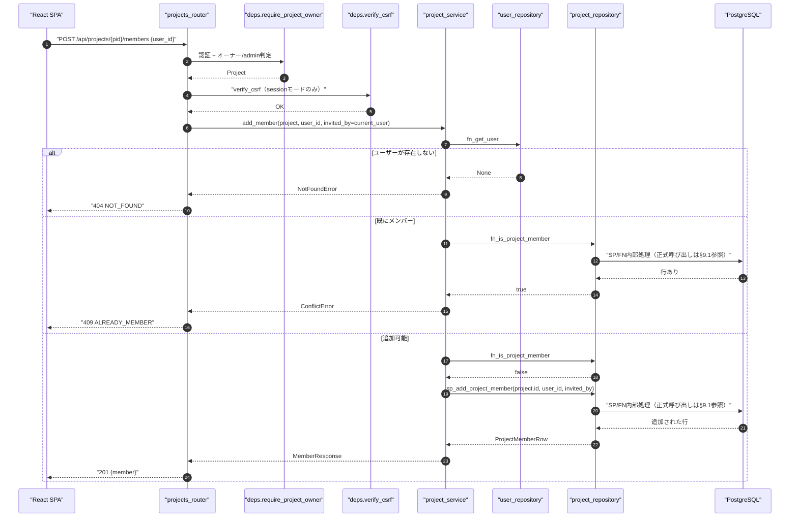
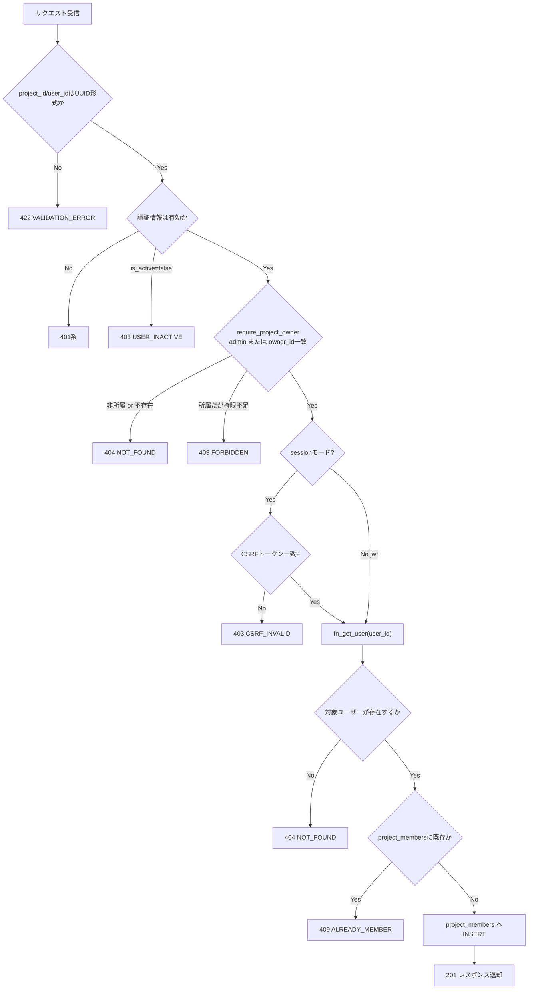
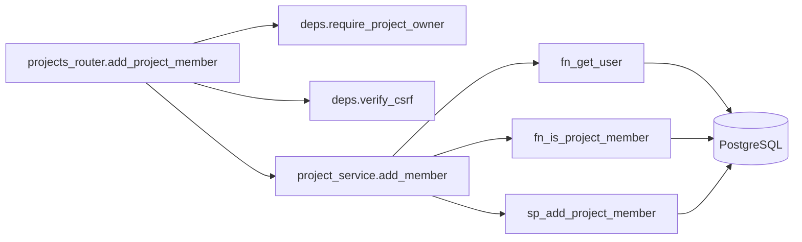
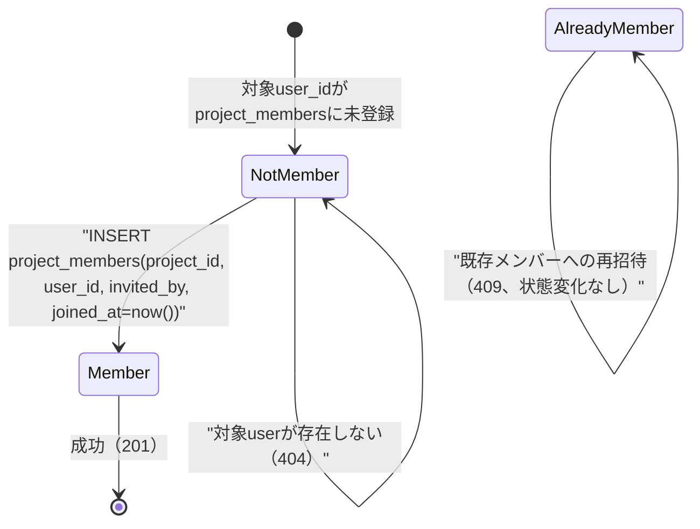

# POST /api/projects/{project_id}/members（プロジェクトメンバー招待）

## 0. 関連ドキュメント

| ドキュメント | 内容 |
|--------------|------|
| [../../../basic_design/04_api.md](../../../basic_design/04_api.md) | §2.3 エンドポイント一覧、§4 エラー設計、§5 認可マトリクス、§6.2 メンバー招待シーケンス、§7 サービス層関数一覧 |
| [../../../basic_design/01_database.md](../../../basic_design/01_database.md) | §3.4 `project_members` |
| [../../../basic_design/03_auth.md](../../../basic_design/03_auth.md) | §9.2 `require_project_owner` |
| [06_get_project_members.md](./06_get_project_members.md) | メンバー一覧取得 |
| [08_get_project_member_candidates.md](./08_get_project_member_candidates.md) | 招待候補検索（本APIの前段で利用） |
| [09_delete_project_member.md](./09_delete_project_member.md) | メンバー削除 |

## 1. 概要

| 項目 | 内容 |
|------|------|
| エンドポイント | `POST /api/projects/{project_id}/members` |
| 目的 | 既存ユーザーをプロジェクトメンバーとして追加する（新規ユーザー招待メールは送信しない。既存ユーザーの追加のみ） |
| 認証 | session モード：`cerberus_sid` Cookie ／ jwt モード：`Authorization: Bearer {access_token}` |
| 認可 | オーナー / admin（`require_project_owner`） |
| CSRF検証 | 必要（sessionモードの更新系リクエストは `X-CSRF-Token` ヘッダ必須。jwtモードはAuthorizationヘッダのため不要） |
| Origin検証 | 不要（Cookieを新規発行しないリクエストのため。`basic_design/04_api.md` §1 の対象リストに本APIは含まれない） |
| AUTH_MODE差異 | CSRF検証の要否のみ（session: 必要 / jwt: 不要）。それ以外の業務ロジックは差異なし |
| 冪等性 | なし（同一user_idを2回送ると2回目は409） |
| レート制限 | 対象外 |
| トランザクション境界 | `project_members` へのINSERT1件のみのため単一ステートメント（明示的な`BEGIN`は不要、`AsyncSession`のコミット単位で完結） |

## 2. 入出力仕様（全体の出入力）

### 2.1 リクエスト

**パスパラメータ**

| 名前 | 型 | 必須 | 制約 | 説明 |
|------|----|------|------|------|
| project_id | string(uuid) | ○ | UUID v4形式 | 対象プロジェクトID |

**ヘッダ**

| 名前 | 必須 | 説明 |
|------|------|------|
| X-CSRF-Token | sessionモードのみ○ | Double Submit Cookie方式のCSRFトークン |

**クエリパラメータ／Cookie**：なし（認証Cookieを除く）

**ボディ**

| フィールド | 型 | 必須 | 制約 | 説明 |
|-----------|----|------|------|------|
| user_id | string(uuid) | ○ | UUID v4形式 | 追加対象ユーザーのID。`08_get_project_member_candidates` の検索結果から選択する想定（emailでの指定は不可） |

```json
{ "user_id": "9c2e...-abcdef" }
```

### 2.2 レスポンス

**`201 Created`**

```json
{
  "user_id": "9c2e...-abcdef",
  "username": "hanako",
  "display_name": "鈴木 花子",
  "role": "member",
  "is_owner": false,
  "is_active": true,
  "joined_at": "2026-09-03T04:05:06Z"
}
```

フィールド定義は `06_get_project_members.md` §2.2 の `items[]` 要素と同一。

| フィールド | 型 | NULL可否 | 説明 |
|-----------|----|----------|------|
| user_id | string(uuid) | 不可 | 追加されたユーザーのID |
| username | string | 不可 | |
| display_name | string \| null | 可 | プロフィール未設定の場合 `null` |
| role | string | 不可 | `users.role`（`member`/`admin`） |
| is_owner | boolean | 不可 | 常に `false`（オーナーは招待対象にできない。§3参照） |
| is_active | boolean | 不可 | |
| joined_at | string(date-time) | 不可 | `project_members.joined_at`（INSERT時刻） |

**共通ヘッダ**：`X-Request-ID`。`Set-Cookie` はなし。

## 3. エラー仕様

| HTTP | code | 発生条件 | メッセージ | 備考 |
|------|------|----------|-----------|------|
| 400 | `VALIDATION_ERROR`（422相当ではなくボディ形式の場合は422） | ー | ー | 下記422へ集約 |
| 401 | `UNAUTHENTICATED` / `SESSION_EXPIRED` / `TOKEN_EXPIRED` / `TOKEN_INVALID` | 認証情報なし・失効 | 認証が必要です | |
| 403 | `USER_INACTIVE` | `users.is_active=false`（リクエスト元） | アカウントが無効化されています | |
| 403 | `CSRF_INVALID` | sessionモードでCSRFトークン不一致・欠落 | CSRF検証に失敗しました | |
| 403 | `FORBIDDEN` | 所属memberだがオーナーでもadminでもない | このプロジェクトを操作する権限がありません | `require_project_owner` で所属はしているが権限不足の場合 |
| 404 | `NOT_FOUND` | プロジェクトが存在しない・非所属、または `user_id` に該当するユーザーが存在しない | 指定されたリソースが見つかりません | プロジェクト側とユーザー側で同一コードを返すため、`message` は個別に出し分けるがユーザー列挙目的の詳細化はしない |
| 409 | `ALREADY_MEMBER` | 指定ユーザーが既に `project_members` に存在 | 既にプロジェクトのメンバーです | |
| 422 | `VALIDATION_ERROR` | `user_id` がUUID形式でない・欠落 | 入力内容に誤りがあります | |
| 500 | `INTERNAL_ERROR` | 未捕捉例外 | 予期しないエラーが発生しました | |
| 503 | `SERVICE_UNAVAILABLE` | DB接続不能 | 一時的に利用できません | fail-close |

**404と409の切り分け方針**：`user_id` が `users` テーブルに存在しない場合は404 `NOT_FOUND`、存在するが既に `project_members` に登録済みの場合は409 `ALREADY_MEMBER` とする。両者を区別して返してもユーザー列挙リスクは生じない（招待操作はオーナー/adminのみが実行でき、対象ユーザーの個人情報を含まないため）。

## 4. 処理シーケンス



## 5. 処理フロー・分岐



## 6. 関数詳細

### 6.1 `api/routers/projects.py :: add_project_member`

| 項目 | 内容 |
|------|------|
| シグネチャ | `async def add_project_member(payload: AddMemberRequest, project: Project = Depends(require_project_owner), current_user: CurrentUser = Depends(get_current_user), _: None = Depends(verify_csrf)) -> MemberResponse` |
| 引数 | payload：リクエストボディ、project：検証済みプロジェクト、current_user：招待実行者、`_`：CSRF検証結果（値は使用しない） |
| 戻り値 | `MemberResponse`（201） |
| 送出例外 | なし（下位層の例外を透過） |
| 処理内容 | 1. `project_service.add_member(project, payload.user_id, invited_by=current_user.id)` を呼び出す 2. 結果を201で返す |
| 副作用 | なし（本関数自体はサービス呼び出しのみ） |

### 6.2 `service/project_service.py :: add_member`

| 項目 | 内容 |
|------|------|
| シグネチャ | `async def add_member(project: Project, user_id: UUID, invited_by: UUID) -> MemberResponse` |
| 引数 | project：対象プロジェクト、user_id：追加対象、invited_by：招待実行者ID |
| 戻り値 | `MemberResponse` |
| 送出例外 | `NotFoundError`（→404）、`ConflictError("ALREADY_MEMBER")`（→409） |
| 処理内容 | 1. `fn_get_user(user_id)` で対象ユーザーを取得。存在しなければ `NotFoundError` 2. `fn_is_project_member(project.id, user_id)` で既存所属を確認。存在すれば `ConflictError` 3. `sp_add_project_member(project.id, user_id, invited_by)` を実行 4. 取得したユーザー情報とINSERT結果から `MemberResponse` を組み立て（`is_owner=False` 固定。オーナー自身は既に `project_members` に存在するため本経路には来ない） |
| 副作用 | DB更新（`project_members` へのINSERT） |

### 6.3 `repository/project_repository.py :: fn_is_project_member` / `sp_add_project_member`

| 項目 | 内容 |
|------|------|
| シグネチャ | `async def exists(db: AsyncSession, project_id: UUID, user_id: UUID) -> bool` |
| 引数 | db, project_id, user_id |
| 戻り値 | 該当行の有無 |
| 送出例外 | なし |
| 処理内容 | `SELECT fn_is_project_member(:project_id, :user_id)` の結果を返す。所属判定SQLはFN内部に置く |
| 副作用 | なし |

| 項目 | 内容 |
|------|------|
| シグネチャ | `async def sp_add_project_member(db: AsyncSession, project_id: UUID, user_id: UUID, invited_by: UUID) -> ProjectMemberRow` |
| 引数 | db, project_id, user_id, invited_by |
| 戻り値 | INSERTされた行（`joined_at` を含む） |
| 送出例外 | `IntegrityError`（一意制約違反時。`exists` チェック後のため通常発生しないが、競合発生時は `db_error_handler` が409へ変換） |
| 処理内容 | `CALL sp_add_project_member(:project_id, :user_id, :invited_by)` |
| 副作用 | DB更新 |

## 7. 関数相関図



## 8. データ遷移図



## 9. SP/FNデータアクセス一覧

### 9.1 正式なDBアクセス契約

本APIのrepositoryは、次のSP/FN呼び出しとDTO写像だけを行う。

| 種別 | 契約 | 説明 |
|------|------|------|
| add_project_member | `sp_add_project_member(p_project_id, p_user_id, p_invited_by)` | sp_add_project_memberを呼び出し、結果をレスポンスへ写像する |

repositoryはDBテーブルへ直結せず、SP/FN契約だけを呼び出す。 直下の従来のテーブルI/O表はSP/FN内部SQLの補足であり、repositoryの発行契約ではない。更新系の整合性制御、version検証、advisory lock、通知、SQLSTATE P0xxxはSP/FN層の責務である。存在・所属の事実判定はFNの空集合/falseを受け、404/403への変換はAPI層が行う。

| ストア | テーブル／キー | 操作 | 条件・TTL | 備考 |
|--------|----------------|------|-----------|------|
| PostgreSQL | `users` | SELECT | `WHERE id = :user_id` | 対象ユーザーの存在・`is_active`/`username`/`role`取得 |
| PostgreSQL | `project_members` | SELECT | `WHERE project_id=:pid AND user_id=:uid` | 既存所属確認（`exists`） |
| PostgreSQL | `project_members` | INSERT | `(project_id, user_id, invited_by, joined_at)` | 主キー `(project_id, user_id)` の一意制約により二重登録を最終防御 |
| Redis | ー | ー | ー | 本APIはRedisを使用しない |

## 10. バリデーション規則

| スキーマ | フィールド | 制約 | フロント(zod)整合 |
|----------|-----------|------|-------------------|
| `AddMemberRequest`（pydantic） | user_id | `UUID4`、必須 | `z.string().uuid()` |
| パスパラメータ | project_id | `UUID4`、必須 | `z.string().uuid()` |

`user_id == project.owner_id` の場合の扱い：オーナーは `POST /projects` 作成時点で既に `project_members` に登録済みのため、本APIを実行すると通常のフローで409 `ALREADY_MEMBER` として扱われる（オーナー専用のエラーコードは設けない）。

## 11. 非機能・セキュリティ考慮

| 観点 | 内容 |
|------|------|
| 監査ログ | INFOログでメンバー追加イベントを出力（`project_id`, `added_user_id`, `invited_by`, `request_id`） |
| ユーザー列挙対策 | 本APIはオーナー/admin限定であり対象は既存メンバー管理業務のため、404/409の使い分けによる情報漏洩リスクは小さいと判断（`08` の候補検索とは異なりレスポンスにemailを含まないため直接の列挙経路にはならない） |
| タイミング攻撃対策 | 対象外 |
| レート制限 | 対象外 |
| fail-close方針 | DB接続不能時は `503 SERVICE_UNAVAILABLE` |
| CSRF | sessionモードは `X-CSRF-Token` 必須。検証ロジックは `basic_design/03_auth.md` §8 のDouble Submit Cookie方式に準拠 |

## 12. テスト設計

| No | 区分 | ケース | 前提 | 期待結果 | pytest関数名案 |
|----|------|--------|------|----------|----------------|
| T1 | 結合 | オーナーが未所属ユーザーを追加 | user_idが有効かつ未所属 | 201、project_membersに1行追加 | `test_add_member_success_201` |
| T2 | 結合 | adminが追加 | adminが非所属プロジェクトに対して実行 | 201（require_project_ownerの無条件通過） | `test_add_member_admin_bypass` |
| T3 | 結合 | 存在しないuser_id | UUIDだが未登録 | 404 NOT_FOUND | `test_add_member_user_not_found_404` |
| T4 | 結合 | 既にメンバーのuser_idを再送 | 事前にproject_membersへ登録済み | 409 ALREADY_MEMBER | `test_add_member_already_member_409` |
| T5 | 結合 | 所属memberだがオーナーでない | 一般memberが実行 | 403 FORBIDDEN | `test_add_member_forbidden_403` |
| T6 | 結合 | 非所属memberが実行 | project_membersに未登録 | 404 NOT_FOUND | `test_add_member_non_member_404` |
| T7 | 結合 | sessionモードでCSRFトークン欠落 | X-CSRF-Tokenなし | 403 CSRF_INVALID | `test_add_member_csrf_missing_403` |
| T8 | 結合 | jwtモードでCSRFヘッダなし | Authorizationのみ | 201（CSRF検証対象外） | `test_add_member_jwt_no_csrf_required` |
| T9 | 結合（実DB・実SP） | サービス層の404/409分岐 | user_repository/project_実DB・実SPで検証 | 各例外が正しく送出される | `test_service_add_member_branches` |
| T10 | 結合 | user_idがUUID形式でない | `"user_id": "abc"` | 422 VALIDATION_ERROR | `test_add_member_invalid_uuid_422` |
| T11 | 結合 | 同時に2リクエストで同一user_idを追加（競合） | 並列実行 | 片方201、もう片方409（一意制約による最終防御） | `test_add_member_race_condition_409` |

T11は実運用ではまれなケースだが、`exists`チェックとINSERTの間のTOCTOU競合を一意制約が防ぐことを検証する目的で残す。

## 13. 不明点・要検討事項

| 区分 | 内容 | 影響 |
|------|------|------|
| 要検討 | `users.is_active=false` のユーザーをメンバーとして追加できるかどうか、基本設計に制約の明記がない。本設計では制限を設けず追加可能とした（無効化はログイン可否の制御であり、プロジェクト参加権とは独立と解釈） | 制限が必要な場合は `403`系の新規エラーコード追加を要検討 |
| 要検討 | Origin検証の要否について、`basic_design/04_api.md` §1 は「Cookieを発行・利用する更新系API」を対象と定義しており、本APIはCookieを新規発行しないため対象外と判断したが、明示列挙はされていない | 方針変更時はOrigin検証ミドルウェアの対象パス追加が必要 |
