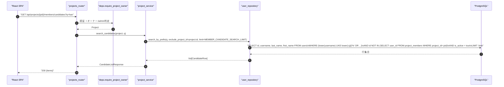
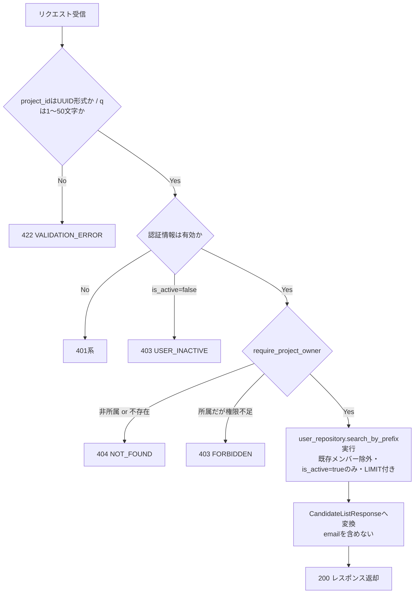
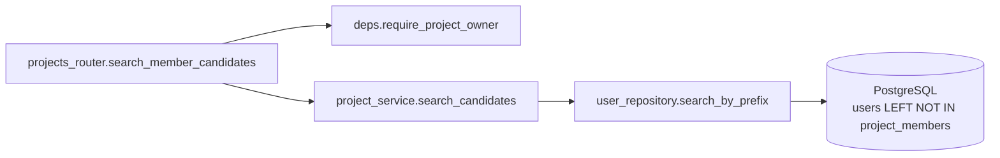
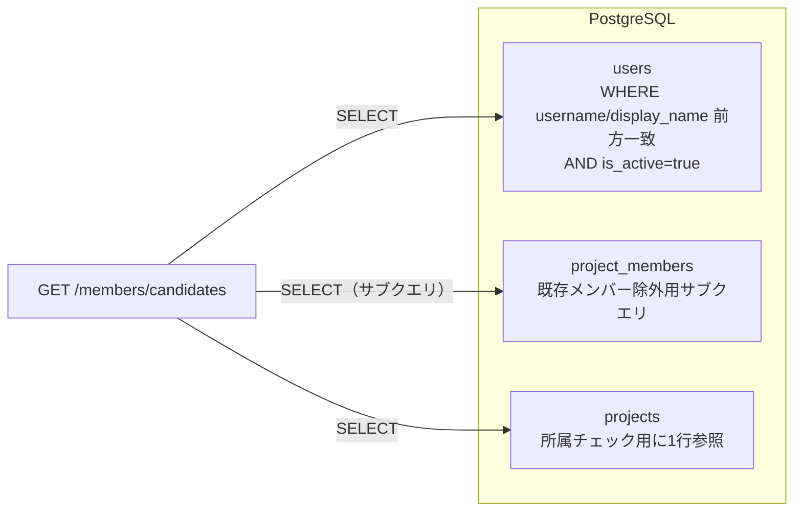

# GET /api/projects/{project_id}/members/candidates（招待候補ユーザー検索）

## 0. 関連ドキュメント

| ドキュメント | 内容 |
|--------------|------|
| [../../../basic_design/04_api.md](../../../basic_design/04_api.md) | §2.3 エンドポイント一覧（`emailはレスポンスに含めない`）、§4 エラー設計、§5 認可マトリクス |
| [../../../basic_design/01_database.md](../../../basic_design/01_database.md) | §3.1 `users`（`uq_users_username`） |
| [../../../basic_design/03_auth.md](../../../basic_design/03_auth.md) | §9.2 `require_project_owner` |
| [06_get_project_members.md](./06_get_project_members.md) | メンバー一覧取得（既存メンバーの除外に使用） |
| [07_post_project_members.md](./07_post_project_members.md) | 本APIの検索結果からuser_idを選び追加する |

## 1. 概要

| 項目 | 内容 |
|------|------|
| エンドポイント | `GET /api/projects/{project_id}/members/candidates?q=` |
| 目的 | プロジェクトへの招待対象を選ぶため、username／表示名の前方一致でユーザーを検索する（既存メンバーは除外） |
| 認証 | session モード：`cerberus_sid` Cookie ／ jwt モード：`Authorization: Bearer {access_token}` |
| 認可 | オーナー / admin（`require_project_owner`。招待できる者だけが候補を検索できる） |
| CSRF検証 | 不要（参照系のため） |
| Origin検証 | 不要 |
| AUTH_MODE差異 | 差異なし |
| 冪等性 | あり（GET） |
| レート制限 | 対象外（ただし過度な連続検索を抑止するため取得件数上限を設ける。§9参照） |
| トランザクション境界 | 参照のみのため不要 |

## 2. 入出力仕様（全体の出入力）

### 2.1 リクエスト

**パスパラメータ**

| 名前 | 型 | 必須 | 制約 | 説明 |
|------|----|------|------|------|
| project_id | string(uuid) | ○ | UUID v4形式 | 対象プロジェクトID |

**クエリパラメータ**

| 名前 | 型 | 必須 | 制約 | 説明 |
|------|----|------|------|------|
| q | string | ○ | 1〜50文字 | 検索キーワード。`username` または `display_name`（`last_name`+`first_name`）の前方一致に使用 |

ヘッダ／Cookie／ボディ：なし（認証Cookieを除く）

### 2.2 レスポンス

**`200 OK`**

```json
{
  "items": [
    {
      "user_id": "9c2e...-abcdef",
      "username": "hanako",
      "display_name": "鈴木 花子"
    }
  ]
}
```

| フィールド | 型 | NULL可否 | 説明 |
|-----------|----|----------|------|
| items[].user_id | string(uuid) | 不可 | `users.id` |
| items[].username | string | 不可 | 前方一致検索対象 |
| items[].display_name | string \| null | 可 | プロフィール未設定の場合 `null`（この場合usernameのみが検索対象になる） |

**emailを含めない理由（ユーザー列挙対策）**：本APIはオーナー/adminが任意の文字列で全ユーザーを横断検索できる。emailを結果に含めると、総当たり的な `q` の送信によって「どのメールアドレスが登録済みか」を推測できてしまう（ユーザー列挙攻撃）。username自体も推測対象になり得るが、招待機能の実現に必須の識別子であり、`basic_design/04_api.md` が明示的にusername/表示名のみを返す設計としているため、emailはレスポンス・ログの両方で扱わない。

**共通ヘッダ**：`X-Request-ID`。`Cache-Control: no-store` を付与し、候補一覧のブラウザキャッシュを防止する（ユーザー一覧の陳腐化・情報残留を避けるため）。

## 3. エラー仕様

| HTTP | code | 発生条件 | メッセージ | 備考 |
|------|------|----------|-----------|------|
| 401 | `UNAUTHENTICATED` / `SESSION_EXPIRED` / `TOKEN_EXPIRED` / `TOKEN_INVALID` | 認証情報なし・失効 | 認証が必要です | |
| 403 | `USER_INACTIVE` | リクエスト元が無効化済み | アカウントが無効化されています | |
| 403 | `FORBIDDEN` | 所属memberだがオーナーでもadminでもない | このプロジェクトを操作する権限がありません | |
| 404 | `NOT_FOUND` | プロジェクト不存在・非所属member | 指定されたプロジェクトが見つかりません | |
| 422 | `VALIDATION_ERROR` | `q` が空文字・51文字以上・未指定 | 入力内容に誤りがあります | |
| 500 | `INTERNAL_ERROR` | 未捕捉例外 | 予期しないエラーが発生しました | |
| 503 | `SERVICE_UNAVAILABLE` | DB接続不能 | 一時的に利用できません | fail-close |

## 4. 処理シーケンス



## 5. 処理フロー・分岐



## 6. 関数詳細

### 6.1 `api/routers/projects.py :: search_member_candidates`

| 項目 | 内容 |
|------|------|
| シグネチャ | `async def search_member_candidates(q: str = Query(..., min_length=1, max_length=50), project: Project = Depends(require_project_owner)) -> CandidateListResponse` |
| 引数 | q：検索キーワード、project：検証済みプロジェクト |
| 戻り値 | `CandidateListResponse` |
| 送出例外 | なし |
| 処理内容 | 1. `project_service.search_candidates(project, q)` を呼び出す 2. 結果をそのまま返す |
| 副作用 | なし |

### 6.2 `service/project_service.py :: search_candidates`

| 項目 | 内容 |
|------|------|
| シグネチャ | `async def search_candidates(project: Project, q: str) -> CandidateListResponse` |
| 引数 | project、q（前後空白をトリム済みの検索文字列） |
| 戻り値 | `CandidateListResponse`（emailを含まない） |
| 送出例外 | なし |
| 処理内容 | 1. `q.strip()` を行い空文字なら空配列を返す 2. `user_repository.search_by_prefix(q, exclude_project_id=project.id, limit=settings.MEMBER_CANDIDATE_SEARCH_LIMIT)` を呼び出す 3. 各行を `CandidateSummary`（user_id/username/display_name）へ変換 |
| 副作用 | なし |

### 6.3 `repository/user_repository.py :: search_by_prefix`

| 項目 | 内容 |
|------|------|
| シグネチャ | `async def search_by_prefix(db: AsyncSession, q: str, exclude_project_id: UUID, limit: int) -> list[UserRow]` |
| 引数 | db、q、exclude_project_id：この`project_id`の既存メンバーを除外、limit：`MEMBER_CANDIDATE_SEARCH_LIMIT` から渡す上限件数 |
| 戻り値 | 条件に合致する `users` 行（`id`, `username`, `last_name`, `first_name`） |
| 送出例外 | なし |
| 処理内容 | 1. `lower(username) LIKE lower(:q) \|\| '%'` または `lower(last_name \|\| first_name) LIKE lower(:q) \|\| '%'` で前方一致検索 2. `project_members` のサブクエリで既存メンバーを除外 3. `is_active = true` で絞り込み（無効化ユーザーは招待対象から除外） 4. `ORDER BY username LIMIT :limit` |
| 副作用 | なし |

## 7. 関数相関図



## 8. データ遷移図

読み取りのみで状態遷移なし。参照範囲は以下の通り。



## 9. データアクセス一覧

| ストア | テーブル／キー | 操作 | 条件・TTL | 備考 |
|--------|----------------|------|-----------|------|
| PostgreSQL | `users` | SELECT | `username`/`last_name+first_name` 前方一致、`is_active=true`、`LIMIT MEMBER_CANDIDATE_SEARCH_LIMIT` | `uq_users_username` の関数インデックス（`lower(username)`）は前方一致では使用されないため、本クエリは全表走査になり得る。学習規模のデータ量では許容し、要検討事項に記載 |
| PostgreSQL | `project_members` | SELECT（サブクエリ） | `WHERE project_id = :pid` の `user_id` を除外 | |
| PostgreSQL | `projects` | SELECT | `require_project_owner` 内での所属・権限確認用に1行 | |
| Redis | ー | ー | ー | 本APIはRedisを使用しない |

## 10. バリデーション規則

| スキーマ | フィールド | 制約 | フロント(zod)整合 |
|----------|-----------|------|-------------------|
| `CandidateSearchQuery`（pydantic） | q | 1〜50文字、必須 | `z.string().min(1).max(50)` |
| パスパラメータ | project_id | `UUID4`、必須 | `z.string().uuid()` |

`MEMBER_CANDIDATE_SEARCH_LIMIT`（環境変数、`core/config.py`。既定値20）を検索結果の上限件数として使用し、コード内にハードコードしない。

## 11. 非機能・セキュリティ考慮

| 観点 | 内容 |
|------|------|
| 監査ログ | 検索キーワード自体はINFOログに出力しない（`q` の内容を記録すると個人情報探索の痕跡が監査ログに残り目的外利用のリスクがあるため）。呼び出し回数のみをアクセスログで確認する |
| ユーザー列挙対策 | emailを一切返さない（本設計の主目的）。加えて `LIMIT` を設けることで全件走査による属性推測を抑制する |
| タイミング攻撃対策 | 対象外（存在有無で応答時間が有意に変わらないよう常に同一クエリ経路を通る） |
| レート制限 | 明示のレート制限は設けない（オーナー/admin限定のため）が、`LIMIT` により大量データ取得は抑止される |
| fail-close方針 | DB接続不能時は `503 SERVICE_UNAVAILABLE` |
| 無効化ユーザーの除外 | `is_active=false` のユーザーは候補から除外し、招待できないようにする（`07` の追加APIでは制限しない方針としたため、本APIでの事前フィルタが実質的な防御になる） |

## 12. テスト設計

| No | 区分 | ケース | 前提 | 期待結果 | pytest関数名案 |
|----|------|--------|------|----------|----------------|
| T1 | 結合 | usernameの前方一致検索 | `q="han"`、`username="hanako"`が存在 | 200、該当ユーザーを含む | `test_search_candidates_username_prefix` |
| T2 | 結合 | 表示名の前方一致検索 | `q="鈴木"`、`last_name="鈴木"` | 200、該当ユーザーを含む | `test_search_candidates_display_name_prefix` |
| T3 | 結合 | 既存メンバーは除外される | 対象ユーザーが既にproject_membersに存在 | 200、items に含まれない | `test_search_candidates_excludes_existing_members` |
| T4 | 結合 | 無効化ユーザーは除外される | `is_active=false` | 200、items に含まれない | `test_search_candidates_excludes_inactive_users` |
| T5 | 結合 | レスポンスにemailが含まれない | 任意の検索結果 | レスポンスJSONに `email` キーが存在しない | `test_search_candidates_response_excludes_email` |
| T6 | 結合 | qが空文字 | `q=""` | 422 VALIDATION_ERROR | `test_search_candidates_empty_q_422` |
| T7 | 結合 | qが51文字以上 | 51文字の文字列 | 422 VALIDATION_ERROR | `test_search_candidates_too_long_q_422` |
| T8 | 結合 | 所属memberだがオーナーでない | 一般memberが実行 | 403 FORBIDDEN | `test_search_candidates_forbidden_403` |
| T9 | 結合 | 非所属memberが実行 | project_membersに未登録 | 404 NOT_FOUND | `test_search_candidates_non_member_404` |
| T10 | 結合 | 該当ユーザーなし | `q="zzz999"` | 200、items=[] | `test_search_candidates_no_match_empty_list` |
| T11 | 結合 | 結果件数がLIMITを超える | 該当ユーザーが上限超過数存在 | items.length == MEMBER_CANDIDATE_SEARCH_LIMIT | `test_search_candidates_limit_applied` |
| T12 | 単体 | user_repository.search_by_prefixの呼び出し引数検証 | repositoryをモック | exclude_project_id/limitが正しく渡る | `test_service_search_candidates_calls_repository` |

## 13. 不明点・要検討事項

| 区分 | 内容 | 影響 |
|------|------|------|
| 要検討 | `MEMBER_CANDIDATE_SEARCH_LIMIT` は基本設計に明記のない環境変数名であり、本設計で「ハードコードしない」方針に沿って新規に定義した（既定値20を仮置き） | `core/config.py` 実装時に既定値・命名の最終決定が必要 |
| 要検討 | `q` に対する前方一致検索は `LIKE 'q%'` を用いるため、`uq_users_username` の関数インデックスを使えず全表走査になり得る。データ量が学習用途を超える場合は `pg_trgm` 拡張などの追加検討が必要 | パフォーマンス。現状のユーザー数規模では許容範囲と判断 |
| 要検討 | 検索対象を「オーナー/adminのみ」に限定する認可（`require_project_owner`）は `basic_design/04_api.md` §2.3 の記載どおりだが、一般memberが「このプロジェクトに誰を招待できそうか」を確認するユースケースは提供されない。必要であれば別途権限緩和の検討が要る | 現状は基本設計に従い制限を維持 |
