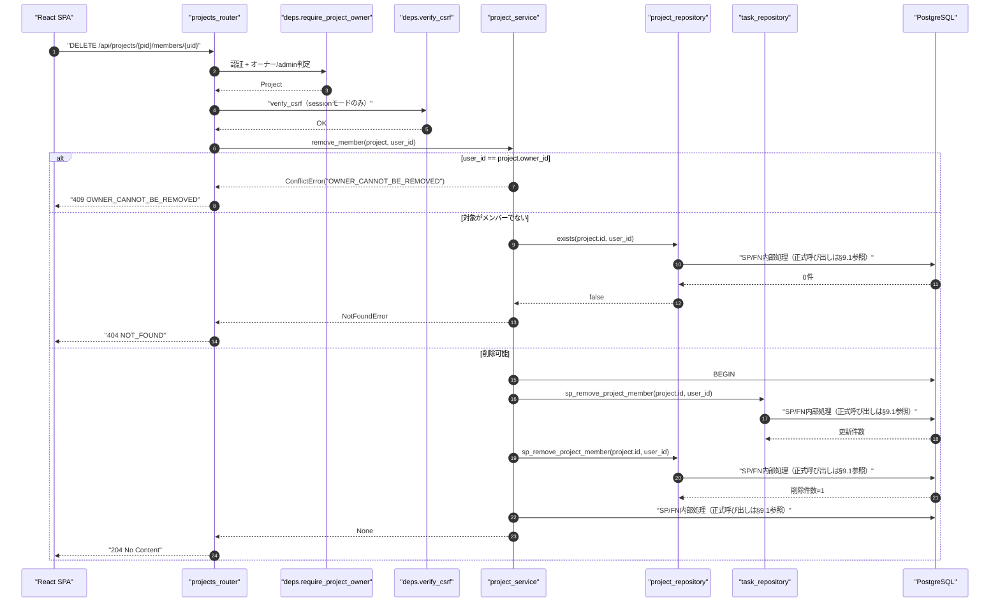
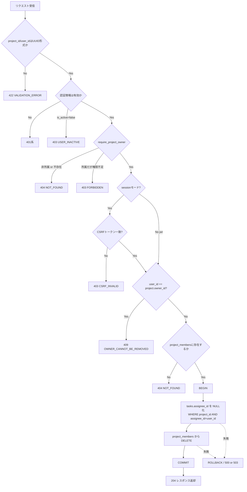
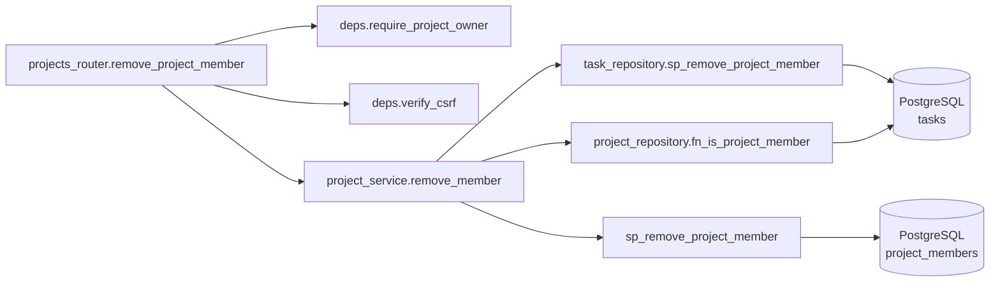
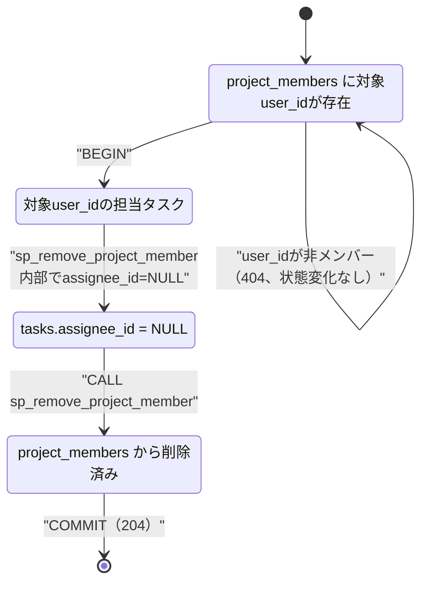

# DELETE /api/projects/{project_id}/members/{user_id}（プロジェクトメンバー削除）

## 0. 関連ドキュメント

| ドキュメント | 内容 |
|--------------|------|
| [../../../basic_design/04_api.md](../../../basic_design/04_api.md) | §2.3 エンドポイント一覧、§4 エラー設計（`OWNER_CANNOT_BE_REMOVED`）、§5 認可マトリクス、§7 サービス層関数一覧（`remove_member`） |
| [../../../basic_design/01_database.md](../../../basic_design/01_database.md) | §3.4 `project_members`、§3.5 `tasks`（`assignee_id`） |
| [../../../basic_design/03_auth.md](../../../basic_design/03_auth.md) | §9.2 `require_project_owner` |
| [06_get_project_members.md](./06_get_project_members.md) | メンバー一覧取得 |
| [07_post_project_members.md](./07_post_project_members.md) | メンバー招待 |
| [../tasks/04_patch_task.md](../tasks/04_patch_task.md) | タスク更新（`assignee_id` の扱い） |

## 1. 概要

| 項目 | 内容 |
|------|------|
| エンドポイント | `DELETE /api/projects/{project_id}/members/{user_id}` |
| 目的 | プロジェクトからメンバーを削除する。削除対象が担当中のタスクは同一トランザクションで担当解除する |
| 認証 | session モード：`cerberus_sid` Cookie ／ jwt モード：`Authorization: Bearer {access_token}` |
| 認可 | オーナー / admin（`require_project_owner`） |
| CSRF検証 | 必要（sessionモードの更新系リクエストは `X-CSRF-Token` ヘッダ必須） |
| Origin検証 | 不要（Cookieを新規発行しないリクエストのため） |
| AUTH_MODE差異 | CSRF検証の要否のみ |
| 冪等性 | なし（1回目は204、2回目は対象不存在のため404となり厳密には冪等でない。§13参照） |
| レート制限 | 対象外 |
| トランザクション境界 | `tasks.assignee_id` のNULL化と `project_members` のDELETEを1つのDBトランザクションで実行し、途中失敗時は両方ロールバックする |

## 2. 入出力仕様（全体の出入力）

### 2.1 リクエスト

**パスパラメータ**

| 名前 | 型 | 必須 | 制約 | 説明 |
|------|----|------|------|------|
| project_id | string(uuid) | ○ | UUID v4形式 | 対象プロジェクトID |
| user_id | string(uuid) | ○ | UUID v4形式 | 削除対象ユーザーID |

**ヘッダ**

| 名前 | 必須 | 説明 |
|------|------|------|
| X-CSRF-Token | sessionモードのみ○ | Double Submit Cookie方式のCSRFトークン |

**クエリパラメータ／Cookie／ボディ**：なし（認証Cookieを除く）

### 2.2 レスポンス

**`204 No Content`**：ボディなし。削除成功時。

**共通ヘッダ**：`X-Request-ID`。`Set-Cookie` はなし。

## 3. エラー仕様

| HTTP | code | 発生条件 | メッセージ | 備考 |
|------|------|----------|-----------|------|
| 401 | `UNAUTHENTICATED` / `SESSION_EXPIRED` / `TOKEN_EXPIRED` / `TOKEN_INVALID` | 認証情報なし・失効 | 認証が必要です | |
| 403 | `USER_INACTIVE` | リクエスト元が無効化済み | アカウントが無効化されています | |
| 403 | `CSRF_INVALID` | sessionモードでCSRFトークン不一致・欠落 | CSRF検証に失敗しました | |
| 403 | `FORBIDDEN` | 所属memberだがオーナーでもadminでもない | このプロジェクトを操作する権限がありません | |
| 404 | `NOT_FOUND` | プロジェクト不存在・非所属member、または `user_id` が `project_members` に存在しない | 指定されたリソースが見つかりません | 削除対象がそもそもメンバーでない場合も404とし、メンバー在籍状況を推測させない |
| 409 | `OWNER_CANNOT_BE_REMOVED` | `user_id == project.owner_id` | オーナーはメンバーから削除できません | プロジェクトのオーナー変更機能は本基本設計に存在しないため、削除する前にプロジェクト自体を削除する必要がある |
| 500 | `INTERNAL_ERROR` | 未捕捉例外 | 予期しないエラーが発生しました | |
| 503 | `SERVICE_UNAVAILABLE` | DB接続不能 | 一時的に利用できません | fail-close |

## 4. 処理シーケンス

## 5. 処理フロー・分岐

## 6. 関数詳細

### 6.1 `api/routers/projects.py :: remove_project_member`

| 項目 | 内容 |
|------|------|
| シグネチャ | `async def remove_project_member(user_id: UUID, project: Project = Depends(require_project_owner), _: None = Depends(verify_csrf)) -> Response` |
| 引数 | user_id：削除対象（パスパラメータ）、project：検証済みプロジェクト、`_`：CSRF検証結果 |
| 戻り値 | `Response(status_code=204)` |
| 送出例外 | なし |
| 処理内容 | 1. `project_service.remove_member(project, user_id)` を呼び出す 2. 204を返す |
| 副作用 | なし |

### 6.2 `service/project_service.py :: remove_member`

| 項目 | 内容 |
|------|------|
| シグネチャ | `async def remove_member(project: Project, user_id: UUID) -> None` |
| 引数 | project、user_id |
| 戻り値 | なし |
| 送出例外 | `ConflictError("OWNER_CANNOT_BE_REMOVED")`（→409）、`NotFoundError`（→404） |
| 処理内容 | 1. `user_id == project.owner_id` なら `ConflictError` 2. `SELECT fn_is_project_member(project.id, user_id)` が `false` なら `NotFoundError` 3. `CALL sp_remove_project_member(project.id, user_id)` を1回呼び、担当解除と所属削除を同一トランザクションで完了する |
| 副作用 | DB更新（`tasks.assignee_id` のNULL化、`project_members` のDELETE）。両方とも同一トランザクション内で実行し、一方が失敗すれば全体をロールバックする |

### 6.3 `repository/project_repository.py :: sp_remove_project_member`

| 項目 | 内容 |
|------|------|
| シグネチャ | `async def sp_remove_project_member(db: AsyncSession, project_id: UUID, user_id: UUID) -> int` |
| 引数 | db、project_id、user_id |
| 戻り値 | 更新された行数 |
| 送出例外 | なし（DB例外は上位のトランザクション制御でロールバック） |
| 処理内容 | `sp_remove_project_member` 内部で担当タスクをNULL化する |
| 副作用 | DB更新 |

### 6.4 `repository/project_repository.py :: sp_remove_project_member`

| 項目 | 内容 |
|------|------|
| シグネチャ | `async def sp_remove_project_member(db: AsyncSession, project_id: UUID, user_id: UUID) -> None` |
| 引数 | db、project_id、user_id |
| 戻り値 | なし |
| 送出例外 | なし |
| 処理内容 | `CALL sp_remove_project_member(:project_id, :user_id)` |
| 副作用 | DB更新 |

## 7. 関数相関図

## 8. データ遷移図

## 9. SP/FNデータアクセス一覧

### 9.1 正式なDBアクセス契約

本APIのrepositoryは、次のSP/FN呼び出しとDTO写像だけを行う。

| 種別 | 契約 | 説明 |
|------|------|------|
| remove_project_member | `sp_remove_project_member(p_project_id, p_user_id)` | sp_remove_project_memberを呼び出し、結果をレスポンスへ写像する |

repositoryはDBテーブルへ直結せず、SP/FN契約だけを呼び出す。 直下の従来のテーブルI/O表はSP/FN内部SQLの補足であり、repositoryの発行契約ではない。更新系の整合性制御、version検証、advisory lock、通知、SQLSTATE P0xxxはSP/FN層の責務である。存在・所属の事実判定はFNの空集合/falseを受け、404/403への変換はAPI層が行う。

| ストア | テーブル／キー | 操作 | 条件・TTL | 備考 |
|--------|----------------|------|-----------|------|
| PostgreSQL | `project_members` | SELECT | `WHERE project_id=:pid AND user_id=:uid`（存在確認） | `exists` |
| PostgreSQL | `sp_remove_project_member` | SP内部更新 | 対象メンバーの担当解除後に所属を削除 | 担当解除と所属削除を同一トランザクションで実行する |
| PostgreSQL | `project_members` | DELETE | `WHERE project_id=:pid AND user_id=:uid` | 複合主キーでの削除 |
| Redis | ー | ー | ー | 本APIはRedisを使用しない |

## 10. バリデーション規則

| スキーマ | フィールド | 制約 | フロント(zod)整合 |
|----------|-----------|------|-------------------|
| パスパラメータ | project_id | `UUID4`、必須 | `z.string().uuid()` |
| パスパラメータ | user_id | `UUID4`、必須 | `z.string().uuid()` |

リクエストボディは存在しない。

## 11. 非機能・セキュリティ考慮

| 観点 | 内容 |
|------|------|
| 監査ログ | INFOログでメンバー削除イベントを出力（`project_id`, `removed_user_id`, `removed_by`, `unassigned_task_count`, `request_id`）。担当解除件数を含めることで運用時の影響範囲を追跡可能にする |
| ユーザー列挙対策 | 対象外（オーナー/admin限定操作のため） |
| タイミング攻撃対策 | 対象外 |
| レート制限 | 対象外 |
| fail-close方針 | DB接続不能・トランザクション中の失敗時は `503` または `500` とし、`tasks` のNULL化のみが反映される部分成功状態を発生させない（トランザクションでロールバック） |
| CSRF | sessionモードは `X-CSRF-Token` 必須 |
| 監査上の整合性 | 担当解除されたタスクの `updated_at` はトリガ（`trg_set_updated_at`）により自動更新される |

## 12. テスト設計

| No | 区分 | ケース | 前提 | 期待結果 | pytest関数名案 |
|----|------|--------|------|----------|----------------|
| T1 | 結合 | オーナーが一般メンバーを削除 | 対象が担当タスクなし | 204、project_membersから削除 | `test_remove_member_success_204` |
| T2 | 結合 | 削除対象が担当タスクを持つ | tasksに`assignee_id=user_id`が2件 | 204、該当タスクの`assignee_id`がNULLになる | `test_remove_member_unassigns_tasks` |
| T3 | 結合 | オーナー自身を削除しようとする | `user_id == project.owner_id` | 409 OWNER_CANNOT_BE_REMOVED | `test_remove_member_owner_conflict_409` |
| T4 | 結合 | 非メンバーのuser_idを指定 | project_membersに未登録 | 404 NOT_FOUND | `test_remove_member_not_member_404` |
| T5 | 結合 | adminが実行 | adminが非所属プロジェクトに対して実行 | 204（require_project_ownerの無条件通過） | `test_remove_member_admin_bypass` |
| T6 | 結合 | 所属memberだがオーナーでない | 一般memberが実行 | 403 FORBIDDEN | `test_remove_member_forbidden_403` |
| T7 | 結合 | 非所属memberが実行 | project_membersに未登録（実行者側） | 404 NOT_FOUND | `test_remove_member_non_member_403_or_404` |
| T8 | 結合 | sessionモードでCSRFトークン欠落 | X-CSRF-Tokenなし | 403 CSRF_INVALID | `test_remove_member_csrf_missing_403` |
| T9 | 結合（実DB・実SP） | サービス層のトランザクション制御検証 | task_repository/project_実DB・実SPで検証 | sp_remove_project_memberがsp_remove_project_memberより先に呼ばれる | `test_service_remove_member_order` |
| T10 | 結合 | 担当解除とメンバー削除の原子性 | sp_remove_project_member実行後にsp_remove_project_memberでエラーを注入 | ロールバックされtasksのassignee_idが元に戻る | `test_remove_member_transaction_rollback` |
| T11 | 結合 | AUTH_MODE=session/jwt両方 | 各モードでログイン | いずれも204 | `test_remove_member_both_auth_modes` |

T10は意図的な例外注入によるロールバック検証であり、実DBコンテナを用いた結合テストとして実施する（`basic_design/04_api.md` §8 の方針に準拠）。

## 13. 不明点・要検討事項

| 区分 | 内容 | 影響 |
|------|------|------|
| 要検討 | 冪等性について：同一 `user_id` に対する2回目のDELETEは対象が既に非メンバーのため404となり、RESTの一般的な「DELETE成功後の再実行は204」という冪等設計とは異なる。`basic_design/04_api.md` に本APIの冪等性方針の明記がないため、既存メンバー確認を必須とする404方針を採用した | フロント側は2回目リクエストで404が返る前提でエラーハンドリングする必要がある |
| 要検討 | メンバーが自分自身をプロジェクトから離脱する「セルフ退出」機能は基本設計の認可マトリクスに存在せず（`DELETE .../members/{user_id}` はオーナー/admin限定）、本設計では実装対象外とした | 将来的にセルフ退出を追加する場合は別エンドポイントまたは認可条件の緩和が必要 |
| なし | 上記以外の基本設計との矛盾は確認されなかった | ー |
