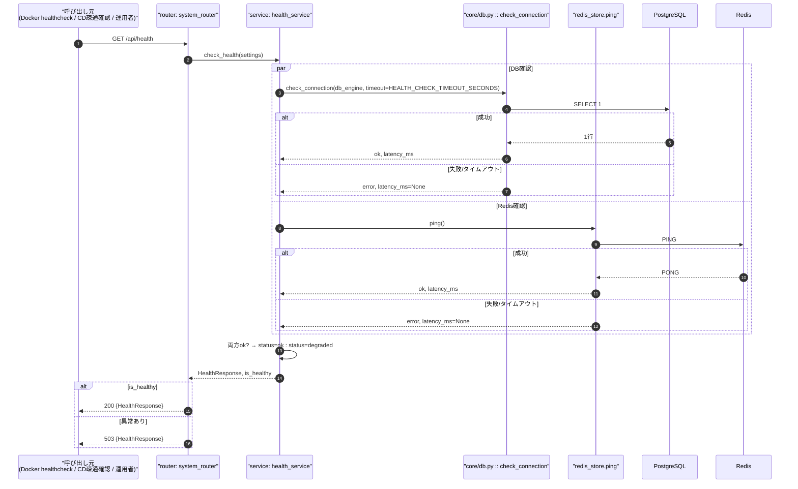
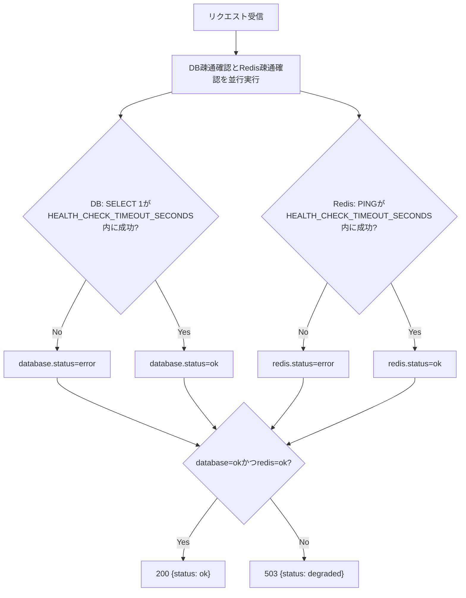
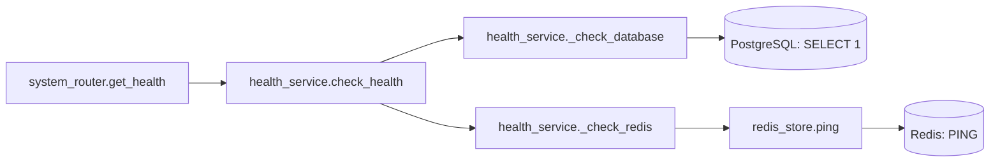
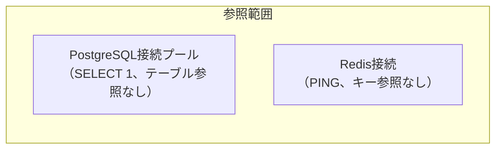

# GET /api/health（ヘルスチェック）

## 0. 関連ドキュメント

| ドキュメント | パス |
|--------------|------|
| API基本設計 | `../../../basic_design/04_api.md`（§2.6 その他） |
| Redis基本設計 | `../../../basic_design/02_redis.md`（§5.3 `ping`、§6 障害・運用時の挙動） |
| インフラ基本設計 | `../../../basic_design/06_infra_cicd.md`（§2 Docker Compose構成、§6.1 CDフロー） |
| 認証基本設計 | `../../../basic_design/03_auth.md`（§2.2 ファクトリ：`AUTH_MODE`の起動時評価） |

## 1. 概要

| 項目 | 内容 |
|------|------|
| エンドポイント | `GET /api/health` |
| 目的 | DB（PostgreSQL）・Redisの接続状態と現在の`AUTH_MODE`を返す。Docker Composeのコンテナヘルスチェック、CDのデプロイ後疎通確認、運用者の手動確認から利用される（`06_infra_cicd.md`§2・§6.1・§8） |
| 認証 | 不要 |
| 認可 | 未認証可 |
| CSRF検証 | 不要（参照系・Cookie発行/利用なし） |
| Origin検証 | 不要（Cookieを発行/利用しない参照系のため） |
| AUTH_MODE差異 | 処理内容に差異なし。レスポンスの`auth_mode`フィールドとして現在値を返す点のみ`AUTH_MODE`設定に依存 |
| 冪等性 | あり（副作用のない参照のみ） |
| レート制限 | 対象外（ヘルスチェックは高頻度呼び出しを前提とするため`login_fail`等のレート制限機構は適用しない） |
| トランザクション境界 | なし（DB: `SELECT 1`相当の疎通確認のみ。テーブルへのSELECT/UPDATEを伴わない） |

## 2. 入出力仕様

### 2.1 リクエスト

パスパラメータ：なし　クエリパラメータ：なし　ヘッダ：なし　Cookie：なし　ボディ：なし

### 2.2 レスポンス

**200 OK**（全コンポーネント正常。`HealthResponse`）

```json
{
  "status": "ok",
  "auth_mode": "session",
  "components": {
    "database": { "status": "ok", "latency_ms": 3 },
    "redis": { "status": "ok", "latency_ms": 1 }
  }
}
```

**503 Service Unavailable**（DBまたはRedisのいずれかが異常）

```json
{
  "status": "degraded",
  "auth_mode": "session",
  "components": {
    "database": { "status": "ok", "latency_ms": 4 },
    "redis": { "status": "error", "latency_ms": null }
  }
}
```

| フィールド | 型 | NULL可否 | 説明 |
|-----------|----|----------|------|
| status | string | 不可 | `ok`（全コンポーネント正常）/ `degraded`（1つ以上異常） |
| auth_mode | string | 不可 | 現在の`AUTH_MODE`（`session`/`jwt`）。起動時に`@lru_cache`で確定した値（`03_auth.md`§2.2） |
| components.database.status | string | 不可 | `ok` / `error` |
| components.database.latency_ms | integer | 可（`error`時はNULL） | 疎通確認クエリの応答時間（ミリ秒） |
| components.redis.status | string | 不可 | `ok` / `error` |
| components.redis.latency_ms | integer | 可（`error`時はNULL） | `PING`コマンドの応答時間（ミリ秒） |

本APIのレスポンスは`404 NOT_FOUND`との区別以外に業務エラーコード体系（`04_api.md`§4.1の`error`オブジェクト形式）を用いない。**秘密情報（接続文字列・認証情報等）は一切含めない**。`Cache-Control: no-store`を付与する（ロードバランサ・プロキシによるキャッシュを防ぐ）。共通ヘッダ：`X-Request-ID`。

## 3. エラー仕様

| HTTP | code | 発生条件 | メッセージ | 備考 |
|------|------|----------|------------|------|
| 503 | - | DBまたはRedisのいずれかへの疎通確認が失敗（タイムアウト含む） | - | 通常のエラーレスポンス形式（`error`オブジェクト）ではなく、`HealthResponse`の`status=degraded`のまま503を返す。`04_api.md`§4.2の`SERVICE_UNAVAILABLE`とは異なり、本APIは認証必須APIのfail-closeとは独立した「死活監視専用」のレスポンス形式とする（§13参照） |
| 500 | `INTERNAL_ERROR` | ヘルスチェック処理自体の未捕捉例外（想定外のバグ） | サーバーエラーが発生しました | 通常のエラーハンドラ（`04_api.md`§4.3）に委ねる |

DBとRedisのどちらが異常であっても一律503とし、HTTPステータスレベルでは異常種別を区別しない（`components`フィールドで種別を判別する）。これはDocker/CIのヘルスチェックが多くの場合HTTPステータスコードのみで健全性を判定するため、判定ロジックを単純化する意図による。

## 4. 処理シーケンス



## 5. 処理フロー・分岐



## 6. 関数詳細

### 6.1 `api/routers/system_router.py :: get_health`

| 項目 | 内容 |
|------|------|
| シグネチャ | `async def get_health(response: Response, db_engine: AsyncEngine = Depends(get_db_engine), redis_client: Redis = Depends(get_redis_client), settings: Settings = Depends(get_settings)) -> HealthResponse` |
| 引数 | `response`（ステータスコード上書き用）、`db_engine`、`redis_client`、`settings` |
| 戻り値 | `HealthResponse`（`response.status_code`を200または503に設定して返す） |
| 送出例外 | なし（内部で発生した例外は`health_service`が捕捉し`error`ステータスへ変換する。本エンドポイントは`get_current_user`等の認証系DIを一切経由しない） |
| 処理内容 | 1. `health_service.check_health(db_engine, redis_client, settings)`を呼び出す 2. 戻り値の`is_healthy`に応じて`response.status_code`を`200`または`503`に設定 3. `HealthResponse`を返す |
| 副作用 | なし |

### 6.2 `service/health_service.py :: check_health`

| 項目 | 内容 |
|------|------|
| シグネチャ | `async def check_health(db_engine: AsyncEngine, redis_client: Redis, settings: Settings) -> tuple[HealthResponse, bool]` |
| 引数 | `db_engine`、`redis_client`、`settings`（`auth_mode`・`health_check_timeout_seconds`を参照） |
| 戻り値 | `(HealthResponse, is_healthy: bool)` |
| 送出例外 | なし（各コンポーネント確認内の例外は握りつぶし`error`扱いに変換する。ヘルスチェック自体が例外で落ちないことを最優先する） |
| 処理内容 | 1. `asyncio.gather`で`_check_database`と`_check_redis`を並行実行 2. いずれも`(status, latency_ms)`を返す 3. 両方`ok`なら`status="ok"`・`is_healthy=True`、いずれかが`error`なら`status="degraded"`・`is_healthy=False` 4. `settings.auth_mode`を付与して`HealthResponse`を構築 |
| 副作用 | なし |

### 6.3 `service/health_service.py :: _check_database`

| 項目 | 内容 |
|------|------|
| シグネチャ | `async def _check_database(db_engine: AsyncEngine, timeout_seconds: float) -> ComponentHealth` |
| 引数 | `db_engine`、`timeout_seconds`（`HEALTH_CHECK_TIMEOUT_SECONDS`） |
| 戻り値 | `ComponentHealth(status, latency_ms)` |
| 送出例外 | なし（`OperationalError`・`TimeoutError`を内部で捕捉） |
| 処理内容 | 1. 時刻計測を開始 2. `asyncio.wait_for(conn.execute(text("SELECT 1")), timeout=timeout_seconds)`を実行（プールから新規コネクションを取得。既存の`get_db`とは独立した専用コネクション） 3. 成功なら経過時間を`latency_ms`として`status="ok"` 4. 例外発生時は`status="error"`、`latency_ms=None` |
| 副作用 | なし（読み取り専用の`SELECT 1`のみ。テーブルアクセスなし） |

### 6.4 `service/health_service.py :: _check_redis`

| 項目 | 内容 |
|------|------|
| シグネチャ | `async def _check_redis(redis_client: Redis, timeout_seconds: float) -> ComponentHealth` |
| 引数 | `redis_client`、`timeout_seconds` |
| 戻り値 | `ComponentHealth(status, latency_ms)` |
| 送出例外 | なし（`RedisError`・`TimeoutError`を内部で捕捉） |
| 処理内容 | 1. 時刻計測を開始 2. `asyncio.wait_for(redis_store.ping(), timeout=timeout_seconds)`を実行 3. 成功なら`latency_ms`を記録し`status="ok"` 4. 例外発生時は`status="error"`、`latency_ms=None` |
| 副作用 | なし |

### 6.5 `repository/redis_store.py :: ping`

`../../../basic_design/02_redis.md`§5.3を参照（担当外だが再利用する既存関数）。`redis-py`の`PING`コマンドをラップする。

## 7. 関数相関図



## 8. データ遷移図

読み取り（疎通確認）のみで状態遷移なし。永続データ・Redisキーいずれも更新しない。



## 9. データアクセス一覧

**PostgreSQL**

| テーブル | 操作 | 条件・TTL | 備考 |
|----------|------|-----------|------|
| なし | `SELECT 1`（テーブル非依存の疎通確認） | タイムアウト`HEALTH_CHECK_TIMEOUT_SECONDS` | 接続プールから新規コネクションを取得して即座に返却 |

**Redis**

| キー | 操作 | 条件・TTL | 備考 |
|------|------|-----------|------|
| なし | `PING`（キー非依存の疎通確認） | タイムアウト`HEALTH_CHECK_TIMEOUT_SECONDS` | |

## 10. バリデーション規則

リクエストパラメータなし。`HealthResponse`は出力専用スキーマのため入力バリデーションは無い。

## 11. 非機能・セキュリティ考慮

| 項目 | 内容 |
|------|------|
| 監査ログ | 記録しない。異常検知時（`status=degraded`）のみアプリログにWARNINGレベルで出力し、どちらのコンポーネントが異常かを記録する（接続文字列やエラーの詳細スタックはログにも出力するが、レスポンスボディには含めない） |
| 秘密情報の非露出 | `DATABASE_URL`・`REDIS_URL`・接続エラーの詳細メッセージ（ホスト名等を含み得る）はレスポンスに含めない。`status: error`とだけ返す |
| fail-close方針との関係 | 本APIは認証必須APIの`SERVICE_UNAVAILABLE`（`04_api.md`§4.2）とは異なる専用レスポンス形式を用いる。ただしDB/Redis異常時に503を返す点は認証必須APIのfail-close方針（`02_redis.md`§6）と整合する |
| 認証を要求しない理由 | Docker Composeの`healthcheck`（コンテナ内部からの疎通）、CDのデプロイ後ポーリング（`06_infra_cicd.md`§6.1）、CIでの`backend-test`起動確認など、認証情報を持たない仕組みから呼ばれるため。外部への情報漏洩は上記の秘密情報非露出方針で抑止する |
| レート制限を設けない理由 | Docker/CIのヘルスチェックは数秒〜数十秒間隔で継続的に呼ばれる想定であり、レート制限を課すと死活監視自体が機能しなくなるため対象外とする |
| タイムアウト値 | DB・Redisとも共通の`HEALTH_CHECK_TIMEOUT_SECONDS`（環境変数化。既定値は基本設計に明記がないため`2`秒を仮値として提案。§13参照）を用い、ハードコードしない |

## 12. テスト設計

| No | 区分 | ケース | 前提 | 期待結果 | pytest関数名案 |
|----|------|--------|------|----------|-----------------|
| 1 | 単体 | DB/Redisともに正常 | `_check_database`/`_check_redis`をモックしok固定 | `status=ok`、`is_healthy=True` | `test_check_health_all_ok` |
| 2 | 単体 | DBのみ異常 | `_check_database`が`error`を返す | `status=degraded`、`is_healthy=False`、`database.status=error` | `test_check_health_database_error` |
| 3 | 単体 | Redisのみ異常 | `_check_redis`が`error`を返す | `status=degraded`、`is_healthy=False`、`redis.status=error` | `test_check_health_redis_error` |
| 4 | 単体 | DBタイムアウト | `SELECT 1`が`HEALTH_CHECK_TIMEOUT_SECONDS`を超過 | `database.status=error`、例外を送出せず処理継続 | `test_check_database_timeout_treated_as_error` |
| 5 | 単体 | レスポンスに秘密情報が含まれない | 異常系レスポンス全般 | `DATABASE_URL`等の文字列がレスポンスJSONに含まれない | `test_health_response_excludes_secrets` |
| 6 | 結合 | 正常系 | 実PostgreSQL/Redis起動済み | `200`、`components.database.status=ok`、`components.redis.status=ok` | `test_get_health_endpoint_success` |
| 7 | 結合 | Redis停止時 | Redisコンテナを停止した状態で呼び出し（結合テスト環境限定） | `503`、`components.redis.status=error` | `test_get_health_endpoint_redis_down` |
| 8 | 結合 | auth_modeの反映 | `AUTH_MODE=jwt`で起動 | レスポンスの`auth_mode="jwt"` | `test_get_health_endpoint_reflects_auth_mode` |
| 9 | 結合 | 認証不要であること | Cookie/ヘッダなしで呼び出し | `401`にならず`200`または`503` | `test_get_health_endpoint_no_auth_required` |
| 10 | 網羅対象外 | PostgreSQL/Redisプロセス自体の異常終了直後のタイミング差異 | - | 自動テストでは再現せず、`02_redis.md`§7・DB結合テスト環境の制約上、手動確認とする | - |

`AUTH_MODE=session`/`jwt`の両方で6・8を実施する（本APIの処理自体に差異はないが、matrix構成上の実行対象に含める）。

## 13. 不明点・要検討事項

| 区分 | 内容 | 影響 |
|------|------|------|
| 要検討 | `HEALTH_CHECK_TIMEOUT_SECONDS`という環境変数は基本設計（`06_infra_cicd.md`§4章の環境変数一覧）に未掲載であり、本書で新規に提案した（仮値2秒）。Docker Composeの`healthcheck`自体にも`interval`/`timeout`/`retries`があり、両者の関係（アプリ内タイムアウト vs Dockerのヘルスチェック設定）を整理する必要がある |
| 要検討 | DB異常とRedis異常を区別せず一律503とする方針は、`04_api.md`§2.6の「異常時のHTTPステータス」という要求に対する本書独自の解釈である。将来的にどちらか一方のみ異常な場合に200を返す（縮退運転を許容する）べきかは要件次第で再検討が必要 |
| 要検討 | `SELECT 1`によるDB疎通確認は基本設計に明記された関数ではなく、本書が実装レベルの詳細として補った（`core/db.py :: check_connection`という関数名・シグネチャは提案）。DBセッションプールの専用コネクション取得方法（既存の`get_db`と共用するか独立させるか）は実装時に確定させる必要がある |
