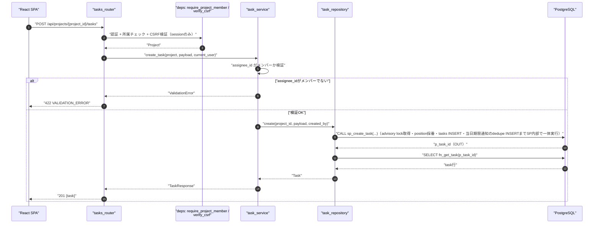
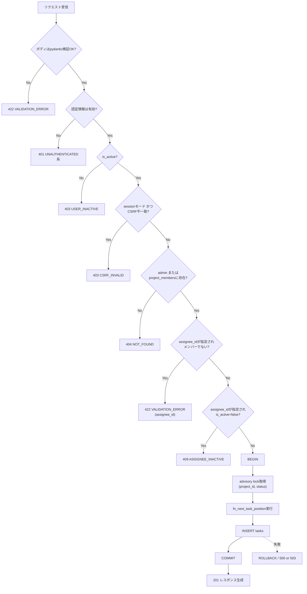
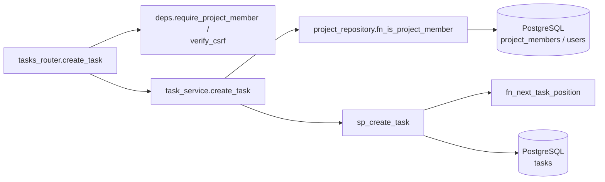
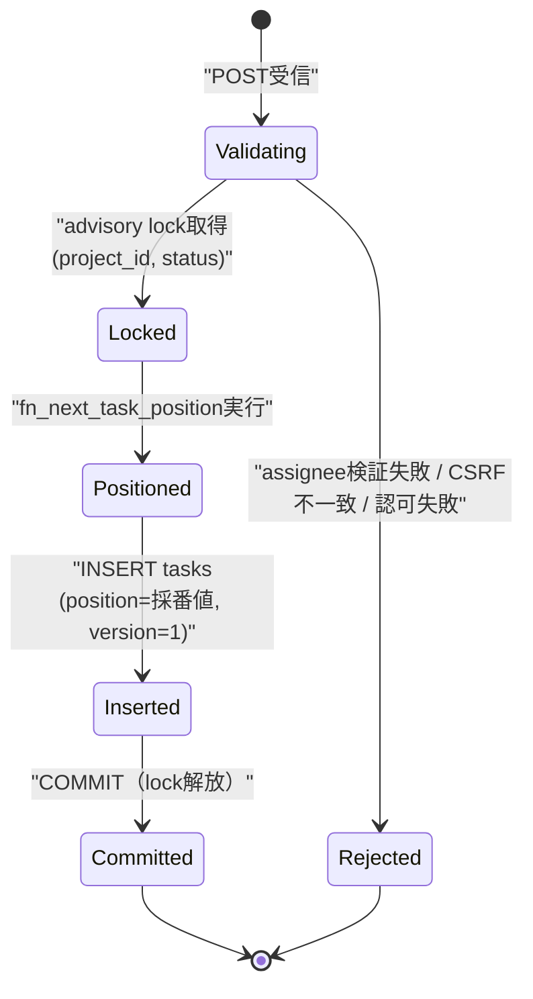

# POST /api/projects/{project_id}/tasks（タスク作成）

## 0. 関連ドキュメント

| ドキュメント | 内容 |
|--------------|------|
| [../../../basic_design/04_api.md](../../../basic_design/04_api.md) | §2.4 エンドポイント一覧、§3.2 リクエスト例、§6.1 タスク作成シーケンス、§7.2 サービス層関数一覧 |
| [../../../basic_design/01_database.md](../../../basic_design/01_database.md) | §3.5 tasks（`position`/`version`）、§5.3 `fn_next_task_position` |
| [../../../basic_design/00_overview.md](../../../basic_design/00_overview.md) | §3 レイヤ構成 |
| [../../auth/05_rbac.md](../../auth/05_rbac.md) | `require_project_member`、CSRF/Origin検証 |
| [../../auth/03_csrf.md](../../auth/03_csrf.md) | 更新系のCSRF検証仕様 |
| [../../database/06_table_tasks.md](../../database/06_table_tasks.md) | tasks テーブル詳細 |
| [../../database/08_db_functions.md](../../database/08_db_functions.md) | `fn_next_task_position` の詳細 |
| [../notifications/01_get_notifications.md](../notifications/01_get_notifications.md) | 通知一覧スキーマ |
| [../../database/10_table_notifications.md](../../database/10_table_notifications.md) | 通知の`dedupe_key`とINSERT制約 |
| [./01_get_project_tasks.md](./01_get_project_tasks.md) | 同一リソースの一覧取得API |
| [./04_patch_task.md](./04_patch_task.md) | position採番・advisory lockの詳細な考え方 |
| [./11_post_tasks.md](./11_post_tasks.md) | `project_id`を任意bodyで受けるフラット作成API（本APIとの使い分け・所属チェック流用） |
| [../../database/06_table_tasks.md](../../database/06_table_tasks.md) | `tasks.is_active`（論理削除フラグ） |

## 1. 概要

| 項目 | 内容 |
|------|------|
| エンドポイント | `POST /api/projects/{project_id}/tasks` |
| 目的 | 指定プロジェクトの指定 `status` 列末尾へ新規タスクを1件作成する |
| 認証 | session モード：`cerberus_sid` Cookie ／ jwt モード：`Authorization: Bearer {access_token}` |
| 認可 | プロジェクトメンバー（`require_project_member`。admin は無条件許可） |
| CSRF検証 | 必要（session モードの更新系。`X-CSRF-Token` ヘッダ必須） |
| Origin検証 | 不要（Cookie発行を伴わない一般更新系APIのため対象外。Origin検証はログイン・`/auth/refresh`・`/auth/logout`・OAuth交換に限定：[../../../basic_design/04_api.md](../../../basic_design/04_api.md) §1） |
| AUTH_MODE差異 | session時はCSRF検証あり、jwt時はAuthorizationヘッダのためCSRF検証不要。それ以外の業務ロジックに差異なし |
| 冪等性 | なし（POSTのため同一リクエストの再送で複数タスクが作成され得る。冪等キーは設けない） |
| レート制限 | 対象外 |
| トランザクション境界 | `BEGIN` から position 採番・INSERT・`COMMIT` までを1トランザクションとする |

## 2. 入出力仕様（全体の出入力）

### 2.1 リクエスト

**パスパラメータ**

| 名前 | 型 | 必須 | 制約 | 説明 |
|------|----|----|------|------|
| project_id | string(uuid) | ○ | UUID v4形式 | 対象プロジェクトID |

**クエリパラメータ**：なし

**ヘッダ**

| 名前 | 必須 | 説明 |
|------|------|------|
| `Authorization` | jwt モードのみ必須 | `Bearer {access_token}` |
| `X-CSRF-Token` | session モードのみ必須 | `cerberus_csrf` Cookie値と一致すること |

**Cookie**：session モード時 `cerberus_sid` / `cerberus_csrf` が必須。

**ボディ**

| フィールド | 型 | 必須 | 制約 | 説明 |
|-----------|----|----|------|------|
| title | string | ○ | 1〜150文字 | タイトル（`tasks.title` の `VARCHAR(150)` に対応） |
| description | string \| null | - | 省略時 `null` | 説明 |
| status | string | - | `todo` / `in_progress` / `done`、省略時 `todo` | 初期ステータス |
| assignee_id | string(uuid) \| null | - | 省略時 `null`。有効なプロジェクトメンバーのIDであること | 担当者 |
| due_at | string(date-time) \| null | - | 省略時 `null`、ISO 8601。オフセットなしは `APP_TIMEZONE` として解釈 | 期限日時 |

`position` はリクエストで指定不可（指定してもpydanticスキーマに定義せず無視、または422とする。本設計では**スキーマに定義しないことで422にする**方針とし、常にサーバー側で対象列の末尾へ採番する）。

### 2.2 レスポンス

**`201 Created`**

```json
{
  "id": "b2e4...",
  "project_id": "3f1c2a10-...",
  "title": "設計書をレビューする",
  "description": null,
  "status": "todo",
  "assignee": null,
  "created_by": { "id": "9a1b...", "username": "taro" },
  "position": 3,
  "version": 1,
  "is_active": true,
  "project_is_active": true,
  "due_at": null,
  "created_at": "2026-09-03T04:05:06Z",
  "updated_at": "2026-09-03T04:05:06Z"
}
```

| フィールド | 型 | NULL可否 | 説明 |
|-----------|----|----------|------|
| id | string(uuid) | 不可 | 作成されたタスクID |
| project_id | string(uuid) | 不可 | 所属プロジェクトID |
| title | string | 不可 | |
| description | string | 可 | |
| status | string | 不可 | `todo` / `in_progress` / `done` |
| assignee | object | 可 | `{id, username, display_name}`。未指定時 `null` |
| created_by | object | 不可 | `{id, username}` |
| position | integer | 不可 | 採番された列内位置（`fn_next_task_position` の結果） |
| version | integer | 不可 | 常に `1` で初期化 |
| is_active | boolean | 不可 | `tasks.is_active`。作成直後は常に `true` |
| project_is_active | boolean | 不可 | `projects.is_active`。本APIは`project_id`がパス由来で確定しているため常にそのプロジェクトの値 |
| due_at | string(date-time) | 可 | ISO 8601 UTC。NULL可 |
| created_at / updated_at | string(datetime) | 不可 | ISO 8601 UTC |

`Set-Cookie` の発行なし。`X-Request-ID` を全レスポンスに付与。

## 3. エラー仕様

| HTTP | code | 発生条件 | メッセージ | 備考 |
|------|------|----------|------------|------|
| 401 | `UNAUTHENTICATED` / `SESSION_EXPIRED` / `TOKEN_EXPIRED` / `TOKEN_INVALID` | 認証情報なし・無効 | 認証が必要です | |
| 403 | `USER_INACTIVE` | `is_active=false` | アカウントが無効化されています | |
| 403 | `CSRF_INVALID` | session モードでヘッダ欠落・不一致 | CSRFトークンが不正です | |
| 404 | `NOT_FOUND` | `project_id` 不存在、または非所属member | プロジェクトが見つかりません | |
| 409 | `ASSIGNEE_INACTIVE` | 指定 `assignee_id` のユーザーが `is_active=false` | 指定した担当者は無効化されています | |
| 422 | `VALIDATION_ERROR` | title文字数超過、status不正値、position指定、日付形式不正等 | 入力内容に誤りがあります | `details` にフィールド単位のエラー |
| 422 | `VALIDATION_ERROR`（業務検証） | `assignee_id` が `project_members` に存在しない | 指定した担当者はプロジェクトのメンバーではありません | サービス層で検出し `details` に `assignee_id` を含める |
| 503 | `SERVICE_UNAVAILABLE` | PostgreSQL接続不能 | 一時的にサービスを利用できません | fail-close |

## 4. 処理シーケンス



## 5. 処理フロー・分岐



## 6. 関数詳細

### 6.1 `api/routers/tasks.py :: create_task`

| 項目 | 内容 |
|------|------|
| シグネチャ | `async def create_task(project_id: UUID, payload: TaskCreateRequest, project: Project = Depends(require_project_member), current_user: CurrentUser = Depends(get_current_user), db: AsyncSession = Depends(get_db)) -> TaskResponse` |
| 引数 | project_id: 対象プロジェクトID／payload: リクエストボディ／project: 認可済みProject／current_user: 現在ユーザー／db: DBセッション |
| 戻り値 | `TaskResponse`（201） |
| 送出例外 | `ValidationError`（422）、`ConflictError`（`ASSIGNEE_INACTIVE`、409） |
| 処理内容 | 1. CSRF検証はルーター前段の依存性（`verify_csrf`、session モードのみ有効化）で完了済み<br/>2. `task_service.create_task(project, payload, current_user)` を呼び出す<br/>3. 結果を201で返す |
| 副作用 | DB更新（tasks INSERT）。条件成立時は同一トランザクションでnotifications INSERT |

### 6.2 `service/task_service.py :: create_task`

| 項目 | 内容 |
|------|------|
| シグネチャ | `async def create_task(project: Project, payload: TaskCreateRequest, user: CurrentUser) -> Task` |
| 引数 | project: 認可済みProject／payload: 作成内容／user: 作成者（`created_by` に記録） |
| 戻り値 | `Task`（ORMモデルまたはDTO） |
| 送出例外 | `ValidationError`（`assignee_id` が非メンバー）、`ConflictError`（`assignee_id` が `is_active=false`） |
| 処理内容 | 1. `payload.assignee_id` が `None` でない場合、`project_repository.fn_is_project_member(project.id, assignee_id)` で所属確認。非所属なら `ValidationError` 2. 所属確認と同時に取得した対象ユーザーの `is_active` を確認。`false` なら `ConflictError(ASSIGNEE_INACTIVE)` 3. `task_repository.create(project.id, payload, created_by=user.id)` を呼び出す。`sp_create_task`はDB側で`gen_random_uuid()`により`task_id`を採番しOUTパラメータで返す。position採番・advisory lock・期限判定・notifications INSERT（dedupe）はSP内部で一体実行する 4. 成功後に`SELECT fn_get_task(p_task_id)`で応答を取得 |
| 副作用 | DB更新（tasks INSERT） |

### 6.3 `repository/task_repository.py :: create`

| 項目 | 内容 |
|------|------|
| シグネチャ | `async def create(db: AsyncSession, project_id: UUID, payload: TaskCreateRequest, created_by: UUID) -> Task` |
| 引数 | db: DBセッション／project_id／payload／created_by: 作成者ID |
| 戻り値 | 作成された `Task` |
| 送出例外 | `IntegrityError`（`uq_tasks_project_status_position` 違反等。`db_error_handler` が409へ変換） |
| 処理内容 | `CALL sp_create_task(:project_id, :created_by, :assignee_id, :title, :body, :status, :due_at, :position, p_task_id)` を1回呼ぶ。advisory lock、`fn_next_task_position`、task INSERT、当日期限判定と`notifications`のdedupe INSERTはすべてSP内部で同一トランザクションとして実行され、OUTパラメータ`p_task_id`でDB側が採番したIDを受け取る。取得したIDで`SELECT fn_get_task(p_task_id)`を実行し応答用のtask行を取得する |
| 副作用 | DB更新（tasks INSERT。条件成立時は同一トランザクションでnotifications INSERT） |

## 7. 関数相関図



## 8. データ遷移図



## 9. SP/FNデータアクセス一覧

### 9.1 正式なDBアクセス契約

本APIのrepositoryは、次のSP/FN呼び出しとDTO写像だけを行う。

| 種別 | 契約 | 説明 |
|------|------|------|
| create_task | `sp_create_task(p_project_id, p_created_by, p_assignee_id, p_title, p_body, p_status, p_due_at, p_position, OUT p_task_id)` | sp_create_taskを呼び出しDB側で採番された`p_task_id`を受け取り、`fn_get_task`の結果をレスポンスへ写像する |

repositoryはDBテーブルへ直結せず、SP/FN契約だけを呼び出す。 直下の従来のテーブルI/O表はSP/FN内部SQLの補足であり、repositoryの発行契約ではない。更新系の整合性制御、version検証、advisory lock、通知、SQLSTATE P0xxxはSP/FN層の責務である。存在・所属の事実判定はFNの空集合/falseを受け、404/403への変換はAPI層が行う。

**PostgreSQL**

| テーブル | 操作 | 条件・TTL | 備考 |
|----------|------|-----------|------|
| project_members | SELECT | `project_id`, `user_id` | 認可（`require_project_member`）と `assignee_id` メンバー検証の双方で使用 |
| users | SELECT | `id = assignee_id` | `is_active` 確認 |
| tasks | advisory lock + SELECT（`fn_next_task_position`）+ INSERT | `(project_id, status)` 単位でlock | `uq_tasks_project_status_position` に依存した直列化 |

**Redis**：使用なし。

## 10. バリデーション規則

| フィールド | pydanticスキーマ | 制約 | フロント（zod）との一致 |
|-----------|-------------------|------|--------------------------|
| title | `TaskCreateRequest.title` | `min_length=1, max_length=150` | タスク作成モーダルの同一制約 |
| description | `TaskCreateRequest.description` | `str \| None`、上限なし（`TEXT`） | 同左 |
| status | `TaskCreateRequest.status` | `Literal["todo","in_progress","done"]`、既定 `"todo"` | セレクトボックスの選択肢と一致 |
| assignee_id | `TaskCreateRequest.assignee_id` | `UUID \| None` 型検証はpydantic、メンバー検証はサービス層 | 候補一覧APIの返す `id` のみ選択可能な形でUIを制限 |
| due_at | `TaskCreateRequest.due_at` | `datetime \| None` | 日時入力の型と一致。表示時は `APP_TIMEZONE` へ変換 |
| position | スキーマに定義しない | クライアントが送信した場合は未知フィールドとして422（`model_config = {"extra": "forbid"}`） | フロントは作成リクエストに `position` を含めない |

## 11. 非機能・セキュリティ考慮

| 項目 | 内容 |
|------|------|
| ログ出力 | INFO：タスク作成（`task_id`, `project_id`, `created_by`）。監査ログ専用テーブルは持たず、構造化アプリログのみ |
| ユーザー列挙対策 | 非所属プロジェクトへの作成試行は404で存在を秘匿 |
| タイミング攻撃対策 | 対象外（トークン比較を伴わない） |
| レート制限 | なし |
| fail-close方針 | advisory lock取得やINSERT失敗時はロールバックし、部分的な採番結果を残さない |
| 同時作成の直列化 | 同一 `(project_id, status)` への同時POSTはadvisory lockにより順次処理され、`position` の重複（`uq_tasks_project_status_position` 違反）を防ぐ |

## 12. テスト設計

| No | 区分 | ケース | 前提 | 期待結果 | pytest関数名案 |
|----|------|--------|------|----------|-----------------|
| 1 | 結合（実DB・実SP） | 正常系（assignee未指定） | リポジトリをモック | `position` 採番結果をそのまま返す | `test_create_task_without_assignee` |
| 2 | 結合（実DB・実SP） | assigneeが非メンバー | `project_repository.fn_is_project_member` が `False` | `ValidationError` 送出 | `test_create_task_assignee_not_member` |
| 3 | 結合（実DB・実SP） | assigneeが無効化ユーザー | `is_active=False` を返すモック | `ConflictError(ASSIGNEE_INACTIVE)` 送出 | `test_create_task_assignee_inactive` |
| 4 | 結合 | 正常系作成（member） | 実DB、所属プロジェクト | 201、`position=0`（列が空の場合） | `test_post_project_tasks_success` |
| 5 | 結合 | 同一列への同時作成 | 実DB、同一 `(project_id, status)` へ並行2リクエスト | `position` が重複せず連番になる | `test_post_project_tasks_concurrent_same_status` |
| 6 | 結合 | position指定リクエスト | ボディに `position` を含める | 422 `VALIDATION_ERROR` | `test_post_project_tasks_rejects_position_field` |
| 7 | 結合 | 非所属member | 他プロジェクトの `project_id` | 404 `NOT_FOUND` | `test_post_project_tasks_forbidden_as_404` |
| 8 | 結合 | CSRF欠落（sessionモード） | `X-CSRF-Token` 未送信 | 403 `CSRF_INVALID` | `test_post_project_tasks_csrf_required` |
| 9 | パラメータ化 | AUTH_MODE両対応 | `AUTH_MODE=session` / `jwt` | 4・7・9を両モードで実行（CSRFはsessionのみ） | フィクスチャ `auth_mode` |
| 10 | 網羅できない範囲 | advisory lockの厳密な排他タイミング検証 | PostgreSQLの内部ロック挙動に依存 | 統合テストでの並行リクエスト（No.5）で代替し、ロック粒度自体のユニット検証は行わない | 理由：DB内部実装への依存が強く単体では再現困難 |

## 13. 不明点・要検討事項

| 区分 | 内容 | 影響 |
|------|------|------|
| 要検討 | `position` をリクエストで指定した場合の挙動（本設計では `extra="forbid"` により422とした）が基本設計に明記されていない | フロント実装がpositionを誤送信した場合の挙動 |
| 不明 | `status` に不正な文字列（`todo`/`in_progress`/`done` 以外）を送った場合の詳細メッセージ文言 | フロントのエラー表示 |
| 要検討 | `is_active=false`（論理削除済み）のプロジェクトへの新規タスク作成を許可するかは要検討。本設計では `require_project_member` が `project.is_active` を判定条件に含めない限り作成を妨げない前提とした（プロジェクト側の認可仕様に依存するため、プロジェクトAPI担当の設計と合わせて最終確認が必要） | 無効化プロジェクトへの新規作成可否 |
