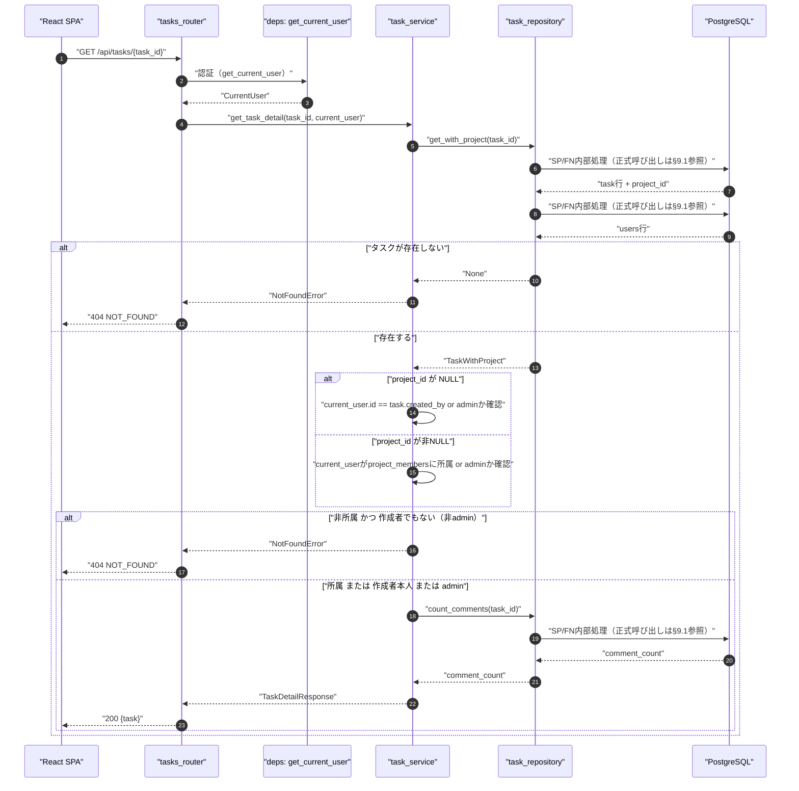
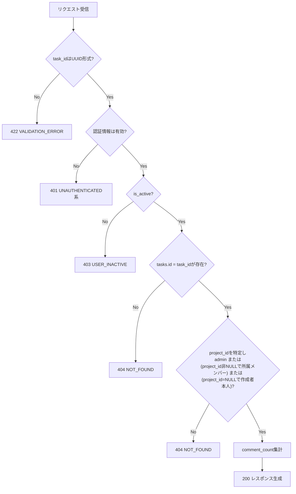
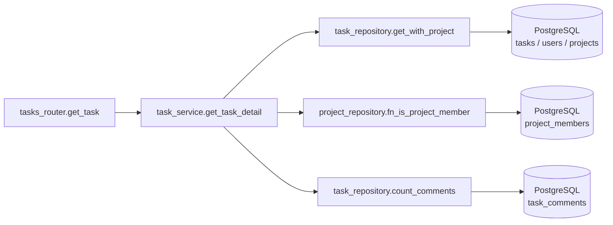
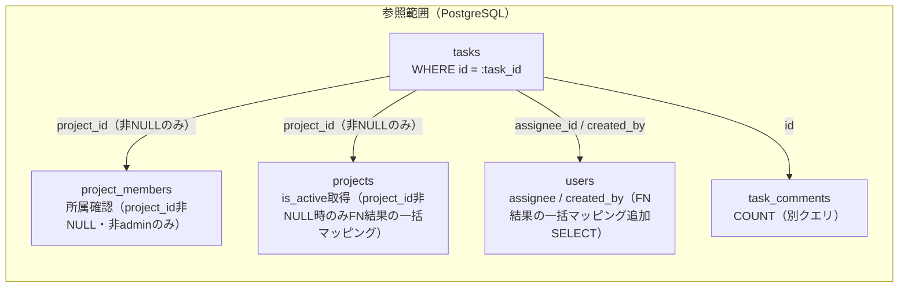

# GET /api/tasks/{task_id}（タスク詳細取得）

## 0. 関連ドキュメント

| ドキュメント | 内容 |
|--------------|------|
| [../../../basic_design/04_api.md](../../../basic_design/04_api.md) | §2.4 エンドポイント一覧、§5 認可マトリクス |
| [../../../basic_design/01_database.md](../../../basic_design/01_database.md) | §3.5 tasks、§7 Q-4 |
| [../../auth/05_rbac.md](../../auth/05_rbac.md) | `require_project_member`、404統一方針 |
| [../../database/06_table_tasks.md](../../database/06_table_tasks.md) | tasks テーブル詳細 |
| [./01_get_project_tasks.md](./01_get_project_tasks.md) | 一覧取得（カンバン用）との差異 |
| [./04_patch_task.md](./04_patch_task.md) | 本APIで取得した `version` を使う更新API |
| [./06_get_task_comments.md](./06_get_task_comments.md) | コメント一覧（本APIとは別クエリ） |
| [../../screen/08_task_detail_modal.md](../../screen/08_task_detail_modal.md) | 本APIを使用するタスク詳細モーダル |
| [../../database/06_table_tasks.md](../../database/06_table_tasks.md) | `tasks.project_id`（NULL許容）・`tasks.is_active` |
| [./10_get_tasks.md](./10_get_tasks.md) | 未所属タスクを含む横断一覧API |

## 1. 概要

| 項目 | 内容 |
|------|------|
| エンドポイント | `GET /api/tasks/{task_id}` |
| 目的 | タスク1件の詳細情報を取得する。`task_id` からプロジェクト所属を辿って認可する点が `/projects/{id}/tasks` 系と異なる。`project_id` が `NULL`（プロジェクト未所属タスク）の場合は作成者本人のみ参照可 |
| 認証 | session モード：`cerberus_sid` Cookie ／ jwt モード：`Authorization: Bearer {access_token}` |
| 認可 | `project_id` が非NULL：プロジェクトメンバー（`task_id` → `tasks.project_id` を特定した上で `require_project_member` 相当の判定。admin は無条件許可）。`project_id` が `NULL`：`created_by` が自分自身であること（admin は無条件許可） |
| CSRF検証 | 不要（参照系GET） |
| Origin検証 | 不要 |
| AUTH_MODE差異 | 認証情報の解決方法のみ異なり、業務ロジックに差異なし |
| 冪等性 | あり |
| レート制限 | 対象外 |
| トランザクション境界 | 単一の読み取り専用SELECT |

## 2. 入出力仕様（全体の出入力）

### 2.1 リクエスト

**パスパラメータ**

| 名前 | 型 | 必須 | 制約 | 説明 |
|------|----|----|------|------|
| task_id | string(uuid) | ○ | UUID v4形式 | 対象タスクID |

**クエリパラメータ**：なし
**ヘッダ**：`Authorization`（jwtモード必須）
**Cookie**：`cerberus_sid`（sessionモード必須）
**ボディ**：なし

### 2.2 レスポンス

**`200 OK`**

```json
{
  "id": "b2e4...",
  "project_id": "3f1c2a10-...",
  "title": "設計書をレビューする",
  "description": "詳細説明のテキスト",
  "status": "todo",
  "assignee": { "id": "9a1b...", "username": "taro", "display_name": "山田 太郎" },
  "created_by": { "id": "9a1b...", "username": "taro", "display_name": "山田 太郎" },
  "position": 0,
  "version": 1,
  "is_active": true,
  "project_is_active": true,
  "due_at": null,
  "comment_count": 2,
  "created_at": "2026-09-01T00:00:00Z",
  "updated_at": "2026-09-01T00:00:00Z"
}
```

| フィールド | 型 | NULL可否 | 説明 |
|-----------|----|----------|------|
| id | string(uuid) | 不可 | タスクID |
| project_id | string(uuid) | **可** | 所属プロジェクトID。プロジェクト未所属タスクの場合 `null` |
| title | string | 不可 | |
| description | string | 可 | |
| status | string | 不可 | `todo` / `in_progress` / `done` |
| assignee | object | 可 | `{id, username, display_name}` |
| created_by | object | 不可 | `{id, username, display_name}` |
| position | integer | 不可 | 列内位置。`project_id=null` の場合は「未所属タスク全体」という仮想グループ内での位置（[./11_post_tasks.md](./11_post_tasks.md) §6参照） |
| version | integer | 不可 | 楽観ロック用。以後の `PATCH` で必須 |
| is_active | boolean | 不可 | `tasks.is_active`。論理削除済みかどうか |
| project_is_active | boolean | 可 | `projects.is_active`。`project_id` が `null` の場合は本フィールドも `null` |
| due_at | string(date-time) | 可 | ISO 8601 UTC。表示時は `APP_TIMEZONE` へ変換 |
| comment_count | integer | 不可 | `task_comments` の件数 |
| created_at / updated_at | string(datetime) | 不可 | ISO 8601 UTC |

`Set-Cookie` の発行なし。`X-Request-ID` を全レスポンスに付与。

## 3. エラー仕様

| HTTP | code | 発生条件 | メッセージ | 備考 |
|------|------|----------|------------|------|
| 401 | `UNAUTHENTICATED` / `SESSION_EXPIRED` / `TOKEN_EXPIRED` / `TOKEN_INVALID` | 認証情報なし・無効 | 認証が必要です | |
| 403 | `USER_INACTIVE` | `is_active=false` | アカウントが無効化されています | |
| 404 | `NOT_FOUND` | `task_id` 不存在、または所属プロジェクトへの非所属member | タスクが見つかりません | 存在有無を隠すため、非所属も404で統一 |
| 503 | `SERVICE_UNAVAILABLE` | PostgreSQL接続不能 | 一時的にサービスを利用できません | fail-close |

## 4. 処理シーケンス



## 5. 処理フロー・分岐



## 6. 関数詳細

### 6.1 `api/routers/tasks.py :: get_task`

| 項目 | 内容 |
|------|------|
| シグネチャ | `async def get_task(task_id: UUID, current_user: CurrentUser = Depends(get_current_user), db: AsyncSession = Depends(get_db)) -> TaskDetailResponse` |
| 引数 | task_id: 対象タスクID／current_user: 現在ユーザー／db: DBセッション |
| 戻り値 | `TaskDetailResponse`（200） |
| 送出例外 | `NotFoundError`（404） |
| 処理内容 | 1. `task_service.get_task_detail(task_id, current_user)` を呼び出す<br/>2. 結果を200で返す |
| 副作用 | なし |

### 6.2 `service/task_service.py :: get_task_detail`

| 項目 | 内容 |
|------|------|
| シグネチャ | `async def get_task_detail(task_id: UUID, user: CurrentUser) -> TaskDetailResponse` |
| 引数 | task_id: 対象タスクID／user: 現在ユーザー |
| 戻り値 | `TaskDetailResponse` |
| 送出例外 | `NotFoundError`（タスク不存在、または非所属） |
| 処理内容 | `SELECT fn_get_task(:task_id)` を1回呼び出す。タスクの存在、admin/所属/未所属作成者の認可、コメント件数、プロジェクト有効状態はFN結果またはFN内部で処理し、空集合はAPIで404へ変換する |
| 副作用 | なし |

### 6.3 `repository/task_repository.py :: get_with_project`

| 項目 | 内容 |
|------|------|
| シグネチャ | `async def get_with_project(db: AsyncSession, task_id: UUID) -> TaskWithProject \| None` |
| 引数 | db: DBセッション／task_id: 対象タスクID |
| 戻り値 | `TaskWithProject`（`Task` に `assignee` / `created_by` をEager Loadしたもの）または `None` |
| 送出例外 | `OperationalError`（503へ変換） |
| 処理内容 | 1. `tasks` を `id = task_id` で1回取得 2. `assignee` / `created_by` の各 `FN結果の一括マッピング` に加え、`project_id` が非NULLの場合のみ `project`（`is_active` 参照用）を `FN結果の一括マッピング` で追加SELECT（最大4クエリ。対象行がない場合は主クエリのみ、`project_id=NULL`なら`project`分のSELECTは発行しない）<br/>3. 存在しない場合は `None` を返す（例外は投げない。所属確認前の存在チェックはサービス層で行う） |
| 副作用 | なし |

## 7. 関数相関図



## 8. データ遷移図

読み取りのみで状態遷移なし。参照範囲は以下の通り。



## 9. SP/FNデータアクセス一覧

### 9.1 正式なDBアクセス契約

本APIのrepositoryは、次のSP/FN呼び出しとDTO写像だけを行う。

| 種別 | 契約 | 説明 |
|------|------|------|
| fn_get_task | `fn_get_task(p_task_id)` | fn_get_taskを呼び出し、結果をレスポンスへ写像する |

repositoryはDBテーブルへ直結せず、SP/FN契約だけを呼び出す。 直下の従来のテーブルI/O表はSP/FN内部SQLの補足であり、repositoryの発行契約ではない。更新系の整合性制御、version検証、advisory lock、通知、SQLSTATE P0xxxはSP/FN層の責務である。存在・所属の事実判定はFNの空集合/falseを受け、404/403への変換はAPI層が行う。

**PostgreSQL**

| テーブル | 操作 | 条件・TTL | 備考 |
|----------|------|-----------|------|
| tasks | SELECT | `id = task_id` | `project_id`（NULL可）から認可判定を行う起点 |
| users | SELECT（`FN結果の一括マッピング`の追加SELECT各1回） | `assignee_id` / `created_by` | 表示用情報のEager Load。主クエリとは別ラウンドトリップ |
| projects | SELECT（`FN結果の一括マッピング`の追加SELECT） | `id = tasks.project_id`（`project_id`が非NULLの場合のみ実行） | `project_is_active` 算出用 |
| project_members | SELECT | `project_id`, `user_id`（`project_id`が非NULLの場合のみ） | admin以外の所属確認 |
| task_comments | SELECT（COUNT） | `task_id = :task_id` | `comment_count` 算出。一覧取得（[01](./01_get_project_tasks.md)）とは別クエリでN+1にならない（対象が1件のため） |

**Redis**：使用なし。

## 10. バリデーション規則

| フィールド | pydanticスキーマ | 制約 | フロント（zod）との一致 |
|-----------|-------------------|------|--------------------------|
| task_id（パス） | FastAPI型ヒント `UUID` | UUID v4形式。不一致は422 | ルーティング側でUUID形式チェック |

## 11. 非機能・セキュリティ考慮

| 項目 | 内容 |
|------|------|
| ログ出力 | アクセスログ（INFO）のみ。監査ログ対象外（参照系） |
| ユーザー列挙対策 | タスク不存在・非所属のいずれも404で統一し、存在有無を秘匿する |
| タイミング攻撃対策 | 対象外 |
| レート制限 | なし |
| fail-close方針 | DB接続不能時は503 |

## 12. テスト設計

| No | 区分 | ケース | 前提 | 期待結果 | pytest関数名案 |
|----|------|--------|------|----------|-----------------|
| 1 | 結合（実DB・実SP） | 正常系 | リポジトリが `TaskWithProject` を返す | `TaskDetailResponse` に整形される | `test_get_task_detail_success` |
| 2 | 結合（実DB・実SP） | タスク不存在 | リポジトリが `None` を返す | `NotFoundError` 送出 | `test_get_task_detail_not_found` |
| 3 | 結合（実DB・実SP） | 非所属member | `is_member` が `False` | `NotFoundError` 送出 | `test_get_task_detail_forbidden_as_not_found` |
| 4 | 結合 | 正常系取得（所属member） | 実DB、対象タスクにコメント2件 | 200、`comment_count=2` | `test_fn_get_task_success` |
| 5 | 結合 | 存在しないtask_id | 実DB、ランダムUUID | 404 `NOT_FOUND` | `test_fn_get_task_not_found` |
| 6 | 結合 | 非所属member | 実DB、他プロジェクトのタスク | 404 `NOT_FOUND` | `test_fn_get_task_forbidden_as_404` |
| 7 | 結合 | admin | 実DB、非所属プロジェクトのタスクでも200 | 200 | `test_fn_get_task_admin_bypass` |
| 8 | パラメータ化 | AUTH_MODE両対応 | `AUTH_MODE=session` / `jwt` | 4〜7を両モードで実行 | フィクスチャ `auth_mode` |
| 9 | 結合 | 未所属タスク・作成者本人 | 実DB、`project_id=NULL`のタスクを自分で作成 | 200、`project_id:null`, `project_is_active:null` | `test_fn_get_task_unassigned_project_owner_success` |
| 10 | 結合 | 未所属タスク・第三者 | 実DB、`project_id=NULL`のタスクを別ユーザーが参照 | 404 `NOT_FOUND` | `test_fn_get_task_unassigned_project_forbidden_as_404` |
| 11 | 結合 | 論理削除済みプロジェクトのタスク | 実DB、所属プロジェクトが`is_active=false` | 200、`project_is_active:false`（タスク自体は通常どおり取得可能） | `test_fn_get_task_reflects_inactive_project` |

## 13. 不明点・要検討事項

| 区分 | 内容 | 影響 |
|------|------|------|
| 要検討 | 未所属タスク（`project_id=NULL`）を参照できる範囲を「作成者本人のみ」としたのはブリーフの方針だが、将来的に`assignee_id`を未所属タスクにも設定可能にする場合、担当者本人にも参照を広げるかは要検討 | 認可範囲の将来拡張時の整合性 |
