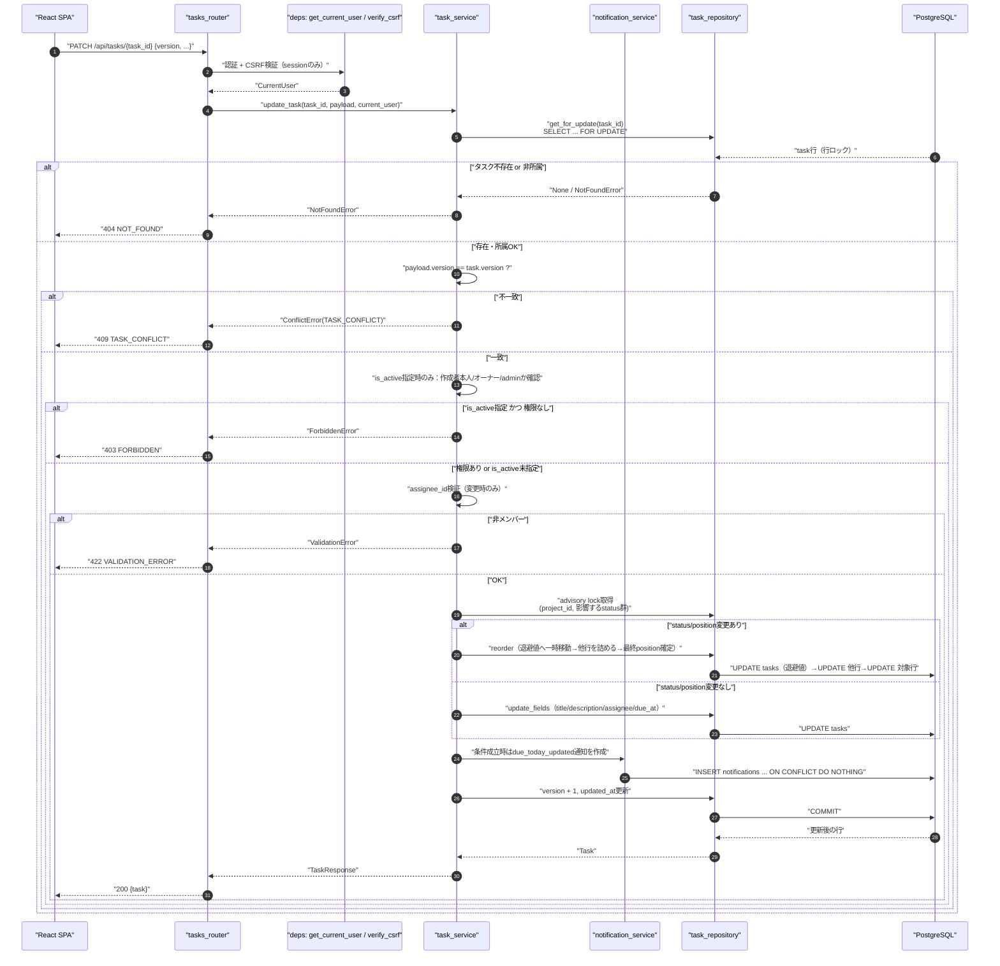
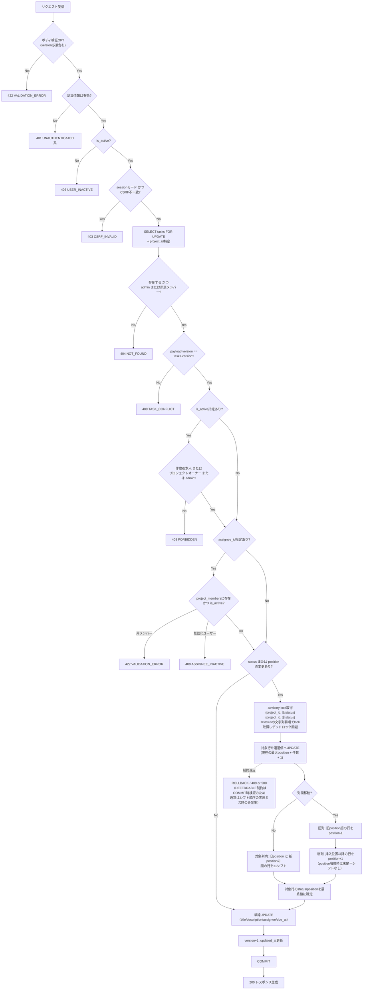
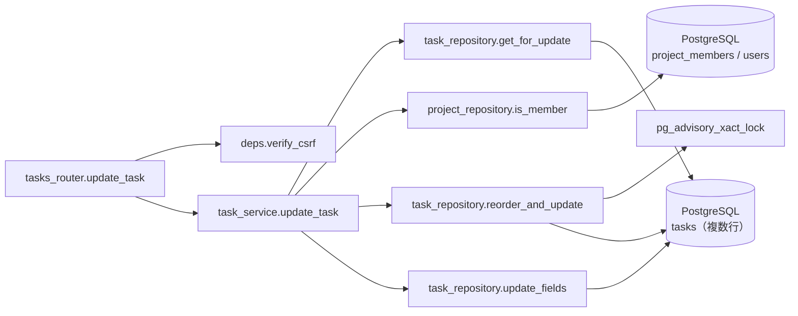
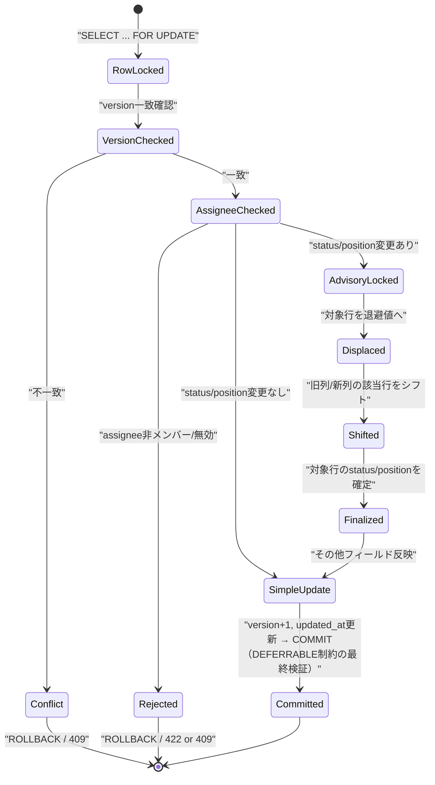

# PATCH /api/tasks/{task_id}（タスク更新・楽観ロック・列並べ替え）

## 0. 関連ドキュメント

| ドキュメント | 内容 |
|--------------|------|
| [../../../basic_design/04_api.md](../../../basic_design/04_api.md) | §2.4、§3.2 リクエスト表・エラー、§4.2 `TASK_CONFLICT`、§7.2 `update_task` |
| [../../../basic_design/01_database.md](../../../basic_design/01_database.md) | §3.5 tasks（同時更新制御の節）、§5.3 `fn_next_task_position` |
| [../../../basic_design/00_overview.md](../../../basic_design/00_overview.md) | §5.2 タスクD&Dによるステータス変更シーケンス |
| [../../auth/03_csrf.md](../../auth/03_csrf.md) | CSRF検証（session モード更新系） |
| [../../database/06_table_tasks.md](../../database/06_table_tasks.md) | tasks テーブル、`UNIQUE (project_id, status, position) DEFERRABLE` |
| [../../database/08_db_functions.md](../../database/08_db_functions.md) | `fn_next_task_position` |
| [../notifications/01_get_notifications.md](../notifications/01_get_notifications.md) | 通知一覧スキーマ |
| [../../database/10_table_notifications.md](../../database/10_table_notifications.md) | 通知の`dedupe_key`とINSERT制約 |
| [./03_get_task.md](./03_get_task.md) | 更新前に `version` を取得するGET |
| [./02_post_project_tasks.md](./02_post_project_tasks.md) | 採番ロジック（`fn_next_task_position`）の共通部分 |
| [./05_delete_task.md](./05_delete_task.md) | 削除時のposition詰め（本APIと同じadvisory lock方針） |
| [../../screen/07_project_board.md](../../screen/07_project_board.md) | D&Dでの楽観的更新・ロールバック |
| [../../database/06_table_tasks.md](../../database/06_table_tasks.md) | `tasks.is_active`（論理削除フラグ） |
| [./05_delete_task.md](./05_delete_task.md) | 論理削除（`is_active=false`）の詳細。本APIの`is_active=true`指定は削除の取り消し（再有効化）に相当 |
| [../admin/03_patch_admin_user_status.md](../admin/03_patch_admin_user_status.md) | ユーザーの有効/無効切替API（再有効化フローの対称の参照元） |

## 1. 概要

| 項目 | 内容 |
|------|------|
| エンドポイント | `PATCH /api/tasks/{task_id}` |
| 目的 | タスクの部分更新。`title`/`description`/`status`/`assignee_id`/`position`/`due_at`/`is_active` を個別に更新できる。カンバンD&Dの `status`/`position` 変更もこのAPIに統一する。`project_id` の付け替え（プロジェクト間移動）は本APIのスコープ外（§13参照） |
| 認証 | session モード：`cerberus_sid` Cookie ／ jwt モード：`Authorization: Bearer {access_token}` |
| 認可 | 基本：プロジェクトメンバー（`task_id` からプロジェクトを特定し所属確認。admin は無条件許可）。ただし `is_active` フィールドの変更（再有効化）のみ、追加で「作成者本人 / プロジェクトオーナー / admin」に限定する（§5.3参照） |
| CSRF検証 | 必要（session モードの更新系。`X-CSRF-Token` ヘッダ必須） |
| Origin検証 | 不要（本APIはCookie発行を伴わないため対象外） |
| AUTH_MODE差異 | CSRF検証の要否のみ異なる。楽観ロック・列並べ替えのロジックに差異なし |
| 冪等性 | **なし**。同一リクエストの再送は2回目以降が `version` 不一致となり `409 TASK_CONFLICT` を返す（意図せぬ多重適用を防ぐという意味では実質的に安全側） |
| レート制限 | 対象外 |
| トランザクション境界 | タスク行の `SELECT ... FOR UPDATE` から、advisory lock取得・position再採番・`UPDATE`・`version+1` までを1トランザクションとする |

## 2. 入出力仕様（全体の出入力）

### 2.1 リクエスト

**パスパラメータ**

| 名前 | 型 | 必須 | 制約 | 説明 |
|------|----|----|------|------|
| task_id | string(uuid) | ○ | UUID v4形式 | 対象タスクID |

**クエリパラメータ**：なし
**ヘッダ**：`Authorization`（jwtモード必須）／`X-CSRF-Token`（sessionモード必須）
**Cookie**：`cerberus_sid` / `cerberus_csrf`（sessionモード必須）

**ボディ**（`version` 必須、他は任意の部分更新。未指定フィールドは変更しない）

| フィールド | 型 | 必須 | 制約 | 省略時の挙動 |
|-----------|----|----|------|--------------|
| version | integer | **○** | 取得時点の値と一致必須 | - |
| title | string | - | 1〜150文字 | 変更しない |
| description | string \| null | - | 上限なし（`TEXT`） | 変更しない |
| status | string | - | `todo` / `in_progress` / `done` | 変更しない |
| assignee_id | string(uuid) \| null | - | 有効なプロジェクトメンバーであること。`null` で担当解除 | 変更しない |
| position | integer | - | 0以上 | 5.1節の規則に従う |
| due_at | string(date-time) \| null | - | ISO 8601。オフセットなしは `APP_TIMEZONE` として解釈 | 変更しない |
| is_active | boolean | - | `true`/`false`。指定できるのは作成者本人／プロジェクトオーナー／adminのみ（§5.3） | 変更しない |

`project_id` はボディに含めない（`extra="forbid"` により指定時は422）。タスクの所属プロジェクトを変更する「付け替え」操作は本APIのスコープ外とし、必要になった場合は別途専用エンドポイントの新設を検討する（§13）。

未指定と `null` 明示を区別するため、スキーマは `pydantic` の `exclude_unset=True` を用いたPATCH方式で実装する（`description` / `assignee_id` / `due_at` は `null` 指定で明示的にクリア可能、フィールド自体を省略すれば変更なし）。

### 2.2 レスポンス

**`200 OK`**

```json
{
  "id": "b2e4...",
  "project_id": "3f1c2a10-...",
  "title": "設計書をレビューする",
  "description": null,
  "status": "in_progress",
  "assignee": { "id": "9a1b...", "username": "taro", "display_name": "山田 太郎" },
  "created_by": { "id": "9a1b...", "username": "taro", "display_name": "山田 太郎" },
  "position": 0,
  "version": 2,
  "due_at": null,
  "created_at": "2026-09-01T00:00:00Z",
  "updated_at": "2026-09-03T04:10:00Z"
}
```

| フィールド | 型 | NULL可否 | 説明 |
|-----------|----|----------|------|
| （[03_get_task.md](./03_get_task.md) §2.2 と同一構成。`is_active` / `project_is_active` を含む） | | | `comment_count` は本レスポンスには含めない（更新APIのため一覧・詳細GETと異なりコメント集計は行わない） |
| version | integer | 不可 | 更新成功後の新しい値（リクエストの `version + 1`） |

`Set-Cookie` の発行なし。`X-Request-ID` を全レスポンスに付与。

## 3. エラー仕様

| HTTP | code | 発生条件 | メッセージ | 備考 |
|------|------|----------|------------|------|
| 401 | `UNAUTHENTICATED` 系 | 認証情報なし・無効 | 認証が必要です | |
| 403 | `USER_INACTIVE` | `is_active=false` | アカウントが無効化されています | |
| 403 | `CSRF_INVALID` | sessionモードでヘッダ欠落・不一致 | CSRFトークンが不正です | |
| 404 | `NOT_FOUND` | `task_id` 不存在、または非所属member | タスクが見つかりません | |
| 403 | `FORBIDDEN` | `is_active` を指定したが作成者本人・プロジェクトオーナー・admin のいずれでもない | この操作を行う権限がありません | `is_active` 以外のフィールドのみの更新では発生しない |
| 409 | `TASK_CONFLICT` | `version` が現在値と不一致 | 他のユーザーが先に更新しました。最新の内容を取得し直してください | フロントは再取得＋再操作を促す |
| 409 | `ASSIGNEE_INACTIVE` | 指定 `assignee_id` が `is_active=false` | 指定した担当者は無効化されています | |
| 422 | `VALIDATION_ERROR` | title文字数超過、status不正値、position負数、日付形式不正等 | 入力内容に誤りがあります | |
| 422 | `VALIDATION_ERROR`（業務検証） | `assignee_id` が `project_members` に存在しない | 指定した担当者はプロジェクトのメンバーではありません | |
| 503 | `SERVICE_UNAVAILABLE` | PostgreSQL接続不能 | 一時的にサービスを利用できません | fail-close |

## 4. 処理シーケンス



## 5. 処理フロー・分岐

### 5.1 status / position の解決規則

| ケース | 挙動 |
|--------|------|
| `status` 省略、`position` 省略 | 何も動かさない（現在位置を維持） |
| `status` 省略、`position` 指定 | 同一列内で並べ替え。指定位置へ挿入し、間の行を詰める |
| `status` 変更、`position` 省略 | 移動先列の**末尾**へ追加（`fn_next_task_position` 相当）。移動元列は後続行を詰める |
| `status` 変更、`position` 指定 | 移動先列の指定位置へ挿入し、移動先の後続行を詰める。移動元列も後続行を詰める |

### 5.2 全体フロー



## 6. 関数詳細

### 6.1 `api/routers/tasks.py :: update_task`

| 項目 | 内容 |
|------|------|
| シグネチャ | `async def update_task(task_id: UUID, payload: TaskUpdateRequest, current_user: CurrentUser = Depends(get_current_user), db: AsyncSession = Depends(get_db)) -> TaskResponse` |
| 引数 | task_id: 対象タスクID／payload: 部分更新内容（`version` 必須）／current_user／db |
| 戻り値 | `TaskResponse`（200） |
| 送出例外 | `NotFoundError`（404）、`ConflictError`（`TASK_CONFLICT` / `ASSIGNEE_INACTIVE`、409）、`ValidationError`（422） |
| 処理内容 | 1. CSRF検証は前段の依存性（sessionモードのみ有効化）で完了済み<br/>2. `task_service.update_task(task_id, payload, current_user)` を呼び出す<br/>3. 結果を200で返す |
| 副作用 | DB更新（tasks UPDATE、複数行の場合あり） |

### 6.2 `service/task_service.py :: update_task`

| 項目 | 内容 |
|------|------|
| シグネチャ | `async def update_task(task_id: UUID, payload: TaskUpdateRequest, user: CurrentUser) -> Task` |
| 引数 | task_id：対象タスクID／payload：`version` を含む部分更新内容／user：現在ユーザー |
| 戻り値 | 更新後の `Task` |
| 送出例外 | `NotFoundError`、`ConflictError(TASK_CONFLICT)`、`ConflictError(ASSIGNEE_INACTIVE)`、`ValidationError` |
| 処理内容 | 1. `task_repository.get_for_update(task_id)` で行ロック付き取得。`None` または非所属なら `NotFoundError`<br/>2. `payload.version != task.version` なら `ConflictError(TASK_CONFLICT)`（この時点でROLLBACKし行ロックを解放）<br/>3. `is_active` が `exclude_unset` に含まれる場合、`user.id == task.created_by` または `project_repository.is_owner(project_id, user.id)`（`project_id`が非NULLの場合）または `user.role == 'admin'` のいずれかを満たすか検証。満たさなければ `ForbiddenError`（403 `FORBIDDEN`）<br/>4. `assignee_id` が `exclude_unset` に含まれ値が `None` でない場合、メンバー・`is_active` を検証。非メンバーは `ValidationError`、無効化ユーザーは `ConflictError(ASSIGNEE_INACTIVE)`<br/>5. `status` または `position` が指定内容に含まれる場合、`task_repository.reorder_and_update(task, payload)` を呼び出す。それ以外は `task_repository.update_fields(task, payload)` を呼び出す。`is_active` は `status`/`position`とは独立して同一UPDATE文に含める<br/>6. `due_at`が指定され現在値から変化し、担当者があり、変更後の日時が`APP_TIMEZONE`の当日なら`notification_service.create_due_today_notification`を同じDBセッションで呼ぶ。`dedupe_key=updated:{task_id}:{due_atのUTC ISO}`で同じ日時への再設定は重複させない<br/>7. いずれの経路でも `version = task.version + 1`、`updated_at = now()` をセットしてCOMMIT |
| 副作用 | DB更新。`due_at`変更後が当日の場合は同一トランザクションでnotifications INSERT |

### 6.3 `repository/task_repository.py :: get_for_update`

| 項目 | 内容 |
|------|------|
| シグネチャ | `async def get_for_update(db: AsyncSession, task_id: UUID) -> TaskWithProject \| None` |
| 引数 | db：DBセッション／task_id：対象タスクID |
| 戻り値 | `TaskWithProject`（行ロック済み）または `None` |
| 送出例外 | `OperationalError`（503へ変換） |
| 処理内容 | 1. `SELECT * FROM tasks WHERE id = :task_id FOR UPDATE` を実行し、後続の並べ替え・更新の間、同一タスクへの同時PATCHを直列化する<br/>2. `project_id` を用いて呼び出し元（サービス層）が所属確認を行えるようJOIN結果も返す |
| 副作用 | 行ロック取得（トランザクション終了まで保持） |

### 6.4 `repository/task_repository.py :: reorder_and_update`

| 項目 | 内容 |
|------|------|
| シグネチャ | `async def reorder_and_update(db: AsyncSession, task: Task, payload: TaskUpdateRequest) -> Task` |
| 引数 | db：DBセッション／task：`get_for_update` で取得済みの行（ロック中）／payload：`status`/`position` を含む更新内容 |
| 戻り値 | 並べ替え・フィールド更新後の `Task`（`version`/`updated_at` の反映前） |
| 送出例外 | `IntegrityError`（想定外のシフト漏れ時。`db_error_handler` が409へ変換） |
| 処理内容 | 1. 旧 `status`（`old_status`）・新 `status`（`new_status`、省略時は `old_status`）を確定<br/>2. 影響する `(project_id, status)` の組を **status文字列の昇順**でソートし、`SELECT pg_advisory_xact_lock(hashtext(project_id::text \|\| status))` を順に実行してデッドロックを回避する<br/>3. 対象タスクの `position` を退避値（新列の `MAX(position) + 新列件数 + 1` など、一時的に重複しない大きな値）へ `UPDATE`（`uq_tasks_project_status_position` は `DEFERRABLE INITIALLY DEFERRED` のため、トランザクション内の一時的な重複は許容される）<br/>4. `old_status != new_status` の場合：旧列側で `position > 旧position` の行を `position - 1` に一括UPDATE<br/>5. 新列側：`position` 指定ありなら挿入位置以降（`position >= 新position`）の行を `position + 1` に一括UPDATE。指定なしなら新列の末尾（`fn_next_task_position` 相当の値）を採用しシフト不要<br/>6. `old_status == new_status` かつ `position` 指定ありの場合：旧position と新positionの間の行を1ずつシフト（新position側へ移動なら間の行を-1、逆方向なら+1）<br/>7. 最後に対象タスクの `status` / `position` を最終値に `UPDATE`<br/>8. `title`/`description`/`assignee_id`/`due_at`/`is_active` のうち指定されたフィールドも同一UPDATE文にまとめて反映 |
| 副作用 | DB更新（対象タスク行＋同一列内の複数行） |

### 6.5 `repository/task_repository.py :: update_fields`

| 項目 | 内容 |
|------|------|
| シグネチャ | `async def update_fields(db: AsyncSession, task: Task, payload: TaskUpdateRequest) -> Task` |
| 引数 | db：DBセッション／task：ロック済み行／payload：更新内容（`status`/`position` を含まない） |
| 戻り値 | 更新後の `Task` |
| 送出例外 | `IntegrityError`（想定外の一意制約違反時。通常発生しない） |
| 処理内容 | 1. `payload.model_dump(exclude_unset=True)` から `version` を除いた指定フィールド（`title`/`description`/`assignee_id`/`due_at`/`is_active`）のみを `UPDATE` 文に反映する<br/>2. `status`/`position` は変更しない<br/>3. `is_active` の権限検証はサービス層（6.2 手順3）で完了済みであり、本関数はUPDATE文への反映のみを行う |
| 副作用 | DB更新（対象タスク行のみ） |

## 7. 関数相関図



## 8. データ遷移図



## 9. データアクセス一覧

**PostgreSQL**

| テーブル | 操作 | 条件・TTL | 備考 |
|----------|------|-----------|------|
| tasks | SELECT FOR UPDATE | `id = task_id` | 対象タスクの行ロック |
| project_members | SELECT | `project_id`, `user_id` | 所属確認・assignee検証・`is_active`指定時のオーナー判定（`role='owner'`） |
| users | SELECT | `id = assignee_id` | `is_active` 確認 |
| tasks | advisory lock（`pg_advisory_xact_lock`） | `(project_id, status)` を昇順で1〜2件 | 列単位の直列化 |
| tasks | UPDATE（複数） | 退避値設定 → 旧列/新列シフト → 最終確定 | `uq_tasks_project_status_position`（`DEFERRABLE`）に依存 |
| tasks | UPDATE（version, updated_at） | `id = task_id` | 楽観ロックの反映 |

**Redis**：使用なし。

## 10. バリデーション規則

| フィールド | pydanticスキーマ | 制約 | フロント（zod）との一致 |
|-----------|-------------------|------|--------------------------|
| version | `TaskUpdateRequest.version` | `int`、必須 | 取得時のレスポンス値をそのまま保持して送信 |
| title | `TaskUpdateRequest.title` | 指定時 `min_length=1, max_length=150` | 同一制約 |
| description | `TaskUpdateRequest.description` | `str \| None` | 同左 |
| status | `TaskUpdateRequest.status` | `Literal["todo","in_progress","done"]` | セレクト/D&D列と一致 |
| assignee_id | `TaskUpdateRequest.assignee_id` | `UUID \| None` | メンバー検証はサービス層 |
| position | `TaskUpdateRequest.position` | `int`、`ge=0` | D&Dのドロップ先インデックス |
| due_at | `TaskUpdateRequest.due_at` | `datetime \| None` | 日時入力と一致。UTCへ正規化 |
| is_active | `TaskUpdateRequest.is_active` | `bool`。権限検証（作成者本人/オーナー/admin）はサービス層 | 再有効化ボタンのUIから送信する想定 |

`TaskUpdateRequest` は `exclude_unset=True` を前提に実装し、未送信フィールドと `null` 送信を区別する。

## 11. 非機能・セキュリティ考慮

| 項目 | 内容 |
|------|------|
| ログ出力 | INFO：タスク更新（`task_id`, `changed_fields`, `old_version`, `new_version`）。`TASK_CONFLICT` はWARNログで頻発監視の対象とする |
| ユーザー列挙対策 | 非所属アクセスは404で統一 |
| タイミング攻撃対策 | 対象外 |
| レート制限 | なし |
| fail-close方針 | advisory lock取得やシフトUPDATEの途中で失敗した場合はROLLBACKし、部分適用のposition状態を残さない |
| 同時更新制御 | 行ロック（`FOR UPDATE`）で同一タスクへの同時PATCHを直列化しつつ、`version` 比較で「先勝ち」の楽観ロック意味論を維持する。行ロックは排他制御の手段であり、`TASK_CONFLICT` の判定基準はあくまで `version` 一致とする |
| デッドロック回避 | 影響する `(project_id, status)` のadvisory lockは常にstatus文字列の昇順で取得する。異なる2タスクが逆順で列を跨ぐ移動を同時に行っても、ロック取得順序が一致するため待機のみでデッドロックしない |
| is_active変更の権限 | 一般のプロジェクトメンバーは`is_active`を変更できない（403 `FORBIDDEN`）。作成者本人／プロジェクトオーナー／adminのみ許可し、無効化の取り消し（再有効化）操作の誤用・悪用を防ぐ |

## 12. テスト設計

| No | 区分 | ケース | 前提 | 期待結果 | pytest関数名案 |
|----|------|--------|------|----------|-----------------|
| 1 | 単体（モック） | version不一致 | モックタスクの`version=2`、payload`version=1` | `ConflictError(TASK_CONFLICT)` | `test_update_task_version_conflict` |
| 2 | 単体（モック） | assignee非メンバー | `is_member=False` | `ValidationError` | `test_update_task_assignee_not_member` |
| 3 | 単体（モック） | assignee無効化 | `is_active=False` | `ConflictError(ASSIGNEE_INACTIVE)` | `test_update_task_assignee_inactive` |
| 4 | 単体（モック） | status/position変更なし | title のみ更新 | `update_fields` が呼ばれ `reorder_and_update` は呼ばれない | `test_update_task_simple_fields_only` |
| 5 | 結合 | 単純更新（title） | 実DB | 200、`version+1`、`position`不変 | `test_patch_task_title_only` |
| 6 | 結合 | 同一列内でposition変更 | 実DB、列内3件中の先頭を末尾へ | 200、間の行が-1ずつシフト | `test_patch_task_reorder_same_status` |
| 7 | 結合 | status変更・position省略 | 実DB | 200、移動先列末尾に配置、移動元列の後続が詰まる | `test_patch_task_move_status_append_end` |
| 8 | 結合 | status変更・position指定 | 実DB | 200、移動先の指定位置に挿入、両列とも整合 | `test_patch_task_move_status_with_position` |
| 9 | 結合 | version不一致 | 実DB、取得後に他リクエストで先に更新 | 409 `TASK_CONFLICT` | `test_patch_task_conflict_returns_409` |
| 10 | 結合 | 同時DB&D競合 | 実DB、同一タスクへ並行2 PATCH（同じversion） | 1件は200、もう1件は409 `TASK_CONFLICT` | `test_patch_task_concurrent_updates_one_wins` |
| 11 | 結合 | 同一列への並行複数移動 | 実DB、異なるタスクが同時に同じ列へstatus変更 | position重複なく採番される | `test_patch_task_concurrent_status_move_no_duplicate_position` |
| 12 | 結合 | CSRF欠落（session） | ヘッダなし | 403 `CSRF_INVALID` | `test_patch_task_csrf_required` |
| 13 | 結合 | 非所属member | 他プロジェクトのタスク | 404 `NOT_FOUND` | `test_patch_task_forbidden_as_404` |
| 14 | パラメータ化 | AUTH_MODE両対応 | `AUTH_MODE=session` / `jwt` | 5・9・13等を両モードで実行 | フィクスチャ `auth_mode` |
| 15 | 網羅できない範囲 | advisory lock待機によるデッドロック未発生の厳密証明 | PostgreSQL内部スケジューリングに依存 | No.11の並行実行結果で間接的に確認し、形式的な証明は行わない | 理由：ロック順序制御の妥当性はNo.11の反復実行で経験的に確認する方針とする |
| 16 | 結合 | is_active再有効化（作成者本人） | 実DB、`is_active=false`のタスクを作成者が`is_active:true`でPATCH | 200、`is_active:true` | `test_patch_task_reactivate_by_creator` |
| 17 | 結合 | is_active再有効化（プロジェクトオーナー） | 実DB、作成者以外のオーナーが`is_active:true`でPATCH | 200 | `test_patch_task_reactivate_by_owner` |
| 18 | 結合 | is_active変更・権限なし | 実DB、作成者でも オーナーでもない一般メンバーが`is_active:true`でPATCH | 403 `FORBIDDEN` | `test_patch_task_is_active_forbidden_for_non_owner` |
| 19 | 結合 | is_active未指定時は無関係 | 実DB、`is_active`を送らずtitleのみ更新 | 200、`is_active`不変 | `test_patch_task_is_active_unaffected_when_omitted` |

## 13. 不明点・要検討事項

| 区分 | 内容 | 影響 |
|------|------|------|
| 要検討 | 退避値の具体的な計算式（`MAX(position) + 件数 + 1`）は基本設計 §3.5 の記述を本設計で具体化したものであり、他の安全な値（例：負数を使わない大きな定数オフセット）でもよい。実装時にpydantic/SQLの都合で調整する余地がある | シフトSQLの実装詳細 |
| 要検討 | `TaskUpdateRequest` で `status`/`position` のみ変更したい場合に他の必須項目（`title`等）を毎回送る必要がない設計（部分更新）だが、フロントのD&D実装が `version` を常に最新値で送れる保証（楽観的更新中の競合）はフロント側の設計（`screen/07_project_board.md`）に委ねる | フロント実装との整合 |
| 要検討 | `project_id` の付け替え（タスクを別プロジェクトへ移動、または未所属化）は本APIのスコープ外とした。issue #10のユーザー合意にも明記がなく、必要になった場合は`(project_id, status)`のadvisory lock対象が変わる・position採番のやり直しが必要等、本APIとは別の設計検討が要る | 将来のプロジェクト間タスク移動機能 |
| 要検討 | `is_active=false`（論理削除）を本APIから明示的に指定した場合の挙動は、`DELETE /api/tasks/{task_id}`（[./05_delete_task.md](./05_delete_task.md)）と同じ効果になる想定だが、PATCHの`version`必須・楽観ロック経路を通る点がDELETEと異なる。両者の使い分け（DELETEを正、PATCHは主に再有効化用途）は基本設計に明記がなく確認が必要 | UI導線・API使い分けの一貫性 |
| 不明 | 「プロジェクトオーナー」の判定に用いる `project_members.role` の具体的な値（`'owner'`）はプロジェクトAPI側（[../projects/04_patch_project.md](../projects/04_patch_project.md)）の`require_project_owner`実装に依存する。本ファイルはそれと同一の判定ロジックを流用する前提で記述した | プロジェクトAPI側の実装との整合確認 |
