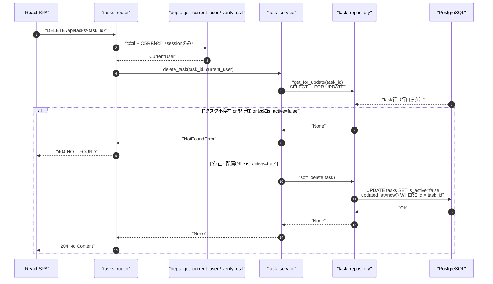
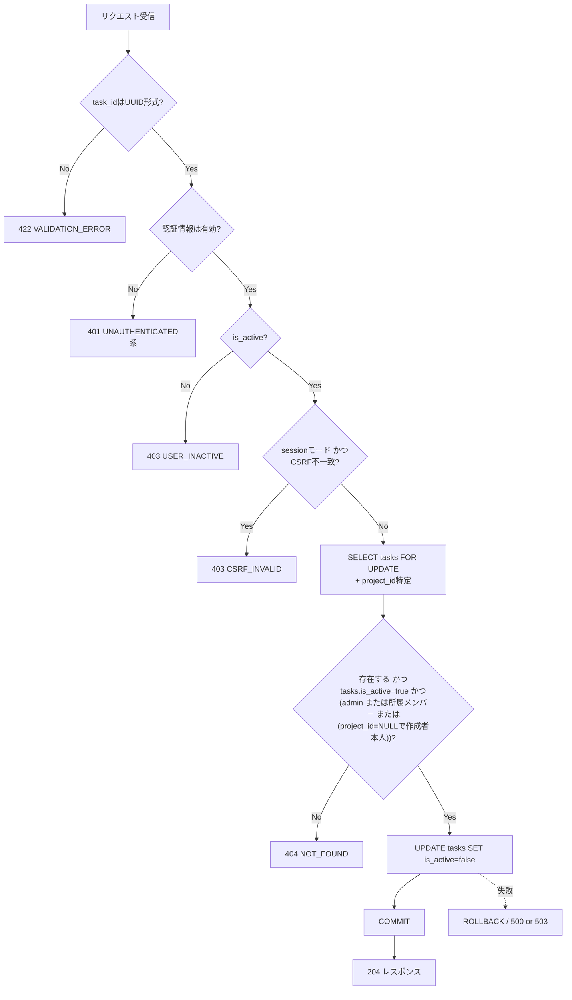
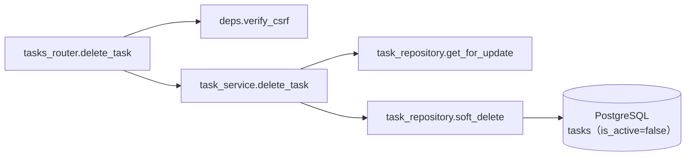
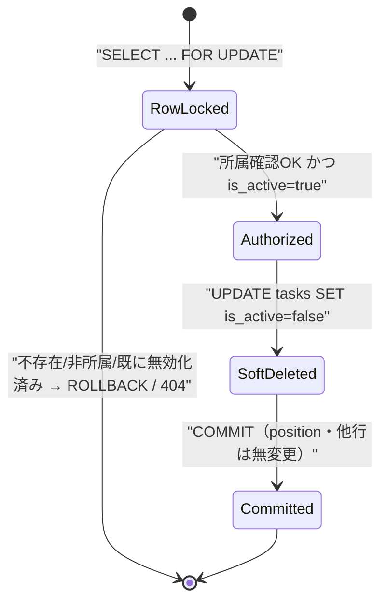

# DELETE /api/tasks/{task_id}（タスク論理削除）

## 0. 関連ドキュメント

| ドキュメント | 内容 |
|--------------|------|
| [../../../basic_design/04_api.md](../../../basic_design/04_api.md) | §2.4 エンドポイント一覧、§7.2 `delete_task` |
| [../../../basic_design/01_database.md](../../../basic_design/01_database.md) | §3.5 tasks（同時更新制御）、§3.6 task_comments |
| [../../auth/03_csrf.md](../../auth/03_csrf.md) | CSRF検証（session モード更新系） |
| [../../database/06_table_tasks.md](../../database/06_table_tasks.md) | tasks テーブル詳細、`is_active`（論理削除フラグ） |
| [../../database/07_table_task_comments.md](../../database/07_table_task_comments.md) | task_comments（削除自体は行わないため本APIでは対象外） |
| [./04_patch_task.md](./04_patch_task.md) | position再採番・advisory lockの共通方針、`is_active` 再有効化（本APIの取り消し操作） |
| [./03_get_task.md](./03_get_task.md) | 削除対象の事前取得 |
| [./01_get_project_tasks.md](./01_get_project_tasks.md) | `is_active=false` タスクの一覧除外・`include_inactive` |
| [./10_get_tasks.md](./10_get_tasks.md) | 横断一覧APIでの `is_active` 扱い |

## 1. 概要

| 項目 | 内容 |
|------|------|
| エンドポイント | `DELETE /api/tasks/{task_id}` |
| 目的 | タスクを1件**論理削除**する（`UPDATE tasks SET is_active = false`）。物理的な行削除・`task_comments` のCASCADE削除は発生しない |
| 認証 | session モード：`cerberus_sid` Cookie ／ jwt モード：`Authorization: Bearer {access_token}` |
| 認可 | プロジェクトメンバー（`task_id` からプロジェクトを特定し所属確認。admin は無条件許可。基本設計 §2.4 では担当者・作成者に限定する記載はなく、所属メンバー全員が削除可）。`project_id` が `NULL`（未所属タスク）の場合は作成者本人のみ削除可 |
| CSRF検証 | 必要（session モードの更新系） |
| Origin検証 | 不要 |
| AUTH_MODE差異 | CSRF検証の要否のみ異なる |
| 冪等性 | あり（`is_active=false` へのUPDATEは同一結果を繰り返し得るため、2回目以降も204。物理削除と異なり「既に無効化済み」を404にする必要がない） |
| レート制限 | 対象外 |
| トランザクション境界 | `SELECT ... FOR UPDATE` から `UPDATE tasks SET is_active=false` までを1トランザクションとする。**advisory lockの取得・positionの再採番（詰め）は行わない** |

## 2. 入出力仕様（全体の出入力）

### 2.1 リクエスト

**パスパラメータ**

| 名前 | 型 | 必須 | 制約 | 説明 |
|------|----|----|------|------|
| task_id | string(uuid) | ○ | UUID v4形式 | 対象タスクID |

**クエリパラメータ**：なし
**ヘッダ**：`Authorization`（jwtモード必須）／`X-CSRF-Token`（sessionモード必須）
**Cookie**：`cerberus_sid` / `cerberus_csrf`（sessionモード必須）
**ボディ**：なし（`version` によるチェックは行わない。論理削除も破壊的操作に準じる扱いとし、基本設計のリクエスト仕様に `version` の指定がない従来方針を踏襲する）

### 2.2 レスポンス

**`204 No Content`**：ボディなし。

`Set-Cookie` の発行なし。`X-Request-ID` を全レスポンスに付与。

## 3. エラー仕様

| HTTP | code | 発生条件 | メッセージ | 備考 |
|------|------|----------|------------|------|
| 401 | `UNAUTHENTICATED` 系 | 認証情報なし・無効 | 認証が必要です | |
| 403 | `USER_INACTIVE` | `is_active=false`（実行者） | アカウントが無効化されています | |
| 403 | `CSRF_INVALID` | sessionモードでヘッダ欠落・不一致 | CSRFトークンが不正です | |
| 404 | `NOT_FOUND` | `task_id` 不存在、または非所属member、または既に `tasks.is_active=false` | タスクが見つかりません | 既に論理削除済みのタスクへの再削除要求も、存在しないタスクと区別せず404で統一する（§13参照） |
| 503 | `SERVICE_UNAVAILABLE` | PostgreSQL接続不能 | 一時的にサービスを利用できません | fail-close |

## 4. 処理シーケンス

## 5. 処理フロー・分岐

## 6. 関数詳細

### 6.1 `api/routers/tasks.py :: delete_task`

| 項目 | 内容 |
|------|------|
| シグネチャ | `async def delete_task(task_id: UUID, current_user: CurrentUser = Depends(get_current_user), db: AsyncSession = Depends(get_db)) -> Response` |
| 引数 | task_id：対象タスクID／current_user／db |
| 戻り値 | `Response(status_code=204)` |
| 送出例外 | `NotFoundError`（404） |
| 処理内容 | 1. CSRF検証は前段の依存性（sessionモードのみ有効化）で完了済み 2. `task_service.delete_task(task_id, current_user)` を呼び出す 3. 204を返す |
| 副作用 | DB更新（tasks UPDATE、`is_active=false` のみ。物理DELETEなし） |

### 6.2 `service/task_service.py :: delete_task`

| 項目 | 内容 |
|------|------|
| シグネチャ | `async def delete_task(task_id: UUID, user: CurrentUser) -> None` |
| 引数 | task_id：対象タスクID／user：現在ユーザー |
| 戻り値 | なし |
| 送出例外 | `NotFoundError`（タスク不存在、非所属、または既に `is_active=false`） |
| 処理内容 | 1. `task_repository.get_for_update(task_id)` で行ロック付き取得 2. `None` の場合、または `project_id` が非NULLで非所属（かつ非admin）の場合、または `project_id` が `NULL` で作成者本人でない（かつ非admin）場合、または取得できた行が既に `is_active=false` の場合、いずれも `NotFoundError` 3. 上記いずれにも該当しなければ `task_repository.soft_delete(task)` を呼び出す |
| 副作用 | DB更新 |

### 6.3 `repository/task_repository.py :: soft_delete`

| 項目 | 内容 |
|------|------|
| シグネチャ | `async def soft_delete(db: AsyncSession, task: Task) -> None` |
| 引数 | db：DBセッション／task：`get_for_update` で取得済みの行（ロック中、`is_active=true` であることは呼び出し元で確認済み） |
| 戻り値 | なし |
| 送出例外 | `OperationalError`（503へ変換） |
| 処理内容 | 1. `UPDATE tasks SET is_active = false, updated_at = now() WHERE id = :task_id` を実行するのみ 2. `position` の再採番・後続行の詰め（compaction）は**行わない**。`is_active=false` の行は一覧・カンバン（`is_active=true` 既定フィルタ）から除外されるだけで、`position` の値自体は変更しない（他の有効タスクの `position` にギャップが生じても並び順は崩れないため許容する。詳細は[../../database/06_table_tasks.md](../../database/06_table_tasks.md)参照） 3. advisory lock（`pg_advisory_xact_lock`）の取得も行わない。`position` を変更しないため、同一 `(project_id, status)` 列への同時作成・並べ替えと競合しない 4. `task_comments` に対する操作は一切行わない（物理削除ではないためCASCADEも発火しない） |
| 副作用 | DB更新（対象タスク行の `is_active` / `updated_at` のみ） |

## 7. 関数相関図

## 8. データ遷移図

## 9. データアクセス一覧

**PostgreSQL**

| テーブル | 操作 | 条件・TTL | 備考 |
|----------|------|-----------|------|
| tasks | SELECT FOR UPDATE | `id = task_id` | 対象タスクの行ロック・所属確認・`is_active`確認用 |
| project_members | SELECT | `project_id`, `user_id`（`project_id`が非NULLの場合のみ） | 所属確認（非adminのみ） |
| tasks | UPDATE | `id = task_id`、`SET is_active=false, updated_at=now()` | 論理削除本体。`position`・`status`・他行は一切変更しない |

**Redis**：使用なし。

## 10. バリデーション規則

| フィールド | pydanticスキーマ | 制約 | フロント（zod）との一致 |
|-----------|-------------------|------|--------------------------|
| task_id（パス） | FastAPI型ヒント `UUID` | UUID v4形式。不一致は422 | ルーティング側でUUID形式チェック |

リクエストボディを持たないため、他のバリデーション対象はない。

## 11. 非機能・セキュリティ考慮

| 項目 | 内容 |
|------|------|
| ログ出力 | INFO：タスク論理削除（`task_id`, `project_id`, `deleted_by`）。物理削除ではないため復旧可能である旨もログメッセージに含める |
| ユーザー列挙対策 | 非所属アクセス・既に無効化済みのタスクへのアクセスをいずれも404で統一し、存在有無・状態を秘匿する |
| タイミング攻撃対策 | 対象外 |
| レート制限 | なし |
| fail-close方針 | UPDATE失敗時はROLLBACKし、中途半端な状態を残さない（対象行数は常に1行のため部分適用は原理的に発生しない） |
| 破壊的操作の確認 | サーバー側では確認ダイアログを持たない（フロント側の責務。[../../screen/08_task_detail_modal.md](../../screen/08_task_detail_modal.md) 参照）。論理削除のため`PATCH /api/tasks/{task_id}`（[04_patch_task.md](./04_patch_task.md)）の`is_active:true`指定で取り消し可能である旨をUI上で案内することが望ましい |
| 物理削除の廃止に伴う影響 | 旧仕様にあった「`task_comments` のCASCADE削除」「`position`の詰め」はいずれも本APIでは発生しない。コメント一覧（[06_get_task_comments.md](./06_get_task_comments.md)）は無効化後もそのまま参照可能（本APIの変更範囲外） |

## 12. テスト設計

| No | 区分 | ケース | 前提 | 期待結果 | pytest関数名案 |
|----|------|--------|------|----------|-----------------|
| 1 | 単体（モック） | 正常系 | リポジトリをモック | `soft_delete` が1回呼ばれる | `test_delete_task_success` |
| 2 | 単体（モック） | タスク不存在 | `get_for_update` が `None` | `NotFoundError` 送出 | `test_delete_task_not_found` |
| 3 | 単体（モック） | 非所属member | 所属確認が失敗 | `NotFoundError` 送出 | `test_delete_task_forbidden_as_not_found` |
| 4 | 単体（モック） | 既に無効化済み | モックタスクの`is_active=False` | `NotFoundError` 送出 | `test_delete_task_already_inactive_as_not_found` |
| 5 | 結合 | 正常系削除（member） | 実DB、列内3件中の中央を削除 | 204、`is_active=false`になる。他2件の`position`は不変（詰めない） | `test_delete_task_soft_deletes_without_position_compaction` |
| 6 | 結合 | コメント付きタスクの削除 | 実DB、対象タスクにコメント2件 | 204、`task_comments` は削除されず残る（物理CASCADEなし） | `test_delete_task_does_not_cascade_comments` |
| 7 | 結合 | 存在しないtask_id | 実DB、ランダムUUID | 404 `NOT_FOUND` | `test_delete_task_not_found_404` |
| 8 | 結合 | 非所属member | 実DB、他プロジェクトのタスク | 404 `NOT_FOUND` | `test_delete_task_forbidden_as_404` |
| 9 | 結合 | 未所属タスク・作成者本人 | 実DB、`project_id=NULL`のタスクを自分で削除 | 204 | `test_delete_task_unassigned_by_owner_success` |
| 10 | 結合 | 未所属タスク・第三者 | 実DB、`project_id=NULL`のタスクを別ユーザーが削除しようとする | 404 `NOT_FOUND` | `test_delete_task_unassigned_forbidden_as_404` |
| 11 | 結合 | 既に無効化済みへの再削除 | 実DB、既に`is_active=false`のタスクへ再度DELETE | 404 `NOT_FOUND` | `test_delete_task_already_inactive_returns_404` |
| 12 | 結合 | CSRF欠落（sessionモード） | ヘッダなし | 403 `CSRF_INVALID` | `test_delete_task_csrf_required` |
| 13 | 結合 | 削除後も一覧のposition順が崩れない | 実DB、列内3件中の先頭を削除後、`GET /api/projects/{id}/tasks` を取得 | 200、残り2件が元の`position`のまま（ギャップあり）で正しい順序 | `test_delete_task_leaves_position_gap_but_order_intact` |
| 14 | パラメータ化 | AUTH_MODE両対応 | `AUTH_MODE=session` / `jwt` | 5・7・8を両モードで実行 | フィクスチャ `auth_mode` |

## 13. 不明点・要検討事項

| 区分 | 内容 | 影響 |
|------|------|------|
| 要検討 | 論理削除操作に `version` チェックを課すかどうかが基本設計に明記されていない。本設計では物理削除時代の方針（課さない）を踏襲したが、`is_active=false`は`PATCH`の`version`必須経路からも到達可能な状態のため、非対称性が残る（[04_patch_task.md](./04_patch_task.md) §13参照） | 楽観ロックの一貫性方針 |
| 要検討 | 担当者・作成者以外の一般メンバーにも削除権限を与える現行の認可マトリクス（基本設計 §5「プロジェクトメンバー」）が意図通りかは要確認（物理→論理への意味変更後も従来方針を維持） | 誤削除（誤無効化）リスク。ただし論理削除のため`PATCH`での`is_active:true`により作成者/オーナー/adminが復旧可能 |
| 要検討 | 既に`is_active=false`のタスクへの再DELETEを404とする方針（本設計）は、物理削除時代の「対象が存在しない」404と意味が異なる（「存在するが既に無効」）。呼び出し元に区別が必要な場合は専用のエラーコード追加を検討する余地がある | フロントのエラーハンドリング粒度 |
