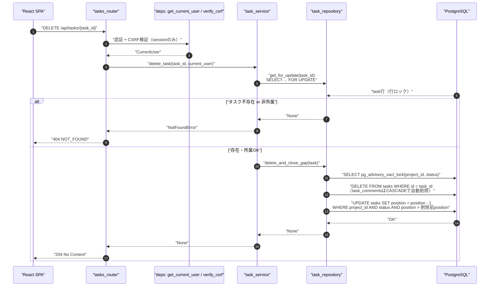
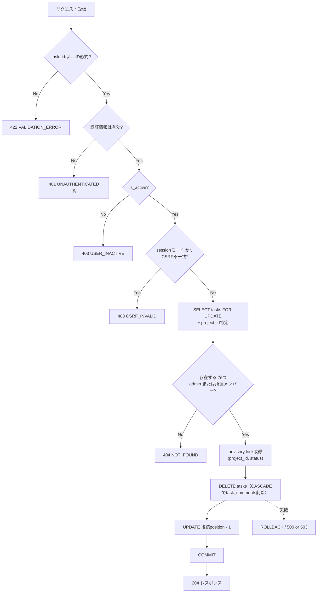
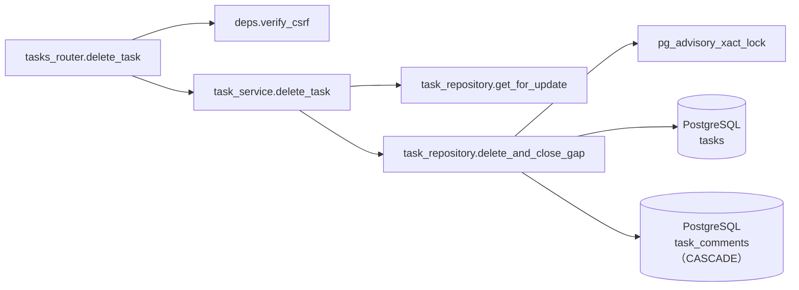
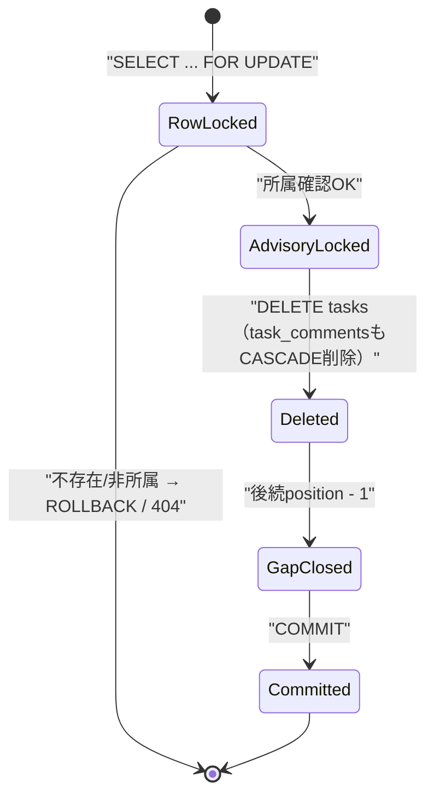

# DELETE /api/tasks/{task_id}（タスク削除）

## 0. 関連ドキュメント

| ドキュメント | 内容 |
|--------------|------|
| [../../../basic_design/04_api.md](../../../basic_design/04_api.md) | §2.4 エンドポイント一覧、§7.2 `delete_task` |
| [../../../basic_design/01_database.md](../../../basic_design/01_database.md) | §3.5 tasks（同時更新制御）、§3.6 task_comments（CASCADE） |
| [../../auth/03_csrf.md](../../auth/03_csrf.md) | CSRF検証（session モード更新系） |
| [../../database/06_table_tasks.md](../../database/06_table_tasks.md) | tasks テーブル詳細 |
| [../../database/07_table_task_comments.md](../../database/07_table_task_comments.md) | task_comments（`ON DELETE CASCADE`） |
| [./04_patch_task.md](./04_patch_task.md) | position再採番・advisory lockの共通方針 |
| [./03_get_task.md](./03_get_task.md) | 削除対象の事前取得 |

## 1. 概要

| 項目 | 内容 |
|------|------|
| エンドポイント | `DELETE /api/tasks/{task_id}` |
| 目的 | タスクを1件削除する。同一列内の後続タスクの `position` を詰め、紐づく `task_comments` をCASCADE削除する |
| 認証 | session モード：`cerberus_sid` Cookie ／ jwt モード：`Authorization: Bearer {access_token}` |
| 認可 | プロジェクトメンバー（`task_id` からプロジェクトを特定し所属確認。admin は無条件許可。基本設計 §2.4 では担当者・作成者に限定する記載はなく、所属メンバー全員が削除可） |
| CSRF検証 | 必要（session モードの更新系） |
| Origin検証 | 不要 |
| AUTH_MODE差異 | CSRF検証の要否のみ異なる |
| 冪等性 | 実質的に冪等（2回目は対象が存在しないため404。副作用として「削除済み」という結果は同一） |
| レート制限 | 対象外 |
| トランザクション境界 | `advisory lock取得 → DELETE tasks（CASCADEでtask_comments削除）→ 後続positionの詰め → COMMIT` を1トランザクションとする |

## 2. 入出力仕様（全体の出入力）

### 2.1 リクエスト

**パスパラメータ**

| 名前 | 型 | 必須 | 制約 | 説明 |
|------|----|----|------|------|
| task_id | string(uuid) | ○ | UUID v4形式 | 対象タスクID |

**クエリパラメータ**：なし
**ヘッダ**：`Authorization`（jwtモード必須）／`X-CSRF-Token`（sessionモード必須）
**Cookie**：`cerberus_sid` / `cerberus_csrf`（sessionモード必須）
**ボディ**：なし（`version` によるチェックは行わない。削除は破壊的操作だが、基本設計のリクエスト仕様に `version` の指定はない）

### 2.2 レスポンス

**`204 No Content`**：ボディなし。

`Set-Cookie` の発行なし。`X-Request-ID` を全レスポンスに付与。

## 3. エラー仕様

| HTTP | code | 発生条件 | メッセージ | 備考 |
|------|------|----------|------------|------|
| 401 | `UNAUTHENTICATED` 系 | 認証情報なし・無効 | 認証が必要です | |
| 403 | `USER_INACTIVE` | `is_active=false` | アカウントが無効化されています | |
| 403 | `CSRF_INVALID` | sessionモードでヘッダ欠落・不一致 | CSRFトークンが不正です | |
| 404 | `NOT_FOUND` | `task_id` 不存在、または非所属member | タスクが見つかりません | |
| 503 | `SERVICE_UNAVAILABLE` | PostgreSQL接続不能 | 一時的にサービスを利用できません | fail-close |

## 4. 処理シーケンス

## 5. 処理フロー・分岐

## 6. 関数詳細

### 6.1 `api/routers/tasks.py :: delete_task`

| 項目 | 内容 |
|------|------|
| シグネチャ | `async def delete_task(task_id: UUID, current_user: CurrentUser = Depends(get_current_user), db: AsyncSession = Depends(get_db)) -> Response` |
| 引数 | task_id：対象タスクID／current_user／db |
| 戻り値 | `Response(status_code=204)` |
| 送出例外 | `NotFoundError`（404） |
| 処理内容 | 1. CSRF検証は前段の依存性（sessionモードのみ有効化）で完了済み 2. `task_service.delete_task(task_id, current_user)` を呼び出す 3. 204を返す |
| 副作用 | DB更新（tasks DELETE、task_comments CASCADE削除、後続tasks UPDATE） |

### 6.2 `service/task_service.py :: delete_task`

| 項目 | 内容 |
|------|------|
| シグネチャ | `async def delete_task(task_id: UUID, user: CurrentUser) -> None` |
| 引数 | task_id：対象タスクID／user：現在ユーザー |
| 戻り値 | なし |
| 送出例外 | `NotFoundError`（タスク不存在、または非所属） |
| 処理内容 | 1. `task_repository.get_for_update(task_id)` で行ロック付き取得。`None` または非所属なら `NotFoundError` 2. `task_repository.delete_and_close_gap(task)` を呼び出す |
| 副作用 | DB更新 |

### 6.3 `repository/task_repository.py :: delete_and_close_gap`

| 項目 | 内容 |
|------|------|
| シグネチャ | `async def delete_and_close_gap(db: AsyncSession, task: Task) -> None` |
| 引数 | db：DBセッション／task：`get_for_update` で取得済みの行（ロック中） |
| 戻り値 | なし |
| 送出例外 | `OperationalError`（503へ変換） |
| 処理内容 | 1. `SELECT pg_advisory_xact_lock(hashtext(project_id::text \|\| status))` で対象列のadvisory lockを取得し、他の作成・更新・削除と直列化する 2. `DELETE FROM tasks WHERE id = :task_id` を実行。`task_comments` は `ON DELETE CASCADE`（[../../database/07_table_task_comments.md](../../database/07_table_task_comments.md)）により自動削除される 3. `UPDATE tasks SET position = position - 1 WHERE project_id = :pid AND status = :status AND position > :deleted_position` で後続の行を詰める 4. `[04_patch_task.md](./04_patch_task.md)` の退避値方式とは異なり、削除は「詰めるだけ」で位置の奪い合いが発生しないため一括UPDATE1文で完結する |
| 副作用 | DB更新（tasks DELETE + task_comments CASCADE + tasks UPDATE複数行） |

## 7. 関数相関図

## 8. データ遷移図

## 9. データアクセス一覧

**PostgreSQL**

| テーブル | 操作 | 条件・TTL | 備考 |
|----------|------|-----------|------|
| tasks | SELECT FOR UPDATE | `id = task_id` | 対象タスクの行ロック・所属確認用 |
| project_members | SELECT | `project_id`, `user_id` | 所属確認（非adminのみ） |
| tasks | advisory lock | `(project_id, status)` | 列単位の直列化 |
| tasks | DELETE | `id = task_id` | 対象行削除 |
| task_comments | DELETE（CASCADE、DB側で自動実行） | `task_id = task_id` の全行 | FK制約 `ON DELETE CASCADE` によりアプリ側から明示的なDELETE文は発行しない |
| tasks | UPDATE（複数） | `project_id`, `status`, `position > 削除前position` | 後続行のposition詰め |

**Redis**：使用なし。

## 10. バリデーション規則

| フィールド | pydanticスキーマ | 制約 | フロント（zod）との一致 |
|-----------|-------------------|------|--------------------------|
| task_id（パス） | FastAPI型ヒント `UUID` | UUID v4形式。不一致は422 | ルーティング側でUUID形式チェック |

リクエストボディを持たないため、他のバリデーション対象はない。

## 11. 非機能・セキュリティ考慮

| 項目 | 内容 |
|------|------|
| ログ出力 | INFO：タスク削除（`task_id`, `project_id`, `deleted_by`）。コメントの削除件数もログに残す（監査目的） |
| ユーザー列挙対策 | 非所属アクセスは404で統一 |
| タイミング攻撃対策 | 対象外 |
| レート制限 | なし |
| fail-close方針 | advisory lock取得やDELETE/UPDATEの途中で失敗した場合はROLLBACKし、position詰めが半端な状態を残さない |
| 破壊的操作の確認 | サーバー側では確認ダイアログを持たない（フロント側の責務。[../../screen/08_task_detail_modal.md](../../screen/08_task_detail_modal.md) 参照） |
| CASCADE削除の影響範囲 | `task_comments` のみがCASCADE対象。`tasks.assignee_id` / `created_by` は `users` 側のFKであり本APIの影響を受けない |

## 12. テスト設計

| No | 区分 | ケース | 前提 | 期待結果 | pytest関数名案 |
|----|------|--------|------|----------|-----------------|
| 1 | 単体（モック） | 正常系 | リポジトリをモック | `delete_and_close_gap` が1回呼ばれる | `test_delete_task_success` |
| 2 | 単体（モック） | タスク不存在 | `get_for_update` が `None` | `NotFoundError` 送出 | `test_delete_task_not_found` |
| 3 | 単体（モック） | 非所属member | 所属確認が失敗 | `NotFoundError` 送出 | `test_delete_task_forbidden_as_not_found` |
| 4 | 結合 | 正常系削除（member） | 実DB、列内3件中の中央を削除 | 204、後続行が-1ずつ詰まる | `test_delete_task_success_and_positions_closed` |
| 5 | 結合 | コメント付きタスクの削除 | 実DB、対象タスクにコメント2件 | 204、`task_comments` も削除される（CASCADE） | `test_delete_task_cascades_comments` |
| 6 | 結合 | 存在しないtask_id | 実DB、ランダムUUID | 404 `NOT_FOUND` | `test_delete_task_not_found_404` |
| 7 | 結合 | 非所属member | 実DB、他プロジェクトのタスク | 404 `NOT_FOUND` | `test_delete_task_forbidden_as_404` |
| 8 | 結合 | CSRF欠落（sessionモード） | ヘッダなし | 403 `CSRF_INVALID` | `test_delete_task_csrf_required` |
| 9 | 結合 | 同一列内の並行削除 | 実DB、同一列の異なるタスクを同時に2件削除 | position重複・欠番なく詰まる | `test_delete_task_concurrent_deletes_no_gap` |
| 10 | パラメータ化 | AUTH_MODE両対応 | `AUTH_MODE=session` / `jwt` | 4・6・7を両モードで実行 | フィクスチャ `auth_mode` |

## 13. 不明点・要検討事項

| 区分 | 内容 | 影響 |
|------|------|------|
| 不明 | 削除操作に `version` チェックを課すかどうかが基本設計に明記されていない。本設計では課さない（削除は非可逆操作であり、対象IDが一致すれば古い表示からの削除でも成功して問題ないという判断）とした | 楽観ロックの一貫性方針（PATCHは必須、DELETEは対象外という非対称性） |
| 要検討 | 担当者・作成者以外の一般メンバーにも削除権限を与える現行の認可マトリクス（基本設計 §5「プロジェクトメンバー」）が意図通りかは要確認 | 誤削除リスク |
