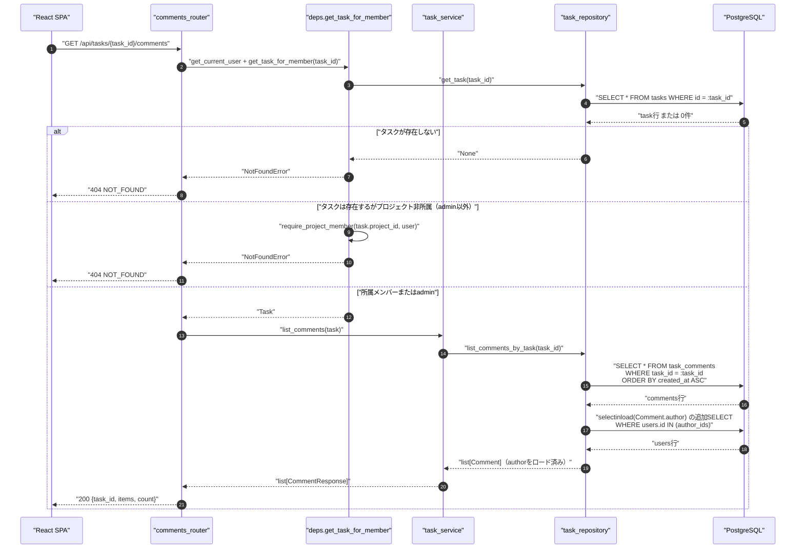
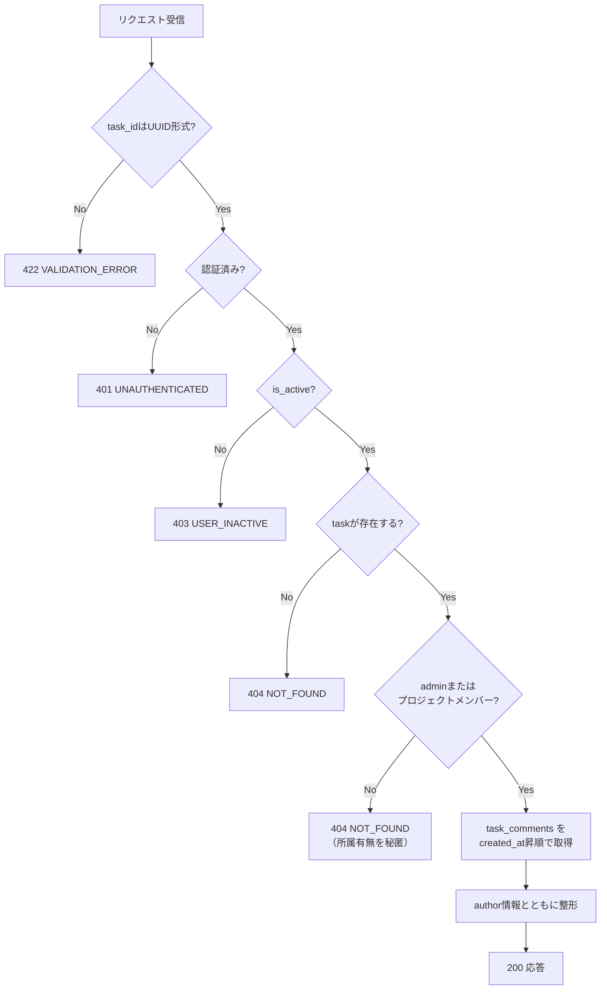
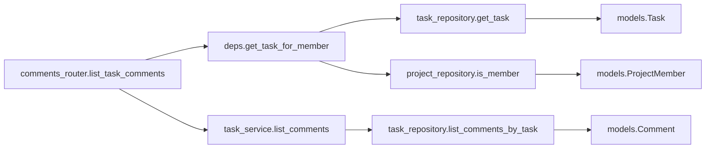
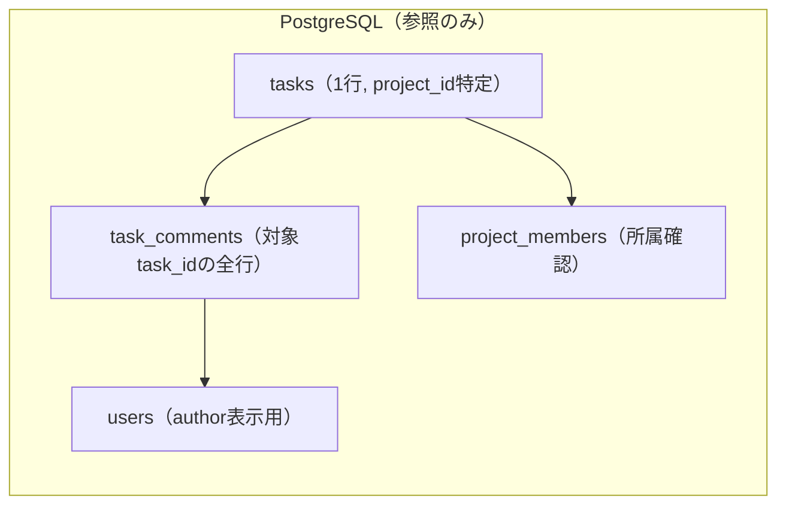

# GET /api/tasks/{task_id}/comments（タスクコメント一覧取得）

## 0. 関連ドキュメント

| ドキュメント | 内容 |
|--------------|------|
| [../../../basic_design/04_api.md](../../../basic_design/04_api.md) | §2.4 タスク・コメントAPI一覧、§5 認可マトリクス |
| [../../../basic_design/01_database.md](../../../basic_design/01_database.md) | §3.6 task_comments テーブル定義 |
| [../../../basic_design/03_auth.md](../../../basic_design/03_auth.md) | §9.2 `require_project_member`、404によるプロジェクト所属の情報秘匿方針 |
| [03_get_task.md](./03_get_task.md) | タスク詳細取得（コメント一覧はタスク詳細画面から呼ばれる） |
| [07_post_task_comments.md](./07_post_task_comments.md) | コメント投稿API |
| [../../screen/08_task_detail_modal.md](../../screen/08_task_detail_modal.md) | タスク詳細/編集モーダル画面 |

## 1. 概要

| 項目 | 内容 |
|------|------|
| エンドポイント | `GET /api/tasks/{task_id}/comments` |
| 目的 | 指定タスクに紐づくコメントを、投稿者情報付きで一覧取得する |
| 認証 | 必要（session Cookie または `Authorization: Bearer`） |
| 認可 | プロジェクトメンバー（`require_project_member` 相当。非所属・タスク不存在はいずれも404） |
| CSRF検証 | 不要（参照系のみのため） |
| Origin検証 | 不要 |
| AUTH_MODE差異 | 差異なし（`deps.get_current_user` で吸収済み） |
| 冪等性 | あり（GET） |
| レート制限 | 対象外 |
| トランザクション境界 | なし（読み取り専用、単一SELECT） |

## 2. 入出力仕様

### 2.1 リクエスト

**パスパラメータ**

| 名前 | 型 | 必須 | 制約 | 説明 |
|------|----|----|------|------|
| task_id | string(uuid) | ○ | UUID v4形式 | 対象タスクID |

**クエリパラメータ**：なし（§13参照。全件返却とする）

**ヘッダ**

| 名前 | 型 | 必須 | 説明 |
|------|----|------|------|
| Cookie: `cerberus_sid` | string | session時必須 | セッション認証 |
| Authorization | string | jwt時必須 | `Bearer {access_token}` |

**ボディ**：なし

### 2.2 レスポンス

**`200 OK`**

```json
{
  "task_id": "3f1c...",
  "items": [
    {
      "id": "9a2b...",
      "task_id": "3f1c...",
      "body": "レビューコメントです",
      "author": {
        "id": "1e5d...",
        "username": "taro",
        "display_name": "山田 太郎"
      },
      "created_at": "2026-09-01T10:00:00Z",
      "updated_at": "2026-09-01T10:00:00Z"
    }
  ],
  "count": 1
}
```

| フィールド | 型 | NULL可否 | 説明 |
|-----------|----|---------|------|
| task_id | string(uuid) | 不可 | 対象タスクID |
| items[].id | string(uuid) | 不可 | コメントID |
| items[].task_id | string(uuid) | 不可 | 冗長だがフロントの正規化を容易にするため付与 |
| items[].body | string | 不可 | コメント本文（プレーンテキスト） |
| items[].author.id | string(uuid) | 不可 | 投稿者ID |
| items[].author.username | string | 不可 | 投稿者ログインID |
| items[].author.display_name | string | 不可 | `last_name + ' ' + first_name`（`GET /projects` の `owner` と同形式）。プロフィール未設定（OAuth新規）の場合は `username` を代替表示 |
| items[].created_at | string(datetime) | 不可 | 投稿日時 |
| items[].updated_at | string(datetime) | 不可 | 最終編集日時（未編集時は `created_at` と同一） |
| count | integer | 不可 | `items` の件数 |

`Set-Cookie` の発行なし。共通ヘッダとして全レスポンスに `X-Request-ID` を付与する（`basic_design/04_api.md` §1）。

## 3. エラー仕様

| HTTP | code | 発生条件 | メッセージ | 備考 |
|------|------|----------|------------|------|
| 401 | `UNAUTHENTICATED` | 認証情報なし・無効 | 認証が必要です | |
| 401 | `SESSION_EXPIRED` | session方式でRedis上に該当セッションなし | セッションの有効期限が切れました | |
| 401 | `TOKEN_EXPIRED` / `TOKEN_INVALID` | jwt方式でアクセストークン期限切れ・不正 | アクセストークンが無効です | |
| 403 | `USER_INACTIVE` | `users.is_active = false` | アカウントが無効化されています | |
| 404 | `NOT_FOUND` | `task_id` に該当するタスクが存在しない、または存在するがプロジェクト非所属 | 対象のタスクが見つかりません | 存在の有無を区別しない（`basic_design/03_auth.md` §9.2） |

`basic_design/04_api.md` §4.2 のエラーコード体系に準拠し、新規コードは追加しない。

## 4. 処理シーケンス



## 5. 処理フロー・分岐



## 6. 関数詳細

### 6.1 `api/routers/comments.py :: list_task_comments`

| 項目 | 内容 |
|------|------|
| シグネチャ | `async def list_task_comments(task: Task = Depends(get_task_for_member), db: AsyncSession = Depends(get_db)) -> CommentListResponse` |
| 引数 | `task`：`get_task_for_member` が返す認可済みのTask／`db`：DBセッション |
| 戻り値 | `CommentListResponse`（`task_id`, `items`, `count`） |
| 送出例外 | なし（下位で送出された `NotFoundError` はハンドラが404に変換） |
| 処理内容 | 1. `task_service.list_comments(task, db)` を呼び出す 2. 結果をレスポンススキーマへ変換して返す |
| 副作用 | なし |

### 6.2 `core/deps.py :: get_task_for_member`

| 項目 | 内容 |
|------|------|
| シグネチャ | `async def get_task_for_member(task_id: UUID, user: CurrentUser = Depends(get_current_user), db: AsyncSession = Depends(get_db)) -> Task` |
| 引数 | `task_id`：パスパラメータ／`user`：現在ユーザー／`db`：DBセッション |
| 戻り値 | 所属確認済みの `Task`（`project_id` を含む） |
| 送出例外 | `NotFoundError`（タスク不存在・非所属いずれも404） |
| 処理内容 | 1. `task_repository.get_task(task_id)` でタスク取得 2. 存在しなければ `NotFoundError` 3. `user.role == 'admin'` なら通過 4. それ以外は `project_repository.is_member(task.project_id, user.id)` を確認し、Falseなら `NotFoundError` |
| 副作用 | なし |

### 6.3 `service/task_service.py :: list_comments`

| 項目 | 内容 |
|------|------|
| シグネチャ | `async def list_comments(task: Task, db: AsyncSession) -> list[Comment]` |
| 引数 | `task`：対象タスク／`db`：DBセッション |
| 戻り値 | `Comment`（ORMモデル、`author` をロード済み）のリスト |
| 送出例外 | なし |
| 処理内容 | 1. `task_repository.list_comments_by_task(task.id)` を呼び出しそのまま返す |
| 副作用 | なし |

### 6.4 `repository/task_repository.py :: list_comments_by_task`

| 項目 | 内容 |
|------|------|
| シグネチャ | `async def list_comments_by_task(task_id: UUID, db: AsyncSession) -> list[Comment]` |
| 引数 | `task_id`：対象タスクID／`db`：DBセッション |
| 戻り値 | `task_comments` 行のORMモデルリスト（`selectinload(Comment.author)` 適用） |
| 送出例外 | なし |
| 処理内容 | 1. `SELECT * FROM task_comments WHERE task_id = :task_id ORDER BY created_at ASC` を1回実行 2. `selectinload(Comment.author)` の追加SELECTを1回実行してauthorをまとめて取得する（インデックス `ix_task_comments_task_created` 使用） |
| 副作用 | なし |

## 7. 関数相関図



## 8. データ遷移図

読み取りのみで状態遷移なし。参照範囲は以下の通り。



## 9. データアクセス一覧

**PostgreSQL**

| テーブル | 操作 | 条件・TTL | 備考 |
|----------|------|-----------|------|
| tasks | SELECT | `id = :task_id` | 存在確認・project_id取得 |
| project_members | SELECT | `project_id = :pid AND user_id = :uid` | admin以外の所属確認 |
| task_comments | SELECT | `task_id = :task_id ORDER BY created_at ASC` | `ix_task_comments_task_created` を使用 |
| users | SELECT（`selectinload`の追加SELECT） | `id IN (author_ids)` | 投稿者表示名の取得。task_commentsの主クエリとは別ラウンドトリップ |

**Redis**：なし（本APIはRedisへアクセスしない）

## 10. バリデーション規則

| 項目 | pydanticスキーマ | 制約 | フロント（zod）一致方針 |
|------|-------------------|------|--------------------------|
| task_id | `CommentListParams.task_id: UUID4` | UUID v4形式でない場合 `422 VALIDATION_ERROR` | フロントはルーティングパラメータをzodの`z.string().uuid()`で検証してからAPIを呼び出す |

リクエストボディ・クエリパラメータはなし。

## 11. 非機能・セキュリティ考慮

| 観点 | 内容 |
|------|------|
| ログ出力 | INFO：`task_id`, `user_id`, `request_id`。コメント本文はログに出さない |
| 情報漏洩対策 | タスク不存在／非所属を区別せず404で統一（`basic_design/03_auth.md` §9.2） |
| N+1対策・クエリ回数 | 認可のtask取得1回 + 所属確認1回（adminは省略） + コメント主クエリ1回 + authorの`selectinload`追加SELECT 1回。author取得は別ラウンドトリップだが、コメント件数に比例する追加クエリは発行しない |
| レート制限 | 対象外（参照系） |
| fail-close | PostgreSQL接続不能時は `503 SERVICE_UNAVAILABLE` |

## 12. テスト設計

| No | 区分 | ケース | 前提 | 期待結果 | pytest関数名案 |
|----|------|--------|------|----------|-----------------|
| 1 | 単体 | サービス層がリポジトリを1回だけ呼ぶ | `task_repository` をモック | `list_comments_by_task` が1回呼ばれる | `test_list_comments_calls_repository_once` |
| 2 | 結合 | コメントが投稿者情報付きで作成順に返る | 実DB、2件のコメントを事前作成 | `items` が `created_at` 昇順、`author.display_name` が正しい | `test_get_task_comments_returns_ordered_with_author` |
| 3 | 結合 | 非所属メンバーがアクセス | 実DB、他プロジェクトのメンバーでリクエスト | `404 NOT_FOUND` | `test_get_task_comments_non_member_returns_404` |
| 4 | 結合 | 存在しないtask_id | 実DB | `404 NOT_FOUND` | `test_get_task_comments_missing_task_returns_404` |
| 5 | 結合 | admin は所属外プロジェクトでも取得可能 | 実DB、adminユーザー | `200` | `test_get_task_comments_admin_bypasses_membership` |
| 6 | パラメータ化 | `AUTH_MODE=session` / `jwt` の両方で正常系を確認 | 両モードのfixture | いずれも `200` | `test_get_task_comments_both_auth_modes` |

コメントが0件のタスクに対する取得（`items: []`）は上記No.2の派生ケースとしてアサーションに含め、個別ケースは省略する。

## 13. 不明点・要検討事項

| 区分 | 内容 | 影響 |
|------|------|------|
| 確定 | `author.display_name` は`last_name`と`first_name`がともに空でない場合に結合し、それ以外は`username`へフォールバックする | OAuth新規ユーザーを含む投稿者表示を統一する |
