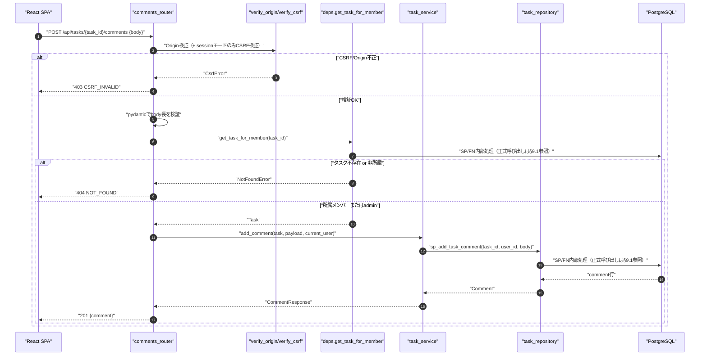
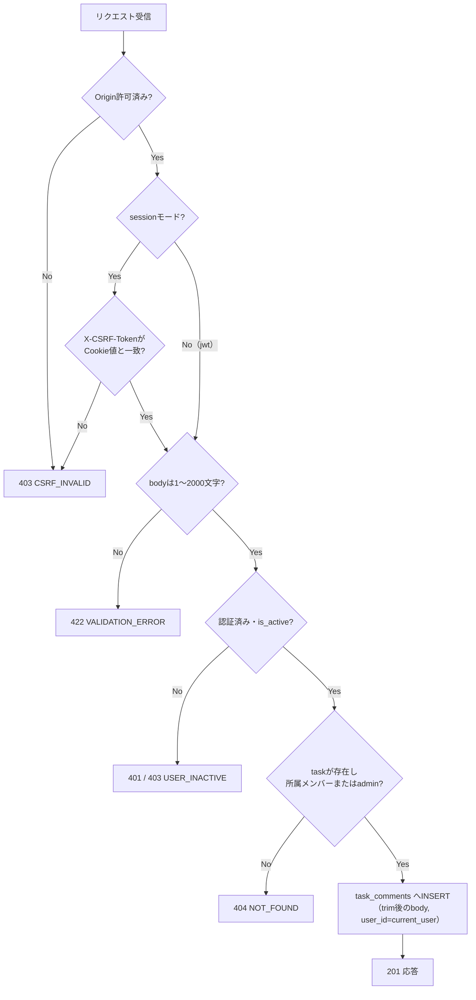
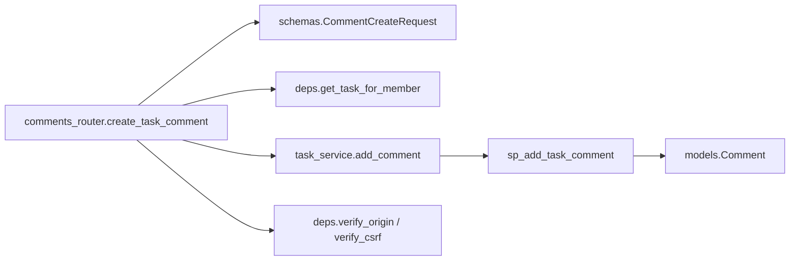
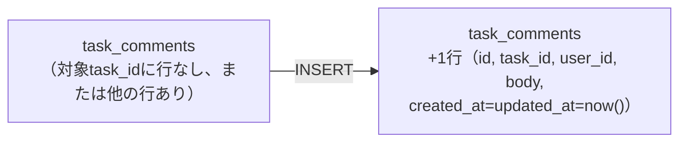

# POST /api/tasks/{task_id}/comments（タスクコメント投稿）

## 0. 関連ドキュメント

| ドキュメント | 内容 |
|--------------|------|
| [../../../basic_design/04_api.md](../../../basic_design/04_api.md) | §2.4 タスク・コメントAPI一覧、§4 エラー設計、§5 認可マトリクス |
| [../../../basic_design/01_database.md](../../../basic_design/01_database.md) | §3.6 task_comments テーブル定義（body 1〜2000文字） |
| [../../../basic_design/03_auth.md](../../../basic_design/03_auth.md) | §8 CSRF対策、§9.2 `require_project_member` |
| [06_get_task_comments.md](./06_get_task_comments.md) | コメント一覧取得API（`get_task_for_member` を共用） |
| [08_patch_comment.md](./08_patch_comment.md) | コメント編集API |
| [../../screen/08_task_detail_modal.md](../../screen/08_task_detail_modal.md) | タスク詳細/編集モーダル画面 |

## 1. 概要

| 項目 | 内容 |
|------|------|
| エンドポイント | `POST /api/tasks/{task_id}/comments` |
| 目的 | 指定タスクに新規コメントを投稿する |
| 認証 | 必要 |
| 認可 | プロジェクトメンバー（`require_project_member` 相当。タスク不存在・非所属はいずれも404） |
| CSRF検証 | 必要（sessionモードの更新系。jwtモードはAuthorizationヘッダのため不要） |
| Origin検証 | 必要（`basic_design/04_api.md` §1、更新系リクエストのため） |
| AUTH_MODE差異 | CSRF検証の要否のみ差異あり。それ以外は差異なし |
| 冪等性 | なし（POSTのため。二重送信防止はフロント側でボタン非活性化により行う） |
| レート制限 | 対象外（§13参照。現時点で基本設計に規定なし） |
| トランザクション境界 | `task_comments` への1行INSERTのみ。単一ステートメントのため明示的トランザクションは不要 |

## 2. 入出力仕様

### 2.1 リクエスト

**パスパラメータ**

| 名前 | 型 | 必須 | 制約 | 説明 |
|------|----|----|------|------|
| task_id | string(uuid) | ○ | UUID v4形式 | 対象タスクID |

**ヘッダ**

| 名前 | 型 | 必須 | 説明 |
|------|----|----|------|
| Cookie: `cerberus_sid` | string | session時必須 | セッション認証 |
| Authorization | string | jwt時必須 | `Bearer {access_token}` |
| X-CSRF-Token | string | sessionモードのみ必須 | `cerberus_csrf` Cookieの値と一致すること |

**ボディ**（`schemas/comment.py :: CommentCreateRequest`）

| フィールド | 型 | 必須 | 制約 | 説明 |
|-----------|----|------|------|------|
| body | string | ○ | 1〜2000文字（前後空白をtrim後に判定）。空文字・空白のみは不可 | コメント本文（プレーンテキスト） |

### 2.2 レスポンス

**`201 Created`**

```json
{
  "id": "9a2b...",
  "task_id": "3f1c...",
  "body": "レビューコメントです",
  "author": {
    "id": "1e5d...",
    "username": "taro",
    "display_name": "山田 太郎"
  },
  "created_at": "2026-09-01T10:00:00Z",
  "updated_at": "2026-09-01T10:00:00Z"
}
```

| フィールド | 型 | NULL可否 | 説明 |
|-----------|----|---------|------|
| id | string(uuid) | 不可 | 新規発行されたコメントID |
| task_id | string(uuid) | 不可 | 対象タスクID |
| body | string | 不可 | 保存された本文（trim後） |
| author.id / username / display_name | 各種 | 不可 | 投稿者は常に現在ユーザー自身 |
| created_at / updated_at | string(datetime) | 不可 | 作成時は同一値 |

`Set-Cookie` の発行なし。全レスポンスに `X-Request-ID` を付与する。

## 3. エラー仕様

| HTTP | code | 発生条件 | メッセージ | 備考 |
|------|------|----------|------------|------|
| 401 | `UNAUTHENTICATED` | 認証情報なし・無効 | 認証が必要です | |
| 403 | `USER_INACTIVE` | `users.is_active = false` | アカウントが無効化されています | |
| 403 | `CSRF_INVALID` | sessionモードでCSRFトークン不一致・欠落、またはOrigin不一致 | CSRFトークンが不正です | |
| 404 | `NOT_FOUND` | タスク不存在、またはプロジェクト非所属 | 対象のタスクが見つかりません | 06番ファイルと同一方針 |
| 422 | `VALIDATION_ERROR` | `body` が空・2000文字超・型不正 | 入力内容に誤りがあります | `details` に `field: "body"` |

## 4. 処理シーケンス



## 5. 処理フロー・分岐



## 6. 関数詳細

### 6.1 `api/routers/comments.py :: create_task_comment`

| 項目 | 内容 |
|------|------|
| シグネチャ | `async def create_task_comment(payload: CommentCreateRequest, task: Task = Depends(get_task_for_member), user: CurrentUser = Depends(get_current_user), db: AsyncSession = Depends(get_db)) -> CommentResponse` |
| 引数 | `payload`：リクエストボディ／`task`：認可済みタスク／`user`：現在ユーザー／`db`：DBセッション |
| 戻り値 | `CommentResponse`（201） |
| 送出例外 | なし（下位の例外はハンドラで変換） |
| 処理内容 | 1. `task_service.add_comment(task, payload, user, db)` を呼ぶ 2. 結果を返す |
| 副作用 | `task_comments` への1行追加（サービス層経由） |

### 6.2 `schemas/comment.py :: CommentCreateRequest`

| 項目 | 内容 |
|------|------|
| シグネチャ | `class CommentCreateRequest(BaseModel): body: str = Field(min_length=1, max_length=TASK_COMMENT_BODY_MAX_LENGTH)` |
| 引数 | - |
| 戻り値 | pydanticモデル |
| 送出例外 | `RequestValidationError`（422） |
| 処理内容 | 1. `str_strip_whitespace=True`（pydantic Config）でtrim 2. trim後の空文字を `min_length=1` で拒否 3. `TASK_COMMENT_BODY_MAX_LENGTH`（`core/config.py`、既定値2000。`task_comments.body` のアプリ層検証値と一致させる）で上限を検証 |
| 副作用 | なし |

### 6.3 `service/task_service.py :: add_comment`

| 項目 | 内容 |
|------|------|
| シグネチャ | `async def add_comment(task: Task, payload: CommentCreateRequest, user: CurrentUser, db: AsyncSession) -> Comment` |
| 引数 | `task`：対象タスク／`payload`：検証済み入力／`user`：投稿者／`db`：DBセッション |
| 戻り値 | 作成された `Comment`（`author` は `user` から構築、追加SELECTなし） |
| 送出例外 | なし（バリデーションはルーター層のpydanticで完了済み） |
| 処理内容 | 1. API側で`comment_id`を生成し、`CALL sp_add_task_comment(comment_id, task.id, user.id, payload.body)` を呼ぶ 2. `SELECT fn_list_task_comments(task.id)` の結果から作成行を写像して返す |
| 副作用 | `task_comments` への1行INSERT |

### 6.4 `repository/task_repository.py :: sp_add_task_comment`

| 項目 | 内容 |
|------|------|
| シグネチャ | `async def sp_add_task_comment(comment_id: UUID, task_id: UUID, user_id: UUID, body: str, db: AsyncSession) -> None` |
| 引数 | `task_id` / `user_id` / `body`：保存する値／`db`：DBセッション |
| 戻り値 | INSERT後の `Comment`（`id`, `created_at`, `updated_at` がDB既定値で採番済み） |
| 送出例外 | `IntegrityError`（FK違反時。通常は上位で存在確認済みのため発生しない想定） |
| 処理内容 | 1. `Comment(task_id=..., user_id=..., body=...)` を生成し `db.add` 2. `flush` してIDと既定値を取得 |
| 副作用 | `task_comments` テーブルへのINSERT |

## 7. 関数相関図



## 8. データ遷移図



Redisの状態遷移はない（本APIはRedisへアクセスしない）。

## 9. SP/FNデータアクセス一覧

### 9.1 正式なDBアクセス契約

本APIのrepositoryは、次のSP/FN呼び出しとDTO写像だけを行う。

| 種別 | 契約 | 説明 |
|------|------|------|
| add_task_comment | `sp_add_task_comment(p_comment_id, p_task_id, p_user_id, p_body)` | sp_add_task_commentを呼び出し、結果をレスポンスへ写像する |

repositoryはDBテーブルへ直結せず、SP/FN契約だけを呼び出す。 直下の従来のテーブルI/O表はSP/FN内部SQLの補足であり、repositoryの発行契約ではない。更新系の整合性制御、version検証、advisory lock、通知、SQLSTATE P0xxxはSP/FN層の責務である。存在・所属の事実判定はFNの空集合/falseを受け、404/403への変換はAPI層が行う。

**PostgreSQL**

| テーブル | 操作 | 条件・TTL | 備考 |
|----------|------|-----------|------|
| tasks | SELECT | `id = :task_id` | `get_task_for_member` 内で実行（06番と共通） |
| project_members | SELECT | `project_id = :pid AND user_id = :uid` | 所属確認 |
| task_comments | INSERT | - | `body` はtrim済み文字列 |

**Redis**：なし

## 10. バリデーション規則

| 項目 | pydanticスキーマ | 制約 | フロント（zod）一致方針 |
|------|-------------------|------|--------------------------|
| body | `CommentCreateRequest.body` | `min_length=1`, `max_length=TASK_COMMENT_BODY_MAX_LENGTH`（既定2000）、trim後判定 | フロントは同じ上限値を `VITE_TASK_COMMENT_BODY_MAX_LENGTH` 等の設定から取得するか、zodスキーマにハードコードせず定数モジュールで一元管理する（要検討、§13参照） |

## 11. 非機能・セキュリティ考慮

| 観点 | 内容 |
|------|------|
| XSS対策の責務分担 | バックエンドはHTMLタグの除去・エスケープを行わず、`body` をプレーンテキストとしてそのまま保存する。表示側（React SPA）はJSXの標準エスケープのみを用い、`dangerouslySetInnerHTML` を使用しない設計とすることで、保存値に `<script>` 等が含まれても画面上は文字列として表示されXSSが成立しない構成とする。Markdown等のリッチテキスト解釈は行わない（要検討、§13参照） |
| CSRF対策 | sessionモードは `X-CSRF-Token` とOrigin検証の二重防御。jwtモードはAuthorizationヘッダのみで送信されるためCSRF不要 |
| ログ出力 | INFO：`task_id`, `user_id`, `comment_id`, `request_id`。本文は個人情報を含み得るためログへ出力しない |
| レート制限 | 現状規定なし。連続投稿によるスパムは学習用途のためスコープ外とし、必要になった場合は `COMMENT_POST_RATE_LIMIT` のような設定項目名を新設して対応する（要検討） |
| fail-close | PostgreSQL接続不能時は `503 SERVICE_UNAVAILABLE` |

## 12. テスト設計

| No | 区分 | ケース | 前提 | 期待結果 | pytest関数名案 |
|----|------|--------|------|----------|-----------------|
| 1 | 単体 | trim後に空文字になる入力 | `body="   "` | `422 VALIDATION_ERROR` | `test_comment_create_rejects_whitespace_only` |
| 2 | 単体 | 2001文字の入力 | `body` を2001文字で構成 | `422 VALIDATION_ERROR` | `test_comment_create_rejects_over_max_length` |
| 3 | 単体 | サービス層がリポジトリに渡す値 | リポジトリをモック | `sp_add_task_comment` にtrim後の`body`が渡る | `test_add_comment_passes_trimmed_body` |
| 4 | 結合 | 正常投稿 | 実DB、プロジェクトメンバーでリクエスト | `201`、`task_comments` に1行追加、`author` が現在ユーザー | `test_post_task_comments_creates_comment` |
| 5 | 結合 | 非所属メンバーが投稿 | 実DB | `404 NOT_FOUND` | `test_post_task_comments_non_member_returns_404` |
| 6 | 結合 | CSRFトークン欠落（sessionモード） | 実DB、`X-CSRF-Token` 未送信 | `403 CSRF_INVALID` | `test_post_task_comments_missing_csrf_session_mode` |
| 7 | パラメータ化 | `AUTH_MODE=session` / `jwt` の両方で正常系を確認 | 両モードのfixture | いずれも `201` | `test_post_task_comments_both_auth_modes` |
| 8 | 結合 | `<script>alert(1)</script>` を含む本文を投稿し取得 | 実DB | 保存値がエスケープされずそのまま格納される（サーバー側では変換しない方針の確認） | `test_post_task_comments_stores_raw_body_without_serverside_escaping` |

フロントのReactエスケープ挙動自体はバックエンドのpytestでは検証できないため、フロントエンドのVitestテスト側の責務とする（本ファイルのテスト対象外）。

## 13. 不明点・要検討事項

| 区分 | 内容 | 影響 |
|------|------|------|
| 要検討 | コメント投稿のレート制限（連投防止）が基本設計に規定されていない | スパム・大量投稿への耐性 |
| 要検討 | `TASK_COMMENT_BODY_MAX_LENGTH` をフロント（zod）とどう共有するか（環境変数経由か、共有定数ファイルか）が未確定 | フロント・バック間の制約不一致リスク |
| 不明 | Markdownやリッチテキスト対応の要否。本設計はプレーンテキスト前提とした | 将来のコメント表示仕様変更時の影響 |
