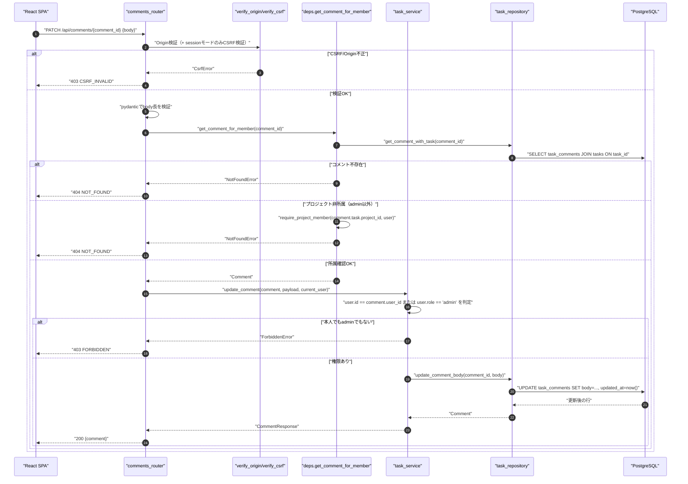
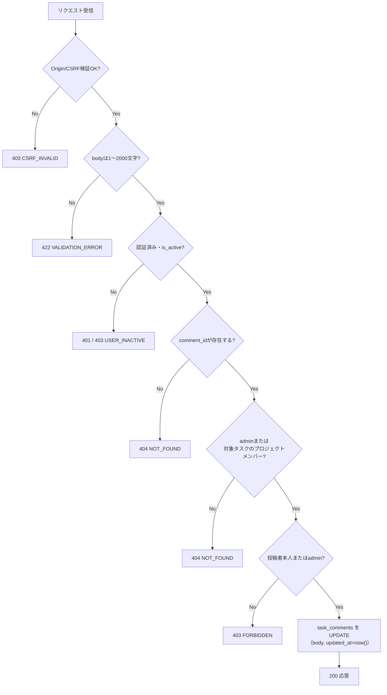
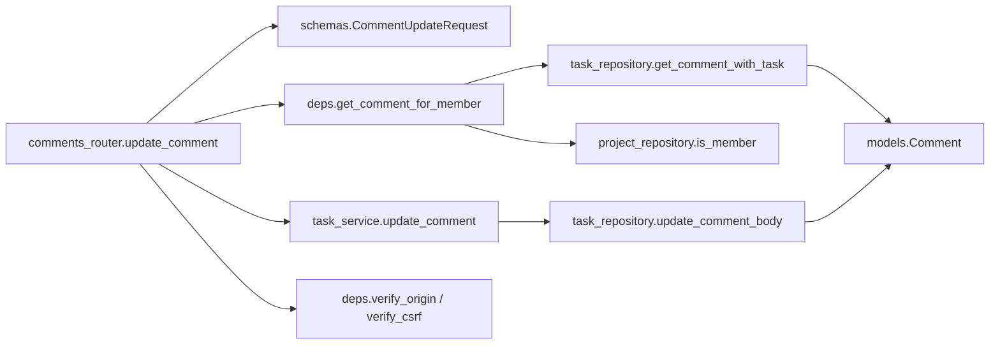
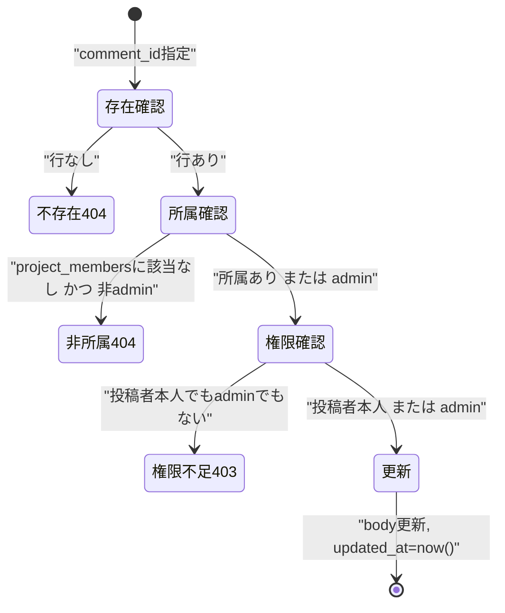

# PATCH /api/comments/{comment_id}（コメント編集）

## 0. 関連ドキュメント

| ドキュメント | 内容 |
|--------------|------|
| [../../../basic_design/04_api.md](../../../basic_design/04_api.md) | §2.4 タスク・コメントAPI一覧、§5 認可マトリクス（`PATCH /comments/{id}`：投稿者本人のみ○） |
| [../../../basic_design/01_database.md](../../../basic_design/01_database.md) | §3.6 task_comments テーブル定義 |
| [../../../basic_design/03_auth.md](../../../basic_design/03_auth.md) | §8 CSRF対策、§9.2 情報漏洩防止のための404方針 |
| [07_post_task_comments.md](./07_post_task_comments.md) | コメント投稿API（バリデーション規則を共用） |
| [09_delete_comment.md](./09_delete_comment.md) | コメント削除API（認可判定を共用） |

## 1. 概要

| 項目 | 内容 |
|------|------|
| エンドポイント | `PATCH /api/comments/{comment_id}` |
| 目的 | 自分が投稿したコメントの本文を編集する（管理者は他人のコメントも編集可能） |
| 認証 | 必要 |
| 認可 | 投稿者本人 または admin（§3・§5で403/404の切り分けを規定） |
| CSRF検証 | 必要（sessionモードの更新系） |
| Origin検証 | 必要 |
| AUTH_MODE差異 | CSRF検証の要否のみ差異あり |
| 冪等性 | あり（同一bodyでの再送信は同じ結果になる。ただし`updated_at`は都度更新される） |
| レート制限 | 対象外 |
| トランザクション境界 | `task_comments` の1行UPDATEのみ。`version` 列を持たないため楽観ロックは行わない（§13参照） |

## 2. 入出力仕様

### 2.1 リクエスト

**パスパラメータ**

| 名前 | 型 | 必須 | 制約 | 説明 |
|------|----|----|------|------|
| comment_id | string(uuid) | ○ | UUID v4形式 | 編集対象コメントID |

**ヘッダ**

| 名前 | 型 | 必須 | 説明 |
|------|----|----|------|
| Cookie: `cerberus_sid` | string | session時必須 | セッション認証 |
| Authorization | string | jwt時必須 | `Bearer {access_token}` |
| X-CSRF-Token | string | sessionモードのみ必須 | |

**ボディ**（`schemas/comment.py :: CommentUpdateRequest`）

| フィールド | 型 | 必須 | 制約 | 説明 |
|-----------|----|------|------|------|
| body | string | ○ | 1〜2000文字（trim後判定。`TASK_COMMENT_BODY_MAX_LENGTH`） | 更新後の本文（全置換。部分パッチではない） |

### 2.2 レスポンス

**`200 OK`**

```json
{
  "id": "9a2b...",
  "task_id": "3f1c...",
  "body": "編集後のコメントです",
  "author": {
    "id": "1e5d...",
    "username": "taro",
    "display_name": "山田 太郎"
  },
  "created_at": "2026-09-01T10:00:00Z",
  "updated_at": "2026-09-01T10:05:00Z"
}
```

フィールド定義は [07_post_task_comments.md](./07_post_task_comments.md) §2.2 と同一。`updated_at` のみ更新時刻に置き換わる。`Set-Cookie` 発行なし。

## 3. エラー仕様

| HTTP | code | 発生条件 | メッセージ | 備考 |
|------|------|----------|------------|------|
| 401 | `UNAUTHENTICATED` | 認証情報なし・無効 | 認証が必要です | |
| 403 | `USER_INACTIVE` | `users.is_active = false` | アカウントが無効化されています | |
| 403 | `CSRF_INVALID` | sessionモードでCSRF不一致・Origin不一致 | CSRFトークンが不正です | |
| 403 | `FORBIDDEN` | コメントが存在しプロジェクトメンバーではあるが、投稿者本人でもadminでもない | このコメントを編集する権限がありません | **プロジェクト非所属の404とは明確に区別する（下記参照）** |
| 404 | `NOT_FOUND` | `comment_id` が存在しない、またはコメントは存在するが対象プロジェクトに非所属 | 対象のコメントが見つかりません | |
| 422 | `VALIDATION_ERROR` | `body` が空・2000文字超 | 入力内容に誤りがあります | |

### 3.1 403か404かの切り分け

| ケース | 判定順序 | 結果 |
|--------|----------|------|
| コメントIDが存在しない | 1 | `404 NOT_FOUND` |
| コメントは存在するが、リクエストユーザーが対象タスクの属するプロジェクトのメンバーではない（adminを除く） | 2 | `404 NOT_FOUND`（`basic_design/03_auth.md` §9.2 の所属秘匿方針をコメントにも適用） |
| プロジェクトメンバーである（または投稿対象タスクの所属先に権限がある）が、投稿者本人でもadminでもない | 3 | `403 FORBIDDEN`（コメントの存在自体は既に判明しているため隠す意味がなく、権限不足を明示する） |
| 投稿者本人、またはadmin | 4 | 処理続行 |

判定は必ずこの順序（存在確認 → プロジェクト所属確認 → 投稿者/admin確認）で行い、プロジェクト非所属者には常に404を返すことで「コメントが存在するか」自体を秘匿する。

## 4. 処理シーケンス



## 5. 処理フロー・分岐



## 6. 関数詳細

### 6.1 `api/routers/comments.py :: update_comment`

| 項目 | 内容 |
|------|------|
| シグネチャ | `async def update_comment(payload: CommentUpdateRequest, comment: Comment = Depends(get_comment_for_member), user: CurrentUser = Depends(get_current_user), db: AsyncSession = Depends(get_db)) -> CommentResponse` |
| 引数 | `payload`：更新内容／`comment`：プロジェクト所属確認済みのコメント／`user`：現在ユーザー／`db`：DBセッション |
| 戻り値 | `CommentResponse`（200） |
| 送出例外 | なし（下位の `ForbiddenError` はハンドラで403に変換） |
| 処理内容 | 1. `task_service.update_comment(comment, payload, user, db)` を呼ぶ 2. 結果を返す |
| 副作用 | `task_comments` の1行UPDATE（サービス層経由） |

### 6.2 `core/deps.py :: get_comment_for_member`

| 項目 | 内容 |
|------|------|
| シグネチャ | `async def get_comment_for_member(comment_id: UUID, user: CurrentUser = Depends(get_current_user), db: AsyncSession = Depends(get_db)) -> Comment` |
| 引数 | `comment_id`：パスパラメータ／`user`：現在ユーザー／`db`：DBセッション |
| 戻り値 | `task.project_id` を判定済みの `Comment`（投稿者本人/admin判定はまだ行わない） |
| 送出例外 | `NotFoundError`（コメント不存在・プロジェクト非所属いずれも404） |
| 処理内容 | 1. `task_repository.get_comment_with_task(comment_id)` でコメント＋所属タスクを取得 2. 存在しなければ `NotFoundError` 3. `user.role == 'admin'` なら通過 4. それ以外は `project_repository.is_member(comment.task.project_id, user.id)` を確認し、Falseなら `NotFoundError` |
| 副作用 | なし |

### 6.3 `service/task_service.py :: update_comment`

| 項目 | 内容 |
|------|------|
| シグネチャ | `async def update_comment(comment: Comment, payload: CommentUpdateRequest, user: CurrentUser, db: AsyncSession) -> Comment` |
| 引数 | `comment`：所属確認済みコメント／`payload`：更新内容／`user`：操作者／`db`：DBセッション |
| 戻り値 | 更新後の `Comment` |
| 送出例外 | `ForbiddenError`（投稿者本人でもadminでもない場合、403） |
| 処理内容 | 1. `user.id == comment.user_id or user.role == 'admin'` を判定し、Falseなら `ForbiddenError` 2. `task_repository.update_comment_body(comment.id, payload.body, db)` を呼ぶ 3. 結果に `author` をセットして返す |
| 副作用 | `task_comments` の1行UPDATE |

### 6.4 `repository/task_repository.py :: get_comment_with_task`

| 項目 | 内容 |
|------|------|
| シグネチャ | `async def get_comment_with_task(comment_id: UUID, db: AsyncSession) -> Comment \| None` |
| 引数 | `comment_id`：対象コメントID／`db`：DBセッション |
| 戻り値 | `task`（`project_id` を含む）と `author` をロード済みの `Comment`、存在しなければ `None` |
| 送出例外 | なし |
| 処理内容 | 1. `SELECT * FROM task_comments WHERE id = :comment_id` を `selectinload(Comment.task)` と `selectinload(Comment.author)` 付きで実行 |
| 副作用 | なし |

### 6.5 `repository/task_repository.py :: update_comment_body`

| 項目 | 内容 |
|------|------|
| シグネチャ | `async def update_comment_body(comment_id: UUID, body: str, db: AsyncSession) -> Comment` |
| 引数 | `comment_id` / `body`：更新後の本文／`db`：DBセッション |
| 戻り値 | 更新後の `Comment` |
| 送出例外 | なし（呼び出し時点で存在確認済み） |
| 処理内容 | 1. 対象行の `body` を更新し `updated_at` はトリガ（`trg_set_updated_at`）で自動更新 2. `flush` して最新値を取得 |
| 副作用 | `task_comments` の1行UPDATE |

## 7. 関数相関図



## 8. データ遷移図



## 9. データアクセス一覧

**PostgreSQL**

| テーブル | 操作 | 条件・TTL | 備考 |
|----------|------|-----------|------|
| task_comments | SELECT | `id = :comment_id`（`tasks`をJOIN/selectinload） | 存在確認・project_id特定 |
| project_members | SELECT | `project_id = :pid AND user_id = :uid` | admin以外の所属確認 |
| task_comments | UPDATE | `id = :comment_id` | `body` を更新、`updated_at` はトリガで自動更新 |

**Redis**：なし

## 10. バリデーション規則

| 項目 | pydanticスキーマ | 制約 | フロント（zod）一致方針 |
|------|-------------------|------|--------------------------|
| body | `CommentUpdateRequest.body` | `min_length=1`, `max_length=TASK_COMMENT_BODY_MAX_LENGTH`（既定2000）、trim後判定 | [07_post_task_comments.md](./07_post_task_comments.md) §10 と同一方針 |

`CommentUpdateRequest` は `CommentCreateRequest` と同一の `body` 制約を持つ（部分更新ではなく全置換のため、他フィールドは存在しない）。

## 11. 非機能・セキュリティ考慮

| 観点 | 内容 |
|------|------|
| XSS対策 | [07_post_task_comments.md](./07_post_task_comments.md) §11 と同一方針（サーバーは無加工保存、表示側でエスケープ） |
| 403/404の切り分け | §3.1参照。プロジェクト所属可否は隠し、所属後の権限不足は明示する設計とし、ユーザーへのフィードバック可読性と情報漏洩防止を両立する |
| 楽観ロック | `task_comments` に `version` 列を持たないため、同時編集は後勝ち（last-write-wins）となる。タスクの`version`のような競合検出は行わない（要検討、§13参照） |
| CSRF対策 | 07番と同一方針 |
| ログ出力 | INFO：`comment_id`, `task_id`, `actor_user_id`（実行者）, `is_admin_override`（投稿者以外＝admin代理編集かどうか）, `request_id` |
| fail-close | PostgreSQL接続不能時は `503 SERVICE_UNAVAILABLE` |

## 12. テスト設計

| No | 区分 | ケース | 前提 | 期待結果 | pytest関数名案 |
|----|------|--------|------|----------|-----------------|
| 1 | 単体 | 投稿者本人が更新 | `user.id == comment.user_id` | サービスが例外を投げず更新処理へ進む | `test_update_comment_allows_author` |
| 2 | 単体 | admin以外の非投稿者 | `user.id != comment.user_id`, `role='member'` | `ForbiddenError` | `test_update_comment_rejects_non_author_non_admin` |
| 3 | 単体 | admin | `role='admin'`, 非投稿者 | サービスが例外を投げず更新処理へ進む | `test_update_comment_allows_admin_override` |
| 4 | 結合 | 存在しないcomment_id | 実DB | `404 NOT_FOUND` | `test_patch_comment_missing_returns_404` |
| 5 | 結合 | プロジェクト非所属メンバーが編集 | 実DB、他プロジェクトのメンバー | `404 NOT_FOUND` | `test_patch_comment_non_member_returns_404` |
| 6 | 結合 | プロジェクトメンバーだが投稿者ではない | 実DB、同一プロジェクトの別メンバー | `403 FORBIDDEN` | `test_patch_comment_member_non_author_returns_403` |
| 7 | 結合 | 投稿者本人が編集 | 実DB | `200`、`body`と`updated_at`が更新される | `test_patch_comment_author_updates_successfully` |
| 8 | 結合 | adminが他人のコメントを編集 | 実DB、adminユーザー | `200` | `test_patch_comment_admin_can_edit_others` |
| 9 | パラメータ化 | `AUTH_MODE=session` / `jwt` の両方で正常系を確認 | 両モードのfixture | いずれも `200` | `test_patch_comment_both_auth_modes` |

## 13. 不明点・要検討事項

| 区分 | 内容 | 影響 |
|------|------|------|
| 要検討 | `task_comments` に楽観ロック用の`version`列がなく、同時編集は後勝ちになる。`tasks`同様の競合検出を導入するかは基本設計未記載のため要判断 | 同時編集時にどちらかの変更が無言で失われる可能性 |
| 要検討 | 編集履歴（編集済みマークの表示要否）が基本設計・要件定義に規定されていない。本設計では`updated_at`のみで判定する前提とした | UI上の「編集済み」表示可否 |
