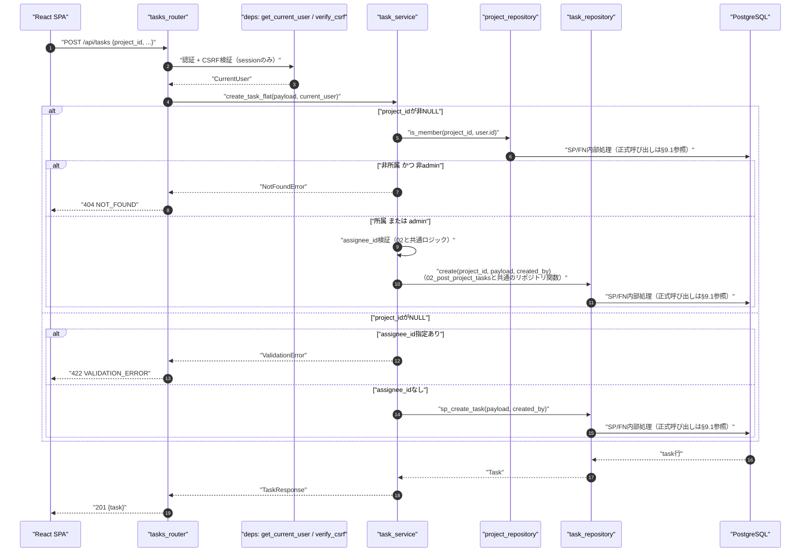
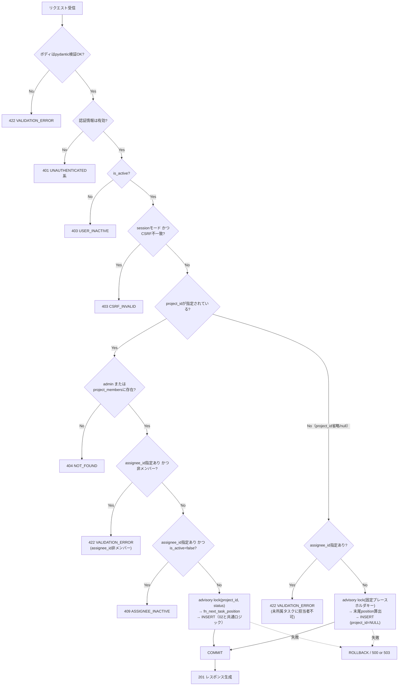
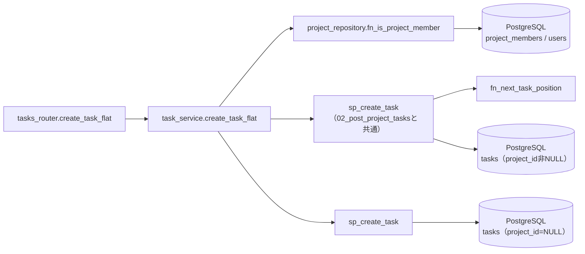
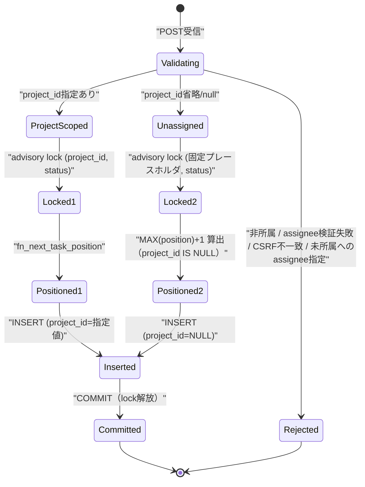

# POST /api/tasks（フラットタスク作成）

## 0. 関連ドキュメント

| ドキュメント | 内容 |
|--------------|------|
| [../../../basic_design/04_api.md](../../../basic_design/04_api.md) | §2.4 エンドポイント一覧、§6.1 タスク作成シーケンス、§7.2 サービス層関数一覧 |
| [../../../basic_design/01_database.md](../../../basic_design/01_database.md) | §3.5 tasks（`project_id` NULL許容、`position`/`version`）、§5.3 `fn_next_task_position` |
| [../../auth/05_rbac.md](../../auth/05_rbac.md) | `require_project_member`、CSRF/Origin検証 |
| [../../auth/03_csrf.md](../../auth/03_csrf.md) | 更新系のCSRF検証仕様 |
| [../../database/06_table_tasks.md](../../database/06_table_tasks.md) | tasks テーブル詳細。`project_id` NULL許容化とadvisory lockキーのプレースホルダ方針（不明点・要検討事項） |
| [./02_post_project_tasks.md](./02_post_project_tasks.md) | プロジェクト配下限定の作成API（所属チェック・position採番ロジックは本APIから共通利用） |
| [./10_get_tasks.md](./10_get_tasks.md) | 同一リソース群のフラット一覧取得API |
| [./04_patch_task.md](./04_patch_task.md) | advisory lock・position採番の共通方針 |

## 1. 概要

| 項目 | 内容 |
|------|------|
| エンドポイント | `POST /api/tasks` |
| 目的 | body内の `project_id`（任意、`null`可）でプロジェクト所属タスク・未所属タスクのいずれも作成できる。`project_id`を指定した場合は`POST /api/projects/{project_id}/tasks`（[02](./02_post_project_tasks.md)）と同じ所属チェック・position採番ロジックをサービス層で共有し、`project_id`省略・`null`指定時は未所属タスクとして作成する |
| 認証 | session モード：`cerberus_sid` Cookie ／ jwt モード：`Authorization: Bearer {access_token}` |
| 認可 | `project_id`を指定した場合：プロジェクトメンバー（`require_project_member`相当。admin は無条件許可）。`project_id`省略/`null`の場合：ログイン済みユーザー全員に作成を許可（未所属タスクは誰でも自分用に作成できる。作成後の可視範囲は作成者本人のみ、[03_get_task.md](./03_get_task.md)参照） |
| CSRF検証 | 必要（session モードの更新系。`X-CSRF-Token` ヘッダ必須） |
| Origin検証 | 不要 |
| AUTH_MODE差異 | session時はCSRF検証あり、jwt時は不要。それ以外の業務ロジックに差異なし |
| 冪等性 | なし（POSTのため同一リクエストの再送で複数タスクが作成され得る） |
| レート制限 | 対象外 |
| トランザクション境界 | `BEGIN` から advisory lock取得・position採番・INSERT・`COMMIT`までを1トランザクションとする |

## 2. 入出力仕様（全体の出入力）

### 2.1 リクエスト

**パスパラメータ**：なし
**クエリパラメータ**：なし

**ヘッダ**

| 名前 | 必須 | 説明 |
|------|------|------|
| `Authorization` | jwt モードのみ必須 | `Bearer {access_token}` |
| `X-CSRF-Token` | session モードのみ必須 | `cerberus_csrf` Cookie値と一致すること |

**Cookie**：session モード時 `cerberus_sid` / `cerberus_csrf` が必須。

**ボディ**

| フィールド | 型 | 必須 | 制約 | 説明 |
|-----------|----|----|------|------|
| project_id | string(uuid) \| null | - | 省略時 `null` として扱う（未所属タスク） | 所属先プロジェクト。指定時は[02_post_project_tasks.md](./02_post_project_tasks.md)と同じ所属チェックが行われる |
| title | string | ○ | 1〜150文字 | タイトル |
| description | string \| null | - | 省略時 `null` | 説明 |
| status | string | - | `todo` / `in_progress` / `done`、省略時 `todo` | 初期ステータス |
| assignee_id | string(uuid) \| null | - | 省略時 `null`。`project_id`が非NULLの場合のみ指定可（有効なプロジェクトメンバーのIDであること） | 担当者 |
| due_at | string(date-time) \| null | - | 省略時 `null`、ISO 8601 | 期限日時 |

`position` はリクエストで指定不可（`extra="forbid"` により指定時422。[02](./02_post_project_tasks.md)と同一方針）。`project_id`が`null`（省略含む）の場合に`assignee_id`を指定した場合は422とする（未所属タスクにはプロジェクトメンバーという概念がなく、担当者の所属検証ができないため。§13参照）。

### 2.2 レスポンス

**`201 Created`**

```json
{
  "id": "b2e4...",
  "project_id": null,
  "project_is_active": null,
  "title": "個人的なメモタスク",
  "description": null,
  "status": "todo",
  "assignee": null,
  "created_by": { "id": "9a1b...", "username": "taro" },
  "position": 0,
  "version": 1,
  "is_active": true,
  "due_at": null,
  "created_at": "2026-09-03T04:05:06Z",
  "updated_at": "2026-09-03T04:05:06Z"
}
```

| フィールド | 型 | NULL可否 | 説明 |
|-----------|----|----------|------|
| id | string(uuid) | 不可 | 作成されたタスクID |
| project_id | string(uuid) | 可 | 指定した所属プロジェクトID。未所属作成時は `null` |
| project_is_active | boolean | 可 | `projects.is_active`。`project_id`が`null`なら`null` |
| title | string | 不可 | |
| description | string | 可 | |
| status | string | 不可 | `todo` / `in_progress` / `done` |
| assignee | object | 可 | `{id, username, display_name}`。未所属タスクは常に`null`（§13） |
| created_by | object | 不可 | `{id, username}` |
| position | integer | 不可 | 採番された位置。`project_id`が非NULLなら`(project_id, status)`列内、`null`なら「未所属タスク全体」という仮想グループ内での位置（§6.3参照） |
| version | integer | 不可 | 常に `1` |
| is_active | boolean | 不可 | 作成直後は常に `true` |
| due_at | string(date-time) | 可 | ISO 8601 UTC |
| created_at / updated_at | string(datetime) | 不可 | ISO 8601 UTC |

`Set-Cookie` の発行なし。`X-Request-ID` を全レスポンスに付与。

## 3. エラー仕様

| HTTP | code | 発生条件 | メッセージ | 備考 |
|------|------|----------|------------|------|
| 401 | `UNAUTHENTICATED` 系 | 認証情報なし・無効 | 認証が必要です | |
| 403 | `USER_INACTIVE` | `is_active=false` | アカウントが無効化されています | |
| 403 | `CSRF_INVALID` | sessionモードでヘッダ欠落・不一致 | CSRFトークンが不正です | |
| 404 | `NOT_FOUND` | `project_id` を指定したが不存在、または非所属member | プロジェクトが見つかりません | [02_post_project_tasks.md](./02_post_project_tasks.md)と同一方針 |
| 409 | `ASSIGNEE_INACTIVE` | 指定 `assignee_id` のユーザーが `is_active=false` | 指定した担当者は無効化されています | `project_id`指定時のみ発生し得る |
| 422 | `VALIDATION_ERROR` | title文字数超過、status不正値、position指定、日付形式不正等 | 入力内容に誤りがあります | |
| 422 | `VALIDATION_ERROR`（業務検証） | `project_id`指定時に`assignee_id`が`project_members`に存在しない | 指定した担当者はプロジェクトのメンバーではありません | |
| 422 | `VALIDATION_ERROR`（業務検証） | `project_id`が`null`にもかかわらず`assignee_id`を指定 | 未所属タスクには担当者を設定できません | |
| 503 | `SERVICE_UNAVAILABLE` | PostgreSQL接続不能 | 一時的にサービスを利用できません | fail-close |

## 4. 処理シーケンス



## 5. 処理フロー・分岐



## 6. 関数詳細

### 6.1 `api/routers/tasks.py :: create_task_flat`

| 項目 | 内容 |
|------|------|
| シグネチャ | `async def create_task_flat(payload: TaskCreateFlatRequest, current_user: CurrentUser = Depends(get_current_user), db: AsyncSession = Depends(get_db)) -> TaskResponse` |
| 引数 | payload: リクエストボディ（`project_id`を含む）／current_user／db |
| 戻り値 | `TaskResponse`（201） |
| 送出例外 | `NotFoundError`（404）、`ValidationError`（422）、`ConflictError`（`ASSIGNEE_INACTIVE`、409） |
| 処理内容 | 1. CSRF検証は前段の依存性（sessionモードのみ有効化）で完了済み<br/>2. `task_service.create_task_flat(payload, current_user)` を呼び出す<br/>3. 結果を201で返す |
| 副作用 | DB更新（tasks INSERT） |

### 6.2 `service/task_service.py :: create_task_flat`

| 項目 | 内容 |
|------|------|
| シグネチャ | `async def create_task_flat(payload: TaskCreateFlatRequest, user: CurrentUser) -> Task` |
| 引数 | payload：`project_id`を含む作成内容／user：作成者 |
| 戻り値 | `Task` |
| 送出例外 | `NotFoundError`（`project_id`指定時の非所属）、`ValidationError`（未所属タスクへの`assignee_id`指定、または`project_id`指定時の非メンバーassignee）、`ConflictError`（`ASSIGNEE_INACTIVE`） |
| 処理内容 | 1. `payload.project_id` が非NULLの場合：`user.role != 'admin'` なら `fn_is_project_member(project_id, user.id)` で所属確認（非所属は`NotFoundError`）。以降は`create_task`（[02_post_project_tasks.md](./02_post_project_tasks.md) §6.2）と同一のassignee検証・`sp_create_task`呼び出しに委譲し、position採番・advisory lockロジックを完全に共通化する<br/>2. `payload.project_id` が `None` の場合：`payload.assignee_id` が指定されていれば`ValidationError`（未所属タスクは担当者設定不可）。検証OKなら `CALL sp_create_task(NULL, user.id, NULL, ...)` を呼び出す。`task_id`はAPI側で生成せず、SP内部で`gen_random_uuid()`により採番されOUTパラメータで返る<br/>3. いずれの経路でも作成後は`SELECT fn_get_task(p_task_id)`で取得し、`project_id`が非NULLなら`project_is_active`を設定し、`NULL`なら`None`とする |
| 副作用 | `sp_create_task`によるDB更新 |

### 6.3 `repository/task_repository.py :: create`

| 項目 | 内容 |
|------|------|
| シグネチャ | `async def create(db: AsyncSession, payload: TaskCreateFlatRequest, created_by: UUID) -> Task` |
| 引数 | db：DBセッション／payload：作成内容（`project_id=None`、`assignee_id=None`確定済み）／created_by：作成者ID |
| 戻り値 | 作成された `Task`（`project_id=None`） |
| 送出例外 | `IntegrityError`（`uq_tasks_project_status_position`違反等。`db_error_handler`が409へ変換） |
| 処理内容 | `project_id=NULL` も `CALL sp_create_task(NULL, :created_by, NULL, :title, :body, :status, :due_at, :position, p_task_id)` に統一する。未所属用の固定advisory lockキー、position採番、NULL同士の重複防止、task INSERT、`task_id`の採番（`gen_random_uuid()`・OUTパラメータ）はすべてSP内部で実行し、API/service層にSQLを持たせない |
| 副作用 | DB更新（tasks INSERT） |

## 7. 関数相関図



## 8. データ遷移図



## 9. SP/FNデータアクセス一覧

### 9.1 正式なDBアクセス契約

本APIのrepositoryは、次のSP/FN呼び出しとDTO写像だけを行う。

| 種別 | 契約 | 説明 |
|------|------|------|
| create_task | `sp_create_task(p_project_id, p_created_by, p_assignee_id, p_title, p_body, p_status, p_due_at, p_position, OUT p_task_id)` | sp_create_taskを呼び出しDB側で採番された`p_task_id`を受け取り、`fn_get_task`の結果をレスポンスへ写像する |

repositoryはDBテーブルへ直結せず、SP/FN契約だけを呼び出す。 直下の従来のテーブルI/O表はSP/FN内部SQLの補足であり、repositoryの発行契約ではない。更新系の整合性制御、version検証、advisory lock、通知、SQLSTATE P0xxxはSP/FN層の責務である。存在・所属の事実判定はFNの空集合/falseを受け、404/403への変換はAPI層が行う。

**PostgreSQL**

| テーブル | 操作 | 条件・TTL | 備考 |
|----------|------|-----------|------|
| project_members | SELECT | `project_id`, `user_id`（`project_id`指定時のみ） | 認可・assignee検証 |
| users | SELECT | `id = assignee_id`（`project_id`指定時のみ） | `is_active`確認 |
| tasks | advisory lock + SELECT（採番）+ INSERT | `project_id`指定時：`(project_id, status)`単位でlock。未指定時：固定プレースホルダキーで`(status)`単位のlock | いずれもトランザクション内で直列化 |

**Redis**：使用なし。

## 10. バリデーション規則

| フィールド | pydanticスキーマ | 制約 | フロント（zod）との一致 |
|-----------|-------------------|------|--------------------------|
| project_id | `TaskCreateFlatRequest.project_id` | `UUID \| None`。既定`None` | フロントのプロジェクト選択UIが未選択なら送信しない |
| title | `TaskCreateFlatRequest.title` | `min_length=1, max_length=150` | [02](./02_post_project_tasks.md)と同一制約 |
| description | `TaskCreateFlatRequest.description` | `str \| None` | 同左 |
| status | `TaskCreateFlatRequest.status` | `Literal["todo","in_progress","done"]`、既定`"todo"` | 同左 |
| assignee_id | `TaskCreateFlatRequest.assignee_id` | `UUID \| None`。型検証はpydantic、`project_id`との整合検証・メンバー検証はサービス層 | プロジェクト未選択時はUIで担当者欄自体を非表示にする想定 |
| due_at | `TaskCreateFlatRequest.due_at` | `datetime \| None` | 同左 |
| position | スキーマに定義しない | 指定時422（`extra="forbid"`） | [02](./02_post_project_tasks.md)と同一方針 |

## 11. 非機能・セキュリティ考慮

| 項目 | 内容 |
|------|------|
| ログ出力 | INFO：タスク作成（`task_id`, `project_id`（`null`含む）, `created_by`） |
| ユーザー列挙対策 | `project_id`指定時、非所属プロジェクトへの作成試行は404で存在を秘匿 |
| タイミング攻撃対策 | 対象外 |
| レート制限 | なし |
| fail-close方針 | advisory lock取得・INSERT失敗時はロールバックし、部分的な採番結果を残さない |
| 未所属タスクの直列化 | 全ユーザーの未所属タスク作成が単一の固定プレースホルダキーで直列化されるため、`(project_id, status)`単位の粒度と比べてロック競合が起きやすい。学習規模のデータ量・同時実行数では許容範囲と判断するが、大量ユーザーが同時に未所属タスクを作成する運用には向かない（§13） |
| 権限の非対称性 | `project_id`指定時は所属メンバーのみ作成可だが、`project_id`省略時はログイン済みユーザー全員が作成可能という非対称なポリシーである点に留意（意図的な設計。§1参照） |

## 12. テスト設計

| No | 区分 | ケース | 前提 | 期待結果 | pytest関数名案 |
|----|------|--------|------|----------|-----------------|
| 1 | 結合（実DB・実SP） | project_id指定・正常系 | リポジトリをモック、所属メンバー | `sp_create_task`（02と共通）が呼ばれる | `test_create_task_flat_with_project_id` |
| 2 | 結合（実DB・実SP） | project_id指定・非所属 | `is_member=False`、非admin | `NotFoundError` | `test_create_task_flat_project_forbidden` |
| 3 | 結合（実DB・実SP） | project_id省略・正常系 | リポジトリをモック | `sp_create_task`が呼ばれる | `test_create_task_flat_without_project_id` |
| 4 | 結合（実DB・実SP） | project_id省略・assignee_id指定 | payloadに`assignee_id`あり | `ValidationError` | `test_create_task_flat_unassigned_rejects_assignee` |
| 5 | 結合 | project_id指定で作成（member） | 実DB、所属プロジェクト | 201、`project_id`が一致、`position`は[02](./02_post_project_tasks.md)と同じ採番規則 | `test_post_tasks_with_project_id_success` |
| 6 | 結合 | project_id省略で未所属タスク作成 | 実DB | 201、`project_id:null`, `project_is_active:null`, `is_active:true` | `test_post_tasks_unassigned_success` |
| 7 | 結合 | project_id="null"相当（bodyで明示的に`null`送信）と省略が同じ結果になる | 実DB、`{"project_id": null, ...}` | 201、`project_id:null` | `test_post_tasks_explicit_null_project_id` |
| 8 | 結合 | 未所属タスクの同時作成でposition重複なし | 実DB、複数ユーザーが同時に未所属タスクを作成 | `position`が重複せず連番になる（固定プレースホルダキーでの直列化を確認） | `test_post_tasks_unassigned_concurrent_no_duplicate_position` |
| 9 | 結合 | project_id指定・非所属member | 他プロジェクトの`project_id` | 404 `NOT_FOUND` | `test_post_tasks_project_forbidden_as_404` |
| 10 | 結合 | CSRF欠落（sessionモード） | ヘッダなし | 403 `CSRF_INVALID` | `test_post_tasks_csrf_required` |
| 11 | パラメータ化 | AUTH_MODE両対応 | `AUTH_MODE=session` / `jwt` | 5・6・9を両モードで実行 | フィクスチャ `auth_mode` |

## 13. 不明点・要検討事項

| 区分 | 内容 | 影響 |
|------|------|------|
| 不明 | 未所属タスク（`project_id=NULL`）に`assignee_id`を設定できないという制約は、issue #10のブリーフに明示的な記載がなく、本設計で「プロジェクトメンバーという概念がないため検証不能」という理由から導出した判断である。将来的に自分自身を担当者に設定できるようにする等の拡張余地はある | 未所属タスクの機能範囲 |
| 要検討 | `sp_create_task`のposition採番に`fn_next_task_position`（DB関数）を流用できるかは、当該関数が`project_id`パラメータをNULL許容で実装されるか次第。DB関数側がNULL非対応のままなら、本設計のようにリポジトリ層でSQLを直接組み立てる対応が必要になる。DB関数のシグネチャ確定は database担当ドキュメント（[../../database/06_table_tasks.md](../../database/06_table_tasks.md)）側の対応を待つ | 実装方式・DB関数の仕様変更要否 |
| 要検討 | 固定プレースホルダキーによる未所属タスク全体の直列化は、`(project_id, status)`単位のロックと比べて粒度が粗く、ユーザー数が増えた場合のロック競合増加が懸念される。学習用途では許容するが、本番運用を想定する場合は`created_by`も含めたロックキー（例：`hashtext('unassigned:' || created_by || ':' || status)`）へ見直す余地がある | 将来のスケーラビリティ |
| 要検討 | `project_id`を省略した場合にログイン済みユーザー全員が作成可能である点（プロジェクト作成者・メンバー権限を問わない）が意図通りかはissue #10のユーザー合意でも粒度の確認が取れていない | 認可方針の最終確認 |
