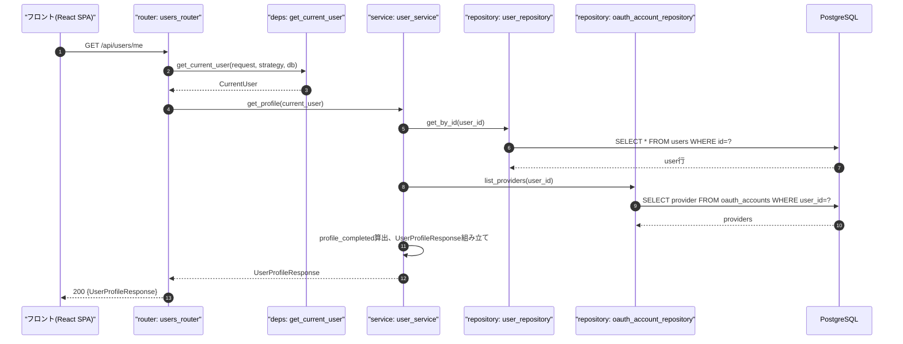
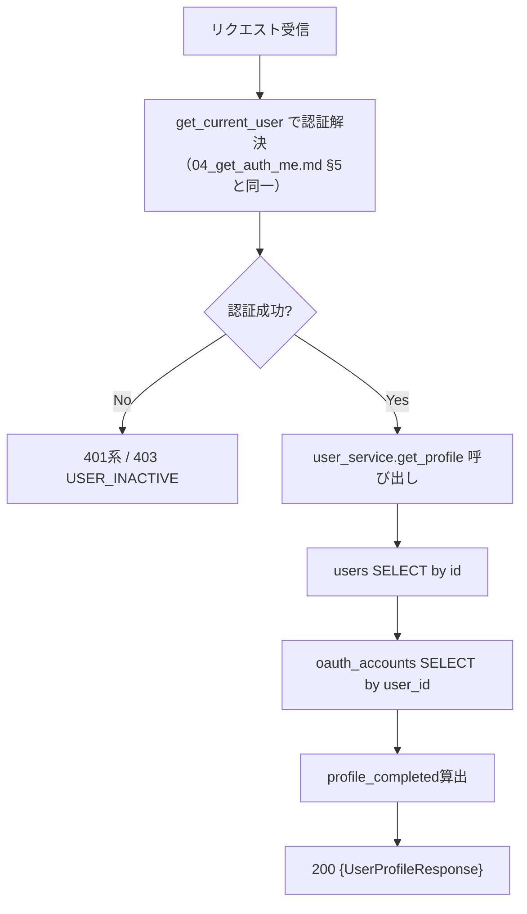
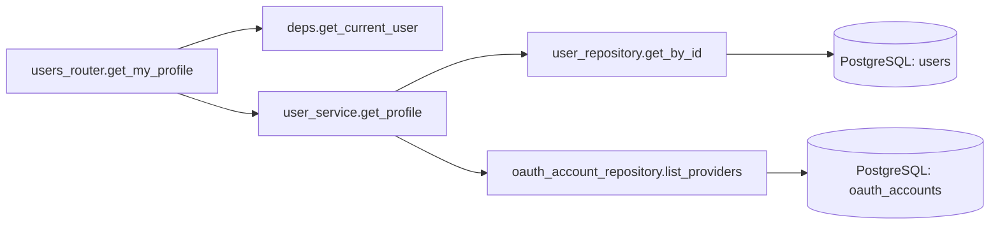
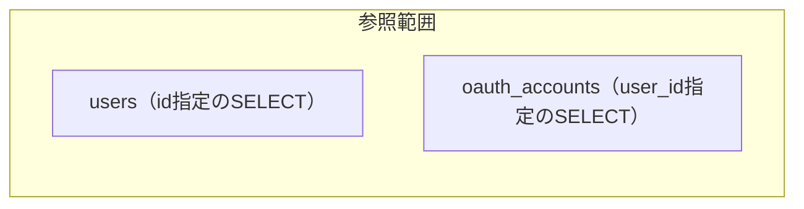

# GET /api/users/me（自分のプロフィール取得）

## 0. 関連ドキュメント

| ドキュメント | パス |
|--------------|------|
| API基本設計 | `../../../basic_design/04_api.md`（§2.2 ユーザーAPI一覧、§3.1 `GET /auth/me` レスポンス例） |
| 認証基本設計 | `../../../basic_design/03_auth.md`（§9.2 `core/deps.py`） |
| DB基本設計 | `../../../basic_design/01_database.md`（§3.1 users） |
| `GET /auth/me` 詳細設計 | `../auth/04_get_auth_me.md` |
| プロフィール更新API | `./02_patch_users_me.md` |
| パスワード変更API | `./03_put_users_me_password.md` |
| ログイン履歴API | `./04_get_users_me_login_history.md` |

## 1. 概要

| 項目 | 内容 |
|------|------|
| エンドポイント | `GET /api/users/me` |
| 目的 | 設定画面（`/settings`）表示時など、自分のプロフィール情報を取得する |
| 認証 | 必要（session：`cerberus_sid` Cookie／jwt：`Authorization: Bearer`） |
| 認可 | 認証済みであれば誰でも（自分自身の情報のみ） |
| CSRF検証 | 不要（参照系メソッド`GET`のため） |
| Origin検証 | 不要（Cookieを新規発行/更新しない参照系のため） |
| AUTH_MODE差異 | 認証経路（Cookie/Bearer）のみ異なる。レスポンス項目・処理内容に差異なし |
| 冪等性 | あり（参照のみ） |
| レート制限 | 対象外 |
| トランザクション境界 | `users` / `oauth_accounts` SELECTのみ（更新なし） |

### 1.1 `GET /api/auth/me` との責務の違い

`04_get_auth_me.md` の `GET /auth/me` と本APIは、レスポンス項目がほぼ同一であるため責務を明確に分離する。

| 観点 | `GET /auth/me` | `GET /api/users/me` |
|------|-----------------|----------------------|
| 主目的 | フロント起動時の**セッション復元**（未認証かどうかの判定を兼ねる） | 設定画面など**プロフィール情報の表示・編集起点**としての取得 |
| 呼び出しタイミング | SPA起動直後・401復帰後など、認証状態の確認を伴う場面 | `/settings` 画面表示時など、認証状態が既に確立している前提の場面 |
| `auth_mode` フィールド | **含む**（フロントのAuthAdapter選択に必須） | **含まない**（認証方式の判定はフロント起動時に`GET /auth/me`または`GET /auth/config`で完結しており、本APIの責務ではない） |
| ルーター | `api/routers/auth_router.py` | `api/routers/users_router.py` |
| サービス層 | `service/auth_service.py` を経由しない（`deps.get_current_user`の結果をそのまま整形） | `service/user_service.py :: get_profile` を経由 |
| 認可上の位置づけ | 認証Strategyの検証結果を示す入り口API | 認証済み前提のリソースAPI（`/api/users`配下） |

いずれも最終的なデータソースは `users` / `oauth_accounts` の現在値であり、レスポンスの信頼性に差はない。フロントは起動時に一度だけ `GET /auth/me` を呼び、以降の設定画面表示では本APIを使う想定とする（要検討：両者を統合し `GET /auth/me` のみに一本化する設計も可能だが、基本設計が2エンドポイントを明記しているため本書では分離を前提とする）。

## 2. 入出力仕様

### 2.1 リクエスト

パスパラメータ：なし　クエリパラメータ：なし　ヘッダ：`Authorization`（jwtモードのみ必須）　Cookie：`cerberus_sid`（sessionモードのみ必須）　ボディ：なし

### 2.2 レスポンス

**200 OK**（`UserProfileResponse`）

```json
{
  "id": "3f1c...",
  "username": "taro",
  "email": "taro@example.com",
  "last_name": "山田",
  "first_name": "太郎",
  "last_name_kana": "ヤマダ",
  "first_name_kana": "タロウ",
  "birth_date": "1995-04-01",
  "profile_completed": true,
  "role": "member",
  "has_password": true,
  "oauth_providers": ["google"]
}
```

| フィールド | 型 | NULL可否 | 説明 |
|-----------|----|----------|------|
| id | string(uuid) | 不可 | |
| username | string | 不可 | |
| email | string | 不可 | |
| last_name / first_name | string | 可（OAuth新規未補完時） | |
| last_name_kana / first_name_kana | string | 可（同上） | |
| birth_date | string(date) | 可（同上） | |
| profile_completed | boolean | 不可 | 上記4項目がすべて設定済みかをサーバーで算出（`02_patch_users_me.md` §算出タイミング参照） |
| role | string | 不可 | `member` / `admin`。PostgreSQLの現在値 |
| has_password | boolean | 不可 | `password_hash IS NOT NULL`。`03_put_users_me_password.md` の分岐に使用 |
| oauth_providers | string[] | 不可（空配列可） | `oauth_accounts.provider` の一覧 |

`auth_mode` は含めない（§1.1参照）。Set-Cookieは発行しない。共通ヘッダ：`X-Request-ID`。`Cache-Control: no-store` を付与する（個人情報のため）。

## 3. エラー仕様

| HTTP | code | 発生条件 | メッセージ | 備考 |
|------|------|----------|------------|------|
| 401 | `UNAUTHENTICATED` | Cookie/Bearerヘッダなし | ログインが必要です | |
| 401 | `SESSION_EXPIRED` | sessionモードでRedisに`session:{sid}`が存在しない | セッションの有効期限が切れました | |
| 401 | `TOKEN_EXPIRED` | jwtモードでaccess tokenの`exp`超過 | トークンの有効期限が切れました | |
| 401 | `TOKEN_INVALID` | jwtモードで署名不正・`typ != 'access'` | トークンが不正です | |
| 403 | `USER_INACTIVE` | `users.is_active = false` | このアカウントは無効化されています | |
| 503 | `SERVICE_UNAVAILABLE` | Redis（session時）/ PostgreSQL接続不能 | 現在サービスをご利用いただけません | fail-close |
| 500 | `INTERNAL_ERROR` | 未捕捉例外 | サーバーエラーが発生しました | |

## 4. 処理シーケンス



## 5. 処理フロー・分岐



## 6. 関数詳細

### 6.1 `api/routers/users_router.py :: get_my_profile`

| 項目 | 内容 |
|------|------|
| シグネチャ | `async def get_my_profile(current_user: CurrentUser = Depends(get_current_user), db: AsyncSession = Depends(get_db)) -> UserProfileResponse` |
| 引数 | `current_user`（DI経由で解決済み）、`db` |
| 戻り値 | `UserProfileResponse`（200） |
| 送出例外 | `get_current_user`から伝播する401/403系 |
| 処理内容 | 1. `user_service.get_profile(current_user, db)` を呼び出し結果をそのまま返す |
| 副作用 | なし（参照のみ） |

### 6.2 `service/user_service.py :: get_profile`

| 項目 | 内容 |
|------|------|
| シグネチャ | `async def get_profile(current_user: CurrentUser, db: AsyncSession) -> UserProfileResponse` |
| 引数 | `current_user`、`db` |
| 戻り値 | `UserProfileResponse` |
| 送出例外 | `NotFoundError`（`user_repository.get_by_id`が`None`を返した場合。認証済み後の取得のため通常発生しない） |
| 処理内容 | 1. `user_repository.get_by_id(db, current_user.id)` 2. `oauth_account_repository.list_providers(db, current_user.id)` 3. 4項目（`last_name`/`first_name`/`last_name_kana`/`first_name_kana`/`birth_date`）の非NULL判定で`profile_completed`を算出 4. `UserProfileResponse`を構築して返す |
| 副作用 | なし |

### 6.3 `repository/user_repository.py :: get_by_id`

`../../database/01_table_users.md` §8.1 を参照（担当外だが再利用する既存関数）。

### 6.4 `repository/oauth_account_repository.py :: list_providers`

`../auth/04_get_auth_me.md` §6.5 を参照（担当外だが再利用する既存関数）。

## 7. 関数相関図



## 8. データ遷移図

読み取りのみで状態遷移なし。



## 9. データアクセス一覧

**PostgreSQL**

| テーブル | 操作 | 条件・TTL | 備考 |
|----------|------|-----------|------|
| users | SELECT | `id = :user_id` | |
| oauth_accounts | SELECT | `user_id = :user_id` | providers一覧 |

**Redis**

sessionモードの認証解決（`GET session:{sid}` → `EXPIRE`）以外の直接アクセスはなし。詳細は `../auth/04_get_auth_me.md` §9を参照。

## 10. バリデーション規則

リクエストパラメータなし。`UserProfileResponse`は出力専用スキーマのため入力バリデーションは無い。

| スキーマ | フィールド | 規則 |
|----------|-----------|------|
| `UserProfileResponse` | profile_completed | `last_name`, `first_name`, `last_name_kana`, `first_name_kana`, `birth_date`のいずれも非NULLなら`true`（サーバー側で算出） |

## 11. 非機能・セキュリティ考慮

| 項目 | 内容 |
|------|------|
| 監査ログ | 記録しない（参照APIのため。成功時はDEBUGレベル以下） |
| ユーザー列挙対策 | 認証済みユーザーの自己参照のみのため対象外 |
| キャッシュ | `Cache-Control: no-store`を付与（個人情報のためブラウザ・プロキシキャッシュ禁止） |
| fail-close方針 | Redis（session時）/PostgreSQL接続不能時は503 |
| 権限情報の正 | `role`はPostgreSQLの現在値を返す（JWT/Redis内の値は使わない） |

## 12. テスト設計

| No | 区分 | ケース | 前提 | 期待結果 | pytest関数名案 |
|----|------|--------|------|----------|-----------------|
| 1 | 単体 | profile_completed算出（4項目全て非NULL） | user_service.get_profile | `true` | `test_get_profile_completed_true` |
| 2 | 単体 | profile_completed算出（未補完） | いずれかがNULL | `false` | `test_get_profile_completed_false` |
| 3 | 単体 | `auth_mode`フィールドが含まれないこと | `UserProfileResponse`スキーマ | フィールド未定義 | `test_user_profile_response_has_no_auth_mode` |
| 4 | 結合 | 正常系（session） | 実PostgreSQL/Redis、ログイン済み | `200`、`GET /auth/me`と同一の基本フィールドを返す | `test_users_me_endpoint_session_success` |
| 5 | 結合 | 正常系（jwt） | 有効なaccess token | `200` | `test_users_me_endpoint_jwt_success` |
| 6 | 結合 | 未認証 | Cookie/ヘッダなし | `401 UNAUTHENTICATED` | `test_users_me_endpoint_unauthenticated` |
| 7 | 結合 | 無効化ユーザー | `is_active=false`のユーザーでログイン済みCookie | `403 USER_INACTIVE` | `test_users_me_endpoint_inactive_user` |
| 8 | 結合 | OAuth新規ユーザー | プロフィール未補完 | `profile_completed=false` | `test_users_me_endpoint_oauth_incomplete_profile` |

`AUTH_MODE=session`/`jwt`の両方で4・5を実施する。

## 13. 不明点・要検討事項

| 区分 | 内容 | 影響 |
|------|------|------|
| 要検討 | 基本設計（`04_api.md` §2.2）は `GET /users/me` の存在のみを定め、レスポンス項目を明記していない。本書では `GET /auth/me` から `auth_mode` を除いた項目を採用したが、この設計判断が正しいかは要確認 |
| 要検討 | `GET /auth/me` とレスポンス項目がほぼ重複しており、将来的に一方へ統合すべきかは基本設計レベルでの再検討事項とする |
